```mermaid
flowchart TD
    A["Why does this work?"] --> B["Subtracting 1 flips<br/>all bits after<br/>rightmost 1"]
    B --> C["Power of 2:<br/>Only ONE bit set"]
    C --> D["After flip:<br/>No overlap = 0"]
    
    B --> E["Not power of 2:<br/>Multiple bits set"]
    E --> F["After flip:<br/>Still overlap ≠ 0"]
    
    style C fill:#e8f5e8
    style D fill:#c8e6c9
    style E fill:#ffebee
    style F fill:#ffcdd2
```

# Day 11: Two Classic LeetCode Problems - Complete Beginner's Guide

> **Master array manipulation and bit operations step by step!**

---

## 📚 What You'll Learn

By the end of this guide, you'll master:
- 🔍 **Array Search Algorithms** - Finding pairs that meet specific conditions
- 🗺️ **Hash Map Optimization** - Trading space for speed efficiency
- ⚖️ **Brute Force vs Optimized** - Understanding algorithmic tradeoffs
- 🔢 **Bit Manipulation** - Using bitwise operations for elegant solutions
- 📊 **Time-Space Complexity** - Analyzing and comparing different approaches

---

# Part 1: Two Sum Problem (LeetCode #1)

## 🎯 The Problem

### 📋 Problem Statement

**Given**: An array of integers `nums` and an integer `target`  
**Task**: Return **indices** of the two numbers such that they add up to `target`  
**Guarantee**: Exactly one solution exists, and you can't use the same element twice

### 🌟 Real-World Example

Think of it like finding two puzzle pieces that fit together:
- 🛒 **Shopping**: Finding two items that exactly match your budget
- 🧪 **Chemistry**: Mixing two substances to reach a target concentration
- 💰 **Finance**: Combining two investments to reach a target portfolio value

---

## 🧠 Understanding the Basics

### 🔢 What is a Pair Sum?


**Key Concept:**
- We need to find TWO numbers that add up to a specific target
- We return the **positions** (indices), not the numbers themselves
- Each element can only be used once

### 📍 Array Index System


---

## 📖 Step-by-Step Examples

### 🟢 Example 1: Basic Case

**Input:** `nums = [2, 7, 11, 15]`, `target = 9`  
**Output:** `[0, 1]`


**Step-by-step breakdown:**
1. **Check indices (0, 1):** `nums[0] + nums[1] = 2 + 7 = 9` ✅
2. **Match found!** Return `[0, 1]`
3. **Verification:** `2 + 7 = 9` equals target

### 🔵 Example 2: Later in Array

**Input:** `nums = [3, 2, 4]`, `target = 6`  
**Output:** `[1, 2]`


**Step-by-step breakdown:**
1. **Pair (0,1):** `3 + 2 = 5` ❌ Not target
2. **Pair (0,2):** `3 + 4 = 7` ❌ Not target
3. **Pair (1,2):** `2 + 4 = 6` ✅ Match found!
4. **Return:** `[1, 2]`

### 🟡 Example 3: Same Value, Different Indices

**Input:** `nums = [3, 3]`, `target = 6`  
**Output:** `[0, 1]`


**Important Note:** Same **value** is OK if at different **indices**!

---

## 🛠️ The Algorithm - Brute Force Approach

### 🎯 Main Strategy: Check All Pairs


### 💻 The Code Logic - Brute Force

```cpp
vector<int> twoSum(vector<int>& nums, int target) {
    int n = nums.size();
    
    // Outer loop: Pick first number
    for (int i = 0; i < n; i++) {
        // Inner loop: Check against all numbers after it
        for (int j = i + 1; j < n; j++) {
            if (nums[i] + nums[j] == target) {
                return {i, j};  // Found!
            }
        }
    }
    
    return {};  // No solution found
}
```

### 🔄 Execution Flow Visualization


---

## 🚀 Optimized Approach: Hash Map

### 💡 Key Insight

Instead of checking every pair, we can use a hash map to remember what we've seen!


### 💻 Hash Map Solution Code

```cpp
vector<int> twoSum(vector<int>& nums, int target) {
    // Create hash map to store: value -> index
    unordered_map<int, int> map;
    
    // Iterate through array
    for (int i = 0; i < nums.size(); i++) {
        // Calculate what number we need
        int complement = target - nums[i];
        
        // Check if complement exists in map
        if (map.find(complement) != map.end()) {
            // Found! Return the two indices
            return {map[complement], i};
        }
        
        // Store current number and its index
        map[nums[i]] = i;
    }
    
    // No solution found (shouldn't happen per problem guarantee)
    return {};
}
```

### 📝 Step-by-step Hash Map Explanation

```cpp
// Example: nums = [2, 7, 11, 15], target = 9

// Iteration 1: i = 0, nums[i] = 2
int complement = 9 - 2 = 7;           // We need 7
map.find(7) == map.end()               // 7 not in map yet
map[2] = 0;                            // Store: map = {2: 0}

// Iteration 2: i = 1, nums[i] = 7
int complement = 9 - 7 = 2;           // We need 2
map.find(2) != map.end()               // 2 IS in map! ✅
return {map[2], 1};                    // Return {0, 1}
```

### 🔄 Complete Hash Map Walkthrough


**Why this works:**
1. **Forward pass only**: We only go through array once
2. **Instant lookup**: Hash map gives O(1) search time
3. **Store as we go**: Each number is added after checking
4. **Prevents self-pairing**: Current index `i` is always greater than stored indices

### 📊 Hash Map Approach Visualization

**Example:** `nums = [2, 7, 11, 15]`, `target = 9`

```mermaid
flowchart LR
    A["Step 1: See 2<br/>Need: 7<br/>Map: {2→0}"] --> B["Step 2: See 7<br/>7 in map?<br/>YES!"]
    B --> C["Return: [0, 1]"]
    
    style A fill:#e3f2fd
    style B fill:#fff3e0
    style C fill:#c8e6c9
```



### ⚡ Performance Comparison


---

## 🧪 Test Cases & Edge Cases

### ✅ Normal Cases

| Input Array | Target | Output | Explanation |
|-------------|--------|--------|-------------|
| `[2, 7, 11, 15]` | `9` | `[0, 1]` | First two elements |
| `[3, 2, 4]` | `6` | `[1, 2]` | Middle and last |
| `[3, 3]` | `6` | `[0, 1]` | Same values, different indices |

### ⚠️ Edge Cases

| Input Array | Target | Output | Explanation |
|-------------|--------|--------|-------------|
| `[0, 4, 3, 0]` | `0` | `[0, 3]` | Zero values |
| `[-3, 4, 3, 90]` | `0` | `[0, 2]` | Negative numbers |
| `[5, 10]` | `15` | `[0, 1]` | Minimum array size |

### 🎯 Test Coverage

```mermaid
flowchart TD
    A["Test Categories"] --> B["Positive Numbers<br/>✅ Basic cases"]
    A --> C["Negative Numbers<br/>⚠️ Edge case handling"]
    A --> D["Zero Values<br/>⚠️ Special case"]
    A --> E["Large Numbers<br/>✅ Boundary testing"]
    
    B --> F["Example: 2+7=9"]
    C --> G["Example: -3+3=0"]
    D --> H["Example: 0+0=0"]
    E --> I["Example: 1M+2M=3M"]
    
    style B fill:#e8f5e8
    style C fill:#fff3e0
    style D fill:#fff3e0
    style E fill:#e3f2fd
```



---

## 📊 Complexity Analysis - Two Sum

### ⏰ Time Complexity

**Brute Force: O(n²)**
- Outer loop: n iterations
- Inner loop: (n-1) + (n-2) + ... + 1 = n(n-1)/2 iterations
- Total: O(n²)

**Hash Map: O(n)**
- Single pass through array: n iterations
- Hash map lookup: O(1) per element
- Total: O(n)


### 💾 Space Complexity

**Brute Force: O(1)**
- Only a few variables used
- No extra data structures

**Hash Map: O(n)**
- Store up to n elements in hash map
- Trade space for speed

---

## 💼 Interview Questions & Answers - Two Sum

### ❓ Question 1: Why is the brute force approach O(n²)?

**Answer:**  
We use nested loops. For each element (n times), we check it against all remaining elements (average n/2 times). This gives us n × n/2 = n²/2, which simplifies to O(n²).

**Simple Explanation:**  
If you have 100 numbers, in the worst case you'll make about 5,000 comparisons (100 × 50).

---

### ❓ Question 2: Can we use the same element twice?

**Answer:**  
**No!** The problem explicitly states we can't use the same element twice. That's why our inner loop starts at `j = i + 1`, not `j = i`.

**Code Proof:**
```cpp
for (int i = 0; i < n; i++) {
    for (int j = i + 1; j < n; j++) {  // j starts AFTER i
        // This ensures i ≠ j
    }
}
```

---

### ❓ Question 3: What if there are multiple valid pairs?

**Answer:**  
The problem guarantees **exactly one solution** exists. Our algorithm returns the first valid pair it finds, which is perfectly acceptable.

**Simple Explanation:**  
Think of it like a treasure hunt where you're guaranteed exactly one treasure. Once you find it, you're done!

---

### ❓ Question 4: How does the hash map approach work?

**Answer:**  
For each number, we calculate its complement (target - current). If the complement is in our hash map, we've found our pair! Otherwise, we add the current number to the map.

**Visual Example:**
```
Array: [2, 7, 11, 15], Target: 9

Step 1: See 2
        Complement: 9 - 2 = 7
        Is 7 in map? No
        Add: map[2] = 0

Step 2: See 7
        Complement: 9 - 7 = 2
        Is 2 in map? YES! (index 0)
        Return: [0, 1]
```

---

### ❓ Question 5: What's the trade-off between approaches?

**Answer:**  
- **Brute Force:** Simple, no extra space, but slow (O(n²))
- **Hash Map:** Fast (O(n)), but uses extra space (O(n))

**Simple Explanation:**  
It's like choosing between:
- Walking (slow but free)
- Taxi (fast but costs money)

---

# Part 2: Power of Two Problem (LeetCode #231)

## 🎯 The Problem

### 📋 Problem Statement

**Given**: An integer `n`  
**Task**: Return `true` if `n` is a power of two, otherwise return `false`  
**Definition**: A number is a power of two if there exists an integer `x` such that n = 2^x

### 🌟 Real-World Example

Think of powers of two in daily life:
- 💾 **Computer Memory**: 1GB, 2GB, 4GB, 8GB, 16GB, 32GB (all powers of 2)
- 🌳 **Tree Structures**: Perfect binary trees have 1, 2, 4, 8, 16... nodes
- 🖼️ **Pixel Dimensions**: 256×256, 512×512, 1024×1024 images

---

## 🔍 Understanding Powers of Two

### 📊 Powers of Two Table

| Exponent | Value | Binary |
|----------|-------|--------|
| 2^0 | 1 | 1 |
| 2^1 | 2 | 10 |
| 2^2 | 4 | 100 |
| 2^3 | 8 | 1000 |
| 2^4 | 16 | 10000 |
| 2^5 | 32 | 100000 |
| 2^10 | 1024 | 10000000000 |


### 🔑 Key Observation

**Powers of two have exactly ONE bit set in binary representation!**


---

## 🎪 The Magic Bit Trick

### 🪄 n & (n-1) Trick Explained

**Rule:** If `n` is a power of 2, then `n & (n-1) == 0`

```mermaid
flowchart TD
    A["Number n"] --> B{"Is power of 2?"}
    B -->|YES| C["Exactly ONE bit set"]
    B -->|NO| D["Multiple bits set"]
    
    C --> E["n & (n-1) = 0"]
    D --> F["n & (n-1) ≠ 0"]
    
    E --> G["Return TRUE"]
    F --> H["Return FALSE"]
    
    style C fill:#e8f5e8
    style D fill:#ffebee
    style G fill:#c8e6c9
    style H fill:#ffcdd2
```



### 🔬 How the Trick Works

**Example 1: n = 8 (Power of 2)**
```
n     = 8  = 1000  (binary)
n - 1 = 7  = 0111  (binary)
n & (n-1)  = 0000  (binary) = 0 ✅
```

**Example 2: n = 6 (NOT Power of 2)**
```
n     = 6  = 0110  (binary)
n - 1 = 5  = 0101  (binary)
n & (n-1)  = 0100  (binary) = 4 ❌
```



---

## 📚 Step-by-Step Examples

### 🟢 Example 1: n = 1

**Input:** `n = 1`  
**Output:** `true` (2^0 = 1)


**Analysis:**
- `n = 1` (binary: `1`)
- `n - 1 = 0` (binary: `0`)
- `1 & 0 = 0` ✅
- Result: `true`

---

### 🔵 Example 2: n = 16

**Input:** `n = 16`  
**Output:** `true` (2^4 = 16)


**Step-by-step:**
1. `n = 16` = `10000` in binary
2. `n - 1 = 15` = `01111` in binary
3. `10000 & 01111 = 00000` = `0`
4. Since result is 0, return `true` ✅

---

### 🔴 Example 3: n = 3

**Input:** `n = 3`  
**Output:** `false`


**Analysis:**
- `n = 3` (binary: `11`) - TWO bits set
- `n - 1 = 2` (binary: `10`)
- `11 & 10 = 10` = `2` ≠ `0` ❌
- Result: `false`

---

### 🟡 Example 4: n = 5

**Input:** `n = 5`  
**Output:** `false`

```mermaid
flowchart TD
    A["n = 5"] --> B["Binary: 101"]
    B --> C["Two bits set<br/>NOT power of 2"]
    C --> D["101 & 100 = 100"]
    D --> E["Result: 4<br/>Return FALSE"]
    
    style A fill:#fff8e1
    style E fill:#ffecb3
```

**Step-by-step:**
1. `n = 5` = `101` in binary (bits at positions 0 and 2)
2. `n - 1 = 4` = `100` in binary
3. `101 & 100 = 100` = `4` ≠ `0` ❌
4. Result: `false`

---

## 🛠️ The Algorithm

### 🎯 Main Strategy

```mermaid
flowchart TD
    A["Input: n"] --> B{"n > 0?"}
    B -->|NO| C["Return FALSE<br/>Powers of 2<br/>are positive"]
    B -->|YES| D["Calculate n & (n-1)"]
    D --> E{"Result == 0?"}
    E -->|YES| F["Return TRUE<br/>Power of 2"]
    E -->|NO| G["Return FALSE<br/>Not power of 2"]
    
    style A fill:#e3f2fd
    style C fill:#ffcdd2
    style F fill:#c8e6c9
    style G fill:#ffcdd2
```

### 💻 The Complete Solution

```cpp
bool isPowerOfTwo(int n) {
    // Must be positive AND have only one bit set
    return (n > 0 && (n & (n - 1)) == 0);
}
```

### 🔍 Why Check n > 0?

```mermaid
flowchart TD
    A["Why n > 0?"] --> B["Zero: 0 is NOT<br/>a power of 2"]
    A --> C["Negative: Powers of 2<br/>are always positive"]
    
    B --> D["0 is 2^x?<br/>NO value of x works"]
    C --> E["-16 is NOT<br/>considered 2^x"]
    
    style B fill:#ffebee
    style C fill:#ffebee
```

**Edge Cases Handled:**
- `n = 0`: Not a power of 2 (no exponent gives 0)
- `n < 0`: Negative numbers aren't powers of 2
- `n = 1`: Valid! (2^0 = 1)

---

## 🧪 Test Cases & Edge Cases - Power of Two

### ✅ Valid Powers of Two

| Input | Output | Explanation |
|-------|--------|-------------|
| `1` | `true` | 2^0 = 1 |
| `2` | `true` | 2^1 = 2 |
| `4` | `true` | 2^2 = 4 |
| `8` | `true` | 2^3 = 8 |
| `16` | `true` | 2^4 = 16 |
| `1024` | `true` | 2^10 = 1024 |

### ❌ Not Powers of Two

| Input | Output | Explanation |
|-------|--------|-------------|
| `3` | `false` | Multiple bits: 11 |
| `5` | `false` | Multiple bits: 101 |
| `6` | `false` | Multiple bits: 110 |
| `7` | `false` | Multiple bits: 111 |
| `0` | `false` | Zero is not 2^x |
| `-16` | `false` | Negative numbers |

### 🎯 Binary Representation Analysis

```mermaid
flowchart TD
    A["Test Analysis"] --> B["Powers of 2<br/>✅ One bit"]
    A --> C["Non-powers<br/>❌ Multiple/zero bits"]
    
    B --> D["1 = 1<br/>2 = 10<br/>4 = 100<br/>8 = 1000"]
    C --> E["3 = 11<br/>5 = 101<br/>6 = 110<br/>7 = 111"]
    
    style B fill:#e8f5e8
    style C fill:#ffebee
```

---

## 📊 Complexity Analysis - Power of Two

### ⏰ Time Complexity: O(1)

**Why constant time?**
- Single bitwise operation: `n & (n-1)`
- One comparison: `n > 0`
- No loops, no recursion
- Always completes in fixed time

```mermaid
flowchart LR
    A["Any input size"] --> B["1 operation"]
    B --> C["O(1) time"]
    
    style A fill:#e3f2fd
    style C fill:#c8e6c9
```

### 💾 Space Complexity: O(1)

**Why constant space?**
- No arrays or data structures
- Only a few variables
- No recursion stack

---

## 🎓 Alternative Approaches

### 🔄 Approach 1: Division Loop

```cpp
bool isPowerOfTwo(int n) {
    if (n <= 0) return false;
    while (n % 2 == 0) {
        n /= 2;
    }
    return n == 1;
}
```

**Complexity:**
- Time: O(log n)
- Space: O(1)
- Slower than bit manipulation!

### 🔄 Approach 2: Bit Counting

```cpp
bool isPowerOfTwo(int n) {
    if (n <= 0) return false;
    return __builtin_popcount(n) == 1;
}
```

**Complexity:**
- Time: O(1) (but library-dependent)
- Space: O(1)
- Uses built-in function to count set bits

### 📊 Approach Comparison

```mermaid
flowchart TD
    A["Three Approaches"] --> B["Bit Manipulation<br/>Time: O(1)<br/>Best: Elegant one-liner"]
    A --> C["Division Loop<br/>Time: O(log n)<br/>OK: Easy to understand"]
    A --> D["Bit Counting<br/>Time: O(1)<br/>Good: Built-in function"]
    
    style B fill:#c8e6c9
    style C fill:#fff3e0
    style D fill:#e3f2fd
```

---

## 💼 Interview Questions & Answers - Power of Two

### ❓ Question 1: Why does n & (n-1) work?

**Answer:**  
For a power of 2, there's exactly ONE bit set. When you subtract 1, all bits to the right of that 1 become 1, and the original 1 becomes 0. The AND operation then gives 0 because there's no overlap.

**Visual:**
```
n = 8:     1000
n - 1 = 7: 0111
AND:       0000 ✅
```

---

### ❓ Question 2: What about n = 0?

**Answer:**  
**Zero is NOT a power of 2!** There's no exponent `x` where 2^x = 0. That's why we check `n > 0`.

**Simple Explanation:**  
No matter how many times you divide 2 by itself or multiply it, you'll never get zero!

---

### ❓ Question 3: Can negative numbers be powers of two?

**Answer:**  
**No!** In this problem, we only consider positive powers: 2^0, 2^1, 2^2, etc. All of these are positive.

**Note:** Some math contexts use negative exponents (2^-1 = 0.5), but this problem only deals with integers.

---

### ❓ Question 4: Why is bit manipulation faster than division?

**Answer:**  
Bit operations are performed directly by the CPU in a single cycle, while division requires multiple cycles and is one of the slowest arithmetic operations.

**Speed Comparison:**
```
Bit operation (n & (n-1)): ~1 CPU cycle
Division (n / 2):          ~10-40 CPU cycles
```

---

### ❓ Question 5: How do I remember this trick?

**Answer:**  
Remember the pattern: **"Powers of 2 have exactly one bit, subtracting 1 flips all bits after it."**

**Mnemonic:** Think of a light switch - powers of 2 have exactly ONE light on. Subtracting 1 turns that light off and all lights after it on.

---

## 🎯 Quick Reference

### 🔑 Essential Patterns

**Two Sum - Brute Force:**
```cpp
vector<int> twoSum(vector<int>& nums, int target) {
    int n = nums.size();
    // Check all pairs
    for (int i = 0; i < n; i++) {
        for (int j = i + 1; j < n; j++) {
            if (nums[i] + nums[j] == target) {
                return {i, j};
            }
        }
    }
    return {};
}
```

**Two Sum - Hash Map (Optimized):**
```cpp
vector<int> twoSum(vector<int>& nums, int target) {
    unordered_map<int, int> map;
    for (int i = 0; i < nums.size(); i++) {
        int complement = target - nums[i];
        if (map.find(complement) != map.end()) {
            return {map[complement], i};
        }
        map[nums[i]] = i;
    }
    return {};
}
```

**Power of Two:**
```cpp
bool isPowerOfTwo(int n) {
    // Bit manipulation trick
    return (n > 0 && (n & (n - 1)) == 0);
}
```

### 🧠 Mental Models

```mermaid
flowchart TD
    A["Problem Solving"] --> B["Two Sum:<br/>Pair finding"]
    A --> C["Power of Two:<br/>Pattern recognition"]
    
    B --> D["Trade-off:<br/>Time vs Space"]
    C --> E["Bit trick:<br/>Elegant solution"]
    
    style A fill:#e1f5fe
    style B fill:#e8f5e8
    style C fill:#fff3e0
```

---

## 🏆 Mastery Checklist

### Two Sum
- [ ] ✅ Understand brute force approach O(n²)
- [ ] ✅ Master hash map optimization O(n)
- [ ] ✅ Handle edge cases (zeros, negatives, duplicates)
- [ ] ✅ Explain space-time trade-offs
- [ ] ✅ Code both approaches fluently

### Power of Two
- [ ] ✅ Understand binary representation of powers of 2
- [ ] ✅ Master n & (n-1) bit trick
- [ ] ✅ Handle edge cases (zero, negative, one)
- [ ] ✅ Explain why the trick works mathematically
- [ ] ✅ Compare with alternative approaches

---

## 💡 Pro Tips

1. **🎯 Two Sum**: Always consider hash map for pair-finding problems - O(n²) to O(n) is huge!
2. **🔢 Bit Manipulation**: Powers of 2 appear everywhere in CS - master this pattern
3. **🧪 Test Edge Cases**: Always check: zero, negative, minimum/maximum values
4. **📚 Learn Patterns**: These are foundational - many problems build on these concepts
5. **🎓 Understand Trade-offs**: Know when to use brute force vs optimization
6. **💼 Interview Prep**: Be ready to explain YOUR thought process, not just the solution
7. **⚡ Practice**: Solve variations to cement understanding

---

## 🚀 Practice Problems

Once you master these, try:

| Problem | Difficulty | Key Concept |
|---------|-----------|-------------|
| 🔢 Three Sum | Medium | Extend two sum concept |
| 💫 Power of Three | Easy | Similar bit patterns |
| 🎯 Four Sum | Medium | Pair finding extension |
| 🔄 Happy Number | Easy | Number manipulation |
| 📊 Contains Duplicate | Easy | Hash map usage |
| 🧮 Single Number | Easy | Bit manipulation |

---

## 📝 Summary

### What We Learned

**Two Sum Problem:**
- ✅ Brute force approach checks all pairs in O(n²)
- ✅ Hash map optimization reduces time to O(n)
- ✅ Trade-off: Use more space (O(n)) for faster time
- ✅ Key insight: Store complements as you go

**Power of Two Problem:**
- ✅ Powers of 2 have exactly one bit set in binary
- ✅ The trick `n & (n-1) == 0` works perfectly
- ✅ Always check `n > 0` to handle edge cases
- ✅ Bit manipulation is O(1) and elegant

### Key Takeaways

```mermaid
flowchart TD
    A["Core Concepts"] --> B["Hash Maps:<br/>Speed up searches"]
    A --> C["Bit Operations:<br/>Elegant solutions"]
    A --> D["Trade-offs:<br/>Time vs Space"]
    
    B --> E["Two Sum<br/>O(n²) → O(n)"]
    C --> F["Power of Two<br/>O(log n) → O(1)"]
    D --> G["Choose wisely<br/>based on constraints"]
    
    style A fill:#e3f2fd
    style B fill:#e8f5e8
    style C fill:#fff3e0
    style D fill:#ffecb3
```

---

## 🎓 Interview Tips

### When Asked Two Sum:
1. **Start with brute force** - Show you understand the problem
2. **Identify the bottleneck** - Nested loops are slow
3. **Propose hash map** - Explain the optimization
4. **Discuss trade-offs** - Time vs space complexity
5. **Handle edge cases** - Zeros, negatives, duplicates

### When Asked Power of Two:
1. **Recognize the pattern** - Powers of 2 have one bit
2. **Explain the bit trick** - Why `n & (n-1)` works
3. **Handle edge cases** - Zero and negative numbers
4. **Compare approaches** - Show you know alternatives
5. **Discuss applications** - Real-world uses in CS

---

## 🔗 Additional Resources

### For Two Sum:
- LeetCode Problem #1: Two Sum
- Related: Three Sum, Four Sum, Two Sum II
- Pattern: Hash Map for pair finding

### For Power of Two:
- LeetCode Problem #231: Power of Two
- Related: Power of Three, Power of Four
- Pattern: Bit manipulation tricks

### General:
- Study hash map implementations
- Practice bit manipulation basics
- Learn Big O notation deeply
- Solve variations of these problems

---

## 🎯 Next Steps

1. **Practice Both Problems** - Code them without looking
2. **Solve Variations** - Try Three Sum, Power of Three
3. **Time Yourself** - Practice under interview conditions
4. **Explain Out Loud** - Teach someone else
5. **Review Edge Cases** - Make a checklist
6. **Study Patterns** - Recognize when to use these techniques

---

## ✨ Final Thoughts

These two problems are **fundamental building blocks** in coding interviews:

- **Two Sum** teaches you about optimization and hash maps
- **Power of Two** introduces bit manipulation elegance

Master these, and you'll have a solid foundation for tackling more complex problems!

```mermaid
flowchart LR
    A["Day 11 Complete! 🎉"] --> B["Two Sum ✅"]
    A --> C["Power of Two ✅"]
    
    B --> D["Hash Map Master"]
    C --> E["Bit Manipulation Pro"]
    
    D --> F["Ready for Day 12! 🚀"]
    E --> F
    
    style A fill:#c8e6c9
    style F fill:#81c784
```

---

**🎉 Congratulations! You now have a complete understanding of array pair finding and bit manipulation. These are fundamental building blocks for more complex algorithms. Keep practicing and happy coding! 🚀**

---

## 📌 Quick Command Reference

### Two Sum Commands:
```cpp
// Brute Force
for (i = 0; i < n; i++)
    for (j = i+1; j < n; j++)
        if (nums[i] + nums[j] == target)
            return {i, j};

// Hash Map
unordered_map<int, int> map;
int complement = target - nums[i];
if (map.count(complement))
    return {map[complement], i};
map[nums[i]] = i;
```

### Power of Two Commands:
```cpp
// Main trick
return (n > 0 && (n & (n-1)) == 0);

// Alternative
while (n % 2 == 0) n /= 2;
return n == 1;
```

---

**Happy Coding! 💻✨**
