# Day 12: 🔍 Smallest Index With Digit Sum Equal to Index - Complete Beginner's Guide

> **Master digit manipulation and array traversal step by step!**


---

## 📖 What You'll Learn

By the end of this guide, you'll master:
- 🔢 **Digit Extraction** - How to extract and sum individual digits efficiently
- 🔄 **Array Traversal** - Linear search patterns and early termination
- 🎯 **Index Matching** - Understanding the relationship between indices and values
- 🧮 **Mathematical Operations** - Using modulo and division for digit manipulation

---

## 🎯 The Problem

### 📋 Problem Statement

**Given**: An integer array `nums`  
**Task**: Return the smallest index `i` where the sum of digits of `nums[i]` equals `i`  
**Return**: `-1` if no such index exists

**Important Rule**: You need to find the SMALLEST (leftmost) matching index!

### 🌟 Real-World Example

Think of it like finding a special parking spot:
- **Spot 0** has car number **0** → Digit sum = 0, matches spot 0! ✓
- **Spot 1** has car number **3** → Digit sum = 3, doesn't match spot 1 ✗
- **Spot 2** has car number **2** → Digit sum = 2, matches spot 2! ✓

We want the FIRST matching spot (smallest index).

---

## 🔍 Understanding the Basics

### 🏗️ What is Digit Sum?


**Simple Definition:**
- Take each digit of a number
- Add them all together
- That's your digit sum!

### 🎲 Digit Extraction Process

Here's how we extract digits from a number:


**Key Operations:**
- `number % 10` → Gets the last digit
- `number / 10` → Removes the last digit
- Keep going until number becomes 0

---

## 📚 Step-by-Step Examples

### 🟢 Example 1: Basic Match at Index 2

**Input:** `nums = [1, 3, 2]`  
**Output:** `2`

```mermaid
flowchart TD
    A[Start: nums = 1, 3, 2] --> B[Index 0: nums[0] = 1]
    B --> C[Digit sum of 1 = 1]
    C --> D{1 == 0?}
    D -->|NO| E[Index 1: nums[1] = 3]
    E --> F[Digit sum of 3 = 3]
    F --> G{3 == 1?}
    G -->|NO| H[Index 2: nums[2] = 2]
    H --> I[Digit sum of 2 = 2]
    I --> J{2 == 2?}
    J -->|YES| K[Return 2 ✅]
    
    style A fill:#e8f5e8
    style K fill:#4caf50
```

**Step-by-step breakdown:**
1. **Index 0:** `nums[0] = 1`, digit sum = 1, but index = 0 → No match
2. **Index 1:** `nums[1] = 3`, digit sum = 3, but index = 1 → No match
3. **Index 2:** `nums[2] = 2`, digit sum = 2, index = 2 → **Match!** ✓

### 🔴 Example 2: Match at Index 0

**Input:** `nums = [0, 1, 2]`  
**Output:** `0`

```mermaid
flowchart TD
    A[Start: nums = 0, 1, 2] --> B[Index 0: nums[0] = 0]
    B --> C[Digit sum of 0 = 0]
    C --> D{0 == 0?}
    D -->|YES| E[Return 0 ✅<br/>First match found!]
    
    style A fill:#e8f5e8
    style E fill:#4caf50
```

**Key Point:** We find the match immediately at index 0!

### 🟡 Example 3: No Match Found

**Input:** `nums = [10, 20, 30]`  
**Output:** `-1`

```mermaid
flowchart TD
    A[Start: nums = 10, 20, 30] --> B[Index 0: nums[0] = 10]
    B --> C[Digit sum = 1+0 = 1]
    C --> D{1 == 0?}
    D -->|NO| E[Index 1: nums[1] = 20]
    E --> F[Digit sum = 2+0 = 2]
    F --> G{2 == 1?}
    G -->|NO| H[Index 2: nums[2] = 30]
    H --> I[Digit sum = 3+0 = 3]
    I --> J{3 == 2?}
    J -->|NO| K[Array exhausted<br/>Return -1 ❌]
    
    style A fill:#fff8e1
    style K fill:#ffcdd2
```

**Result:** No index matches its element's digit sum!

### 🚀 Example 4: Two-Digit Match

**Input:** `nums = [10, 20, 11, 15]`  
**Output:** `2`

```mermaid
flowchart TD
    A[Index 2: nums[2] = 11] --> B[Extract digit: 11 % 10 = 1]
    B --> C[sum = 0 + 1 = 1]
    C --> D[Remove digit: 11 / 10 = 1]
    D --> E[Extract digit: 1 % 10 = 1]
    E --> F[sum = 1 + 1 = 2]
    F --> G[Remove digit: 1 / 10 = 0]
    G --> H[Final sum = 2]
    H --> I{sum == index?<br/>2 == 2?}
    I -->|YES| J[Match found! ✅]
    
    style A fill:#e3f2fd
    style F fill:#fff3e0
    style J fill:#c8e6c9
```

**Analysis:**
- `nums[2] = 11`
- Digit sum = 1 + 1 = 2
- Index = 2
- **Perfect match!**

---

## 🛠️ The Algorithm

### 🎯 Main Strategy: Linear Search with Digit Sum

```mermaid
flowchart TD
    A[Start: index i = 0] --> B{i < array length?}
    B -->|NO| C[No match found<br/>Return -1]
    B -->|YES| D[Get nums[i]]
    D --> E[Calculate digit sum]
    E --> F{digit sum == i?}
    F -->|YES| G[Found match!<br/>Return i]
    F -->|NO| H[Increment i]
    H --> B
    
    style A fill:#e8f5e8
    style E fill:#fff3e0
    style G fill:#4caf50
    style C fill:#ffcdd2
```

### 💻 The Code

```cpp
int smallestIndex(vector<int>& nums) {
    // Iterate through each index
    for(int i = 0; i < nums.size(); i++){
        int temp = nums[i];
        int sum = 0;
        
        // Calculate digit sum
        while(temp != 0){
            sum += temp % 10;  // Add last digit
            temp /= 10;        // Remove last digit
        }
        
        // Check if digit sum matches index
        if(i == sum) return i;
    }
    
    return -1;  // No match found
}
```

### 🔄 Digit Sum Calculation Explained


**The Process:**
1. Start with sum = 0
2. Extract last digit using `% 10`
3. Add it to sum
4. Remove last digit using `/ 10`
5. Repeat until number becomes 0

---

## 🧪 Test Cases & Edge Cases

### ✅ Normal Cases

| Input | Output | Why |
|-------|--------|-----|
| `[1, 3, 2]` | `2` | nums[2]=2, sum=2, match! |
| `[0, 1, 2]` | `0` | nums[0]=0, sum=0, match at start! |
| `[10, 20, 11]` | `2` | nums[2]=11, sum=1+1=2, match! |

### ⚠️ Edge Cases

| Input | Output | Why |
|-------|--------|-----|
| `[10, 20, 30]` | `-1` | No index matches |
| `[0]` | `0` | Single element match |
| `[5]` | `-1` | Single element no match |
| `[99, 101, 95]` | `-1` | Large numbers, no match |

### 🎯 Test Case Categories


---

## 🎓 Key Concepts Mastery

### 🔢 Digit Extraction Techniques

**1. Extract Last Digit:**
```cpp
int lastDigit = number % 10;
// Example: 1234 % 10 = 4
```

**2. Remove Last Digit:**
```cpp
number = number / 10;
// Example: 1234 / 10 = 123
```

**3. Calculate Digit Sum:**
```cpp
int sum = 0;
while(number != 0) {
    sum += number % 10;
    number /= 10;
}
// Example: 123 → sum = 1+2+3 = 6
```

### 🔍 Array Traversal Patterns


**Pattern to Remember:**
- Start from leftmost (index 0)
- Check each element
- Return immediately when found
- This ensures "smallest" index

### 🎯 Problem-Solving Framework


---

## 📊 Complexity Analysis

### ⏰ Time Complexity: O(n × d)

**Where:**
- `n` = number of elements in array
- `d` = average number of digits per element

**Why?**
- We visit each array element once: O(n)
- For each element, we extract all digits: O(d)
- Combined: O(n × d)

```mermaid
flowchart TD
    A[Array of n elements] --> B[For each element:<br/>Extract d digits]
    B --> C[Total operations:<br/>n × d]
    
    A2[Example: 100, 200, 300] --> B2[n = 3 elements<br/>d = 3 digits each]
    B2 --> C2[Time = 3 × 3 = 9 operations]
    
    style A fill:#e3f2fd
    style C fill:#c8e6c9
    style A2 fill:#fff3e0
    style C2 fill:#ffecb3
```



**For most practical cases:**
- Elements are 32-bit integers
- Maximum 10 digits
- So d is bounded: O(n × 10) = O(n)

### 💾 Space Complexity: O(1)

**Why constant space?**
- Only use a few variables: `i`, `temp`, `sum`
- No arrays, lists, or recursive calls
- Memory usage doesn't grow with input size

---

## 🚀 Practice Problems

Once you master this, try these similar problems:

| Problem | Difficulty | Key Concept |
|---------|------------|-------------|
| 🔢 Happy Number | Easy | Digit sum manipulation |
| 🎯 Sum of Digits in Base K | Easy | Digit extraction |
| 💫 Add Digits | Easy | Digit sum patterns |
| 🔄 Self Dividing Numbers | Easy | Digit extraction + division |

---

## 💼 Interview Questions & Answers

### ❓ Question 1: Why do we search from left to right?

**Answer:**  
The problem asks for the SMALLEST index. By searching left to right (index 0 → 1 → 2...), the FIRST match we find is automatically the smallest!

**Simple Explanation:**  
If we have matches at index 2 and index 5, and we search left-to-right, we'll find index 2 first and can return immediately. No need to check further!

**Code Pattern:**
```cpp
for(int i = 0; i < nums.size(); i++) {  // Left to right
    if(match_found) return i;  // First match = smallest
}
```

---

### ❓ Question 2: How does the digit extraction work?

**Answer:**  
We use two operations:
- `% 10` extracts the last digit
- `/ 10` removes the last digit

**Simple Explanation:**
```
123 % 10 = 3  (remainder when dividing by 10)
123 / 10 = 12 (quotient, drops the last digit)
```

**Visual Example:**
```
Number: 1234
Step 1: 1234 % 10 = 4, sum = 4,    number = 123
Step 2: 123  % 10 = 3, sum = 7,    number = 12
Step 3: 12   % 10 = 2, sum = 9,    number = 1
Step 4: 1    % 10 = 1, sum = 10,   number = 0 (done!)
```

---

### ❓ Question 3: What if multiple indices match?

**Answer:**  
We return the SMALLEST (first) one we find because we search left to right and return immediately upon finding a match.

**Simple Explanation:**
```cpp
// Input: [0, 10, 11, 12]
// Index 0: nums[0]=0, sum=0, match! → Return 0
// We never check indices 1, 2, 3 because we already found the answer
```

**Code Pattern:**
```cpp
if(i == sum) return i;  // Early termination
```

---

### ❓ Question 4: What's the time complexity and why?

**Answer:**  
**Time: O(n × d)** where n is array length, d is average digits per number

**Simple Explanation:**
- We check each of n elements
- For each element, we extract d digits
- Total: n × d operations

**In Practice:**
```
Array: [10, 20, 30]  (3 elements, 2 digits each)
Operations: 3 × 2 = 6

Array: [100, 200, 300, 400]  (4 elements, 3 digits each)
Operations: 4 × 3 = 12
```

**Space: O(1)** - We only use 3 variables (i, temp, sum)

---

### ❓ Question 5: How do you handle edge cases like single elements?

**Answer:**  
The algorithm handles them naturally:

**Case 1: Single matching element**
```cpp
nums = [0]
Index 0: nums[0]=0, sum=0, 0==0 → Return 0 ✅
```

**Case 2: Single non-matching element**
```cpp
nums = [5]
Index 0: nums[0]=5, sum=5, 5!=0 → Continue
Loop ends → Return -1 ✅
```

**Simple Explanation:**  
The loop runs at least once for single elements, checks the condition, and returns appropriately. No special handling needed!

---

### ❓ Question 6: Can we optimize this further?

**Answer:**  
Not really for the general case. We MUST:
1. Check each element (can't skip any)
2. Calculate digit sum for each (no shortcut)

**However, we DO optimize by:**
- Early termination when match found
- No extra space usage
- Single pass through array

**Simple Explanation:**  
Think of it like finding a specific book on a shelf. You have to look at each book until you find the right one. Once you find it, you stop (early termination). That's already optimal!

---

### ❓ Question 7: What if the array is empty?

**Answer:**  
```cpp
nums = []
// Loop condition: i < nums.size() → 0 < 0 → FALSE
// Loop never executes → Return -1
```

**Simple Explanation:**  
Empty array means no elements to check, so we return -1 (no match found). The algorithm handles this automatically!

---

### ❓ Question 8: How do you test this function?

**Answer:**  
Test categories should include:

**1. Match at different positions:**
```cpp
[0, 1, 2] → 0         // Match at start
[10, 20, 11] → 2      // Match at end
[5, 10, 2, 15] → 2    // Match in middle
```

**2. No match:**
```cpp
[10, 20, 30] → -1     // No match anywhere
```

**3. Edge cases:**
```cpp
[0] → 0               // Single element match
[5] → -1              // Single element no match
[] → -1               // Empty array
```

**4. Multiple digits:**
```cpp
[99, 100, 101] → -1   // Large numbers
[10, 20, 11] → 2      // Two-digit match
```

---

### ❓ Question 9: Why is this problem easier than LeetCode 7 (Reverse Integer)?

**Answer:**  
**Similarities:**
- Both use digit extraction (`% 10`, `/ 10`)
- Both iterate through digits

**Differences:**
- LeetCode 7 requires overflow handling (tricky!)
- LeetCode 7 builds a reversed number
- This problem just sums digits (simpler)
- This problem doesn't need overflow checks

**Simple Explanation:**  
Summing digits is straightforward: 1+2+3=6. Building a reversed number (321) while checking for overflow is much trickier!

---

### ❓ Question 10: Can you solve this using string conversion?

**Answer:**  
Yes, but it's less efficient:

```cpp
int smallestIndex(vector<int>& nums) {
    for(int i = 0; i < nums.size(); i++) {
        string s = to_string(nums[i]);  // Convert to string
        int sum = 0;
        for(char c : s) {
            sum += (c - '0');  // Convert char to digit
        }
        if(i == sum) return i;
    }
    return -1;
}
```

**Pros:** Easier to understand  
**Cons:** 
- Uses extra space O(d) for string
- String operations are slower
- Type conversions add overhead

**Simple Explanation:**  
It's like counting money: You can either count coins directly (fast), or write down the numbers on paper first and then count (slower with extra steps). The mathematical approach is more efficient!

---

### 🎯 Common Interview Follow-ups

**Q: "What if we want ALL matching indices, not just the smallest?"**  
A: Store all matches in a vector instead of returning immediately:
```cpp
vector<int> result;
for(int i = 0; i < nums.size(); i++) {
    // ... calculate sum ...
    if(i == sum) result.push_back(i);
}
return result;
```

**Q: "What if indices can be negative?"**  
A: The problem assumes 0-indexed arrays, but if allowed, we'd need to handle negative sums (which our digit extraction doesn't support).

**Q: "Can digit sum ever exceed the array length?"**  
A: Yes! For example, nums[0] = 999, digit sum = 27, but array might only have 3 elements. That's why we might return -1.

---

## 🎯 Quick Reference

### 🔑 Essential Code Patterns

```cpp
// Extract digits and sum them
int sum = 0;
while (number != 0) {
    sum += number % 10;  // Get last digit
    number /= 10;        // Remove last digit
}

// Linear search with early termination
for(int i = 0; i < nums.size(); i++) {
    if(condition_met) return i;  // Return immediately
}
return -1;  // No match found

// Digit operations
int lastDigit = num % 10;     // Extract last digit
num = num / 10;               // Remove last digit
```

### 🧠 Mental Model


---

## 🏆 Mastery Checklist

- [ ] ✅ Understand digit extraction using `%` and `/`
- [ ] ✅ Know how to calculate digit sum efficiently
- [ ] ✅ Master linear array traversal
- [ ] ✅ Understand early termination optimization
- [ ] ✅ Handle edge cases (empty, single element)
- [ ] ✅ Solve the problem in O(n × d) time
- [ ] ✅ Use O(1) space only
- [ ] ✅ Test all edge cases thoroughly
- [ ] ✅ Answer common interview questions confidently

---

## 💡 Pro Tips

1. **🔢 Left-to-Right = Smallest**: Always search from left to guarantee smallest index
2. **⚡ Early Return**: Return immediately when match found - no need to check remaining elements
3. **🧪 Test Edge Cases**: Single element, empty array, no match, all matches
4. **📚 Learn the Pattern**: Digit extraction appears in MANY problems - master it!
5. **🎯 Visualize**: Draw out the digit extraction steps for complex examples
6. **💼 Explain Clearly**: Practice explaining your logic - crucial for interviews!

---

**🎉 Congratulations! You now have a complete understanding of digit sum matching, array traversal, and can confidently solve similar problems. Keep practicing and happy coding!**
