# Day 21: ⚡ Pow(x, n) - Complete Beginner's Guide

> **Master binary exponentiation and fast power algorithms step by step!**


---

## 📖 What You'll Learn

By the end of this guide, you'll master:
- ⚡ **Binary Exponentiation** - The fastest way to calculate powers
- 🔢 **Bit Manipulation Concepts** - Understanding binary representation
- 🎯 **Edge Case Handling** - Negative exponents, INT_MIN, and zero cases
- 🧮 **Algorithm Optimization** - From O(n) to O(log n)

---

## 🎯 The Problem

### 📋 Problem Statement

**Given**: A double `x` and an integer `n`  
**Task**: Implement `pow(x, n)`, which calculates `x` raised to the power `n`  
**Challenge**: Do it efficiently without using built-in power functions

**Important Rules**: 
- Handle negative exponents correctly
- Deal with edge cases like `INT_MIN`, zero exponent, and negative base
- Achieve logarithmic time complexity

### 🌟 Real-World Example

Think of it like compound interest calculation:
- **2^10** = 1024 (like doubling your money 10 times)
- **2^(-2)** = 0.25 (like dividing by 4)
- **1.5^3** = 3.375 (like 50% growth rate over 3 periods)

---

## 🔍 Understanding the Basics

### 🏗️ What is Binary Exponentiation?


**Think of it like a shortcut:**
- **Naive way**: To calculate 2^10, multiply 2 by itself 10 times (10 operations)
- **Smart way**: 2^10 = (2^5)^2 = (2 × 2^4)^2 = ... (only 4 operations!)

### 🎲 The Power of Binary Representation

Here's how binary representation helps us:

```mermaid
flowchart TD
    A["Exponent: 13"] --> B["Binary: 1101"]
    B --> C["13 = 8 + 4 + 1"]
    C --> D["x^13 = x^8 × x^4 × x^1"]
    D --> E["Only 3 multiplications!"]
    
    style A fill:#e3f2fd
    style B fill:#fff3e0
    style C fill:#e8f5e8
    style D fill:#fff3e0
    style E fill:#c8e6c9
```



**Key Insight:**
- Every number can be represented in binary
- We only need to multiply powers of 2
- This reduces operations exponentially!

---

## 📚 Step-by-Step Examples

### 🟢 Example 1: Simple Positive Power

**Input:** `x = 2.0, n = 10`  
**Output:** `1024.0`

```mermaid
flowchart TD
    A["Start: x=2, n=10"] --> B["Binary: 1010"]
    B --> C["Process bit 1: result=2"]
    C --> D["Square: x=4"]
    D --> E["Process bit 0: skip"]
    E --> F["Square: x=16"]
    F --> G["Process bit 1: result=32"]
    G --> H["Square: x=256"]
    H --> I["Process bit 1: result=1024"]
    I --> J["Final: 1024 ✅"]
    
    style A fill:#e8f5e8
    style J fill:#c8e6c9
```



**Step-by-step breakdown:**
1. **Start:** `result = 1, x = 2, n = 10` (binary: 1010)
2. **Bit 0 (rightmost):** `10 % 2 = 0` (even)
   - Skip multiplication
   - Square x: `x = 2 × 2 = 4`
   - Divide n: `n = 10 ÷ 2 = 5`
3. **Bit 1:** `5 % 2 = 1` (odd)
   - Multiply result: `result = 1 × 4 = 4`
   - Square x: `x = 4 × 4 = 16`
   - Divide n: `n = 5 ÷ 2 = 2`
4. **Bit 2:** `2 % 2 = 0` (even)
   - Skip multiplication
   - Square x: `x = 16 × 16 = 256`
   - Divide n: `n = 2 ÷ 2 = 1`
5. **Bit 3:** `1 % 2 = 1` (odd)
   - Multiply result: `result = 4 × 256 = 1024`
   - Square x: `x = 256 × 256 = 65536`
   - Divide n: `n = 1 ÷ 2 = 0`
6. **Done:** `n = 0`, return `1024`

### 🔴 Example 2: Negative Exponent

**Input:** `x = 2.0, n = -2`  
**Output:** `0.25`

```mermaid
flowchart TD
    A["Start: x=2, n=-2"] --> B["Detect negative exponent"]
    B --> C["Convert: x=1/2=0.5"]
    C --> D["Make n positive: n=2"]
    D --> E["Calculate 0.5^2"]
    E --> F["Result: 0.25 ✅"]
    
    style A fill:#ffebee
    style B fill:#fff3e0
    style F fill:#ffcdd2
```



**Magic of Negative Exponents:**
- `x^(-n) = 1 / x^n`
- So `2^(-2) = 1 / 2^2 = 1 / 4 = 0.25`
- We convert the base to reciprocal and make exponent positive!

### 🟡 Example 3: Decimal Base with Power

**Input:** `x = 2.1, n = 3`  
**Output:** `9.261`

```mermaid
flowchart TD
    A["Start: x=2.1, n=3"] --> B["n=3 is odd<br/>result=2.1"]
    B --> C["Square: x=4.41"]
    C --> D["n=1"]
    D --> E["n=1 is odd<br/>result=2.1×4.41"]
    E --> F["Final: 9.261 ✅"]
    
    style A fill:#fff8e1
    style F fill:#ffecb3
```



### 🚨 Example 4: Zero Exponent

**Input:** `x = 100.0, n = 0`  
**Output:** `1.0`


**Universal Rule:** Any number (except 0) raised to the power 0 equals 1!

---

## 🛠️ The Algorithm

### 🎯 Main Strategy: Binary Exponentiation


### 💻 The Code

```cpp
double myPow(double x, int n) {
    long long exponent = n;  // Handle INT_MIN
    
    // 🔄 CONVERT: Handle negative exponent
    if (n < 0) {
        x = 1 / x;
        exponent = -exponent;
    }
    
    double result = 1.0;  // ✨ Initialize (x^0 = 1)
    
    while (exponent > 0) {
        // ✅ CHECK: Is exponent odd?
        if (exponent % 2 == 1) {
            result *= x;  // Accumulate odd power
        }
        
        // 🔥 SQUARE: Double the power
        x *= x;
        
        // ➗ DIVIDE: Move to next bit
        exponent /= 2;
    }
    
    return result;
}
```

### 🛡️ Why Binary Exponentiation Works

**Understanding through example: x^13**

```mermaid
flowchart TD
    A["13 in binary: 1101"] --> B["Bit 0: 1 → x^1"]
    B --> C["Bit 2: 1 → x^4"]
    C --> D["Bit 3: 1 → x^8"]
    D --> E["Total: x^1 × x^4 × x^8 = x^13"]
    
    style A fill:#ffebee
    style E fill:#c8e6c9
```



**The Math:**
- `13 = 1×2^0 + 0×2^1 + 1×2^2 + 1×2^3`
- `13 = 1 + 4 + 8`
- `x^13 = x^1 × x^4 × x^8`
- We build these powers by squaring: x → x^2 → x^4 → x^8

---

## 🧪 Test Cases & Edge Cases

### ✅ Normal Cases

| Input | Output | Why |
|-------|--------|-----|
| `x=2.0, n=10` | `1024.0` | Standard positive power |
| `x=2.1, n=3` | `9.261` | Decimal base |
| `x=-2.0, n=3` | `-8.0` | Negative base, odd power |

### ⚠️ Edge Cases

| Input | Output | Why |
|-------|--------|-----|
| `x=5.0, n=0` | `1.0` | Any number^0 = 1 |
| `x=2.0, n=-2` | `0.25` | Negative exponent |
| `x=0.0, n=5` | `0.0` | Zero to any power = 0 |
| `x=2.0, n=INT_MIN` | `~0.0` | Extreme negative exponent |

### 🎯 Boundary Testing

```mermaid
flowchart TD
    A["Test Categories"] --> B["Normal Powers<br/>✅ Standard cases"]
    A --> C["Edge Cases<br/>⚠️ Special handling"]
    A --> D["Extreme Values<br/>❌ Boundary conditions"]
    
    B --> B1["Positive: 2^10"]
    B --> B2["Decimal: 2.1^3"]
    B --> B3["Negative base: -2^4"]
    
    C --> C1["Zero exp: x^0 = 1"]
    C --> C2["Unit base: 1^n = 1"]
    
    D --> D1["INT_MIN: Handle overflow"]
    D --> D2["Very small result"]
    
    style B fill:#e8f5e8
    style C fill:#fff3e0
    style D fill:#ffebee
```



---

## 🎓 Key Concepts Mastery

### ⚡ Binary Exponentiation Technique

**1. Identify Odd Exponents:**
```cpp
if (exponent % 2 == 1) {
    result *= x;  // Accumulate power
}
```

**2. Square the Base:**
```cpp
x = x * x;  // Double the power
// x → x^2 → x^4 → x^8 → x^16 ...
```

**3. Halve the Exponent:**
```cpp
exponent /= 2;  // Process next bit
```

### ⚠️ Negative Exponent Handling


**Pattern to Remember:**
```cpp
// Handle negative exponent FIRST
if (n < 0) {
    x = 1 / x;      // Convert to reciprocal
    n = -n;         // Make exponent positive
}
```

### 🎯 Algorithm Comparison


---

## 📊 Complexity Analysis

### ⏰ Time Complexity: O(log n)

**Why logarithmic?**
- We divide the exponent by 2 in each iteration
- For exponent n, we need ⌊log₂ n⌋ iterations
- Example: 2^100 needs only 7 iterations (not 100!)


### 💾 Space Complexity: O(1)

**Why constant space?**
- Only use a few variables: `result`, `x`, `exponent`
- No recursion (no stack space)
- No arrays or dynamic allocation
- Memory usage doesn't grow with input size

---

## 🚀 Practice Problems

Once you master this, try these similar problems:

| Problem | Difficulty | Key Concept |
|---------|------------|-------------|
| ⚡ Power of Two | Easy | Binary properties |
| 🔢 Super Pow | Medium | Modular exponentiation |
| 💫 Fibonacci Number | Easy | Matrix exponentiation |
| 🧮 Count Good Numbers | Medium | Fast power with mod |

---

## 💼 Interview Questions & Answers

### ❓ Question 1: Why is binary exponentiation faster than naive multiplication?

**Answer:**  
Binary exponentiation reduces the problem size by half in each step, achieving O(log n) time instead of O(n).

**Simple Explanation:**  
Imagine climbing stairs. Naive approach: take 100 steps one by one. Binary approach: jump by powers of 2 (1, 2, 4, 8, 16...), reaching the top in just 7 jumps!

---

### ❓ Question 2: How do you handle negative exponents?

**Answer:**  
Convert the problem: `x^(-n) = 1 / x^n`

**Code Example:**
```cpp
if (n < 0) {
    x = 1 / x;        // 2^(-3) becomes (0.5)^3
    exponent = -n;    // Make exponent positive
}
```

**Simple Explanation:**  
`2^(-3)` means "1 divided by 2^3", which equals `1/8 = 0.125`. We flip the base (take reciprocal) and make the exponent positive!

---

### ❓ Question 3: Why use `long long` for the exponent?

**Answer:**  
Because `INT_MIN = -2147483648` cannot be negated in 32-bit integers!

**Simple Explanation:**
```
INT_MIN = -2147483648
INT_MAX = +2147483647  (one less!)

If we try: -INT_MIN = 2147483648  // Overflow! ❌
Using long long prevents this overflow ✅
```

---

### ❓ Question 4: What happens when the exponent is odd vs even?

**Answer:**  
**Even exponent:** We can simply square the result  
**Odd exponent:** We must multiply result by x first, then square

**Code Logic:**
```cpp
// If odd: include current x in result
if (exponent % 2 == 1) {
    result *= x;
}
// Always square for next iteration
x *= x;
```

**Simple Explanation:**  
- `x^8 = (x^4)^2` - perfectly divisible, just square
- `x^9 = x × x^8 = x × (x^4)^2` - need extra x multiplication

---

### ❓ Question 5: How does binary representation relate to the algorithm?

**Answer:**  
Each bit in the binary representation tells us whether to include a power of 2.

**Example: x^13 where 13 = 1101₂**
```
Binary: 1 1 0 1
Powers: 8 4 2 1
        ↓ ↓ × ↓
Use:    ✓ ✓ × ✓

Result: x^8 × x^4 × x^1 = x^13
```

**Simple Explanation:**  
Think of binary as a shopping list. Each "1" means "add this power to cart", each "0" means "skip it".

---

### ❓ Question 6: What's the time complexity and why?

**Answer:**  
**Time: O(log₂ n)** - We halve the exponent in each iteration

**Simple Explanation:**  
```
n = 1000 → 500 → 250 → 125 → 62 → 31 → 15 → 7 → 3 → 1 → 0
That's only 10 steps for n=1000!

Formula: ⌊log₂ n⌋ + 1 iterations
```

**Space: O(1)** - Only 3 variables: `result`, `x`, `exponent`

---

### ❓ Question 7: How do you handle floating point precision?

**Answer:**  
For comparison, use epsilon tolerance:

```cpp
double epsilon = 1e-9;
bool equal = abs(result - expected) < epsilon;
```

**Simple Explanation:**  
Floating point numbers aren't exact. `1.0 / 3.0 * 3.0` might be `0.9999999`, not exactly `1.0`. We check if they're "close enough" instead of exactly equal.

---

### ❓ Question 8: Can you solve this recursively?

**Answer:**  
Yes, but iterative is better (no stack overflow):

```cpp
double myPowRecursive(double x, long long n) {
    if (n == 0) return 1.0;
    
    double half = myPowRecursive(x, n / 2);
    
    if (n % 2 == 0) {
        return half * half;
    } else {
        return half * half * x;
    }
}
```

**Pros:** Elegant and intuitive  
**Cons:** Uses O(log n) stack space, risk of stack overflow

---

### ❓ Question 9: What if both x and n are zero?

**Answer:**  
`0^0` is mathematically undefined, but most programming languages return `1.0`.

**Simple Explanation:**  
It's a convention in computer science. For practical purposes:
- Many formulas assume `0^0 = 1` (like polynomial evaluation)
- Makes code simpler without special cases
- LeetCode and most systems expect `1.0`

---

### ❓ Question 10: How does this relate to modular exponentiation in cryptography?

**Answer:**  
Same algorithm, but we apply modulo after each operation:

```cpp
long long modPow(long long x, long long n, long long mod) {
    long long result = 1;
    x %= mod;  // Handle large x
    
    while (n > 0) {
        if (n % 2 == 1) {
            result = (result * x) % mod;
        }
        x = (x * x) % mod;
        n /= 2;
    }
    return result;
}
```

**Simple Explanation:**  
RSA encryption uses this to compute huge powers like `m^e mod n`. Without binary exponentiation, it would be impossibly slow! This algorithm makes modern cryptography possible.

---

### 🎯 Common Interview Follow-ups

**Q: "Can you optimize this further?"**  
A: The algorithm is already optimal - O(log n) time and O(1) space. Can't do better asymptotically!

**Q: "What if we use recursion instead?"**  
A: Recursive version is elegant but uses O(log n) stack space. Iterative is better for production.

**Q: "How would you test this function?"**  
A: Test cases should include:
- Normal cases: `2^10`, `2.1^3`
- Edge cases: `x^0`, `1^n`, `0^n`
- Negative exponents: `2^(-2)`
- Negative base: `(-2)^3`, `(-2)^4`
- Extreme values: `INT_MIN`, very large exponents

---

## 🎯 Quick Reference

### 🔑 Essential Code Patterns

```cpp
// Binary exponentiation pattern
double result = 1.0;
while (n > 0) {
    if (n % 2 == 1) result *= x;  // Odd exponent
    x *= x;                        // Square base
    n /= 2;                        // Halve exponent
}

// Negative exponent handling
if (n < 0) {
    x = 1 / x;    // Reciprocal
    n = -n;       // Negate
}

// INT_MIN safety
long long exponent = n;  // Use larger type
```

### 📝 Important Properties

```cpp
x^0 = 1        // Any number to power 0
x^1 = x        // Any number to power 1
x^(-n) = 1/x^n // Negative exponent rule
x^(a+b) = x^a × x^b  // Exponent addition
(x^a)^b = x^(a×b)    // Exponent multiplication
```

### 🧠 Mental Model


---

## 🏆 Mastery Checklist

- [ ] ✅ Understand binary exponentiation algorithm
- [ ] ✅ Know why it's O(log n) time complexity
- [ ] ✅ Master handling negative exponents
- [ ] ✅ Handle edge cases: 0^0, x^0, INT_MIN
- [ ] ✅ Understand binary representation connection
- [ ] ✅ Compare recursive vs iterative approaches
- [ ] ✅ Apply to modular exponentiation
- [ ] ✅ Test with floating point numbers
- [ ] ✅ Answer common interview questions confidently

---

## 💡 Pro Tips

1. **⚡ Remember the Pattern**: Odd exponent → multiply result, then square base
2. **🔢 Think Binary**: Every exponent is a sum of powers of 2
3. **🧪 Test Edge Cases**: Zero exponent, negative exponent, INT_MIN
4. **📚 Learn Extensions**: This algorithm powers RSA, matrix exponentiation, and more
5. **🎯 Visualize**: Draw the binary representation to understand the flow
6. **💼 Practice Variants**: Modular exponentiation, matrix power, Fibonacci
7. **🛡️ Safety First**: Use `long long` for exponent to handle INT_MIN

---

**🎉 Congratulations! You now have a complete understanding of binary exponentiation, one of the most elegant algorithms in computer science. This technique appears everywhere from competitive programming to cryptography. Keep practicing and happy coding!**
