# Day 22: 📊 Maximum Subarray - Complete Beginner's Guide

> **Master Kadane's Algorithm and dynamic programming step by step!**


---

## 📖 What You'll Learn

By the end of this guide, you'll master:
- 🔄 **Kadane's Algorithm** - The elegant solution to the maximum subarray problem
- 💡 **Dynamic Programming Concepts** - Understanding optimal substructure
- 🎯 **Greedy Strategy** - When to reset and start fresh
- 🧮 **Array Manipulation** - Working with contiguous subarrays

---

## 🎯 The Problem

### 📋 Problem Statement

**Given**: An integer array `nums`  
**Task**: Find the contiguous subarray with the largest sum  
**Return**: The sum of that subarray

**Important**: A subarray is a contiguous non-empty sequence of elements within an array

### 🌟 Real-World Example

Think of it like tracking your daily profits and losses:
- **Some days you gain money** (positive numbers)
- **Some days you lose money** (negative numbers)
- **You want to find the best consecutive period** (maximum sum subarray)

Example:
- Days: `[-2, 1, -3, 4, -1, 2, 1, -5, 4]`
- Best period: Days 4-7 `[4, -1, 2, 1]` with total profit: **6**

---

## 🔍 Understanding the Basics

### 🏗️ What is a Subarray?


**Key Points:**
- Must be consecutive elements
- Can't skip elements
- At least one element required

### 🎲 The Naive Approach Problem

Without optimization, we'd check every possible subarray:

```mermaid
flowchart TD
    A["Brute Force: Check all subarrays"] --> B["For each starting position"]
    B --> C["For each ending position"]
    C --> D["Calculate sum"]
    D --> E["Time: O(n²) or O(n³)"]
    
    style A fill:#e3f2fd
    style E fill:#ffebee
```



**The Problem:**
- Too slow for large arrays
- Wasted computation
- Need a smarter approach!

---

## 📚 Step-by-Step Examples

### 🟢 Example 1: Mixed Positive and Negative

**Input:** `nums = [-2, 1, -3, 4, -1, 2, 1, -5, 4]`  
**Output:** `6`  
**Explanation:** Subarray `[4, -1, 2, 1]` has the largest sum

```mermaid
flowchart TD
    A["Start: currSum = 0, maxSum = -∞"] --> B["Process -2: currSum = -2, maxSum = -2"]
    B --> C["currSum < 0, reset to 0"]
    C --> D["Process 1: currSum = 1, maxSum = 1"]
    D --> E["Process -3: currSum = -2, maxSum = 1"]
    E --> F["currSum < 0, reset to 0"]
    F --> G["Process 4: currSum = 4, maxSum = 4"]
    G --> H["Process -1: currSum = 3, maxSum = 4"]
    H --> I["Process 2: currSum = 5, maxSum = 5"]
    I --> J["Process 1: currSum = 6, maxSum = 6"]
    J --> K["Process -5: currSum = 1, maxSum = 6"]
    K --> L["Process 4: currSum = 5, maxSum = 6"]
    L --> M["Final Answer: 6 ✅"]
    
    style A fill:#e8f5e8
    style M fill:#c8e6c9
```



**Step-by-step breakdown:**
1. **Start:** `currSum = 0, maxSum = INT_MIN`
2. **Element -2:** `currSum = -2`, update `maxSum = -2`, reset `currSum = 0` (negative!)
3. **Element 1:** `currSum = 1`, update `maxSum = 1`
4. **Element -3:** `currSum = -2`, `maxSum = 1`, reset `currSum = 0`
5. **Element 4:** `currSum = 4`, update `maxSum = 4`
6. **Element -1:** `currSum = 3`, `maxSum = 4`
7. **Element 2:** `currSum = 5`, update `maxSum = 5`
8. **Element 1:** `currSum = 6`, update `maxSum = 6` ⭐
9. **Element -5:** `currSum = 1`, `maxSum = 6`
10. **Element 4:** `currSum = 5`, `maxSum = 6`
11. **Result:** `6`

### 🔴 Example 2: All Negative Numbers

**Input:** `nums = [-3, -2, -5, -1, -4]`  
**Output:** `-1`  
**Explanation:** Best choice is the least negative number

```mermaid
flowchart TD
    A["Start: currSum = 0, maxSum = -∞"] --> B["Process -3: currSum = -3, maxSum = -3"]
    B --> C["Reset currSum = 0"]
    C --> D["Process -2: currSum = -2, maxSum = -2"]
    D --> E["Reset currSum = 0"]
    E --> F["Process -5: currSum = -5, maxSum = -2"]
    F --> G["Reset currSum = 0"]
    G --> H["Process -1: currSum = -1, maxSum = -1"]
    H --> I["Reset currSum = 0"]
    I --> J["Process -4: currSum = -4, maxSum = -1"]
    J --> K["Final Answer: -1 ✅"]
    
    style A fill:#ffebee
    style K fill:#ffcdd2
```



**Key Insight:** Even with all negatives, we must return the maximum (least negative) value!

### 🟡 Example 3: All Positive Numbers

**Input:** `nums = [5, 4, -1, 7, 8]`  
**Output:** `23`  
**Explanation:** The entire array is the answer

```mermaid
flowchart TD
    A["Start: currSum = 0, maxSum = -∞"] --> B["Process 5: currSum = 5, maxSum = 5"]
    B --> C["Process 4: currSum = 9, maxSum = 9"]
    C --> D["Process -1: currSum = 8, maxSum = 9"]
    D --> E["Process 7: currSum = 15, maxSum = 15"]
    E --> F["Process 8: currSum = 23, maxSum = 23"]
    F --> G["Final Answer: 23 ✅<br/>Entire array!"]
    
    style A fill:#fff8e1
    style G fill:#ffecb3
```



### 🚨 Example 4: Single Element

**Input:** `nums = [1]`  
**Output:** `1`  
**Explanation:** Only one subarray possible

```mermaid
flowchart TD
    A["Start: currSum = 0, maxSum = -∞"] --> B["Process 1: currSum = 1, maxSum = 1"]
    B --> C["Final Answer: 1 ✅"]
    
    style A fill:#e1f5fe
    style C fill:#c8e6c9
```



---

## 🛠️ The Algorithm

### 🎯 Kadane's Algorithm: The Brilliant Strategy


### 💻 The Code

```cpp
int maxSubArray(vector<int>& nums) {
    int currSum = 0;
    int maxSum = INT_MIN;
    
    for(int val : nums) {
        // 🔧 ADD: Include current element
        currSum += val;
        
        // 📊 UPDATE: Track the best sum
        maxSum = max(currSum, maxSum);
        
        // 🚨 RESET: If negative, start fresh
        if(currSum < 0) {
            currSum = 0;
        }
    }
    
    return maxSum;
}
```

### 🛡️ The Key Insight Explained

**Why do we reset when currSum becomes negative?**


**The Math:**
- If `currSum = -5` and next element is `10`
- Continuing: `-5 + 10 = 5`
- Starting fresh: `0 + 10 = 10` ✅ Better!
- **Negative sums hurt future results, so we abandon them!**

---

## 🧪 Test Cases & Edge Cases

### ✅ Normal Cases

| Input | Output | Subarray | Why |
|-------|--------|----------|-----|
| `[-2,1,-3,4,-1,2,1,-5,4]` | `6` | `[4,-1,2,1]` | Best consecutive sum |
| `[5,4,-1,7,8]` | `23` | `[5,4,-1,7,8]` | Entire array |
| `[1]` | `1` | `[1]` | Single element |

### ⚠️ Edge Cases

| Input | Output | Why |
|-------|--------|-----|
| `[-1]` | `-1` | Single negative element |
| `[-3,-2,-5,-1,-4]` | `-1` | All negatives: pick least negative |
| `[1,-1,1,-1,1]` | `1` | Alternating: single element best |
| `[-2,1]` | `1` | Skip negative start |

### 🎯 Visual Test Categories

```mermaid
flowchart TD
    A["Test Categories"] --> B["Normal Cases<br/>✅ Mixed positive/negative"]
    A --> C["Edge Cases<br/>⚠️ Special scenarios"]
    A --> D["All Negative<br/>❌ No positive sum possible"]
    
    B --> B1["Mixed: [-2,1,-3,4,-1,2,1,-5,4] → 6"]
    B --> B2["All positive: [5,4,-1,7,8] → 23"]
    
    C --> C1["Single element: [1] → 1"]
    C --> C2["Two elements: [-2,1] → 1"]
    C --> C3["Alternating: [1,-1,1,-1,1] → 1"]
    
    D --> D1["All negative: [-3,-2,-5,-1,-4] → -1"]
    D --> D2["Single negative: [-1] → -1"]
    
    style B fill:#e8f5e8
    style C fill:#fff3e0
    style D fill:#ffebee
```



---

## 🎓 Key Concepts Mastery

### 🔢 Dynamic Programming Foundation

**What makes this DP?**


**DP Principle:**
- `maxEndingHere[i]` = Maximum sum ending at position `i`
- `maxEndingHere[i] = max(nums[i], maxEndingHere[i-1] + nums[i])`
- **Kadane's algorithm implements this in O(1) space!**

### ⚡ Greedy vs Dynamic Programming

```cpp
// Greedy Decision at each step:
if (currSum < 0) {
    currSum = 0;  // Abandon negative sum
}

// This greedy choice is optimal because:
// - A negative sum can never help future subarrays
// - Starting fresh is always better
```

### 🎯 Problem-Solving Framework


---

## 📊 Complexity Analysis

### ⏰ Time Complexity: O(n)

**Why linear?**
- Single pass through the array
- Each element processed exactly once
- No nested loops!


**Comparison:**
- Brute Force: O(n²) or O(n³)
- Kadane's Algorithm: O(n) ⚡
- **Dramatically faster for large arrays!**

### 💾 Space Complexity: O(1)

**Why constant space?**
- Only two variables: `currSum`, `maxSum`
- No arrays or additional data structures
- Memory usage doesn't grow with input

**Space Optimization:**
```cpp
// We could use DP array:
vector<int> dp(n);  // O(n) space

// But Kadane's optimizes to:
int currSum = 0;    // O(1) space ✅
```

---

## 🚀 Practice Problems

Once you master this, try these similar problems:

| Problem | Difficulty | Key Concept |
|---------|------------|-------------|
| 🔄 Maximum Product Subarray | Medium | Kadane's variant |
| 💰 Best Time to Buy/Sell Stock | Easy | Similar strategy |
| 🎯 Longest Turbulent Subarray | Medium | State tracking |
| 📊 Maximum Sum Circular Subarray | Medium | Kadane's + wrap-around |

---

## 💼 Interview Questions & Answers

### ❓ Question 1: What is Kadane's Algorithm?

**Answer:**  
Kadane's Algorithm is an efficient dynamic programming technique to find the maximum sum of a contiguous subarray in O(n) time and O(1) space.

**Simple Explanation:**  
It's like tracking your bank balance while deciding when to start fresh:
- Keep adding to your current sum
- Track the best sum you've seen
- If your current sum goes negative, start over (it won't help future sums)

**Code Pattern:**
```cpp
int currSum = 0, maxSum = INT_MIN;
for(int val : nums) {
    currSum += val;
    maxSum = max(currSum, maxSum);
    if(currSum < 0) currSum = 0;
}
```

---

### ❓ Question 2: Why do we reset currSum to 0 when it becomes negative?

**Answer:**  
Because a negative sum will only decrease any future subarray sum. Starting fresh from 0 is always better than continuing with a negative value.

**Simple Explanation:**  
```
If currSum = -10 and next element is 5:
  Option 1: Continue → -10 + 5 = -5
  Option 2: Start fresh → 0 + 5 = 5 ✅ BETTER!

A negative sum is dead weight - drop it and start over!
```

**Mathematical Proof:**
```
For any element X:
  -N + X < 0 + X  (where N > 0)
  
Therefore, starting fresh is always optimal when currSum < 0
```

---

### ❓ Question 3: How does it handle all-negative arrays?

**Answer:**  
By initializing `maxSum = INT_MIN` instead of 0, we ensure even negative sums are tracked. The algorithm will find the least negative number.

**Simple Explanation:**
```cpp
nums = [-3, -2, -5, -1, -4]

Step 1: Process -3 → maxSum = -3, reset currSum
Step 2: Process -2 → maxSum = -2, reset currSum ✅
Step 3: Process -5 → maxSum = -2, reset currSum
Step 4: Process -1 → maxSum = -1, reset currSum ✅
Step 5: Process -4 → maxSum = -1

Result: -1 (the least negative)
```

**Common Mistake:**
```cpp
// ❌ WRONG: Initializing maxSum = 0
int maxSum = 0;  // Will return 0 for all-negative!

// ✅ CORRECT: Use INT_MIN
int maxSum = INT_MIN;  // Captures even negative sums
```

---

### ❓ Question 4: Can you explain the DP behind Kadane's?

**Answer:**  
**DP Definition:**
- `dp[i]` = Maximum sum of subarray ending at index `i`
- `dp[i] = max(nums[i], dp[i-1] + nums[i])`

**Simple Explanation:**  
At each position, you have two choices:
1. **Start fresh:** Just take current element
2. **Continue:** Add current element to previous sum

Pick whichever is larger!

**DP Table Example:**
```
nums:  [-2,  1, -3,  4, -1,  2,  1, -5,  4]
dp:    [-2,  1, -2,  4,  3,  5,  6,  1,  5]
                       ↑           ↑
                    Better       Maximum!
```

**Kadane's Optimization:**
```cpp
// Standard DP: O(n) space
vector<int> dp(n);
dp[i] = max(nums[i], dp[i-1] + nums[i]);

// Kadane's: O(1) space ✅
currSum = max(0, currSum) + nums[i];
// Equivalent but space-optimized!
```

---

### ❓ Question 5: What's the time complexity and why?

**Answer:**  
**Time: O(n)** - Single pass through the array, each element visited once

**Simple Explanation:**  
```
Array size: n
Operations per element: 3-4 (add, compare, update)
Total: O(n) operations

vs Brute Force:
  Check all subarrays: O(n²) or O(n³)
  
Kadane's is MUCH faster! 🚀
```

**Space: O(1)** - Only 2 variables regardless of input size

---

### ❓ Question 6: How would you find the actual subarray (not just the sum)?

**Answer:**  
Track start and end indices:

```cpp
int maxSubArray(vector<int>& nums) {
    int currSum = 0, maxSum = INT_MIN;
    int start = 0, end = 0, tempStart = 0;
    
    for(int i = 0; i < nums.size(); i++) {
        currSum += nums[i];
        
        if(currSum > maxSum) {
            maxSum = currSum;
            start = tempStart;
            end = i;  // Update end position
        }
        
        if(currSum < 0) {
            currSum = 0;
            tempStart = i + 1;  // Next subarray starts here
        }
    }
    
    cout << "Subarray: [" << start << ", " << end << "]\n";
    return maxSum;
}
```

**Simple Explanation:**  
- `tempStart`: Where current subarray begins
- `start, end`: Best subarray found so far
- Update `start, end` whenever we find a better sum

---

### ❓ Question 7: Can this be solved recursively?

**Answer:**  
Yes, but it's less efficient:

```cpp
int maxSubArrayRecursive(vector<int>& nums, int i, int currSum) {
    if(i == nums.size()) return INT_MIN;
    
    // Include current element
    currSum += nums[i];
    
    // Best sum is either:
    // 1. Current sum at this position, OR
    // 2. Best sum from remaining array
    int maxIncluding = max(currSum, maxSubArrayRecursive(nums, i+1, currSum));
    
    // 3. Best sum starting fresh from next position
    int maxExcluding = maxSubArrayRecursive(nums, i+1, 0);
    
    return max(maxIncluding, maxExcluding);
}
```

**Pros:** Clear recursive structure  
**Cons:** 
- O(2^n) time without memoization
- O(n) extra space for recursion stack
- Iterative Kadane's is simpler and faster!

---

### ❓ Question 8: What if we need maximum sum of subarray with at least K elements?

**Answer:**  
Modified Kadane's with sliding window:

```cpp
int maxSubArrayMinK(vector<int>& nums, int k) {
    // First, get sum of first k elements
    int currSum = 0;
    for(int i = 0; i < k; i++) {
        currSum += nums[i];
    }
    
    int maxSum = currSum;
    int prevSum = 0;
    
    // Extend window
    for(int i = k; i < nums.size(); i++) {
        currSum += nums[i];
        prevSum += nums[i-k];
        
        // Option 1: Include element before window
        prevSum = max(prevSum, 0);
        
        // Option 2: Current window + previous extension
        maxSum = max(maxSum, currSum + prevSum);
    }
    
    return maxSum;
}
```

---

### ❓ Question 9: How does Kadane's compare to Divide and Conquer?

**Answer:**  

| Aspect | Kadane's | Divide & Conquer |
|--------|----------|------------------|
| Time | O(n) | O(n log n) |
| Space | O(1) | O(log n) recursion |
| Complexity | Simple | More complex |
| Best for | Practical use | Teaching recursion |

**Divide & Conquer Approach:**
```cpp
int maxCrossingSum(vector<int>& nums, int l, int m, int r) {
    int leftSum = INT_MIN, sum = 0;
    for(int i = m; i >= l; i--) {
        sum += nums[i];
        leftSum = max(leftSum, sum);
    }
    
    int rightSum = INT_MIN; sum = 0;
    for(int i = m+1; i <= r; i++) {
        sum += nums[i];
        rightSum = max(rightSum, sum);
    }
    
    return leftSum + rightSum;
}

int maxSubArrayDC(vector<int>& nums, int l, int r) {
    if(l == r) return nums[l];
    
    int m = (l + r) / 2;
    return max({maxSubArrayDC(nums, l, m),
                maxSubArrayDC(nums, m+1, r),
                maxCrossingSum(nums, l, m, r)});
}
```

**Simple Explanation:**  
Kadane's is faster and simpler - use it! Divide & Conquer is good for learning but not practical here.

---

### ❓ Question 10: What are common mistakes when implementing Kadane's?

**Answer:**  

**❌ Mistake 1: Initializing maxSum = 0**
```cpp
int maxSum = 0;  // Wrong! Fails for all-negative arrays
```
**✅ Fix:**
```cpp
int maxSum = INT_MIN;  // Correct!
```

**❌ Mistake 2: Updating maxSum before adding current element**
```cpp
maxSum = max(currSum, maxSum);  // Wrong order!
currSum += val;
```
**✅ Fix:**
```cpp
currSum += val;  // Add first!
maxSum = max(currSum, maxSum);  // Then update
```

**❌ Mistake 3: Resetting maxSum**
```cpp
if(currSum < 0) {
    currSum = 0;
    maxSum = 0;  // Never reset maxSum!
}
```
**✅ Fix:**
```cpp
if(currSum < 0) {
    currSum = 0;  // Only reset currSum
}
// maxSum keeps the best value found
```

**❌ Mistake 4: Not handling empty array**
```cpp
// Should check if array is empty
if(nums.empty()) return 0;  // Or throw exception
```

---

### 🎯 Common Interview Follow-ups

**Q: "Can you optimize this further?"**  
A: Kadane's is already optimal - O(n) time and O(1) space. Can't do better!

**Q: "What if the array is very large and doesn't fit in memory?"**  
A: Kadane's works perfectly with streaming data - process elements one at a time without storing the entire array.

**Q: "How would you parallelize this?"**  
A: Divide array into chunks, run Kadane's on each, then combine results (need to check cross-boundary subarrays).

**Q: "What if we need the K largest subarray sums?"**  
A: Use a min-heap of size K, track all subarray sums (O(n²) time).

---

## 🎯 Quick Reference

### 🔑 Essential Code Pattern

```cpp
// Kadane's Algorithm Template
int maxSubArray(vector<int>& nums) {
    int currSum = 0;
    int maxSum = INT_MIN;
    
    for(int val : nums) {
        currSum += val;
        maxSum = max(currSum, maxSum);
        if(currSum < 0) currSum = 0;
    }
    
    return maxSum;
}
```

### 📝 Important Edge Cases

```cpp
// All negative → Return least negative
nums = [-3, -2, -5, -1, -4] → -1

// Single element → Return that element
nums = [5] → 5

// All positive → Return sum of all
nums = [1, 2, 3, 4] → 10

// Empty array → Handle separately
if(nums.empty()) return 0;
```

### 🧠 Mental Model


---

## 🏆 Mastery Checklist

- [ ] ✅ Understand why Kadane's Algorithm works
- [ ] ✅ Recognize the DP pattern behind it
- [ ] ✅ Know when to reset currSum to 0
- [ ] ✅ Handle all-negative arrays correctly
- [ ] ✅ Implement in O(n) time, O(1) space
- [ ] ✅ Track actual subarray indices (bonus)
- [ ] ✅ Test all edge cases thoroughly
- [ ] ✅ Explain the greedy intuition clearly
- [ ] ✅ Answer common interview questions confidently

---

## 💡 Pro Tips

1. **🎯 Remember the Reset Rule**: If sum goes negative, it's dead weight - drop it!
2. **📊 Visualize**: Draw out currSum and maxSum for each step
3. **🧪 Test Edge Cases**: All negative, single element, all positive
4. **💼 Practice Explaining**: Interviewers love clear explanations
5. **🚀 Know the DP**: Understand it's optimized DP with O(1) space
6. **🔍 Watch for Variants**: Maximum product, circular array, etc.

---

**🎉 Congratulations! You now have a complete understanding of Kadane's Algorithm, dynamic programming optimization, and can confidently solve maximum subarray problems. Keep practicing and happy coding!**
