# Day 23: 🔢 Self Dividing Numbers - Complete Beginner's Guide

> **Master number digit analysis and divisibility checking step by step!**


---

## 📖 What You'll Learn

By the end of this guide, you'll master:
- 🔢 **Digit Extraction** - How to extract and work with individual digits
- ➗ **Divisibility Checking** - Testing if numbers divide evenly
- 🎯 **Range Processing** - Iterating through number ranges efficiently
- 🧮 **Mathematical Operations** - Using modulo and division for digit manipulation

---

## 🎯 The Problem

### 📋 Problem Statement

**Given**: Two integers `left` and `right`  
**Task**: Return a list of all **self-dividing numbers** in the range `[left, right]`  
**Definition**: A self-dividing number is divisible by every digit it contains

**Important Rule**: A self-dividing number cannot contain the digit zero!

### 🌟 Real-World Example

Think of it like a number that "works with all its parts":
- **128** is self-dividing: `128 ÷ 1 = 128`, `128 ÷ 2 = 64`, `128 ÷ 8 = 16` (all divide evenly!)
- **12** is self-dividing: `12 ÷ 1 = 12`, `12 ÷ 2 = 6` (both work!)
- **20** is NOT self-dividing: Contains `0` (can't divide by zero!)
- **13** is NOT self-dividing: `13 ÷ 3` leaves remainder (doesn't divide evenly)

---

## 🔍 Understanding the Basics

### 🏗️ What Makes a Number Self-Dividing?


**Key Requirements:**
- Every digit must divide the number evenly (remainder = 0)
- Cannot contain the digit 0 (division by zero is undefined)

### 🎲 Digit Extraction Magic

Here's how we extract digits from a number:

```mermaid
flowchart TD
    A["Number: 128"] --> B["128 % 10 = 8<br/>Extract last digit"]
    B --> C["128 ÷ 10 = 12<br/>Remove last digit"]
    C --> D["12 % 10 = 2<br/>Extract next digit"]
    D --> E["12 ÷ 10 = 1<br/>Remove digit"]
    E --> F["1 % 10 = 1<br/>Extract final digit"]
    F --> G["1 ÷ 10 = 0<br/>Done"]
    
    style A fill:#e3f2fd
    style B fill:#fff3e0
    style D fill:#fff3e0
    style F fill:#fff3e0
```



**Key Operations:**
- `number % 10` → Gets the last digit
- `number ÷ 10` → Removes the last digit

---

## 📚 Step-by-Step Examples

### 🟢 Example 1: Simple Self-Dividing Number

**Input:** Range `[1, 22]`  
**Output:** `[1, 2, 3, 4, 5, 6, 7, 8, 9, 11, 12, 15, 22]`


**Step-by-step breakdown for 12:**
1. **Start:** `num = 12`
2. **Step 1:** Get last digit: `12 % 10 = 2`
   - Check: `12 % 2 = 0` ✅ (divides evenly)
   - Remove digit: `num = 12 ÷ 10 = 1`
3. **Step 2:** Get last digit: `1 % 10 = 1`
   - Check: `12 % 1 = 0` ✅ (divides evenly)
   - Remove digit: `num = 1 ÷ 10 = 0`
4. **Done:** All digits passed, **12 is self-dividing!**

### 🔴 Example 2: Number with Zero

**Input:** Check number `10`  
**Result:** NOT self-dividing


**Why it fails:**
- Number `10` contains digit `0`
- Division by zero is undefined
- Automatically rejected!

### 🟡 Example 3: Number That Doesn't Divide Evenly

**Input:** Check number `13`  
**Result:** NOT self-dividing


**Step-by-step breakdown:**
1. **Start:** `num = 13`
2. **Step 1:** Get last digit: `13 % 10 = 3`
   - Check: `13 % 3 = 1` ❌ (remainder exists, doesn't divide evenly)
   - **Early termination:** No need to check further!
3. **Result:** **13 is NOT self-dividing**

### 🚨 Example 4: All Single Digits Are Self-Dividing

**Input:** Range `[1, 9]`  
**Output:** `[1, 2, 3, 4, 5, 6, 7, 8, 9]`


**Why all single digits work:**
- For number `5`, only digit is `5`
- Check: `5 % 5 = 0` ✅ (always divides evenly)
- Every number divides by itself!

---

## 🛠️ The Algorithm

### 🎯 Main Strategy: Check Every Number in Range


### 💻 The Code

```cpp
vector<int> selfDividingNumbers(int left, int right) {
    vector<int> result;
    
    for (int i = left; i <= right; i++) {
        int num = i;
        bool isSelfDividing = true;
        
        // Extract each digit and check
        while (num > 0) {
            int digit = num % 10;  // Get last digit
            
            // 🚨 Check for zero or non-divisibility
            if (digit == 0 || i % digit != 0) {
                isSelfDividing = false;
                break;  // Early termination
            }
            
            num /= 10;  // Remove last digit
        }
        
        if (isSelfDividing) {
            result.push_back(i);
        }
    }
    
    return result;
}
```

### 🛡️ Divisibility Check Explained

**Why do we check `i % digit != 0`?**


**The Math:**
- If `128 % 2 = 0`, then `128` is divisible by `2`
- If remainder exists, number doesn't divide evenly
- We need ALL digits to divide evenly (remainder = 0)

---

## 🧪 Test Cases & Edge Cases

### ✅ Normal Cases

| Input Range | Output | Why |
|-------------|--------|-----|
| `[1, 22]` | `[1,2,3,4,5,6,7,8,9,11,12,15,22]` | Standard range with multiple self-dividing numbers |
| `[47, 85]` | `[48, 55, 66, 77]` | Larger numbers that are self-dividing |
| `[1, 9]` | `[1,2,3,4,5,6,7,8,9]` | All single digits are self-dividing |

### ⚠️ Edge Cases

| Input Range | Output | Why |
|-------------|--------|-----|
| `[10, 10]` | `[]` | Contains 0, cannot be self-dividing |
| `[100, 110]` | `[]` | All contain 0, none are self-dividing |
| `[128, 128]` | `[128]` | Single number that is self-dividing |
| `[200, 220]` | `[212]` | Only 212 divides by all its digits |

### 🎯 Comprehensive Testing


---

## 🎓 Key Concepts Mastery

### 🔢 Digit Manipulation Techniques

**1. Extract Last Digit:**
```cpp
int lastDigit = number % 10;
// Example: 128 % 10 = 8
```

**2. Remove Last Digit:**
```cpp
number = number / 10;
// Example: 128 / 10 = 12
```

**3. Check Divisibility:**
```cpp
bool divides = (original % digit == 0);
// Example: 128 % 2 == 0 → true
```

### ➗ Divisibility Checking Pattern


**Pattern to Remember:**
```cpp
// Always check for zero first
if (digit == 0) {
    return false;  // Cannot divide by zero
}

// Then check divisibility
if (number % digit != 0) {
    return false;  // Doesn't divide evenly
}
```

### 🎯 Problem-Solving Framework


---

## 📊 Complexity Analysis

### ⏰ Time Complexity: O((right - left) × log₁₀(right))

**Why this complexity?**
- We process each number in the range: `O(right - left)`
- For each number, we check all its digits: `O(log₁₀(number))`
- Number of digits in a number = ⌊log₁₀(number)⌋ + 1

```mermaid
flowchart TD
    A["Range Size"] --> B["100 numbers"]
    A --> C["Average 3 digits each"]
    B --> D["100 × 3 = 300 operations"]
    D --> E["Linear in range size<br/>Logarithmic in number value"]
    
    style A fill:#e3f2fd
    style B fill:#fff3e0
    style C fill:#fff3e0
    style E fill:#e8f5e8
```



**Breakdown:**
- Range `[1, 100]`: 100 numbers
- Average digits: 2-3 per number
- Total operations: ~200-300

### 💾 Space Complexity: O(1)

**Why constant space?**
- Only use a few variables: `num`, `digit`, `isSelfDividing`
- No arrays or data structures for processing
- Memory usage doesn't grow with input size
- Output array doesn't count (required by problem)

---

## 🚀 Practice Problems

Once you master this, try these similar problems:

| Problem | Difficulty | Key Concept |
|---------|------------|-------------|
| 🔢 Perfect Number | Easy | Divisor checking |
| 🧮 Happy Number | Easy | Digit manipulation |
| 💫 Armstrong Number | Easy | Digit processing |
| 🔄 Sum of Digits | Easy | Digit extraction |

---

## 💼 Interview Questions & Answers

### ❓ Question 1: Why can't self-dividing numbers contain zero?

**Answer:**  
Because division by zero is mathematically undefined!

**Simple Explanation:**  
If a number like `10` contains the digit `0`, we would need to check `10 % 0`, which causes a runtime error. It's impossible to divide any number by zero, so any number containing `0` is automatically excluded.

**Code Example:**
```cpp
int num = 10;
int digit = 0;
// num % digit would crash the program!
// That's why we check: if (digit == 0) reject;
```

---

### ❓ Question 2: Are all single-digit numbers self-dividing?

**Answer:**  
Yes! All single-digit numbers from 1 to 9 are self-dividing.

**Simple Explanation:**  
A single-digit number like `7` only has one digit: `7` itself.
- Check: `7 % 7 = 0` ✅ (always passes)
- Every number divides itself evenly!

Note: `0` is not included because we don't consider numbers with `0`.

---

### ❓ Question 3: How do you optimize the algorithm?

**Answer:**  
Use **early termination** - stop checking as soon as we find a digit that doesn't work.

**Simple Explanation:**
```cpp
// Instead of checking all digits even after finding a failure:
if (digit == 0 || i % digit != 0) {
    isSelfDividing = false;
    break;  // Stop immediately! No need to check more digits
}
```

**Performance Impact:**
- If first digit fails, we save checking remaining digits
- For `13`: Stop after checking `3` (no need to check `1`)

---

### ❓ Question 4: What's the time complexity and why?

**Answer:**  
**Time: O((right - left) × log₁₀(right))** - We process each number and check all its digits

**Simple Explanation:**  
```
Range [1, 100]:
- Check 100 numbers → O(100)
- Each number has ~2-3 digits → O(log₁₀(100)) ≈ O(2-3)
- Total: 100 × 2 = 200 operations
```

**Space: O(1)** - We only use a few variables

---

### ❓ Question 5: Can you solve this without using `%` and `/` operators?

**Answer:**  
Yes, convert to string and check each character:

```cpp
vector<int> selfDividingNumbers(int left, int right) {
    vector<int> result;
    
    for (int i = left; i <= right; i++) {
        string s = to_string(i);  // Convert to string
        bool valid = true;
        
        for (char c : s) {
            int digit = c - '0';  // Convert char to int
            
            if (digit == 0 || i % digit != 0) {
                valid = false;
                break;
            }
        }
        
        if (valid) result.push_back(i);
    }
    
    return result;
}
```

**Pros:** Easier to understand, no division needed for digit extraction  
**Cons:** String conversion uses extra space and is slower

---

### ❓ Question 6: What happens with large numbers?

**Answer:**  
The algorithm still works efficiently because we only check digits (logarithmic operation).

**Example with 12345:**
```
Number: 12345 (5 digits)
Operations: 5 digit checks
Time: O(5) = O(log₁₀(12345))
```

**Simple Explanation:**  
Even very large numbers have relatively few digits:
- `999,999` → only 6 digits to check
- `10,000` → only 5 digits to check
- Maximum 10 digits for 32-bit integers

---

### ❓ Question 7: Can you explain why 128 is self-dividing?

**Answer:**  
Let's check each digit step by step:

```
Number: 128
Digit 1: 128 % 8 = 0 ✅ (128 ÷ 8 = 16, no remainder)
Digit 2: 128 % 2 = 0 ✅ (128 ÷ 2 = 64, no remainder)
Digit 3: 128 % 1 = 0 ✅ (128 ÷ 1 = 128, no remainder)

All digits divide evenly → 128 is self-dividing!
```

**Simple Explanation:**  
Think of it like a number that's "compatible" with all its parts. Each digit "fits" into the whole number perfectly with nothing left over.

---

### ❓ Question 8: How do you handle edge cases in interviews?

**Answer:**  
Always discuss these cases before coding:

1. **Zero digits:** Numbers like `10`, `20`, `100` → all rejected
2. **Single digits:** Numbers `1-9` → all accepted
3. **Empty range:** `left > right` → return empty array
4. **Single number range:** `left == right` → check that one number

**Interview Tip:**  
Mention edge cases before coding to show thoroughness:
"Before I code, let me clarify: numbers with 0 are excluded, right? And single digits 1-9 should all be included?"

---

### ❓ Question 9: Why do we make a copy of the number?

**Answer:**  
Because we need to extract digits while still checking divisibility against the original!

**Code Example:**
```cpp
for (int i = left; i <= right; i++) {
    int num = i;  // Copy! Important!
    
    while (num > 0) {
        int digit = num % 10;
        
        // Check against ORIGINAL i, not modified num!
        if (i % digit != 0) { ... }
        
        num /= 10;  // Modify the copy
    }
}
```

**Simple Explanation:**  
- We use `num` to extract digits (gets modified)
- We use `i` to check divisibility (stays unchanged)
- If we didn't make a copy, we'd lose the original value!

---

### ❓ Question 10: What's the difference between `%` and `/` in this problem?

**Answer:**  

```cpp
int number = 128;

// Extract last digit
number % 10  →  8    // REMAINDER (what's left over)

// Remove last digit
number / 10  →  12   // QUOTIENT (how many times 10 fits)
```

**Visual Example:**
```
128 ÷ 10 = 12 remainder 8
        ↑              ↑
    / operator    % operator
```

**Simple Explanation:**  
- `%` = "What digit is at the end?" (remainder)
- `/` = "Remove that last digit" (quotient)

**Usage in self-dividing check:**
- Extract with `%`: Get the digit
- Check with `%`: See if it divides evenly
- Remove with `/`: Move to next digit

---

### 🎯 Common Interview Follow-ups

**Q: "What if the range is huge like [1, 10000]?"**  
A: The algorithm is already efficient. Each number is checked in O(log n) time, so even large ranges are handled quickly.

**Q: "Can you make it faster?"**  
A: We could pre-filter numbers containing 0 (skip `10, 20, 30...`), but the current algorithm is already optimal for the general case.

**Q: "What if we want self-dividing numbers where remainder must be 1?"**  
A: Just change the condition from `i % digit == 0` to `i % digit == 1`.

---

## 🎯 Quick Reference

### 🔑 Essential Code Patterns

```cpp
// Extract digits from right to left
while (num > 0) {
    int digit = num % 10;  // Get last digit
    num = num / 10;        // Remove last digit
}

// Check if number is divisible by digit
if (number % digit == 0) {
    // Divides evenly (self-dividing property)
}

// Check for zero digit (invalid)
if (digit == 0) {
    return false;  // Cannot divide by zero
}
```

### 📝 Important Concepts

```cpp
// Self-Dividing Definition:
// For number N with digits d₁, d₂, ..., dₖ:
// N % d₁ == 0 AND N % d₂ == 0 AND ... AND N % dₖ == 0
// AND no digit is 0
```

### 🧠 Mental Model


---

## 🏆 Mastery Checklist

- [ ] ✅ Understand digit extraction using `%` and `/`
- [ ] ✅ Know how to check divisibility with modulo
- [ ] ✅ Handle zero digits correctly (auto-reject)
- [ ] ✅ Implement early termination for efficiency
- [ ] ✅ Solve in O((right - left) × log₁₀(right)) time
- [ ] ✅ Use O(1) space only
- [ ] ✅ Test all edge cases thoroughly
- [ ] ✅ Answer common interview questions confidently

---

## 💡 Pro Tips

1. **🛡️ Zero Check First**: Always check for zero before attempting division
2. **🔢 Practice Digit Math**: Understand what `128 % 10` and `128 / 10` do
3. **🧪 Test Edge Cases**: Zero-containing numbers, single digits, empty results
4. **⚡ Early Termination**: Stop checking as soon as one digit fails
5. **🎯 Visualize**: Draw out the digit extraction process for complex examples
6. **💼 Explain Clearly**: Be ready to explain why zero digits are excluded

---

**🎉 Congratulations! You now have a complete understanding of self-dividing numbers, digit manipulation, and can confidently solve range-processing problems. Keep practicing and happy coding!**
