```mermaid
flowchart LR
    A["Linear Subtraction<br/>O(n)"] --> B["5 operations"]
    C["Exponential Doubling<br/>O(log²n)"] --> D["2 iterations"]
    
    B --> E["Slow for<br/>large numbers"]
    D --> F["Fast even for<br/>INT_MAX"]
    
    style A fill:#ffebee
    style C fill:#e8f5e8
    style E fill:#ff5252
    style F fill:#4caf50
```

# Day 24: ➗ Divide Two Integers - Complete Beginner's Guide

> **Master bit manipulation and division without using division operator!**


---

## 📖 What You'll Learn

By the end of this guide, you'll master:
- 🎯 **Bit Manipulation Techniques** - Using bit shifting for efficient operations
- ⚡ **Exponential Search** - Doubling strategy instead of linear search
- ⚠️ **Overflow Prevention** - Handling edge cases with INT_MIN and INT_MAX
- 🔢 **Sign Handling** - Using XOR for efficient sign determination
- 🚀 **Algorithm Optimization** - Reducing O(n) to O(log²n) complexity

---

## 🎯 The Problem

### 📋 Problem Statement

**Given**: Two integers `dividend` and `divisor`  
**Task**: Divide two integers WITHOUT using multiplication, division, or mod operator  
**Return**: The quotient after dividing dividend by divisor  
**Catch**: The integer division should truncate toward zero, and return INT_MAX if overflow

**Important Constraints**:
- Both dividend and divisor are 32-bit signed integers
- -2³¹ ≤ dividend, divisor ≤ 2³¹ - 1
- divisor ≠ 0

### 🌟 Real-World Example

Think of it like counting how many times you can subtract:
- **10 ÷ 3** → How many 3's fit in 10? Answer: **3** (with remainder 1)
- **-10 ÷ 3** → How many 3's fit in -10? Answer: **-3** (negative result)
- **43 ÷ 8** → How many 8's fit in 43? Answer: **5** (8×5=40, remainder 3)

But instead of subtracting repeatedly (slow!), we use **bit manipulation** to speed it up!

---

## 🔍 Understanding the Basics

### 🏗️ Why Can't We Use Division Operator?


**The Challenge**: We need to implement division using only addition, subtraction, and bit operations!

### 🎲 Bit Shifting Magic

Here's the key insight that makes this algorithm work:


**Key Operations:**
- `n << 1` → Multiplies n by 2 (example: `5 << 1 = 10`)
- `n >> 1` → Divides n by 2 (example: `10 >> 1 = 5`)
- `a ^ b` → XOR for sign determination

---

## 📚 Step-by-Step Examples

### 🟢 Example 1: Simple Division (10 ÷ 3)

**Input:** `dividend = 10, divisor = 3`  
**Output:** `3`

```mermaid
flowchart TD
    A["Start: 10 ÷ 3"] --> B["Iteration 1:<br/>Find largest multiple"]
    B --> C["3×1=3, 3×2=6<br/>Stop: 3×4=12 > 10"]
    C --> D["Subtract: 10-6=4<br/>Quotient: 2"]
    D --> E["Iteration 2:<br/>4 ÷ 3"]
    E --> F["3×1=3<br/>Stop: 3×2=6 > 4"]
    F --> G["Subtract: 4-3=1<br/>Quotient: 2+1=3"]
    G --> H["1 < 3, Stop<br/>Final: 3 ✅"]
    
    style A fill:#e8f5e8
    style H fill:#c8e6c9
```



**Step-by-step breakdown:**
1. **Start:** `dividend = 10, divisor = 3, quotient = 0`
2. **Step 1:** Find largest multiple by doubling
   - `3 × 1 = 3` ✅
   - `3 × 2 = 6` ✅ (still ≤ 10)
   - `3 × 4 = 12` ❌ (exceeds 10, stop at 6)
3. **Step 2:** Subtract and accumulate
   - `10 - 6 = 4`, `quotient = 2`
4. **Step 3:** Continue with remainder
   - `4 - 3 = 1`, `quotient = 3`
5. **Step 4:** Remainder (1) < divisor (3), stop
6. **Done:** Return `3`

### 🔴 Example 2: Negative Division (-10 ÷ 3)

**Input:** `dividend = -10, divisor = 3`  
**Output:** `-3`

```mermaid
flowchart TD
    A["Start: -10 ÷ 3"] --> B["Sign Check:<br/>-10 < 0, 3 > 0"]
    B --> C["XOR: true ^ false = true<br/>Result will be negative"]
    C --> D["Work with absolute:<br/>10 ÷ 3 = 3"]
    D --> E["Apply sign:<br/>-3"]
    E --> F["Final: -3 ✅"]
    
    style A fill:#ffebee
    style C fill:#fff3e0
    style F fill:#ffcdd2
```



**Sign Handling Logic:**
- Use XOR (^) to determine if signs differ
- `(dividend < 0) ^ (divisor < 0)` → true if one is negative
- Work with absolute values, apply sign at the end

### 🟡 Example 3: Large Division (43 ÷ 8)

**Input:** `dividend = 43, divisor = 8`  
**Output:** `5`

```mermaid
flowchart TD
    A["Start: 43 ÷ 8"] --> B["Iteration 1: Double 8"]
    B --> C["8×1=8, 8×2=16,<br/>8×4=32 ✅<br/>8×8=64 ❌"]
    C --> D["Subtract: 43-32=11<br/>Quotient: 4"]
    D --> E["Iteration 2: 11 ÷ 8"]
    E --> F["8×1=8 ✅<br/>8×2=16 ❌"]
    F --> G["Subtract: 11-8=3<br/>Quotient: 4+1=5"]
    G --> H["3 < 8, Stop<br/>Final: 5 ✅"]
    
    style A fill:#fff8e1
    style H fill:#ffecb3
```



**Visualization of Exponential Search:**
```
43 ÷ 8:
Iteration 1: 8 → 16 → 32 (stop, next would be 64 > 43)
             ↓    ↓    ↓
          multiple: 1 → 2 → 4

43 - 32 = 11, quotient = 4

Iteration 2: 8 (stop, next would be 16 > 11)
             ↓
          multiple: 1

11 - 8 = 3, quotient = 4 + 1 = 5
3 < 8, done!
```

### 🚨 Example 4: Overflow Case (INT_MIN ÷ -1)

**Input:** `dividend = -2147483648 (INT_MIN), divisor = -1`  
**Expected Result:** `2147483648`  
**Problem:** `2147483648 > INT_MAX (2147483647)` — overflow!  
**Output:** `INT_MAX (2147483647)`

```mermaid
flowchart TD
    A["Start: INT_MIN ÷ -1"] --> B["-2147483648 ÷ -1"]
    B --> C["Expected: 2147483648"]
    C --> D{"Check: > INT_MAX?"}
    D -->|"YES"| E["Return INT_MAX ❌"]
    D -->|"NO"| F["Return result"]
    
    style A fill:#e1f5fe
    style C fill:#ffebee
    style E fill:#ff5252
```



**Critical Edge Case**: This is the ONLY case where integer division causes overflow!

---

## 🛠️ The Algorithm

### 🎯 Main Strategy: Exponential Search with Bit Shifting


### 💻 The Core Algorithm

```cpp
int divide(int dividend, int divisor) {
    // 🚨 SAFETY CHECK: Handle overflow case
    if (dividend == INT_MIN && divisor == -1) 
        return INT_MAX;
    
    // 🔧 SIGN: Determine if result is negative
    bool negative = (dividend < 0) ^ (divisor < 0);
    
    // ✨ CONVERT: Work with absolute values
    long long a = llabs((long long)dividend);
    long long b = llabs((long long)divisor);
    long long result = 0;
    
    // 🔄 MAIN LOOP: Exponential search
    while (a >= b) {
        long long temp = b, multiple = 1;
        
        // ⚡ DOUBLING: Find largest multiple
        while ((temp << 1) <= a) {
            temp <<= 1;      // Double the divisor
            multiple <<= 1;  // Double the multiple
        }
        
        a -= temp;           // Subtract
        result += multiple;  // Accumulate quotient
    }
    
    // 🎨 FINALIZE: Apply sign
    return negative ? -result : result;
}
```

### 🛡️ Why Bit Shifting Is Faster

**Traditional Subtraction Approach (Slow):**
```
43 ÷ 8:
43 - 8 = 35  (count: 1)
35 - 8 = 27  (count: 2)
27 - 8 = 19  (count: 3)
19 - 8 = 11  (count: 4)
11 - 8 = 3   (count: 5)
Total: 5 subtractions → O(n) time
```

**Bit Shifting Approach (Fast):**
```
43 ÷ 8:
8 << 0 = 8   (multiple: 1)
8 << 1 = 16  (multiple: 2)
8 << 2 = 32  (multiple: 4) → Subtract 32, count = 4
Remaining: 43 - 32 = 11
8 << 0 = 8   (multiple: 1) → Subtract 8, count = 4+1 = 5
Total: 2 iterations → O(log²n) time
```



---

## 🧪 Test Cases & Edge Cases

### ✅ Normal Cases

| Input | Output | Why |
|-------|--------|-----|
| `10 ÷ 3` | `3` | Basic division with remainder |
| `-10 ÷ 3` | `-3` | Negative dividend |
| `-10 ÷ -3` | `3` | Both negative (result positive) |
| `43 ÷ 8` | `5` | Multiple doubling iterations |

### ⚠️ Edge Cases

| Input | Output | Why |
|-------|--------|-----|
| `0 ÷ 5` | `0` | Zero divided by anything is zero |
| `5 ÷ 10` | `0` | Dividend smaller than divisor |
| `100 ÷ 10` | `10` | Exact division |
| `42 ÷ 1` | `42` | Division by 1 |

### 🚨 Critical Overflow Cases

| Input | Output | Why |
|-------|--------|-----|
| `INT_MIN ÷ -1` | `INT_MAX` | Only overflow case! |
| `INT_MIN ÷ 1` | `INT_MIN` | No overflow, result fits |
| `INT_MAX ÷ 2` | `1073741823` | Large number division |

### 🎯 Boundary Testing

```mermaid
flowchart TD
    A["Test Categories"] --> B["Normal Numbers<br/>✅ Should work"]
    A --> C["Edge Cases<br/>⚠️ Special handling"]
    A --> D["Overflow Cases<br/>❌ Return INT_MAX"]
    
    B --> B1["Positive: 10 ÷ 3 = 3"]
    B --> B2["Negative: -10 ÷ 3 = -3"]
    B --> B3["Both negative: -10 ÷ -3 = 3"]
    
    C --> C1["Zero: 0 ÷ 5 = 0"]
    C --> C2["Smaller: 3 ÷ 10 = 0"]
    C --> C3["By one: 42 ÷ 1 = 42"]
    
    D --> D1["INT_MIN ÷ -1 = INT_MAX"]
    D --> D2["Check before conversion"]
    
    style B fill:#e8f5e8
    style C fill:#fff3e0
    style D fill:#ffebee
```



---

## 🎓 Key Concepts Mastery

### 🔢 Bit Shifting Fundamentals

**1. Left Shift (Multiply by 2):**
```cpp
int x = 5;
int doubled = x << 1;  // 5 × 2 = 10
int quadrupled = x << 2;  // 5 × 4 = 20
```

**2. Right Shift (Divide by 2):**
```cpp
int x = 20;
int halved = x >> 1;  // 20 ÷ 2 = 10
int quartered = x >> 2;  // 20 ÷ 4 = 5
```

**3. Exponential Growth:**
```cpp
int divisor = 8;
while ((divisor << 1) <= dividend) {
    divisor <<= 1;  // 8 → 16 → 32 → 64...
    multiple <<= 1; // 1 → 2 → 4 → 8...
}
```

### ⚠️ XOR for Sign Determination


**XOR Truth Table for Signs:**
```cpp
//  Dividend  Divisor   XOR   Result Sign
//  --------  -------   ---   -----------
//  Positive  Positive   0     Positive
//  Positive  Negative   1     Negative
//  Negative  Positive   1     Negative
//  Negative  Negative   0     Positive
```

### 🎯 Overflow Prevention Patterns

```mermaid
flowchart LR
    A["Before Operation"] --> B["Check INT_MIN ÷ -1"]
    B --> C{"Is overflow case?"}
    C -->|"Yes"| D["Return INT_MAX"]
    C -->|"No"| E["Use long long"]
    E --> F["Perform operation"]
    F --> G["Cast back to int"]
    
    style A fill:#e3f2fd
    style B fill:#fff3e0
    style D fill:#ffebee
    style G fill:#e8f5e8
```



**Pattern to Remember:**
```cpp
// Always check the ONE overflow case first
if (dividend == INT_MIN && divisor == -1) {
    return INT_MAX;
}

// Use long long for safety
long long a = llabs((long long)dividend);
long long b = llabs((long long)divisor);
```

---

## 📊 Complexity Analysis

### ⏰ Time Complexity: O(log²n)

**Why O(log²n)?**

```mermaid
flowchart TD
    A["Outer Loop"] --> B["Runs O(log n) times"]
    B --> C["Each iteration reduces<br/>dividend by half or more"]
    
    D["Inner Loop"] --> E["Runs O(log n) times"]
    E --> F["Doubles divisor until<br/>it exceeds dividend"]
    
    G["Total"] --> H["O(log n) × O(log n)<br/>= O(log² n)"]
    
    style A fill:#e3f2fd
    style D fill:#e1f5fe
    style G fill:#fff3e0
    style H fill:#ffecb3
```



**Detailed Analysis:**
- **Outer loop**: Runs at most `log₂(dividend)` times
  - Each iteration removes at least half of the remaining dividend
- **Inner loop**: Runs at most `log₂(dividend)` times
  - Doubles the divisor until it exceeds the current dividend
- **Total**: `O(log n) × O(log n) = O(log² n)`

**Example for 43 ÷ 8:**
```
Outer loop iterations:
1. 43 → 11 (removed 32, which is ~75%)
2. 11 → 3  (removed 8, which is ~73%)
3. 3 < 8, stop

Inner loop per outer iteration:
1. 8 → 16 → 32 (3 doublings)
2. 8 (1 doubling)

Total operations: ~4 (much less than 43!)
```

### 💾 Space Complexity: O(1)

**Why constant space?**
- Only use fixed variables: `a`, `b`, `result`, `temp`, `multiple`, `negative`
- No arrays, vectors, or recursive calls
- Memory usage doesn't grow with input size


---

## 🚀 Practice Problems

Once you master this, try these similar problems:

| Problem | Difficulty | Key Concept |
|---------|------------|-------------|
| 🔢 Pow(x, n) | Medium | Exponential by squaring |
| 🧮 Sqrt(x) | Easy | Binary search |
| 💫 Add Two Numbers | Medium | Bit manipulation |
| 🔄 Multiply Strings | Medium | Digit manipulation |
| ⚡ Bitwise AND of Range | Medium | Bit operations |

---

## 💼 Interview Questions & Answers

### ❓ Question 1: Why can't we use multiplication, division, or modulo operators?

**Answer:**  
The problem tests your understanding of:
- **Bit manipulation fundamentals** - Can you think in terms of bit operations?
- **Algorithm optimization** - Can you optimize from O(n) to O(log²n)?
- **Problem constraints** - Can you work within strict limitations?

**Simple Explanation:**  
It's like being asked to calculate multiplication using only addition. The challenge is to think creatively and use low-level operations (bit shifting) to achieve the same result efficiently.

---

### ❓ Question 2: What is bit shifting and how does it relate to multiplication/division?

**Answer:**  
Bit shifting moves all bits in a binary number left or right:
- **Left shift (<<)**: Multiplies by 2 for each position
  - `5 << 1 = 10` (binary: `101` → `1010`)
  - `5 << 2 = 20` (binary: `101` → `10100`)
- **Right shift (>>)**: Divides by 2 for each position
  - `20 >> 1 = 10` (binary: `10100` → `1010`)
  - `20 >> 2 = 5` (binary: `10100` → `101`)

**Simple Explanation:**  
Think of binary numbers like a row of switches (0=off, 1=on). Shifting left adds a switch on the right (multiplying by 2). Shifting right removes a switch from the right (dividing by 2).

**Code Example:**
```cpp
int x = 8;
int doubled = x << 1;    // 8 × 2 = 16
int quadrupled = x << 2; // 8 × 4 = 32
int halved = x >> 1;     // 8 ÷ 2 = 4
```

---

### ❓ Question 3: Why do we use XOR (^) to determine the sign?

**Answer:**  
XOR returns true when inputs differ:
```cpp
(positive < 0) ^ (positive < 0) = false ^ false = false  // Both positive → positive result
(negative < 0) ^ (negative < 0) = true ^ true = false    // Both negative → positive result
(negative < 0) ^ (positive < 0) = true ^ false = true    // Different signs → negative result
```

**Simple Explanation:**  
XOR is perfect for "same vs different" checks:
- Same signs → XOR = false → result is positive
- Different signs → XOR = true → result is negative

It's much cleaner than writing:
```cpp
// Complex way (don't do this):
if ((dividend < 0 && divisor > 0) || (dividend > 0 && divisor < 0)) {
    // negative result
}

// Simple way (do this):
bool negative = (dividend < 0) ^ (divisor < 0);
```

---

### ❓ Question 4: Why do we need to check INT_MIN ÷ -1 specifically?

**Answer:**  
This is the ONLY division case that causes overflow:
- `INT_MIN = -2,147,483,648`
- `INT_MIN ÷ -1 = 2,147,483,648`
- `INT_MAX = 2,147,483,647`
- Result exceeds INT_MAX by 1!

**Simple Explanation:**  
32-bit integers are asymmetric:
```
INT_MIN:  -2,147,483,648
INT_MAX:  +2,147,483,647
          ↑
    Notice the difference!
```

The negative range has one more value than the positive range. So `-INT_MIN` doesn't fit in an `int`!

**Why not other cases?**
- `INT_MAX ÷ -1` = `-2147483647` → fits in INT_MIN
- `INT_MIN ÷ 1` = `-2147483648` → equals INT_MIN (no overflow)
- Only `INT_MIN ÷ -1` breaks the limit!

---

### ❓ Question 5: Walk me through the algorithm for 43 ÷ 8

**Answer:**  
```
Initial: dividend = 43, divisor = 8, quotient = 0

Iteration 1: Find largest multiple of 8 that fits in 43
  8 × 1 = 8   ✅ (8 ≤ 43)
  8 × 2 = 16  ✅ (16 ≤ 43)
  8 × 4 = 32  ✅ (32 ≤ 43)
  8 × 8 = 64  ❌ (64 > 43, stop!)
  
  Largest multiple: 32 (which is 8 × 4)
  Subtract: 43 - 32 = 11
  Add to quotient: 0 + 4 = 4

Iteration 2: Find largest multiple of 8 that fits in 11
  8 × 1 = 8   ✅ (8 ≤ 11)
  8 × 2 = 16  ❌ (16 > 11, stop!)
  
  Largest multiple: 8 (which is 8 × 1)
  Subtract: 11 - 8 = 3
  Add to quotient: 4 + 1 = 5

Iteration 3: Check if 3 ≥ 8
  3 < 8, stop!

Final quotient: 5 ✅
```

**Simple Explanation:**  
Instead of subtracting 8 five times (8, 8, 8, 8, 8), we subtract larger chunks:
- First chunk: 32 (which is 8×4)
- Second chunk: 8 (which is 8×1)
- Total: 4 + 1 = 5 subtractions

---

### ❓ Question 6: What's the time complexity and why?

**Answer:**  
**Time: O(log² n)** where n is the dividend

**Breakdown:**
- **Outer loop**: Runs O(log n) times
  - Each iteration reduces the dividend significantly (by at least half)
- **Inner loop**: Runs O(log n) times per outer iteration
  - Doubles the divisor until it exceeds the current dividend
- **Total**: O(log n) × O(log n) = O(log² n)

**Space: O(1)** - Only use 6-7 variables regardless of input size

**Simple Explanation:**  
Compare to linear subtraction:
```
Linear approach: 10000 ÷ 1 = 10000 subtractions → O(n)
Our approach: 10000 ÷ 1 = ~14 operations → O(log² n)
```

For 32-bit integers (max ~2 billion), our algorithm takes at most ~30×30 = 900 operations, while linear could take 2 billion!

---

### ❓ Question 7: Why do we use `long long` instead of `int`?

**Answer:**  
To prevent overflow during intermediate calculations:

```cpp
// Problem case:
int dividend = INT_MIN;  // -2147483648
int positive = abs(dividend);  // OVERFLOW! Result is still negative!

// Solution:
long long dividend_ll = (long long)INT_MIN;
long long positive_ll = llabs(dividend_ll);  // 2147483648 (fits in long long)
```

**Simple Explanation:**  
`int` can't hold the positive version of INT_MIN:
```
INT_MIN (as int):      -2,147,483,648
Absolute value needed:  2,147,483,648
INT_MAX:                2,147,483,647
                                      ↑
                              Doesn't fit!
```

But `long long` can hold values up to 2⁶³-1 (~9 quintillion), so it easily fits!

---

### ❓ Question 8: How do you handle negative numbers?

**Answer:**  
Three-step process:
1. **Detect sign**: Use XOR to check if signs differ
2. **Work with positives**: Convert both to positive using `llabs((long long)n)`
3. **Apply sign**: At the end, negate result if needed

```cpp
bool negative = (dividend < 0) ^ (divisor < 0);  // Step 1
long long a = llabs((long long)dividend);         // Step 2
long long b = llabs((long long)divisor);
// ... perform division on a and b ...
if (negative) result = -result;                   // Step 3
```

**Simple Explanation:**  
It's like calculating |-10 ÷ 3|:
1. Remember that signs differ (one negative, one positive)
2. Calculate 10 ÷ 3 = 3
3. Apply negative sign: -3

---

### ❓ Question 9: What happens with truncation toward zero?

**Answer:**  
"Truncate toward zero" means we always round toward 0, not down:
```
Positive: 10 ÷ 3 = 3.33... → 3 (round down, toward 0)
Negative: -10 ÷ 3 = -3.33... → -3 (round up, toward 0)
```

**Simple Explanation:**  
```
Number line:  ... -4 -3 -2 -1  0  1  2  3  4 ...
                     ↑           ↑           ↑
              -10÷3 = -3.33    0    10÷3 = 3.33
                     rounds              rounds
                     UP to -3            DOWN to 3
                     (toward 0)          (toward 0)
```

Our algorithm naturally truncates toward zero because we work with absolute values and apply sign at the end!

---

### ❓ Question 10: Can you optimize this further?

**Answer:**  
Our algorithm is already near-optimal at O(log²n). However, some micro-optimizations exist:

**1. Early termination**:
```cpp
if (dividend == 0) return 0;
if (divisor == 1) return dividend;
if (divisor == -1) return (dividend == INT_MIN) ? INT_MAX : -dividend;
```

**2. Using unsigned for safety**:
```cpp
unsigned long long a = llabs((long long)dividend);
unsigned long long b = llabs((long long)divisor);
```

**3. Check before doubling**:
```cpp
// Check if next doubling would overflow
while (temp <= a - temp) {
    temp <<= 1;
    multiple <<= 1;
}
```

**Simple Explanation:**  
These optimizations shave off constant factors but don't change the O(log²n) time complexity. The algorithm is fundamentally optimal for the constraints!

---

## 🎯 Quick Reference

### 🔑 Essential Code Patterns

```cpp
// Bit shifting patterns
int doubled = n << 1;          // Multiply by 2
int quadrupled = n << 2;       // Multiply by 4
int halved = n >> 1;           // Divide by 2

// XOR for sign detection
bool isNegative = (a < 0) ^ (b < 0);

// Safe absolute value
long long abs_val = llabs((long long)n);

// Exponential search (doubling)
while ((divisor << 1) <= dividend) {
    divisor <<= 1;
    count <<= 1;
}
```

### 📝 Important Constants

```cpp
INT_MIN = -2,147,483,648  // Smallest 32-bit integer
INT_MAX =  2,147,483,647  // Largest 32-bit integer

// Critical overflow case:
INT_MIN / -1 = 2,147,483,648  // Exceeds INT_MAX by 1!
```

### 🧠 Mental Model


---

## 🏆 Mastery Checklist

- [ ] ✅ Understand bit shifting (left = ×2, right = ÷2)
- [ ] ✅ Master XOR for sign determination
- [ ] ✅ Handle the INT_MIN ÷ -1 overflow case
- [ ] ✅ Use long long to prevent intermediate overflow
- [ ] ✅ Implement exponential search with doubling
- [ ] ✅ Understand truncation toward zero
- [ ] ✅ Optimize from O(n) to O(log²n)
- [ ] ✅ Test all edge cases thoroughly
- [ ] ✅ Answer common interview questions confidently

---

## 💡 Pro Tips

1. **🛡️ Check Overflow First**: Always handle INT_MIN ÷ -1 before any other operation
2. **🔢 Master Bit Shifting**: Practice with `5 << 1`, `20 >> 2` until it's intuitive
3. **🧪 Test Edge Cases**: Zero, negative numbers, INT_MIN, INT_MAX, division by 1
4. **📚 Understand XOR**: It's the elegant way to detect sign differences
5. **🎯 Visualize Doubling**: Draw out how 8 → 16 → 32 works for 43 ÷ 8
6. **💼 Explain Clearly**: Practice explaining why bit shifting is faster than subtraction

---

**🎉 Congratulations! You now have a complete understanding of integer division using bit manipulation, exponential search optimization, and can confidently tackle this problem in interviews. Keep practicing and happy coding!**

