# Day 25: 🎯 Find Pivot Index - Complete Beginner's Guide

> **Master array manipulation and prefix sum techniques step by step!**


---

## 📖 What You'll Learn

By the end of this guide, you'll master:
- 📊 **Array Sum Techniques** - How to efficiently calculate and maintain running sums
- ⚖️ **Pivot Point Detection** - Finding balance points in arrays
- 🎯 **Prefix/Suffix Sums** - Understanding cumulative sum patterns
- 🧮 **Linear Algorithms** - Solving problems in O(n) time efficiently

---

## 🎯 The Problem

### 📋 Problem Statement

**Given**: An array of integers `nums`  
**Task**: Find the pivot index where left sum equals right sum  
**Catch**: Return the leftmost pivot index if multiple exist

**Important Rule**: Sums must be strictly to the left and right of the pivot (exclude the pivot element itself)

### 🌟 Real-World Example

Think of it like a seesaw or balance scale:
- **[1, 7, 3, 6, 5, 6]** → Pivot at index **3** (left: 1+7+3=11, right: 5+6=11)
- **[1, 2, 3]** → No pivot (never balances)
- **[2, 1, -1]** → Pivot at index **0** (left: 0, right: 1+(-1)=0)

---

## 🔍 Understanding the Basics

### 🏗️ What is a Pivot Index?


**Think of it like a balance scale:**
- The pivot is the fulcrum (balance point)
- Left side weight = sum of elements to the left
- Right side weight = sum of elements to the right
- When weights are equal, the scale balances!

### 🎲 Prefix Sum Magic

Here's how prefix sums work:


**Key Operations:**
- `leftSum` → Accumulates elements from left to current index
- `rightSum` → Tracks remaining elements to the right
- When `leftSum == rightSum` → Pivot found!

---

## 📚 Step-by-Step Examples

### 🟢 Example 1: Pivot in Middle

**Input:** `nums = [1, 7, 3, 6, 5, 6]`  
**Output:** `3`

```mermaid
flowchart TD
    A["Start: [1, 7, 3, 6, 5, 6]"] --> B["Index 0: Left=0, Right=27"]
    B --> C["Index 1: Left=1, Right=20"]
    C --> D["Index 2: Left=8, Right=17"]
    D --> E["Index 3: Left=11, Right=11 ✓"]
    E --> F["Pivot Found at Index 3!"]
    
    style A fill:#e8f5e8
    style E fill:#fff3e0
    style F fill:#c8e6c9
```



**Step-by-step breakdown:**
1. **Start:** Calculate right sum = `7+3+6+5+6 = 27`, left sum = `0`
2. **Index 0:** Left=`0`, Right=`27` → Not equal
3. **Index 1:** Left=`0+1=1`, Right=`27-7=20` → Not equal
4. **Index 2:** Left=`1+7=8`, Right=`20-3=17` → Not equal
5. **Index 3:** Left=`8+3=11`, Right=`17-6=11` → **Equal! Pivot found!**

**Verification:**
- Left sum: `1 + 7 + 3 = 11` ✓
- Right sum: `5 + 6 = 11` ✓

### 🔴 Example 2: No Pivot

**Input:** `nums = [1, 2, 3]`  
**Output:** `-1`


**Why no pivot?**
- At index 0: `0 ≠ 5`
- At index 1: `1 ≠ 3`
- At index 2: `3 ≠ 0`
- No balance point exists!

### 🟡 Example 3: Pivot at Start

**Input:** `nums = [2, 1, -1]`  
**Output:** `0`


**Special case:**
- Right sum: `1 + (-1) = 0`
- Left sum: `0` (nothing to the left)
- They match at index 0!

### 🟢 Example 4: Single Element

**Input:** `nums = [5]`  
**Output:** `0`


**Why always pivot?**
- Left sum = `0` (nothing to left)
- Right sum = `0` (nothing to right)
- `0 == 0` → Pivot at index 0!

---

## 🛠️ The Algorithm

### 🎯 Main Strategy: Two-Pointer Sum Tracking


### 💻 The Code

```cpp
int pivotIndex(vector<int>& nums) {
    int leftSum = 0;
    int rightSum = 0;
    
    // Calculate initial right sum (all elements except first)
    for (int i = 1; i < nums.size(); i++) {
        rightSum += nums[i];
    }
    
    // Check each index as potential pivot
    for (int i = 0; i < nums.size(); i++) {
        // Check if current index is pivot
        if (leftSum == rightSum) {
            return i;  // Found pivot!
        }
        
        // Update sums for next iteration
        leftSum += nums[i];
        if (i + 1 < nums.size()) {
            rightSum -= nums[i + 1];
        }
    }
    
    return -1;  // No pivot found
}
```

### 🛡️ Sum Maintenance Explained

**How do we maintain the sums efficiently?**


**The Math:**
- Moving from index `i` to `i+1`:
  - Element at index `i` moves from "pivot" to "left side"
  - Element at index `i+1` moves from "right side" to "pivot"
  - This maintains the balance equation!

---

## 🧪 Test Cases & Edge Cases

### ✅ Normal Cases

| Input | Output | Why |
|-------|--------|-----|
| `[1,7,3,6,5,6]` | `3` | Balance at index 3 |
| `[2,1,-1]` | `0` | Balance at start |
| `[1,2,3]` | `-1` | No balance point |

### ⚠️ Edge Cases

| Input | Output | Why |
|-------|--------|-----|
| `[5]` | `0` | Single element always pivot |
| `[0,0,0]` | `0` | Multiple pivots, return leftmost |
| `[-1,-1,-1,-1,-1,0]` | `2` | Works with negatives |
| `[1,1,0]` | `2` | Pivot at end |

### 🎯 Boundary Testing

```mermaid
flowchart TD
    A["Test Categories"] --> B["Normal Cases<br/>✅ Standard arrays"]
    A --> C["Edge Cases<br/>⚠️ Special handling"]
    A --> D["Boundary Cases<br/>🎯 Size limits"]
    
    B --> B1["Multiple elements with pivot"]
    B --> B2["No pivot exists"]
    
    C --> C1["Single element"]
    C --> C2["All same values"]
    C --> C3["Negative numbers"]
    
    D --> D1["Pivot at start: index 0"]
    D --> D2["Pivot at end: last index"]
    
    style B fill:#e8f5e8
    style C fill:#fff3e0
    style D fill:#e3f2fd
```



---

## 🎓 Key Concepts Mastery

### 📊 Prefix Sum Techniques

**1. Calculate Initial Right Sum:**
```cpp
int rightSum = 0;
for (int i = 1; i < nums.size(); i++) {
    rightSum += nums[i];
}
```

**2. Maintain Running Left Sum:**
```cpp
int leftSum = 0;
for (int i = 0; i < nums.size(); i++) {
    // Use leftSum here
    leftSum += nums[i];  // Update for next iteration
}
```

**3. Update Sums Dynamically:**
```cpp
leftSum += nums[i];      // Add current to left
rightSum -= nums[i+1];   // Remove next from right
```

### ⚖️ Balance Detection Patterns


**Pattern to Remember:**
```cpp
// Check balance BEFORE updating sums
if (leftSum == rightSum) {
    return currentIndex;
}
// Then update for next iteration
leftSum += nums[currentIndex];
rightSum -= nums[currentIndex + 1];
```

### 🎯 Problem-Solving Framework


---

## 📊 Complexity Analysis

### ⏰ Time Complexity: O(n)

**Why linear?**
- First loop: Calculate right sum → O(n)
- Second loop: Find pivot → O(n)
- Total: O(n) + O(n) = O(n)


### 💾 Space Complexity: O(1)

**Why constant space?**
- Only use two variables: `leftSum`, `rightSum`
- No arrays, lists, or recursive calls
- Memory usage doesn't grow with input size

**Comparison with naive approach:**

| Approach | Time | Space | Notes |
|----------|------|-------|-------|
| **Our Solution** | O(n) | O(1) | Optimal! |
| Naive (recalculate each time) | O(n²) | O(1) | Too slow |
| Prefix array | O(n) | O(n) | Extra space |

---

## 🚀 Practice Problems

Once you master this, try these similar problems:

| Problem | Difficulty | Key Concept |
|---------|------------|-------------|
| 🎯 Find Middle Index (1991) | Easy | Same as pivot |
| 📊 Range Sum Query (303) | Easy | Prefix sums |
| ⚖️ Subarray Sum Equals K (560) | Medium | Cumulative sums |
| 🔢 Product of Array Except Self (238) | Medium | Prefix/suffix products |

---

## 💼 Interview Questions & Answers

### ❓ Question 1: Why calculate right sum first?

**Answer:**  
We calculate the right sum first to initialize our state for index 0. At index 0:
- Left sum is 0 (nothing to the left)
- Right sum is the sum of all elements except index 0

This gives us a starting point to check if index 0 is the pivot.

**Simple Explanation:**  
It's like setting up a balance scale. We need to know the weight on the right side before we start checking balance!

---

### ❓ Question 2: What happens with negative numbers?

**Answer:**  
Negative numbers work perfectly fine! The algorithm only cares about equality of sums:
- `[−1, −1, −1, −1, −1, 0]` → Pivot at index 2
- Left: `−1 + (−1) = −2`
- Right: `−1 + (−1) + 0 = −2`
- They're equal!

**Simple Explanation:**  
Think of negative numbers as debts. If both sides owe the same amount, they're balanced!

**Code Example:**
```cpp
vector<int> nums = {-1, -1, -1, -1, -1, 0};
// At index 2: left = -2, right = -2
// Pivot found!
```

---

### ❓ Question 3: Why return leftmost pivot if multiple exist?

**Answer:**  
The problem requires returning the leftmost pivot. Our algorithm naturally does this because we iterate from left to right and return immediately when we find the first pivot.

**Simple Explanation:**
```cpp
Array: [0, 0, 0, 0]
All indices are pivots (left and right always 0)
But we return 0 (leftmost) because we find it first
```

It's like finding the first exit in a building - once you find it, you stop looking!

---

### ❓ Question 4: Can we optimize space further?

**Answer:**  
We're already at O(1) space - can't do better! We only use two integer variables regardless of input size.

**Comparison:**
```cpp
// Alternative: Prefix sum array (uses O(n) space)
vector<int> prefix(n);
// Our approach: just two integers (O(1) space)
int leftSum = 0, rightSum = 0;
```

**Simple Explanation:**  
We're already at the minimum possible space usage!

---

### ❓ Question 5: What's the time complexity and why?

**Answer:**  
**Time: O(n)** - We traverse the array twice (once to calculate right sum, once to find pivot)

**Simple Explanation:**  
```
Array size = 6 elements
First pass: 5 operations (calculate right sum)
Second pass: 6 operations (find pivot)
Total: 11 operations = O(n)
```

**Space: O(1)** - We only use two variables: `leftSum` and `rightSum`

---

### ❓ Question 6: How would you solve this with a prefix sum array?

**Answer:**  
Alternative approach using prefix sum array:

```cpp
int pivotIndex(vector<int>& nums) {
    int n = nums.size();
    vector<int> prefix(n + 1, 0);
    
    // Build prefix sum array
    for (int i = 0; i < n; i++) {
        prefix[i + 1] = prefix[i] + nums[i];
    }
    
    // Check each index
    for (int i = 0; i < n; i++) {
        int leftSum = prefix[i];
        int rightSum = prefix[n] - prefix[i + 1];
        if (leftSum == rightSum) return i;
    }
    
    return -1;
}
```

**Pros:** Clear and easy to understand  
**Cons:** Uses O(n) extra space (not optimal)

---

### ❓ Question 7: Can you trace through an example step by step?

**Answer:**  
Let's trace `[1, 7, 3, 6, 5, 6]`:

```
Initial: rightSum = 7+3+6+5+6 = 27, leftSum = 0

i=0: leftSum=0, rightSum=27 → 0≠27 ✗
     leftSum += 1 → leftSum=1
     rightSum -= 7 → rightSum=20

i=1: leftSum=1, rightSum=20 → 1≠20 ✗
     leftSum += 7 → leftSum=8
     rightSum -= 3 → rightSum=17

i=2: leftSum=8, rightSum=17 → 8≠17 ✗
     leftSum += 3 → leftSum=11
     rightSum -= 6 → rightSum=11

i=3: leftSum=11, rightSum=11 → 11==11 ✓
     Return 3 (Pivot found!)
```

**Simple Explanation:**  
We maintain two running totals and check balance at each step!

---

### ❓ Question 8: What if the array is empty?

**Answer:**  
According to LeetCode constraints, the array has at least 1 element. But if we needed to handle empty arrays:

```cpp
if (nums.empty()) return -1;
```

**Simple Explanation:**  
Empty array has no elements, so no pivot can exist. Return -1.

---

### ❓ Question 9: Why is this better than nested loops?

**Answer:**  
Nested loops would recalculate sums for each index:

```cpp
// Naive O(n²) approach
for (int i = 0; i < n; i++) {
    int leftSum = 0, rightSum = 0;
    for (int j = 0; j < i; j++) leftSum += nums[j];      // O(n)
    for (int j = i+1; j < n; j++) rightSum += nums[j];  // O(n)
    if (leftSum == rightSum) return i;
}
```

Our approach maintains running sums, doing the work in O(n) instead of O(n²)!

**Simple Explanation:**  
It's like keeping a running total vs. recounting from zero every time. Running total is much faster!

---

### ❓ Question 10: How do you handle the boundary at the end?

**Answer:**  
At the last index, we need to avoid accessing `nums[i+1]`:

```cpp
for (int i = 0; i < nums.size(); i++) {
    if (leftSum == rightSum) return i;
    leftSum += nums[i];
    
    // Check boundary before accessing next element
    if (i + 1 < nums.size()) {
        rightSum -= nums[i + 1];
    }
}
```

**Simple Explanation:**  
At the last element, there's nothing to the right, so we don't update rightSum. It's like reaching the end of a line - there's no "next person" to consider!

---

### 🎯 Common Interview Follow-ups

**Q: "Can you optimize this further?"**  
A: The algorithm is already optimal - O(n) time and O(1) space. Can't do better!

**Q: "What if we need all pivot indices?"**  
A: Modify to collect all pivots in a vector instead of returning the first one found.

**Q: "How would you test this function?"**  
A: Test cases should include:
- Normal cases: `[1,7,3,6,5,6]`, `[1,2,3]`
- Edge cases: `[5]`, `[0,0,0]`
- Negative numbers: `[-1,-1,-1,-1,-1,0]`
- Boundary pivots: `[2,1,-1]`, `[1,1,0]`

---

## 🎯 Quick Reference

### 🔑 Essential Code Patterns

```cpp
// Initialize sums
int leftSum = 0;
int rightSum = sum_of_all_except_first;

// Check and update
for (int i = 0; i < n; i++) {
    if (leftSum == rightSum) return i;
    leftSum += nums[i];
    if (i + 1 < n) rightSum -= nums[i + 1];
}

return -1;
```

### 📝 Important Concepts

```
Pivot Index = Balance Point
leftSum = sum of elements before pivot
rightSum = sum of elements after pivot
Condition: leftSum == rightSum
```

### 🧠 Mental Model


---

## 🏆 Mastery Checklist

- [ ] ✅ Understand prefix and suffix sum concepts
- [ ] ✅ Know how to maintain running sums efficiently
- [ ] ✅ Master the two-pointer sum tracking technique
- [ ] ✅ Handle edge cases (single element, all zeros, negatives)
- [ ] ✅ Deal with boundary conditions properly
- [ ] ✅ Solve the problem in O(n) time
- [ ] ✅ Use O(1) space only
- [ ] ✅ Test all edge cases thoroughly
- [ ] ✅ Answer common interview questions confidently

---

## 💡 Pro Tips

1. **⚖️ Think Balance**: Visualize the array as a balance scale with a moving fulcrum
2. **🔢 Practice Sum Maintenance**: Understand how adding/subtracting maintains state
3. **🧪 Test Boundaries**: Single element, all same values, negative numbers
4. **📚 Learn the Pattern**: Prefix sum technique appears in many array problems
5. **🎯 Visualize**: Draw out the sum changes for each index in complex examples
6. **💼 Prepare Stories**: Be ready to explain your logic clearly in interviews

---

**🎉 Congratulations! You now have a complete understanding of pivot index finding, prefix sum techniques, and can confidently solve array balance problems. Keep practicing and happy coding!**
