# Day 26: ✅ Check if Array Is Sorted and Rotated - Complete Beginner's Guide

> **Master array rotation detection and break point analysis step by step!**


---

## 📖 What You'll Learn

By the end of this guide, you'll master:
- 🔄 **Array Rotation Concepts** - Understanding how sorted arrays can be rotated
- 🔍 **Break Point Detection** - Identifying transitions in rotated arrays
- 🎯 **Pattern Recognition** - Spotting sorted rotated arrays efficiently
- 🧮 **Linear Algorithms** - Single-pass array analysis techniques

---

## 🎯 The Problem

### 📋 Problem Statement

**Given**: An array `nums` of integers  
**Task**: Return `true` if the array was originally sorted in non-decreasing order, then rotated some number of positions (including zero). Otherwise, return `false`.

**Important Rule**: The array must be sorted in non-decreasing order before rotation!

### 🌟 Real-World Example

Think of it like a circular clock:
- **[1, 2, 3, 4, 5]** is sorted (no rotation)
- **[3, 4, 5, 1, 2]** is sorted and rotated by 2 positions clockwise
- **[2, 1, 3, 4]** is NOT a sorted rotated array (multiple break points)

---

## 🔍 Understanding the Basics

### 🏗️ What is Array Rotation?

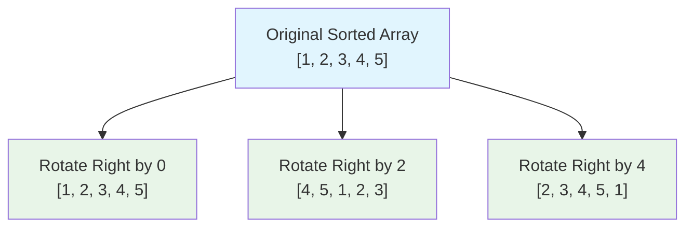

**Think of it like a merry-go-round:**
- Start with a sorted sequence
- Rotate it clockwise (or counterclockwise)
- The order within segments is preserved
- The "break" happens at the rotation point

### 🎲 Break Point Detection

Here's what a "break point" is:

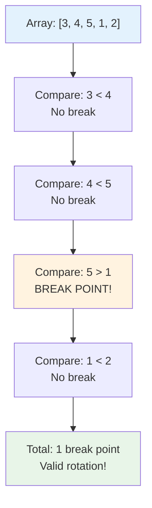

**Key Concept:**
- `nums[i] > nums[i+1]` → This is a break point
- Sorted array: **0 break points**
- Rotated sorted array: **1 break point**
- Non-sorted: **2+ break points**

---

## 📚 Step-by-Step Examples

### 🟢 Example 1: Valid Rotation

**Input:** `nums = [3, 4, 5, 1, 2]`  
**Output:** `true`

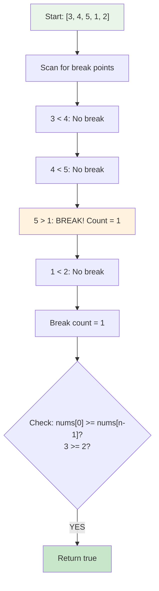

**Step-by-step breakdown:**
1. **Start:** `bPoint = 0`
2. **Step 1:** Check `3 vs 4`: `3 < 4` → No break
3. **Step 2:** Check `4 vs 5`: `4 < 5` → No break
4. **Step 3:** Check `5 vs 1`: `5 > 1` → Break found! `bPoint = 1`
5. **Step 4:** Check `1 vs 2`: `1 < 2` → No break
6. **Validation:** `bPoint = 1` and `nums[0] = 3 >= nums[4] = 2` ✅
7. **Result:** `true` - Valid sorted rotated array!

**Visual Rotation:**
```
Original: [1, 2, 3, 4, 5]
Rotate 2: [3, 4, 5, 1, 2]  ← Break happens at 5→1
```

### 🔴 Example 2: Invalid - Multiple Breaks

**Input:** `nums = [2, 1, 3, 4]`  
**Output:** `false`

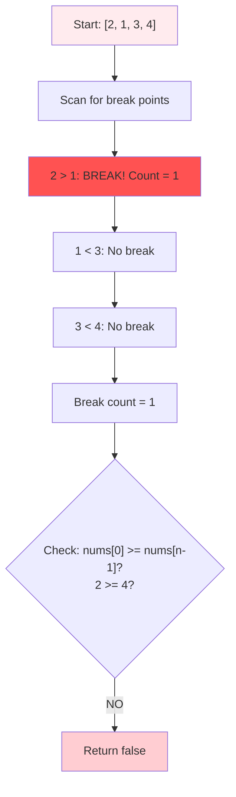

**Why this fails:**
- Has 1 break point at `2 > 1`
- But `nums[0] = 2` is NOT `>= nums[3] = 4`
- The array doesn't "wrap around" correctly
- Cannot be formed by rotating a sorted array

### 🟡 Example 3: Already Sorted

**Input:** `nums = [1, 2, 3, 4, 5]`  
**Output:** `true`

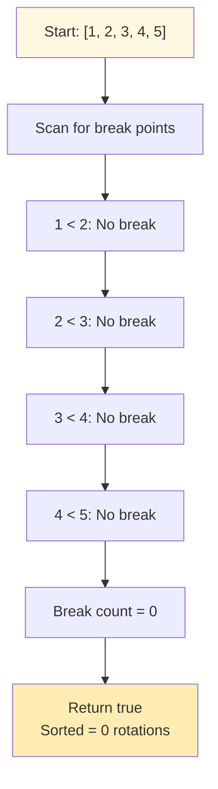

**Special case:**
- Zero break points means the array is already sorted
- A sorted array is technically "rotated by 0 positions"
- Always return `true` for 0 break points

### 🚨 Example 4: Multiple Break Points

**Input:** `nums = [5, 4, 3, 2, 1]`  
**Output:** `false`

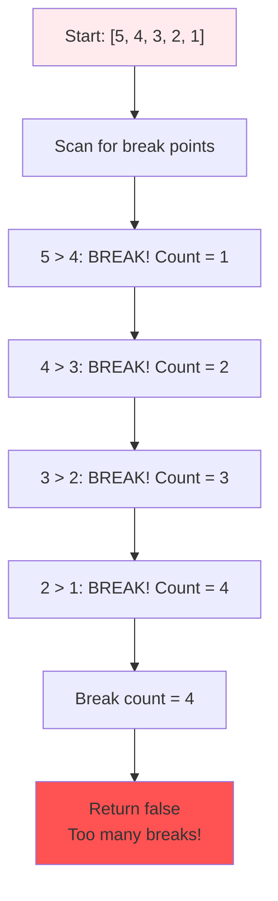

**Why this fails:**
- Has 4 break points (descending order)
- More than 1 break point = NOT a rotated sorted array
- This is a sorted array in reverse order

---

## 🛠️ The Algorithm

### 🎯 Main Strategy: Count Break Points

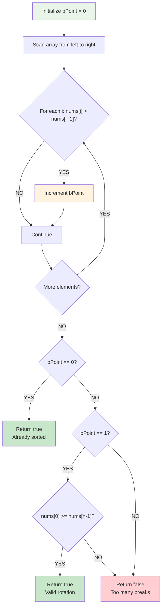

### 💻 The Code

```cpp
bool check(vector<int>& nums) {
    int bPoint = 0;  // Counter for break points
    int s = nums.size();
    
    // 🔍 SCAN: Count break points
    for (int i = 0; i < s - 1; i++) {
        if (nums[i] > nums[i + 1]) {
            bPoint++;  // Found a break!
        }
    }
    
    // ✅ CASE 1: No breaks = sorted
    if (bPoint == 0) {
        return true;
    }
    
    // 🔄 CASE 2: One break = check rotation validity
    if (bPoint == 1) {
        return nums[0] >= nums[s - 1];  // Must wrap around
    }
    
    // ❌ CASE 3: Multiple breaks = invalid
    return false;
}
```

### 🛡️ Rotation Validation Explained

**Why do we check `nums[0] >= nums[s-1]`?**

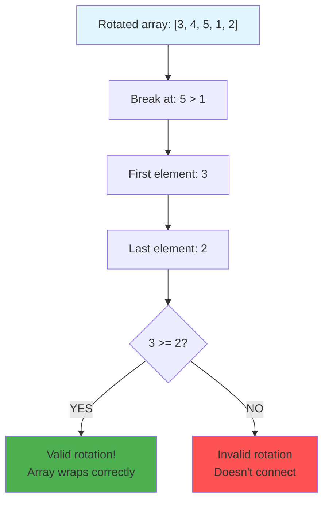

**The Logic:**
- Original sorted: `[1, 2, 3, 4, 5]`
- After rotation: `[3, 4, 5, 1, 2]`
- The "wrap-around": last element (2) must be `<=` first element (3)
- This ensures the array connects back to form a valid rotation

---

## 🧪 Test Cases & Edge Cases

### ✅ Normal Cases

| Input | Break Points | Wrap Check | Output | Why |
|-------|-------------|------------|--------|-----|
| `[3, 4, 5, 1, 2]` | 1 | 3 >= 2 ✅ | `true` | Valid rotation |
| `[1, 2, 3, 4, 5]` | 0 | N/A | `true` | Already sorted |
| `[2, 1, 3, 4]` | 1 | 2 >= 4 ❌ | `false` | Invalid rotation |

### ⚠️ Edge Cases

| Input | Break Points | Output | Why |
|-------|-------------|--------|-----|
| `[1]` | 0 | `true` | Single element |
| `[1, 1, 1]` | 0 | `true` | All identical |
| `[2, 1]` | 1, 2>=1 ✅ | `true` | Two elements rotated |
| `[5, 4, 3, 2, 1]` | 4 | `false` | Descending order |

### 🎯 Boundary Testing

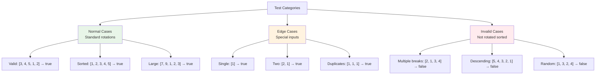

---

## 🎓 Key Concepts Mastery

### 🔄 Array Rotation Patterns

**1. Identify Rotation:**
```cpp
// A rotated sorted array has exactly 1 break point
int breakPoints = 0;
for (int i = 0; i < n - 1; i++) {
    if (nums[i] > nums[i + 1]) breakPoints++;
}
```

**2. Validate Rotation:**
```cpp
// The rotation must "wrap around" correctly
if (breakPoints == 1) {
    return nums[0] >= nums[n - 1];
}
```

**3. Handle Special Cases:**
```cpp
// 0 break points = already sorted (valid)
if (breakPoints == 0) return true;

// 2+ break points = not a rotated sorted array
if (breakPoints > 1) return false;
```

### 🔍 Break Point Analysis

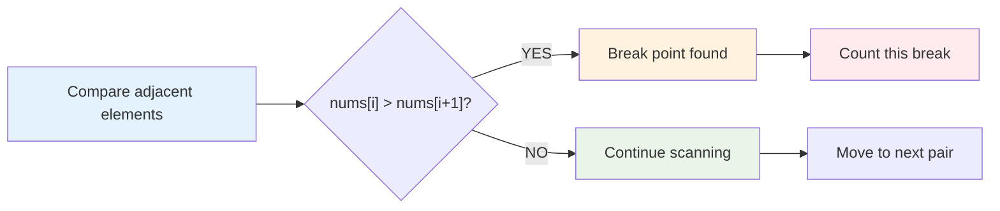

**Pattern to Remember:**
```cpp
// Break point = descending transition
if (nums[i] > nums[i + 1]) {
    // This is where the rotation "breaks" the sorted order
    breakPoint++;
}
```

### 🎯 Problem-Solving Framework

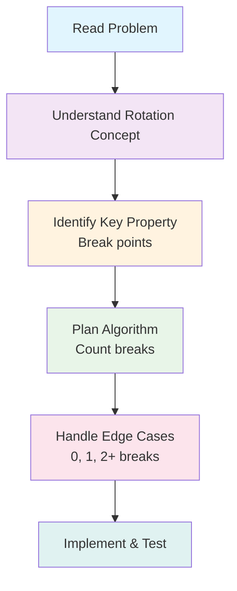

---

## 📊 Complexity Analysis

### ⏰ Time Complexity: O(n)

**Why linear?**
- Single pass through the array
- Check each adjacent pair exactly once
- n-1 comparisons for array of size n

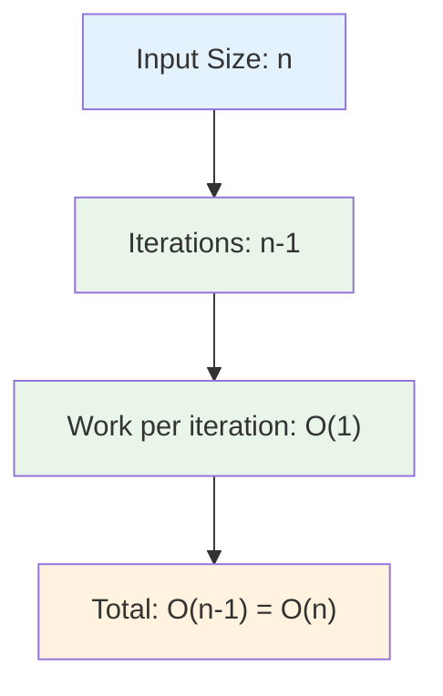

**Analysis by array size:**
```
n = 5  →  4 comparisons  →  O(5)
n = 10 →  9 comparisons  →  O(10)
n = 100 → 99 comparisons →  O(100)
```

### 💾 Space Complexity: O(1)

**Why constant space?**
- Only use a few variables: `bPoint`, `s`, `i`
- No arrays, lists, or additional data structures
- Memory usage doesn't grow with input size

**Space breakdown:**
```
bPoint: 1 integer (4 bytes)
s:      1 integer (4 bytes)
i:      1 integer (4 bytes)
Total:  12 bytes (constant)
```

---

## 🚀 Practice Problems

Once you master this, try these similar problems:

| Problem | Difficulty | Key Concept |
|---------|------------|-------------|
| 🔄 Rotate Array | Medium | Array rotation manipulation |
| 🔍 Search in Rotated Sorted Array | Medium | Binary search on rotated array |
| 📊 Find Minimum in Rotated Sorted Array | Medium | Break point detection |
| 🎯 Rotate List | Medium | Linked list rotation |

---

## 💼 Interview Questions & Answers

### ❓ Question 1: Why can there be only 0 or 1 break points in a rotated sorted array?

**Answer:**  
When you rotate a sorted array, you're essentially cutting it at one point and swapping the two halves. This creates at most ONE transition from a larger value to a smaller value.

**Simple Explanation:**  
```
Original:  [1, 2, 3, 4, 5]  → 0 breaks
Rotate 2:  [3, 4, 5 | 1, 2] → 1 break (at 5→1)
```
The rotation creates exactly one "cut" point, which is the break. More than one break means the array wasn't originally sorted!

---

### ❓ Question 2: What happens with duplicate elements?

**Answer:**  
Duplicate elements don't affect the algorithm! The check `nums[i] > nums[i+1]` still works:
- `[1, 1, 1]` → 0 breaks → sorted ✅
- `[1, 1, 2, 0]` → 1 break (2→0) → check wrap: 1 >= 0 ✅

**Simple Explanation:**  
Duplicates maintain non-decreasing order. The algorithm only cares about when order breaks (strictly descending), so duplicates pass through without causing issues.

**Code Example:**
```cpp
[1, 1, 1, 1] → All comparisons: 1 ≤ 1 → No breaks → true
[2, 2, 2, 1, 2] → One break at 2→1, wraps: 2 ≥ 2 → true
```

---

### ❓ Question 3: Why do we check `nums[0] >= nums[n-1]` for validation?

**Answer:**  
This ensures the array "connects back" properly. In a rotated sorted array, the last element of the rotated part must be less than or equal to the first element.

**Simple Explanation:**
```
Original: [1, 2, 3, 4, 5]
Rotated:  [3, 4, 5, 1, 2]
           ↑         ↑
         first     last

For valid rotation: first (3) >= last (2) ✅
This means: if we "wrap around", order continues properly
```

It's like checking if the end of the circle connects to the beginning correctly!

---

### ❓ Question 4: Can you handle the case where the array is rotated by n positions (full rotation)?

**Answer:**  
Yes! A full rotation returns the original sorted array, which has 0 break points.

**Simple Explanation:**  
```
Original:      [1, 2, 3, 4, 5]
Rotate by 5:   [1, 2, 3, 4, 5]  ← Same as original!
Break points:  0
Result:        true ✅
```

Full rotation (or rotation by 0) both give 0 break points, so they're automatically handled by the `bPoint == 0` case.

---

### ❓ Question 5: What's the time and space complexity?

**Answer:**  
**Time: O(n)** - Single pass through array to count break points  
**Space: O(1)** - Only use constant extra variables

**Simple Explanation:**  
```
Time:  Visit each element once → n iterations → O(n)
Space: Use bPoint, s, i variables → 3 integers → O(1)
```

We can't do better than O(n) because we need to check all elements at least once to count breaks.

---

### ❓ Question 6: How would you find the rotation point (pivot index)?

**Answer:**  
The rotation point is where the break occurs!

```cpp
int findRotationPoint(vector<int>& nums) {
    for (int i = 0; i < nums.size() - 1; i++) {
        if (nums[i] > nums[i + 1]) {
            return i + 1;  // Rotation point is after the break
        }
    }
    return 0;  // No rotation (or rotated by n)
}

// Example: [3, 4, 5, 1, 2]
// Break at index 2 (5 > 1)
// Rotation point = index 3 (element 1)
```

**Simple Explanation:**  
The break point tells us where the original array was "cut". The element right after the break is where the original array began!

---

### ❓ Question 7: What if the array is sorted in descending order?

**Answer:**  
Descending order has multiple break points, so it returns `false`.

```cpp
[5, 4, 3, 2, 1]
5 > 4 → break 1
4 > 3 → break 2
3 > 2 → break 3
2 > 1 → break 4

Total: 4 breaks → false ❌
```

**Simple Explanation:**  
The problem asks for arrays sorted in **non-decreasing** order (ascending). Descending order can't be formed by rotating an ascending sorted array, so it's invalid.

---

### ❓ Question 8: How do you handle single element or empty arrays?

**Answer:**  
```cpp
[1] → size = 1 → loop runs 0 times → bPoint = 0 → true ✅
[] → Would need size check first → should return true
```

**Simple Explanation:**  
- Single element: Trivially "sorted" with 0 rotations
- Empty array: Also trivially sorted
- The loop naturally handles single element (no iterations)

**Production code should add:**
```cpp
if (nums.empty() || nums.size() == 1) return true;
```

---

### ❓ Question 9: Can you optimize this further?

**Answer:**  
We could add early termination:

```cpp
bool check(vector<int>& nums) {
    int bPoint = 0;
    for (int i = 0; i < nums.size() - 1; i++) {
        if (nums[i] > nums[i + 1]) {
            bPoint++;
            if (bPoint > 1) return false;  // Early exit!
        }
    }
    if (bPoint == 0) return true;
    return nums[0] >= nums[nums.size() - 1];
}
```

**Simple Explanation:**  
Once we find 2 break points, we know it's invalid, so we can return immediately instead of counting all breaks. This doesn't change worst-case O(n), but improves average case.

---

### ❓ Question 10: What's the difference between this and "Search in Rotated Sorted Array"?

**Answer:**  
Different goals:
- **This problem**: Detect IF array is rotated sorted
- **Search problem**: Find element IN rotated sorted array

**Simple Explanation:**
```
This problem:
  Input:  [3, 4, 5, 1, 2]
  Output: true (it's rotated sorted)

Search problem:
  Input:  [3, 4, 5, 1, 2], target = 1
  Output: 3 (index where target is found)
```

This problem validates the structure. Search problem uses that structure to efficiently find elements using binary search (O(log n)).

---

### 🎯 Common Interview Follow-ups

**Q: "Can you solve this without counting all break points?"**  
A: Yes! Early termination when `bPoint > 1` improves average case.

**Q: "What if we allow decreasing order too?"**  
A: We'd need to count break points for both increasing and decreasing patterns, then check both conditions.

**Q: "How would you test this function?"**  
A: Test cases should include:
- Normal rotations: `[3, 4, 5, 1, 2]`
- No rotation: `[1, 2, 3, 4, 5]`
- Invalid: `[2, 1, 3, 4]`, `[5, 4, 3, 2, 1]`
- Edge cases: `[1]`, `[1, 1, 1]`, `[2, 1]`

---

## 🎯 Quick Reference

### 🔑 Essential Code Patterns

```cpp
// Count break points (inversions)
int breakPoints = 0;
for (int i = 0; i < n - 1; i++) {
    if (nums[i] > nums[i + 1]) {
        breakPoints++;
    }
}

// Validate rotation wrap-around
if (breakPoints == 1) {
    return nums[0] >= nums[n - 1];
}

// Handle sorted and invalid cases
if (breakPoints == 0) return true;  // Sorted
if (breakPoints > 1) return false;   // Invalid
```

### 📝 Important Rules

```cpp
Break Points = 0  → Array is sorted (valid)
Break Points = 1  → Check wrap-around condition
Break Points > 1  → Cannot be rotated sorted (invalid)

Wrap condition: nums[0] >= nums[n-1]
```

### 🧠 Mental Model

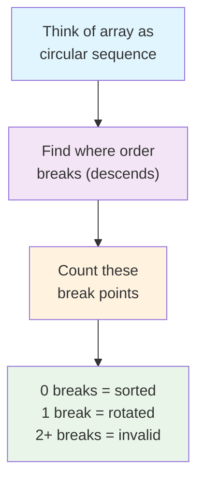

---

## 🏆 Mastery Checklist

- [ ] ✅ Understand what array rotation means
- [ ] ✅ Know how to detect break points
- [ ] ✅ Master the wrap-around validation logic
- [ ] ✅ Handle edge cases (single element, duplicates)
- [ ] ✅ Recognize the 0, 1, 2+ break pattern
- [ ] ✅ Solve in O(n) time with O(1) space
- [ ] ✅ Test thoroughly with all cases
- [ ] ✅ Answer interview questions confidently
- [ ] ✅ Understand why exactly 1 break point matters

---

## 💡 Pro Tips

1. **🔍 Visualize Rotation**: Draw the array as a circle to see how rotation works
2. **📊 Count Carefully**: Break points are the key - practice identifying them
3. **🔄 Check Wrap-Around**: Always validate the connection from last to first element
4. **🧪 Test Edge Cases**: Single elements, duplicates, and fully descending arrays
5. **🎯 Pattern Recognition**: This break-point pattern appears in many rotation problems
6. **💼 Explain Clearly**: Be ready to explain why 1 break = rotated sorted array
7. **⚡ Early Exit**: Consider optimizing by stopping at 2 break points

---

**🎉 Congratulations! You now have a complete understanding of rotated sorted array detection, break point analysis, and can confidently solve rotation problems. Keep practicing and happy coding!**
