# Day 27: 🔄 Rotate String - Complete Beginner's Guide

> **Master string rotation and the clever concatenation trick step by step!**


---

## 📖 What You'll Learn

By the end of this guide, you'll master:
- 🔤 **String Rotation Concepts** - Understanding how string rotation works
- 🧠 **The Concatenation Trick** - A clever technique to check all rotations at once
- 🔍 **Substring Matching** - Using efficient string search algorithms
- 🎯 **Pattern Recognition** - Identifying rotation patterns in strings

---

## 🎯 The Problem

### 📋 Problem Statement

**Given**: Two strings `s` and `goal`  
**Task**: Return `true` if `goal` can be obtained by rotating `s`  
**Rotation**: Moving the leftmost character to the rightmost position

**Important Rule**: A rotation must preserve all characters and their relative order!

### 🌟 Real-World Example

Think of it like a circular carousel:
- **"abcde"** rotated by 2 positions becomes **"cdeab"** (like rotating a wheel)
- **"hello"** rotated by 0 positions stays **"hello"** (no movement)
- **"abc"** can never become **"abd"** (different characters)

---

## 🔍 Understanding the Basics

### 🔄 What is String Rotation?


**Think of it like a rotating wheel:**
- Each rotation moves one character from the front to the back
- All characters stay in the same relative order
- After `n` rotations (where `n` is the string length), you're back to the original

### 🎲 The Concatenation Magic

Here's the brilliant insight that makes this problem easy:


**Key Insight:**
- When you concatenate `s` with itself (`s+s`), it contains every possible rotation
- If `goal` is a rotation of `s`, it MUST appear as a substring in `s+s`
- This transforms a rotation check into a simple substring search!

---

## 📚 Step-by-Step Examples

### 🟢 Example 1: Basic Rotation

**Input:** `s = "abcde"`, `goal = "cdeab"`  
**Output:** `true`



```mermaid
flowchart TD
    A["Start: s = 'abcde'<br/>goal = 'cdeab'"] --> B["Check lengths:<br/>5 == 5 ✅"]
    B --> C["Create s+s:<br/>'abcdeabcde'"]
    C --> D["Search for 'cdeab'<br/>in 'abcdeabcde'"]
    D --> E["Found at index 2! ✅"]
    E --> F["Return true"]
    
    style A fill:#e8f5e8
    style E fill:#c8e6c9
    style F fill:#4caf50
```

**Detailed walkthrough:**
1. **Length Check:** Both strings have length 5 ✅
2. **Concatenate:** `"abcde" + "abcde" = "abcdeabcde"`
3. **Search:** Look for `"cdeab"` in `"abcdeabcde"`
4. **Found:** `"ab[cdeab]cde"` - starts at index 2!
5. **Result:** `true` - it's a valid rotation

**Visual representation:**
```
Original:    a b c d e
Goal:        c d e a b

After s+s:   a b c d e a b c d e
                 └─────┘
                  cdeab (found!)
```

### 🔴 Example 2: Not a Rotation

**Input:** `s = "abcde"`, `goal = "abced"`  
**Output:** `false`



```mermaid
flowchart TD
    A["Start: s = 'abcde'<br/>goal = 'abced'"] --> B["Check lengths:<br/>5 == 5 ✅"]
    B --> C["Create s+s:<br/>'abcdeabcde'"]
    C --> D["Search for 'abced'<br/>in 'abcdeabcde'"]
    D --> E["NOT Found! ❌"]
    E --> F["Return false"]
    
    style A fill:#ffebee
    style E fill:#ffcdd2
    style F fill:#f44336
```

**Why it fails:**
- `"abced"` has different character order (`e` and `d` are swapped)
- No matter how we rotate `"abcde"`, we can't get `"abced"`
- `"abced"` doesn't appear anywhere in `"abcdeabcde"`

### 🟡 Example 3: Same String (Zero Rotation)

**Input:** `s = "hello"`, `goal = "hello"`  
**Output:** `true`



```mermaid
flowchart TD
    A["Start: s = 'hello'<br/>goal = 'hello'"] --> B["Check lengths:<br/>5 == 5 ✅"]
    B --> C["Create s+s:<br/>'hellohello'"]
    C --> D["Search for 'hello'<br/>in 'hellohello'"]
    D --> E["Found at index 0! ✅"]
    E --> F["Return true<br/>(0 rotations)"]
    
    style A fill:#fff8e1
    style E fill:#ffecb3
    style F fill:#fbc02d
```

**Key point:** Zero rotation is a valid rotation!

### 🚨 Example 4: Different Lengths

**Input:** `s = "abc"`, `goal = "abcd"`  
**Output:** `false`


**Optimization:** If lengths don't match, rotation is impossible - return immediately!

---

## 🛠️ The Algorithm

### 🎯 Main Strategy: Concatenation + Substring Search


### 💻 The Code

```cpp
bool rotateString(string s, string goal) {
    // 🚨 SAFETY CHECK: Lengths must match
    if (s.size() != goal.size()) {
        return false;  // Impossible to be a rotation
    }
    
    // 🎯 CLEVER TRICK: Concatenate s with itself
    string doubled = s + s;
    
    // 🔍 SEARCH: Check if goal appears in doubled
    return doubled.find(goal) != string::npos;
}
```

### 🔍 Why the Concatenation Trick Works


**Mathematical Proof:**
- A rotation of `s` by `k` positions = `s[k:] + s[:k]`
- When we create `s+s`, we have: `s + s`
- Any substring of length `n` (where `n = len(s)`) in `s+s` is a rotation of `s`
- If `goal` is a rotation, it must be one of these substrings!

---

## 🧪 Test Cases & Edge Cases

### ✅ Normal Cases

| Input `s` | Input `goal` | Output | Why |
|-----------|--------------|--------|-----|
| `"abcde"` | `"cdeab"` | `true` | Valid 2-position rotation |
| `"abcde"` | `"abced"` | `false` | Different character order |
| `"hello"` | `"lohel"` | `true` | Valid 3-position rotation |

### ⚠️ Edge Cases

| Input `s` | Input `goal` | Output | Why |
|-----------|--------------|--------|-----|
| `""` | `""` | `true` | Empty strings are rotations of each other |
| `"a"` | `"a"` | `true` | Single character - always rotates to itself |
| `"abc"` | `"abcd"` | `false` | Different lengths - impossible |
| `"aa"` | `"aa"` | `true` | Repeated characters - still valid |

### 🎯 Boundary Testing

```mermaid
flowchart TD
    A["Test Categories"] --> B["Normal Rotations<br/>✅ Should return true"]
    A --> C["Edge Cases<br/>⚠️ Special handling"]
    A --> D["Negative Cases<br/>❌ Should return false"]
    
    B --> B1["Basic: 'abcde' → 'cdeab'"]
    B --> B2["Full circle: 'abc' → 'abc'"]
    B --> B3["Single shift: 'hello' → 'elloh'"]
    
    C --> C1["Empty strings: '' → ''"]
    C --> C2["Single char: 'a' → 'a'"]
    C --> C3["Repeated: 'aa' → 'aa'"]
    
    D --> D1["Different order: 'abc' → 'acb'"]
    D --> D2["Different length: 'ab' → 'abc'"]
    D --> D3["Different chars: 'abc' → 'def'"]
    
    style B fill:#e8f5e8
    style C fill:#fff3e0
    style D fill:#ffebee
```



---

## 🎓 Key Concepts Mastery

### 🔤 String Rotation Properties

**1. Rotation Count:**
```cpp
// For a string of length n, there are n distinct rotations
string s = "abc";  // length = 3
// Rotations: "abc", "bca", "cab" (3 rotations)
```

**2. Circular Nature:**
```cpp
// After n rotations, you return to the original string
// rotate("abc", 0) = "abc"
// rotate("abc", 1) = "bca"
// rotate("abc", 2) = "cab"
// rotate("abc", 3) = "abc" (back to original!)
```

**3. Preservation of Order:**
```cpp
// Rotation preserves relative character order
"abcde" → "cdeab"  // 'c' is still before 'd', 'd' before 'e', etc.
```

### 🧠 The Concatenation Pattern


**Pattern to Remember:**
```cpp
// Instead of checking all rotations manually (O(n²))
// Use concatenation trick (O(n))
if (s.size() == goal.size() && (s+s).find(goal) != npos) {
    // goal is a rotation of s
}
```

### 🎯 Problem-Solving Framework


---

## 📊 Complexity Analysis

### ⏰ Time Complexity: O(n)

**Why linear time?**
- Length check: O(1)
- String concatenation: O(n) - creating a string of length 2n
- Substring search: O(n) - modern implementations use efficient algorithms (KMP, Boyer-Moore)
- Total: O(1) + O(n) + O(n) = O(n)


**Note:** The built-in `find()` method is highly optimized and typically uses KMP algorithm for O(n) performance.

### 💾 Space Complexity: O(n)

**Why linear space?**
- We create a new string `s+s` of length `2n`
- This requires O(n) additional space
- The original strings are not modified

**Space breakdown:**
```
Original strings:  O(n) (input)
Concatenated:      O(n) (created in function)
Total extra:       O(n)
```

### 🔄 Alternative Approach Comparison

```mermaid
flowchart TD
    A["Approach Comparison"] --> B["Concatenation Method"]
    A --> C["Manual Rotation Method"]
    
    B --> B1["Time: O(n)"]
    B --> B2["Space: O(n)"]
    B --> B3["Code: Simple"]
    
    C --> C1["Time: O(n²)"]
    C --> C2["Space: O(1)"]
    C --> C3["Code: Complex"]
    
    style B fill:#e8f5e8
    style B1 fill:#c8e6c9
    style B2 fill:#c8e6c9
    style B3 fill:#c8e6c9
    
    style C fill:#fff3e0
    style C1 fill:#ffccbc
    style C2 fill:#c8e6c9
    style C3 fill:#ffccbc
```



---

## 🚀 Practice Problems

Once you master this, try these similar problems:

| Problem | Difficulty | Key Concept |
|---------|------------|-------------|
| 🔄 Rotate Array | Easy | Array rotation |
| 🔍 Implement strStr() | Easy | Substring search |
| 🔁 Reverse String | Easy | String manipulation |
| 🎯 Valid Anagram | Easy | Character frequency |
| 🔄 Rotate Image | Medium | 2D rotation |

---

## 💼 Interview Questions & Answers

### ❓ Question 1: Why does the concatenation trick work?

**Answer:**  
When you concatenate a string with itself, every possible rotation appears as a contiguous substring!

**Simple Explanation:**  
```
s = "abc"
s+s = "abcabc"

All rotations:
- "abc" starts at index 0
- "bca" starts at index 1
- "cab" starts at index 2

If goal is ANY rotation, it MUST be in s+s!
```

**Visual proof:**
```
Original: [a][b][c]
Rotate 1: [b][c][a]
Rotate 2: [c][a][b]

In s+s:   [a][b][c][a][b][c]
           └────┘ abc (rotation 0)
              └────┘ bca (rotation 1)
                 └────┘ cab (rotation 2)
```

---

### ❓ Question 2: What if the strings are empty?

**Answer:**  
Empty strings are considered rotations of each other and return `true`.

**Simple Explanation:**
```cpp
s = "", goal = ""
s.size() == goal.size() → 0 == 0 ✅
s+s = "" + "" = ""
"".find("") = 0 (found at position 0) ✅
Return true
```

An empty string rotated by any amount is still empty!

---

### ❓ Question 3: How efficient is the find() method?

**Answer:**  
The `string::find()` method in C++ uses highly optimized algorithms:
- Often implements **KMP (Knuth-Morris-Pratt)** or **Boyer-Moore** algorithm
- These achieve O(n) time complexity for substring search
- Much faster than naive O(n×m) approach

**Simple Explanation:**  
It's like having a smart search that doesn't start over from scratch when it finds a partial match. It remembers what it's already checked!

**Complexity:**
```
Naive search:    O(n × m) where n = text length, m = pattern length
Optimized find(): O(n + m) ≈ O(n) when m is small
```

---

### ❓ Question 4: Can we solve this without extra space?

**Answer:**  
Yes, but it's more complex and slower:

```cpp
bool rotateString(string s, string goal) {
    if (s.size() != goal.size()) return false;
    
    int n = s.size();
    // Try each rotation position
    for (int i = 0; i < n; i++) {
        bool match = true;
        for (int j = 0; j < n; j++) {
            if (s[(i + j) % n] != goal[j]) {
                match = false;
                break;
            }
        }
        if (match) return true;
    }
    return false;
}
```

**Pros:** O(1) space (no extra string created)  
**Cons:** O(n²) time (checking each rotation explicitly)

**Simple Explanation:**  
It's like manually rotating the string n times and checking each one, instead of the clever trick of creating s+s once. Slower but uses less memory!

---

### ❓ Question 5: What about repeated characters?

**Answer:**  
The algorithm handles repeated characters perfectly!

**Example:**
```cpp
s = "aa", goal = "aa"
s+s = "aaaa"
"aa" appears in "aaaa" → true ✅

s = "aaa", goal = "aaa"  
s+s = "aaaaaa"
"aaa" appears in "aaaaaa" → true ✅
```

**Simple Explanation:**  
Even if all characters are the same, the concatenation trick still works. Every rotation of `"aa"` is `"aa"`, and it's definitely in `"aaaa"`!

---

### ❓ Question 6: What's the time and space complexity?

**Answer:**  
**Time: O(n)** where n is the length of string s  
- Concatenation: O(n)
- Substring search: O(n) with optimized find()

**Space: O(n)**  
- Need to create the concatenated string of length 2n

**Simple Explanation:**  
We touch each character a constant number of times (creating s+s and searching), so it's linear. We also need to store s+s temporarily, which takes space proportional to the input size.

---

### ❓ Question 7: How many rotations are possible?

**Answer:**  
For a string of length `n`, there are exactly `n` rotations (including the original).

**Examples:**
```
"a"     → 1 rotation:  "a"
"ab"    → 2 rotations: "ab", "ba"
"abc"   → 3 rotations: "abc", "bca", "cab"
"abcd"  → 4 rotations: "abcd", "bcda", "cdab", "dabc"
```

**Simple Explanation:**  
Think of a clock with n hours. You can point to any of the n hours, giving n different positions. After n rotations, you're back where you started!

---

### ❓ Question 8: What if goal has different characters?

**Answer:**  
If `goal` contains characters not in `s`, it cannot be a rotation, and the algorithm correctly returns `false`.

**Example:**
```cpp
s = "abc", goal = "def"
s+s = "abcabc"
"def" not found in "abcabc" → false ✅
```

**Simple Explanation:**  
Rotation only rearranges existing characters; it doesn't add or remove characters. If goal has different characters, it's impossible to be a rotation!

---

### ❓ Question 9: How do you handle strings with special characters?

**Answer:**  
The algorithm works identically for any characters (letters, numbers, symbols, spaces):

```cpp
s = "a b!", goal = "b!a "
s+s = "a b!a b!"
"b!a " found in "a b!a b!" → true ✅
```

**Simple Explanation:**  
The algorithm treats all characters equally. It doesn't care if they're letters, numbers, or symbols - it just checks if goal appears in s+s!

---

### ❓ Question 10: Can you explain with a real-world analogy?

**Answer:**  
Think of a **circular conveyor belt** at a sushi restaurant:

```
Belt: [🍣][🍱][🍜][🍙][🍰]

After one rotation: [🍱][🍜][🍙][🍰][🍣]
After two rotations: [🍜][🍙][🍰][🍣][🍱]
```

**The concatenation trick:**
```
Belt + Belt = [🍣][🍱][🍜][🍙][🍰][🍣][🍱][🍜][🍙][🍰]
```

Now, any rotation of the original belt appears as a contiguous section in the doubled belt!

**Simple Explanation:**  
If you watch the sushi belt twice (one full rotation plus another), you'll see every possible starting position exactly once. That's the concatenation trick!

---

### 🎯 Common Interview Follow-ups

**Q: "Can you optimize this further?"**  
A: The algorithm is already optimal for the string approach - O(n) time. The only way to save space is using O(n²) manual rotation, which is slower.

**Q: "What if we need to count rotations?"**  
A: We can modify the algorithm to return the rotation count instead of just true/false:
```cpp
int countRotations(string s, string goal) {
    if (s.size() != goal.size()) return -1;
    string doubled = s + s;
    size_t pos = doubled.find(goal);
    return (pos != string::npos) ? pos : -1;
}
```

**Q: "How would you test this function?"**  
A: Test cases should include:
- Normal rotations: `"abcde"` → `"cdeab"`
- No rotation: `"hello"` → `"hello"`
- Not a rotation: `"abc"` → `"acb"`
- Different lengths: `"ab"` → `"abc"`
- Edge cases: `""`, `"a"`, `"aa"`

---

## 🎯 Quick Reference

### 🔑 Essential Code Pattern

```cpp
// Check if goal is a rotation of s
bool isRotation(string s, string goal) {
    // 1. Check lengths (required condition)
    if (s.size() != goal.size()) return false;
    
    // 2. Use concatenation trick
    return (s + s).find(goal) != string::npos;
}
```

### 📝 Key Properties

```cpp
// Rotation properties
n rotations → same as 0 rotations (full circle)
rotate(s, 0) = s
rotate(s, k) = rotate(s, k % n)  // k can be > n

// All rotations appear in s+s
for each rotation r of s:
    r is a substring of (s + s)
```

### 🧠 Mental Model


---

## 🏆 Mastery Checklist

- [ ] ✅ Understand what string rotation means
- [ ] ✅ Know why the concatenation trick works
- [ ] ✅ Can explain the s+s technique clearly
- [ ] ✅ Master substring search concepts
- [ ] ✅ Handle edge cases (empty, single char, repeated chars)
- [ ] ✅ Analyze time complexity: O(n)
- [ ] ✅ Analyze space complexity: O(n)
- [ ] ✅ Test with various inputs thoroughly
- [ ] ✅ Answer interview questions confidently
- [ ] ✅ Explain with real-world analogies

---

## 💡 Pro Tips

1. **🧠 Remember the Trick**: The concatenation pattern (s+s) is a classic technique used in many rotation problems
2. **🔍 Trust Built-in Methods**: The `find()` function is highly optimized - don't reinvent the wheel
3. **⚡ Early Exit**: Always check if lengths match first - it's a quick way to eliminate impossible cases
4. **🧪 Test Edge Cases**: Empty strings, single characters, and repeated characters are common edge cases
5. **🎯 Visualize**: Draw out the circular rotation to understand the pattern better
6. **💼 Know Alternatives**: Be ready to discuss the O(1) space solution if asked about optimizations
7. **📚 Pattern Recognition**: This concatenation technique appears in many circular array/string problems

---

**🎉 Congratulations! You now have a complete understanding of string rotation and the clever concatenation trick. This technique is a powerful tool in your problem-solving arsenal. Keep practicing and happy coding!**
