```mermaid
graph TD
    A[Start: Array 64,34,25,12] --> B[Pass 1: Compare adjacent pairs]
    B --> C[34,64,25,12 → 34,25,64,12 → 34,25,12,64]
    C --> D[Pass 2: Compare first n-1 pairs]
    D --> E[25,34,12,64 → 25,12,34,64]
    E --> F[Pass 3: Compare first n-2 pairs]
    F --> G[12,25,34,64]
    G --> H[Sorted!]
```

# 🔄 Sorting Algorithms Guide for C++ Beginners

## 📚 Table of Contents
1. [Introduction](#introduction)
2. [Bubble Sort](#bubble-sort)
3. [Insertion Sort](#insertion-sort)
4. [Selection Sort](#selection-sort)
5. [Interview Preparation](#interview-preparation)

---

## 🎯 Introduction

Sorting algorithms are fundamental building blocks in computer science that arrange data in a specific order (ascending or descending). This guide covers three essential sorting algorithms that every C++ programmer should master: **Bubble Sort**, **Insertion Sort**, and **Selection Sort**.

### Why Learn Sorting Algorithms?
- **Foundation**: Understanding how data is organized and manipulated
- **Interview Preparation**: Common technical interview topics
- **Problem Solving**: Building logical thinking and algorithmic skills
- **Performance Analysis**: Learning about time and space complexity

---

## 🫧 Bubble Sort

### 📖 Concise Concept Explanation

Bubble Sort is the simplest sorting algorithm that works by repeatedly stepping through the list, comparing adjacent elements and swapping them if they're in the wrong order. The pass through the list is repeated until the list is sorted. It's called "bubble" sort because smaller elements "bubble" to the top of the list.

**Key Characteristics:**
- **Time Complexity**: O(n²) in worst and average case, O(n) in best case
- **Space Complexity**: O(1) - sorts in-place
- **Stability**: Stable (maintains relative order of equal elements)

### 💻 Embedded Code Examples

#### Basic Bubble Sort Implementation

```cpp
#include <iostream>
#include <vector>
using namespace std;

void bubbleSort(vector<int>& arr) {
    int n = arr.size();
    
    // Outer loop for number of passes
    for (int i = 0; i < n - 1; i++) {
        // Inner loop for comparisons in each pass
        for (int j = 0; j < n - i - 1; j++) {
            // Compare adjacent elements
            if (arr[j] > arr[j + 1]) {
                // Swap if they're in wrong order
                swap(arr[j], arr[j + 1]);
            }
        }
    }
}

void printArray(const vector<int>& arr) {
    for (int num : arr) {
        cout << num << " ";
    }
    cout << endl;
}

int main() {
    vector<int> arr = {64, 34, 25, 12, 22, 11, 90};
    
    cout << "Original array: ";
    printArray(arr);
    
    bubbleSort(arr);
    
    cout << "Sorted array: ";
    printArray(arr);
    
    return 0;
}
```

**Expected Output:**
```
Original array: 64 34 25 12 22 11 90 
Sorted array: 11 12 22 25 34 64 90 
```

#### Optimized Bubble Sort with Early Termination

```cpp
#include <iostream>
#include <vector>
using namespace std;

void optimizedBubbleSort(vector<int>& arr) {
    int n = arr.size();
    
    for (int i = 0; i < n - 1; i++) {
        bool swapped = false; // Flag to check if any swap occurred
        
        for (int j = 0; j < n - i - 1; j++) {
            if (arr[j] > arr[j + 1]) {
                swap(arr[j], arr[j + 1]);
                swapped = true; // Set flag if swap occurs
            }
        }
        
        // If no swapping occurred, array is already sorted
        if (!swapped) {
            cout << "Array sorted early at pass " << i + 1 << endl;
            break;
        }
    }
}

int main() {
    vector<int> arr = {1, 2, 3, 5, 4}; // Nearly sorted array
    
    cout << "Original array: ";
    for (int num : arr) cout << num << " ";
    cout << endl;
    
    optimizedBubbleSort(arr);
    
    cout << "Sorted array: ";
    for (int num : arr) cout << num << " ";
    cout << endl;
    
    return 0;
}
```

**Expected Output:**
```
Original array: 1 2 3 5 4 
Array sorted early at pass 2
Sorted array: 1 2 3 4 5 
```

### 🔍 Detailed Code Walkthrough

Let's break down the basic bubble sort implementation:

1. **Function Declaration**: `void bubbleSort(vector<int>& arr)`
   - Takes a reference to vector to modify the original array
   - Returns void as it sorts in-place

2. **Outer Loop**: `for (int i = 0; i < n - 1; i++)`
   - Runs n-1 times (n-1 passes needed for n elements)
   - Each pass places one element in its correct position

3. **Inner Loop**: `for (int j = 0; j < n - i - 1; j++)`
   - Compares adjacent elements
   - `n - i - 1` because after each pass, the largest element is in place

4. **Comparison and Swap**: 
   - `if (arr[j] > arr[j + 1])` checks if elements are in wrong order
   - `swap(arr[j], arr[j + 1])` exchanges the elements

### 📊 Illustrative Visuals




### 🌍 Practical Application Scenarios

1. **Educational Purposes**: 
   - Teaching sorting concepts to beginners
   - Understanding algorithm analysis

2. **Small Datasets**: 
   - When simplicity is more important than efficiency
   - Datasets with fewer than 50 elements

3. **Nearly Sorted Data**: 
   - With optimization, performs well on nearly sorted arrays
   - Best case O(n) complexity

4. **Memory-Constrained Environments**: 
   - Requires only O(1) extra space
   - Embedded systems with limited memory

### ⚠️ Common Mistakes

1. **Off-by-One Errors**:
   ```cpp
   // Wrong: Will cause array out of bounds
   for (int j = 0; j < n; j++)
   
   // Correct: Prevents accessing arr[n]
   for (int j = 0; j < n - i - 1; j++)
   ```

2. **Forgetting the Optimization**:
   ```cpp
   // Inefficient: Always runs O(n²) even if sorted early
   // Add the swapped flag for better performance
   ```

3. **Not Understanding Pass Reduction**:
   ```cpp
   // Wrong: Unnecessary comparisons
   for (int j = 0; j < n - 1; j++)
   
   // Correct: Reduces comparisons each pass
   for (int j = 0; j < n - i - 1; j++)
   ```

### 🎯 Key Takeaways

- **Simple but Inefficient**: Easy to understand but O(n²) time complexity
- **Stable Sorting**: Maintains relative order of equal elements
- **In-Place**: Requires only O(1) extra space
- **Adaptive**: Can be optimized to detect early completion
- **Best for Learning**: Excellent for understanding sorting fundamentals

---

## 📥 Insertion Sort

### 📖 Concise Concept Explanation

Insertion Sort builds the final sorted array one item at a time. It works by taking elements from the unsorted portion and inserting them into their correct position in the sorted portion. It's similar to how you might sort playing cards in your hands.

**Key Characteristics:**
- **Time Complexity**: O(n²) in worst and average case, O(n) in best case
- **Space Complexity**: O(1) - sorts in-place
- **Stability**: Stable sorting algorithm
- **Adaptive**: Efficient for small datasets and nearly sorted arrays

### 💻 Embedded Code Examples

#### Basic Insertion Sort Implementation

```cpp
#include <iostream>
#include <vector>
using namespace std;

void insertionSort(vector<int>& arr) {
    int n = arr.size();
    
    // Start from second element (index 1)
    for (int i = 1; i < n; i++) {
        int key = arr[i]; // Current element to be inserted
        int j = i - 1;    // Index of last element in sorted portion
        
        // Move elements greater than key one position ahead
        while (j >= 0 && arr[j] > key) {
            arr[j + 1] = arr[j];
            j--;
        }
        
        // Insert key at correct position
        arr[j + 1] = key;
    }
}

void printArray(const vector<int>& arr) {
    for (int num : arr) {
        cout << num << " ";
    }
    cout << endl;
}

int main() {
    vector<int> arr = {12, 11, 13, 5, 6};
    
    cout << "Original array: ";
    printArray(arr);
    
    insertionSort(arr);
    
    cout << "Sorted array: ";
    printArray(arr);
    
    return 0;
}
```

**Expected Output:**
```
Original array: 12 11 13 5 6 
Sorted array: 5 6 11 12 13 
```

#### Insertion Sort with Step-by-Step Visualization

```cpp
#include <iostream>
#include <vector>
using namespace std;

void insertionSortWithSteps(vector<int>& arr) {
    int n = arr.size();
    
    cout << "Step 0 (Initial): ";
    for (int num : arr) cout << num << " ";
    cout << endl;
    
    for (int i = 1; i < n; i++) {
        int key = arr[i];
        int j = i - 1;
        
        cout << "Step " << i << " - Inserting " << key << ": ";
        
        while (j >= 0 && arr[j] > key) {
            arr[j + 1] = arr[j];
            j--;
        }
        arr[j + 1] = key;
        
        for (int num : arr) cout << num << " ";
        cout << endl;
    }
}

int main() {
    vector<int> arr = {5, 2, 4, 6, 1, 3};
    
    insertionSortWithSteps(arr);
    
    return 0;
}
```

**Expected Output:**
```
Step 0 (Initial): 5 2 4 6 1 3 
Step 1 - Inserting 2: 2 5 4 6 1 3 
Step 2 - Inserting 4: 2 4 5 6 1 3 
Step 3 - Inserting 6: 2 4 5 6 1 3 
Step 4 - Inserting 1: 1 2 4 5 6 3 
Step 5 - Inserting 3: 1 2 3 4 5 6 
```

### 🔍 Detailed Code Walkthrough

Let's analyze the insertion sort implementation:

1. **Outer Loop**: `for (int i = 1; i < n; i++)`
   - Starts from index 1 (second element)
   - First element is considered already sorted

2. **Key Selection**: `int key = arr[i]`
   - Current element to be inserted into sorted portion
   - This element will find its correct position

3. **Position Finding**: `int j = i - 1`
   - Start comparing from the last element of sorted portion
   - Move backwards to find insertion point

4. **Element Shifting**: `while (j >= 0 && arr[j] > key)`
   - Shift elements larger than key one position right
   - Continue until finding correct position or reaching start

5. **Insertion**: `arr[j + 1] = key`
   - Insert key at the found position
   - Sorted portion increases by one element

### 📊 Illustrative Visuals


### 🌍 Practical Application Scenarios

1. **Small Arrays**: 
   - Efficient for arrays with less than 50 elements
   - Often used as base case in hybrid algorithms

2. **Nearly Sorted Data**: 
   - Performs exceptionally well on nearly sorted arrays
   - Online algorithm - can sort data as it arrives

3. **Stable Sorting Required**: 
   - Maintains relative order of equal elements
   - Important in database sorting with multiple criteria

4. **Memory-Constrained Systems**: 
   - In-place sorting with O(1) space complexity
   - Suitable for embedded systems

### ⚠️ Common Mistakes

1. **Starting from Wrong Index**:
   ```cpp
   // Wrong: Starting from index 0
   for (int i = 0; i < n; i++)
   
   // Correct: Starting from index 1
   for (int i = 1; i < n; i++)
   ```

2. **Incorrect Boundary Conditions**:
   ```cpp
   // Wrong: May cause array out of bounds
   while (j > 0 && arr[j] > key)
   
   // Correct: Include j >= 0 check
   while (j >= 0 && arr[j] > key)
   ```

3. **Forgetting to Insert Key**:
   ```cpp
   // Wrong: Only shifting, not inserting
   while (j >= 0 && arr[j] > key) {
       arr[j + 1] = arr[j];
       j--;
   }
   // Missing: arr[j + 1] = key;
   ```

### 🎯 Key Takeaways

- **Intuitive Algorithm**: Mimics natural sorting behavior
- **Efficient for Small/Nearly Sorted Data**: O(n) best case performance
- **Stable and In-Place**: Maintains order and uses minimal space
- **Online Algorithm**: Can process data as it arrives
- **Building Block**: Used in hybrid sorting algorithms like Timsort

---

## 🎯 Selection Sort

### 📖 Concise Concept Explanation

Selection Sort works by repeatedly finding the minimum element from the unsorted portion and placing it at the beginning. The algorithm maintains two subarrays: a sorted subarray and an unsorted subarray. In each iteration, it selects the smallest element from the unsorted portion and swaps it with the first element of the unsorted portion.

**Key Characteristics:**
- **Time Complexity**: O(n²) in all cases (best, average, worst)
- **Space Complexity**: O(1) - sorts in-place
- **Stability**: Not stable (can change relative order of equal elements)
- **Minimum Swaps**: Makes minimum number of swaps (at most n-1)

### 💻 Embedded Code Examples

#### Basic Selection Sort Implementation

```cpp
#include <iostream>
#include <vector>
using namespace std;

void selectionSort(vector<int>& arr) {
    int n = arr.size();
    
    // Traverse through all array elements
    for (int i = 0; i < n - 1; i++) {
        // Find minimum element in remaining unsorted array
        int minIndex = i;
        
        for (int j = i + 1; j < n; j++) {
            if (arr[j] < arr[minIndex]) {
                minIndex = j;
            }
        }
        
        // Swap the found minimum element with first element
        if (minIndex != i) {
            swap(arr[i], arr[minIndex]);
        }
    }
}

void printArray(const vector<int>& arr) {
    for (int num : arr) {
        cout << num << " ";
    }
    cout << endl;
}

int main() {
    vector<int> arr = {64, 25, 12, 22, 11};
    
    cout << "Original array: ";
    printArray(arr);
    
    selectionSort(arr);
    
    cout << "Sorted array: ";
    printArray(arr);
    
    return 0;
}
```

**Expected Output:**
```
Original array: 64 25 12 22 11 
Sorted array: 11 12 22 25 64 
```

#### Selection Sort with Detailed Steps

```cpp
#include <iostream>
#include <vector>
using namespace std;

void selectionSortWithSteps(vector<int>& arr) {
    int n = arr.size();
    int swapCount = 0;
    
    cout << "Initial array: ";
    for (int num : arr) cout << num << " ";
    cout << endl << endl;
    
    for (int i = 0; i < n - 1; i++) {
        int minIndex = i;
        
        cout << "Pass " << i + 1 << ":" << endl;
        cout << "Looking for minimum in range [" << i << " to " << n-1 << "]" << endl;
        
        // Find minimum in unsorted portion
        for (int j = i + 1; j < n; j++) {
            if (arr[j] < arr[minIndex]) {
                minIndex = j;
                cout << "New minimum found: " << arr[j] << " at index " << j << endl;
            }
        }
        
        // Swap if needed
        if (minIndex != i) {
            cout << "Swapping " << arr[i] << " with " << arr[minIndex] << endl;
            swap(arr[i], arr[minIndex]);
            swapCount++;
        } else {
            cout << "No swap needed, " << arr[i] << " is already minimum" << endl;
        }
        
        cout << "Array after pass " << i + 1 << ": ";
        for (int num : arr) cout << num << " ";
        cout << endl << endl;
    }
    
    cout << "Total swaps made: " << swapCount << endl;
}

int main() {
    vector<int> arr = {29, 10, 14, 37, 13};
    
    selectionSortWithSteps(arr);
    
    return 0;
}
```

**Expected Output:**
```
Initial array: 29 10 14 37 13 

Pass 1:
Looking for minimum in range [0 to 4]
New minimum found: 10 at index 1
Swapping 29 with 10
Array after pass 1: 10 29 14 37 13 

Pass 2:
Looking for minimum in range [1 to 4]
New minimum found: 13 at index 4
Swapping 29 with 13
Array after pass 2: 10 13 14 37 29 

Pass 3:
Looking for minimum in range [2 to 4]
No swap needed, 14 is already minimum
Array after pass 3: 10 13 14 37 29 

Pass 4:
Looking for minimum in range [3 to 4]
New minimum found: 29 at index 4
Swapping 37 with 29
Array after pass 4: 10 13 14 29 37 

Total swaps made: 3
```

### 🔍 Detailed Code Walkthrough

Breaking down the selection sort algorithm:

1. **Outer Loop**: `for (int i = 0; i < n - 1; i++)`
   - Iterates through each position to be filled
   - Runs n-1 times as last element is automatically sorted

2. **Initialize Minimum**: `int minIndex = i`
   - Assume current position has minimum value
   - Will be updated if smaller element is found

3. **Find Minimum**: `for (int j = i + 1; j < n; j++)`
   - Search through unsorted portion (from i+1 to n-1)
   - Update minIndex when smaller element is found

4. **Conditional Swap**: `if (minIndex != i)`
   - Only swap if minimum is not already in correct position
   - Minimizes number of swaps performed

5. **Swap Operation**: `swap(arr[i], arr[minIndex])`
   - Place minimum element at current position
   - Expand sorted portion by one element

### 📊 Illustrative Visuals


### 🌍 Practical Application Scenarios

1. **Memory-Write Expensive Systems**: 
   - Minimizes number of swaps (at most n-1)
   - Useful when write operations are costly

2. **Simple Implementation Needed**: 
   - Easy to understand and implement
   - Good for educational purposes

3. **Small Datasets**: 
   - Acceptable performance for small arrays
   - Constant space complexity

4. **Finding K Smallest Elements**: 
   - Can be stopped after k iterations
   - Useful for partial sorting requirements

### ⚠️ Common Mistakes

1. **Incorrect Loop Bounds**:
   ```cpp
   // Wrong: Will cause unnecessary iteration
   for (int i = 0; i < n; i++)
   
   // Correct: Last element is automatically sorted
   for (int i = 0; i < n - 1; i++)
   ```

2. **Not Checking Before Swapping**:
   ```cpp
   // Inefficient: Always swaps even if not needed
   swap(arr[i], arr[minIndex]);
   
   // Better: Check if swap is necessary
   if (minIndex != i) {
       swap(arr[i], arr[minIndex]);
   }
   ```

3. **Wrong Minimum Finding Logic**:
   ```cpp
   // Wrong: Includes already sorted elements
   for (int j = 0; j < n; j++)
   
   // Correct: Only search unsorted portion
   for (int j = i + 1; j < n; j++)
   ```

### 🎯 Key Takeaways

- **Minimum Swaps**: Makes fewest swaps among simple sorting algorithms
- **Consistent Performance**: Always O(n²) regardless of input
- **Not Stable**: Can change relative order of equal elements
- **In-Place**: Requires only O(1) extra space
- **Educational Value**: Great for understanding selection-based algorithms

---

## 🎤 Interview Preparation

### Question 1: Algorithm Comparison
**Q: Compare the time and space complexities of Bubble Sort, Insertion Sort, and Selection Sort. When would you choose each?**

**Expected Answer:**
- **Time Complexity:**
  - All three: O(n²) worst/average case
  - Bubble & Insertion: O(n) best case (nearly sorted)
  - Selection: Always O(n²)

- **Space Complexity:** All are O(1) - in-place sorting

- **When to Choose:**
  - **Bubble Sort**: Educational purposes, detecting if array is sorted
  - **Insertion Sort**: Small arrays, nearly sorted data, online algorithms
  - **Selection Sort**: When memory writes are expensive, need minimum swaps

### Question 2: Stability Analysis
**Q: What does it mean for a sorting algorithm to be stable? Which of the three algorithms we discussed are stable?**

**Expected Answer:**
A stable sorting algorithm maintains the relative order of equal elements. 
- **Stable**: Bubble Sort, Insertion Sort
- **Unstable**: Selection Sort

Example: For array [3a, 1, 3b], stable sort gives [1, 3a, 3b], unstable might give [1, 3b, 3a].

### Question 3: Optimization Opportunities
**Q: How can you optimize Bubble Sort? Provide code example.**

**Expected Answer:**
Add a flag to detect if array becomes sorted before all passes complete:

```cpp
void optimizedBubbleSort(vector<int>& arr) {
    int n = arr.size();
    for (int i = 0; i < n - 1; i++) {
        bool swapped = false;
        for (int j = 0; j < n - i - 1; j++) {
            if (arr[j] > arr[j + 1]) {
                swap(arr[j], arr[j + 1]);
                swapped = true;
            }
        }
        if (!swapped) break; // Array is sorted
    }
}
```

### Question 4: Best Case Scenarios
**Q: For which type of input data would Insertion Sort perform better than Selection Sort?**

**Expected Answer:**
Insertion Sort performs better on:
- **Nearly sorted arrays**: O(n) vs O(n²)
- **Small arrays**: Lower constant factors
- **Online data**: Can sort as data arrives
- **Arrays with many duplicates**: Fewer comparisons needed

Selection Sort always performs O(n²) comparisons regardless of input.

### Question 5: Memory Constraints
**Q: You have a system where memory writes are 100x more expensive than memory reads. Which sorting algorithm would you choose and why?**

**Expected Answer:**
**Selection Sort** because:
- Makes minimum number of swaps (at most n-1)
- Each swap involves 2 writes, so maximum 2(n-1) writes
- Other algorithms may perform many more swaps
- Though it does O(n²) comparisons (reads), writes are minimized

### Question 6: Implementation Challenge
**Q: Implement a function that can sort an array using any of the three algorithms based on a parameter.**

**Expected Answer:**
```cpp
enum SortType { BUBBLE, INSERTION, SELECTION };

void sortArray(vector<int>& arr, SortType type) {
    switch(type) {
        case BUBBLE:
            bubbleSort(arr);
            break;
        case INSERTION:
            insertionSort(arr);
            break;
        case SELECTION:
            selectionSort(arr);
            break;
    }
}
```

### Question 7: Real-world Application
**Q: You're building a mobile app that needs to sort user scores. The scores arrive in real-time and the list is usually small (< 20 items). Which algorithm would you choose and why?**

**Expected Answer:**
**Insertion Sort** because:
- **Online algorithm**: Can insert new scores as they arrive
- **Efficient for small data**: Good performance for < 20 items
- **Nearly sorted data**: New scores often fit near end of sorted list
- **Stable**: Maintains order for equal scores (important for leaderboards)
- **Simple implementation**: Easy to maintain and debug

---

## 🎯 Summary

This guide covered three fundamental sorting algorithms essential for C++ beginners:

### 🫧 **Bubble Sort**
- Simplest to understand, compares adjacent elements
- Good for learning concepts, inefficient for large data
- Can be optimized with early termination

### 📥 **Insertion Sort** 
- Builds sorted array incrementally
- Excellent for small and nearly sorted data
- Stable and adaptive algorithm

### 🎯 **Selection Sort**
- Finds minimum and places it in correct position
- Makes minimum number of swaps
- Consistent O(n²) performance

### 🏆 **Key Takeaways**
- All three are O(n²) algorithms suitable for learning
- Insertion Sort is generally the most practical
- Understanding these builds foundation for advanced algorithms
- Each has specific use cases despite similar complexity

**Next Steps**: Practice implementing these algorithms, analyze their behavior on different inputs, and explore more efficient algorithms like Merge Sort and Quick Sort.
