# Day 28: 📈 Monotonic Array - Complete Beginner's Guide

> **Master array trend analysis and monotonic property detection step by step!**


---

## 📖 What You'll Learn

By the end of this guide, you'll master:
- 📊 **Array Trend Analysis** - How to detect increasing and decreasing patterns
- 🔍 **Monotonic Properties** - Understanding what makes an array monotonic
- 🎯 **Two-Flag Technique** - Tracking multiple possibilities simultaneously
- 🧮 **Efficient Algorithms** - Single-pass solutions with optimal complexity

---

## 🎯 The Problem

### 📋 Problem Statement

**Given**: An integer array `nums`  
**Task**: Return `true` if the array is monotonic, `false` otherwise  
**Definition**: An array is monotonic if it's either entirely non-decreasing OR entirely non-increasing

**Important Rules**: 
- Monotone increasing: `nums[i] <= nums[j]` for all `i <= j`
- Monotone decreasing: `nums[i] >= nums[j]` for all `i <= j`
- Equal elements are allowed in both directions

### 🌟 Real-World Example

Think of it like analyzing trends:
- **[1, 2, 2, 3]** is like a stock price going up (monotonic increasing)
- **[6, 5, 4, 4]** is like temperature dropping (monotonic decreasing)  
- **[1, 3, 2]** is like a roller coaster (NOT monotonic)
- **[1, 1, 1]** is like a flat line (both increasing AND decreasing!)

---

## 🔍 Understanding the Basics

### 🏗️ What Are Monotonic Arrays?

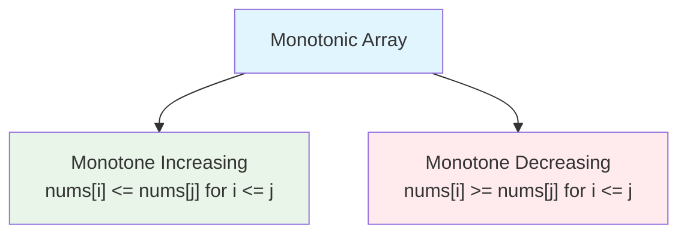

**Think of it like a one-way street:**
- **Increasing**: Can only go up or stay flat (never go down)
- **Decreasing**: Can only go down or stay flat (never go up)
- **Both**: If all elements are equal, it satisfies both conditions!

### 🎲 The Two-Flag Strategy

Here's how we track both possibilities simultaneously:

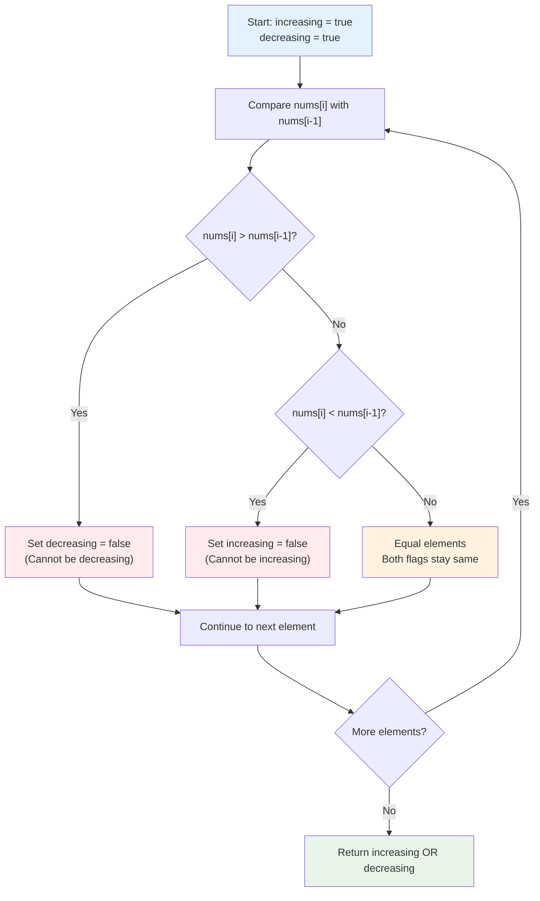

**Key Operations:**
- Start assuming both trends are possible
- Eliminate impossible trends as we find contradictions
- Return true if at least one trend survives

---

## 📚 Step-by-Step Examples

### 🟢 Example 1: Monotonic Increasing Array

**Input:** `nums = [1, 2, 2, 3]`  
**Output:** `true`

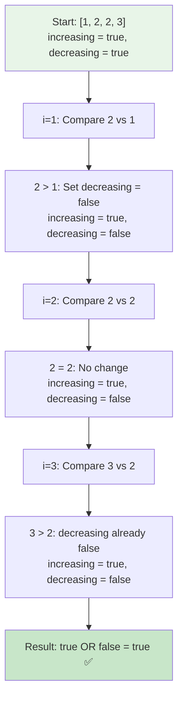

**Step-by-step breakdown:**
1. **Start:** `increasing = true, decreasing = true`
2. **Step 1:** Compare `nums[1]=2` vs `nums[0]=1`
   - `2 > 1` → Set `decreasing = false`
   - Array cannot be decreasing anymore
3. **Step 2:** Compare `nums[2]=2` vs `nums[1]=2`
   - `2 = 2` → No change to flags
4. **Step 3:** Compare `nums[3]=3` vs `nums[2]=2`
   - `3 > 2` → `decreasing` already false
5. **Result:** `increasing=true OR decreasing=false = true`

### 🔴 Example 2: Monotonic Decreasing Array

**Input:** `nums = [6, 5, 4, 4]`  
**Output:** `true`

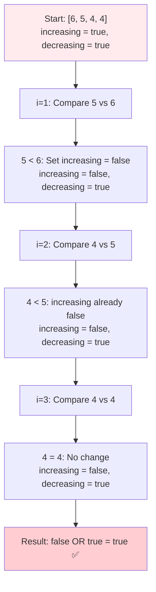

### 🟡 Example 3: Non-Monotonic Array

**Input:** `nums = [1, 3, 2]`  
**Output:** `false`

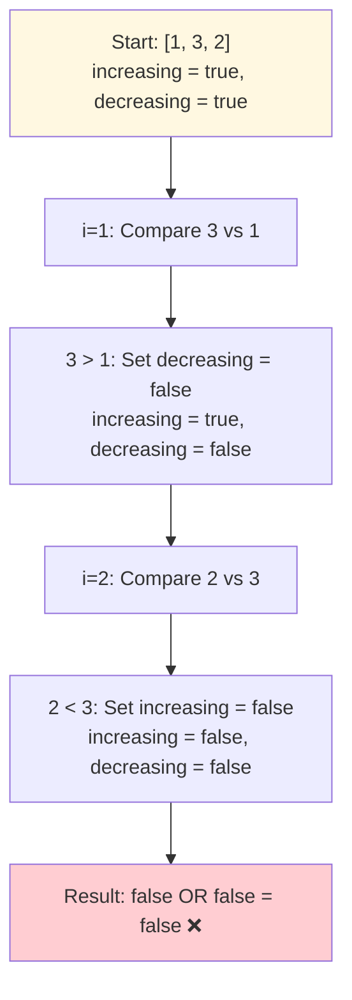

### 🚨 Example 4: All Equal Elements

**Input:** `nums = [1, 1, 1, 1]`  
**Output:** `true`

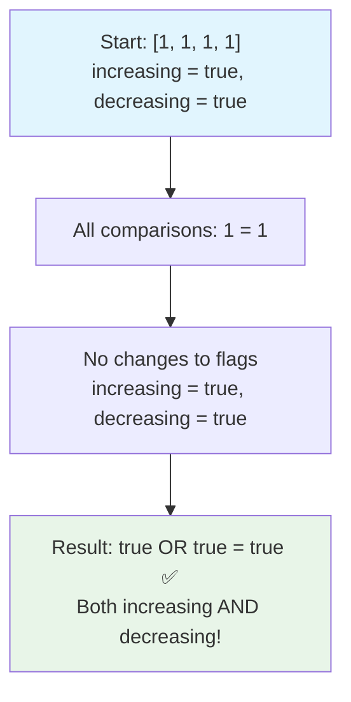

---

## 🛠️ The Algorithm

### 🎯 Main Strategy: Two-Flag Tracking

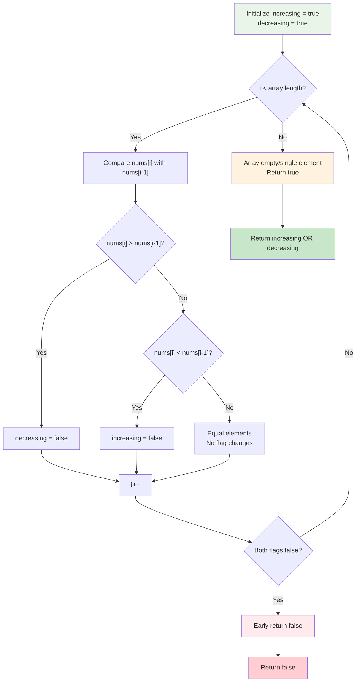

### 💻 The Code

```cpp
bool isMonotonic(vector<int>& nums) {
    int n = nums.size();
    
    // 🚨 EDGE CASE: Arrays with 0-2 elements are always monotonic
    if (n <= 2) return true;
    
    bool increasing = true;  // * Can array be non-decreasing?
    bool decreasing = true;  // * Can array be non-increasing?
    
    // 🔄 MAIN LOOP: Check each adjacent pair
    for (int i = 1; i < n; i++) {
        if (nums[i] > nums[i-1]) {
            decreasing = false;  // ! Found increase, can't be decreasing
        }
        if (nums[i] < nums[i-1]) {
            increasing = false;  // ! Found decrease, can't be increasing
        }
        
        // ⚡ OPTIMIZATION: Early termination
        if (!increasing && !decreasing) {
            return false;  // ! Both trends broken
        }
    }
    
    // ✅ RESULT: Monotonic if at least one trend survives
    return increasing || decreasing;
}
```

### 🛡️ Edge Case Handling Explained

**Why do arrays with ≤2 elements return true?**

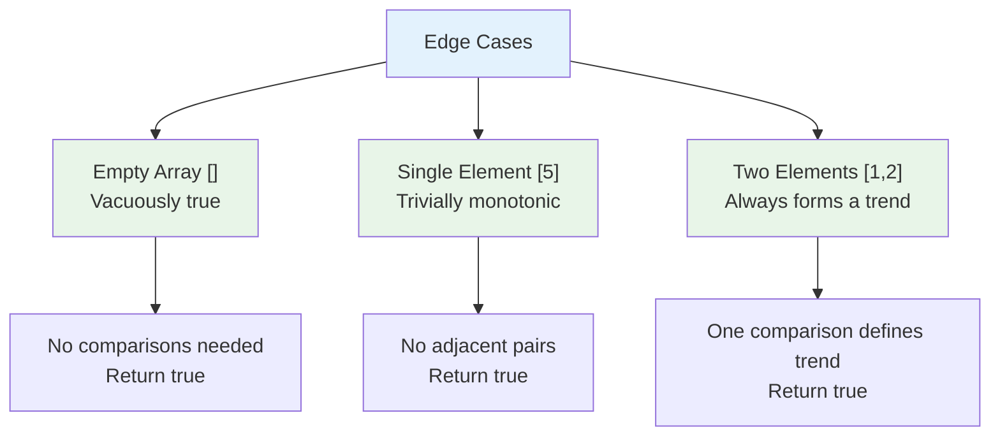

**The Logic:**
- **Empty `[]`**: No elements to violate monotonic property
- **Single `[5]`**: One element is both increasing and decreasing
- **Two `[1,2]`**: Defines exactly one trend (increasing or decreasing)

---

## 🧪 Test Cases & Edge Cases

### ✅ Normal Cases

| Input | Output | Why |
|-------|--------|-----|
| `[1, 2, 2, 3]` | `true` | Monotonic increasing |
| `[6, 5, 4, 4]` | `true` | Monotonic decreasing |
| `[1, 1, 1]` | `true` | All equal (both trends) |

### ⚠️ Edge Cases

| Input | Output | Why |
|-------|--------|-----|
| `[]` | `true` | Empty array |
| `[5]` | `true` | Single element |
| `[1, 2]` | `true` | Two elements (increasing) |
| `[2, 1]` | `true` | Two elements (decreasing) |

### ❌ Non-Monotonic Cases

| Input | Output | Why |
|-------|--------|-----|
| `[1, 3, 2]` | `false` | Goes up then down |
| `[1, 2, 4, 5, 3, 7]` | `false` | Multiple direction changes |
| `[5, 3, 5, 4]` | `false` | Zigzag pattern |

### 🎯 Boundary Testing

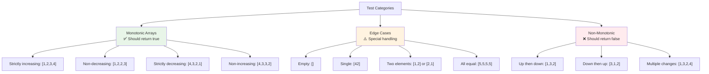

---

## 📊 Complexity Analysis

### ⏰ Time Complexity: O(n)

**Why linear?**
- We visit each element exactly once
- Each comparison takes constant time
- Early termination doesn't change worst-case analysis

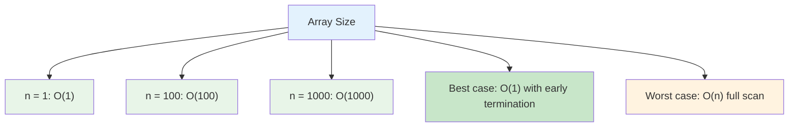

### 💾 Space Complexity: O(1)

**Why constant space?**
- Only use two boolean variables: `increasing`, `decreasing`
- No additional data structures needed
- Memory usage doesn't grow with input size

**Space Analysis:**
```cpp
bool increasing = true;  // 1 byte
bool decreasing = true;  // 1 byte
int i;                   // 4 bytes (loop variable)
// Total: ~6 bytes regardless of array size
```

---

## 🎓 Key Concepts Mastery

### 📊 Two-Flag Technique

**1. Initialize Both Possibilities:**
```cpp
bool increasing = true;  // Assume array can be non-decreasing
bool decreasing = true;  // Assume array can be non-increasing
```

**2. Eliminate Impossible Trends:**
```cpp
if (nums[i] > nums[i-1]) decreasing = false;  // Can't be decreasing
if (nums[i] < nums[i-1]) increasing = false;  // Can't be increasing
```

**3. Check Survival:**
```cpp
return increasing || decreasing;  // At least one trend must survive
```

### 🎯 Pattern Recognition

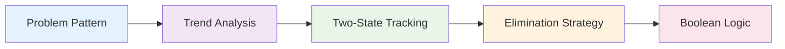

**When to Use This Pattern:**
- Checking if data follows a consistent trend
- Validating sorted or nearly-sorted sequences
- Analyzing time-series data for monotonic behavior
- Binary property verification (either A or B, not both broken)

### 🔄 Problem-Solving Framework

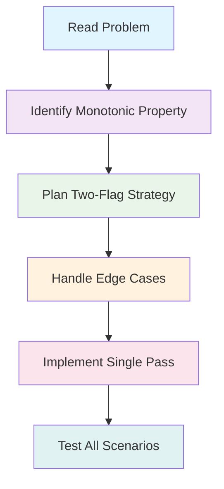

---

## 🚀 Practice Problems

Once you master this, try these similar problems:

| Problem | Difficulty | Key Concept |
|---------|------------|-------------|
| 📈 Check If Array Is Sorted | Easy | Single trend checking |
| 🔄 Sort Array By Parity | Easy | Two-pointer technique |
| 📊 Peak Index in Mountain Array | Medium | Trend change detection |
| 🏔️ Valid Mountain Array | Medium | Two-phase monotonic checking |

---

## 💼 Interview Questions & Answers

### ❓ Question 1: Why use two flags instead of checking trends separately?

**Answer:**  
Using two flags allows us to track both possibilities simultaneously in a single pass. Alternative approaches would require:
- Two separate passes (less efficient)
- Complex state tracking (more error-prone)
- Early termination benefits (performance optimization)

**Simple Explanation:**  
It's like watching a movie and keeping track of "could this be a comedy?" and "could this be a drama?" at the same time. As soon as you see something that rules out one genre, you eliminate that possibility.

---

### ❓ Question 2: What happens when all elements are equal?

**Answer:**  
When all elements are equal, both flags remain `true` throughout the iteration:
- No `nums[i] > nums[i-1]` comparisons (increasing stays true)
- No `nums[i] < nums[i-1]` comparisons (decreasing stays true)
- Result: `true OR true = true`

**Simple Explanation:**  
A flat line is both "going up" (never goes down) and "going down" (never goes up). It satisfies both definitions of monotonic!

---

### ❓ Question 3: Can you optimize this further with early termination?

**Answer:**  
Yes! We can add early termination when both flags become false:

```cpp
if (!increasing && !decreasing) {
    return false;  // Both trends broken, no need to continue
}
```

**Performance Impact:**
- Best case: O(1) if contradiction found early
- Worst case: Still O(n) for monotonic arrays
- Average case: Improved for non-monotonic arrays

---

### ❓ Question 4: How do you handle arrays with duplicate elements?

**Answer:**  
Duplicate elements don't affect either flag:
- `nums[i] == nums[i-1]` → Neither condition triggers
- Both `increasing` and `decreasing` flags remain unchanged
- This correctly allows duplicates in both monotonic directions

**Code Example:**
```cpp
// [1, 2, 2, 3] - duplicates allowed in increasing
// [3, 2, 2, 1] - duplicates allowed in decreasing
// [2, 2, 2, 2] - all duplicates (both trends valid)
```

---

### ❓ Question 5: What's the difference between strictly monotonic and monotonic?

**Answer:**  
- **Strictly Monotonic**: No equal adjacent elements (`<` or `>` only)
- **Monotonic**: Equal adjacent elements allowed (`≤` or `≥`)

This problem asks for **monotonic** (allows equals), which is why `[1,2,2,3]` returns `true`.

**To Check Strictly Monotonic:**
```cpp
// Change conditions to strict inequalities
if (nums[i] >= nums[i-1]) decreasing = false;  // No equals allowed
if (nums[i] <= nums[i-1]) increasing = false;  // No equals allowed
```

---

### ❓ Question 6: How would you modify this for three-way monotonic checking?

**Answer:**  
For checking strictly increasing, strictly decreasing, or constant:

```cpp
bool strictInc = true, strictDec = true, constant = true;
for (int i = 1; i < n; i++) {
    if (nums[i] <= nums[i-1]) strictInc = false;
    if (nums[i] >= nums[i-1]) strictDec = false;
    if (nums[i] != nums[i-1]) constant = false;
}
return strictInc || strictDec || constant;
```

---

## 🎯 Quick Reference

### 🔑 Essential Code Patterns

```cpp
// Two-flag initialization
bool increasing = true, decreasing = true;

// Trend elimination
for (int i = 1; i < n; i++) {
    if (nums[i] > nums[i-1]) decreasing = false;
    if (nums[i] < nums[i-1]) increasing = false;
}

// Result evaluation
return increasing || decreasing;

// Optional early termination
if (!increasing && !decreasing) return false;
```

### 📝 Important Edge Cases

```cpp
// Always handle these cases
if (n <= 2) return true;  // Empty, single, or two elements

// Test cases to remember
[] → true          // Empty array
[5] → true         // Single element  
[1,2] → true       // Two elements
[1,1,1] → true     // All equal
[1,3,2] → false    // Non-monotonic
```

### 🧠 Mental Model

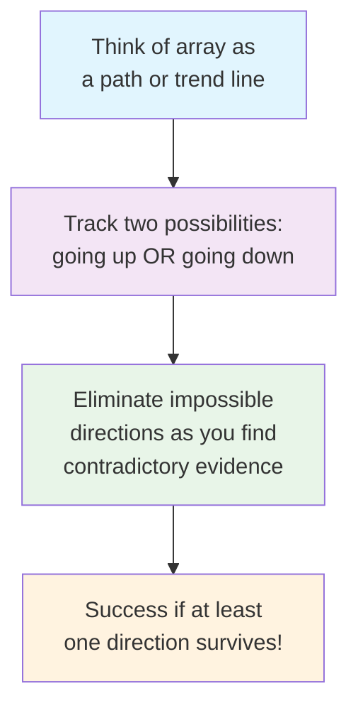

---

## 🏆 Mastery Checklist

- [ ] ✅ Understand the two-flag technique for simultaneous tracking
- [ ] ✅ Know how to handle edge cases (empty, single, two elements)
- [ ] ✅ Master the difference between monotonic and strictly monotonic
- [ ] ✅ Handle arrays with duplicate elements correctly
- [ ] ✅ Implement early termination optimization
- [ ] ✅ Solve the problem in O(n) time and O(1) space
- [ ] ✅ Test all categories: monotonic, non-monotonic, and edge cases
- [ ] ✅ Answer common interview questions confidently
- [ ] ✅ Recognize when to apply this pattern to other problems

---

## 💡 Pro Tips

1. **🎯 Two-Flag Strategy**: Always consider tracking multiple possibilities simultaneously
2. **🔍 Edge Case Priority**: Handle small arrays (≤2 elements) first - they're always monotonic
3. **⚡ Early Termination**: Add optimization when both flags become false
4. **🧪 Test Systematically**: Cover monotonic increasing, decreasing, equal elements, and non-monotonic cases
5. **📊 Visualize Trends**: Think of arrays as trend lines - monotonic means one consistent direction
6. **💼 Interview Ready**: Practice explaining the two-flag logic clearly and concisely

---

**🎉 Congratulations! You now have a complete understanding of monotonic array detection, two-flag techniques, and can confidently solve trend analysis problems. Keep practicing and happy coding!**