# Day 29: 🎯 Two-Pointer Array Manipulation - Complete Mastery Guide

> **Master the two-pointer technique for in-place array operations step by step!**

---

## 📖 What You'll Learn

By the end of this guide, you'll master:
- 🎯 **Two-Pointer Technique** - The fundamental pattern for array manipulation
- 🔄 **In-Place Operations** - Modifying arrays without extra space
- 📊 **Array Partitioning** - Separating elements based on conditions
- 🚀 **Merge Algorithms** - Combining sorted arrays efficiently

---

## 🎯 The Problems

This day covers **4 essential two-pointer problems** that build upon each other:

| Problem | LeetCode | Difficulty | Key Concept |
|---------|----------|------------|-------------|
| **Apply Operations to Array** | 2460 | Easy | Two-phase processing |
| **Remove Element** | 27 | Easy | In-place removal |
| **Move Zeroes** | 283 | Easy | Stable partitioning |
| **Merge Sorted Array** | 88 | Easy | Three-pointer merge |

---

## 🔍 Understanding the Basics

### 🏗️ What is the Two-Pointer Technique?

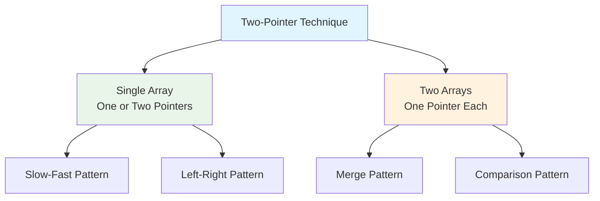

**Think of pointers as bookmarks:**
- They track positions in the array
- They move based on conditions
- They help us rearrange elements efficiently

### 🎲 The Core Pattern

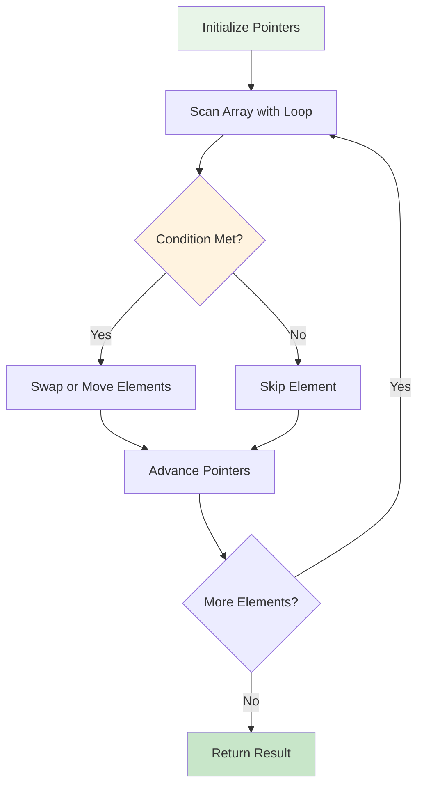

---

# 🟢 Problem 1: Apply Operations to Array (LeetCode 2460)

## 📋 Problem Statement

**Given**: A 0-indexed array `nums` of non-negative integers  
**Task**: 
1. Merge adjacent equal elements (first doubles, second becomes 0)
2. Move all zeros to the end while maintaining relative order

**Important**: Two distinct phases - merge first, then move zeros

### 🌟 Real-World Example

Think of it like organizing inventory:
- **Phase 1**: Combine duplicate items (merge equal boxes)
- **Phase 2**: Move empty boxes to storage (zeros to end)

---

## 🔍 Understanding Problem 1

### 📊 Visual Representation

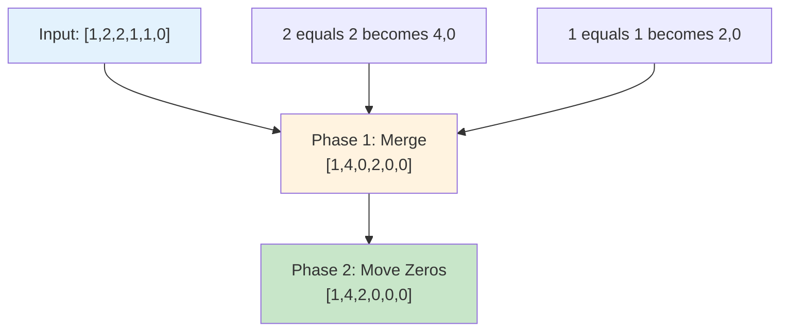

### 🎯 Step-by-Step Example

**Input:** `nums = [1,2,2,1,1,0]`

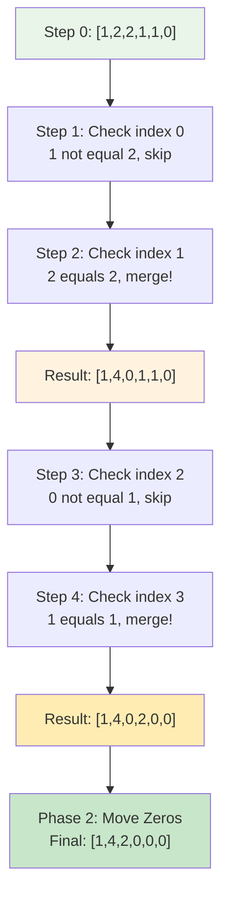

---

## 🛠️ The Algorithm - Problem 1

### 🎯 Two-Phase Strategy

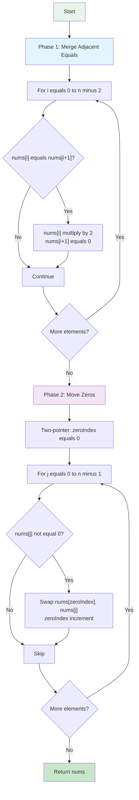

### 💻 The Code

```cpp
vector<int> applyOperations(vector<int>& nums) {
    int n = nums.size();
    
    // PHASE 1: Merge adjacent equal elements
    for (int i = 0; i < n - 1; i++) {
        if (nums[i] == nums[i + 1]) {
            nums[i] *= 2;
            nums[i + 1] = 0;
        }
    }
    
    // PHASE 2: Move zeros to end
    int zeroIndex = 0;
    for (int j = 0; j < n; j++) {
        if (nums[j] != 0) {
            swap(nums[zeroIndex++], nums[j]);
        }
    }
    
    return nums;
}
```

---

## 📊 Complexity Analysis - Problem 1

### ⏰ Time Complexity: O(n)

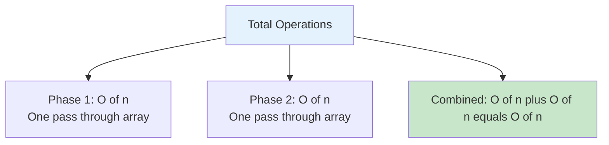

### 💾 Space Complexity: O(1)

**Why constant space?**
- Only use a few variables: `i`, `j`, `zeroIndex`
- In-place modifications
- No auxiliary data structures

---

## 🧪 Test Cases & Edge Cases - Problem 1

### ✅ Normal Cases

| Input | Output | Explanation |
|-------|--------|-------------|
| `[1,2,2,1,1,0]` | `[1,4,2,0,0,0]` | Multiple merges |
| `[0,1,1,2]` | `[2,2,0,0]` | Merge at beginning |
| `[1,2,3,4]` | `[1,2,3,4]` | No equal adjacents |

### ⚠️ Edge Cases

| Input | Output | Why |
|-------|--------|-----|
| `[0,0,0,0]` | `[0,0,0,0]` | All zeros |
| `[5,5]` | `[10,0]` | Minimal size |
| `[1,1,1,1]` | `[2,2,0,0]` | Consecutive equals |

---

# 🔵 Problem 2: Remove Element (LeetCode 27)

## 📋 Problem Statement

**Given**: An integer array `nums` and an integer `val`  
**Task**: Remove all occurrences of `val` in-place  
**Return**: The count of elements not equal to `val`

**Important**: Order of elements may be changed (allows optimization)

### 🌟 Real-World Example

Think of it like filtering a list:
- Go through each item
- Keep the good ones, discard the target ones
- Count how many good items remain

---

## 🔍 Understanding Problem 2

### 📊 Two-Pointer Visualization

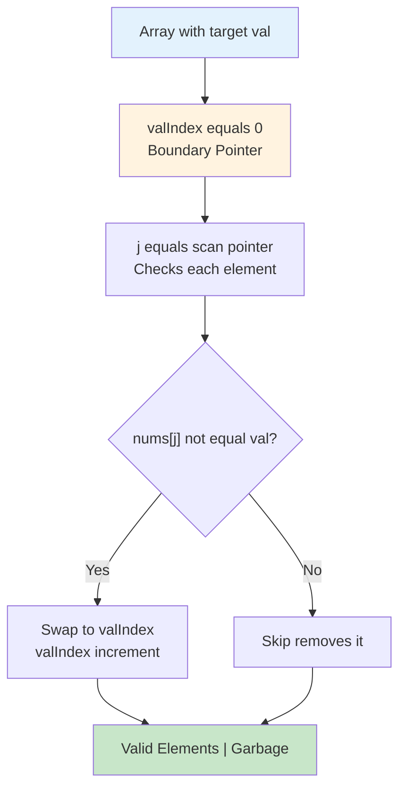

### 🎯 Step-by-Step Example

**Input:** `nums = [3,2,2,3]`, `val = 3`

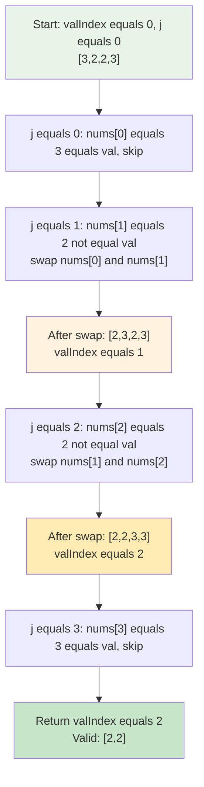

---

## 🛠️ The Algorithm - Problem 2

### 🎯 Partitioning Strategy

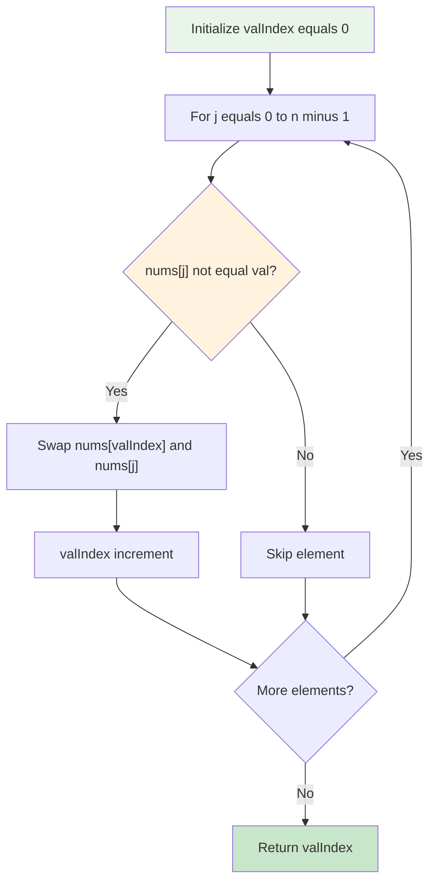

### 💻 The Code

```cpp
int removeElement(vector<int>& nums, int val) {
    int valIndex = 0;  // Boundary pointer
    
    for (int j = 0; j < nums.size(); j++) {
        if (nums[j] != val) {
            swap(nums[valIndex++], nums[j]);
        }
    }
    
    return valIndex;  // Count of valid elements
}
```

### 🛡️ Boundary Tracking Explained

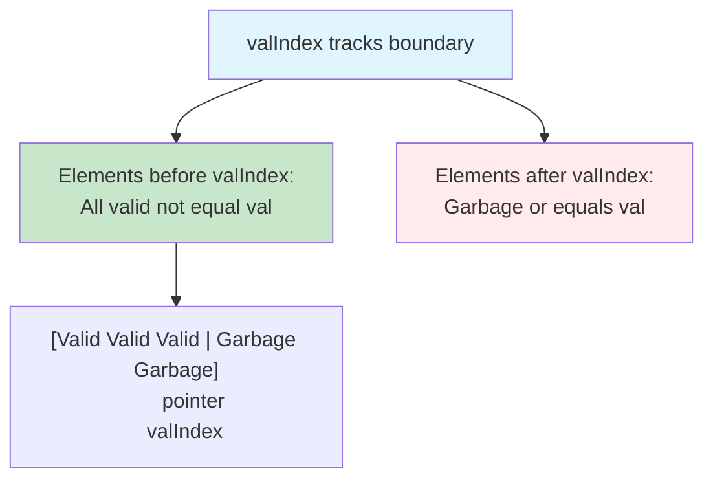

---

## 📊 Complexity Analysis - Problem 2

### ⏰ Time Complexity: O(n)

**Why linear?**
- Single pass through array
- Each element checked once
- Swap operation is O(1)

### 💾 Space Complexity: O(1)

**Why constant space?**
- Only two pointers: `valIndex` and `j`
- In-place modifications
- No extra arrays

---

## 🧪 Test Cases & Edge Cases - Problem 2

### ✅ Normal Cases

| Input | val | Output | Result Array |
|-------|-----|--------|--------------|
| `[3,2,2,3]` | `3` | `2` | `[2,2,_,_]` |
| `[0,1,2,2,3,0,4,2]` | `2` | `5` | `[0,1,4,0,3,_,_,_]` |

### ⚠️ Edge Cases

| Input | val | Output | Why |
|-------|-----|--------|-----|
| `[]` | `5` | `0` | Empty array |
| `[7,7,7,7]` | `7` | `0` | All target |
| `[1,2,3]` | `4` | `3` | No target |

---

# 🟡 Problem 3: Move Zeroes (LeetCode 283)

## 📋 Problem Statement

**Given**: An integer array `nums`  
**Task**: Move all 0's to the end while maintaining relative order of non-zero elements  
**Constraint**: Must be done in-place without making a copy

**Important**: Relative order must be preserved (stable algorithm)

### 🌟 Real-World Example

Think of it like organizing a queue:
- Non-zero people (active) move to front
- Zero people (inactive) move to back
- Everyone keeps their relative position

---

## 🔍 Understanding Problem 3

### 📊 Stable Partitioning Visualization

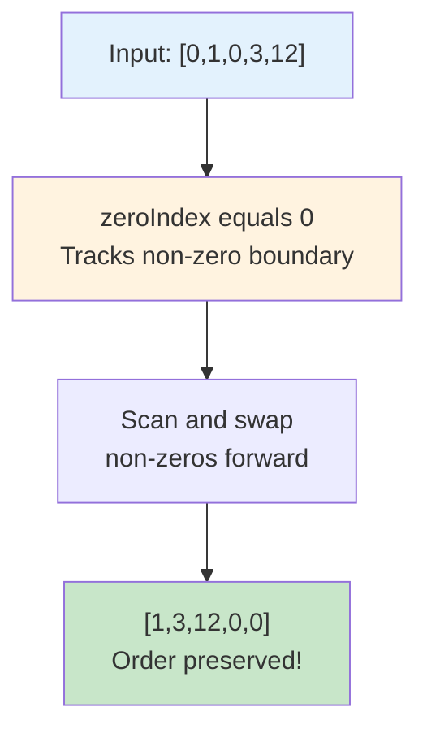

### 🎯 Detailed Example

**Input:** `nums = [0,1,0,3,12]`

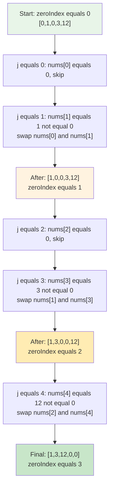

---

## 🛠️ The Algorithm - Problem 3

### 🎯 Stable Swap Strategy

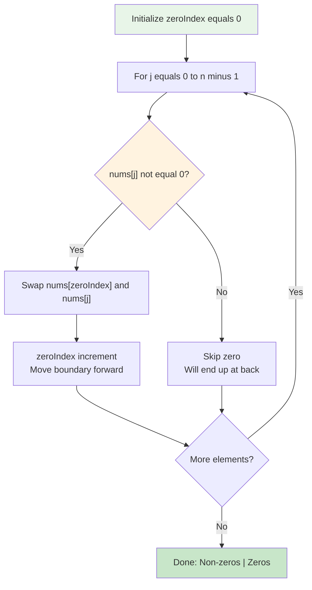

### 💻 The Code

```cpp
void moveZeroes(vector<int>& nums) {
    int zeroIndex = 0;  // Boundary for non-zeros
    
    for(int j = 0; j < nums.size(); j++) {
        if(nums[j] != 0) {
            swap(nums[zeroIndex++], nums[j]);
        }
    }
}
```

### 🔍 Why Swap Maintains Order

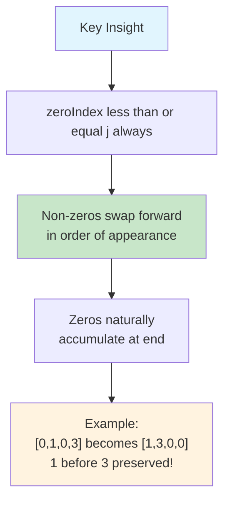

---

## 📊 Complexity Analysis - Problem 3

### ⏰ Time Complexity: O(n)

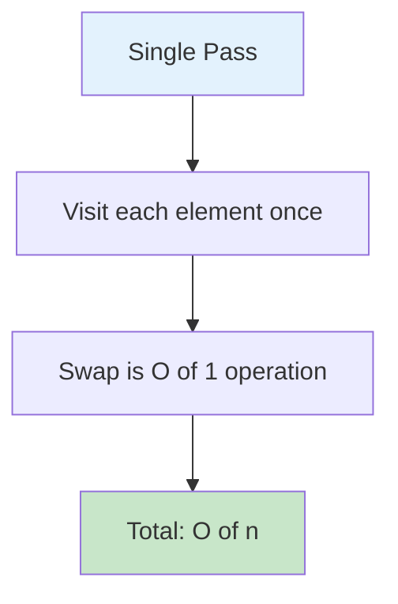

### 💾 Space Complexity: O(1)

**Why constant space?**
- Only two pointers: `zeroIndex` and `j`
- In-place swapping
- No auxiliary structures

---

## 🧪 Test Cases & Edge Cases - Problem 3

### ✅ Normal Cases

| Input | Output | Explanation |
|-------|--------|-------------|
| `[0,1,0,3,12]` | `[1,3,12,0,0]` | Mixed zeros |
| `[1,2,3,0,0]` | `[1,2,3,0,0]` | Already sorted |
| `[0,0,1,2,3]` | `[1,2,3,0,0]` | Leading zeros |

### ⚠️ Edge Cases

| Input | Output | Why |
|-------|--------|-----|
| `[0]` | `[0]` | Single zero |
| `[5]` | `[5]` | Single non-zero |
| `[0,0,0,0]` | `[0,0,0,0]` | All zeros |
| `[1,2,3,4]` | `[1,2,3,4]` | No zeros |

---

# 🟣 Problem 4: Merge Sorted Array (LeetCode 88)

## 📋 Problem Statement

**Given**: Two sorted integer arrays `nums1` and `nums2`  
**Integers**: `m` (elements in nums1) and `n` (elements in nums2)  
**Task**: Merge `nums2` into `nums1` as one sorted array  
**Note**: `nums1` has length `m+n` with extra space at the end

**Important**: Must merge in-place into nums1

### 🌟 Real-World Example

Think of it like merging two sorted queues:
- Both lines are already sorted
- Combine them into one sorted line
- Use the extra space at the end of nums1

---

## 🔍 Understanding Problem 4

### 📊 Three-Pointer Merge Visualization

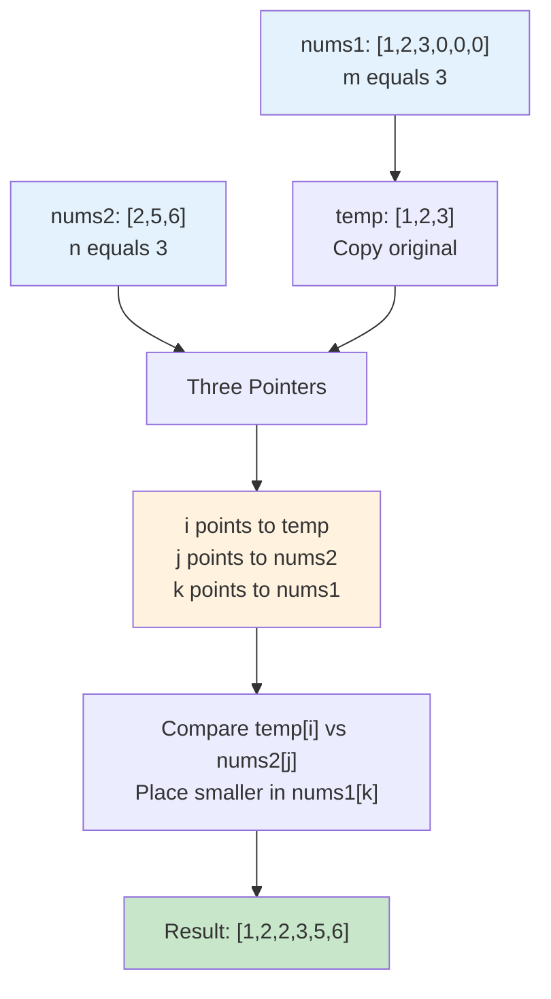

### 🎯 Detailed Merge Process

**Input:** `nums1 = [1,2,3,0,0,0]`, `m = 3`, `nums2 = [2,5,6]`, `n = 3`

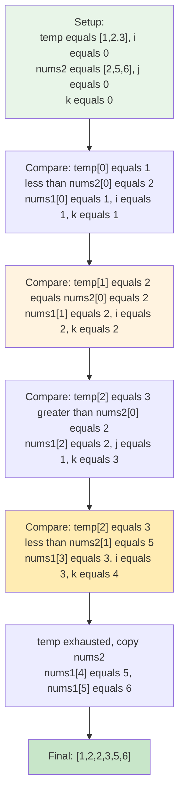

---

## 🛠️ The Algorithm - Problem 4

### 🎯 Three-Pointer Merge Strategy

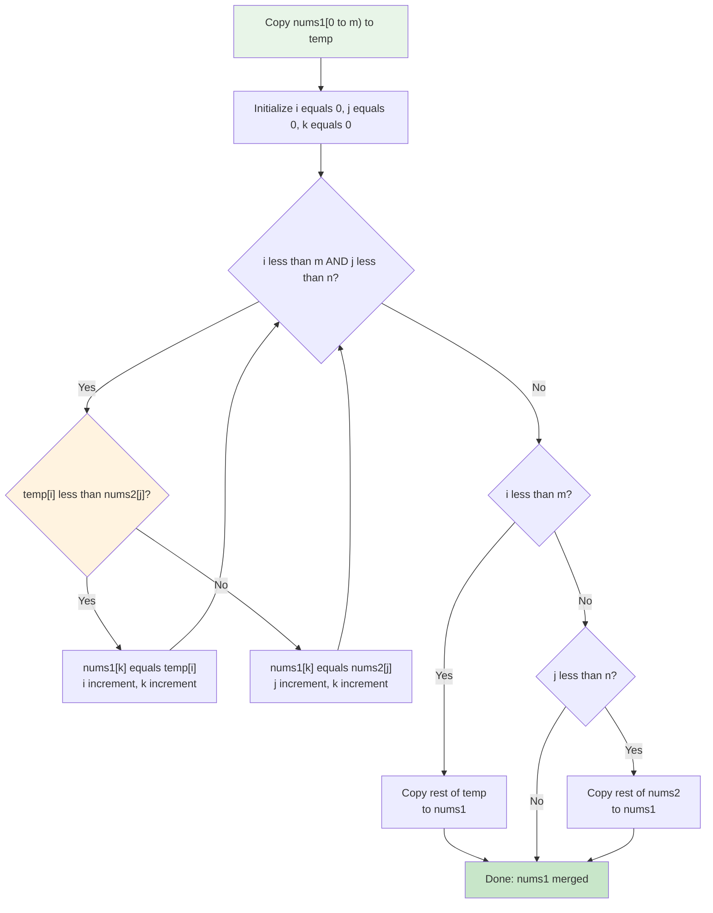

### 💻 The Code

```cpp
void merge(vector<int>& nums1, int m, vector<int>& nums2, int n) {
    vector<int> temp(nums1.begin(), nums1.begin() + m);
    
    int i = 0, j = 0, k = 0;
    
    // Merge phase
    while (i < m && j < n) {
        if(temp[i] < nums2[j]) {
            nums1[k++] = temp[i++];
        } else {
            nums1[k++] = nums2[j++];
        }
    }
    
    // Copy remaining
    while(i < m) nums1[k++] = temp[i++];
    while(j < n) nums1[k++] = nums2[j++];
}
```

### 🔍 Why Temporary Array Needed

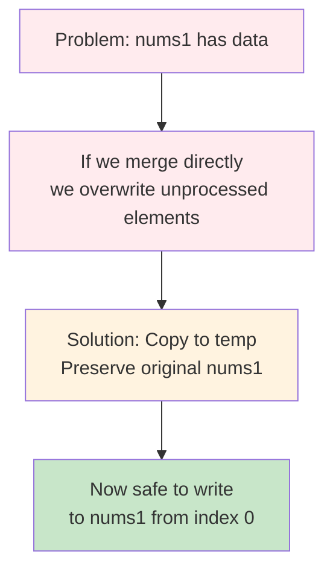

---

## 📊 Complexity Analysis - Problem 4

### ⏰ Time Complexity: O(m + n)

**Why linear?**
- Process each element from nums1 once: O(m)
- Process each element from nums2 once: O(n)
- Total: O(m + n)

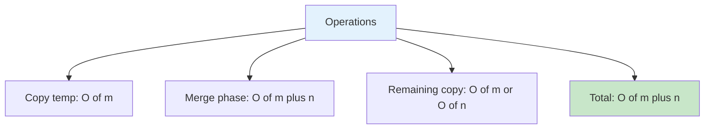

### 💾 Space Complexity: O(m)

**Why O(m)?**
- Temporary array stores m elements
- Three pointers: O(1)
- Total: O(m)

---

## 🧪 Test Cases & Edge Cases - Problem 4

### ✅ Normal Cases

| nums1 | m | nums2 | n | Output |
|-------|---|-------|---|--------|
| `[1,2,3,0,0,0]` | `3` | `[2,5,6]` | `3` | `[1,2,2,3,5,6]` |
| `[1,3,5,0,0,0]` | `3` | `[2,4,6]` | `3` | `[1,2,3,4,5,6]` |

### ⚠️ Edge Cases

| nums1 | m | nums2 | n | Output | Why |
|-------|---|-------|---|--------|-----|
| `[1]` | `1` | `[]` | `0` | `[1]` | nums2 empty |
| `[0]` | `0` | `[1]` | `1` | `[1]` | nums1 empty |
| `[4,5,6,0,0,0]` | `3` | `[1,2,3]` | `3` | `[1,2,3,4,5,6]` | nums2 all smaller |

---

## 🎓 Two-Pointer Pattern Mastery

### 🔢 Common Variations

```mermaid
flowchart TD
    A["Two-Pointer Patterns"] --> B["Single Array<br/>Two Pointers"]
    A --> C["Two Arrays<br/>One Pointer Each"]
    
    B --> B1["Slow-Fast<br/>Remove duplicates"]
    B --> B2["Left-Right<br/>Two sum sorted"]
    B --> B3["Partition<br/>Quick select"]
    
    C --> C1["Merge<br/>Merge sorted arrays"]
    C --> C2["Intersection<br/>Common elements"]
    
    style A fill:#e1f5fe
    style B fill:#e8f5e8
    style C fill:#fff3e0
```

### 🎯 When to Use Two-Pointer

**Use when:**
- Array is sorted or can be partitioned
- Need in-place modification
- Looking for pairs or subarrays
- Merging two sequences

**Don't use when:**
- Need to maintain exact original order (except stable variants)
- Random access required
- Need to track multiple properties per element

---

## 🧩 Pattern Comparison

### Side-by-Side Analysis

```mermaid
flowchart TD
    A["Problem Type"] --> B["Apply Operations<br/>Two-phase approach"]
    A --> C["Remove Element<br/>Filter pattern"]
    A --> D["Move Zeroes<br/>Stable partition"]
    A --> E["Merge Arrays<br/>Three-pointer merge"]
    
    B --> B1["O of n time, O of 1 space"]
    C --> C1["O of n time, O of 1 space"]
    D --> D1["O of n time, O of 1 space"]
    E --> E1["O of m plus n time, O of m space"]
    
    style A fill:#e1f5fe
    style B fill:#e8f5e8
    style C fill:#fff3e0
    style D fill:#ffecb3
    style E fill:#e0f2f1
```

| Feature | Apply Ops | Remove Element | Move Zeroes | Merge Arrays |
|---------|-----------|----------------|-------------|--------------|
| **Pointers** | 2 | 2 | 2 | 3 |
| **Phases** | 2 | 1 | 1 | 2 |
| **Stable** | Yes | No | Yes | Yes |
| **Space** | O(1) | O(1) | O(1) | O(m) |
| **Time** | O(n) | O(n) | O(n) | O(m+n) |

---

## 💼 Interview Questions & Answers

### ❓ Question 1: What's the difference between stable and unstable partitioning?

**Answer:**  
**Stable**: Maintains relative order of elements (Move Zeroes)  
**Unstable**: Order may change (Remove Element)

**Simple Explanation:**
```
Stable (Move Zeroes):
Input:  [0, 3, 0, 1, 0, 2]
Output: [3, 1, 2, 0, 0, 0]  // 3 before 1 before 2 preserved!

Unstable (Remove Element):
Input:  [3, 2, 2, 3], remove 3
Output: [2, 2, _, _]  // Order may not be preserved
```

**When it matters:**
- Stable: When relative order is important (e.g., maintaining timestamps)
- Unstable: When only values matter (e.g., filtering duplicates)

---

### ❓ Question 2: Why use swap instead of assignment in two-pointer?

**Answer:**  
Swap is more versatile and handles all cases elegantly:

```cpp
// Using swap (works for all cases)
if (nums[j] != 0) {
    swap(nums[zeroIndex++], nums[j]);
}

// Using assignment (requires extra logic)
if (nums[j] != 0) {
    if (zeroIndex != j) {  // Need to check!
        nums[zeroIndex] = nums[j];
        nums[j] = 0;  // May need to clear
    }
    zeroIndex++;
}
```

**Simple Explanation:**  
Swap handles the case where `zeroIndex == j` automatically (no-op swap). Assignment would need extra checks.

---

### ❓ Question 3: How do you know when to use two-pointer vs hash map?

**Answer:**  

**Use Two-Pointer when:**
- Array is sorted or can be rearranged
- Need O(1) space
- Working with pairs or subarrays
- In-place modification allowed

**Use Hash Map when:**
- Need to track element frequencies
- Array order must be preserved exactly
- Need fast lookups
- Space is not a constraint

**Example:**
```cpp
// Two-pointer (sorted array, O(1) space)
bool hasPairWithSum(vector<int>& nums, int target) {
    int left = 0, right = nums.size() - 1;
    while (left < right) {
        int sum = nums[left] + nums[right];
        if (sum == target) return true;
        if (sum < target) left++;
        else right--;
    }
    return false;
}

// Hash map (unsorted array, O(n) space)
bool hasPairWithSum(vector<int>& nums, int target) {
    unordered_set<int> seen;
    for (int num : nums) {
        if (seen.count(target - num)) return true;
        seen.insert(num);
    }
    return false;
}
```

---

### ❓ Question 4: What's the time complexity of Apply Operations problem?

**Answer:**  
**Time: O(n)** - Two sequential passes through the array

**Detailed Breakdown:**
```
Phase 1: Merge adjacent elements
- Loop from i = 0 to n-2: O(n)
- Each operation (multiply, assign): O(1)
- Total Phase 1: O(n)

Phase 2: Move zeros
- Loop from j = 0 to n-1: O(n)
- Each swap operation: O(1)
- Total Phase 2: O(n)

Combined: O(n) + O(n) = O(n)
```

**Simple Explanation:**  
Even though we have two loops, they're sequential (not nested), so we just add them: O(n) + O(n) = O(n).

---

### ❓ Question 5: Why does Move Zeroes preserve order but Remove Element doesn't?

**Answer:**  

**Move Zeroes preserves order because:**
- `zeroIndex <= j` always (zeroIndex never jumps ahead)
- Non-zeros are swapped forward in order of discovery
- The swap maintains their sequence

**Remove Element may change order because:**
- We don't care about order (problem allows it)
- Optimization: swap with anything valid
- Focus is on partitioning, not ordering

**Visual Proof:**
```
Move Zeroes: [0,1,0,3]
Step 1: zeroIndex=0, j=1 → swap → [1,0,0,3], zeroIndex=1
Step 2: zeroIndex=1, j=3 → swap → [1,3,0,0], zeroIndex=2
Result: 1 before 3 ✓ (order preserved)

Remove Element: [3,2,2,3], remove 3
Step 1: Skip 3
Step 2: Swap 2 to front
Step 3: Swap 2 to front
Step 4: Skip 3
Result: [2,2,_,_] (order happened to be preserved but not guaranteed)
```

---

### ❓ Question 6: How would you optimize Merge Sorted Array to O(1) space?

**Answer:**  
Merge from **back to front** instead of front to back!

```cpp
void merge(vector<int>& nums1, int m, vector<int>& nums2, int n) {
    int i = m - 1;      // Last element of nums1
    int j = n - 1;      // Last element of nums2
    int k = m + n - 1;  // Last position in merged array
    
    // Fill from back
    while (i >= 0 && j >= 0) {
        if (nums1[i] > nums2[j]) {
            nums1[k--] = nums1[i--];
        } else {
            nums1[k--] = nums2[j--];
        }
    }
    
    // Copy remaining nums2 elements (if any)
    while (j >= 0) {
        nums1[k--] = nums2[j--];
    }
}
```

**Why this works:**
- Extra space in nums1 is at the **end**
- By filling from back, we never overwrite unprocessed elements
- No temporary array needed!

**Simple Explanation:**  
Think of it like filling a glass from top to bottom - the empty space is where we're filling, so no conflicts!

---

### ❓ Question 7: What happens if you forget to increment pointers?

**Answer:**  
**Infinite loop!** The most common bug in two-pointer algorithms.

```cpp
// WRONG - Infinite loop
int zeroIndex = 0;
for (int j = 0; j < n; j++) {
    if (nums[j] != 0) {
        swap(nums[zeroIndex], nums[j]);
        // Forgot: zeroIndex++
    }
}
// zeroIndex never moves, keeps swapping same position!

// CORRECT
int zeroIndex = 0;
for (int j = 0; j < n; j++) {
    if (nums[j] != 0) {
        swap(nums[zeroIndex++], nums[j]);  // Post-increment!
    }
}
```

**Debug tip:**  
Use `zeroIndex++` as post-increment **inside** the swap call - harder to forget!

---

### ❓ Question 8: Can two-pointer work on unsorted arrays?

**Answer:**  
**Yes!** But for different purposes:

**Works on unsorted:**
- Partitioning (Move Zeroes, Remove Element)
- Finding subarrays with properties
- Dutch National Flag problem

**Requires sorted:**
- Two Sum on sorted array
- Container With Most Water
- Trapping Rain Water

**Example (unsorted is fine):**
```cpp
// Partition even/odd - doesn't need sorting
void partitionEvenOdd(vector<int>& nums) {
    int evenIndex = 0;
    for (int j = 0; j < nums.size(); j++) {
        if (nums[j] % 2 == 0) {
            swap(nums[evenIndex++], nums[j]);
        }
    }
}
```

---

### ❓ Question 9: What's the difference between two-pointer and sliding window?

**Answer:**  

**Two-Pointer:**
- Two independent pointers
- Can move in opposite directions
- Used for partitioning, merging, pair finding

**Sliding Window:**
- Forms a contiguous subarray
- Both pointers move in same direction (typically right)
- Used for subarray/substring problems with constraints

```cpp
// Two-Pointer (opposite directions)
int left = 0, right = n - 1;
while (left < right) {
    // Process
    left++; right--;
}

// Sliding Window (same direction)
int left = 0;
for (int right = 0; right < n; right++) {
    // Expand window
    while (condition) {
        // Shrink window
        left++;
    }
}
```

---

### ❓ Question 10: How do you test two-pointer algorithms?

**Answer:**  
Use these **comprehensive test categories**:

**1. Normal Cases:**
- Mixed elements
- Random distribution
- Typical inputs

**2. Edge Cases:**
- Empty array: `[]`
- Single element: `[5]`
- Two elements: `[1,2]`

**3. Extreme Cases:**
- All same: `[3,3,3,3]`
- All targets: `[0,0,0,0]` (for Move Zeroes)
- No targets: `[1,2,3]` (for Remove Element)

**4. Boundary Cases:**
- Target at beginning: `[0,1,2,3]`
- Target at end: `[1,2,3,0]`
- Alternating: `[0,1,0,2,0,3]`

**5. Already Sorted:**
- Already in desired state
- Verify no unnecessary operations

**Testing Template:**
```cpp
void testTwoPointer() {
    // Normal
    test({3,2,2,3}, 3, 2);
    
    // Edge
    test({}, 0, 0);
    test({1}, 1, 1);
    
    // Extreme
    test({5,5,5,5}, 5, 0);
    
    // Boundary
    test({5,1,2,3}, 5, 3);
    test({1,2,3,5}, 5, 3);
}
```

---

## 🚀 Practice Problems

Once you master these, try these similar problems:

### Easy Level
| Problem | LeetCode | Key Concept |
|---------|----------|-------------|
| 🔢 Remove Duplicates from Sorted Array | 26 | Two-pointer partition |
| 🔄 Reverse String | 344 | Left-right pointers |
| 🎯 Valid Palindrome | 125 | Two-pointer comparison |
| 📊 Sort Array By Parity | 905 | Partition technique |

### Medium Level
| Problem | LeetCode | Key Concept |
|---------|----------|-------------|
| 🌈 Sort Colors (Dutch Flag) | 75 | Three-way partition |
| 💧 Container With Most Water | 11 | Optimization with two pointers |
| 🔢 3Sum | 15 | Two-pointer + iteration |
| 🎪 Sort Array By Parity II | 922 | Dual partition |

### Advanced Techniques
| Problem | LeetCode | Key Concept |
|---------|----------|-------------|
| 💦 Trapping Rain Water | 42 | Two-pointer optimization |
| 🎯 Longest Mountain in Array | 845 | Multiple passes |
| 🔄 Squares of Sorted Array | 977 | Two-pointer merge |

---

## 🎯 Quick Reference

### 🔑 Essential Code Patterns

```cpp
// Pattern 1: Single Array Partition
int partition(vector<int>& nums, condition) {
    int boundary = 0;
    for (int j = 0; j < nums.size(); j++) {
        if (condition(nums[j])) {
            swap(nums[boundary++], nums[j]);
        }
    }
    return boundary;
}

// Pattern 2: Two Array Merge
void merge(vector<int>& arr1, vector<int>& arr2) {
    int i = 0, j = 0, k = 0;
    while (i < arr1.size() && j < arr2.size()) {
        if (arr1[i] < arr2[j]) {
            result[k++] = arr1[i++];
        } else {
            result[k++] = arr2[j++];
        }
    }
    // Copy remaining elements
}

// Pattern 3: Left-Right Pointers
void processOpposite(vector<int>& nums) {
    int left = 0, right = nums.size() - 1;
    while (left < right) {
        // Process
        if (condition) left++;
        else right--;
    }
}
```

### 📝 Important Concepts

```cpp
// Boundary invariant
// Elements at indices [0, boundary) satisfy property
// Elements at indices [boundary, n) don't satisfy property

// Post-increment trick
swap(nums[boundary++], nums[j]);  // Swap then increment

// Stability check
// If zeroIndex <= j always, algorithm is stable
```

---

## 🏆 Mastery Checklist

- [ ] ✅ Understand the two-pointer pattern and its variations
- [ ] ✅ Master boundary pointer concept (partition line)
- [ ] ✅ Know when to use stable vs unstable partitioning
- [ ] ✅ Implement Apply Operations (two-phase approach)
- [ ] ✅ Implement Remove Element (filter pattern)
- [ ] ✅ Implement Move Zeroes (stable partition)
- [ ] ✅ Implement Merge Sorted Array (three-pointer merge)
- [ ] ✅ Understand time complexity of each approach
- [ ] ✅ Master O(1) space in-place modifications
- [ ] ✅ Test all edge cases thoroughly
- [ ] ✅ Explain why swap maintains order in Move Zeroes
- [ ] ✅ Optimize Merge Sorted Array to O(1) space
- [ ] ✅ Distinguish between two-pointer and sliding window
- [ ] ✅ Answer common interview questions confidently
- [ ] ✅ Solve 5+ related practice problems

---

## 💡 Pro Tips

1. **🎯 Pointer Naming**: Use descriptive names like `zeroIndex`, `validIndex`, `boundary` instead of generic `i`, `j`

2. **🔄 Swap vs Assignment**: Prefer `swap()` - it's cleaner and handles edge cases automatically

3. **📊 Test Edge Cases First**: Empty array, single element, all same - catch bugs early

4. **🧪 Visualize Invariants**: Draw the array state showing what each pointer represents
   ```
   [valid valid valid | garbage garbage]
                      ↑
                   boundary
   ```

5. **⚡ Post-Increment Trick**: Use `nums[boundary++]` to swap and increment in one line

6. **🎓 Learn Pattern Variations**: Master the basic pattern, then apply to different problems

7. **💭 Think About Stability**: Ask yourself "Does order matter?" before choosing approach

8. **🔍 Debug with Print**: Add `cout` statements showing pointer positions at each step

9. **📚 Study Merge Sort**: The merge step is the foundation of many two-pointer algorithms

10. **🎯 Practice Boundary Conditions**: Most bugs occur at array boundaries (start/end)

---

## 🧠 Mental Model

```mermaid
flowchart TD
    A["Two-Pointer Problem"] --> B{"Array Properties?"}
    B -->|"Sorted"| C["Consider:<br/>- Pair finding<br/>- Merge operations<br/>- Binary pattern"]
    B -->|"Unsorted"| D["Consider:<br/>- Partitioning<br/>- Filtering<br/>- Rearranging"]
    
    C --> E{"Need to maintain order?"}
    D --> E
    
    E -->|"Yes"| F["Use Stable Partition<br/>Move Zeroes pattern"]
    E -->|"No"| G["Use Unstable Partition<br/>Remove Element pattern"]
    
    F --> H["Implement with care:<br/>zeroIndex ≤ j always"]
    G --> I["Optimize freely:<br/>Just partition correctly"]
    
    style A fill:#e1f5fe
    style B fill:#fff3e0
    style E fill:#f3e5f5
    style F fill:#e8f5e8
    style G fill:#ffecb3
```

---

## 🎓 Key Takeaways

### Core Principles

1. **Boundary Pointer**: Tracks the dividing line between two regions
2. **Scan Pointer**: Explores the array to find elements to move
3. **Invariant**: Maintain property that boundary represents throughout

### Pattern Recognition

**When you see:**
- "Remove all occurrences" → Two-pointer partition
- "Move all X to end" → Two-pointer stable partition
- "Merge two sorted arrays" → Three-pointer merge
- "In-place" + "O(1) space" → Strong hint for two-pointer

### Common Pitfalls

- ❌ Forgetting to increment pointers (infinite loop)
- ❌ Using wrong boundary condition (off-by-one errors)
- ❌ Overwriting unprocessed elements
- ❌ Not testing edge cases (empty, single element)

---

**🎉 Congratulations! You now have a complete understanding of two-pointer array manipulation techniques. You can confidently solve partitioning, merging, and filtering problems efficiently. Keep practicing and happy coding!**
