# Day 30: 🗑️ Remove All Adjacent Duplicates In String - Complete Beginner's Guide

> **Master stack simulation and string manipulation step by step!**


---

## 📖 What You'll Learn

By the end of this guide, you'll master:
- 📚 **Stack Data Structure** - Understanding stack operations using strings
- 🔄 **String Manipulation** - Building and modifying strings efficiently
- 🎯 **Greedy Algorithms** - Making optimal local decisions
- 🧮 **Pattern Recognition** - Identifying adjacent duplicate patterns

---

## 🎯 The Problem

### 📋 Problem Statement

**Given**: A string `s` consisting of lowercase English letters  
**Task**: Repeatedly remove adjacent duplicate letters until no more can be removed  
**Return**: The final string after all removals

**Important Rule**: A removal creates new adjacencies that may form new duplicates!

### 🌟 Real-World Example

Think of it like cleaning up a messy word:
- **"abbaca"** → Remove "bb" → "aaca" → Remove "aa" → **"ca"**
- **"azxxzy"** → Remove "xx" → "azzy" → Remove "zz" → **"ay"**
- **"aabbcc"** → All pairs cancel out → **""** (empty string)

---

## 🔍 Understanding the Basics

### 🏗️ What is a Stack?

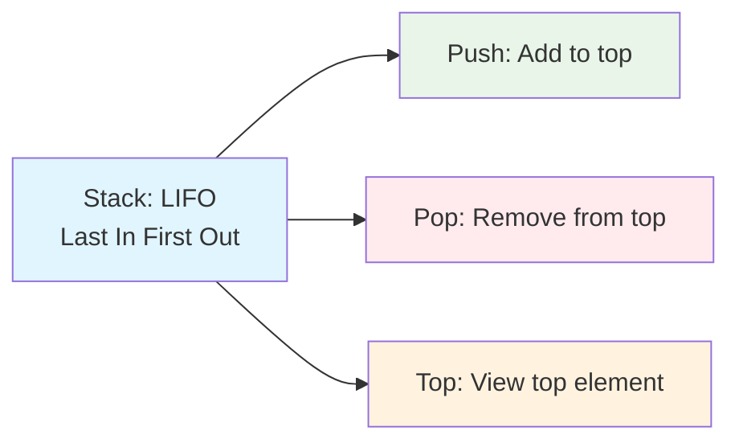

**Think of it like a stack of plates:**
- You add plates on top (push)
- You remove plates from top (pop)
- You can only see the top plate

### 🎲 Using String as Stack

In C++, strings have stack-like operations:

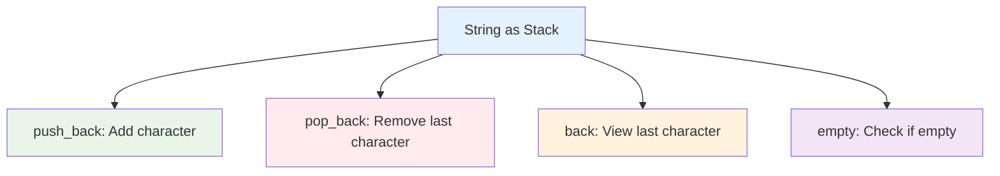

**Why use string instead of stack?**
- No conversion needed (result is already a string)
- Direct access to all stack operations
- More efficient for character manipulation

---

## 📚 Step-by-Step Examples

### 🟢 Example 1: Basic Duplicate Removal

**Input:** `s = "abbaca"`  
**Output:** `"ca"`

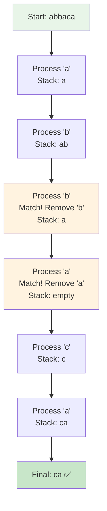

**Step-by-step breakdown:**
1. **'a':** Stack empty → Add 'a' → Stack: `[a]`
2. **'b':** Top is 'a' ≠ 'b' → Add 'b' → Stack: `[a, b]`
3. **'b':** Top is 'b' = 'b' → **Remove** → Stack: `[a]`
4. **'a':** Top is 'a' = 'a' → **Remove** → Stack: `[]`
5. **'c':** Stack empty → Add 'c' → Stack: `[c]`
6. **'a':** Top is 'c' ≠ 'a' → Add 'a' → Stack: `[c, a]`
7. **Done:** Return `"ca"`

### 🔴 Example 2: Complete Cancellation

**Input:** `s = "aabbcc"`  
**Output:** `""` (empty)

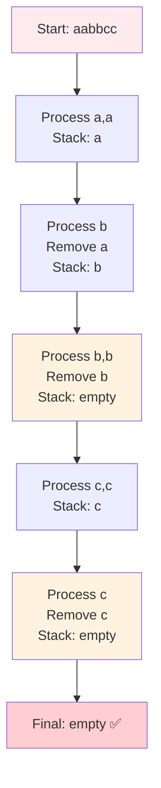

**The Magic:**
- First 'a' added, second 'a' removes it
- First 'b' added, second 'b' removes it
- First 'c' added, second 'c' removes it
- Everything cancels out!

### 🟡 Example 3: Nested Removals

**Input:** `s = "azxxzy"`  
**Output:** `"ay"`

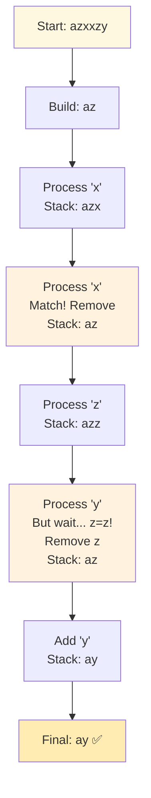

**Key Insight:** Removing "xx" creates a new adjacency "zz" that also gets removed!

### 🚨 Example 4: Cascading Removals

**Input:** `s = "abccba"`  
**Output:** `""` (empty)

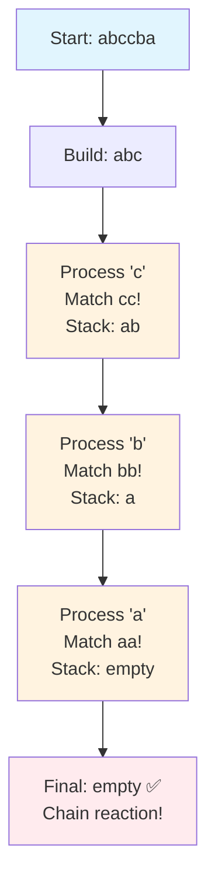

**Chain Reaction:**
1. Remove "cc" → exposes "bb"
2. Remove "bb" → exposes "aa"
3. Remove "aa" → everything gone!

---

## 🛠️ The Algorithm

### 🎯 Main Strategy: Stack Simulation

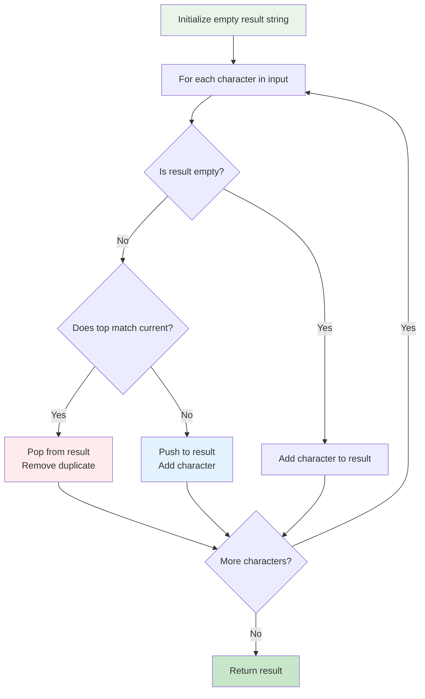

### 💻 The Code

```cpp
string removeDuplicates(string s) {
    string result;
    
    for (char c : s) {
        // 🔍 CHECK: Does current char match top of stack?
        if (!result.empty() && result.back() == c) {
            result.pop_back();  // 🗑️ REMOVE: Found duplicate!
        } else {
            result.push_back(c);  // ✅ ADD: No match, add to stack
        }
    }
    
    return result;
}
```

### 🛡️ Algorithm Logic Explained

**Why does this work?**

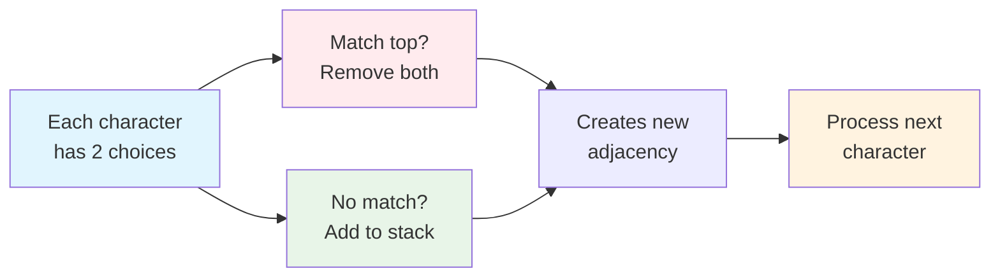

**The Greedy Nature:**
- We remove duplicates **immediately** when found
- We don't wait or look ahead
- Each removal is **locally optimal**
- The final result is **globally optimal**

---

## 🧪 Test Cases & Edge Cases

### ✅ Normal Cases

| Input | Output | Explanation |
|-------|--------|-------------|
| `"abbaca"` | `"ca"` | Remove "bb", then "aa" |
| `"azxxzy"` | `"ay"` | Remove "xx", then "zz" |
| `"abcdef"` | `"abcdef"` | No adjacent duplicates |

### ⚠️ Edge Cases

| Input | Output | Explanation |
|-------|--------|-------------|
| `"a"` | `"a"` | Single character remains |
| `"aa"` | `""` | Single pair cancels |
| `"aabbcc"` | `""` | All pairs cancel |
| `"aaaa"` | `""` | Even count cancels completely |
| `"aaaaa"` | `"a"` | Odd count leaves one |

### 🎯 Boundary Testing

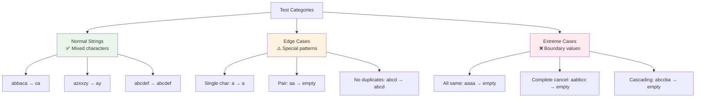

---

## 🎓 Key Concepts Mastery

### 📚 Stack Operations

**1. Check If Empty:**
```cpp
if (!result.empty()) {
    // Safe to access top
}
```

**2. Access Top Element:**
```cpp
char top = result.back();
// Gets last character without removing
```

**3. Add Element (Push):**
```cpp
result.push_back(c);
// Adds character to end
```

**4. Remove Element (Pop):**
```cpp
result.pop_back();
// Removes last character
```

### 🔄 String vs Stack Comparison

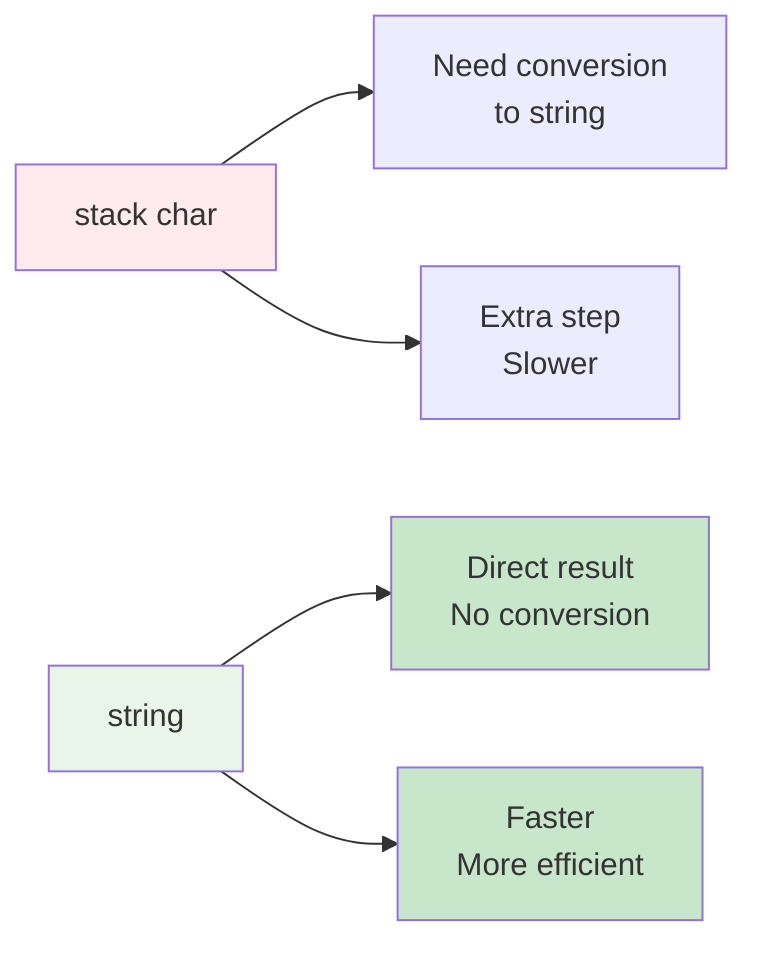

### 🎯 Problem-Solving Framework

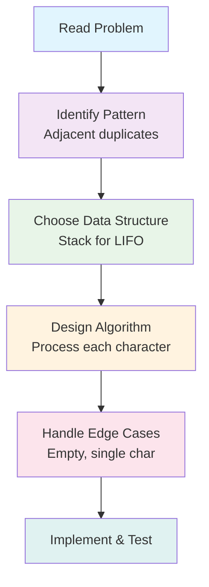

---

## 📊 Complexity Analysis

### ⏰ Time Complexity: O(n)

**Why linear time?**
- We process each character exactly once
- Push and pop operations are O(1)
- Total: n characters × O(1) = O(n)

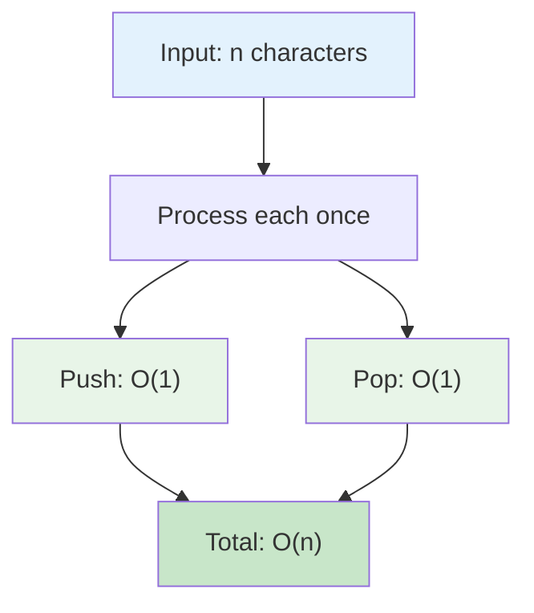

### 💾 Space Complexity: O(n)

**Why linear space?**
- Result string can be at most size n
- Worst case: No duplicates found
- Example: "abcdef" → result = "abcdef" (size 6)

**Best Case Space:** O(1) when everything cancels out
**Average Case Space:** O(n/2) with some removals
**Worst Case Space:** O(n) with no removals

---

## 🚀 Practice Problems

Once you master this, try these similar problems:

| Problem | Difficulty | Key Concept |
|---------|------------|-------------|
| 🔒 Valid Parentheses (LC 20) | Easy | Stack matching |
| ⌫ Backspace String Compare (LC 844) | Easy | Stack simulation |
| 🗑️ Remove All Adjacent Duplicates II (LC 1209) | Medium | Stack with counter |
| 🔄 Remove K Digits (LC 402) | Medium | Stack optimization |

---

## 💼 Interview Questions & Answers

### ❓ Question 1: Why use a string instead of stack<char>?

**Answer:**  
Using `string` is more efficient because:
- The result needs to be a string anyway
- No conversion overhead from stack to string
- String has all necessary stack operations (`push_back`, `pop_back`, `back`, `empty`)
- Direct return without extra processing

**Simple Explanation:**  
It's like building a wall with bricks. Why use a separate container for bricks when you can build directly? String lets us "build" the answer directly!

---

### ❓ Question 2: How does removal create new adjacencies?

**Answer:**  
When we remove a duplicate pair, the characters on either side become adjacent.

**Example with "azxxzy":**
```
Original: a z x x z y
          ↓ ↓ ═══ ↓ ↓
After:    a z   z y     (removed xx, now zz is adjacent!)
          ↓ ═══ ↓
Final:    a     y       (removed zz)
```

**Simple Explanation:**  
Think of removing dominoes from a line. When you remove two middle dominoes, the ones on either side now touch each other!

---

### ❓ Question 3: What if we process from right to left instead?

**Answer:**  
The algorithm would still work! The order doesn't matter because:
- We're removing adjacent pairs
- Each removal creates the same new adjacencies
- Final result will be identical

**Code Example:**
```cpp
string removeDuplicates(string s) {
    string result;
    for (int i = s.length()-1; i >= 0; i--) {  // Reverse order
        char c = s[i];
        if (!result.empty() && result.back() == c) {
            result.pop_back();
        } else {
            result.push_back(c);
        }
    }
    reverse(result.begin(), result.end());  // Reverse result
    return result;
}
```

---

### ❓ Question 4: Can we solve this without extra space?

**Answer:**  
**No**, we need O(n) space in the worst case because:
- We must return a string (needs space)
- Can't modify input string in-place efficiently in C++
- Even if we could, worst case (no duplicates) still needs O(n)

**Simple Explanation:**  
We need somewhere to build the answer. Even if we reuse the input string, we still need O(n) space for the result.

---

### ❓ Question 5: What's the maximum number of passes needed?

**Answer:**  
**One pass!** That's the beauty of the stack approach.

**Why only one pass?**
- We handle removals immediately as we find them
- Each removal automatically creates new adjacencies
- The stack naturally handles cascading removals

**Example of cascading in one pass:**
```
Input: abccba
Step 1: a → [a]
Step 2: b → [a,b]
Step 3: c → [a,b,c]
Step 4: c → [a,b]      (removed cc)
Step 5: b → [a]        (removed bb automatically!)
Step 6: a → []         (removed aa automatically!)
```

**Simple Explanation:**  
The stack automatically handles chain reactions. Like dominoes falling - once you tip the first, all connected ones fall in one motion!

---

### ❓ Question 6: How do you handle an empty string input?

**Answer:**  
```cpp
s = ""
→ Loop doesn't run (no characters)
→ result remains empty
→ Return ""
```

**Simple Explanation:**  
Empty input → empty output. The algorithm handles it naturally without special cases!

---

### ❓ Question 7: What if characters can be uppercase and lowercase?

**Answer:**  
The algorithm still works, but 'A' ≠ 'a':

```cpp
// "aAbBcC" → "aAbBcC" (no removals, different cases)
// "aabbcc" → "" (all removals, same case)
```

If problem wants case-insensitive matching:
```cpp
if (!result.empty() && tolower(result.back()) == tolower(c)) {
    result.pop_back();
} else {
    result.push_back(c);
}
```

---

### ❓ Question 8: Can you prove the algorithm is optimal?

**Answer:**  
**Yes!** It's optimal because:

**Time:** O(n) is best possible
- Must read all n characters at least once
- Can't do better than linear time

**Space:** O(n) is necessary
- Must store the result (could be full input)
- Can't do better than linear space

**Simple Explanation:**  
You can't build a house faster than the time it takes to look at each brick. We look at each character once - that's optimal!

---

### ❓ Question 9: What if we want to remove k adjacent duplicates?

**Answer:**  
That's LeetCode 1209! Use a stack with counters:

```cpp
string removeDuplicates(string s, int k) {
    vector<pair<char, int>> stack;  // {character, count}
    
    for (char c : s) {
        if (!stack.empty() && stack.back().first == c) {
            stack.back().second++;
            if (stack.back().second == k) {
                stack.pop_back();  // Remove k duplicates
            }
        } else {
            stack.push_back({c, 1});
        }
    }
    
    string result;
    for (auto& p : stack) {
        result.append(p.second, p.first);
    }
    return result;
}
```

---

### ❓ Question 10: How would you debug this algorithm?

**Answer:**  
**Visualization is key!**

```cpp
void debugRemoveDuplicates(string s) {
    string result;
    cout << "Processing: " << s << "\n";
    
    for (char c : s) {
        cout << "Char '" << c << "': ";
        
        if (!result.empty() && result.back() == c) {
            cout << "Match! Remove '" << result.back() << "' ";
            result.pop_back();
        } else {
            cout << "Add '" << c << "' ";
            result.push_back(c);
        }
        
        cout << "→ [" << result << "]\n";
    }
    
    cout << "Final: " << result << "\n";
}
```

**Simple Explanation:**  
Print the stack after each step. See what's being added or removed. Visual debugging helps you understand the flow!

---

### 🎯 Common Interview Follow-ups

**Q: "Can you optimize further?"**  
A: Already optimal! O(n) time and O(n) space is the theoretical minimum.

**Q: "What if input is very large (millions of characters)?"**  
A: Algorithm scales linearly. For 1M chars: ~1M operations, very efficient.

**Q: "Is this a greedy algorithm?"**  
A: Yes! We make the locally optimal choice (remove duplicates immediately) which leads to the globally optimal solution.

**Q: "How would you test this thoroughly?"**  
A: Test cases should include:
- Normal: mixed characters with some duplicates
- Edge: empty string, single char, pair
- Extreme: all same chars, complete cancellation, no duplicates
- Cascading: removals that create new adjacencies

---

## 🎯 Quick Reference

### 🔑 Essential Code Pattern

```cpp
// Stack simulation with string
string result;
for (char c : input) {
    if (!result.empty() && result.back() == c) {
        result.pop_back();  // Remove duplicate
    } else {
        result.push_back(c);  // Add character
    }
}
return result;
```

### 📝 Key String Operations

```cpp
result.empty()      // Check if empty
result.back()       // Get last character
result.push_back(c) // Add character
result.pop_back()   // Remove last character
```

### 🧠 Mental Model

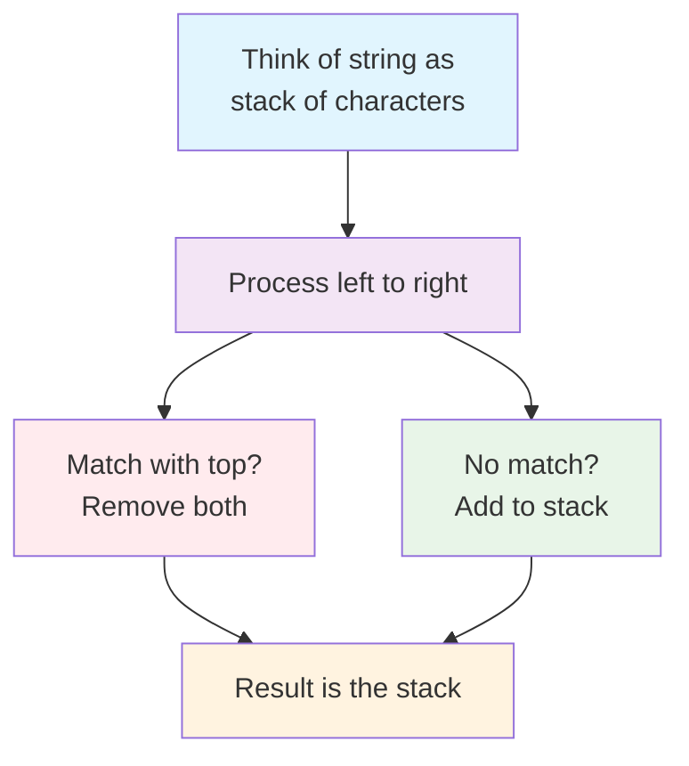

---

## 🏆 Mastery Checklist

- [ ] ✅ Understand stack data structure and LIFO principle
- [ ] ✅ Know how to use string as stack in C++
- [ ] ✅ Recognize when removals create new adjacencies
- [ ] ✅ Handle cascading removals in one pass
- [ ] ✅ Deal with edge cases (empty, single char, all duplicates)
- [ ] ✅ Solve the problem in O(n) time
- [ ] ✅ Use O(n) space optimally
- [ ] ✅ Test with normal, edge, and extreme cases
- [ ] ✅ Explain the greedy nature of the algorithm
- [ ] ✅ Answer interview questions confidently

---

## 💡 Pro Tips

1. **🛡️ Stack Awareness**: Always check `!result.empty()` before accessing `back()`
2. **🔍 Visualize**: Draw the stack state after each character to understand flow
3. **🧪 Test Cascading**: Focus on test cases where one removal triggers others
4. **📚 Pattern Recognition**: This technique applies to many matching/pairing problems
5. **🎯 Greedy Insight**: Recognize that immediate removal is optimal - no need to look ahead
6. **💼 Interview Prep**: Be ready to explain why string is better than stack<char>
7. **🐛 Debug Technique**: Print stack contents after each operation during development

---

**🎉 Congratulations! You now have a complete understanding of stack simulation, adjacent duplicate removal, and can confidently tackle similar string manipulation problems. Keep practicing and happy coding!**
