```mermaid
flowchart TD
    A["Start: A man, a plan, a canal: Panama"] --> B["Step 1: Filter<br/>amanaplanacanalpanama"]
    B --> C["Step 2: Check with pointers<br/>left=0, right=20"]
    C --> D["Compare: a == a ✅"]
    D --> E["Move: left=1, right=19"]
    E --> F["Compare: m == m ✅"]
    F --> G["Continue checking..."]
    G --> H["Final: All match! ✅<br/>Return true"]
    
    style A fill:#e8f5e8
    style B fill:#e1f5fe
    style H fill:#c8e6c9
```

# Day 31: 🔄 Valid Palindrome & Reverse String - Complete Beginner's Guide

> **Master string manipulation and two-pointer techniques step by step!**


---

## 📖 What You'll Learn

By the end of this guide, you'll master:
- 🔤 **String Manipulation** - How to process and transform strings effectively
- ⚡ **Two-Pointer Technique** - The power of dual-pointer algorithms
- 🎯 **Character Filtering** - Removing unwanted characters efficiently
- 🔍 **Palindrome Detection** - Checking if strings read the same forwards and backwards
- 💾 **In-Place Modification** - Working with constant space complexity

---

## 🎯 The Problems

### 📋 Problem 1: Valid Palindrome (LeetCode 125)

**Given**: A string `s`  
**Task**: Determine if it's a palindrome after removing non-alphanumeric characters and ignoring case  
**Return**: `true` if palindrome, `false` otherwise

**Important Rules**: 
- Consider only alphanumeric characters (letters and numbers)
- Ignore cases (uppercase and lowercase are treated as equal)
- Empty string is considered a palindrome

### 📋 Problem 2: Reverse String (LeetCode 344)

**Given**: A character array `s`  
**Task**: Reverse the array in-place  
**Constraint**: Must use O(1) extra space (no additional arrays allowed)

### 🌟 Real-World Examples

**Valid Palindrome:**
- **"A man, a plan, a canal: Panama"** → After filtering: "amanaplanacanalpanama" → **Palindrome!** ✅
- **"race a car"** → After filtering: "raceacar" → **Not a palindrome** ❌

**Reverse String:**
- **['h','e','l','l','o']** → **['o','l','l','e','h']**
- **['H','a','n','n','a','h']** → **['h','a','n','n','a','H']**

---

## 🔍 Understanding the Basics

### 🏗️ What is a Palindrome?


**Think of it like a mirror:**
- The first half reflects the second half
- "racecar" reads the same both directions
- "hello" does NOT (olleh ≠ hello)

### 🎲 Two-Pointer Technique Magic

The two-pointer technique uses two variables to traverse data from different positions:


**Key Operations:**
- `left++` → Move left pointer forward
- `right--` → Move right pointer backward
- Continue until `left >= right`

---

## 📚 Step-by-Step Examples

### 🟢 Problem 1: Valid Palindrome

#### Example 1: Classic Palindrome

**Input:** `"A man, a plan, a canal: Panama"`  
**Output:** `true`



**Step-by-step breakdown:**
1. **Start:** Original string with spaces and punctuation
2. **Filter:** Extract "amanaplanacanalpanama"
3. **Step 1:** Compare 'a' (start) with 'a' (end) → Match ✅
4. **Step 2:** Compare 'm' with 'm' → Match ✅
5. **Step 3:** Compare 'a' with 'a' → Match ✅
6. **Continue...** All characters match!
7. **Result:** Valid palindrome → `true`

#### Example 2: Not a Palindrome

**Input:** `"race a car"`  
**Output:** `false`

```mermaid
flowchart TD
    A["Start: race a car"] --> B["Step 1: Filter<br/>raceacar"]
    B --> C["Step 2: Check with pointers<br/>left=0, right=7"]
    C --> D["Compare: r == r ✅"]
    D --> E["Move: left=1, right=6"]
    E --> F["Compare: a == a ✅"]
    F --> G["Move: left=2, right=5"]
    G --> H["Compare: c == c ✅"]
    H --> I["Move: left=3, right=4"]
    I --> J["Compare: e != a ❌<br/>Return false"]
    
    style A fill:#ffebee
    style J fill:#ff5252
```



**Why it fails:**
- After filtering: "raceacar"
- When comparing from both ends:
  - r==r ✅, a==a ✅, c==c ✅
  - But e≠a ❌ → Not a palindrome!

#### Example 3: Empty and Special Cases

**Input:** `" "`  (single space)
**Output:** `true`



```mermaid
flowchart TD
    A["Start: single space"] --> B["Filter: empty string"]
    B --> C["Empty is palindrome<br/>by definition"]
    C --> D["Return true ✅"]
    
    style A fill:#fff8e1
    style D fill:#ffecb3
```

**Magic of Edge Cases:**
- Empty strings are palindromes by definition
- Single characters are always palindromes
- Only non-alphanumeric → filters to empty → palindrome

---

### 🔵 Problem 2: Reverse String

#### Example 1: Simple Reversal

**Input:** `['h','e','l','l','o']`  
**Output:** `['o','l','l','e','h']`

```mermaid
flowchart TD
    A["Initial: h e l l o"] --> B["left=0, right=4<br/>Swap h and o"]
    B --> C["Result: o e l l h<br/>Move pointers"]
    C --> D["left=1, right=3<br/>Swap e and l"]
    D --> E["Result: o l l e h<br/>Move pointers"]
    E --> F["left=2, right=2<br/>Pointers meet!"]
    F --> G["Final: o l l e h ✅"]
    
    style A fill:#e8f5e8
    style G fill:#c8e6c9
```



**Step-by-step breakdown:**
1. **Start:** ['h','e','l','l','o'], left=0, right=4
2. **Swap 1:** Swap 'h' and 'o' → ['o','e','l','l','h']
3. **Move:** left=1, right=3
4. **Swap 2:** Swap 'e' and 'l' → ['o','l','l','e','h']
5. **Move:** left=2, right=2 (pointers meet)
6. **Done:** Middle element stays in place

#### Example 2: Palindrome Reversal

**Input:** `['H','a','n','n','a','h']`  
**Output:** `['h','a','n','n','a','H']`

```mermaid
flowchart TD
    A["Initial: H a n n a h"] --> B["left=0, right=5<br/>Swap H and h"]
    B --> C["Result: h a n n a H<br/>Move pointers"]
    C --> D["left=1, right=4<br/>Swap a and a"]
    D --> E["Result: h a n n a H<br/>Move pointers"]
    E --> F["left=2, right=3<br/>Swap n and n"]
    F --> G["Result: h a n n a H<br/>Pointers meet"]
    G --> H["Final: h a n n a H ✅"]
    
    style A fill:#e1f5fe
    style H fill:#e0f2f1
```



#### Example 3: Edge Cases

**Input:** `['a']` (single character)  
**Output:** `['a']`

```mermaid
flowchart TD
    A["Single element: a"] --> B["left=0, right=0"]
    B --> C["Pointers already met!"]
    C --> D["No swaps needed"]
    D --> E["Result: a ✅"]
    
    style A fill:#fff3e0
    style E fill:#ffecb3
```



**Edge Case Handling:**
- Single character: No swaps needed
- Two characters: One swap
- Palindrome: Still gets reversed correctly

---

## 🛠️ The Algorithms

### 🎯 Problem 1: Valid Palindrome Strategy


### 🎯 Problem 2: Reverse String Strategy


### 💻 The Code

**Valid Palindrome:**
```cpp
bool isPalindrome(string s) {
    string temp;
    
    // 🔧 FILTER: Extract alphanumeric and convert to lowercase
    for (char val : s) {
        if (isAlphaNum(val))
            temp.push_back(toLowerCase(val));
    }
    
    // 🔍 CHECK: Use two pointers
    int a = 0, b = temp.size() - 1;
    while (a < b) {
        if (temp[a] != temp[b])
            return false;  // ❌ Mismatch found
        a++;
        b--;
    }
    
    return true;  // ✅ All matched
}
```

**Reverse String:**
```cpp
void reverseString(vector<char>& s) {
    int a = 0;              // Left pointer
    int b = s.size() - 1;   // Right pointer
    
    // 🔄 SWAP: From both ends toward center
    while (a < b) {
        swap(s[a], s[b]);
        a++;
        b--;
    }
}
```

---

## 🧪 Test Cases & Edge Cases

### ✅ Valid Palindrome - Normal Cases

| Input | Filtered | Output | Why |
|-------|----------|--------|-----|
| `"A man, a plan, a canal: Panama"` | `"amanaplanacanalpanama"` | `true` | Perfect palindrome |
| `"race a car"` | `"raceacar"` | `false` | Not symmetric |
| `"Madam"` | `"madam"` | `true` | Case insensitive match |

### ⚠️ Valid Palindrome - Edge Cases

| Input | Filtered | Output | Why |
|-------|----------|--------|-----|
| `" "` | `""` | `true` | Empty after filtering |
| `""` | `""` | `true` | Empty string |
| `"a"` | `"a"` | `true` | Single character |
| `".,!@#"` | `""` | `true` | No alphanumeric chars |

### ✅ Reverse String - Normal Cases

| Input | Output | Why |
|-------|--------|-----|
| `['h','e','l','l','o']` | `['o','l','l','e','h']` | Basic reversal |
| `['H','a','n','n','a','h']` | `['h','a','n','n','a','H']` | Even length |

### ⚠️ Reverse String - Edge Cases

| Input | Output | Why |
|-------|--------|-----|
| `['a']` | `['a']` | Single element |
| `['a','b']` | `['b','a']` | Two elements |
| `['a','b','b','a']` | `['a','b','b','a']` | Palindrome unchanged structurally |

### 🎯 Testing Strategy

```mermaid
flowchart TD
    A["Test Categories"] --> B["Normal Cases<br/>✅ Standard inputs"]
    A --> C["Edge Cases<br/>⚠️ Special handling"]
    A --> D["Boundary Cases<br/>🎯 Extreme values"]
    
    B --> B1["Valid Palindrome:<br/>Mixed punctuation"]
    B --> B2["Reverse String:<br/>Odd/even lengths"]
    
    C --> C1["Empty strings"]
    C --> C2["Single character"]
    C --> C3["All same characters"]
    
    D --> D1["Very long strings"]
    D --> D2["Only special characters"]
    
    style B fill:#e8f5e8
    style C fill:#fff3e0
    style D fill:#e1f5fe
```



---

## 🎓 Key Concepts Mastery

### 🔢 Character Manipulation Techniques

**1. Check if Alphanumeric:**
```cpp
bool isAlphaNum(char ch) {
    return (ch >= 'a' && ch <= 'z') || 
           (ch >= 'A' && ch <= 'Z') || 
           (ch >= '0' && ch <= '9');
}
```

**2. Convert to Lowercase:**
```cpp
char toLowerCase(char ch) {
    if (ch >= 'A' && ch <= 'Z')
        return ch - 'A' + 'a';
    return ch;
}
```

**3. Swap Elements:**
```cpp
swap(s[left], s[right]);
// Equivalent to:
// char temp = s[left];
// s[left] = s[right];
// s[right] = temp;
```

### ⚡ Two-Pointer Patterns


**Pattern to Remember:**
```cpp
int left = 0;
int right = n - 1;

while (left < right) {
    // Process elements at left and right
    // Move pointers toward center
    left++;
    right--;
}
```

### 🎯 Problem-Solving Framework


---

## 📊 Complexity Analysis

### ⏰ Time Complexity

**Valid Palindrome: O(n)**

**Why linear?**
- Filter pass: O(n) - Visit each character once
- Comparison pass: O(n) - Check filtered string
- Total: O(n) + O(n) = O(n)


**Reverse String: O(n)**

**Why linear?**
- Swap n/2 pairs of elements
- Each swap is O(1)
- Total: O(n/2) = O(n)


### 💾 Space Complexity

**Valid Palindrome: O(n)**
- Filtered string stores up to n characters
- Two pointer variables: O(1)
- Total: O(n) space

**Reverse String: O(1)**
- In-place modification
- Only two pointer variables
- No additional data structures
- Total: O(1) space ✨


---

## 🚀 Practice Problems

Once you master these, try these similar problems:

### Valid Palindrome Related:
| Problem | Difficulty | Key Concept |
|---------|------------|-------------|
| 🔢 Palindrome Number | Easy | Integer palindrome |
| 🔄 Valid Palindrome II | Easy | Allow one deletion |
| 💎 Longest Palindromic Substring | Medium | Dynamic programming |
| 🌟 Palindrome Linked List | Easy | Linked list reversal |

### Reverse String Related:
| Problem | Difficulty | Key Concept |
|---------|------------|-------------|
| 🔄 Reverse String II | Easy | Selective reversal |
| 🔢 Reverse Integer | Easy | Number manipulation |
| 📝 Reverse Words in String | Medium | Word-level reversal |
| 🔗 Reverse Linked List | Easy | Pointer manipulation |

---

## 💼 Interview Questions & Answers

### ❓ Question 1: Why do we need to filter non-alphanumeric characters?

**Answer:**  
The problem definition requires us to consider only letters and numbers. Punctuation and spaces are not part of the palindrome check.

**Simple Explanation:**  
"A man, a plan, a canal: Panama" has commas and colons, but for palindrome checking, we only care about: "amanaplanacanalpanama"

**Code Insight:**
```cpp
// Without filtering: "A man" != "nam A" ❌
// With filtering: "Aman" != "namA" (still need case handling) 
// With filtering + lowercase: "aman" == "nama" (reversed: aman) ✅
```

---

### ❓ Question 2: Why use two pointers instead of reversing the entire string?

**Answer:**  
Two pointers are more efficient:
- **Two-pointer:** O(n) time, check as we go
- **Full reversal:** O(n) time + O(n) space for reversed copy

**Simple Explanation:**  
It's like checking if your left shoe matches your right shoe. You don't need to swap all shoes - just compare from both ends!

**Efficiency Comparison:**
```cpp
// Two-pointer: Space O(1) for comparison part
while (left < right) {
    if (s[left] != s[right]) return false;
    left++; right--;
}

// Full reversal: Space O(n) for copy
string rev = s;
reverse(rev.begin(), rev.end());
return s == rev;  // Extra space!
```

---

### ❓ Question 3: What happens with empty strings?

**Answer:**  
Empty strings are palindromes by definition. A palindrome reads the same forwards and backwards - an empty string satisfies this trivially.

**Simple Explanation:**
```
Empty string: ""
Forward: "" 
Backward: ""
Are they equal? Yes! ✅
```

**Code Behavior:**
```cpp
string temp = "";  // After filtering non-alphanumeric
int left = 0, right = -1;  // right = temp.size() - 1
while (left < right)  // 0 < -1 is false
    // Loop never executes
return true;  // ✅
```

---

### ❓ Question 4: How does in-place reversal save space?

**Answer:**  
In-place means we modify the original array without creating a copy. This uses O(1) space instead of O(n).

**Simple Explanation:**  
Instead of creating a new array to store the reversed version, we swap elements within the same array.

**Space Comparison:**
```cpp
// ❌ NOT in-place: O(n) space
vector<char> reversed;
for (int i = s.size()-1; i >= 0; i--) {
    reversed.push_back(s[i]);  // New array!
}

// ✅ In-place: O(1) space
int left = 0, right = s.size()-1;
while (left < right) {
    swap(s[left], s[right]);  // Same array!
    left++; right--;
}
```

---

### ❓ Question 5: What's the time complexity of character conversion?

**Answer:**  
Converting a character to lowercase is O(1) - it's a simple arithmetic operation (`ch - 'A' + 'a'`).

**Simple Explanation:**  
```
'A' in ASCII is 65
'a' in ASCII is 97
Difference: 97 - 65 = 32

'B' (66) → 66 - 65 + 97 = 98 ('b')
'Z' (90) → 90 - 65 + 97 = 122 ('z')
```

**Time Analysis:**
```cpp
// Single character: O(1)
char lower = ch - 'A' + 'a';  // One subtraction, one addition

// Entire string: O(n)
for (char ch : s) {  // n iterations
    toLowerCase(ch);  // O(1) each
}
// Total: n × O(1) = O(n)
```

---

### ❓ Question 6: Can we solve Valid Palindrome with O(1) space?

**Answer:**  
Yes! Instead of creating a filtered string, use two pointers on the original string and skip non-alphanumeric characters dynamically.

**Optimized Approach:**
```cpp
bool isPalindrome(string s) {
    int left = 0, right = s.size() - 1;
    
    while (left < right) {
        // Skip non-alphanumeric from left
        while (left < right && !isAlphaNum(s[left])) left++;
        // Skip non-alphanumeric from right
        while (left < right && !isAlphaNum(s[right])) right--;
        
        // Compare
        if (toLowerCase(s[left]) != toLowerCase(s[right]))
            return false;
            
        left++;
        right--;
    }
    return true;
}
```

**Space:** O(1) - No filtered string created!

---

### ❓ Question 7: What if the string has Unicode characters?

**Answer:**  
Our current solution only handles ASCII alphanumeric characters. For Unicode, we'd need to use library functions like `isalnum()` and `tolower()` from `<cctype>`.

**Extended Solution:**
```cpp
#include <cctype>

bool isPalindrome(string s) {
    string temp;
    for (char ch : s) {
        if (isalnum(ch))  // Handles more than just ASCII
            temp.push_back(tolower(ch));
    }
    // ... rest of the code
}
```

**Note:** For interviews, clarify character set requirements with the interviewer!

---

### ❓ Question 8: How do we handle palindromes with numbers?

**Answer:**  
Numbers are treated as valid characters and compared directly (no case conversion needed).

**Example:**
```
Input: "A1b2B1a"
Filtered: "a1b2b1a"
Check: a==a ✅, 1==1 ✅, b==b ✅, 2==2 (middle)
Result: true ✅
```

**Code Behavior:**
```cpp
char ch = '5';  // Number character
isAlphaNum('5') → true  ✅
toLowerCase('5') → '5'  (unchanged)
```

---

### ❓ Question 9: What's the difference between in-place and out-of-place?

**Answer:**  

**In-place:**
- Modifies original data structure
- O(1) extra space
- Example: Reverse String (LeetCode 344)

**Out-of-place:**
- Creates new data structure
- O(n) extra space
- Example: Creating filtered string in Valid Palindrome

**Visual Comparison:**
```cpp
// In-place: ['h','e','l','l','o']
//     ↓ swap ↓
// ['o','l','l','e','h']  // Same array modified

// Out-of-place: "A man, a plan"
//     ↓ filter ↓
// Original: "A man, a plan"  // Unchanged
// New: "Amanaplan"  // New string created
```

---

### ❓ Question 10: Why is two-pointer technique so common?

**Answer:**  
Two-pointer technique is:
1. **Efficient**: O(n) time, often O(1) space
2. **Simple**: Easy to understand and implement
3. **Versatile**: Works for arrays, strings, linked lists
4. **Optimal**: Many problems can't be solved faster

**Common Use Cases:**


**Simple Explanation:**  
It's like reading a book from both ends simultaneously - you cover everything efficiently without redundant work!

---

### 🎯 Common Interview Follow-ups

**Q: "Can you optimize Valid Palindrome further?"**  
A: Yes! Use O(1) space by skipping non-alphanumeric characters in-place with two pointers instead of creating a filtered string.

**Q: "What if we can modify the string in Valid Palindrome?"**  
A: Could filter in-place, but since strings in many languages are immutable, the filtered approach is clearer and acceptable.

**Q: "How would you test these functions?"**  
A: Test cases should include:
- **Normal cases**: Standard palindromes, regular strings
- **Edge cases**: Empty strings, single characters, all same characters
- **Special cases**: Only punctuation, mixed alphanumeric, very long strings

**Q: "What about case sensitivity in Reverse String?"**  
A: Reverse String doesn't care about case - it just swaps positions. 'A' and 'a' are treated as different characters (which is correct for reversal).

---

## 🎯 Quick Reference

### 🔑 Essential Code Patterns

**Two-Pointer Template:**
```cpp
int left = 0;
int right = n - 1;

while (left < right) {
    // Process elements at both pointers
    // Move pointers toward center
    left++;
    right--;
}
```

**Character Filtering:**
```cpp
string filtered;
for (char ch : original) {
    if (isAlphaNum(ch))
        filtered.push_back(toLowerCase(ch));
}
```

**In-Place Swap:**
```cpp
swap(arr[left], arr[right]);
// Or manual:
char temp = arr[left];
arr[left] = arr[right];
arr[right] = temp;
```

### 📝 Important Character Operations

**ASCII Values:**
```cpp
'A' = 65, 'Z' = 90  // Uppercase letters
'a' = 97, 'z' = 122 // Lowercase letters
'0' = 48, '9' = 57  // Digits
```

**Case Conversion:**
```cpp
// Uppercase to lowercase: add 32
char lower = upper + 32;
// Or: upper - 'A' + 'a'

// Lowercase to uppercase: subtract 32
char upper = lower - 32;
// Or: lower - 'a' + 'A'
```

### 🧠 Mental Model


---

## 🏆 Mastery Checklist

### Valid Palindrome:
- [ ] ✅ Understand character filtering and alphanumeric checks
- [ ] ✅ Master case-insensitive comparison
- [ ] ✅ Handle empty strings and edge cases
- [ ] ✅ Know both O(n) and O(1) space solutions
- [ ] ✅ Implement custom helper functions

### Reverse String:
- [ ] ✅ Master two-pointer swapping technique
- [ ] ✅ Understand in-place modification
- [ ] ✅ Handle odd and even length arrays
- [ ] ✅ Solve in O(n) time with O(1) space
- [ ] ✅ Test single and two-element edge cases

### General Skills:
- [ ] ✅ Recognize when to use two-pointer technique
- [ ] ✅ Analyze time and space complexity
- [ ] ✅ Test all edge cases thoroughly
- [ ] ✅ Answer common interview questions confidently
- [ ] ✅ Explain algorithm clearly to interviewers

---

## 💡 Pro Tips

1. **🎯 Pattern Recognition**: Two-pointer technique is perfect for problems involving:
   - Palindromes
   - Array reversal
   - Removing duplicates from sorted arrays
   - Finding pairs with target sum (in sorted arrays)

2. **🔍 Edge Cases First**: Always think about:
   - Empty input
   - Single element
   - All same elements
   - Very large input

3. **💾 Space vs Time**: Understand trade-offs:
   - Valid Palindrome: O(n) space for clarity vs O(1) space for optimization
   - Choose based on requirements and constraints

4. **🧪 Test Incrementally**: Start with:
   - Simple cases (single element)
   - Normal cases (standard inputs)
   - Edge cases (empty, special characters)
   - Boundary cases (very long strings)

5. **📚 Master Fundamentals**: String manipulation and two-pointers appear in:
   - 20% of LeetCode Easy problems
   - 15% of Medium problems
   - Essential interview skill

6. **💼 Interview Communication**: 
   - Explain your thought process clearly
   - Discuss time/space complexity upfront
   - Ask clarifying questions about input constraints
   - Walk through examples before coding

---

**🎉 Congratulations! You now have comprehensive mastery of Valid Palindrome and Reverse String problems. You understand string manipulation, two-pointer techniques, and can confidently tackle similar interview questions. Keep practicing and happy coding!**
