# Day 32: 🔄 Remove All Occurrences of Substring - Complete Beginner's Guide

> **Master string manipulation and pattern removal step by step!**


---

## 📖 What You'll Learn

By the end of this guide, you'll master:
- 🔤 **String Manipulation** - How to search and modify strings efficiently
- 🔍 **Pattern Matching** - Finding substrings within larger strings
- 🎯 **Cascading Operations** - Understanding how removals create new patterns
- 🧮 **Built-in String Methods** - Using find() and erase() like a pro

---

## 🎯 The Problem

### 📋 Problem Statement

**Given**: Two strings `s` and `part`  
**Task**: Remove all occurrences of substring `part` from `s`  
**Rule**: Always remove the leftmost occurrence first

**Important Note**: After removing a substring, new occurrences may be formed!

### 🌟 Real-World Example

Think of it like editing a document:
- **"daabcbaabcbc"** with part **"abc"** → Keep removing "abc" until none left
- First removal: "d**abc**baabcbc" → "dabaabcbc"
- Second removal: "dab**abc**bc" → "dabbc"
- Third removal: "dab**bc**" (no more "abc") → "dabbc"
- Wait! Check again: "da**bbc**" → Still no "abc"
- Actually: After removing first "abc", we get "dabaabcbc", then remove next "abc" to get "dabbcbc", then "dabbc", then "dabc", then "db"... Let me recalculate.
- Actually: "daabcbaabcbc" → "dabaabcbc" → "dababc" → "dab" ✅

---

## 🔍 Understanding the Basics

### 🏗️ How String Removal Works


**Key Concepts:**
- `s.find(part)` → Returns position of first occurrence (or `string::npos` if not found)
- `s.erase(pos, len)` → Removes `len` characters starting at position `pos`

### 🎲 The Cascading Effect

Here's the magic - removing a substring can create NEW occurrences!

```mermaid
flowchart TD
    A["String: 'aabababa'<br/>Remove: 'aba'"] --> B["Step 1: Find 'aba' at position 0"]
    B --> C["Remove: 'aba' → 'baba'"]
    C --> D["Step 2: Find 'aba' at position 1"]
    D --> E["Remove: 'aba' → 'ba'"]
    E --> F["Step 3: No more 'aba' found"]
    F --> G["Final result: 'ba'"]
    
    style A fill:#e3f2fd
    style C fill:#fff3e0
    style E fill:#ffebee
    style G fill:#c8e6c9
```



**Why cascading happens:**
- When you remove a substring, characters on both sides come together
- This can form new patterns that match your search string!

---

## 📚 Step-by-Step Examples

### 🟢 Example 1: Basic Pattern Removal

**Input:** `s = "daabcbaabcbc"`, `part = "abc"`  
**Output:** `"dab"`

```mermaid
flowchart TD
    A["Start: 'daabcbaabcbc'"] --> B["Find 'abc' at position 2"]
    B --> C["Remove → 'dabaabcbc'"]
    C --> D["Find 'abc' at position 5"]
    D --> E["Remove → 'dababc'"]
    E --> F["Find 'abc' at position 3"]
    F --> G["Remove → 'dab'"]
    G --> H["No more 'abc' → Done!"]
    
    style A fill:#e8f5e8
    style H fill:#c8e6c9
```



**Step-by-step breakdown:**
1. **Start:** `s = "daabcbaabcbc"`
2. **Step 1:** Find "abc" at position 2
   - Before: `da[abc]baabcbc`
   - After: `dabaabcbc`
3. **Step 2:** Search again, find "abc" at position 5
   - Before: `dabaa[abc]bc`
   - After: `dababc`
4. **Step 3:** Search again, find "abc" at position 3
   - Before: `dab[abc]`
   - After: `dab`
5. **Step 4:** Search again, no "abc" found
6. **Done:** Return `"dab"`

### 🔴 Example 2: Alternating Pattern

**Input:** `s = "axxxxyyyyb"`, `part = "xy"`  
**Output:** `"ab"`

```mermaid
flowchart TD
    A["Start: 'axxxxyyyyb'"] --> B["Remove 'xy' repeatedly"]
    B --> C["Step 1: 'axxxyyyb'"]
    C --> D["Step 2: 'axxyyyb'"]
    D --> E["Step 3: 'axyyyb'"]
    E --> F["Step 4: 'ayyyb'"]
    F --> G["Step 5: 'ayyb'"]
    G --> H["Step 6: 'ayb'"]
    H --> I["Step 7: 'ab' ✅"]
    
    style A fill:#e1f5fe
    style I fill:#c8e6c9
```



**The Magic:**
- Each removal brings an 'x' and 'y' together
- This creates a new "xy" pattern to remove!
- Continues until all x's and y's are consumed

### 🟡 Example 3: Complete Removal

**Input:** `s = "abcabcabc"`, `part = "abc"`  
**Output:** `""`


### 🚨 Example 4: No Matches

**Input:** `s = "hello"`, `part = "xyz"`  
**Output:** `"hello"`


**Simple case:** If the substring doesn't exist, return the original string unchanged.

---

## 🛠️ The Algorithm

### 🎯 Main Strategy: Iterative Find and Remove


### 💻 The Code

```cpp
string removeOccurrences(string s, string part) {
    // 🔍 FIND: Look for first occurrence
    size_t pos = s.find(part);
    
    // 🔄 LOOP: Keep removing while found
    while (pos != string::npos) {
        // ✂️ REMOVE: Erase the substring
        s.erase(pos, part.size());
        
        // 🔍 SEARCH: Find next occurrence
        pos = s.find(part);
    }
    
    // ✅ DONE: Return cleaned string
    return s;
}
```

### 🛡️ Why Always Search from Beginning?


**Why restart search:**
- Removing a substring shifts all characters after it to the left
- This can create new matches at ANY position
- Searching from the beginning ensures we find the leftmost match (as required)

---

## 🧪 Test Cases & Edge Cases

### ✅ Normal Cases

| Input s | Input part | Output | Why |
|---------|------------|--------|-----|
| `"daabcbaabcbc"` | `"abc"` | `"dab"` | Cascading removals |
| `"axxxxyyyyb"` | `"xy"` | `"ab"` | Alternating pattern |
| `"helloworld"` | `"world"` | `"hello"` | Remove at end |

### ⚠️ Edge Cases

| Input s | Input part | Output | Why |
|---------|------------|--------|-----|
| `"aaaaaa"` | `"a"` | `""` | Remove all characters |
| `"hello"` | `"xyz"` | `"hello"` | No match found |
| `"abcdef"` | `"abcdef"` | `""` | Part equals entire string |
| `"a"` | `"a"` | `""` | Single character removal |

### 🎯 Cascading Test Cases

```mermaid
flowchart TD
    A["Test Categories"] --> B["Simple Removal<br/>✅ No cascading"]
    A --> C["Cascading Removal<br/>⚠️ New patterns form"]
    A --> D["Edge Cases<br/>❌ Empty or no match"]
    
    B --> B1["'helloworld' remove 'world' → 'hello'"]
    B --> B2["'abcxyz' remove 'xyz' → 'abc'"]
    
    C --> C1["'aabababa' remove 'aba' → 'a'"]
    C --> C2["'axxxxyyyyb' remove 'xy' → 'ab'"]
    
    D --> D1["'aaa' remove 'a' → ''"]
    D --> D2["'hello' remove 'xyz' → 'hello'"]
    
    style B fill:#e8f5e8
    style C fill:#fff3e0
    style D fill:#ffebee
```



---

## 🎓 Key Concepts Mastery

### 🔢 String Operation Fundamentals

**1. Finding Substrings:**
```cpp
size_t pos = s.find(part);
// Returns position of first occurrence
// Returns string::npos if not found
```

**2. Erasing Substrings:**
```cpp
s.erase(pos, length);
// Removes 'length' characters starting at 'pos'
// Example: "hello".erase(1, 3) → "ho"
```

**3. The string::npos Constant:**
```cpp
if (pos != string::npos) {
    // Found!
}
// string::npos is typically -1 or maximum size_t value
```

### ⚠️ Common Pitfalls

```mermaid
flowchart TD
    A["Common Mistakes"] --> B["❌ Searching from last position<br/>May miss cascading patterns"]
    A --> C["❌ Using replace instead of erase<br/>Might create infinite loops"]
    A --> D["❌ Not checking for npos<br/>Can cause crashes"]
    
    style A fill:#e3f2fd
    style B fill:#ffebee
    style C fill:#ffebee
    style D fill:#ffebee
```



**Correct Pattern:**
```cpp
// ✅ CORRECT: Always search from beginning
while (pos != string::npos) {
    s.erase(pos, part.size());
    pos = s.find(part);  // Search from start
}

// ❌ WRONG: Continuing from current position
while (pos != string::npos) {
    s.erase(pos, part.size());
    pos = s.find(part, pos);  // May miss cascading matches!
}
```

### 🎯 Problem-Solving Framework


---

## 📊 Complexity Analysis

### ⏰ Time Complexity: O(n × m × k)

**Breaking it down:**
- `n` = length of string `s`
- `m` = length of substring `part`
- `k` = number of removals needed

```mermaid
flowchart TD
    A["Time Complexity Components"] --> B["find operation: O(n × m)"]
    A --> C["erase operation: O(n)"]
    A --> D["Number of iterations: k"]
    
    B --> E["String matching takes O(n × m)"]
    C --> F["Shifting characters takes O(n)"]
    D --> G["Repeat k times"]
    
    E --> H["Total: O(n × m × k)"]
    F --> H
    G --> H
    
    style A fill:#e3f2fd
    style H fill:#c8e6c9
```



**Why this complexity?**
- Each `find()` operation scans the string: O(n × m)
- Each `erase()` operation shifts remaining characters: O(n)
- In worst case, we do this k times (number of occurrences)

**Example:**
```
s = "aaaaaa" (length 6)
part = "a" (length 1)
Removals needed: 6

Time: 6 × 1 × 6 = O(36) = O(n²) for this case
```

### 💾 Space Complexity: O(1)

**Why constant space?**
- Modifying the string in-place
- Only using a few variables: `pos` (size_t)
- No additional data structures needed


**Note:** If we count the output string, it's O(n), but since we're modifying the input, we consider it O(1) extra space.

---

## 🚀 Practice Problems

Once you master this, try these similar problems:

| Problem | Difficulty | Key Concept |
|---------|------------|-------------|
| 🔤 Remove All Adjacent Duplicates | Easy | Stack-based removal |
| 🧮 Remove All Adjacent Duplicates II | Medium | K-adjacent removal |
| 💫 Minimum Remove to Make Valid Parentheses | Medium | Pattern removal |
| 🔄 Remove Palindromic Subsequences | Easy | String patterns |

---

## 💼 Interview Questions & Answers

### ❓ Question 1: Why do we search from the beginning every time?

**Answer:**  
Because removing a substring can create NEW patterns anywhere in the string, not just at the removal position.

**Example:**
```
String: "aabababa"
Remove: "aba"

Step 1: Remove "aba" at position 0 → "baba"
Step 2: Now "aba" appears at position 1 (was created by removal!)
Step 3: Remove "aba" at position 1 → "ba"
```

If we continued from position 0, we'd miss the newly formed "aba" at position 1!

**Simple Explanation:**  
It's like cleaning your room - after moving one item, you might notice new mess underneath. You need to scan the whole room again, not just continue from where you left off!

---

### ❓ Question 2: What is string::npos and why is it important?

**Answer:**  
`string::npos` is a special constant that represents "no position" or "not found".

**Technical Details:**
- Type: `size_t` (unsigned integer)
- Value: Typically `-1` or maximum value of `size_t`
- Returned when: `find()` doesn't find the substring

**Code Example:**
```cpp
string s = "hello";
size_t pos = s.find("xyz");

if (pos == string::npos) {
    cout << "Not found!";  // This will execute
}
```

**Simple Explanation:**  
Think of it like asking "Where is my keys?" and getting answer "Nowhere" - that's what `npos` means!

---

### ❓ Question 3: Can this problem be solved more efficiently?

**Answer:**  
Yes! Alternative approaches:

**1. Stack-Based Approach:**
```cpp
string removeOccurrences(string s, string part) {
    string result;
    for (char c : s) {
        result.push_back(c);
        // Check if last part.size() chars match 'part'
        if (result.size() >= part.size() &&
            result.substr(result.size() - part.size()) == part) {
            result.erase(result.size() - part.size());
        }
    }
    return result;
}
```
**Time:** O(n × m) - Better!
**Space:** O(n) - Uses extra string

**2. Two-Pointer with In-Place Modification:**
Similar to stack but optimizes space.

**Trade-off:**
- Current solution: Simpler to understand, O(n × m × k) time
- Stack solution: More efficient, O(n × m) time, but harder to grasp

---

### ❓ Question 4: What happens if part is longer than s?

**Answer:**  
The `find()` method will immediately return `string::npos`, and the while loop never executes.

**Code Behavior:**
```cpp
s = "hi"
part = "hello"

pos = s.find(part);  // Returns string::npos
while (pos != string::npos) {  // Condition false
    // Never executes
}
return s;  // Returns "hi" unchanged
```

**Simple Explanation:**  
It's like searching for an elephant in a matchbox - obviously it won't be there, so we don't even try!

---

### ❓ Question 5: How does erase() work internally?

**Answer:**  
The `erase()` method:
1. Identifies the position and length to remove
2. Shifts all characters after the removed portion to the left
3. Reduces the string size

**Visual Example:**
```
Before: "hello world" (erase position 5, length 6)
        h e l l o   w o r l d
        0 1 2 3 4 5 6 7 8 9 10

After:  "hello"
        h e l l o
        0 1 2 3 4
```

**Time Complexity:** O(n) because it needs to shift characters.

**Simple Explanation:**  
Imagine books on a shelf. To remove books 5-10, you take them out and slide books 11+ to the left. That sliding takes time!

---

### ❓ Question 6: Can the input string be empty?

**Answer:**  
Yes! Edge cases to consider:

```cpp
// Test cases
removeOccurrences("", "abc")    → ""     // Empty input
removeOccurrences("abc", "")    → "abc"  // Empty pattern
removeOccurrences("", "")       → ""     // Both empty
```

**Behavior:**
- Empty `s`: `find()` returns `npos`, return empty string
- Empty `part`: `find()` returns 0 (matches empty string), but problem guarantees `part` is not empty

**Simple Explanation:**  
Removing something from nothing gives you nothing!

---

### ❓ Question 7: What if there are multiple non-overlapping occurrences?

**Answer:**  
The algorithm handles this naturally by always finding the leftmost occurrence.

**Example:**
```
s = "abcdefabc"
part = "abc"

Step 1: Find "abc" at position 0 (leftmost)
        Remove → "defabc"
Step 2: Find "abc" at position 3
        Remove → "def"
Step 3: No more "abc"
        Return "def"
```

**Key Point:** We process left to right, which is exactly what the problem requires!

**Simple Explanation:**  
It's like eating a sandwich from left to right - you always start with the leftmost bite!

---

### ❓ Question 8: How do you test this function?

**Answer:**  
Comprehensive test strategy:

**1. Basic Functionality:**
- Single occurrence
- Multiple occurrences
- No occurrence

**2. Edge Cases:**
- Empty input
- Part equals entire string
- Part longer than string

**3. Complex Scenarios:**
- Cascading removals
- Overlapping patterns
- Complete removal (empty result)

**Test Code:**
```cpp
// Test structure
void test(string s, string part, string expected) {
    string result = solution.removeOccurrences(s, part);
    assert(result == expected);
}

// Run tests
test("daabcbaabcbc", "abc", "dab");
test("axxxxyyyyb", "xy", "ab");
test("hello", "xyz", "hello");
test("aaa", "a", "");
```

---

### ❓ Question 9: What's the worst-case scenario for this algorithm?

**Answer:**  
**Worst Case:** Many overlapping patterns that create cascading removals.

**Example:**
```
s = "aaaa...aaaa" (n characters)
part = "aa"

Removals: n/2 times
Each removal: O(n)
Total: O(n²)
```

**Another Bad Case:**
```
s = "abababab...ab"
part = "ab"

Each removal creates more work
Time complexity approaches O(n²)
```

**Simple Explanation:**  
It's like peeling an onion - each layer reveals another layer underneath. The more layers, the longer it takes!

---

### ❓ Question 10: How would you explain this to a complete beginner?

**Answer:**  
**Simple Analogy:** Think of editing text in a word processor.

**Steps:**
1. **Find:** Use Ctrl+F to search for a word
2. **Delete:** Press Delete to remove it
3. **Repeat:** Search again for the same word
4. **Stop:** When no more matches found

**Real Example:**
```
Document: "I love love love cats"
Remove: "love "

Step 1: Find "love " → "I love love cats"
Step 2: Find "love " → "I love cats"
Step 3: Find "love " → "I cats"
Step 4: No more "love " found → Done!
```

**Key Insight:** Sometimes after deleting, words come together to form the pattern again - that's why we keep searching!

---

### 🎯 Common Interview Follow-ups

**Q: "What if we want to remove only the first occurrence?"**  
A: Remove the while loop, just do one find and erase:
```cpp
size_t pos = s.find(part);
if (pos != string::npos) {
    s.erase(pos, part.size());
}
return s;
```

**Q: "Can you make this recursive?"**  
A: Yes, but less efficient:
```cpp
string removeOccurrences(string s, string part) {
    size_t pos = s.find(part);
    if (pos == string::npos) return s;
    s.erase(pos, part.size());
    return removeOccurrences(s, part);  // Recursive call
}
```

**Q: "How would you handle case-insensitive removal?"**  
A: Convert both strings to lowercase before comparing, or use case-insensitive find.

---

## 🎯 Quick Reference

### 🔑 Essential Code Patterns

```cpp
// Pattern 1: Find substring
size_t pos = s.find(substring);
if (pos != string::npos) {
    // Found at position pos
}

// Pattern 2: Erase substring
s.erase(startPos, length);

// Pattern 3: Loop until no matches
while (s.find(pattern) != string::npos) {
    size_t pos = s.find(pattern);
    s.erase(pos, pattern.length());
}

// Pattern 4: Check for empty result
if (s.empty()) {
    // String is now empty
}
```

### 📝 Important String Methods

```cpp
string s = "hello world";

s.find("world")           // Returns position or npos
s.erase(6, 5)            // Erase 5 chars from position 6
s.substr(0, 5)           // Get substring "hello"
s.length() or s.size()   // Get length
s.empty()                // Check if empty
string::npos             // "Not found" constant
```

### 🧠 Mental Model


---

## 🏆 Mastery Checklist

- [ ] ✅ Understand string.find() and string::npos
- [ ] ✅ Know how string.erase() works
- [ ] ✅ Master the iterative removal pattern
- [ ] ✅ Handle cascading pattern formation
- [ ] ✅ Recognize when to search from beginning
- [ ] ✅ Solve in O(n × m × k) time
- [ ] ✅ Use O(1) extra space
- [ ] ✅ Test all edge cases thoroughly
- [ ] ✅ Explain the algorithm clearly
- [ ] ✅ Answer interview questions confidently

---

## 💡 Pro Tips

1. **🔍 Always Restart Search**: Search from beginning to catch cascading patterns
2. **🧪 Test Edge Cases**: Empty strings, single characters, no matches
3. **📚 Learn String Methods**: Master find(), erase(), substr()
4. **🎯 Visualize Steps**: Draw out each removal to understand cascading
5. **💼 Practice Variations**: Try different pattern removal problems
6. **🚀 Know Optimizations**: Understand stack-based alternative solution
7. **🛡️ Check npos**: Always verify find() result before using position

---

**🎉 Congratulations! You now have a complete understanding of substring removal, cascading patterns, and string manipulation. Keep practicing and happy coding!**
