```mermaid
flowchart TD
    A["s1 length: 5<br/>s2 length: 2"] --> B["5 > 2?"]
    B -->|"YES"| C["Impossible to fit"]
    C --> D["Return false ❌"]
    B -->|"NO"| E["Continue checking"]
    
    style A fill:#e1f5fe
    style C fill:#ffebee
    style D fill:#ff5252
```

# Day 33: 🔄 Permutation in String - Complete Beginner's Guide

> **Master sliding window technique and character frequency matching step by step!**


---

## 📖 What You'll Learn

By the end of this guide, you'll master:
- 🪟 **Sliding Window Technique** - Efficiently scan through substrings
- 🔤 **Character Frequency Maps** - Track character occurrences optimally
- 🎯 **Permutation Detection** - Identify anagrams in linear time
- 🧮 **Array Comparison** - Compare frequency distributions efficiently

---

## 🎯 The Problem

### 📋 Problem Statement

**Given**: Two strings `s1` and `s2`  
**Task**: Return `true` if `s2` contains a permutation of `s1`  
**Definition**: A permutation means same characters with same frequencies

**Important Rule**: Must find in O(n) time - no generating all permutations!

### 🌟 Real-World Example

Think of it like finding anagrams in a book:
- **s1 = "ab"** and **s2 = "eidbaooo"** → **true** (contains "ba")
- **s1 = "ab"** and **s2 = "eidboaoo"** → **false** (no "ab" or "ba")
- **s1 = "abc"** and **s2 = "bca"** → **true** (exact permutation)

---

## 🔍 Understanding the Basics

### 🏗️ What Are Permutations?


**Think of it like a container:**
- Permutations have the **same characters** with the **same counts**
- Order doesn't matter: "abc", "bca", "cab" are all permutations
- Frequency is key: "aab" ≠ "abb" (different frequencies)

### 🎲 Character Frequency Magic

Here's how we track character frequencies:

```mermaid
flowchart TD
    A["String: abc"] --> B["a → index 0<br/>Count: 1"]
    A --> C["b → index 1<br/>Count: 1"]
    A --> D["c → index 2<br/>Count: 1"]
    B --> E["Array: [1,1,1,0,0,...]"]
    C --> E
    D --> E
    
    style A fill:#e3f2fd
    style B fill:#fff3e0
    style C fill:#fff3e0
    style D fill:#fff3e0
    style E fill:#c8e6c9
```



**Key Operations:**
- `s[i] - 'a'` → Gets array index (0-25 for a-z)
- `freq[s[i] - 'a']++` → Increments character count
- Compare two arrays → Check if frequencies match

---

## 📚 Step-by-Step Examples

### 🟢 Example 1: Permutation Found

**Input:** `s1 = "ab"`, `s2 = "eidbaooo"`  
**Output:** `true`



```mermaid
flowchart TD
    A["s2: eidbaooo<br/>s1: ab"] --> B["Window 1: ei<br/>Not match"]
    B --> C["Window 2: id<br/>Not match"]
    C --> D["Window 3: db<br/>Not match"]
    D --> E["Window 4: ba<br/>✓ MATCH!"]
    E --> F["Result: true ✅"]
    
    style A fill:#e8f5e8
    style E fill:#4caf50
    style F fill:#c8e6c9
```

**Step-by-step breakdown:**
1. **s1 frequency:** `a=1, b=1`
2. **Window "ei":** `e=1, i=1` → ✗ no match
3. **Window "id":** `i=1, d=1` → ✗ no match
4. **Window "db":** `d=1, b=1` → ✗ no match
5. **Window "ba":** `b=1, a=1` → ✓ **MATCH!**
6. **Return:** `true`

### 🔴 Example 2: No Permutation

**Input:** `s1 = "ab"`, `s2 = "eidboaoo"`  
**Output:** `false`



```mermaid
flowchart TD
    A["s2: eidboaoo<br/>s1: ab"] --> B["All windows checked"]
    B --> C["ei, id, db, bo, oa, ao, oo"]
    C --> D["None match<br/>a=1, b=1"]
    D --> E["Result: false ❌"]
    
    style A fill:#ffebee
    style D fill:#ff5252
    style E fill:#ffcdd2
```

**Why no match?**
- We need both 'a' AND 'b' in same window
- "bo" has 'b' but wrong second character
- "oa" and "ao" have 'a' but wrong first character
- No window contains both 'a' and 'b'

### 🟡 Example 3: Exact Match

**Input:** `s1 = "abc"`, `s2 = "bca"`  
**Output:** `true`



```mermaid
flowchart TD
    A["s2: bca<br/>s1: abc"] --> B["Length same: 3"]
    B --> C["Only one window: bca"]
    C --> D["Frequency check:<br/>a=1, b=1, c=1"]
    D --> E["✓ Perfect match!"]
    E --> F["Result: true ✅"]
    
    style A fill:#fff8e1
    style E fill:#4caf50
    style F fill:#ffecb3
```

### 🚨 Example 4: Edge Case - Pattern Too Long

**Input:** `s1 = "hello"`, `s2 = "hi"`  
**Expected:** Can't fit 5 letters in 2 letter string  
**Output:** `false`



---

## 🛠️ The Algorithm

### 🎯 Main Strategy: Sliding Window


### 💻 The Code

```cpp
bool checkInclusion(string s1, string s2) {
    int len1 = s1.size(), len2 = s2.size();
    if (len1 > len2) return false;
    
    // 🔧 BUILD: Create frequency maps
    vector<int> s1Freq(26, 0), window(26, 0);
    for (int i = 0; i < len1; i++) {
        s1Freq[s1[i] - 'a']++;
        window[s2[i] - 'a']++;
    }
    
    // 🚨 CHECK: Initial window
    if (s1Freq == window) return true;
    
    // 🪟 SLIDE: Move window through s2
    for (int i = len1; i < len2; i++) {
        window[s2[i] - 'a']++;          // Add new
        window[s2[i - len1] - 'a']--;   // Remove old
        if (s1Freq == window) return true;
    }
    
    return false;
}
```

### 🛡️ Sliding Window Explained

**How does the window move?**


**The Window Movement:**
- Window size = length of s1
- **Add:** `window[s2[i] - 'a']++` → New character enters
- **Remove:** `window[s2[i - len1] - 'a']--` → Old character leaves
- **Compare:** Check if window frequency = s1 frequency

---

## 🧪 Test Cases & Edge Cases

### ✅ Normal Cases

| s1 | s2 | Output | Why |
|----|----|--------|-----|
| `"ab"` | `"eidbaooo"` | `true` | "ba" is permutation |
| `"ab"` | `"eidboaoo"` | `false` | No valid window |
| `"abc"` | `"bca"` | `true` | Exact permutation |

### ⚠️ Edge Cases

| s1 | s2 | Output | Why |
|----|----|----|-----|
| `"a"` | `"a"` | `true` | Single character match |
| `"hello"` | `"hi"` | `false` | s1 longer than s2 |
| `"aaa"` | `"aaaa"` | `true` | Repeated characters |
| `"xyz"` | `"abc"` | `false` | No common characters |

### 🎯 Boundary Testing

```mermaid
flowchart TD
    A["Test Categories"] --> B["Normal Patterns<br/>✅ Should work"]
    A --> C["Edge Cases<br/>⚠️ Special handling"]
    A --> D["No Match Cases<br/>❌ Return false"]
    
    B --> B1["Basic: ab in eidbaooo"]
    B --> B2["Exact: abc equals bca"]
    B --> B3["Multiple: aab in aabbbaa"]
    
    C --> C1["Single char: a in a"]
    C --> C2["Pattern longer than text"]
    C --> C3["All same: aaa in aaaa"]
    
    D --> D1["No overlap: xyz in abc"]
    D --> D2["Similar but not match"]
    
    style B fill:#e8f5e8
    style C fill:#fff3e0
    style D fill:#ffebee
```



---

## 🎓 Key Concepts Mastery

### 🔢 Frequency Map Techniques

**1. Build Frequency Map:**
```cpp
vector<int> freq(26, 0);
for (char c : str) {
    freq[c - 'a']++;
}
```

**2. Compare Frequency Maps:**
```cpp
if (freq1 == freq2) {  // Direct comparison
    // Frequencies match!
}
```

**3. Update Sliding Window:**
```cpp
freq[newChar - 'a']++;     // Add new character
freq[oldChar - 'a']--;     // Remove old character
```

### ⚠️ Sliding Window Patterns


**Pattern to Remember:**
```cpp
// Fixed-size window template
int windowSize = pattern.size();

// Initialize first window
for (int i = 0; i < windowSize; i++) {
    // Process first window
}

// Slide window
for (int i = windowSize; i < text.size(); i++) {
    // Add new element: text[i]
    // Remove old element: text[i - windowSize]
    // Check condition
}
```

### 🎯 Problem-Solving Framework


---

## 📊 Complexity Analysis

### ⏰ Time Complexity: O(n)

**Why linear?**
- We process each character in s2 at most twice (once in, once out)
- Array comparison is O(26) = O(1) for fixed alphabet
- Total: O(n) where n = length of s2


### 💾 Space Complexity: O(1)

**Why constant space?**
- Two fixed arrays of size 26
- No dynamic data structures
- Space doesn't grow with input size

**Space breakdown:**
- `s1Freq`: 26 integers
- `window`: 26 integers
- **Total:** 52 integers = O(1)

---

## 🚀 Practice Problems

Once you master this, try these similar problems:

| Problem | Difficulty | Key Concept |
|---------|------------|-------------|
| 🔤 Find All Anagrams | Medium | Multiple permutations |
| 🪟 Longest Substring Without Repeating | Medium | Variable window |
| 🎯 Minimum Window Substring | Hard | Optimal window |
| 🔄 Longest Repeating Character | Medium | Frequency window |

---

## 💼 Interview Questions & Answers

### ❓ Question 1: Why use a fixed-size window?

**Answer:**  
Because permutations must have the **same length** as the original string!
- If s1 has 3 characters, any permutation has exactly 3 characters
- So we only check windows of size `len(s1)` in s2
- This reduces complexity from O(n!) to O(n)

**Simple Explanation:**  
It's like finding a 3-letter anagram - you don't check 2-letter or 4-letter combinations, only exactly 3 letters!

---

### ❓ Question 2: How does frequency comparison work?

**Answer:**  
We use arrays to count character occurrences:
```cpp
vector<int> freq(26, 0);  // For a-z
freq['a' - 'a'] = freq[0]  // 'a' maps to index 0
freq['z' - 'a'] = freq[25] // 'z' maps to index 25
```

**Simple Explanation:**  
Think of it like 26 buckets labeled a-z. We count how many of each letter we have. If two words have the same count in each bucket, they're permutations!

**Code Example:**
```cpp
string s1 = "abc";
// Frequency: [1,1,1,0,0,...,0]
//             a b c

string s2 = "bca"; 
// Frequency: [1,1,1,0,0,...,0]
//             a b c
// Same frequencies → permutation!
```

---

### ❓ Question 3: Why is array comparison O(1)?

**Answer:**  
Because the array size is **fixed at 26** (for lowercase English letters):
```cpp
if (freq1 == freq2)  // Compares 26 elements
```

Even though it's technically O(26), since 26 is constant, we call it O(1).

**Simple Explanation:**  
It's like comparing two boxes with 26 compartments each. No matter how long the strings are, we always have exactly 26 compartments to check!

---

### ❓ Question 4: How do you handle the sliding window update?

**Answer:**  
We maintain the window invariant by:
1. **Adding** the new character entering the window
2. **Removing** the character leaving the window

```cpp
for (int i = len1; i < len2; i++) {
    window[s2[i] - 'a']++;          // Add new (right side)
    window[s2[i - len1] - 'a']--;   // Remove old (left side)
    // Now window represents s2[i-len1+1 ... i]
}
```

**Simple Explanation:**  
Imagine a window moving across text:
```
Text: a b c d e
      [a b c] → window
        [b c d] → moved right (add d, remove a)
          [c d e] → moved right (add e, remove b)
```

---

### ❓ Question 5: What's the time complexity and why?

**Answer:**  
**Time: O(n)** where n = length of s2

**Breakdown:**
- Build s1 frequency: O(m) where m = length of s1
- Build first window: O(m)
- Slide through s2: O(n - m) iterations
- Each iteration: O(1) update + O(26) = O(1) compare
- **Total:** O(m + m + n - m) = O(n + m) = O(n) when n ≥ m

**Space: O(1)** - Two fixed-size arrays (26 elements each)

**Simple Explanation:**  
We visit each character once, do constant-time operations, so total time grows linearly with string length!

---

### ❓ Question 6: Can you optimize the frequency comparison?

**Answer:**  
Yes! Instead of comparing arrays, track **match count**:

```cpp
int matches = 0;
// Count how many of 26 letters have matching frequencies
for (int i = 0; i < 26; i++) {
    if (s1Freq[i] == window[i]) matches++;
}

// If all 26 match, we found permutation
if (matches == 26) return true;

// When sliding, update matches incrementally
window[newChar]++;
if (window[newChar] == s1Freq[newChar]) matches++;
else if (window[newChar] == s1Freq[newChar] + 1) matches--;
```

**Pros:** Avoids O(26) comparison each time  
**Cons:** More complex logic  
**Trade-off:** In practice, O(26) is so small it doesn't matter!

---

### ❓ Question 7: What if the alphabet is not just lowercase a-z?

**Answer:**  
For different character sets:

**Uppercase + Lowercase (52 chars):**
```cpp
vector<int> freq(52, 0);
// a-z: 0-25
// A-Z: 26-51
int index = islower(c) ? c - 'a' : 26 + c - 'A';
```

**All ASCII (128 chars):**
```cpp
vector<int> freq(128, 0);
freq[c]++;  // Direct ASCII value
```

**Unicode (use HashMap):**
```cpp
unordered_map<char, int> freq;
freq[c]++;
```

**Simple Explanation:**  
Bigger alphabet = bigger array or use a hash map when you don't know all possible characters!

---

### ❓ Question 8: How do you handle edge cases?

**Answer:**  
Always check boundaries first:

```cpp
// Edge 1: Pattern longer than text
if (s1.size() > s2.size()) return false;

// Edge 2: Empty strings
if (s1.empty()) return true;  // Empty is permutation of anything

// Edge 3: Same strings
if (s1 == s2) return true;  // Exact match
```

**Simple Explanation:**  
It's like making sure the puzzle piece can fit before trying to place it!

---

### ❓ Question 9: Can you explain with a visual walkthrough?

**Answer:**  
Let's trace `s1="ab"`, `s2="eidbaooo"`:

```
s1 frequency: a=1, b=1

Step 1: Window "ei" → e=1, i=1 → NO MATCH
Step 2: Window "id" → i=1, d=1 → NO MATCH  
Step 3: Window "db" → d=1, b=1 → NO MATCH
Step 4: Window "ba" → b=1, a=1 → ✓ MATCH!

Return: true
```

**Visual:**
```
s2:  e  i  d  b  a  o  o  o
    [e  i]                    ✗
       [i  d]                 ✗
          [d  b]              ✗
             [b  a]           ✓ Found!
```

**Simple Explanation:**  
We slide a magnifying glass (window) over the text, checking if what we see matches our pattern at each position!

---

### ❓ Question 10: What's the difference between this and finding exact substring?

**Answer:**  

**Exact Substring (s1 in s2):**
```cpp
if (s2.find(s1) != string::npos)  // Looks for "ab" exactly
```

**Permutation (any arrangement):**
```cpp
checkInclusion(s1, s2)  // Looks for "ab" OR "ba"
```

**Key Difference:**
- **Substring:** Order matters → only "ab"
- **Permutation:** Order doesn't matter → "ab" or "ba"

**Simple Explanation:**  
Substring is like finding the word "cat" in a sentence.  
Permutation is like finding letters c, a, t in any order - could be "cat", "act", "tac", etc.

---

### 🎯 Common Interview Follow-ups

**Q: "Can you optimize this further?"**  
A: The algorithm is already optimal - O(n) time and O(1) space. Can't beat linear time since we must examine all characters at least once!

**Q: "What if strings have different lengths?"**  
A: Check `s1.size() > s2.size()` first - impossible to fit a longer pattern in shorter text.

**Q: "How would you find ALL permutation positions?"**  
A: Instead of returning true, store all starting indices where window matches:
```cpp
vector<int> result;
// ... in the loop
if (s1Freq == window) result.push_back(i - len1 + 1);
return result;
```

---

## 🎯 Quick Reference

### 🔑 Essential Code Patterns

```cpp
// Build character frequency map
vector<int> freq(26, 0);
for (char c : str) {
    freq[c - 'a']++;
}

// Sliding window (fixed size)
for (int i = windowSize; i < text.size(); i++) {
    window[text[i] - 'a']++;           // Add new
    window[text[i - windowSize] - 'a']--;  // Remove old
    // Check condition
}

// Compare frequency maps
if (freq1 == freq2) {
    // Permutation found!
}
```

### 📝 Important Concepts

```cpp
// Character to index mapping
'a' - 'a' = 0   // 'a' maps to index 0
'b' - 'a' = 1   // 'b' maps to index 1
'z' - 'a' = 25  // 'z' maps to index 25

// Window size = pattern length
int windowSize = s1.size();
```

### 🧠 Mental Model


---

## 🏆 Mastery Checklist

- [ ] ✅ Understand permutation vs substring difference
- [ ] ✅ Build character frequency maps
- [ ] ✅ Implement sliding window for fixed size
- [ ] ✅ Update window efficiently (add/remove)
- [ ] ✅ Compare frequency arrays
- [ ] ✅ Handle edge cases (empty, single char, pattern too long)
- [ ] ✅ Solve in O(n) time with O(1) space
- [ ] ✅ Test all boundary conditions
- [ ] ✅ Answer interview questions confidently

---

## 💡 Pro Tips

1. **🪟 Window Size**: Always equals pattern length for permutation problems
2. **🔢 Fixed Alphabet**: Array is better than HashMap for known character set
3. **🧪 Test Edge Cases**: Empty strings, single characters, pattern longer than text
4. **📚 Learn the Pattern**: Sliding window appears in many string problems
5. **🎯 Visualize**: Draw the window movement for complex examples
6. **💼 Practice Variants**: Try finding all anagrams, minimum window substring
7. **⚡ Optimization**: For small alphabets (26 letters), direct comparison is fine

---

**🎉 Congratulations! You now have complete mastery of sliding window technique for permutation detection. This fundamental pattern will help you solve many substring and array problems efficiently. Keep practicing and happy coding!**
