# Day 34: 🗜️ String Compression - Complete Beginner's Guide

> **Master in-place array manipulation and two-pointer technique step by step!**


---

## 📖 What You'll Learn

By the end of this guide, you'll master:
- 🔄 **Two-Pointer Technique** - How to read and write simultaneously
- 📦 **In-Place Algorithms** - Modifying data without extra space
- 🎯 **Run-Length Encoding** - Understanding compression fundamentals
- 🧮 **String to Array Conversion** - Working with character arrays efficiently

---

## 🎯 The Problem

### 📋 Problem Statement

**Given**: An array of characters `chars`  
**Task**: Compress it using run-length encoding  
**Catch**: Do it in-place with O(1) extra space and return the new length

**Compression Rules:**
- For consecutive repeating characters, write the character followed by the count
- If count is 1, write only the character (no '1')
- Modify the input array directly

### 🌟 Real-World Example

Think of it like shorthand notation:
- **['a','a','b','b','c','c','c']** becomes **['a','2','b','2','c','3']** (6 characters)
- **['a','b','c']** stays **['a','b','c']** (no compression possible)
- **['a','a','a','a','a','a','a','a','a','a']** becomes **['a','1','0']** (3 characters)

---

## 🔍 Understanding the Basics

### 🏗️ What is In-Place Compression?


**Think of it like compacting a suitcase:**
- You reorganize items in the same suitcase (no extra luggage)
- Everything fits tighter and takes less space
- You report how much space you actually used

### 🎲 Two-Pointer Magic

Here's how we use two pointers to read and write:


**Key Operations:**
- `read` pointer → Scans through array to count characters
- `write` pointer → Marks where to write compressed data
- `write` always stays behind or equal to `read`

---

## 📚 Step-by-Step Examples

### 🟢 Example 1: Mixed Characters

**Input:** `chars = ['a','a','b','b','c','c','c']`  
**Output:** `6` (array becomes `['a','2','b','2','c','3',...]`)


**Step-by-step breakdown:**
1. **Start:** `read = 0, write = 0, chars = ['a','a','b','b','c','c','c']`
2. **Step 1:** Count 'a': read scans positions 0,1 → count = 2
   - Write 'a' at position 0: `chars[0] = 'a'`, write = 1
   - Write '2' at position 1: `chars[1] = '2'`, write = 2
   - Read pointer now at position 2
3. **Step 2:** Count 'b': read scans positions 2,3 → count = 2
   - Write 'b' at position 2: `chars[2] = 'b'`, write = 3
   - Write '2' at position 3: `chars[3] = '2'`, write = 4
   - Read pointer now at position 4
4. **Step 3:** Count 'c': read scans positions 4,5,6 → count = 3
   - Write 'c' at position 4: `chars[4] = 'c'`, write = 5
   - Write '3' at position 5: `chars[5] = '3'`, write = 6
   - Read pointer now at position 7 (end)
5. **Done:** Return `write = 6`

### 🔴 Example 2: No Compression Needed

**Input:** `chars = ['a','b','c']`  
**Output:** `3` (array stays `['a','b','c']`)


**Magic of Single Characters:**
- When count is 1, we don't write the digit '1'
- This follows standard run-length encoding convention
- Result is same as input when no consecutive repeats exist

### 🟡 Example 3: All Same Characters

**Input:** `chars = ['a','a','a','a','a','a','a','a','a','a']` (10 a's)  
**Output:** `3` (array becomes `['a','1','0',...]`)


### 🚨 Example 4: Multi-Digit Count

**Input:** `chars = ['a','a','a','a','a','a','a','a','a','a','a','a']` (12 a's)  
**Output:** `3` (array becomes `['a','1','2',...]`)


**Key Insight:** Converting count to string handles any digit length automatically!

---

## 🛠️ The Algorithm

### 🎯 Main Strategy: Read Ahead, Write Behind


### 💻 The Code

```cpp
int compress(vector<char>& chars) {
    int write = 0;  // Where we write compressed data
    int read = 0;   // Where we're reading from
    
    while (read < chars.size()) {
        char current = chars[read];
        int count = 0;
        
        // 📖 READ PHASE: Count consecutive characters
        while (read < chars.size() && chars[read] == current) {
            read++;
            count++;
        }
        
        // ✍️ WRITE PHASE: Write character
        chars[write++] = current;
        
        // ✍️ WRITE PHASE: Write count if > 1
        if (count > 1) {
            for (char c : to_string(count)) {
                chars[write++] = c;
            }
        }
    }
    
    return write;
}
```

### 🛡️ Why Two Pointers Work

**Pointer Invariant:**


**The Math:**
- Original: n characters → n positions
- Compressed: each group takes 1-3 positions (char + optional digits)
- Groups of k chars become 1 + digits(k) positions
- For k ≥ 2: k positions → 2-3 positions (compression!)
- Write pointer never overtakes read pointer

---

## 🧪 Test Cases & Edge Cases

### ✅ Normal Cases

| Input | Output | Result Array | Why |
|-------|--------|--------------|-----|
| `['a','a','b','b','c','c','c']` | `6` | `['a','2','b','2','c','3']` | Basic compression |
| `['a','b','c']` | `3` | `['a','b','c']` | No compression |
| `['a','a','a','a']` | `2` | `['a','4']` | Simple repeated |

### ⚠️ Edge Cases

| Input | Output | Result Array | Why |
|-------|--------|--------------|-----|
| `['a']` | `1` | `['a']` | Single character |
| `['a','a']` | `2` | `['a','2']` | Two same |
| `['a','a','a','a','a','a','a','a','a','a']` | `3` | `['a','1','0']` | Double-digit count |
| `['a','b','b','b','b','b','b','b','b','b','b','b','b']` | `4` | `['a','b','1','2']` | Mixed single and multi |

### 🎯 Boundary Testing


---

## 🎓 Key Concepts Mastery

### 🔢 Two-Pointer Technique

**1. Read Pointer (Scanner):**
```cpp
while (read < chars.size() && chars[read] == current) {
    read++;
    count++;
}
// Advances until different character found
```

**2. Write Pointer (Marker):**
```cpp
chars[write++] = current;
// Marks position for compressed output
```

**3. Pointer Coordination:**
```cpp
// write <= read at all times
// Guarantees safe in-place modification
```

### ⚠️ In-Place Algorithm Patterns


**Pattern to Remember:**
```cpp
// Always maintain: write_position <= read_position
int write = 0;
for (int read = 0; read < size; read++) {
    // Process data at read position
    // Write result at write position
    chars[write++] = processedData;
}
return write;  // New length
```

### 🎯 Problem-Solving Framework


---

## 📊 Complexity Analysis

### ⏰ Time Complexity: O(n)

**Why linear?**
- Each character is read exactly once by the read pointer
- Each character is written at most once by the write pointer
- String conversion for count takes O(log₁₀ count) but count ≤ n
- Overall: O(n) operations

```mermaid
flowchart TD
    A["Input Size n"] --> B["Read pointer: n operations"]
    A --> C["Write pointer: ≤ n operations"]
    A --> D["String conversion: ≤ log n per group"]
    
    B --> E["Total: O(n)"]
    C --> E
    D --> E
    
    style A fill:#e3f2fd
    style E fill:#e8f5e8
```



### 💾 Space Complexity: O(1)

**Why constant space?**
- Only use two integer variables: `write`, `read`, `count`
- `to_string(count)` creates temporary string, but it's O(1) since count ≤ n and digits ≤ 10
- No arrays, no recursion stack
- Memory usage independent of input size

**Space Breakdown:**
```
Variables used:
- write: 4 bytes (int)
- read: 4 bytes (int)  
- count: 4 bytes (int)
- current: 1 byte (char)
- temp string: ≤ 40 bytes (max 10 digits)
Total: ~50 bytes constant
```

---

## 🚀 Practice Problems

Once you master this, try these similar problems:

| Problem | Difficulty | Key Concept |
|---------|------------|-------------|
| 🔤 Encode and Decode Strings | Medium | String encoding |
| 🗜️ Decode String | Medium | String compression/decompression |
| 🔄 Remove Duplicates from Sorted Array | Easy | Two-pointer in-place |
| ✂️ Remove Element | Easy | Two-pointer technique |

---

## 💼 Interview Questions & Answers

### ❓ Question 1: Why do we need two pointers instead of one?

**Answer:**  
We need separate read and write positions because:
- **Read pointer** scans ahead to count consecutive characters
- **Write pointer** marks where to place compressed output
- They move at different speeds - read jumps by group size, write increments by 1-3

**Simple Explanation:**  
It's like reading a book (read pointer) while taking notes (write pointer). Your reading position moves faster than your writing position, but both are essential!

---

### ❓ Question 2: How do we ensure we don't overwrite unprocessed data?

**Answer:**  
The algorithm guarantees `write ≤ read` at all times:
- Compressed data is never longer than original
- Groups of k ≥ 2 characters become ≤ k positions
- Write pointer can never catch up to read pointer

**Simple Explanation:**  
```
Original: a a a b b c c c (8 chars)
Compressed: a 3 b 2 c 3 (6 chars)

Position:  0 1 2 3 4 5 6 7
Original:  a a a b b c c c
           ↑ ↑
           W R (write behind read)
           
After 'a': a 3 a b b c c c
               ↑   ↑
               W   R (still safe!)
```

Write always lags behind, so no conflict!

---

### ❓ Question 3: What happens when count is 1?

**Answer:**  
We only write the character, not the digit '1':
```cpp
chars[write++] = current;
if (count > 1) {  // Only write count if > 1
    for (char c : to_string(count)) {
        chars[write++] = c;
    }
}
```

**Simple Explanation:**  
Run-length encoding convention: 'a' means one 'a', 'a3' means three 'a's. Writing 'a1' would be redundant and waste space!

---

### ❓ Question 4: How does `to_string(count)` help with multi-digit numbers?

**Answer:**  
It automatically handles any count size:
```cpp
count = 9   → to_string(9) = "9"    → write '9'
count = 10  → to_string(10) = "10"  → write '1', '0'
count = 123 → to_string(123) = "123" → write '1', '2', '3'
```

**Simple Explanation:**  
Instead of complex digit extraction logic, we convert to string and iterate. Each digit becomes a character we can write directly!

**Code Example:**
```cpp
int count = 12;
string s = to_string(count);  // s = "12"
for (char c : s) {            // c = '1', then '2'
    chars[write++] = c;       // Write each digit
}
```

---

### ❓ Question 5: What's the time complexity and why?

**Answer:**  
**Time: O(n)** - Each character is visited exactly once by read pointer

**Simple Explanation:**  
```
Input: ['a','a','b','b','c','c','c'] (n=7)

Read pointer movements:
Position 0 → 1 → 2 (count 'a')
Position 2 → 3 → 4 (count 'b')  
Position 4 → 5 → 6 → 7 (count 'c')

Total: 7 operations for 7 characters = O(n)
```

Each character is read once, making it linear time!

**Space: O(1)** - Only use a few variables regardless of input size

---

### ❓ Question 6: Can the compressed array be longer than the original?

**Answer:**  
No, it's impossible! Here's why:
```
Best case: All same → ['a','a','a',...] → ['a','n'] (huge compression)
Worst case: All different → ['a','b','c',...] → ['a','b','c',...] (no change)

Groups of k characters:
- k = 1: write 1 char (same size)
- k = 2: write 2 chars (same size: 'a','2')
- k ≥ 3: write < k chars (compression: 'aaa' → 'a','3')
```

**Simple Explanation:**  
Compression means making things smaller or same size, never bigger. That's why in-place modification is safe!

---

### ❓ Question 7: How would you decompress the array back?

**Answer:**  
Read characters and their counts, expand them:

```cpp
vector<char> decompress(vector<char>& compressed, int len) {
    vector<char> result;
    int i = 0;
    
    while (i < len) {
        char ch = compressed[i++];
        
        // Check if next characters are digits
        int count = 0;
        while (i < len && isdigit(compressed[i])) {
            count = count * 10 + (compressed[i++] - '0');
        }
        
        // If no digits, count is 1
        if (count == 0) count = 1;
        
        // Add character 'count' times
        for (int j = 0; j < count; j++) {
            result.push_back(ch);
        }
    }
    
    return result;
}
```

**Example:**
```
['a','2','b','3','c'] → ['a','a','b','b','b','c']
```

---

### ❓ Question 8: What if the array is already compressed?

**Answer:**  
The algorithm treats everything as characters:
```cpp
Input: ['a','2','b','3']
Processing:
- 'a' appears once → write 'a'
- '2' appears once → write '2'
- 'b' appears once → write 'b'
- '3' appears once → write '3'
Output: ['a','2','b','3'] (length 4, no change)
```

**Simple Explanation:**  
The algorithm doesn't "know" about previous compression. It just counts consecutive identical characters. If all characters are different (even digits), no compression happens!

---

### ❓ Question 9: How do we handle edge case of single character array?

**Answer:**  
The algorithm handles it naturally:
```cpp
Input: ['a']

Execution:
read = 0, write = 0
current = 'a', count = 1
chars[write++] = 'a'  // write = 1
count > 1? No, skip digit writing
Return write = 1

Output: ['a'] (length 1)
```

**Simple Explanation:**  
Single character means count = 1, so we only write the character. No special case needed - the algorithm handles it automatically!

---

### ❓ Question 10: Can you explain the write pointer increment pattern?

**Answer:**  
The write pointer increments in two scenarios:

```cpp
// Scenario 1: Always write the character
chars[write++] = current;  // write increases by 1

// Scenario 2: Write count digits (if count > 1)
if (count > 1) {
    for (char c : to_string(count)) {
        chars[write++] = c;  // write increases by 1 per digit
    }
}
```

**Visual Example:**
```
Count = 12 (two digits)

Initial: write = 0
After writing 'a': chars[0]='a', write = 1
After writing '1': chars[1]='1', write = 2  
After writing '2': chars[2]='2', write = 3

Total increment: 1 (char) + 2 (digits) = 3 positions
```

**Simple Explanation:**  
Write pointer moves forward once per character written: 1 for the letter, plus 1 for each digit in the count!

---

### 🎯 Common Interview Follow-ups

**Q: "Can you optimize this further?"**  
A: The algorithm is already optimal - O(n) time and O(1) space. Can't do better since we must read every character at least once!

**Q: "What if we're allowed extra space?"**  
A: We could build a new array, making the code simpler, but it would use O(n) space. The in-place constraint makes the problem more challenging and space-efficient.

**Q: "How would you test this function?"**  
A: Test cases should include:
- Normal cases: Mixed characters with compression
- Edge cases: Single character, two characters
- Best compression: All same characters
- Worst case: All different characters  
- Multi-digit: 10+ consecutive characters
- No compression: Already compressed or all unique

**Q: "Is this related to any compression algorithms?"**  
A: Yes! It's a simple form of Run-Length Encoding (RLE), used in:
- Image compression (PCX, BMP formats)
- Fax transmission
- Simple data compression
- Video encoding preprocessing

---

## 🎯 Quick Reference

### 🔑 Essential Code Patterns

```cpp
// Two-pointer in-place modification
int write = 0;
int read = 0;
while (read < size) {
    // Process and count
    char current = array[read];
    int count = 0;
    while (read < size && array[read] == current) {
        read++;
        count++;
    }
    
    // Write result
    array[write++] = current;
    if (count > 1) {
        for (char c : to_string(count)) {
            array[write++] = c;
        }
    }
}
return write;
```

### 📝 Important Patterns

```cpp
// Converting integer to individual digit characters
int num = 123;
string s = to_string(num);  // "123"
for (char c : s) {          // '1', '2', '3'
    array[write++] = c;
}

// Counting consecutive elements
int count = 0;
while (i < size && array[i] == target) {
    i++;
    count++;
}
```

### 🧠 Mental Model


---

## 🏆 Mastery Checklist

- [ ] ✅ Understand two-pointer technique fundamentals
- [ ] ✅ Master in-place array modification
- [ ] ✅ Know how to count consecutive elements
- [ ] ✅ Handle single-character groups correctly
- [ ] ✅ Work with multi-digit counts using string conversion
- [ ] ✅ Solve the problem in O(n) time
- [ ] ✅ Use O(1) extra space only
- [ ] ✅ Test all edge cases thoroughly
- [ ] ✅ Answer common interview questions confidently
- [ ] ✅ Explain why write pointer never overtakes read pointer

---

## 💡 Pro Tips

1. **🎯 Pointer Invariant**: Always maintain `write ≤ read` - draw it out on paper!
2. **🔢 Count Carefully**: Off-by-one errors are common in counting loops
3. **🧪 Test Edge Cases**: Single character, all same, all different
4. **📚 Learn the Pattern**: Two-pointer in-place appears in many array problems
5. **🎨 Visualize**: Draw the array state after each write operation
6. **💼 Know RLE**: Understand run-length encoding for interviews
7. **🛡️ Space Efficiency**: Explain why in-place saves memory
8. **🔄 Practice Similar**: Solve remove duplicates, remove element problems

---

**🎉 Congratulations! You now have complete mastery of string compression, two-pointer technique, and in-place array manipulation. You can confidently explain the algorithm, handle all edge cases, and ace interviews. Keep practicing and happy coding!**
