# Day 35: 🌀 Spiral Matrix - Complete Beginner's Guide

> **Master 2D matrix traversal and boundary management step by step!**


---

## 📖 What You'll Learn

By the end of this guide, you'll master:
- 🔄 **Spiral Traversal** - How to traverse a matrix in spiral order
- 🎯 **Boundary Management** - Controlling four boundaries dynamically
- 🧩 **Layer-by-Layer Processing** - Understanding concentric matrix layers
- 🛡️ **Edge Case Handling** - Managing single row, single column, and 1x1 matrices

---

## 🎯 The Problem

### 📋 Problem Statement

**Given**: An `m x n` matrix (2D array)  
**Task**: Return all elements of the matrix in spiral order  
**Pattern**: Traverse clockwise from outside to inside: Right → Down → Left → Up → Repeat

**Important**: Must visit each element exactly once without duplicates

### 🌟 Real-World Example

Think of it like peeling an onion layer by layer:
- **Start at outer edge** and move clockwise around the perimeter
- **Once complete**, move to the next inner layer
- **Continue** until you reach the center
- Like reading a book in a spiral pattern instead of line by line!

**Visual Metaphor**: Imagine a snail's shell - starting from the outside and spiraling inward, visiting each point exactly once.

---

## 🔍 Understanding the Basics

### 🏗️ What is Spiral Order?

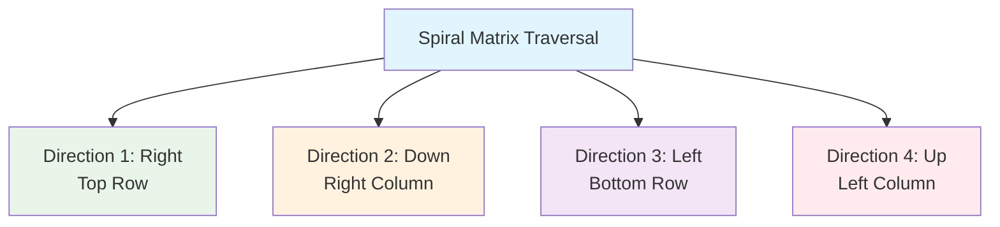

**Think of it like a race track:**
- Start at the top-left corner
- Move right along the top edge (Direction 1)
- Turn down along the right edge (Direction 2)
- Turn left along the bottom edge (Direction 3)
- Turn up along the left edge (Direction 4)
- Repeat for inner layers

### 🎲 Boundary Concept

The key to spiral traversal is maintaining four boundaries:

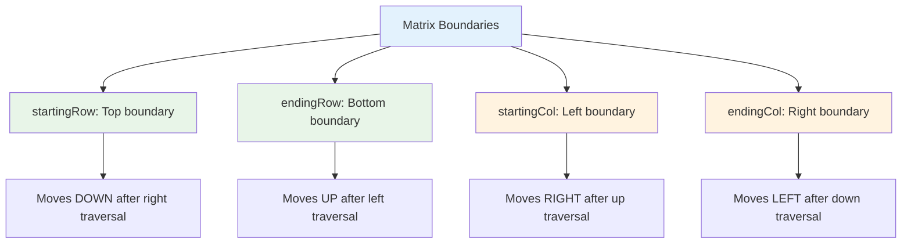

**Key Operations:**
- After traversing right → `startingRow++` (shrink from top)
- After traversing down → `endingCol--` (shrink from right)
- After traversing left → `endingRow--` (shrink from bottom)
- After traversing up → `startingCol++` (shrink from left)

---

## 📚 Step-by-Step Examples

### 🟢 Example 1: Standard 3x3 Matrix

**Input:**
```
[[1, 2, 3],
 [4, 5, 6],
 [7, 8, 9]]
```

**Output:** `[1, 2, 3, 6, 9, 8, 7, 4, 5]`

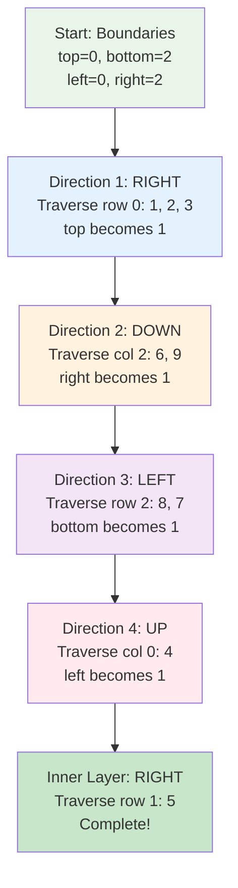

**Step-by-step breakdown:**

**Layer 1 (Outer):**
1. **Right:** Row 0, columns 0→2: `[1, 2, 3]` ➡️ `top = 1`
2. **Down:** Column 2, rows 1→2: `[6, 9]` ➡️ `right = 1`
3. **Left:** Row 2, columns 1→0: `[8, 7]` ➡️ `bottom = 1`
4. **Up:** Column 0, rows 1→1: `[4]` ➡️ `left = 1`

**Layer 2 (Center):**
5. **Right:** Row 1, columns 1→1: `[5]` ➡️ Done!

**Result:** `[1, 2, 3, 6, 9, 8, 7, 4, 5]`

### 🔴 Example 2: Rectangular Matrix (3x4)

**Input:**
```
[[1,  2,  3,  4],
 [5,  6,  7,  8],
 [9, 10, 11, 12]]
```

**Output:** `[1, 2, 3, 4, 8, 12, 11, 10, 9, 5, 6, 7]`

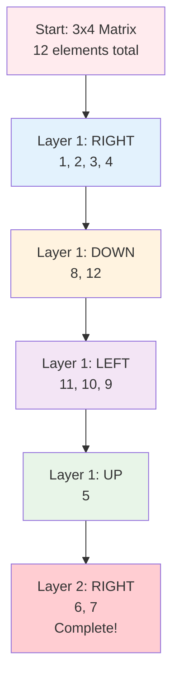

**Detailed walkthrough:**

**Initial State:**
- `top = 0, bottom = 2, left = 0, right = 3`
- `count = 0, total = 12`

**Direction 1 - Right (top row):**
- Traverse: `matrix[0][0→3]` = `[1, 2, 3, 4]`
- Update: `top = 1`, `count = 4`

**Direction 2 - Down (right column):**
- Traverse: `matrix[1→2][3]` = `[8, 12]`
- Update: `right = 2`, `count = 6`

**Direction 3 - Left (bottom row):**
- Traverse: `matrix[2][2→0]` = `[11, 10, 9]`
- Update: `bottom = 1`, `count = 9`

**Direction 4 - Up (left column):**
- Traverse: `matrix[1→1][0]` = `[5]`
- Update: `left = 1`, `count = 10`

**Direction 1 - Right (inner row):**
- Traverse: `matrix[1][1→2]` = `[6, 7]`
- Update: `count = 12` ✓ Complete!

### 🟡 Example 3: Single Row Matrix

**Input:** `[[1, 2, 3, 4]]`  
**Output:** `[1, 2, 3, 4]`

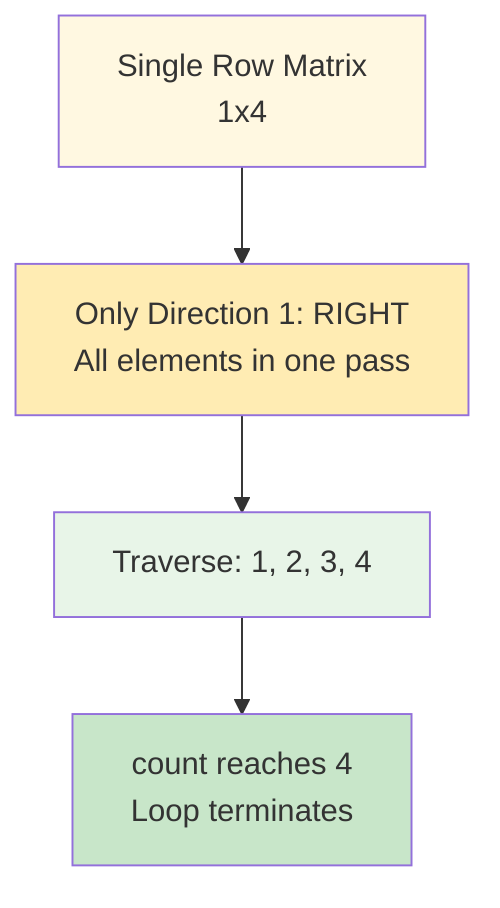

**Why other directions don't execute:**
- After RIGHT: `top = 1`, but `top > bottom` (no more rows)
- The condition `count < totalElm` prevents any further iterations

### 🟣 Example 4: Single Column Matrix

**Input:** `[[1], [2], [3], [4]]`  
**Output:** `[1, 2, 3, 4]`

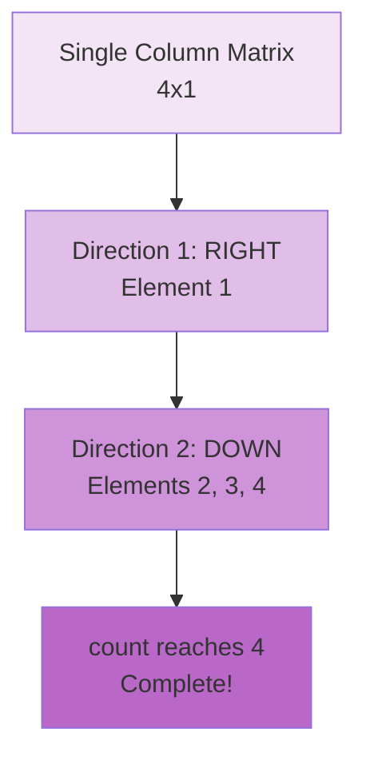

**Direction breakdown:**
1. **RIGHT:** Gets first element `[1]` → `top = 1`
2. **DOWN:** Gets remaining `[2, 3, 4]` → Done (count = 4)

---

## 🛠️ The Algorithm

### 🎯 Main Strategy: Layer-by-Layer Spiral

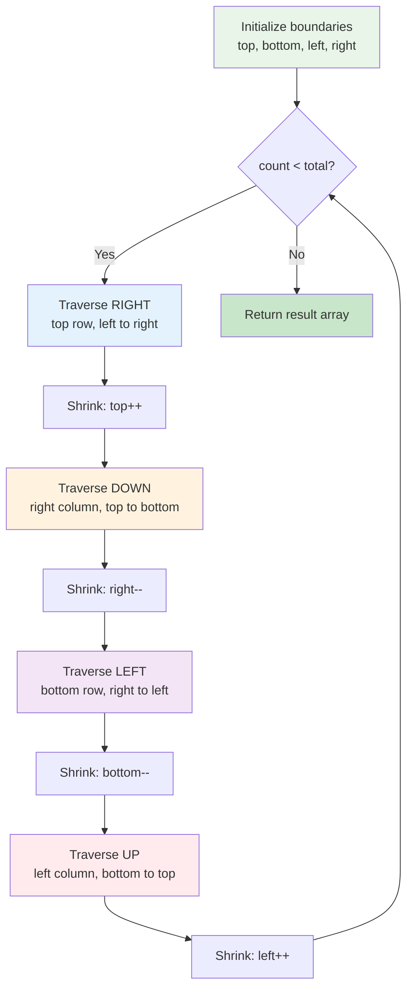

### 💻 The Code

```cpp
vector<int> spiralOrder(vector<vector<int>>& matrix) {
    vector<int> ans;
    int row = matrix.size();
    int col = matrix[0].size();
    
    int count = 0;
    int totalElm = row * col;
    
    int startingRow = 0, startingCol = 0;
    int endingRow = row - 1, endingCol = col - 1;
    
    while (count < totalElm) {
        // 🔵 Direction 1: RIGHT - Top row
        for (int i = startingCol; count < totalElm && i <= endingCol; i++) {
            ans.push_back(matrix[startingRow][i]);
            count++;
        }
        startingRow++;
        
        // 🟠 Direction 2: DOWN - Right column
        for (int i = startingRow; count < totalElm && i <= endingRow; i++) {
            ans.push_back(matrix[i][endingCol]);
            count++;
        }
        endingCol--;
        
        // 🟣 Direction 3: LEFT - Bottom row
        for (int i = endingCol; count < totalElm && i >= startingCol; i--) {
            ans.push_back(matrix[endingRow][i]);
            count++;
        }
        endingRow--;
        
        // 🔴 Direction 4: UP - Left column
        for (int i = endingRow; count < totalElm && i >= startingRow; i--) {
            ans.push_back(matrix[i][startingCol]);
            count++;
        }
        startingCol++;
    }
    
    return ans;
}
```

### 🛡️ Boundary Protection Explained

**Why do we check `count < totalElm` in each loop?**

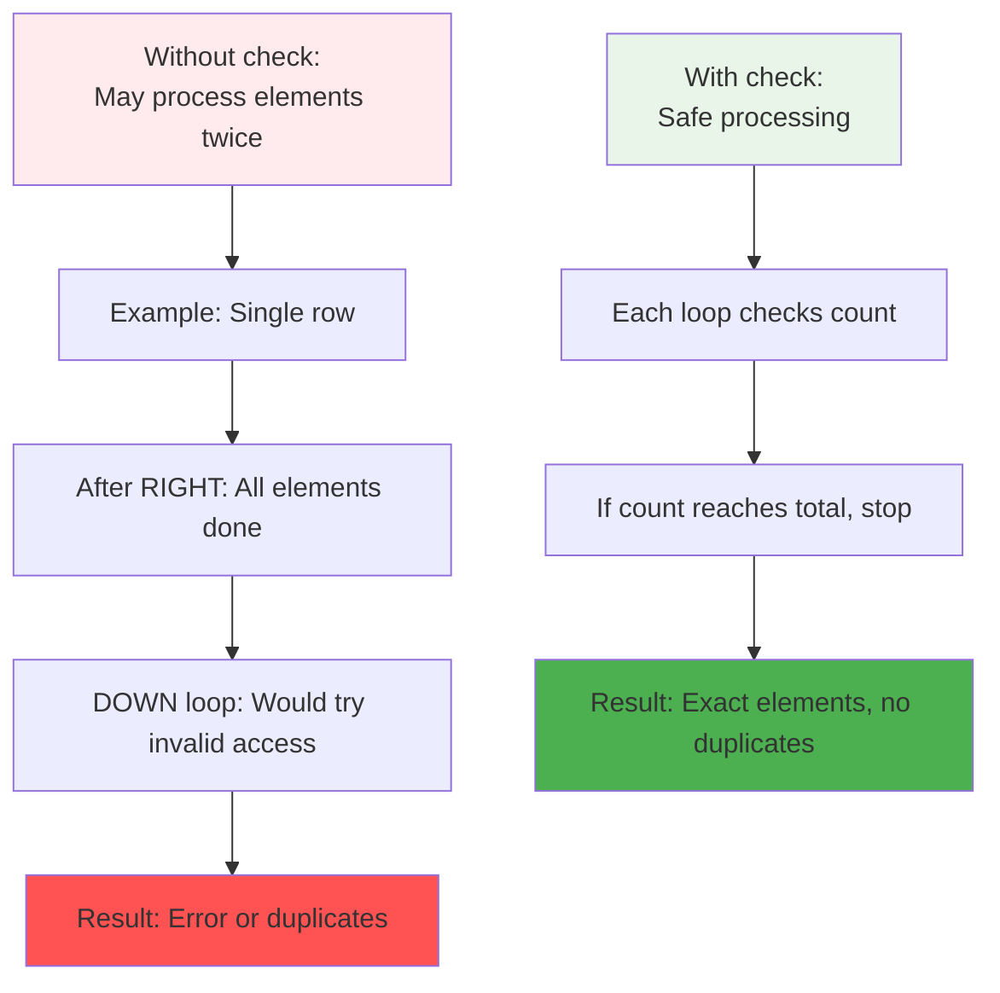

**The Safety Mechanism:**
- Single row: After RIGHT direction, `count = totalElm`, other loops don't execute
- Single column: After RIGHT and DOWN, `count = totalElm`, LEFT and UP don't execute
- This prevents boundary violations and duplicate processing

---

## 🧪 Test Cases & Edge Cases

### ✅ Normal Cases

| Input | Dimensions | Output | Description |
|-------|------------|--------|-------------|
| `[[1,2,3],[4,5,6],[7,8,9]]` | 3x3 | `[1,2,3,6,9,8,7,4,5]` | Perfect square matrix |
| `[[1,2,3,4],[5,6,7,8],[9,10,11,12]]` | 3x4 | `[1,2,3,4,8,12,11,10,9,5,6,7]` | Rectangular (more columns) |
| `[[1,2,3],[4,5,6],[7,8,9],[10,11,12]]` | 4x3 | `[1,2,3,6,9,12,11,10,7,4,5,8]` | Rectangular (more rows) |

### ⚠️ Edge Cases

| Input | Dimensions | Output | Why Special |
|-------|------------|--------|-------------|
| `[[5]]` | 1x1 | `[5]` | Single element |
| `[[1,2,3,4]]` | 1x4 | `[1,2,3,4]` | Single row (only RIGHT) |
| `[[1],[2],[3],[4]]` | 4x1 | `[1,2,3,4]` | Single column (RIGHT + DOWN) |
| `[[1,2],[3,4]]` | 2x2 | `[1,2,4,3]` | Smallest complete spiral |

### 🎯 Boundary Testing Categories

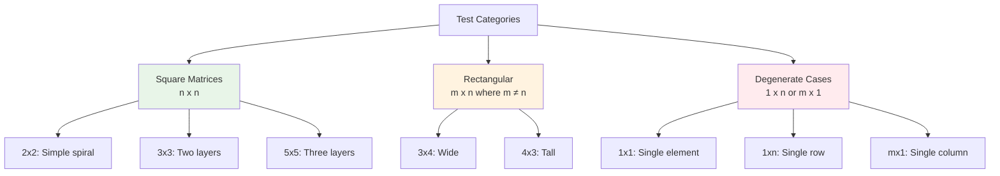

---

## 🎓 Key Concepts Mastery

### 🔄 Four-Direction Traversal Pattern

**1. Right Traversal (Top Row):**
```cpp
for (int i = startingCol; i <= endingCol; i++) {
    process(matrix[startingRow][i]);
}
startingRow++;  // Shrink from top
```

**2. Down Traversal (Right Column):**
```cpp
for (int i = startingRow; i <= endingRow; i++) {
    process(matrix[i][endingCol]);
}
endingCol--;  // Shrink from right
```

**3. Left Traversal (Bottom Row):**
```cpp
for (int i = endingCol; i >= startingCol; i--) {
    process(matrix[endingRow][i]);
}
endingRow--;  // Shrink from bottom
```

**4. Up Traversal (Left Column):**
```cpp
for (int i = endingRow; i >= startingRow; i--) {
    process(matrix[i][startingCol]);
}
startingCol++;  // Shrink from left
```

### 🎯 Boundary Management Strategy

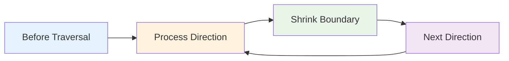

**Pattern to Remember:**
- **Process** the current boundary in one direction
- **Immediately shrink** that boundary
- **Move** to the next direction
- **Repeat** until all elements are processed

### 🎯 Layer Visualization

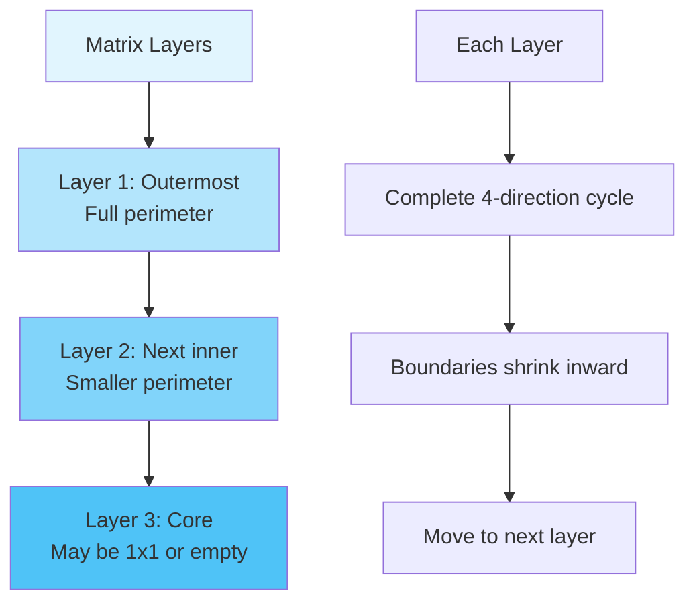

---

## 📊 Complexity Analysis

### ⏰ Time Complexity: O(m × n)

**Why linear in total elements?**
- We visit each element exactly once
- Four nested loops, but together they cover all `m × n` elements
- Each element is processed in exactly one direction

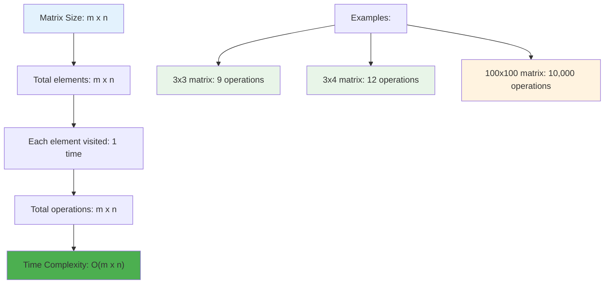

**Detailed Analysis:**
```
Total elements = m × n
Direction 1 (RIGHT): Processes ≤ n elements
Direction 2 (DOWN): Processes ≤ m elements  
Direction 3 (LEFT): Processes ≤ n elements
Direction 4 (UP): Processes ≤ m elements

Sum of all iterations = m × n (each element exactly once)
Therefore: O(m × n)
```

### 💾 Space Complexity: O(1)

**Why constant space?**
- Only use fixed variables: `count`, boundaries (4 integers), dimensions
- No additional data structures that grow with input
- Output array doesn't count toward auxiliary space

**Space breakdown:**
```
Variables used:
- row, col: 2 integers
- count, totalElm: 2 integers  
- startingRow, endingRow, startingCol, endingCol: 4 integers
- Loop counter: 1 integer
Total: ~9 integers = O(1)
```

---

## 🚀 Practice Problems

Once you master this, try these similar problems:

| Problem | Difficulty | Key Concept |
|---------|------------|-------------|
| 🌀 Spiral Matrix II | Medium | Generate spiral matrix |
| 🔄 Rotate Image | Medium | 90-degree matrix rotation |
| ⬇️ Diagonal Traverse | Medium | Zigzag pattern traversal |
| 🎯 Set Matrix Zeroes | Medium | In-place matrix modification |
| 🔢 Search a 2D Matrix | Medium | Binary search in matrix |

---

## 💼 Interview Questions & Answers

### ❓ Question 1: Why do we need the `count < totalElm` check in each loop?

**Answer:**  
This check prevents processing elements twice and handles edge cases like single row/column matrices.

**Simple Explanation:**  
Imagine a single row `[[1, 2, 3]]`:
- **RIGHT** direction processes all 3 elements
- Without the check, **DOWN** would try to process again (but no elements below)
- With check: Once `count = 3`, all other loops skip automatically

**Code Impact:**
```cpp
// Without check (WRONG):
for (int i = startingRow; i <= endingRow; i++) {
    ans.push_back(matrix[i][endingCol]);  // May go out of bounds!
}

// With check (CORRECT):
for (int i = startingRow; count < totalElm && i <= endingRow; i++) {
    ans.push_back(matrix[i][endingCol]);  // Safe!
    count++;
}
```

---

### ❓ Question 2: How does the boundary shrinking work?

**Answer:**  
After processing each direction, we move the corresponding boundary inward:
- **After RIGHT**: `startingRow++` (top boundary moves down)
- **After DOWN**: `endingCol--` (right boundary moves left)
- **After LEFT**: `endingRow--` (bottom boundary moves up)
- **After UP**: `startingCol++` (left boundary moves right)

**Simple Explanation:**  
Think of peeling layers off an onion:
```
Layer 1: Process outer ring → boundaries shrink
Layer 2: Process next ring → boundaries shrink  
Layer 3: Process center → done!
```

**Visual Example (3x3):**
```
Initial:     After RIGHT:  After DOWN:   After LEFT:   After UP:
top=0        top=1         top=1         top=1         top=1
bottom=2     bottom=2      bottom=2      bottom=1      bottom=1
left=0       left=0        left=0        left=0        left=1
right=2      right=2       right=1       right=1       right=1

Now process inner layer (if any)...
```

---

### ❓ Question 3: What's the time complexity and why?

**Answer:**  
**Time: O(m × n)** - We visit each of the `m × n` elements exactly once.

**Simple Explanation:**  
```
3x3 matrix has 9 elements → 9 visits → O(9) = O(m×n)
4x5 matrix has 20 elements → 20 visits → O(20) = O(m×n)
```
Even though we have 4 nested loops (directions), together they process each element exactly once. It's like reading a book - you read each word once, taking O(words) time.

**Space: O(1)** - We only use a few variables (boundaries, count) that don't grow with input size.

---

### ❓ Question 4: How do you handle a single element matrix `[[5]]`?

**Answer:**  
The algorithm handles it naturally:

```cpp
// Matrix: [[5]]
// row = 1, col = 1, totalElm = 1

// Initial: count = 0, boundaries: top=0, bottom=0, left=0, right=0

// Direction 1 (RIGHT): 
for (i = 0; count < 1 && i <= 0; i++) {  // Executes once
    ans.push_back(matrix[0][0]);  // Adds 5
    count++;  // count = 1
}
startingRow = 1;

// Direction 2 (DOWN):
for (i = 1; count < 1 && i <= 0; i++) {  // Doesn't execute (count=1)
}
// ... all other directions skip

// Result: [5] ✓
```

**Simple Explanation:**  
The first loop adds the element and increments count to 1. All subsequent loops see `count < totalElm` is false and skip. Perfect!

---

### ❓ Question 5: What happens with a single row like `[[1, 2, 3, 4]]`?

**Answer:**  
Only the RIGHT direction processes elements, others are skipped:

```
Matrix: [[1, 2, 3, 4]]  (1x4)
totalElm = 4

Direction RIGHT: Processes all 4 elements [1,2,3,4], count = 4
Direction DOWN: Loop condition fails (startingRow=1 > endingRow=0)
Direction LEFT: Skipped (count already equals totalElm)
Direction UP: Skipped (count already equals totalElm)

Result: [1, 2, 3, 4] ✓
```

**Simple Explanation:**  
It's like reading a single line of text - you go from left to right, and you're done. No need to go down, left, or up!

---

### ❓ Question 6: Can you trace through a 2x2 matrix step by step?

**Answer:**  
Let's trace `[[1, 2], [3, 4]]`:

```
Initial state:
top=0, bottom=1, left=0, right=1
count=0, totalElm=4

Step 1 - RIGHT (row 0, col 0→1):
  Add matrix[0][0]=1, count=1
  Add matrix[0][1]=2, count=2
  top=1

Step 2 - DOWN (col 1, row 1→1):
  Add matrix[1][1]=4, count=3
  right=0

Step 3 - LEFT (row 1, col 0→0):
  Add matrix[1][0]=3, count=4
  bottom=0

Step 4 - UP: Skipped (count=4=totalElm)

Result: [1, 2, 4, 3] ✓
```

**Simple Explanation:**  
Start at 1, go right to 2, turn down to 4, turn left to 3, and we're done! Like tracing the number on a square clock.

---

### ❓ Question 7: Why update boundaries immediately after each direction?

**Answer:**  
Immediate boundary updates ensure we don't revisit elements and prepare correctly for the next layer.

**Without immediate update (WRONG):**
```cpp
// Process RIGHT
for (int i = startingCol; i <= endingCol; i++) {
    ans.push_back(matrix[startingRow][i]);
}
// Process DOWN (PROBLEM: might include corner twice!)
for (int i = startingRow; i <= endingRow; i++) {
    ans.push_back(matrix[i][endingCol]);
}
startingRow++;  // Too late!
```

**With immediate update (CORRECT):**
```cpp
// Process RIGHT
for (int i = startingCol; i <= endingCol; i++) {
    ans.push_back(matrix[startingRow][i]);
}
startingRow++;  // Immediate! Prevents reprocessing

// Process DOWN (now safe)
for (int i = startingRow; i <= endingRow; i++) {
    ans.push_back(matrix[i][endingCol]);
}
```

**Simple Explanation:**  
It's like eating pizza slices - as soon as you finish one slice (direction), you remove it from the box (update boundary) so you don't accidentally eat it again!

---

### ❓ Question 8: What's the difference between this and normal row-by-row traversal?

**Answer:**  

**Normal traversal (row-by-row):**
```
[[1,2,3],      Output: [1,2,3,4,5,6,7,8,9]
 [4,5,6],      Pattern: Left to right, top to bottom
 [7,8,9]]      Time: O(m×n), simple nested loops
```

**Spiral traversal (this problem):**
```
[[1,2,3],      Output: [1,2,3,6,9,8,7,4,5]
 [4,5,6],      Pattern: Clockwise spiral, layer by layer
 [7,8,9]]      Time: O(m×n), 4-direction logic with boundaries
```

**Key Differences:**
| Aspect | Row-by-Row | Spiral |
|--------|------------|--------|
| Direction | Fixed (always left→right) | Changes (4 directions) |
| Boundary | None needed | 4 boundaries required |
| Complexity | Simple | More complex logic |
| Use Case | Reading data linearly | Special visualization, printing |

**Simple Explanation:**  
Row-by-row is like reading a book normally (left to right, line by line). Spiral is like tracing around the edges of each page, going deeper into the center!

---

### ❓ Question 9: How would you modify this to go counter-clockwise?

**Answer:**  
Reverse the direction order: RIGHT → UP → LEFT → DOWN

**Code modification:**
```cpp
while (count < totalElm) {
    // Direction 1: RIGHT (same)
    for (int i = startingCol; count < totalElm && i <= endingCol; i++) {
        ans.push_back(matrix[startingRow][i]);
        count++;
    }
    startingRow++;
    
    // Direction 2: UP (changed from DOWN)
    for (int i = endingRow; count < totalElm && i >= startingRow; i--) {
        ans.push_back(matrix[i][endingCol]);
        count++;
    }
    endingCol--;
    
    // Direction 3: LEFT (same)
    for (int i = endingCol; count < totalElm && i >= startingCol; i--) {
        ans.push_back(matrix[endingRow][i]);
        count++;
    }
    endingRow--;
    
    // Direction 4: DOWN (changed from UP)
    for (int i = startingRow; count < totalElm && i <= endingRow; i++) {
        ans.push_back(matrix[i][startingCol]);
        count++;
    }
    startingCol++;
}
```

**Simple Explanation:**  
Instead of going clockwise (right-down-left-up), go counter-clockwise (right-up-left-down). It's like running around a track in the opposite direction!

---

### ❓ Question 10: What if the matrix has only one layer?

**Answer:**  
A single-layer matrix is one where after processing all four directions once, we're done.

**Examples:**
```cpp
[[1, 2, 3]]        // 1x3: Single layer (only RIGHT works)
[[1], [2], [3]]    // 3x1: Single layer (RIGHT + DOWN only)
[[1, 2], [3, 4]]   // 2x2: Single layer (all 4 directions used)
```

**Simple Explanation:**  
For matrices with only one "ring" around them, the algorithm processes all elements in the first complete cycle of the while loop. The boundaries shrink so much that the condition `count < totalElm` or boundary conditions prevent further iterations.

---

### 🎯 Common Interview Follow-ups

**Q: "Can you optimize this further?"**  
A: The algorithm is already optimal - O(m × n) time and O(1) space. Can't do better since we must visit each element!

**Q: "What if the matrix is empty?"**  
A: Add input validation: `if (matrix.empty() || matrix[0].empty()) return {};`

**Q: "How would you test this function?"**  
A: Test cases should include:
- Square matrices: `3x3`, `5x5`
- Rectangular: `3x4`, `4x3`
- Edge cases: `1x1`, `1xn`, `mx1`
- Different sizes: `2x2`, `10x10`

---

## 🎯 Quick Reference

### 🔑 Essential Code Patterns

```cpp
// Initialize four boundaries
int startingRow = 0, startingCol = 0;
int endingRow = m - 1, endingCol = n - 1;

// Process layer by layer
while (count < totalElements) {
    // RIGHT: Process top row
    for (int i = startingCol; count < total && i <= endingCol; i++)
        process(matrix[startingRow][i]);
    startingRow++;
    
    // DOWN: Process right column
    for (int i = startingRow; count < total && i <= endingRow; i++)
        process(matrix[i][endingCol]);
    endingCol--;
    
    // LEFT: Process bottom row
    for (int i = endingCol; count < total && i >= startingCol; i--)
        process(matrix[endingRow][i]);
    endingRow--;
    
    // UP: Process left column
    for (int i = endingRow; count < total && i >= startingRow; i--)
        process(matrix[i][startingCol]);
    startingCol++;
}
```

### 📝 Important Patterns

```cpp
// Always check count to prevent duplicates
for (int i = start; count < total && i <= end; i++) {
    // Process element
    count++;
}

// Update boundaries immediately after each direction
startingRow++;  // After RIGHT
endingCol--;    // After DOWN
endingRow--;    // After LEFT
startingCol++;  // After UP
```

### 🧠 Mental Model

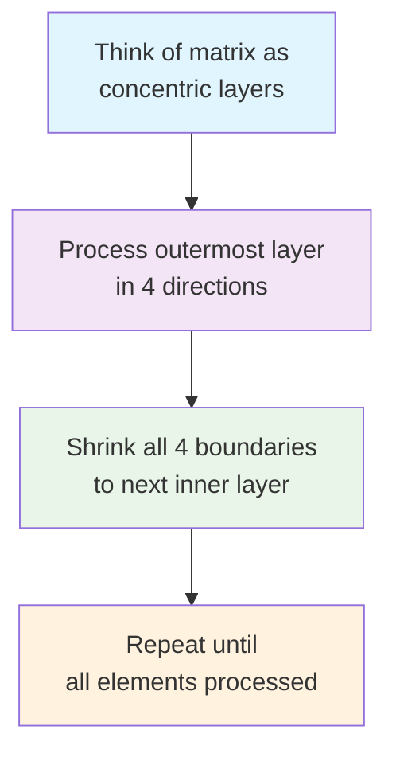

---

## 🏆 Mastery Checklist

- [ ] ✅ Understand layer-by-layer spiral traversal
- [ ] ✅ Master four-boundary management technique
- [ ] ✅ Know when and how to shrink boundaries
- [ ] ✅ Handle edge cases (1x1, 1xn, mx1 matrices)
- [ ] ✅ Prevent duplicate element processing with count check
- [ ] ✅ Solve the problem in O(m × n) time
- [ ] ✅ Use O(1) auxiliary space only
- [ ] ✅ Test all edge cases thoroughly
- [ ] ✅ Answer common interview questions confidently

---

## 💡 Pro Tips

1. **🔄 Remember the Pattern**: RIGHT → DOWN → LEFT → UP, always clockwise
2. **🛡️ Safety First**: Always include `count < totalElm` check in each loop
3. **📏 Boundary Updates**: Shrink boundaries **immediately** after each direction
4. **🧪 Test Edge Cases**: Single element, single row, single column matrices
5. **🎯 Visualize**: Draw out the spiral path for complex examples
6. **💼 Practice Variations**: Try counter-clockwise, spiral generation, etc.

---

**🎉 Congratulations! You now have a complete understanding of spiral matrix traversal, boundary management, and can confidently solve related problems. Keep practicing and happy coding!**

