# Day 36: 🔄 Rotate Image - Complete Beginner's Guide

> **Master matrix manipulation and in-place transformations step by step!**


---

## 📖 What You'll Learn

By the end of this guide, you'll master:
- 🔢 **Matrix Manipulation** - How to work with 2D arrays efficiently
- 🔄 **Geometric Transformations** - Understanding rotation operations
- 🎯 **In-Place Algorithms** - Modifying data without extra space
- 🧮 **Mathematical Insights** - Transpose and reflection operations

---

## 🎯 The Problem

### 📋 Problem Statement

**Given**: An n x n 2D matrix representing an image  
**Task**: Rotate the image by 90 degrees clockwise  
**Constraint**: You must do it **in-place** (no extra matrix allowed!)

**Important Rule**: You cannot allocate another 2D matrix - modify the original!

### 🌟 Real-World Example

Think of it like rotating a physical photograph:
- **Clockwise 90°** - What was on top moves to the right
- **Original top-left** becomes **new top-right**
- **Original bottom-left** becomes **new top-left**

---

## 🔍 Understanding the Basics

### 🏗️ What is Matrix Rotation?

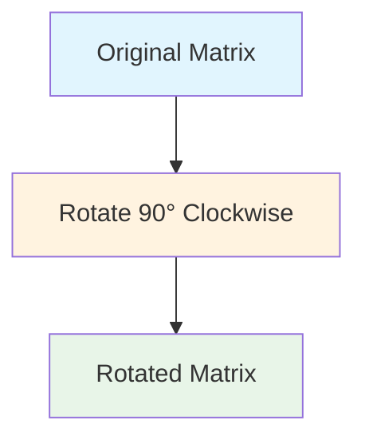

**Think of it like a physical rotation:**
- Imagine a square photo on a table
- Pick it up and rotate it 90° clockwise
- Every element moves to a new position following a pattern

### 🎲 The Two-Step Magic Trick

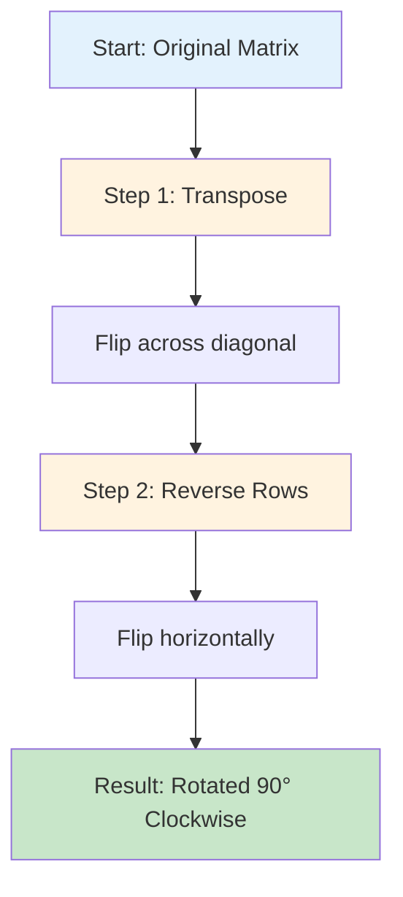

**Key Operations:**
- **Transpose** → Swap rows with columns (flip across diagonal)
- **Reverse Rows** → Flip each row horizontally
- **Combined** → Achieves 90° clockwise rotation!

---

## 📚 Step-by-Step Examples

### 🟢 Example 1: Simple 3x3 Matrix

**Input:**
```
[1, 2, 3]
[4, 5, 6]
[7, 8, 9]
```

**Output:**
```
[7, 4, 1]
[8, 5, 2]
[9, 6, 3]
```

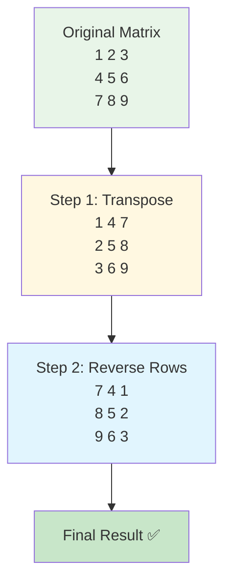

**Step-by-step breakdown:**

**Original Matrix:**
```
Position:  [0,0]=1  [0,1]=2  [0,2]=3
           [1,0]=4  [1,1]=5  [1,2]=6
           [2,0]=7  [2,1]=8  [2,2]=9
```

**After Transpose (swap [i][j] with [j][i]):**
```
Position:  [0,0]=1  [0,1]=4  [0,2]=7
           [1,0]=2  [1,1]=5  [1,2]=8
           [2,0]=3  [2,1]=6  [2,2]=9

Changes:
• [0,1] and [1,0] swapped: 2 ↔ 4
• [0,2] and [2,0] swapped: 3 ↔ 7
• [1,2] and [2,1] swapped: 6 ↔ 8
```

**After Reversing Each Row:**
```
Row 0: [1, 4, 7] → [7, 4, 1]
Row 1: [2, 5, 8] → [8, 5, 2]
Row 2: [3, 6, 9] → [9, 6, 3]

Final:  [0,0]=7  [0,1]=4  [0,2]=1
        [1,0]=8  [1,1]=5  [1,2]=2
        [2,0]=9  [2,1]=6  [2,2]=3
```

### 🔵 Example 2: 4x4 Matrix

**Input:**
```
[5,  1,  9,  11]
[2,  4,  8,  10]
[13, 3,  6,  7]
[15, 14, 12, 16]
```

**Output:**
```
[15, 13, 2,  5]
[14, 3,  4,  1]
[12, 6,  8,  9]
[16, 7,  10, 11]
```

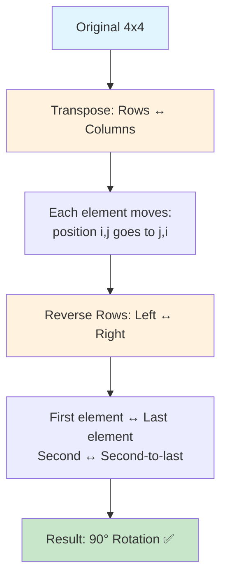

**Transformation tracking:**
- **Top-left (5)** → **Top-right (5)**
- **Top-right (11)** → **Bottom-right (11)**
- **Bottom-right (16)** → **Bottom-left (16)**
- **Bottom-left (15)** → **Top-left (15)**

### 🟡 Example 3: 2x2 Matrix (Simplest Case)

**Input:**
```
[1, 2]
[3, 4]
```

**Output:**
```
[3, 1]
[4, 2]
```

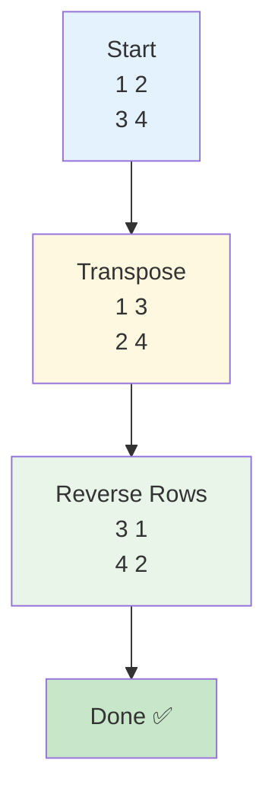

**Visual Position Changes:**
```
Before:          After:
1 → 2            3 → 1
↓   ↓            ↓   ↓
3 → 4            4 → 2

Element movements:
1 stays at distance 1 from corner
2 moves to position 1
3 moves to top-left
4 moves to position 2
```

### 🚨 Example 4: Edge Case - 1x1 Matrix

**Input:** `[[1]]`  
**Output:** `[[1]]`

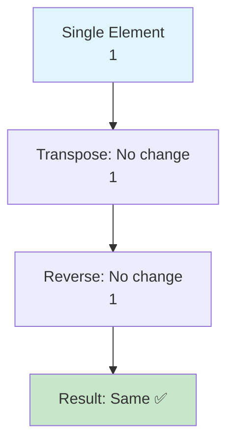

**Why it stays the same:**
- Only one element - nowhere to move!
- Transpose of 1x1 is itself
- Reverse of 1 element is itself

---

## 🛠️ The Algorithm

### 🎯 Main Strategy: Transpose + Reverse

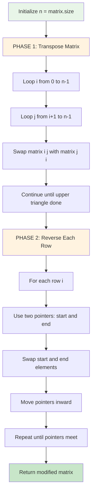

### 💻 The Code

```cpp
void rotate(vector<vector<int>>& matrix) {
    int n = matrix.size();
    
    // STEP 1: Transpose the matrix
    for (int i = 0; i < n; i++) {
        for (int j = i + 1; j < n; j++) {
            swap(matrix[i][j], matrix[j][i]);
        }
    }
    
    // STEP 2: Reverse each row
    for (int i = 0; i < n; i++) {
        int s = 0, e = n - 1;
        while (s <= e) {
            swap(matrix[i][s++], matrix[i][e--]);
        }
    }
}
```

### 🛡️ Why This Works - Mathematical Proof

**Rotation Formula:**
- To rotate 90° clockwise: `new[j][n-1-i] = old[i][j]`

**Our Two Steps:**
1. **Transpose:** `temp[j][i] = old[i][j]`
2. **Reverse row:** `new[j][n-1-i] = temp[j][i]`

**Combining:**
```
new[j][n-1-i] = temp[j][i] = old[i][j] ✅
```

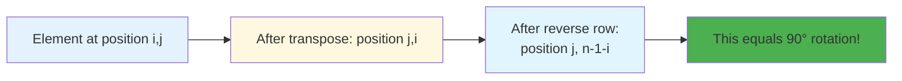

**Visual Proof with [0][2] in 3x3:**
```
Original position: [0][2] (top-right)
After transpose:   [2][0] (bottom-left)
After reverse:     [2][2] (bottom-right)

Expected for 90° clockwise: [2][2] ✅
```

---

## 🧪 Test Cases & Edge Cases

### ✅ Normal Cases

| Input Size | Example | Output Pattern |
|------------|---------|----------------|
| `3x3` | `[[1,2,3],[4,5,6],[7,8,9]]` | `[[7,4,1],[8,5,2],[9,6,3]]` |
| `4x4` | `[[5,1,9,11],[2,4,8,10],[13,3,6,7],[15,14,12,16]]` | `[[15,13,2,5],[14,3,4,1],[12,6,8,9],[16,7,10,11]]` |
| `2x2` | `[[1,2],[3,4]]` | `[[3,1],[4,2]]` |

### ⚠️ Edge Cases

| Input | Output | Why |
|-------|--------|-----|
| `[[1]]` | `[[1]]` | Single element unchanged |
| `[[1,2],[3,4]]` | `[[3,1],[4,2]]` | Smallest non-trivial rotation |
| `[[0,0],[0,0]]` | `[[0,0],[0,0]]` | All zeros remain zeros |
| `[[-1,-2],[-3,-4]]` | `[[-3,-1],[-4,-2]]` | Negative numbers work too |

### 🎯 Boundary Testing

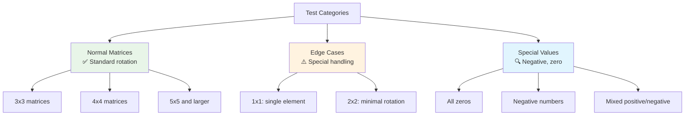

---

## 🎓 Key Concepts Mastery

### 🔢 Matrix Transpose Technique

**What is Transpose?**
```cpp
// Transpose: swap rows with columns
for (int i = 0; i < n; i++) {
    for (int j = i + 1; j < n; j++) {
        swap(matrix[i][j], matrix[j][i]);
    }
}
// Note: j starts at i+1 to avoid swapping twice!
```

**Visual Example:**
```
Original:       Transposed:
1  2  3         1  4  7
4  5  6    →    2  5  8
7  8  9         3  6  9

Diagonal stays: 1, 5, 9
Others swap:    2↔4, 3↔7, 6↔8
```

### 🔄 Row Reversal Technique

**Two-Pointer Approach:**
```cpp
// Reverse each row using two pointers
int s = 0, e = n - 1;
while (s <= e) {
    swap(matrix[i][s++], matrix[i][e--]);
}
```

**Visual Example:**
```
Before: [1, 4, 7]
         ↑     ↑
         s     e
         
Swap:   [7, 4, 1]
            ↑
           s,e meet
```

### 🎯 In-Place Algorithm Pattern

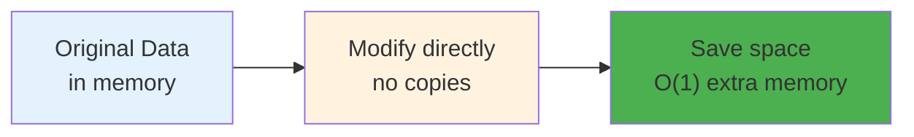

**Key Principles:**
```cpp
// ❌ BAD: Uses extra space
vector<vector<int>> result(n, vector<int>(n));
// Copy and modify result...
return result;  // O(n²) space

// ✅ GOOD: In-place modification
swap(matrix[i][j], matrix[j][i]);  // O(1) space
```

### 🧩 Rotation Variations

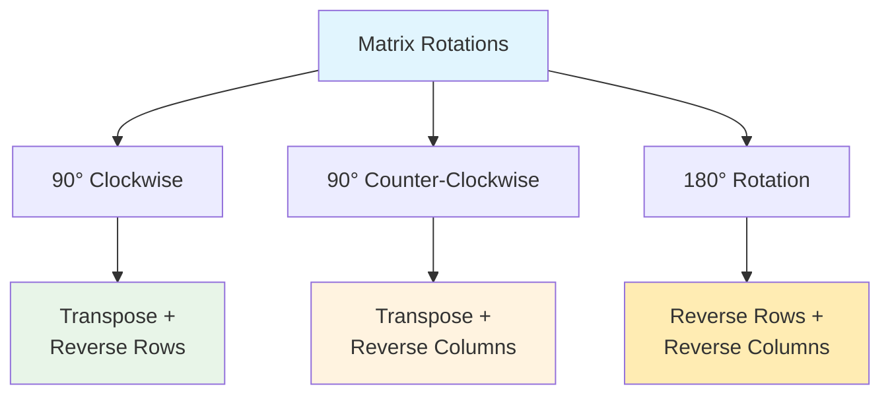

**Code for Different Rotations:**
```cpp
// 90° Clockwise (our solution)
transpose(); reverseRows();

// 90° Counter-Clockwise
transpose(); reverseColumns();

// 180°
reverseRows(); reverseColumns();
```

---

## 📊 Complexity Analysis

### ⏰ Time Complexity: O(n²)

**Why quadratic?**
- **Transpose**: Visit each element in upper triangle = n²/2 operations
- **Reverse rows**: Visit each element once = n²/2 operations
- **Total**: n²/2 + n²/2 = n² operations

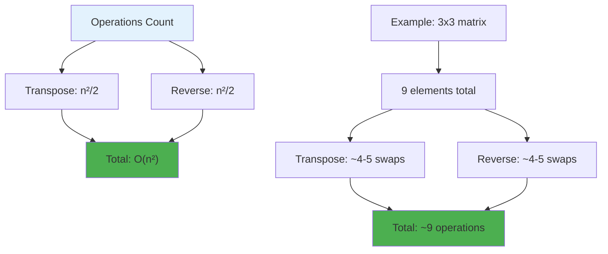

**Detailed Breakdown:**
```
For n x n matrix:
• Transpose: (n² - n) / 2 swaps
• Reverse:   n × (n / 2) swaps
• Total:     approximately n² operations

For 4x4:
• Transpose: (16 - 4) / 2 = 6 swaps
• Reverse:   4 × 2 = 8 swaps
• Total:     14 operations ≈ O(16) = O(n²)
```

### 💾 Space Complexity: O(1)

**Why constant space?**
- Only use a few variables: `n`, `i`, `j`, `s`, `e`
- No auxiliary arrays or matrices created
- All operations modify the input matrix directly
- Space usage independent of input size

**Comparison:**
```
Our Solution:        Alternative (using copy):
Space: O(1) ✅       Space: O(n²) ❌
In-place: Yes ✅     In-place: No ❌
Memory: Efficient ✅ Memory: Wasteful ❌
```

---

## 🚀 Practice Problems

Once you master this, try these similar problems:

| Problem | Difficulty | Key Concept |
|---------|------------|-------------|
| 🔄 Spiral Matrix | Medium | Matrix traversal |
| 🎯 Set Matrix Zeroes | Medium | In-place modification |
| 🔢 Transpose Matrix | Easy | Matrix manipulation |
| 🌀 Rotate Image II | Medium | Multiple rotations |

---

## 💼 Interview Questions & Answers

### ❓ Question 1: Why do we start j from i+1 in transpose?

**Answer:**  
To avoid swapping elements twice, which would undo our changes!

**Simple Explanation:**  
If we start j from 0:
```
Iteration 1: swap(matrix[0][1], matrix[1][0])  // 2 ↔ 4
Iteration 2: swap(matrix[1][0], matrix[0][1])  // 4 ↔ 2
Result: Back to original! ❌
```

If we start j from i+1:
```
Only swap once: swap(matrix[0][1], matrix[1][0])  // 2 ↔ 4
Skip the reverse swap
Result: Properly transposed! ✅
```

**Visual:**
```
Upper triangle only (j > i):
    0   1   2
0   X   ✓   ✓
1   X   X   ✓
2   X   X   X

We only process the ✓ positions
Diagonal (X) stays unchanged
Lower triangle skipped (already swapped from upper)
```

---

### ❓ Question 2: Can you rotate without using swap()?

**Answer:**  
Yes! You can use a temporary variable:

```cpp
// Instead of swap(matrix[i][j], matrix[j][i])
int temp = matrix[i][j];
matrix[i][j] = matrix[j][i];
matrix[j][i] = temp;
```

**Simple Explanation:**  
`swap()` is just syntactic sugar that does this internally. Both approaches are equivalent in efficiency - O(1) time for each swap.

---

### ❓ Question 3: How do you rotate counter-clockwise instead?

**Answer:**  
Change the second step to reverse columns instead of rows:

```cpp
void rotateCounterClockwise(vector<vector<int>>& matrix) {
    int n = matrix.size();
    
    // Step 1: Transpose (same)
    for (int i = 0; i < n; i++) {
        for (int j = i + 1; j < n; j++) {
            swap(matrix[i][j], matrix[j][i]);
        }
    }
    
    // Step 2: Reverse COLUMNS (not rows)
    for (int j = 0; j < n; j++) {
        int s = 0, e = n - 1;
        while (s < e) {
            swap(matrix[s][j], matrix[e][j]);
            s++; e--;
        }
    }
}
```

**Simple Explanation:**
- **Clockwise**: Transpose + Reverse Rows
- **Counter-Clockwise**: Transpose + Reverse Columns
- It's symmetric!

---

### ❓ Question 4: What about 180-degree rotation?

**Answer:**  
For 180° rotation, you don't need transpose! Just reverse rows and columns:

```cpp
void rotate180(vector<vector<int>>& matrix) {
    int n = matrix.size();
    
    // Reverse all rows
    for (int i = 0; i < n; i++) {
        reverse(matrix[i].begin(), matrix[i].end());
    }
    
    // Reverse the order of rows themselves
    reverse(matrix.begin(), matrix.end());
}
```

**Or even simpler:**
```cpp
void rotate180(vector<vector<int>>& matrix) {
    int n = matrix.size();
    for (int i = 0; i < n / 2; i++) {
        for (int j = 0; j < n; j++) {
            swap(matrix[i][j], matrix[n-1-i][n-1-j]);
        }
    }
}
```

---

### ❓ Question 5: What's the time complexity and why?

**Answer:**  
**Time: O(n²)** - We touch each element twice (transpose + reverse)

**Detailed Analysis:**
```
Step 1 - Transpose:
• Process upper triangle only
• Elements to process: n(n-1)/2
• Each swap: O(1)
• Total: O(n²)

Step 2 - Reverse:
• Process all n rows
• Each row: n/2 swaps
• Total: n × (n/2) = O(n²)

Combined: O(n²) + O(n²) = O(n²)
```

**Space: O(1)** - Only a few variables, no extra matrix

---

### ❓ Question 6: Can you do it in a single pass?

**Answer:**  
Yes! Using layer-by-layer rotation, but it's more complex:

```cpp
void rotateSinglePass(vector<vector<int>>& matrix) {
    int n = matrix.size();
    
    for (int layer = 0; layer < n / 2; layer++) {
        int first = layer;
        int last = n - 1 - layer;
        
        for (int i = first; i < last; i++) {
            int offset = i - first;
            int top = matrix[first][i];
            
            // left → top
            matrix[first][i] = matrix[last-offset][first];
            // bottom → left
            matrix[last-offset][first] = matrix[last][last-offset];
            // right → bottom
            matrix[last][last-offset] = matrix[i][last];
            // top → right
            matrix[i][last] = top;
        }
    }
}
```

**Pros:** Single pass  
**Cons:** More complex logic, harder to understand

**Simple Explanation:**  
Our two-step method is clearer and equally efficient. Premature optimization is the root of all evil!

---

### ❓ Question 7: How does this work with non-square matrices?

**Answer:**  
It doesn't! The problem specifically requires n×n (square) matrices.

**Why?**
- 90° rotation of a rectangle changes its dimensions
- 3×4 matrix rotated becomes 4×3 matrix
- Can't do in-place when dimensions change!

**For Non-Square:**
```cpp
// m × n matrix → n × m matrix (needs extra space)
vector<vector<int>> rotateRectangle(vector<vector<int>>& matrix) {
    int m = matrix.size();
    int n = matrix[0].size();
    vector<vector<int>> result(n, vector<int>(m));
    
    for (int i = 0; i < m; i++) {
        for (int j = 0; j < n; j++) {
            result[j][m-1-i] = matrix[i][j];
        }
    }
    return result;
}
```

---

### ❓ Question 8: What about memory cache efficiency?

**Answer:**  
Our algorithm is cache-friendly because we access matrix elements in row-major order:

**Cache-Friendly Patterns:**
- Transpose: Access elements in sequential memory
- Reverse: Each row is contiguous in memory
- Good spatial locality = fewer cache misses!

**Simple Explanation:**  
```
Matrix in memory: [1,2,3,4,5,6,7,8,9...]
Our access pattern:  →→→ (sequential within rows)
Bad pattern:         ↓↓↓ (jumping between rows)

Sequential access = CPU happy = faster execution ⚡
```

---

### ❓ Question 9: Can you explain with indices?

**Answer:**  
Sure! Let's track position [0][2] in a 3×3:

```
Original: matrix[0][2] = 3
Position: row 0, col 2 (top-right)

After Transpose:
• [0][2] swaps with [2][0]
• matrix[2][0] = 3
• Position: row 2, col 0 (bottom-left)

After Reverse Row 2:
• Row 2 is [3, 6, 9]
• Reversed: [9, 6, 3]
• [2][0] becomes [2][2]
• matrix[2][2] = 3
• Position: row 2, col 2 (bottom-right)

Result: Top-right → Bottom-right ✅ (90° clockwise)
```

---

### ❓ Question 10: How would you test this function?

**Answer:**  
Comprehensive test strategy:

**Test Categories:**
1. **Normal Cases:**
   - 3×3 matrix with distinct elements
   - 4×4 matrix with distinct elements
   - 5×5 larger matrix

2. **Edge Cases:**
   - 1×1 single element
   - 2×2 smallest non-trivial

3. **Special Values:**
   - All zeros
   - Negative numbers
   - Mixed positive/negative

4. **Verification:**
   - Check four corners moved correctly
   - Verify center stays in center (odd n)
   - Ensure original matrix modified (not copied)

**Test Example:**
```cpp
vector<vector<int>> matrix = {{1,2,3},{4,5,6},{7,8,9}};
vector<vector<int>> expected = {{7,4,1},{8,5,2},{9,6,3}};

rotate(matrix);

assert(matrix == expected);
assert(matrix[0][0] == 7);    // top-left was bottom-left
assert(matrix[0][2] == 1);    // top-right was top-left
assert(matrix[1][1] == 5);    // center unchanged
assert(matrix[2][0] == 9);    // bottom-left was bottom-right
```

---

### 🎯 Common Interview Follow-ups

**Q: "Can you optimize this further?"**  
A: Already optimal! O(n²) time is the best possible since we must touch every element at least once. O(1) space is the constraint requirement.

**Q: "What if the matrix is stored in a special format?"**  
A: The algorithm adapts easily. For sparse matrices, we'd only process non-zero elements. For other formats, we'd adjust the indexing.

**Q: "How would you rotate by arbitrary angles?"**  
A: For arbitrary angles (not 90°), we'd need:
- Trigonometric calculations (sin, cos)
- Interpolation for non-integer positions
- Usually requires a new matrix (can't be in-place)

**Q: "What about rotating a submatrix?"**  
A: Apply the same logic to a sub-region:
```cpp
void rotateSubmatrix(vector<vector<int>>& matrix, 
                     int startRow, int startCol, int size) {
    // Apply transpose and reverse to submatrix only
    // Use offset: matrix[startRow + i][startCol + j]
}
```

---

## 🎯 Quick Reference

### 🔑 Essential Code Patterns

```cpp
// Pattern 1: Matrix Transpose (swap across diagonal)
for (int i = 0; i < n; i++) {
    for (int j = i + 1; j < n; j++) {  // j starts at i+1
        swap(matrix[i][j], matrix[j][i]);
    }
}

// Pattern 2: Reverse Row (two-pointer)
for (int i = 0; i < n; i++) {
    int s = 0, e = n - 1;
    while (s <= e) {
        swap(matrix[i][s++], matrix[i][e--]);
    }
}

// Pattern 3: Reverse Column
for (int j = 0; j < n; j++) {
    int s = 0, e = n - 1;
    while (s < e) {
        swap(matrix[s++][j], matrix[e--][j]);
    }
}
```

### 📝 Important Formulas

```cpp
// 90° Clockwise: new[j][n-1-i] = old[i][j]
// Achieved by: Transpose + Reverse Rows

// 90° Counter-Clockwise: new[n-1-j][i] = old[i][j]
// Achieved by: Transpose + Reverse Columns

// 180°: new[n-1-i][n-1-j] = old[i][j]
// Achieved by: Reverse Rows + Reverse Columns
```

### 🧠 Mental Model

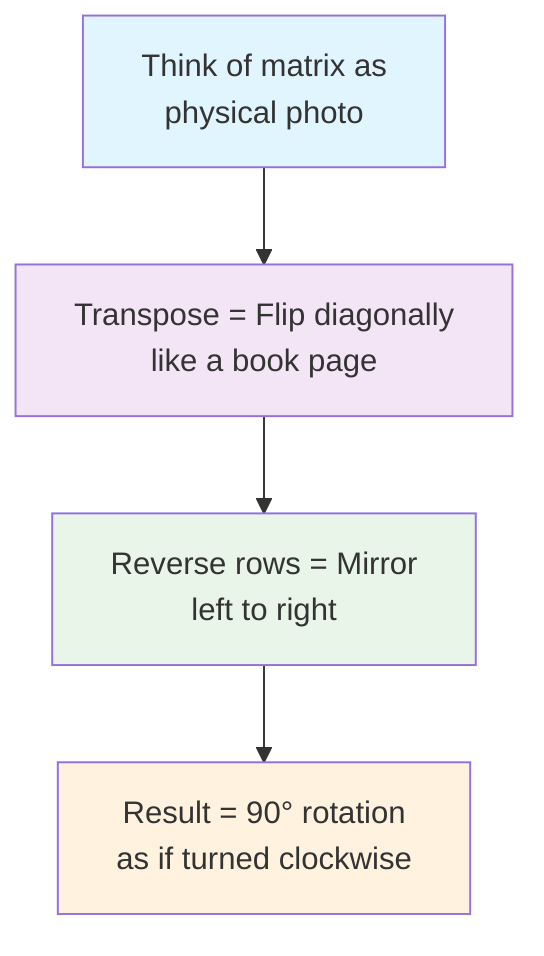

---

## 🏆 Mastery Checklist

- [ ] ✅ Understand matrix transpose operation
- [ ] ✅ Master two-pointer row reversal technique
- [ ] ✅ Explain why j starts at i+1 in transpose loop
- [ ] ✅ Handle all edge cases (1×1, 2×2, etc.)
- [ ] ✅ Implement in-place rotation with O(1) space
- [ ] ✅ Solve the problem in O(n²) time
- [ ] ✅ Rotate counter-clockwise and 180°
- [ ] ✅ Test with negative numbers and zeros
- [ ] ✅ Answer common interview questions confidently
- [ ] ✅ Explain mathematical proof of correctness

---

## 💡 Pro Tips

1. **🔄 Visualize First**: Draw the matrix on paper and trace transformations step-by-step
2. **📐 Remember the Pattern**: Transpose + Reverse Rows = 90° Clockwise (memorize this!)
3. **🧪 Test Edge Cases**: Always test 1×1, 2×2, and larger matrices
4. **🎯 Start Simple**: Verify logic works on 2×2 before moving to larger matrices
5. **💭 Think Geometrically**: Understand what rotation means physically
6. **📚 Practice Variations**: Try counter-clockwise and 180° rotations
7. **🗣️ Explain Out Loud**: Verbalize your thought process for interviews
8. **⚡ Know Your Complexity**: O(n²) time, O(1) space - be ready to justify

---

**🎉 Congratulations! You now have a complete understanding of matrix rotation, in-place algorithms, and can confidently solve rotation problems in interviews. Keep practicing and happy coding!**
