# Day 37: 🔍 Search a 2D Matrix - Complete Beginner's Guide

> **Master two powerful search algorithms for 2D matrices step by step!**

---

## 📖 What You'll Learn

By the end of this guide, you'll master:
- 🎯 **Binary Search on 2D Arrays** - Treating matrices as virtual 1D arrays
- 🪜 **Staircase Search Algorithm** - Efficient elimination technique
- 🔢 **Index Conversion Techniques** - Mapping between 1D and 2D coordinates
- ⚡ **Algorithm Selection** - Choosing the right approach based on matrix properties
- 🧮 **Complexity Trade-offs** - Understanding O(log(m×n)) vs O(m+n)

---

## 🎯 The Problems

### 📋 Problem 1: Search a 2D Matrix (LeetCode 74)

**Given**: An m × n integer matrix with these properties:
- Integers in each row are sorted from left to right
- The first integer of each row is **greater than** the last integer of the previous row

**Task**: Search for a target value efficiently  
**Return**: `true` if found, `false` otherwise

**Key Constraint**: The matrix is essentially a sorted 1D array wrapped into 2D format

### 📋 Problem 2: Search a 2D Matrix II (LeetCode 240)

**Given**: An m × n integer matrix with these properties:
- Integers in each row are sorted in ascending order from left to right
- Integers in each column are sorted in ascending order from top to bottom

**Task**: Search for a target value efficiently  
**Return**: `true` if found, `false` otherwise

**Key Constraint**: Rows are sorted independently, columns are sorted independently

### 🌟 Real-World Examples

**Problem 1 Example:**
```
Matrix: [[1,  3,  5,  7],
         [10, 11, 16, 20],
         [23, 30, 34, 60]]
Target: 3
```
This is like a **sorted phone book** - perfectly ordered from start to finish.

**Problem 2 Example:**
```
Matrix: [[1,  4,  7,  11, 15],
         [2,  5,  8,  12, 19],
         [3,  6,  9,  16, 22],
         [10, 13, 14, 17, 24],
         [18, 21, 23, 26, 30]]
Target: 5
```
This is like a **sorted spreadsheet** - rows sorted, columns sorted, but no strict ordering between rows.

---

## 🔍 Understanding the Basics

### 🏗️ Matrix Properties Comparison


### 🎲 Index Conversion Magic (Problem 1)

```mermaid
flowchart TD
    A["2D Matrix: 3×4"] --> B["Virtual 1D Array: 12 elements"]
    B --> C["Index 0-11"]
    
    C --> D["Convert 1D to 2D:"]
    D --> E["row = index ÷ columns"]
    D --> F["col = index % columns"]
    
    E --> G["Example: index = 7"]
    G --> H["row = 7 ÷ 4 = 1"]
    G --> I["col = 7 % 4 = 3"]
    H --> J["Result: matrix[1][3]"]
    I --> J
    
    style A fill:#e3f2fd
    style B fill:#f3e5f5
    style G fill:#fff3e0
    style J fill:#c8e6c9
```

**Visual Representation:**
```
2D Matrix (3×4):          1D Array (12 elements):
[0][1][2][3]              [0][1][2][3][4][5][6][7][8][9][10][11]
[0][1][2][3]               ↓  ↓  ↓  ↓  ↓  ↓  ↓  ↓  ↓  ↓   ↓   ↓
[0][1][2][3]              [0,0] [0,1] [0,2] [0,3] [1,0] ... [2,3]
```

### 🪜 Staircase Search Pattern (Problem 2)


---

## 📚 Step-by-Step Examples

## 🟢 PROBLEM 1: Binary Search Approach

### Example 1: Target Found in Middle

**Input:** 
```
matrix = [[1,  3,  5,  7],
          [10, 11, 16, 20],
          [23, 30, 34, 60]]
target = 3
```
**Output:** `true`

```mermaid
flowchart TD
    A["Start: Virtual 1D array [0-11]"] --> B["s=0, e=11, mid=5"]
    B --> C["matrix[5÷4][5%4] = matrix[1][1] = 11"]
    C --> D{"11 > 3?"}
    D -->|"Yes"| E["Search left: e=4"]
    
    E --> F["s=0, e=4, mid=2"]
    F --> G["matrix[2÷4][2%4] = matrix[0][2] = 5"]
    G --> H{"5 > 3?"}
    H -->|"Yes"| I["Search left: e=1"]
    
    I --> J["s=0, e=1, mid=0"]
    J --> K["matrix[0÷4][0%4] = matrix[0][0] = 1"]
    K --> L{"1 < 3?"}
    L -->|"Yes"| M["Search right: s=1"]
    
    M --> N["s=1, e=1, mid=1"]
    N --> O["matrix[1÷4][1%4] = matrix[0][1] = 3"]
    O --> P{"3 == 3?"}
    P -->|"Yes"| Q["Found! Return true ✅"]
    
    style A fill:#e8f5e8
    style Q fill:#c8e6c9
```

**Step-by-step breakdown:**
1. **Start:** Treat 3×4 matrix as 12-element array (indices 0-11)
2. **Step 1:** `mid = 5` → `matrix[1][1] = 11` → 11 > 3, search left
3. **Step 2:** `mid = 2` → `matrix[0][2] = 5` → 5 > 3, search left
4. **Step 3:** `mid = 0` → `matrix[0][0] = 1` → 1 < 3, search right
5. **Step 4:** `mid = 1` → `matrix[0][1] = 3` → Found! ✅

### Example 2: Target Not Found

**Input:** 
```
matrix = [[1,  3,  5,  7],
          [10, 11, 16, 20],
          [23, 30, 34, 60]]
target = 13
```
**Output:** `false`

```mermaid
flowchart TD
    A["Start: s=0, e=11"] --> B["Binary search continues"]
    B --> C["Narrows down to range [4,5]"]
    C --> D["Check matrix[1][0]=10 and matrix[1][1]=11"]
    D --> E{"10 < 13 < 16?"}
    E -->|"Yes"| F["Target would be here but isn't"]
    F --> G["s > e, exit loop"]
    G --> H["Return false ❌"]
    
    style A fill:#e3f2fd
    style H fill:#ffcdd2
```

## 🟡 PROBLEM 2: Staircase Search Approach

### Example 3: Target Found Using Staircase

**Input:**
```
matrix = [[1,  4,  7,  11, 15],
          [2,  5,  8,  12, 19],
          [3,  6,  9,  16, 22],
          [10, 13, 14, 17, 24],
          [18, 21, 23, 26, 30]]
target = 5
```
**Output:** `true`

```mermaid
flowchart TD
    A["Start: row=0, col=4<br/>Position: [0][4]=15"] --> B{"15 > 5?"}
    B -->|"Yes"| C["Move left: col=3<br/>Position: [0][3]=11"]
    
    C --> D{"11 > 5?"}
    D -->|"Yes"| E["Move left: col=2<br/>Position: [0][2]=7"]
    
    E --> F{"7 > 5?"}
    F -->|"Yes"| G["Move left: col=1<br/>Position: [0][1]=4"]
    
    G --> H{"4 < 5?"}
    H -->|"Yes"| I["Move down: row=1<br/>Position: [1][1]=5"]
    
    I --> J{"5 == 5?"}
    J -->|"Yes"| K["Found! Return true ✅"]
    
    style A fill:#fff8e1
    style K fill:#c8e6c9
```

**Staircase Path Visualization:**
```
Start → 15 → 11 → 7 → 4 → 5 (Found!)
        ↓    ↓    ↓   ↓   ↓
      [0,4][0,3][0,2][0,1][1,1]
```

### Example 4: Target Not Found Using Staircase

**Input:** Same matrix, `target = 20`  
**Output:** `false`

```mermaid
flowchart TD
    A["Start: [0][4]=15"] --> B["15 < 20, move down"]
    B --> C["[1][4]=19"]
    C --> D["19 < 20, move down"]
    D --> E["[2][4]=22"]
    E --> F["22 > 20, move left"]
    F --> G["[2][3]=16"]
    G --> H["16 < 20, move down"]
    H --> I["[3][3]=17"]
    I --> J["17 < 20, move down"]
    J --> K["[4][3]=26"]
    K --> L["26 > 20, move left"]
    L --> M["[4][2]=23"]
    M --> N["23 > 20, move left"]
    N --> O["[4][1]=21"]
    O --> P["21 > 20, move left"]
    P --> Q["[4][0]=18"]
    Q --> R["18 < 20, move down"]
    R --> S["row=5, out of bounds!"]
    S --> T["Return false ❌"]
    
    style A fill:#fff3e0
    style T fill:#ffcdd2
```

---

## 🛠️ The Algorithms

## 🎯 ALGORITHM 1: Binary Search on Virtual 1D Array

### Main Strategy

```mermaid
flowchart TD
    A["Initialize: s=0, e=rows×cols-1"] --> B{"s ≤ e?"}
    B -->|"No"| C["Return false"]
    B -->|"Yes"| D["Calculate mid = s + (e-s)÷2"]
    
    D --> E["Convert to 2D:<br/>row = mid÷cols<br/>col = mid%cols"]
    E --> F["Get cell = matrix[row][col]"]
    
    F --> G{"cell == target?"}
    G -->|"Yes"| H["Return true ✅"]
    G -->|"No"| I{"cell > target?"}
    
    I -->|"Yes"| J["Search left: e = mid-1"]
    I -->|"No"| K["Search right: s = mid+1"]
    
    J --> B
    K --> B
    
    style A fill:#e8f5e8
    style H fill:#c8e6c9
    style C fill:#ffcdd2
```

### The Code (Problem 1)

```cpp
bool searchMatrix(vector<vector<int>>& matrix, int target) {
    int row = matrix.size();
    int col = matrix[0].size();
    
    int s = 0;                  // Start of virtual 1D array
    int e = row * col - 1;      // End of virtual 1D array
    
    int mid = s + (e - s) / 2;  // Prevent overflow
    
    while (s <= e) {
        // 🔧 Convert 1D index to 2D coordinates
        int cell = matrix[mid / col][mid % col];
        
        if (cell == target)
            return 1;           // ✅ Found!
        
        if (cell > target)
            e = mid - 1;        // Search left half
        else
            s = mid + 1;        // Search right half
        
        mid = s + (e - s) / 2;  // Recalculate middle
    }
    return 0;                   // ❌ Not found
}
```

### Index Conversion Deep Dive

```mermaid
flowchart TD
    A["1D Index: mid"] --> B["Calculate Row"]
    A --> C["Calculate Column"]
    
    B --> D["row = mid ÷ total_columns"]
    C --> E["col = mid % total_columns"]
    
    D --> F["Example: mid=7, cols=4"]
    E --> F
    F --> G["row = 7 ÷ 4 = 1"]
    F --> H["col = 7 % 4 = 3"]
    
    G --> I["Access: matrix[1][3]"]
    H --> I
    
    style A fill:#e3f2fd
    style I fill:#c8e6c9
```

**Why This Works:**
- Division (`/`) tells us which row (how many complete rows fit)
- Modulo (`%`) tells us position within that row (remainder)

## 🪜 ALGORITHM 2: Staircase Search

### Main Strategy

```mermaid
flowchart TD
    A["Start: row=0, col=cols-1<br/>(Top-Right Corner)"] --> B{"In bounds?"}
    B -->|"No"| C["Return false"]
    B -->|"Yes"| D["Get cell = matrix[row][col]"]
    
    D --> E{"cell == target?"}
    E -->|"Yes"| F["Return true ✅"]
    E -->|"No"| G{"cell < target?"}
    
    G -->|"Yes"| H["Move down: row++<br/>(Eliminate row)"]
    G -->|"No"| I["Move left: col--<br/>(Eliminate column)"]
    
    H --> B
    I --> B
    
    style A fill:#fff8e1
    style F fill:#c8e6c9
    style C fill:#ffcdd2
```

### The Code (Problem 2)

```cpp
bool searchMatrix(vector<vector<int>>& matrix, int target) {
    int row = matrix.size();
    int col = matrix[0].size();
    
    int rowIndex = 0;           // Start from top row
    int colIndex = col - 1;     // Start from rightmost column
    
    while (rowIndex < row && colIndex >= 0) {
        int cell = matrix[rowIndex][colIndex];
        
        if (cell == target)
            return 1;           // ✅ Found!
        
        if (cell < target)
            rowIndex++;         // Move down (eliminate row)
        else
            colIndex--;         // Move left (eliminate column)
    }
    return 0;                   // ❌ Not found
}
```

### Why Start from Top-Right?

```mermaid
flowchart LR
    A["Position Options"] --> B["Top-Left ❌"]
    A --> C["Top-Right ✅"]
    A --> D["Bottom-Left ✅"]
    A --> E["Bottom-Right ❌"]
    
    B --> F["Can't eliminate:<br/>Both down and right increase"]
    C --> G["Can eliminate:<br/>Left decreases, down increases"]
    D --> H["Can eliminate:<br/>Right increases, up decreases"]
    E --> I["Can't eliminate:<br/>Both left and up decrease"]
    
    style C fill:#c8e6c9
    style D fill:#c8e6c9
    style B fill:#ffcdd2
    style E fill:#ffcdd2
```

**Key Insight:**
- From **top-right**: Left is smaller, down is larger → Clear decision!
- From **top-left**: Both right and down are larger → Ambiguous!

### Staircase Elimination Visualization


---

## 🧪 Test Cases & Edge Cases

## ✅ PROBLEM 1: Binary Search Test Cases

### Normal Cases

| Input Matrix | Target | Output | Why |
|--------------|--------|--------|-----|
| `[[1,3,5,7],[10,11,16,20],[23,30,34,60]]` | `3` | `true` | Exists in first row |
| `[[1,3,5,7],[10,11,16,20],[23,30,34,60]]` | `13` | `false` | Falls between elements |
| `[[1,3,5,7],[10,11,16,20],[23,30,34,60]]` | `11` | `true` | Exists in middle row |

### Edge Cases

| Input Matrix | Target | Output | Why |
|--------------|--------|--------|-----|
| `[[1,3,5,7],[10,11,16,20],[23,30,34,60]]` | `1` | `true` | First element |
| `[[1,3,5,7],[10,11,16,20],[23,30,34,60]]` | `60` | `true` | Last element |
| `[[5]]` | `5` | `true` | Single element match |
| `[[5]]` | `1` | `false` | Single element no match |
| `[[1,3,5,7]]` | `5` | `true` | Single row |
| `[[1],[3],[5],[7]]` | `3` | `true` | Single column |

### Boundary Testing (Problem 1)

```mermaid
flowchart TD
    A["Test Categories"] --> B["Normal Search<br/>✅ Mid-range values"]
    A --> C["Boundary Search<br/>⚠️ First/Last elements"]
    A --> D["Edge Cases<br/>🔍 Special matrices"]
    
    B --> B1["Target in middle"]
    B --> B2["Target not present"]
    
    C --> C1["First element: [0][0]"]
    C --> C2["Last element: [m-1][n-1]"]
    
    D --> D1["1×1 matrix"]
    D --> D2["1×n matrix (single row)"]
    D --> D3["m×1 matrix (single column)"]
    
    style B fill:#e8f5e8
    style C fill:#fff3e0
    style D fill:#e3f2fd
```

## ✅ PROBLEM 2: Staircase Test Cases

### Normal Cases

| Input Matrix | Target | Output | Why |
|--------------|--------|--------|-----|
| 5×5 sorted matrix | `5` | `true` | Exists at [1][1] |
| 5×5 sorted matrix | `20` | `false` | Would be between elements |
| 5×5 sorted matrix | `14` | `true` | Exists at [3][2] |

### Edge Cases

| Input Matrix | Target | Output | Why |
|--------------|--------|--------|-----|
| 5×5 sorted matrix | `1` | `true` | Top-left corner |
| 5×5 sorted matrix | `30` | `true` | Bottom-right corner |
| 5×5 sorted matrix | `15` | `true` | Top-right corner (start) |
| `[[5]]` | `5` | `true` | Single element match |
| `[[1,2,3,4,5]]` | `3` | `true` | Single row |
| `[[1],[2],[3],[4],[5]]` | `3` | `true` | Single column |

### Boundary Testing (Problem 2)


---

## 🎓 Key Concepts Mastery

### 🔢 Index Conversion Techniques (Problem 1)

```mermaid
flowchart LR
    A["2D to 1D"] --> B["index = row × cols + col"]
    C["1D to 2D"] --> D["row = index ÷ cols"]
    C --> E["col = index % cols"]
    
    style A fill:#e3f2fd
    style C fill:#f3e5f5
    style B fill:#e8f5e8
    style D fill:#e8f5e8
    style E fill:#e8f5e8
```

**Examples:**
```cpp
// Matrix: 3 rows × 4 cols
// Convert [1][2] to 1D index:
int index = 1 * 4 + 2 = 6

// Convert 1D index 7 to 2D:
int row = 7 / 4 = 1
int col = 7 % 4 = 3
// Result: [1][3]
```

### 🪜 Elimination Strategy (Problem 2)


### ⚖️ Algorithm Selection Framework


### 🎯 Problem-Solving Decision Tree


---

## 📊 Complexity Analysis

## ⏰ PROBLEM 1: Binary Search Complexity

### Time Complexity: O(log(m × n))

```mermaid
flowchart TD
    A["Total Elements: m × n"] --> B["Each iteration halves<br/>search space"]
    B --> C["Number of iterations:<br/>log₂(m × n)"]
    
    C --> D["Example: 3×4 matrix"]
    D --> E["12 elements total"]
    E --> F["log₂(12) ≈ 3.58<br/>≈ 4 iterations max"]
    
    style A fill:#e3f2fd
    style C fill:#e8f5e8
    style F fill:#c8e6c9
```

**Breakdown:**
```
Matrix size: m × n = 12 elements
Binary search iterations: ⌈log₂(12)⌉ = 4

Iteration 1: Check 6  (12 → 6 elements)
Iteration 2: Check 3  (6 → 3 elements)  
Iteration 3: Check 2  (3 → 2 elements)
Iteration 4: Check 1  (2 → 1 element)
```

### Space Complexity: O(1)


## ⏰ PROBLEM 2: Staircase Complexity

### Time Complexity: O(m + n)

```mermaid
flowchart TD
    A["Start: Top-Right"] --> B["Each step eliminates<br/>row OR column"]
    B --> C["Maximum moves:<br/>m rows + n columns"]
    
    C --> D["Example: 5×5 matrix"]
    D --> E["Max moves: 5 + 5 = 10"]
    E --> F["Worst case: traverse<br/>entire perimeter"]
    
    style A fill:#fff8e1
    style C fill:#ffecb3
    style F fill:#fff3e0
```

**Worst Case Path:**
```
Start: [0][4] → Move left 4 times → [0][0]
Then:  [0][0] → Move down 4 times → [4][0]
Total: 4 + 4 = 8 moves (for 5×5 matrix)
```

### Space Complexity: O(1)

```mermaid
flowchart LR
    A["Variables Used"] --> B["rowIndex: current row"]
    A --> C["colIndex: current column"]
    A --> D["row, col bounds"]
    
    B --> E["All primitive types<br/>Constant space"]
    C --> E
    D --> E
    
    style A fill:#fff8e1
    style E fill:#c8e6c9
```

## 📊 Comparison of Both Approaches

```mermaid
flowchart TD
    A["Complexity Comparison"] --> B["Binary Search<br/>O(log(m×n))"]
    A --> C["Staircase Search<br/>O(m+n)"]
    
    B --> D["Faster for large matrices"]
    B --> E["Requires strict ordering"]
    
    C --> F["Linear in dimensions"]
    C --> G["Works with relaxed ordering"]
    
    D --> H["Example: 1000×1000<br/>~20 operations"]
    F --> I["Example: 1000×1000<br/>~2000 operations"]
    
    style B fill:#c8e6c9
    style C fill:#ffecb3
    style H fill:#e8f5e8
    style I fill:#fff3e0
```

### Performance Table

| Matrix Size | Binary Search | Staircase | Winner |
|-------------|---------------|-----------|--------|
| 10 × 1000 | log₂(10000) ≈ 13 | 10 + 1000 = 1010 | Binary |

**Key Takeaway:** Binary search is asymptotically faster, but requires stricter matrix properties!

---

## 🚀 Practice Problems

Once you master these, try these similar problems:

### Related to Problem 1 (Binary Search)

| Problem | Difficulty | Key Concept |
|---------|------------|-------------|
| 🔢 Search Insert Position | Easy | Binary search basics |
| 🎯 Find First and Last Position | Medium | Binary search variants |
| 🔍 Search in Rotated Sorted Array | Medium | Modified binary search |
| 📊 Find Peak Element | Medium | Binary search on implicit conditions |

### Related to Problem 2 (Staircase)

| Problem | Difficulty | Key Concept |
|---------|------------|-------------|
| 🪜 Kth Smallest Element in Sorted Matrix | Medium | Binary search + matrix properties |
| 🔢 Count Negative Numbers in Sorted Matrix | Easy | Staircase traversal |
| 🎯 Search in Rotated Sorted Array II | Medium | Modified search with duplicates |
| 📈 Find K Pairs with Smallest Sums | Medium | Merge technique on sorted data |

---

## 💼 Interview Questions & Answers

## 🎯 PROBLEM 1: Binary Search on 2D Matrix

### ❓ Question 1: Why can we treat the matrix as a 1D array?

**Answer:**  
Because of the strict ordering property: `matrix[i][last] < matrix[i+1][0]`

This means if we "unroll" the matrix row by row, we get a perfectly sorted 1D array:
```
Matrix:     [[1, 3, 5],
             [7, 9, 11],
             [13, 15, 17]]

Unrolled:   [1, 3, 5, 7, 9, 11, 13, 15, 17]
            ↑ Still perfectly sorted!
```

**Simple Explanation:**  
It's like reading a book - you finish one line and start the next. The last word of line 1 comes before the first word of line 2!

---

### ❓ Question 2: How does the index conversion work?

**Answer:**  
We use division and modulo to convert between 1D and 2D coordinates:

```cpp
// Given: 1D index, columns count
row = index / columns    // How many complete rows?
col = index % columns    // Position within the row?

// Example: index=7, columns=4
row = 7 / 4 = 1         // Second row (0-indexed)
col = 7 % 4 = 3         // Fourth column (0-indexed)
```

**Visual Example:**
```
Matrix (3×4):    1D Array:
[0][1][2][3]     [0][1][2][3][4][5][6][7][8][9][10][11]
[0][1][2][3]      
[0][1][2][3]     Index 7 = Row 1, Col 3 = [1][3]
```

**Simple Explanation:**  
Division tells us "which row" (how many complete rows of 4 fit into 7? → 1)  
Modulo tells us "position in row" (what's left after removing complete rows? → 3)

---

### ❓ Question 3: Why use `mid = s + (e - s) / 2` instead of `mid = (s + e) / 2`?

**Answer:**  
To prevent integer overflow!

```cpp
// If s and e are both large:
int s = 2147483647;  // Near INT_MAX
int e = 2147483647;

// BAD: (s + e) overflows!
int mid = (s + e) / 2;  // ❌ Overflow!

// GOOD: (e - s) stays small
int mid = s + (e - s) / 2;  // ✅ Safe!
```

**Simple Explanation:**  
It's like adding two full buckets - they might overflow. But if you measure the *difference* first, then add it to one bucket, it's safer!

---

### ❓ Question 4: What if the matrix is empty or has one element?

**Answer:**  
The algorithm handles these naturally:

```cpp
// Empty matrix: matrix.size() == 0
// Would need to check before: if (matrix.empty()) return false;

// Single element: [[5]]
row = 1, col = 1
s = 0, e = 1*1-1 = 0
mid = 0
Check matrix[0][0], return result
```

**Simple Explanation:**  
Single element works because `s = e = 0`, so we check once and return. Always add an empty check at the start for safety!

---

### ❓ Question 5: What's the time complexity and why is it better than linear search?

**Answer:**  
**Time: O(log(m × n))** because we use binary search on m×n elements

**Comparison:**
```
Linear search: Check all elements = O(m × n)
Binary search:  Halve each time   = O(log(m × n))

Example (100×100 matrix):
Linear:  10,000 operations
Binary:  log₂(10,000) ≈ 13 operations
```

**Simple Explanation:**  
Binary search is like looking for a word in a dictionary - you open to the middle, decide which half, repeat. Much faster than reading every page!

---

### ❓ Question 6: Can this approach work for Problem 2 (independent row/column sorting)?

**Answer:**  
**NO!** Binary search requires the entire matrix to be one sorted sequence.

```cpp
Problem 2 matrix:
[[1,  4,  7,  11],
 [2,  5,  8,  12],   // Notice: 2 < 4 (not strictly ordered)
 [3,  6,  9,  16]]

Virtual 1D: [1, 4, 7, 11, 2, 5, 8, 12, 3, 6, 9, 16]
                          ↑  ↑  Not sorted!
```

**Simple Explanation:**  
Problem 1 is like a sorted phone book (one sequence). Problem 2 is like a spreadsheet (rows sorted, columns sorted, but not one sequence). Need different approaches!

---

## 🎯 PROBLEM 2: Staircase Search Algorithm

### ❓ Question 7: Why start from top-right corner? Why not top-left?

**Answer:**  
From **top-right**, we have clear elimination rules:
- If `current > target` → move LEFT (eliminate column)
- If `current < target` → move DOWN (eliminate row)

From **top-left**, both directions increase:
- Moving right increases value
- Moving down increases value
- Can't decide which way to eliminate!

```mermaid
flowchart TD
    A["Top-Right [0][n-1]"] --> B["Left: Decreases"]
    A --> C["Down: Increases"]
    
    D["Top-Left [0][0]"] --> E["Right: Increases"]
    D --> F["Down: Increases"]
    
    B --> G["Clear decision! ✅"]
    C --> G
    E --> H["Ambiguous! ❌"]
    F --> H
    
    style A fill:#c8e6c9
    style D fill:#ffcdd2
```

**Simple Explanation:**  
From top-right, you're at a "crossroads" - one path goes down (bigger), one goes left (smaller). Clear choice! From top-left, both paths go "up" - confusing!

---

### ❓ Question 8: Can we start from bottom-left instead?

**Answer:**  
**YES!** Bottom-left is equally valid:
- If `current > target` → move UP (eliminate row)
- If `current < target` → move RIGHT (eliminate column)

```cpp
// Starting from bottom-left
int rowIndex = row - 1;     // Bottom row
int colIndex = 0;           // Leftmost column

while (rowIndex >= 0 && colIndex < col) {
    int cell = matrix[rowIndex][colIndex];
    
    if (cell == target) return 1;
    
    if (cell > target)
        rowIndex--;         // Move up
    else
        colIndex++;         // Move right
}
```

**Simple Explanation:**  
Top-right and bottom-left are like two corners of a staircase - both work! Top-left and bottom-right are "blocked corners" - don't work!

---

### ❓ Question 9: What's the worst-case number of steps?

**Answer:**  
**Worst case: m + n - 1 steps**

This happens when target isn't in matrix and we traverse from one corner to opposite side:

```
5×5 matrix, target not present:
Start: [0][4] (top-right)
Move left 4 times → [0][0]
Move down 4 times → [4][0]
Total: 4 + 4 = 8 steps = 5 + 5 - 2
```

**Why m + n - 1?**
- Maximum left moves: n - 1 (from rightmost to leftmost)
- Maximum down moves: m - 1 (from top to bottom)
- Total: (n-1) + (m-1) = m + n - 2, plus 1 for final check = m + n - 1

**Simple Explanation:**  
In worst case, you walk along two edges of the matrix - like walking around an "L" shape from top-right to bottom-left!

---

### ❓ Question 10: How does this algorithm "eliminate" rows and columns?

**Answer:**  
Each move eliminates an entire row or column based on sorted property:

**Moving LEFT (current > target):**
```
If matrix[row][col] > target:
→ All elements in column 'col' below are even larger
→ Target can't be in this column
→ Eliminate entire column by moving left
```

**Moving DOWN (current < target):**
```
If matrix[row][col] < target:
→ All elements in row 'row' to the left are even smaller
→ Target can't be in this row
→ Eliminate entire row by moving down
```

**Visual Example:**
```
Matrix:     Start: [0][4]=15
[1  4  7 ]  15 > 5, move left
[2  5  8 ]  Eliminates column 4
[3  6  9 ]
```

**Simple Explanation:**  
It's like playing "hot and cold" - when told "colder", you know not to go that direction, eliminating a whole area at once!

---

### ❓ Question 11: Why is this O(m + n) and not O(m × n)?

**Answer:**  
We visit at most **m + n elements**, not all m × n elements:

```
Total elements in matrix: m × n
Maximum elements visited: m + n

Example: 100×100 matrix
Total elements: 10,000
Max visited: 100 + 100 = 200
```

**Why?**
- We either move down (visit new row) OR move left (visit new column)
- Never visit same element twice
- Can't move more than m times down + n times left

**Simple Explanation:**  
You're walking along edges of a rectangle, not filling in the entire area. Walking the perimeter (m + n) is much faster than painting the whole thing (m × n)!

---

### ❓ Question 12: What if there are duplicate values in the matrix?

**Answer:**  
The algorithm still works correctly! Duplicates don't affect the sorted property:

```cpp
Matrix with duplicates:
[[1, 4, 7, 11],
 [2, 5, 8, 12],
 [3, 5, 9, 16]]  // Note: 5 appears twice

Target: 5
Algorithm finds it at [1][1] or [2][1] - both correct!
```

**Simple Explanation:**  
Finding *any* occurrence of target counts as success. The sorted property (rows and columns increasing) still holds with duplicates, so elimination logic remains valid!

---

### ❓ Question 13: How would you modify this to find the COUNT of occurrences?

**Answer:**  
Modify to continue searching after finding first occurrence:

```cpp
int countOccurrences(vector<vector<int>>& matrix, int target) {
    int count = 0;
    int rowIndex = 0;
    int colIndex = matrix[0].size() - 1;
    
    while (rowIndex < matrix.size() && colIndex >= 0) {
        int cell = matrix[rowIndex][colIndex];
        
        if (cell == target) {
            count++;
            // Continue searching (could be in row below or column left)
            colIndex--;  // Move left to find more
        }
        else if (cell < target)
            rowIndex++;
        else
            colIndex--;
    }
    return count;
}
```

**Simple Explanation:**  
Instead of returning when found, keep a counter and continue the staircase walk. When you find it, count it and keep moving!

---

### ❓ Question 14: Compare the two approaches - when to use which?

**Answer:**  

| Criteria | Binary Search (Problem 1) | Staircase (Problem 2) |
|----------|---------------------------|------------------------|
| **Matrix Property** | Strictly sorted (each row starts > prev row ends) | Rows sorted, columns sorted |
| **Time Complexity** | O(log(m×n)) - Faster | O(m+n) - Slower |
| **When to Use** | When matrix is like 1D sorted array | When rows/columns independent |
| **Code Complexity** | More complex (index conversion) | Simpler (direct movement) |

**Decision Tree:**
```
Is matrix[i][last] < matrix[i+1][0] for all i?
├─ YES → Use Binary Search (Problem 1)
└─ NO  → Use Staircase Search (Problem 2)
```

**Simple Explanation:**  
- **Binary Search**: For "super sorted" matrices (like reading a book line by line)
- **Staircase**: For "grid sorted" matrices (like a spreadsheet where rows and columns sort independently)

---

### ❓ Question 15: Can you combine both approaches?

**Answer:**  
Yes! For Problem 2 matrices, you can use binary search on each row:

```cpp
bool searchMatrix(vector<vector<int>>& matrix, int target) {
    for (int i = 0; i < matrix.size(); i++) {
        // Binary search on row i
        if (binarySearch(matrix[i], target))
            return true;
    }
    return false;
}

// Time: O(m × log n) - m rows, log n per row
```

**Comparison:**
- Staircase: O(m + n)
- Row-wise binary search: O(m log n)

**Which is better?**
- If `m << n` (few rows, many columns): Binary search wins
- If `m ≈ n`: Staircase wins
- Example: 10×1000 matrix → 10×log(1000) ≈ 100 vs 10+1000 = 1010

**Simple Explanation:**  
You can search each row individually with binary search. Sometimes faster, sometimes slower than staircase - depends on matrix shape!

---

## 🎯 Quick Reference

### 🔑 Essential Code Patterns

**Problem 1: Binary Search**
```cpp
// Treat 2D as 1D virtual array
int s = 0, e = rows * cols - 1;

while (s <= e) {
    int mid = s + (e - s) / 2;
    
    // Convert 1D index to 2D coordinates
    int cell = matrix[mid / cols][mid % cols];
    
    if (cell == target) return true;
    if (cell > target) e = mid - 1;
    else s = mid + 1;
}
```

**Problem 2: Staircase Search**
```cpp
// Start from top-right corner
int row = 0, col = cols - 1;

while (row < rows && col >= 0) {
    int cell = matrix[row][col];
    
    if (cell == target) return true;
    if (cell < target) row++;      // Move down
    else col--;                     // Move left
}
```

### 📝 Important Formulas

**Index Conversion (Problem 1):**
```cpp
// 1D to 2D
row = index / total_columns
col = index % total_columns

// 2D to 1D
index = row * total_columns + col
```

**Complexity Summary:**
```
Problem 1: O(log(m × n)) time, O(1) space
Problem 2: O(m + n) time, O(1) space
```

### 🧠 Mental Models

**Problem 1: Virtual 1D Array**
```mermaid
flowchart LR
    A["2D Matrix"] --> B["Imagine as<br/>1D sorted array"]
    B --> C["Apply standard<br/>binary search"]
    C --> D["Convert index<br/>when accessing"]
    
    style A fill:#e3f2fd
    style B fill:#f3e5f5
    style C fill:#e8f5e8
    style D fill:#fff3e0
```

**Problem 2: Staircase Walk**
```mermaid
flowchart LR
    A["Start top-right"] --> B["Like walking<br/>down stairs"]
    B --> C["Too big? Go left<br/>Too small? Go down"]
    C --> D["Eliminate row/col<br/>each step"]
    
    style A fill:#fff8e1
    style B fill:#ffecb3
    style C fill:#fff3e0
    style D fill:#ffcc80
```

---

## 🏆 Mastery Checklist

### Problem 1: Binary Search on 2D Matrix

- [ ] ✅ Understand when matrix can be treated as 1D array
- [ ] ✅ Master index conversion (1D ↔ 2D)
- [ ] ✅ Implement overflow-safe binary search
- [ ] ✅ Handle edge cases (empty, single element)
- [ ] ✅ Achieve O(log(m×n)) time complexity
- [ ] ✅ Use O(1) space only
- [ ] ✅ Test with various matrix sizes
- [ ] ✅ Explain the approach clearly in interviews

### Problem 2: Staircase Search

- [ ] ✅ Understand why top-right/bottom-left work
- [ ] ✅ Master the elimination logic
- [ ] ✅ Implement the staircase algorithm
- [ ] ✅ Handle edge cases (single row/column)
- [ ] ✅ Achieve O(m+n) time complexity
- [ ] ✅ Use O(1) space only
- [ ] ✅ Compare with other approaches
- [ ] ✅ Answer interview questions confidently

### Both Problems

- [ ] ✅ Know when to use which approach
- [ ] ✅ Understand complexity trade-offs
- [ ] ✅ Handle matrices with different properties
- [ ] ✅ Test all corner cases thoroughly
- [ ] ✅ Explain elimination strategies clearly
- [ ] ✅ Code both approaches from memory

---

## 💡 Pro Tips

### For Problem 1 (Binary Search)

1. **🛡️ Safety First**: Always use `mid = s + (e - s) / 2` to prevent overflow
2. **🔢 Practice Conversion**: Master the `mid / cols` and `mid % cols` formulas
3. **🧪 Test Boundaries**: Check first element, last element, and not-found cases
4. **📚 Remember Property**: This only works when matrix is strictly sorted like 1D array
5. **🎯 Visualization**: Draw out the virtual 1D array to understand better

### For Problem 2 (Staircase)

1. **🪜 Choose Corner Wisely**: Top-right or bottom-left only (not other corners!)
2. **💭 Think Elimination**: Each move eliminates entire row or column
3. **🔄 Practice Path**: Trace through examples to build intuition
4. **📊 Compare Approaches**: Know when this beats binary search
5. **🎓 Explain Well**: The staircase metaphor helps in interviews

### General Interview Tips

1. **🗣️ Clarify Properties**: Always ask about matrix properties first!
2. **📝 State Assumptions**: Mention what you assume about the matrix
3. **⏱️ Discuss Complexity**: Compare time/space trade-offs of different approaches
4. **🧪 Test Edge Cases**: Empty matrix, single element, single row/column
5. **💼 Real-World Context**: Explain where these algorithms apply (databases, search engines)
6. **🎯 Code Cleanly**: Use meaningful variable names and comments

---

## 🎓 Advanced Insights

### When Matrix Properties Change

**What if rows are sorted but columns are not?**
- Staircase doesn't work
- Use binary search on each row: O(m log n)

**What if matrix has negative numbers?**
- Both algorithms still work!
- Sorted property is what matters, not sign

**What if you need to find k-th smallest element?**
- Binary search on value range
- Use matrix properties to count elements smaller than mid

### Optimization Opportunities

**Problem 1 Optimization:**
```cpp
// Skip empty rows/columns if applicable
if (matrix[0][0] > target) return false;  // Target too small
if (matrix[m-1][n-1] < target) return false;  // Target too large
```

**Problem 2 Optimization:**
```cpp
// Start from corner closer to target
// If target < matrix[0][0], return false immediately
// If target > matrix[m-1][n-1], return false immediately
```

### Related Algorithms

Both problems relate to:
- **Binary Search Trees**: Similar elimination strategy
- **QuadTrees**: Spatial data structures use similar ideas
- **Database Indexing**: Multi-dimensional index structures
- **Image Processing**: Finding values in sorted pixel matrices

---

## 🌍 Real-World Applications

### Problem 1: Binary Search on Strictly Sorted Matrix

1. **Database Index Scans**: When data is partitioned and sorted
2. **Time-Series Data**: Events stored in chronological order across multiple files
3. **Log File Analysis**: Searching through timestamped logs split into segments
4. **Pagination Systems**: Finding content across sorted pages

### Problem 2: Staircase Search

1. **Spreadsheet Search**: Finding values in sorted Excel sheets
2. **Image Processing**: Finding pixels in gradient-sorted images  
3. **Game Development**: Path-finding in sorted terrain height maps
4. **Financial Data**: Searching price/time matrices in trading systems

---

## 📈 Performance Optimization Tips

### Memory Access Patterns

**Problem 1:**
```cpp
// Good: Sequential access (cache-friendly)
for (int i = s; i <= e; i++) {
    int cell = matrix[i / cols][i % cols];
}

// Bad: Random access (cache-unfriendly)  
// Binary search naturally does this, but still faster overall
```

**Problem 2:**
```cpp
// Good: Local access pattern (cache-friendly)
// Staircase search moves to adjacent cells
// Better cache utilization than random access
```

### Branch Prediction

Both algorithms have predictable branches:
```cpp
// Compiler can optimize these well
if (cell == target) return true;
if (cell > target) /* go one way */
else /* go other way */
```

### Early Termination

```cpp
// Add bounds checking for quick rejection
if (target < matrix[0][0] || target > matrix[m-1][n-1])
    return false;
```

---

## 🎯 Common Mistakes to Avoid

### Problem 1 Mistakes

❌ **Using `(s + e) / 2`** instead of `s + (e - s) / 2`  
✅ Always prevent overflow with safe mid calculation

❌ **Wrong index conversion**: `matrix[mid % col][mid / col]`  
✅ Correct: `matrix[mid / col][mid % col]` (divide first!)

❌ **Forgetting to update mid** inside loop  
✅ Recalculate `mid = s + (e - s) / 2` after updating s or e

❌ **Off-by-one errors**: `e = row * col` instead of `row * col - 1`  
✅ Remember: last index is always `total_elements - 1`

### Problem 2 Mistakes

❌ **Starting from top-left or bottom-right**  
✅ Only top-right or bottom-left work!

❌ **Wrong movement logic**: Moving diagonally  
✅ Move only horizontally OR vertically each step

❌ **Not checking bounds**: `while (rowIndex < row || colIndex >= 0)`  
✅ Use AND: `while (rowIndex < row && colIndex >= 0)`

❌ **Forgetting the sorted property** applies to rows AND columns  
✅ Remember both dimensions are sorted independently

---

## 🎬 Step-by-Step Problem-Solving Framework

### Framework for Problem 1

```mermaid
flowchart TD
    A["1. Identify Matrix Properties"] --> B{"Strictly sorted?"}
    B -->|"Yes"| C["2. Calculate total elements"]
    C --> D["3. Set up binary search bounds"]
    D --> E["4. In loop: Convert mid to 2D"]
    E --> F["5. Compare and adjust bounds"]
    F --> G["6. Return result"]
    
    style A fill:#e3f2fd
    style C fill:#e8f5e8
    style G fill:#c8e6c9
```

### Framework for Problem 2

```mermaid
flowchart TD
    A["1. Identify Matrix Properties"] --> B{"Rows + Columns sorted?"}
    B -->|"Yes"| C["2. Choose starting corner"]
    C --> D["3. Initialize row=0, col=n-1"]
    D --> E["4. Compare current with target"]
    E --> F["5. Move down or left"]
    F --> G["6. Return result"]
    
    style A fill:#fff8e1
    style C fill:#ffecb3
    style G fill:#c8e6c9
```

---

**🎉 Congratulations! You now have complete mastery of both 2D matrix search algorithms. You can confidently tackle these problems in interviews, optimize them for different scenarios, and explain the trade-offs between approaches. Keep practicing and happy coding!**