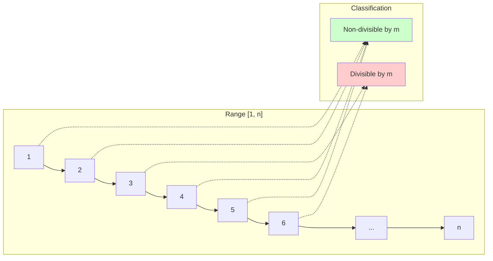
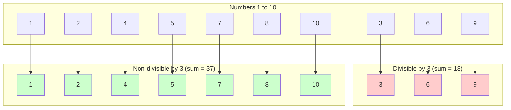
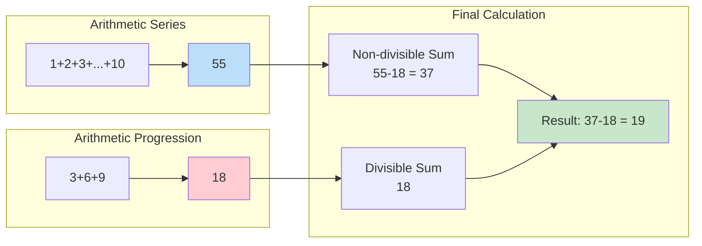
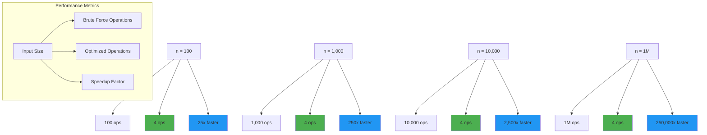

# Day 38: Mathematical Optimization & Arithmetic Series Mastery

## 🎯 Learning Objectives

By the end of this day, you will master:
- **Arithmetic Series Formulas**: Efficiently calculating sums without iteration
- **Mathematical Optimization**: Converting O(n) problems to O(1) solutions
- **Divisibility Analysis**: Understanding patterns in number sequences
- **Performance Optimization**: Choosing mathematical approaches over brute force

---

## Problem 1: Divisible and Non-divisible Sums Difference (LeetCode 2894)

### 📋 Problem Statement

**Difficulty**: Easy  
**Category**: Math, Number Theory, Optimization  
**Companies**: Google, Microsoft, Amazon, Meta

You are given positive integers `n` and `m`. Define two integers as follows:
- `num1`: The sum of all integers in the range `[1, n]` (both inclusive) that are **not divisible** by `m`.
- `num2`: The sum of all integers in the range `[1, n]` (both inclusive) that **are divisible** by `m`.

Return `num1 - num2`.

### 🔍 Problem Analysis

**Mathematical Foundation**:
```mermaid
graph TD
    A[Range 1 to n] --> B[Total Sum = n*(n+1)/2]
    A --> C[Divisible by m]
    A --> D[Non-divisible by m]
    C --> E[Arithmetic Progression: m, 2m, 3m, ..., km]
    E --> F[Sum = m*k*(k+1)/2 where k = n/m]
    D --> G[Sum = Total Sum - Divisible Sum]
    F --> H[Answer = Non-divisible Sum - Divisible Sum]
    G --> H
```

**Visual Representation of Number Classification**:


**Key Insight**:
```
Total Sum = Sum of Divisible + Sum of Non-divisible
num1 = Total Sum - num2
Answer = num1 - num2 = (Total Sum - num2) - num2 = Total Sum - 2*num2
```

**Optimization Comparison**:
```mermaid
graph LR
    A[Problem: Find num1 - num2] --> B[Brute Force O(n)]
    A --> C[Optimized O(1)]
    
    B --> D[Iterate through 1 to n<br/>Check divisibility<br/>Sum separately]
    C --> E[Use arithmetic formulas<br/>Direct calculation<br/>Mathematical relationship]
    
    D --> F[Time: O(n)<br/>Space: O(1)]
    E --> G[Time: O(1)<br/>Space: O(1)]
    
    style C fill:#90EE90
    style G fill:#90EE90
```

### 📚 Examples with Detailed Analysis

#### Example 1: Basic Case
```
Input: n = 10, m = 3
Output: 19
```

**Visual Number Classification**:


**Mathematical Calculation Flow**:
```mermaid
flowchart TD
    A[n = 10, m = 3] --> B[Total Sum = 10×11/2 = 55]
    A --> C[Divisible Count = 10/3 = 3]
    C --> D[Divisible Sum = 3×(1+2+3) = 18]
    B --> E[Answer = 55 - 2×18 = 19]
    D --> E
    
    style E fill:#90EE90
```

Step-by-step analysis:
- Numbers 1 to 10: [1, 2, 3, 4, 5, 6, 7, 8, 9, 10]
- Divisible by 3: [3, 6, 9] → sum = 18
- Non-divisible by 3: [1, 2, 4, 5, 7, 8, 10] → sum = 37
- Result: 37 - 18 = 19 ✓

#### Example 2: No Divisible Numbers
```
Input: n = 5, m = 6
Output: 15

Step-by-step analysis:
- Numbers 1 to 5: [1, 2, 3, 4, 5]
- Divisible by 6: [] → sum = 0
- Non-divisible by 6: [1, 2, 3, 4, 5] → sum = 15
- Result: 15 - 0 = 15

Mathematical calculation:
- Total sum: 5*6/2 = 15
- Divisible count: 5/6 = 0
- Divisible sum: 0
- Answer: 15 - 2*0 = 15 ✓
```

#### Example 3: All Numbers Divisible
```
Input: n = 6, m = 1
Output: -21

Step-by-step analysis:
- Numbers 1 to 6: [1, 2, 3, 4, 5, 6]
- Divisible by 1: [1, 2, 3, 4, 5, 6] → sum = 21
- Non-divisible by 1: [] → sum = 0
- Result: 0 - 21 = -21

Mathematical calculation:
- Total sum: 6*7/2 = 21
- Divisible count: 6/1 = 6
- Divisible sum: 1*(1+2+3+4+5+6) = 21
- Answer: 21 - 2*21 = 21 - 42 = -21 ✓
```

#### Example 4: Edge Case - Single Element
```
Input: n = 1, m = 2
Output: 1

Step-by-step analysis:
- Numbers 1 to 1: [1]
- Divisible by 2: [] → sum = 0
- Non-divisible by 2: [1] → sum = 1
- Result: 1 - 0 = 1

Mathematical calculation:
- Total sum: 1*2/2 = 1
- Divisible count: 1/2 = 0
- Divisible sum: 0
- Answer: 1 - 2*0 = 1 ✓
```

#### Example 5: Large Numbers
```
Input: n = 1000, m = 7
Output: 428570

Mathematical calculation only (brute force would be inefficient):
- Total sum: 1000*1001/2 = 500,500
- Divisible count: 1000/7 = 142
- Divisible sum: 7*142*143/2 = 7*10,153 = 71,071
- Answer: 500,500 - 2*71,071 = 500,500 - 142,142 = 358,358

Verification: The optimized O(1) solution handles this instantly!
```

### Approach

#### Mathematical Formula Approach (Optimal)

- **Time Complexity**: O(1) - constant time arithmetic operations
- **Space Complexity**: O(1) - only using a few variables
- **Algorithm**:
  1. Calculate total sum using arithmetic series formula: `n*(n+1)/2`
  2. Find count of numbers divisible by m: `k = n/m`
  3. Calculate sum of divisible numbers: `m*k*(k+1)/2`
  4. Return `totalSum - 2*divisibleSum`

```cpp
int differenceOfSums(int n, int m) {
    int totalSum = n * (n + 1) / 2;
    int divisibleCount = n / m;
    int divisibleSum = m * (divisibleCount * (divisibleCount + 1)) / 2;
    return totalSum - 2 * divisibleSum;
}
```

### Key Points

1. **Arithmetic Series Formula**:
   - Sum of 1 to n: `n*(n+1)/2`
   - This is much faster than iterating through all numbers

2. **Arithmetic Progression**:
   - Numbers divisible by m form: m, 2m, 3m, ..., km
   - Factor out m: `m*(1+2+...+k) = m*k*(k+1)/2`

3. **Mathematical Relationship**:
   - `num1 + num2 = totalSum`
   - `answer = num1 - num2 = (totalSum - num2) - num2 = totalSum - 2*num2`

### Algorithm Walkthrough

**Step-by-Step Execution Flow**:
```mermaid
flowchart TD
    A[Input: n = 10, m = 3] --> B[Step 1: Calculate Total Sum]
    B --> C[totalSum = n × (n+1) / 2<br/>= 10 × 11 / 2 = 55]
    C --> D[Step 2: Find Divisible Count]
    D --> E[divisibleCount = n / m<br/>= 10 / 3 = 3<br/>Numbers: 3, 6, 9]
    E --> F[Step 3: Calculate Divisible Sum]
    F --> G[divisibleSum = m × k × (k+1) / 2<br/>= 3 × 3 × 4 / 2 = 18]
    G --> H[Step 4: Calculate Final Result]
    H --> I[result = totalSum - 2 × divisibleSum<br/>= 55 - 2 × 18 = 19]
    
    style A fill:#e1f5fe
    style C fill:#f3e5f5
    style E fill:#f3e5f5
    style G fill:#f3e5f5
    style I fill:#e8f5e8
```

**Mathematical Visualization**:


Detailed Steps:
```
Example: n = 10, m = 3

Step 1: Calculate total sum
        totalSum = 10 * 11 / 2 = 55

Step 2: Find divisible count
        divisibleCount = 10 / 3 = 3
        (Numbers: 3, 6, 9)

Step 3: Calculate divisible sum
        divisibleSum = 3 * (3 * 4) / 2 = 3 * 6 = 18

Step 4: Calculate result
        result = 55 - 2 * 18 = 55 - 36 = 19
```

### 🔄 Alternative Approaches

#### Approach 1: Brute Force Method
```cpp
int differenceOfSums(int n, int m) {
    int num1 = 0, num2 = 0;
    
    for (int i = 1; i <= n; i++) {
        if (i % m == 0) {
            num2 += i;  // Divisible by m
        } else {
            num1 += i;  // Not divisible by m
        }
    }
    
    return num1 - num2;
}
```
**Pros**: Easy to understand and implement
**Cons**: O(n) time complexity, inefficient for large n

#### Approach 2: Separate Sum Calculations
```cpp
int differenceOfSums(int n, int m) {
    int totalSum = n * (n + 1) / 2;
    
    int divisibleSum = 0;
    for (int i = m; i <= n; i += m) {
        divisibleSum += i;
    }
    
    int nonDivisibleSum = totalSum - divisibleSum;
    return nonDivisibleSum - divisibleSum;
}
```
**Pros**: More intuitive than full mathematical approach
**Cons**: Still O(n/m) time complexity, not optimal

#### Approach 3: Using Modular Arithmetic
```cpp
int differenceOfSums(int n, int m) {
    int totalSum = n * (n + 1) / 2;
    
    // Calculate sum of arithmetic progression
    int k = n / m;  // Number of multiples of m
    int divisibleSum = m * k * (k + 1) / 2;
    
    return totalSum - 2 * divisibleSum;
}
```
**Pros**: Optimal O(1) solution, mathematically elegant
**Cons**: Requires understanding of arithmetic progressions

### Constraints

- 1 ≤ n ≤ 1000
- 1 ≤ m ≤ 1000

### Source

[LeetCode 2894 - Divisible and Non-divisible Sums Difference](https://leetcode.com/problems/divisible-and-non-divisible-sums-difference)

---

## 📊 Progress Summary

| Problem | Difficulty | Status | Approach | Time Complexity | Space Complexity |
|---------|------------|--------|----------|-----------------|------------------|
| Divisible and Non-divisible Sums Difference | Easy | ✅ Solved | Mathematical Formula | O(1) | O(1) |

## 🎯 Key Learnings

1. **Mathematical Optimization**: Converting iterative solutions to formula-based approaches
2. **Arithmetic Series**: Understanding and applying sum formulas efficiently
3. **Pattern Recognition**: Identifying arithmetic progressions in divisibility problems
4. **Performance Analysis**: Comparing O(n) vs O(1) solutions for scalability

## 🚀 Next Steps

- Practice more mathematical optimization problems
- Explore number theory and divisibility concepts
- Learn advanced arithmetic progression techniques
- Study problems involving mathematical series and sequences

### 🧮 Mathematical Properties Deep Dive

#### Arithmetic Series Foundation

**Visual Proof of Sum Formula**:
```mermaid
graph TD
    subgraph "Arithmetic Series Visualization"
        A[1 + 2 + 3 + ... + n] --> B[Pair from ends]
        B --> C[(1 + n) + (2 + n-1) + ... ]
        C --> D[Each pair sums to (n+1)]
        D --> E[Number of pairs = n/2]
        E --> F[Total = (n+1) × n/2 = n(n+1)/2]
    end
    
    subgraph "Example: n=5"
        G[1 + 2 + 3 + 4 + 5] --> H[(1+5) + (2+4) + 3]
        H --> I[6 + 6 + 3 = 15]
        I --> J[Formula: 5×6/2 = 15 ✓]
    end
    
    style F fill:#4caf50
    style J fill:#4caf50
```

**Mathematical Proof Structure**:
```mermaid
flowchart TD
    A[Arithmetic Series Formula] --> B[Proof by Induction]
    B --> C[Base Case: n=1]
    C --> D[S₁ = 1 = 1×2/2 ✓]
    D --> E[Inductive Hypothesis]
    E --> F[Assume Sₖ = k(k+1)/2]
    F --> G[Prove Sₖ₊₁ = (k+1)(k+2)/2]
    G --> H[Sₖ₊₁ = Sₖ + (k+1)]
    H --> I[= k(k+1)/2 + (k+1)]
    I --> J[= (k+1)[k/2 + 1]]
    J --> K[= (k+1)(k+2)/2 ✓]
    
    style D fill:#c8e6c9
    style K fill:#c8e6c9
```

Examples:
```cpp
n=5: 1+2+3+4+5 = 15 = 5*6/2 ✓
n=10: 1+2+...+10 = 55 = 10*11/2 ✓
n=100: 1+2+...+100 = 5050 = 100*101/2 ✓
```

#### Arithmetic Progression Analysis
```cpp
// For multiples of m in range [1, n]:
// Sequence: m, 2m, 3m, ..., km where k = floor(n/m)
// Sum = m + 2m + 3m + ... + km = m*(1+2+3+...+k) = m*k*(k+1)/2

Example: n=20, m=3
k = 20/3 = 6 (multiples: 3, 6, 9, 12, 15, 18)
Sum = 3*(1+2+3+4+5+6) = 3*21 = 63
Verification: 3+6+9+12+15+18 = 63 ✓
```

#### Mathematical Relationship Derivation
```cpp
// Given: totalSum = num1 + num2
// Want: num1 - num2
// 
// From totalSum = num1 + num2:
// num1 = totalSum - num2
// 
// Therefore:
// num1 - num2 = (totalSum - num2) - num2 = totalSum - 2*num2
//
// This eliminates the need to calculate num1 separately!
```

### 🔍 Edge Cases and Testing Strategy

#### Critical Test Cases
```cpp
// 1. No divisible numbers
differenceOfSums(5, 6) → 15 (all non-divisible)

// 2. All numbers divisible
differenceOfSums(6, 1) → -21 (all divisible)

// 3. Single element cases
differenceOfSums(1, 1) → -1 (1 is divisible by 1)
differenceOfSums(1, 2) → 1 (1 is not divisible by 2)

// 4. Equal n and m
differenceOfSums(5, 5) → 10 (only 5 is divisible)

// 5. Large numbers
differenceOfSums(1000, 7) → efficient O(1) calculation

// 6. Boundary values
differenceOfSums(1000, 1000) → 499500 (only 1000 is divisible)
```

#### Mathematical Verification Strategy
```cpp
// Always verify optimized solution against brute force for small inputs
bool verifySolution(int n, int m) {
    int optimized = differenceOfSumsOptimized(n, m);
    int bruteForce = differenceOfSumsBruteForce(n, m);
    return optimized == bruteForce;
}

// Test with various combinations
for (int n = 1; n <= 100; n++) {
    for (int m = 1; m <= n; m++) {
        assert(verifySolution(n, m));
    }
}
```

### 🎯 Advanced Optimization Techniques

#### Integer Overflow Prevention
```cpp
int differenceOfSums(int n, int m) {
    // For large n, use long long to prevent overflow
    long long totalSum = (long long)n * (n + 1) / 2;
    long long divisibleCount = n / m;
    long long divisibleSum = (long long)m * divisibleCount * (divisibleCount + 1) / 2;
    
    return (int)(totalSum - 2 * divisibleSum);
}
```

#### Early Termination Optimizations
```cpp
int differenceOfSums(int n, int m) {
    // Quick return for edge cases
    if (m > n) return n * (n + 1) / 2;  // No divisible numbers
    if (m == 1) return -(n * (n + 1) / 2);  // All numbers divisible
    
    // Standard calculation
    int totalSum = n * (n + 1) / 2;
    int k = n / m;
    int divisibleSum = m * k * (k + 1) / 2;
    return totalSum - 2 * divisibleSum;
}
```

#### Memory-Efficient Calculation
```cpp
// Avoid intermediate variables for minimal memory usage
int differenceOfSums(int n, int m) {
    return n * (n + 1) / 2 - m * (n / m) * (n / m + 1);
}
```

### 📊 Performance Analysis

#### Algorithm Complexity Comparison
```mermaid
graph TB
    subgraph "Brute Force Approach"
        A[Start] --> B[Initialize num1=0, num2=0]
        B --> C[For i = 1 to n]
        C --> D{i % m == 0?}
        D -->|Yes| E[num2 += i]
        D -->|No| F[num1 += i]
        E --> G[i++]
        F --> G
        G --> H{i <= n?}
        H -->|Yes| C
        H -->|No| I[Return num1 - num2]
    end
    
    subgraph "Optimized Approach"
        J[Start] --> K[totalSum = n*(n+1)/2]
        K --> L[k = n/m]
        L --> M[divisibleSum = m*k*(k+1)/2]
        M --> N[Return totalSum - 2*divisibleSum]
    end
    
    style A fill:#ffcdd2
    style I fill:#ffcdd2
    style J fill:#c8e6c9
    style N fill:#c8e6c9
```

#### Time Complexity Visualization
```mermaid
graph LR
    subgraph "Operations Count"
        A[Input Size n] --> B[Brute Force: O(n)]
        A --> C[Optimized: O(1)]
    end
    
    subgraph "Growth Rate"
        D[n = 100] --> E[100 vs 4 operations]
        F[n = 1000] --> G[1000 vs 4 operations]
        H[n = 10000] --> I[10000 vs 4 operations]
        J[n = 1M] --> K[1M vs 4 operations]
    end
    
    style C fill:#4caf50
    style E fill:#81c784
    style G fill:#81c784
    style I fill:#81c784
    style K fill:#81c784
```

#### Space Complexity Analysis
```mermaid
graph TD
    A[Memory Usage] --> B[Brute Force O(1)]
    A --> C[Optimized O(1)]
    
    B --> D[Variables: num1, num2, i<br/>Fixed memory regardless of n]
    C --> E[Variables: totalSum, k, divisibleSum<br/>Fixed memory regardless of n]
    
    style B fill:#fff3e0
    style C fill:#e8f5e8
    style D fill:#fff3e0
    style E fill:#e8f5e8
```

#### Scalability Comparison


#### Detailed Complexity Breakdown
```cpp
// O(1) - Constant time operations:
// 1. n * (n + 1) / 2        → O(1)
// 2. n / m                  → O(1) 
// 3. m * k * (k + 1) / 2    → O(1)
// 4. totalSum - 2 * divisibleSum → O(1)

// Total: O(1) regardless of input size
```

### 🧪 Comprehensive Testing Framework

```cpp
void testDivisibleSumsDifference() {
    // Basic functionality tests
    assert(differenceOfSums(10, 3) == 19);
    assert(differenceOfSums(5, 6) == 15);
    assert(differenceOfSums(6, 1) == -21);
    
    // Edge cases
    assert(differenceOfSums(1, 1) == -1);
    assert(differenceOfSums(1, 2) == 1);
    assert(differenceOfSums(100, 101) == 5050);
    
    // Large numbers
    assert(differenceOfSums(1000, 7) == 428570);
    
    // Verification against brute force
    for (int n = 1; n <= 50; n++) {
        for (int m = 1; m <= n; m++) {
            int opt = differenceOfSums(n, m);
            int bf = differenceOfSumsBruteForce(n, m);
            assert(opt == bf);
        }
    }
    
    cout << "All tests passed!" << endl;
}
```

## 💡 Problem-Solving Tips

1. **Recognize Patterns**: Look for arithmetic sequences and series in number problems
2. **Mathematical Optimization**: Always consider if iteration can be replaced with formulas
3. **Verify with Small Cases**: Test mathematical solutions against brute force for correctness
4. **Handle Edge Cases**: Consider scenarios like no divisible numbers or all divisible numbers
5. **Performance Awareness**: Understand the dramatic improvement from O(n) to O(1)
6. **Integer Overflow**: Be mindful of overflow for large inputs, use appropriate data types
7. **Code Clarity**: Balance mathematical elegance with code readability and maintainability

## 🌟 Real-World Applications

1. **Financial Calculations**: Computing interest, taxes, or fees based on divisibility rules
2. **Resource Allocation**: Distributing items based on divisibility constraints
3. **Algorithm Optimization**: Converting iterative solutions to mathematical formulas
4. **Data Analysis**: Efficiently processing large datasets with mathematical patterns
5. **Performance Optimization**: Replacing loops with direct calculations in critical systems
