# Day 38: 🔢 Difference of Sums - Complete Beginner's Guide

> **Master mathematical optimization and eliminate loops with formulas!**

---

## 📖 What You'll Learn

By the end of this guide, you'll master:
- 🧮 **Arithmetic Series Formulas** - Calculate sums without iteration
- ⚡ **Mathematical Optimization** - Transform O(n) solutions to O(1)
- 🎯 **Integer Division Techniques** - Count multiples efficiently
- 💡 **Pattern Recognition** - Identify mathematical structures in problems

---

## 🎯 The Problem

### 📋 Problem Statement

**Given**: Two positive integers `n` and `m`  
**Task**: Calculate `(1 + 2 + 3 + ... + n) - 2 × (sum of integers divisible by m)`  
**Constraint**: Find the difference using mathematical efficiency

**Important Rule**: Think mathematically, not iteratively!

### 🌟 Real-World Example

Imagine distributing rewards:
- Everyone gets points: 1 + 2 + 3 + ... + n
- But people divisible by m lose double their share
- What's the final difference?

---

## 🔍 Understanding the Basics

### 📐 What Is Arithmetic Series?

```mermaid
flowchart TD
    A[Arithmetic Series] --> B[Sum of consecutive integers]
    A --> C[Pattern: 1, 2, 3, 4, ...]
    
    B --> D["Formula: S = n × n+1 / 2"]
    D --> E["Example: 1+2+3+4+5 = 5×6/2 = 15"]
    
    C --> F["Each term increases by 1"]
    
    style A fill:#e1f5fe
    style D fill:#fff3e0
    style E fill:#e8f5e8
```

**The Magic Formula:**
```
Sum of 1 to n = n × (n + 1) / 2
```

**Why does this work?**
- Pair numbers from ends: (1+n) + (2+n-1) + ...
- Each pair sums to (n+1)
- We have n/2 pairs
- Total: n × (n+1) / 2

### 🔢 Finding Multiples

```mermaid
flowchart TD
    A[Find integers divisible by m] --> B["Range: 1 to n"]
    
    B --> C["Multiples: m, 2m, 3m, ..., km"]
    C --> D["Count k = n ÷ m (integer division)"]
    
    D --> E["Example: n=10, m=3"]
    E --> F["Multiples: 3, 6, 9"]
    F --> G["Count: 10÷3 = 3 ✓"]
    
    style A fill:#e3f2fd
    style C fill:#fff3e0
    style G fill:#e8f5e8
```

**Pattern Recognition:**
- Divisible numbers: m, 2m, 3m, ..., km
- This is a new arithmetic series!
- First term = m, common difference = m, count = k

---

## 📚 Step-by-Step Examples

### 🟢 Example 1: Simple Case

**Input:** `n = 10, m = 3`  
**Output:** `19`

```mermaid
graph TD
    A[n=10, m=3] --> B["Total sum: 1+2+...+10"]
    B --> C["= 10×11/2 = 55"]
    
    A --> D["Divisible by 3: 3, 6, 9"]
    D --> E["Count = 10÷3 = 3"]
    E --> F["Sum = 3×1 + 3×2 + 3×3"]
    F --> G["= 3×6/2 = 18"]
    
    C --> H["Result = 55 - 2×18"]
    G --> H
    H --> I["= 55 - 36 = 19 ✅"]
    
    style A fill:#e8f5e8
    style C fill:#fff3e0
    style G fill:#fff3e0
    style I fill:#c8e6c9
```

**Detailed Breakdown:**
1. **Calculate total sum:** 1+2+3+...+10 = 10×11/2 = 55
2. **Find divisible numbers:** 3, 6, 9 (count = 3)
3. **Sum of divisible:** 3+6+9 = 3×(1+2+3) = 3×6/2 = 18
4. **Final answer:** 55 - 2×18 = 19

### 🔴 Example 2: m = 1 (All Numbers Divisible)

**Input:** `n = 5, m = 1`  
**Output:** `-15`

```mermaid
graph TD
    A[n=5, m=1] --> B["Total sum: 1+2+3+4+5"]
    B --> C["= 5×6/2 = 15"]
    
    A --> D["All numbers divisible by 1"]
    D --> E["Sum = 15"]
    
    C --> F["Result = 15 - 2×15"]
    E --> F
    F --> G["= 15 - 30 = -15 ✅"]
    
    style A fill:#ffebee
    style C fill:#fff3e0
    style G fill:#ffcdd2
```

**Insight:** When m=1, everyone loses double their points!

### 🟡 Example 3: m Greater Than n

**Input:** `n = 5, m = 10`  
**Output:** `15`

```mermaid
graph TD
    A[n=5, m=10] --> B["Total sum: 1+2+3+4+5"]
    B --> C["= 5×6/2 = 15"]
    
    A --> D["Divisible by 10 in range 1..5?"]
    D --> E["None! (10 > 5)"]
    E --> F["Count = 5÷10 = 0"]
    F --> G["Sum of divisible = 0"]
    
    C --> H["Result = 15 - 2×0"]
    G --> H
    H --> I["= 15 - 0 = 15 ✅"]
    
    style A fill:#e1f5fe
    style E fill:#fff3e0
    style I fill:#e8f5e8
```

**Edge Case:** No multiples exist, so nothing is subtracted!

### 🟠 Example 4: Larger Numbers

**Input:** `n = 100, m = 5`  
**Output:** `2950`

```mermaid
graph TD
    A[n=100, m=5] --> B["Total sum = 100×101/2 = 5050"]
    
    A --> C["Divisible by 5: 5,10,15,...,100"]
    C --> D["Count = 100÷5 = 20"]
    D --> E["Sum = 5×20×21/2"]
    E --> F["= 5×210 = 1050"]
    
    B --> G["Result = 5050 - 2×1050"]
    F --> G
    G --> H["= 5050 - 2100 = 2950 ✅"]
    
    style A fill:#e3f2fd
    style F fill:#fff3e0
    style H fill:#c8e6c9
```

---

## 🛠️ The Algorithm

### 🎯 Main Strategy: Mathematics Over Loops

```mermaid
flowchart TD
    A[Input: n, m] --> B["Step 1: Calculate total sum"]
    B --> C["totalSum = n × n+1 / 2"]
    
    C --> D["Step 2: Count multiples"]
    D --> E["count = n ÷ m"]
    
    E --> F["Step 3: Sum of multiples"]
    F --> G["divisibleSum = m × count × count+1 / 2"]
    
    G --> H["Step 4: Calculate difference"]
    H --> I["result = totalSum - 2 × divisibleSum"]
    
    I --> J["Output: result"]
    
    style A fill:#e8f5e8
    style C fill:#fff3e0
    style E fill:#fff3e0
    style G fill:#fff3e0
    style J fill:#c8e6c9
```

### 💻 The Code

```cpp
int differenceOfSums(int n, int m) {
    // 🧮 STEP 1: Sum of all integers 1 to n
    int totalSum = n * (n + 1) / 2;
    
    // 🔢 STEP 2: Count how many are divisible by m
    int divisibleCount = n / m;
    
    // ✖️ STEP 3: Sum of divisible integers
    // multiples: m, 2m, 3m, ..., km
    // sum: m*(1+2+3+...+k) = m*k*(k+1)/2
    int divisibleSum = m * (divisibleCount * (divisibleCount + 1)) / 2;
    
    // 📊 STEP 4: Calculate final result
    return totalSum - 2 * divisibleSum;
}
```

### 🧠 Understanding Each Formula

**Formula 1: Total Sum**
```
totalSum = n × (n + 1) / 2

Why: (1+n) + (2+n-1) + ... = pairs of (n+1)
     n/2 pairs × (n+1) = n×(n+1)/2

Example: n=5
         1+2+3+4+5 = 5×6/2 = 15 ✓
```

**Formula 2: Divisible Count**
```
divisibleCount = n / m (integer division)

Why: Multiples of m are: m, 2m, 3m, ..., km
     The largest multiple ≤ n is k×m where k = n/m

Example: n=10, m=3
         Multiples: 3, 6, 9 (that's 3 numbers)
         10/3 = 3 ✓
```

**Formula 3: Divisible Sum**
```
divisibleSum = m × (k × (k+1) / 2)
            = m + 2m + 3m + ... + km

Why: Factor out m from each term
     = m×(1 + 2 + 3 + ... + k)
     = m × k×(k+1)/2

Example: n=10, m=3, k=3
         3+6+9 = 3×1 + 3×2 + 3×3
              = 3×(1+2+3)
              = 3×(3×4/2)
              = 3×6 = 18 ✓
```

---

## 🧪 Test Cases & Edge Cases

### ✅ Normal Cases

| Input (n, m) | Output | Why |
|--------------|--------|-----|
| (10, 3) | 19 | Standard case |
| (5, 1) | -15 | All numbers divisible |
| (100, 5) | 2950 | Larger numbers |

### ⚠️ Edge Cases

| Input (n, m) | Output | Why |
|--------------|--------|-----|
| (1, 1) | -1 | Minimum case |
| (5, 10) | 15 | m > n |
| (50, 50) | 1175 | n equals m |

### 🎯 Boundary Testing

```mermaid
graph TD
    A[Test Categories] --> B[Normal Cases<br/>✅ Expected behavior]
    A --> C[Edge Cases<br/>⚠️ Special values]
    A --> D[Boundary Cases<br/>🎯 Limit testing]
    
    B --> B1["(10, 3) → 19"]
    B --> B2["(100, 5) → 2950"]
    
    C --> C1["(1, 1) → -1"]
    C --> C2["(5, 10) → 15"]
    
    D --> D1["(50, 50) → 1175"]
    D --> D2["(8, 2) → -4"]
    
    style B fill:#e8f5e8
    style C fill:#fff3e0
    style D fill:#e0f2f1
```

---

## 🎓 Key Concepts Mastery

### 🧮 Mathematical Patterns

**Pattern 1: Arithmetic Series**
```cpp
// Sum of 1 to n
sum = n * (n + 1) / 2

// Example calculation
n = 10: 10 * 11 / 2 = 110 / 2 = 55
```

**Pattern 2: Multiples Series**
```cpp
// Sum of multiples of m up to n
count = n / m
sum = m * count * (count + 1) / 2

// Example calculation
n=10, m=3: count=3, sum=3*3*4/2=18
```

**Pattern 3: Weighted Difference**
```cpp
// The final formula combines both patterns
result = totalSum - 2 * divisibleSum
```

### ⚡ Why O(1) Instead of O(n)?

```mermaid
graph TD
    A[Naive Approach] --> B["Loop through 1 to n"]
    B --> C["Add each number"]
    C --> D["Check if divisible by m"]
    D --> E[Time: O n]
    
    A2[Smart Approach] --> B2["Use formula 1: n×n+1/2"]
    B2 --> C2["Use formula 2: n÷m"]
    C2 --> D2["Use formula 3: m×k×k+1/2"]
    D2 --> E2[Time: O 1]
    
    style A fill:#ffebee
    style E fill:#ff5252
    style A2 fill:#e8f5e8
    style E2 fill:#4caf50
```

**The Advantage:**
- Naive: 10 million operations for n=10,000,000
- Smart: 4 operations always!

### 🎯 Problem-Solving Framework

```mermaid
flowchart TD
    A[See a summation problem] --> B[Look for patterns]
    B --> C[Identify arithmetic series?]
    C --> D{Yes?}
    D -->|Yes| E[Use formula: n×n+1/2]
    D -->|No| F[Think recursively or DP]
    
    E --> G[Check for constraints]
    G --> H[Apply similar formula logic]
    H --> I[Combine formulas]
    I --> J[O1 Solution!]
    
    style A fill:#e1f5fe
    style E fill:#fff3e0
    style J fill:#c8e6c9
```

---

## 📊 Complexity Analysis

### ⏰ Time Complexity: O(1)

**Why constant time?**
- We perform exactly 4 arithmetic operations
- No loops, no recursion, no array access
- Execution time doesn't depend on n

```mermaid
graph TD
    A[Number of Operations] --> B["Operation 1: n×n+1/2"]
    A --> C["Operation 2: n÷m"]
    A --> D["Operation 3: m×count×count+1/2"]
    A --> E["Operation 4: totalSum - 2×divisibleSum"]
    
    F[Total Operations: 4] --> G[Always 4, regardless of n]
    
    style B fill:#fff3e0
    style C fill:#fff3e0
    style D fill:#fff3e0
    style E fill:#fff3e0
    style F fill:#c8e6c9
```

**Comparison:**
```
Naive Loop:      n = 1,000,000 → 1,000,000 operations
Mathematical:    n = 1,000,000 → 4 operations
                 250,000x faster!
```

### 💾 Space Complexity: O(1)

**Why constant space?**
- Only 3 integer variables: totalSum, divisibleCount, divisibleSum
- No arrays, lists, or dynamic memory
- Memory usage is constant regardless of input

```mermaid
graph TD
    A[Memory Used] --> B["Variable 1: totalSum"]
    A --> C["Variable 2: divisibleCount"]
    A --> D["Variable 3: divisibleSum"]
    
    E[Total Memory: 3 ints ≈ 12 bytes]
    E --> F[Constant, never grows]
    
    style B fill:#e3f2fd
    style C fill:#e3f2fd
    style D fill:#e3f2fd
    style F fill:#c8e6c9
```

---

## 🚀 Practice Problems

Once you master this, try these similar problems:

| Problem | Difficulty | Key Concept |
|---------|------------|------------|
| 🔢 Sum to N | Easy | Basic arithmetic series |
| ✖️ Product of Array | Easy | Pattern manipulation |
| 🎯 Arithmetic Progression | Medium | Extended patterns |
| 💎 Geometric Series | Medium | Multiplicative patterns |

---

## 💼 Interview Questions & Answers

### ❓ Question 1: Why is a formula better than a loop?

**Answer:**  
A loop is O(n) - it gets slower as n increases. A formula is O(1) - it's instant regardless of size.

**Simple Explanation:**  
Calculating the sum of 1 to 1,000,000 with a loop takes time. With a formula, it's always instant:
```cpp
// Loop: slow, gets slower with bigger n
for(int i=1; i<=n; i++) sum += i;

// Formula: fast, always the same speed
sum = n * (n+1) / 2;
```

**Real-world analogy:**  
Counting money by hand (loop) vs. knowing "10 bills × $100/bill = $1000" (formula)

---

### ❓ Question 2: How does the arithmetic series formula work?

**Answer:**  
The key insight is pairing numbers:
```
1 + 2 + 3 + 4 + 5
= (1+5) + (2+4) + 3
= 6 + 6 + 3
= 3 pairs of 6, plus middle
= 5×6/2
```

**General pattern:**
```
(first + last) + (second + second-to-last) + ...
= (n+1) + (n+1) + ... (n/2 times)
= n × (n+1) / 2
```

---

### ❓ Question 3: Why do we use integer division `n / m`?

**Answer:**  
Integer division automatically gives us the count of complete multiples.

**Example:**
```cpp
n = 10, m = 3
10 / 3 = 3 (exact count of multiples)
         // Multiples are: 3, 6, 9

n = 11, m = 3
11 / 3 = 3 (still 3, we ignore remainder)
         // Multiples are still: 3, 6, 9
         // (12 would be the next, but 12 > 11)
```

**Key Insight:**  
Integer division automatically rounds down, giving us exactly what we need!

---

### ❓ Question 4: How do we handle the "divisible" sum?

**Answer:**  
We recognize the divisible numbers form their own arithmetic series:
```
Divisible by m: m, 2m, 3m, ..., km
             = m×(1 + 2 + 3 + ... + k)
             = m × k×(k+1)/2
```

**Example:**
```
n=10, m=3, k=3
Multiples: 3, 6, 9
         = 3×1, 3×2, 3×3
         = 3×(1+2+3)
         = 3 × (3×4/2)
         = 3 × 6 = 18
```

---

### ❓ Question 5: What if n or m is very large?

**Answer:**  
No problem! The algorithm is still O(1) and works for any positive integers.

**Optimization:**  
The formula is so efficient that even for n = 10^18 (a billion billion), it calculates instantly!

---

### ❓ Question 6: Why does the problem ask for "2× divisibleSum"?

**Answer:**  
It's the problem's definition - people divisible by m lose double their contribution.

**Mathematical interpretation:**
```
Net gain = (Everyone's sum) - (Double penalty for divisible)
         = totalSum - 2×divisibleSum
```

**Example logic:**
```
Person 1: gains 1 point
Person 2: gains 2 points
Person 3: gains 3 points BUT loses 2×3=6 (divisible by 3)
         Net: 3 - 2×3 = -3

This is built into: totalSum - 2×divisibleSum
```

---

### ❓ Question 7: Can we optimize this further?

**Answer:**  
No - O(1) is the absolute best possible! We can't do better than constant time.

**Why not?**
- We must read the input (O(1) with 2 integers)
- We must return output (O(1) with 1 integer)
- The algorithm already uses constant operations

**The Mathematical Ceiling:**  
O(1) is the theoretical maximum - once you reach it, there's nowhere else to go!

---

### ❓ Question 8: What if m doesn't divide n evenly?

**Answer:**  
Integer division handles it perfectly! The remainder is ignored.

**Example:**
```
n = 11, m = 3
Multiples: 3, 6, 9 (not 12, because 12 > 11)
Count: 11 / 3 = 3 (the .666... is ignored)
Sum: 3 × (3×4/2) = 18

The formula doesn't care about remainders!
```

**Why it works:**  
Integer division in C++ automatically truncates (rounds down), which is exactly what we need for counting complete multiples.

---

### ❓ Question 9: How does the formula scale to large numbers?

**Answer:**  
Perfectly! Mathematical formulas scale linearly in complexity, but stay O(1) in time.

**Scaling example:**
```
n = 100:        Formula works instantly
n = 10,000:     Formula works instantly
n = 1,000,000:  Formula works instantly
n = 10^18:      Formula works instantly
```

**No Performance Degradation:**  
A loop at n=10^18 would crash or take forever. The formula? Still 4 operations.

---

### ❓ Question 10: What's the difference between formula and loop?

**Answer:**  

**Loop Approach (Naive):**
```cpp
int result = 0;
for(int i = 1; i <= n; i++) {
    result += i;
    if(i % m == 0) result -= 2*i;
}
```
- Time: O(n) - could take seconds for large n
- Space: O(1)
- Simple to understand
- Very slow for big numbers

**Formula Approach (Smart):**
```cpp
int totalSum = n * (n + 1) / 2;
int count = n / m;
int divisibleSum = m * (count * (count + 1)) / 2;
return totalSum - 2 * divisibleSum;
```
- Time: O(1) - always instant
- Space: O(1)
- Requires mathematical thinking
- Ultra-fast for any size

**Interview Perspective:**  
Using loops shows basic understanding. Using formulas shows mastery and optimization skills!

---

### ❓ Question 11: How do you derive the divisible sum formula?

**Answer:**  
Start with the pattern and factor out the common multiple.

**Step-by-step derivation:**
```
Divisible numbers: m, 2m, 3m, ..., km

Sum = m + 2m + 3m + ... + km
    = m×(1 + 2 + 3 + ... + k)     [Factor out m]
    = m × k×(k+1)/2               [Use arithmetic series formula]
```

**Proof with example:**
```
n=12, m=4
Multiples: 4, 8, 12 (k=3)

Direct sum: 4 + 8 + 12 = 24
Formula:    4 × (3×4/2) = 4 × 6 = 24 ✓
```

---

### ❓ Question 12: What happens when m = 1?

**Answer:**  
Every number is divisible by 1, so everyone loses double their points!

**Mathematical behavior:**
```
n = 5, m = 1
Total sum: 15
Divisible: all of them (15)
Result: 15 - 2×15 = -15

Everyone has a negative score!
```

**Real-world interpretation:**  
If m=1, the penalty system is so harsh that everyone ends up in the red!

---

## 🔑 Quick Reference

### Essential Code Patterns

```cpp
// Total sum of 1 to n
int totalSum = n * (n + 1) / 2;

// Count multiples of m
int count = n / m;

// Sum of multiples
int divisibleSum = m * (count * (count + 1)) / 2;

// Final calculation
int result = totalSum - 2 * divisibleSum;
```

### Mental Math Shortcuts

**For calculating n × (n+1) / 2:**
```
n = 5:   5 × 6 / 2 = 30 / 2 = 15
n = 10:  10 × 11 / 2 = 110 / 2 = 55
n = 100: 100 × 101 / 2 = 5050
```

**For counting multiples:**
```
n = 20, m = 5:  20 / 5 = 4 multiples (5,10,15,20)
n = 20, m = 3:  20 / 3 = 6 multiples (3,6,9,12,15,18)
n = 20, m = 7:  20 / 7 = 2 multiples (7,14)
```

---

## 🧠 Mental Model


---

## 🏆 Mastery Checklist

- ✅ Understand arithmetic series formula derivation
- ✅ Know how to count multiples using integer division
- ✅ Master the divisible sum formula
- ✅ Recognize when formulas beat loops
- ✅ Handle edge cases (m > n, m = 1, etc.)
- ✅ Solve the problem in O(1) time
- ✅ Use O(1) space only
- ✅ Explain the algorithm clearly
- ✅ Answer common interview questions confidently
- ✅ Derive formulas from first principles

---

## 💡 Pro Tips

1. **🧮 Learn the Pattern:** Arithmetic series formula is fundamental to many optimization problems
2. **🎯 Think Mathematically:** When you see summations, look for patterns instead of loops
3. **📊 Verify with Examples:** Always test your formula with small numbers first
4. **🚀 Time vs. Space Trade-off:** This problem uses formulas to optimize time at no space cost
5. **💼 Interview Strategy:** Mention the naive O(n) approach first, then optimize to O(1)
6. **🔍 Pattern Recognition:** Practice identifying which problems can be optimized mathematically

---

## 🎓 Related Concepts

**Problems Using Similar Techniques:**
- Sum of arithmetic progressions
- Counting divisors
- Finding sum of divisors
- Arithmetic/geometric series problems
- Range sum queries (can use formulas)

**Advanced Topics:**
- Diophantine equations (when formulas help solve equations)
- Number theory patterns
- Mathematical programming techniques

---

**🎉 Congratulations! You now have complete mastery of mathematical optimization, arithmetic series formulas, and can confidently solve similar problems. You've learned not just how to code, but how to think mathematically to create elegant, efficient solutions. Keep practicing and happy coding!**