# Day 39: 💧 Container With Most Water - Complete Beginner's Guide

> **Master the two-pointer technique and greedy algorithms step by step!**

---

## 📖 What You'll Learn

By the end of this guide, you'll master:
- 🎯 **Two-Pointer Technique** - Efficient array traversal from both ends
- 🧠 **Greedy Algorithms** - Making optimal local choices for global solutions
- 📐 **Area Calculation** - Understanding geometry in programming
- 🚀 **Algorithm Optimization** - From O(n²) brute force to O(n) elegance

---

## 🎯 The Problem

### 📋 Problem Statement

**Given**: An array of non-negative integers `height` where each element represents the height of a vertical line  
**Task**: Find two lines that together with the x-axis form a container holding the maximum water  
**Return**: The maximum amount of water the container can store

**Important Rule**: The container cannot be slanted (water level is horizontal)!

### 🌟 Real-World Example

Think of it like choosing two walls to build a swimming pool:
- **Heights**: `[1, 8, 6, 2, 5, 4, 8, 3, 7]`
- **Best Choice**: Lines at index 1 (height 8) and index 8 (height 7)
- **Water Held**: `min(8, 7) × (8 - 1) = 7 × 7 = 49 units`

---

## 🔍 Understanding the Basics

### 🏗️ What Is a Water Container?


**Think of it like a container:**
- Two vertical walls at different positions
- Water fills up to the height of the shorter wall
- Wider containers can hold more water (if walls are tall enough)

### 🎲 Area Calculation Formula

Here's how we calculate water capacity:

```mermaid
flowchart TD
    A["Area Formula"] --> B["Area = Width × Height"]
    B --> C["Width = right - left"]
    B --> D["Height = min of two heights"]
    
    C --> E["Distance between indices"]
    D --> F["Limited by shorter wall"]
    
    F --> G["Water cannot rise above shortest wall"]
    
    style A fill:#e8f5e8
    style B fill:#fff3e0
    style G fill:#ffebee
```

**Key Formula:**
```
Area = min(height[left], height[right]) × (right - left)
       ↑                                   ↑
   Water height                        Container width
```

---

## 📚 Step-by-Step Examples

### 🟢 Example 1: Simple Two-Line Case

**Input:** `height = [1, 8, 6, 2, 5, 4, 8, 3, 7]`  
**Output:** `49`

```mermaid
flowchart TD
    A["Start: left=0, right=8"] --> B["height[0]=1, height[8]=7"]
    B --> C["Area = min 1,7 × 8 = 8"]
    C --> D["Move left pointer: left=1"]
    D --> E["height[1]=8, height[8]=7"]
    E --> F["Area = min 8,7 × 7 = 49"]
    F --> G["Best area found: 49 ✅"]
    
    style A fill:#e8f5e8
    style F fill:#fff3e0
    style G fill:#c8e6c9
```

**Step-by-step breakdown:**
1. **Start:** `left = 0` (height 1), `right = 8` (height 7)
   - Area = `min(1, 7) × (8 - 0) = 1 × 8 = 8`
   - Move left pointer (height 1 is smaller)
   
2. **Step 2:** `left = 1` (height 8), `right = 8` (height 7)
   - Area = `min(8, 7) × (8 - 1) = 7 × 7 = 49` ✨ **Best!**
   - Move right pointer (height 7 is smaller)
   
3. **Step 3:** `left = 1` (height 8), `right = 7` (height 3)
   - Area = `min(8, 3) × (7 - 1) = 3 × 6 = 18`
   - Move right pointer (height 3 is smaller)
   
4. **Continue** until pointers meet...
5. **Result:** Maximum area = `49`

### 🔵 Example 2: Equal Heights

**Input:** `height = [4, 4, 4, 4, 4]`  
**Output:** `16`

```mermaid
flowchart TD
    A["Start: left=0, right=4"] --> B["All heights equal: 4"]
    B --> C["Best width: 4 indices apart"]
    C --> D["Area = 4 × 4 = 16"]
    D --> E["Any two endpoints work ✅"]
    
    style A fill:#e3f2fd
    style D fill:#bbdefb
    style E fill:#90caf9
```

**Why maximum width wins:**
- When all heights are equal, maximize width
- Area = `height × width = 4 × 4 = 16`
- Moving inward only reduces width (and thus area)

### 🟡 Example 3: Ascending Heights

**Input:** `height = [1, 2, 3, 4, 5]`  
**Output:** `6`

```mermaid
flowchart TD
    A["Start: left=0, right=4"] --> B["height[0]=1, height[4]=5"]
    B --> C["Area = min 1,5 × 4 = 4"]
    C --> D["Move left: left=1"]
    D --> E["height[1]=2, height[4]=5"]
    E --> F["Area = min 2,5 × 3 = 6"]
    F --> G["Best configuration ✅"]
    
    style A fill:#fff8e1
    style F fill:#ffecb3
    style G fill:#ffe082
```

**Key observation:**
- Even though right side is tallest (5), we need left side taller
- Best pair: indices 1 and 4 → `min(2, 5) × 3 = 6`

### 🔴 Example 4: Peak at Edges

**Input:** `height = [10, 1, 1, 1, 10]`  
**Output:** `40`

```mermaid
flowchart TD
    A["Start: left=0, right=4"] --> B["height[0]=10, height[4]=10"]
    B --> C["Area = min 10,10 × 4 = 40"]
    C --> D["Perfect match!"]
    D --> E["Both tall + maximum width ✅"]
    
    style A fill:#e8f5e8
    style C fill:#c8e6c9
    style E fill:#a5d6a7
```

**Optimal scenario:**
- Both walls equally tall (10 units)
- Maximum distance apart (4 indices)
- Area = `10 × 4 = 40`

---

## 🛠️ The Algorithm

### 🎯 Main Strategy: Two-Pointer Greedy Approach


### 💻 The Code

```cpp
int maxArea(vector<int>& height) {
    int left = 0;                    // 🎯 Start from beginning
    int right = height.size() - 1;   // 🎯 Start from end
    int max_area = 0;                // 📊 Track maximum
    
    while (left < right) {
        // 📐 Calculate current area
        int area = min(height[left], height[right]) * (right - left);
        
        // 🏆 Update maximum if better
        max_area = max(max_area, area);
        
        // 🚀 GREEDY CHOICE: Move shorter pointer
        if (height[left] < height[right]) {
            left++;   // Try taller left wall
        } else {
            right--;  // Try taller right wall
        }
    }
    
    return max_area;
}
```

### 🛡️ Why the Greedy Choice Works

**The Logic Behind Moving the Shorter Pointer:**

```mermaid
flowchart TD
    A["Current State:<br/>left and right pointers"] --> B{"Which pointer to move?"}
    
    B --> C["Option 1: Move TALLER pointer"]
    B --> D["Option 2: Move SHORTER pointer"]
    
    C --> E["Width decreases ❌"]
    E --> F["Height cannot improve ❌"]
    F --> G["Area DEFINITELY decreases"]
    
    D --> H["Width decreases ❌"]
    H --> I["Height MIGHT improve ✅"]
    I --> J["Area MIGHT increase"]
    
    style G fill:#ffebee
    style J fill:#e8f5e8
```

**Mathematical Proof:**
```
Current area = min(h[left], h[right]) × width

If we move TALLER pointer:
  New width = width - 1  (smaller)
  New height ≤ current min (can't be better, limited by shorter wall)
  → New area ≤ Current area (NEVER better)

If we move SHORTER pointer:
  New width = width - 1  (smaller)
  New height might be > current min (could find taller wall)
  → New area MIGHT be > Current area (worth trying!)
```

---

## 🧪 Test Cases & Edge Cases

### ✅ Normal Cases

| Input | Output | Why |
|-------|--------|-----|
| `[1,8,6,2,5,4,8,3,7]` | `49` | Optimal pair at indices 1 and 8 |
| `[1,2,3,4,5]` | `6` | Ascending heights |
| `[5,4,3,2,1]` | `6` | Descending heights |

### ⚠️ Edge Cases

| Input | Output | Why |
|-------|--------|-----|
| `[1,1]` | `1` | Minimum size (2 elements) |
| `[4,4,4,4]` | `12` | All equal heights |
| `[10,1,1,1,10]` | `40` | Tall edges with low middle |
| `[1,2,1]` | `2` | Peak in middle |

### 🎯 Visual Test Case Analysis

```mermaid
flowchart TD
    A["Test Categories"] --> B["Standard Cases<br/>✅ Mixed heights"]
    A --> C["Edge Cases<br/>⚠️ Special patterns"]
    A --> D["Boundary Cases<br/>🔍 Size limits"]
    
    B --> B1["Random heights"]
    B --> B2["Ascending order"]
    B --> B3["Descending order"]
    
    C --> C1["All equal heights"]
    C --> C2["Peaks at edges"]
    C --> C3["Valley pattern"]
    
    D --> D1["Minimum: 2 elements"]
    D --> D2["Large arrays: 10000+ elements"]
    
    style B fill:#e8f5e8
    style C fill:#fff3e0
    style D fill:#e1f5fe
```

---

## 🎓 Key Concepts Mastery

### 🎯 Two-Pointer Technique Fundamentals

**What is Two-Pointer?**


**When to Use Two-Pointer:**
1. ✅ Array is sorted (or needs both ends checked)
2. ✅ Need to find pairs/combinations
3. ✅ Optimization requires considering extremes
4. ✅ Want O(n) instead of O(n²)

**Pattern Recognition:**
```cpp
// Classic Two-Pointer Template
int left = 0;
int right = array.size() - 1;

while (left < right) {
    // Process current state
    
    // Decide which pointer to move
    if (condition) {
        left++;
    } else {
        right--;
    }
}
```

### 🧠 Greedy Algorithm Understanding

```mermaid
flowchart TD
    A["Greedy Algorithm"] --> B["Make best choice NOW"]
    B --> C["Don't reconsider past choices"]
    C --> D["Local optimum → Global optimum"]
    
    D --> E["Works when:<br/>Optimal substructure exists"]
    D --> F["Greedy choice property holds"]
    
    style A fill:#e8f5e8
    style D fill:#fff3e0
    style E fill:#e1f5fe
    style F fill:#e1f5fe
```

**Why Greedy Works Here:**
- Moving shorter pointer is ALWAYS better than moving taller pointer
- We never miss optimal solution by making this choice
- Proven by contradiction (moving taller never improves result)

### 📐 Area Maximization Strategy


**The Trade-off:**
- **Wide but short** vs **Narrow but tall**
- Moving inward: lose 1 width, might gain height
- Key insight: Only worth losing width if we might gain significant height

---

## 📊 Complexity Analysis

### ⏰ Time Complexity: O(n)

**Why linear time?**
- Two pointers start at opposite ends
- Each iteration moves exactly ONE pointer
- Maximum iterations = n - 1
- Total: O(n)

```mermaid
flowchart LR
    A["n = array length"] --> B["left starts at 0"]
    A --> C["right starts at n-1"]
    
    B --> D["Move left OR right<br/>each iteration"]
    C --> D
    
    D --> E["Total moves: n-1"]
    E --> F["Time: O(n) ✅"]
    
    style A fill:#e3f2fd
    style E fill:#e8f5e8
    style F fill:#c8e6c9
```

**Comparison with Brute Force:**
```
Brute Force: Try all pairs → O(n²)
  - Check pair (0,1), (0,2), ..., (0,n-1): n-1 checks
  - Check pair (1,2), (1,3), ..., (1,n-1): n-2 checks
  - Total: n(n-1)/2 = O(n²)

Two-Pointer: Smart traversal → O(n)
  - Each element visited once
  - Greedy choice eliminates unnecessary checks
  - Total: n = O(n)
```

### 💾 Space Complexity: O(1)

**Why constant space?**
- Only use three variables: `left`, `right`, `max_area`
- No arrays, recursion, or additional data structures
- Memory usage independent of input size

```mermaid
flowchart TD
    A["Variables Used"] --> B["left pointer: 4 bytes"]
    A --> C["right pointer: 4 bytes"]
    A --> D["max_area: 4 bytes"]
    A --> E["temp area: 4 bytes"]
    
    B --> F["Total: ~16 bytes"]
    C --> F
    D --> F
    E --> F
    
    F --> G["Space: O(1) ✅"]
    
    style A fill:#e3f2fd
    style F fill:#fff3e0
    style G fill:#c8e6c9
```

---

## 🚀 Practice Problems

Once you master this, try these similar problems:

| Problem | Difficulty | Key Concept |
|---------|------------|-------------|
| 🔢 Two Sum | Easy | Two pointers on sorted array |
| 💧 Trapping Rain Water | Hard | Two pointers + prefix/suffix max |
| 🎯 3Sum | Medium | Two pointers with outer loop |
| 📦 Container With Most Water II | Hard | Two pointers 2D variation |

---

## 💼 Interview Questions & Answers

### ❓ Question 1: Why do we move the shorter pointer instead of the taller one?

**Answer:**  
Moving the taller pointer can NEVER improve the result, while moving the shorter pointer MIGHT improve it.

**Detailed Explanation:**  
```
Current state: left=i, right=j
  height[i] = 3 (shorter)
  height[j] = 7 (taller)
  area = min(3,7) × (j-i) = 3 × width

If we move the TALLER pointer (j):
  New right = j-1
  New width = (j-1) - i = width - 1  (definitely smaller)
  New height = min(3, height[j-1]) ≤ 3  (still limited by left=3)
  New area = min(3, height[j-1]) × (width-1) ≤ 3 × (width-1) < current area
  → ALWAYS WORSE!

If we move the SHORTER pointer (i):
  New left = i+1
  New width = j - (i+1) = width - 1  (smaller)
  New height = min(height[i+1], 7)  (might be > 3!)
  If height[i+1] > 3: New area MIGHT be better!
  → WORTH TRYING!
```

**Simple Analogy:**  
Imagine you have a bucket with one side 3 inches tall and another 7 inches tall. The bucket can only hold water up to 3 inches. If you shorten the already-tall side, you still can only hold 3 inches of water but with less width. But if you try to raise the short side, you might be able to hold more water!

---

### ❓ Question 2: Can we use a different approach? What about brute force?

**Answer:**  
Yes, brute force works but is inefficient: O(n²) vs O(n).

**Brute Force Approach:**
```cpp
int maxArea(vector<int>& height) {
    int max_area = 0;
    
    // Try ALL possible pairs
    for (int i = 0; i < height.size(); i++) {
        for (int j = i + 1; j < height.size(); j++) {
            int area = min(height[i], height[j]) * (j - i);
            max_area = max(max_area, area);
        }
    }
    
    return max_area;
}
```

**Comparison:**
| Approach | Time | Space | Interview Rating |
|----------|------|-------|------------------|
| Brute Force | O(n²) | O(1) | ❌ Too slow |
| Two-Pointer | O(n) | O(1) | ✅ Optimal |

**For n = 10,000:**
- Brute Force: ~100,000,000 operations (slow)
- Two-Pointer: ~10,000 operations (fast)

---

### ❓ Question 3: What if we have duplicate heights?

**Answer:**  
The algorithm handles duplicates naturally. When heights are equal, we can move either pointer (our code moves right pointer in this case).

**Example:**
```
height = [4, 4, 4, 4]
left=0, right=3: area = 4 × 3 = 12
height[0] = height[3], so we move right--
left=0, right=2: area = 4 × 2 = 8 (smaller)
...continues until pointers meet
Result: 12 (first configuration was best)
```

**Key Point:**  
When heights are equal, width is the deciding factor. The widest configuration wins!

---

### ❓ Question 4: How do you prove the two-pointer approach doesn't miss the optimal solution?

**Answer:**  
**Proof by Contradiction:**

Assume we miss the optimal pair (i*, j*) where i* < j*.

Case 1: We skip i* by moving left pointer past it
- This only happens when we find height[left] < height[right]
- We moved left because it was shorter
- Any pair involving this short i* with j < j* would have worse area than (i*, j*)
  - Area(i*, j) = min(h[i*], h[j]) × (j - i*)
  - Since j < j*: width is smaller
  - Since h[i*] was short: height is limited
- If (i*, j*) was optimal, we would have found it before moving past i*

Case 2: We skip j* by moving right pointer past it
- Similar logic: j* was shorter, so any pair with i > i* would be worse

**Conclusion:**  
The greedy choice ensures we NEVER skip the optimal configuration. We examine all potentially optimal pairs!

---

### ❓ Question 5: What's the relationship between width and height in maximizing area?

**Answer:**  
Area = width × height, where height = min(left, right)

**Trade-off Analysis:**


**Example:**
```
height = [1, 10, 1, 1, 10, 1, 1]

Configuration 1: indices 0 and 6
  width = 6, height = min(1,1) = 1
  area = 6 × 1 = 6

Configuration 2: indices 1 and 4
  width = 3, height = min(10,10) = 10
  area = 3 × 10 = 30  ← BETTER!
```

**Key Insight:**  
Sometimes smaller width with much greater height wins. The algorithm explores this trade-off efficiently!

---

### ❓ Question 6: How does this compare to the "Trapping Rain Water" problem?

**Answer:**  
Both involve containers, but they're fundamentally different!

**Container With Most Water (This Problem):**
- Choose ANY two lines to form container
- Water level = height of shorter line
- Maximize: area = min(h[i], h[j]) × (j - i)
- Solution: Two pointers, O(n)

**Trapping Rain Water:**
- Water trapped BETWEEN all bars
- Water fills spaces between bars up to surrounding heights
- Maximize: total trapped water across all positions
- Solution: Two pointers with max tracking, O(n)

**Visual Comparison:**
```
Container With Most Water:
|     |
|  |  |    ← Choose these two lines
|  |  |    Water fills the space
|__|__|

Trapping Rain Water:
|           |
|   |   |   |  ← Water fills ALL gaps
|___|___|___|
    ^^^  ← Water trapped here
```

---

### ❓ Question 7: What happens when array has only 2 elements?

**Answer:**  
It's the simplest case - only one possible container!

**Example:**
```cpp
height = [3, 7]
left = 0, right = 1
area = min(3, 7) × (1 - 0) = 3 × 1 = 3
Result: 3
```

**Edge Case Handling:**
```cpp
// The algorithm handles this naturally
while (left < right) {  // Loop runs once for size 2
    // Calculate area
    // Move one pointer
    // Pointers meet, loop ends
}
```

---

### ❓ Question 8: Can we optimize further than O(n)?

**Answer:**  
No! O(n) is optimal for this problem.

**Why We Can't Do Better:**
- We MUST examine each element at least once to know its height
- Any algorithm that doesn't look at all elements might miss the tallest lines
- Looking at all elements = Ω(n) lower bound

**Proof:**
```
Counter-example if we skip elements:
height = [1, 1, 1, 100, 1, 1, 100, 1, 1]
                ^           ^
            These are optimal!

If we don't check all elements, we might miss these peaks.
Therefore, Ω(n) is unavoidable.
```

**Our Solution:**
- Time: O(n) - matches lower bound ✅
- Space: O(1) - best possible ✅
- This is the OPTIMAL solution!

---

### ❓ Question 9: How do you handle negative or zero heights?

**Answer:**  
According to the problem, heights are non-negative (≥ 0).

**If Zeros Exist:**
```cpp
height = [0, 5, 0, 3]

left=0, right=3: area = min(0,3) × 3 = 0
Move left (height[0]=0 is smaller)

left=1, right=3: area = min(5,3) × 2 = 6 ✅
Move right (height[3]=3 is smaller)

Result: 6
```

**Key Point:**  
Zero-height lines contribute nothing to area. The algorithm naturally skips over them by moving those pointers.

**If Negative Heights Were Allowed:**
```cpp
// Would need to handle as zero
int height_left = max(0, height[left]);
int height_right = max(0, height[right]);
int area = min(height_left, height_right) * (right - left);
```

---

### ❓ Question 10: What's the intuition behind this algorithm for beginners?

**Answer:**  
Think of it as a **"smart elimination"** strategy!

**Beginner-Friendly Intuition:**

**Step 1: Start Wide**
```
Start with maximum width (endpoints)
This gives us a baseline area
```

**Step 2: Smart Shrinking**
```
We MUST move inward (can't expand width)
Question: Which pointer to move?
Answer: The SHORT one!
```

**Step 3: Why Move Short Pointer?**
```
Short side LIMITS our area (water can't go higher)
Tall side is already good - no point changing it
Moving short side gives HOPE of finding taller line
```

**Real-World Analogy:**
Imagine you're building a fence with two posts:
- Post 1: 3 feet tall
- Post 2: 10 feet tall
- You can only hang fabric up to 3 feet (limited by shorter post)

If you want more fabric:
- Moving the 10-foot post closer → Still limited to 3 feet (BAD)
- Moving the 3-foot post to find taller post → Might get 5-foot post (GOOD CHANCE!)

**The Pattern:**
```
Start: [1, 8, 6, 2, 5, 4, 8, 3, 7]
       ↑                       ↑
     short                   tall

Move short: [1, 8, 6, 2, 5, 4, 8, 3, 7]
               ↑                   ↑
             tall                tall

Now we have two tall sides = BIG AREA!
```

---

## 🎯 Quick Reference

### 🔑 Essential Code Patterns

```cpp
// Two-Pointer Setup
int left = 0;
int right = array.size() - 1;
int result = 0;

// Two-Pointer Loop
while (left < right) {
    // Process current state
    int value = calculate(left, right);
    result = max(result, value);
    
    // Move pointer based on condition
    if (array[left] < array[right]) {
        left++;
    } else {
        right--;
    }
}

// Area Calculation Pattern
int area = min(height[left], height[right]) * (right - left);
```

### 📝 Important Formulas

```cpp
// Container area formula
Area = min(height[left], height[right]) × width
     = min(height[left], height[right]) × (right - left)

// Width calculation
Width = right_index - left_index

// Height calculation (water level)
Height = min(left_wall_height, right_wall_height)
```

### 🧠 Mental Model


---

## 🏆 Mastery Checklist

- [ ] ✅ Understand two-pointer technique fundamentals
- [ ] ✅ Know why greedy choice is optimal
- [ ] ✅ Master area calculation formula
- [ ] ✅ Explain why moving shorter pointer works
- [ ] ✅ Handle edge cases (size 2, equal heights, zeros)
- [ ] ✅ Achieve O(n) time complexity
- [ ] ✅ Use O(1) space complexity
- [ ] ✅ Prove algorithm correctness
- [ ] ✅ Compare with brute force approach
- [ ] ✅ Answer interview questions confidently

---

## 💡 Pro Tips

1. **🎯 Pointer Movement**: Always move the pointer with smaller height - this is the KEY insight
2. **📐 Area Formula**: Remember `min(height) × width` - height is limited by shorter wall
3. **🧪 Test Extremes**: Check cases with peaks at edges, all equal heights, ascending/descending
4. **💭 Explain Greedy**: Be ready to prove why moving taller pointer never helps
5. **🎨 Visualize**: Draw the container scenario to understand water level concept
6. **⚡ Optimization**: This IS the optimal solution - no need to optimize further
7. **🔄 Pattern Recognition**: Two-pointer pattern appears in many array problems

---

## 🎨 Visual Algorithm Summary

```mermaid
flowchart TD
    A["Problem:<br/>Find max water container"] --> B["Initialize:<br/>left=0, right=n-1<br/>max_area=0"]
    
    B --> C{"left < right?"}
    C -->|No| Z["Return max_area"]
    
    C -->|Yes| D["Calculate:<br/>area = min × width"]
    D --> E["Update:<br/>max_area = max of current"]
    
    E --> F{"height[left]<br/>< height[right]?"}
    
    F -->|Yes| G["Move left++<br/>Try taller left wall"]
    F -->|No| H["Move right--<br/>Try taller right wall"]
    
    G --> C
    H --> C
    
    style A fill:#e1f5fe
    style B fill:#e8f5e8
    style D fill:#fff3e0
    style F fill:#ffebee
    style Z fill:#c8e6c9
```

---

## 🔬 Advanced Insights

### 💡 Mathematical Proof of Optimality

**Theorem:** The two-pointer algorithm finds the maximum area.

**Proof Sketch:**
1. **Invariant:** At each step, we maintain all potentially optimal configurations
2. **Base Case:** Initially, we consider the widest configuration (endpoints)
3. **Inductive Step:** When we move pointer i:
   - All pairs involving i with narrower width have been considered
   - All pairs involving i with wider width are impossible (i is at edge)
   - Moving the shorter pointer ensures we don't miss taller alternatives
4. **Termination:** When pointers meet, all valid configurations have been considered
5. **Conclusion:** The maximum area found is globally optimal ∎

### 🎓 Why This Problem Is Interview Gold

```mermaid
flowchart TD
    A["Why Interviewers<br/>Love This Problem"] --> B["Tests Multiple Skills"]
    
    B --> C["Algorithm Design:<br/>Greedy approach"]
    B --> D["Optimization:<br/>O n² to O n"]
    B --> E["Proof Skills:<br/>Correctness argument"]
    B --> F["Pattern Recognition:<br/>Two pointers"]
    
    C --> G["Shows problem-solving ability"]
    D --> G
    E --> G
    F --> G
    
    style A fill:#e1f5fe
    style G fill:#c8e6c9
```

**What Interviewers Look For:**
1. ✅ Can you identify the brute force approach?
2. ✅ Can you optimize it using two pointers?
3. ✅ Can you explain WHY greedy works?
4. ✅ Can you prove correctness?
5. ✅ Can you handle edge cases?

### 🧩 Related Patterns & Variations

**Two-Pointer Family:**


---

## 📚 Real-World Applications

### 🏗️ Engineering Applications

**1. Load Balancing:**
```
Servers with different capacities
Find optimal pair to handle maximum traffic
Similar constraint: limited by weaker server
```

**2. Material Selection:**
```
Choosing supports for a bridge
Distance between supports vs support strength
Optimize for maximum load capacity
```

**3. Network Bandwidth:**
```
Two network nodes with different speeds
Maximum data transfer = min(speed1, speed2) × connection_quality
Find optimal node pair for data transfer
```

### 💼 Business Problems

**Stock Analysis:**
```
Buy at price[i], sell at price[j] where j > i
But limited by market conditions (container constraint)
Maximize profit within constraints
```

**Resource Allocation:**
```
Two teams with different capacities
Project output limited by smaller team
Maximize total output by optimal team selection
```

---

## 🎬 Step-by-Step Execution Example

Let's trace through `height = [1, 8, 6, 2, 5, 4, 8, 3, 7]`:

```mermaid
flowchart TD
    A["Iteration 1:<br/>left=0 h=1, right=8 h=7<br/>area=1×8=8, max=8<br/>Move left shorter"] --> B["Iteration 2:<br/>left=1 h=8, right=8 h=7<br/>area=7×7=49, max=49<br/>Move right shorter"]
    
    B --> C["Iteration 3:<br/>left=1 h=8, right=7 h=3<br/>area=3×6=18, max=49<br/>Move right shorter"]
    
    C --> D["Iteration 4:<br/>left=1 h=8, right=6 h=8<br/>area=8×5=40, max=49<br/>Move either same height"]
    
    D --> E["Continue...<br/>Pointers meet<br/>Return max=49"]
    
    style A fill:#e8f5e8
    style B fill:#fff3e0
    style E fill:#c8e6c9
```

**Detailed Trace Table:**

| Step | Left | Right | h[L] | h[R] | Width | Area | Max | Move |
|------|------|-------|------|------|-------|------|-----|------|
| 1 | 0 | 8 | 1 | 7 | 8 | 8 | 8 | left |
| 2 | 1 | 8 | 8 | 7 | 7 | 49 | 49 | right |
| 3 | 1 | 7 | 8 | 3 | 6 | 18 | 49 | right |
| 4 | 1 | 6 | 8 | 8 | 5 | 40 | 49 | right |
| 5 | 1 | 5 | 8 | 4 | 4 | 16 | 49 | right |
| 6 | 1 | 4 | 8 | 5 | 3 | 15 | 49 | right |
| 7 | 1 | 3 | 8 | 2 | 2 | 4 | 49 | right |
| 8 | 1 | 2 | 8 | 6 | 1 | 6 | 49 | END |

**Result: 49** ✅

---

## 🎯 Common Mistakes to Avoid

### ❌ Mistake 1: Moving Both Pointers

```cpp
// WRONG
if (height[left] < height[right]) {
    left++;
    right--;  // ❌ Don't move both!
}
```

**Why Wrong:** We need to process each configuration carefully. Moving both skips potential solutions.

**Correct:** Move ONE pointer at a time based on which is shorter.

---

### ❌ Mistake 2: Using Maximum Instead of Minimum for Height

```cpp
// WRONG
int area = max(height[left], height[right]) * (right - left);
```

**Why Wrong:** Water level is limited by the SHORTER wall, not taller wall!

**Correct:** Use `min(height[left], height[right])`

---

### ❌ Mistake 3: Not Updating Max Area

```cpp
// WRONG
while (left < right) {
    int area = min(height[left], height[right]) * (right - left);
    // Forgot to update max_area!
    if (height[left] < height[right]) left++;
    else right--;
}
```

**Why Wrong:** We calculate area but never save the maximum.

**Correct:** Always update: `max_area = max(max_area, area);`

---

### ❌ Mistake 4: Wrong Pointer Movement Logic

```cpp
// WRONG
if (height[left] > height[right]) {  // ❌ Moving the taller one!
    left++;
}
```

**Why Wrong:** Moving taller pointer never improves solution.

**Correct:** Move the SHORTER pointer: `if (height[left] < height[right])`

---

## 🌟 Complexity Comparison Chart

| Approach | Time | Space | Pros | Cons |
|----------|------|-------|------|------|
| **Brute Force** | O(n²) | O(1) | Simple to understand | Too slow for large inputs |
| **Two-Pointer** | O(n) | O(1) | Optimal, elegant | Requires greedy insight |
| **Divide & Conquer** | O(n log n) | O(log n) | Interesting approach | Worse than two-pointer |

**Performance Benchmark (n = 10,000):**
```
Brute Force:    ~100,000,000 operations (slow)
Two-Pointer:    ~10,000 operations (fast) ✅
Improvement:    10,000x faster!
```

---

**🎉 Congratulations! You now have complete mastery of the Container With Most Water problem, two-pointer technique, and greedy algorithms. You can confidently solve this in interviews and explain every aspect of the solution. Keep practicing and happy coding!**