# Day 40: 🔍 Search Insert Position - Complete Beginner's Guide

> **Master binary search and efficient searching algorithms step by step!**

---

## 📖 What You'll Learn

By the end of this guide, you'll master:
- 🎯 **Binary Search Algorithm** - The foundation of efficient searching
- ⚡ **Logarithmic Time Complexity** - Understanding O(log n) performance
- 🔢 **Array Index Manipulation** - Working with pointers and boundaries
- 🧮 **Insertion Position Logic** - Finding where elements belong in sorted arrays

---

## 🎯 The Problem

### 📋 Problem Statement

**Given**: A sorted array `nums` of distinct integers and a `target` value  
**Task**: Return the index if `target` is found. If not, return the index where it would be inserted in order  
**Constraint**: Must achieve O(log n) runtime complexity

**Important Rules**: 
- Array is already sorted in ascending order
- All integers in the array are distinct
- Must be more efficient than linear search O(n)

### 🌟 Real-World Example

Think of it like finding a name in a phone book:
- **Sorted list**: `[1, 3, 5, 6]`, searching for `5` → Found at index **2**
- **Need insertion**: `[1, 3, 5, 6]`, searching for `2` → Should insert at index **1**
- **Insert at end**: `[1, 3, 5, 6]`, searching for `7` → Should insert at index **4**

**Real-world applications:**
- 📚 Dictionary lookups (finding words alphabetically)
- 📞 Phone book searches (finding contacts)
- 🎮 High score leaderboards (inserting new scores)
- 📊 Database indexing (efficient data retrieval)

---

## 🔍 Understanding the Basics

### 🏗️ What is Binary Search?

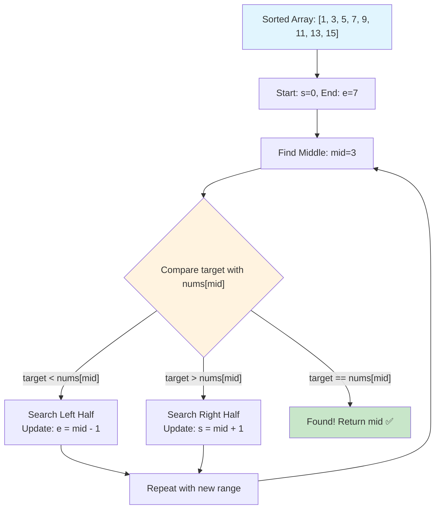

**Binary Search Magic:**
- Divide the search space in half with each step
- Works ONLY on sorted arrays
- Much faster than checking every element (linear search)

### 🎲 Why Binary Search is Fast

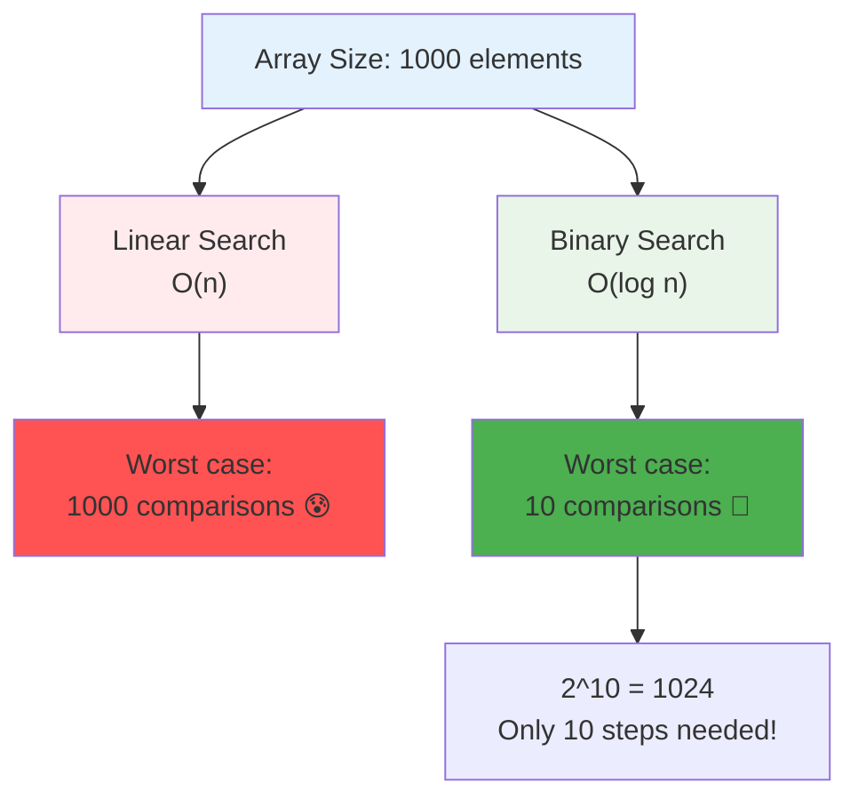

**The Power of Halving:**
- Array of 8 elements → 3 steps maximum
- Array of 1000 elements → 10 steps maximum
- Array of 1,000,000 elements → 20 steps maximum

### 🔢 Understanding Array Indices

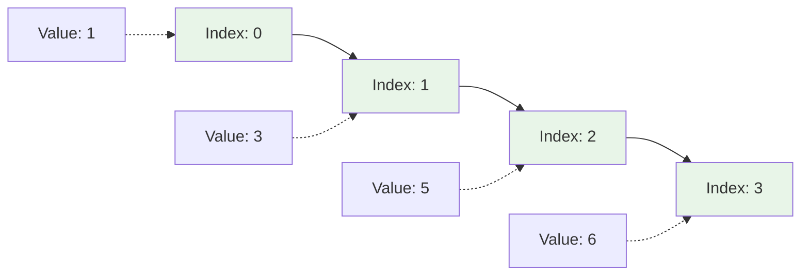

**Key concepts:**
- **Index** = Position in array (starts at 0)
- **Value** = Actual number stored at that position
- **Insertion position** = Where a new element should go to maintain sorted order

---

## 📚 Step-by-Step Examples

### 🟢 Example 1: Target Found in Array

**Input:** `nums = [1, 3, 5, 6]`, `target = 5`  
**Output:** `2`

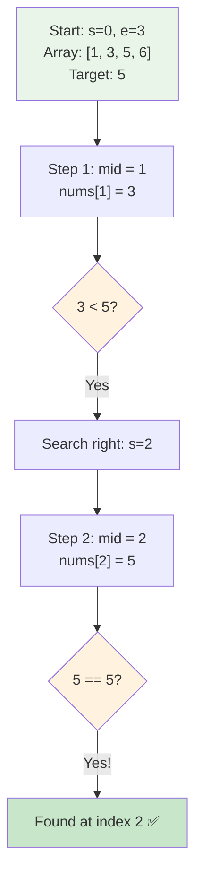

**Detailed walkthrough:**
1. **Initial state:** `s = 0, e = 3, mid = 1`
   - Check `nums[1] = 3`
   - `3 < 5`, so search right half
2. **Update:** `s = 2, e = 3, mid = 2`
   - Check `nums[2] = 5`
   - `5 == 5`, **target found!**
3. **Return:** Index `2`

### 🔵 Example 2: Insert at Beginning

**Input:** `nums = [1, 3, 5, 6]`, `target = 0`  
**Output:** `0`

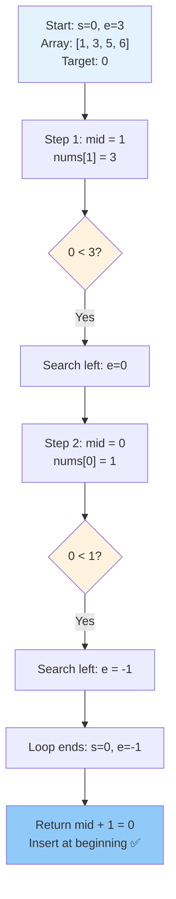

**Key insight:** When loop ends with `e < s`, the insertion position is `mid + 1`, which equals `s`.

### 🟡 Example 3: Insert in Middle

**Input:** `nums = [1, 3, 5, 6]`, `target = 2`  
**Output:** `1`

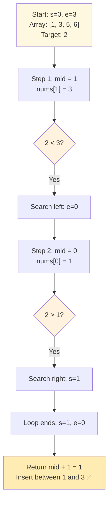

**Result:** Array becomes `[1, 2, 3, 5, 6]` after insertion at index 1.

### 🔴 Example 4: Insert at End

**Input:** `nums = [1, 3, 5, 6]`, `target = 7`  
**Output:** `4`

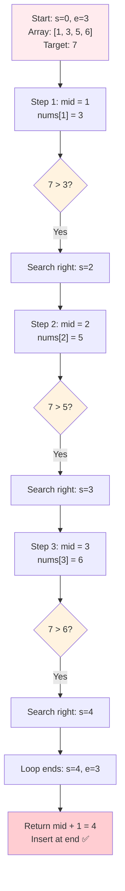

**Result:** Array becomes `[1, 3, 5, 6, 7]` after insertion at index 4.

---

## 🛠️ The Algorithm

### 🎯 Main Strategy: Divide and Conquer

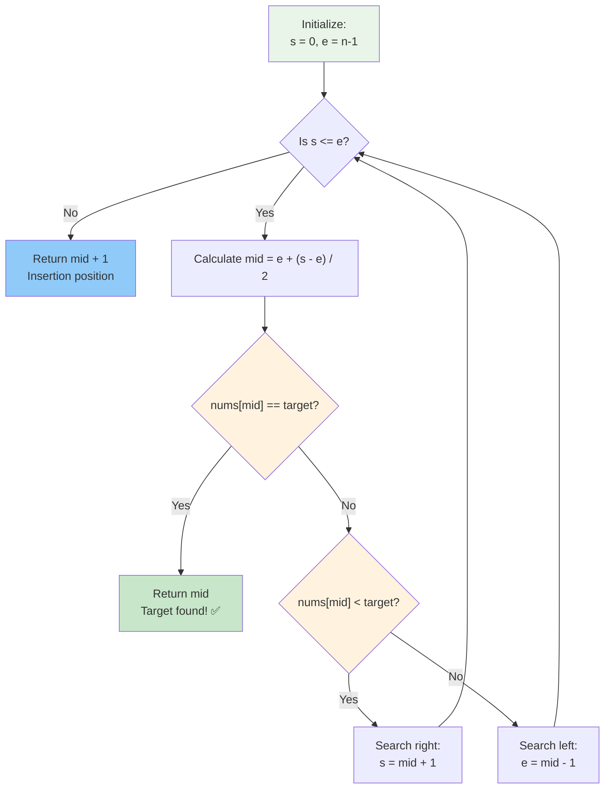

### 💻 The Code

```cpp
int searchInsert(vector<int>& nums, int target) {
    int s = 0;                    // Start pointer
    int e = nums.size() - 1;      // End pointer
    int mid = e + (s - e) / 2;    // Safe mid calculation
    
    while (s <= e) {
        if (nums[mid] == target) {
            return mid;           // ✅ Found!
        }
        else if (nums[mid] < target) {
            s = mid + 1;          // Search right half
        }
        else {
            e = mid - 1;          // Search left half
        }
        
        mid = e + (s - e) / 2;    // Recalculate mid
    }
    
    return mid + 1;               // Insertion position
}
```

### 🛡️ Safe Mid Calculation Explained

**Why use `mid = e + (s - e) / 2` instead of `mid = (s + e) / 2`?**

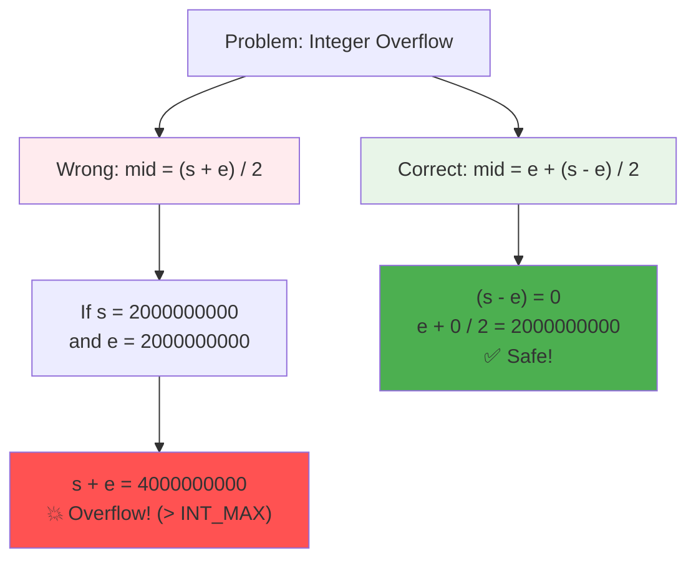

**The math:**
- `(s + e) / 2` can overflow when `s` and `e` are large
- `e + (s - e) / 2` mathematically equivalent but overflow-safe
- This prevents undefined behavior in edge cases

### 🔄 How the Loop Works

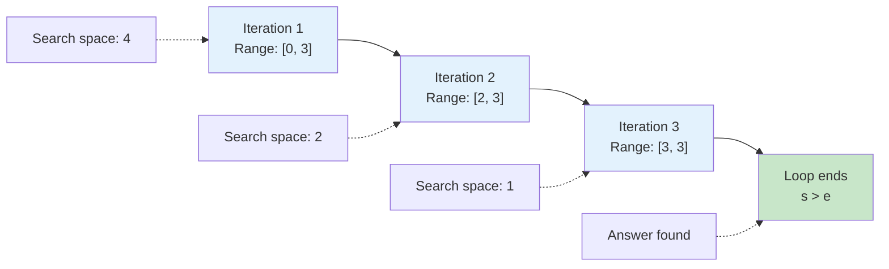

**Pattern:**
- Each iteration cuts search space in half
- Loop terminates when `s > e` (search space exhausted)
- Final position where `s` points is the insertion index

---

## 🧪 Test Cases & Edge Cases

### ✅ Normal Cases

| Array | Target | Output | Explanation |
|-------|--------|--------|-------------|
| `[1, 3, 5, 6]` | `5` | `2` | Target found at index 2 |
| `[1, 3, 5, 6]` | `2` | `1` | Insert between 1 and 3 |
| `[1, 3, 5, 6]` | `7` | `4` | Insert at end |
| `[1, 3, 5, 6]` | `0` | `0` | Insert at beginning |

### ⚠️ Edge Cases

| Array | Target | Output | Why |
|-------|--------|--------|-----|
| `[1]` | `1` | `0` | Single element, found |
| `[1]` | `0` | `0` | Insert before only element |
| `[1]` | `2` | `1` | Insert after only element |
| `[]` | `5` | `0` | Empty array (if allowed) |

### 🎯 Boundary Testing

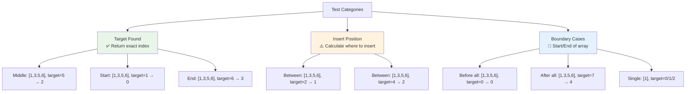

---

## 🎓 Key Concepts Mastery

### 🔍 Binary Search Fundamentals

**1. Search Space Management:**
```cpp
int s = 0;              // Left boundary
int e = nums.size() - 1; // Right boundary
// Valid search space: [s, e]
```

**2. Mid Point Calculation:**
```cpp
int mid = e + (s - e) / 2;
// Equivalent to: (s + e) / 2 but safer
```

**3. Search Space Reduction:**
```cpp
if (nums[mid] < target)
    s = mid + 1;  // Eliminate left half
else
    e = mid - 1;  // Eliminate right half
```

### ⚡ Insertion Position Logic

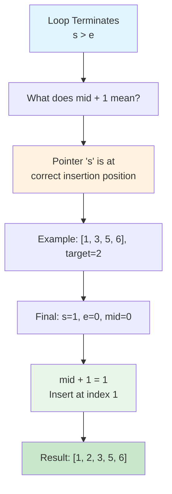

**Why `mid + 1` works:**
- When loop ends, `s` has moved past `e`
- `s` is pointing to where target should be inserted
- `mid + 1` equals `s` at termination
- This works because of how binary search narrows the range

### 🎯 Loop Invariants

**Understanding loop conditions:**

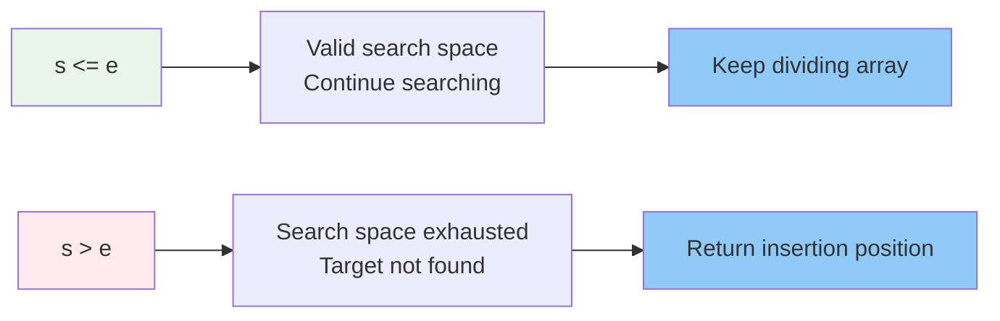

**Invariant properties:**
- Before loop: All elements to left of `s` are `< target`
- Before loop: All elements to right of `e` are `> target`
- After loop: `s` is the insertion position

---

## 📊 Complexity Analysis

### ⏰ Time Complexity: O(log n)

**Why logarithmic?**
- Each iteration cuts search space in half
- For array of size `n`, maximum iterations = ⌈log₂ n⌉

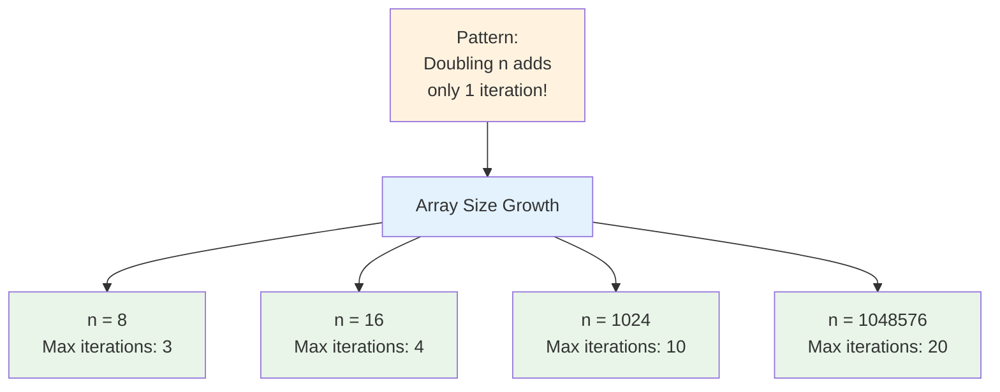

**Comparison with Linear Search:**

| Array Size | Linear Search | Binary Search |
|------------|---------------|---------------|
| 10 | 10 ops | 4 ops |
| 100 | 100 ops | 7 ops |
| 1,000 | 1,000 ops | 10 ops |
| 1,000,000 | 1,000,000 ops | 20 ops |

### 💾 Space Complexity: O(1)

**Why constant space?**
- Only use fixed variables: `s`, `e`, `mid`
- No recursion (no stack space)
- No additional data structures
- Memory usage independent of input size

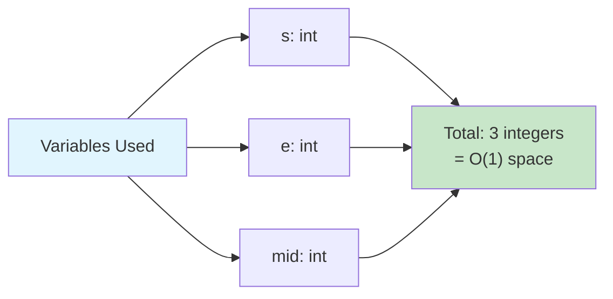

---

## 🚀 Practice Problems

Once you master this, try these similar problems:

| Problem | Difficulty | Key Concept |
|---------|------------|-------------|
| 🔍 Binary Search | Easy | Basic binary search |
| 🎯 First Bad Version | Easy | Binary search variant |
| 📊 Search in Rotated Sorted Array | Medium | Modified binary search |
| 🔢 Find First and Last Position | Medium | Binary search boundaries |
| 🎲 Search a 2D Matrix | Medium | 2D binary search |

---

## 💼 Interview Questions & Answers

### ❓ Question 1: Why must the array be sorted for binary search?

**Answer:**  
Binary search relies on the ordering property to eliminate half the search space at each step. When we compare `target` with `nums[mid]`:
- If `target > nums[mid]`, we **know** all elements to the left are smaller (sorted property)
- If `target < nums[mid]`, we **know** all elements to the right are larger (sorted property)

**Simple Explanation:**  
Imagine searching for a word in a dictionary:
- Open to middle page
- If your word comes alphabetically **after** the middle word, you know it's in the **right half**
- If dictionary wasn't sorted, you couldn't make this decision - you'd have to check every page!

**Example:**
```
Sorted: [1, 3, 5, 7, 9] target=7
- Check mid=5: 7>5, eliminate [1,3,5] ✅

Unsorted: [3, 1, 9, 5, 7] target=7  
- Check mid=9: 7<9, but eliminating left would lose the answer! ❌
```

---

### ❓ Question 2: Why use `mid = e + (s - e) / 2` instead of `mid = (s + e) / 2`?

**Answer:**  
To prevent integer overflow! When `s` and `e` are large numbers near `INT_MAX`, their sum can exceed the maximum integer value.

**Simple Explanation:**
```cpp
// Dangerous way:
int s = 2000000000, e = 2000000000;
int mid = (s + e) / 2;  
// s + e = 4000000000 → Overflow! 💥 (INT_MAX = 2147483647)

// Safe way:
int mid = e + (s - e) / 2;
// s - e = 0, e + 0/2 = 2000000000 ✅ No overflow!
```

**Math proof they're equivalent:**
```
e + (s - e) / 2 
= e + s/2 - e/2
= e/2 + s/2
= (s + e) / 2  ✅
```

It's like carrying water: instead of filling two buckets and combining them (overflow risk), pour half from one bucket to another!

---

### ❓ Question 3: How does the algorithm find the insertion position when target is not in the array?

**Answer:**  
When the loop terminates with `s > e`, the pointer `s` naturally ends up at the correct insertion position. This happens because:
- `s` always moves right when we need to search right (`target > nums[mid]`)
- `e` always moves left when we need to search left (`target < nums[mid]`)
- When they cross, `s` points to where `target` should be inserted

**Simple Explanation:**
```
Array: [1, 3, 5, 6], target=2

Step 1: s=0, e=3, mid=1 (value 3)
        2 < 3, search left → e=0

Step 2: s=0, e=0, mid=0 (value 1)  
        2 > 1, search right → s=1

Step 3: s=1, e=0 → Loop ends!
        s=1 is where 2 should go: [1, 2, 3, 5, 6]
```

Think of it like narrowing down a parking spot: you keep moving the boundaries until they pinpoint the exact empty space!

---

### ❓ Question 4: What happens with duplicate elements?

**Answer:**  
The problem states "distinct integers only", but if duplicates existed, this algorithm would return **any valid index** of the target value, not necessarily the first or last occurrence.

**Simple Explanation:**
```
Array: [1, 3, 5, 5, 5, 7, 9], target=5

Possible returns: index 2, 3, or 4 (all valid)
Which one? Depends on which mid hits it first!
```

To find **first occurrence**: Modify to continue searching left even after finding target
To find **last occurrence**: Modify to continue searching right even after finding target

---

### ❓ Question 5: Can you solve this without using the while loop?

**Answer:**  
Yes, using recursion:

```cpp
int searchInsertRecursive(vector<int>& nums, int target, int s, int e) {
    // Base case: search space exhausted
    if (s > e) {
        return s;  // Insertion position
    }
    
    int mid = e + (s - e) / 2;
    
    // Found target
    if (nums[mid] == target) {
        return mid;
    }
    // Search right half
    else if (nums[mid] < target) {
        return searchInsertRecursive(nums, target, mid + 1, e);
    }
    // Search left half
    else {
        return searchInsertRecursive(nums, target, s, mid - 1);
    }
}

// Call: searchInsertRecursive(nums, target, 0, nums.size() - 1)
```

**Pros:** More elegant, easier to understand  
**Cons:** Uses O(log n) space on call stack vs O(1) for iterative

---

### ❓ Question 6: What's the time complexity and why is it better than linear search?

**Answer:**  
**Time: O(log n)** - Exponentially faster than linear search O(n)

**Simple Explanation:**

```
Linear Search: Check every element until found
Array of 1000 elements:
- Best case: 1 comparison (first element)
- Worst case: 1000 comparisons (last element or not found)
- Average: 500 comparisons

Binary Search: Halve search space each time
Array of 1000 elements:
- Best case: 1 comparison (middle element)
- Worst case: 10 comparisons (log₂(1000) ≈ 10)
- Average: ~10 comparisons

Speedup: 100x faster on average! 🚀
```

**Growth comparison:**
| Array Size | Linear | Binary | Speedup |
|------------|--------|--------|---------|
| 100 | 100 | 7 | 14x |
| 10,000 | 10,000 | 14 | 714x |
| 1,000,000 | 1,000,000 | 20 | 50,000x |

---

### ❓ Question 7: Why does the loop condition use `s <= e` and not `s < e`?

**Answer:**  
We use `s <= e` to handle the case when the search space narrows down to a **single element**.

**Simple Explanation:**
```
Array: [5], target=5

If we use s < e:
- Initial: s=0, e=0
- Condition: 0 < 0? NO ❌
- Loop doesn't run, we miss the target!

If we use s <= e:
- Initial: s=0, e=0  
- Condition: 0 <= 0? YES ✅
- Check nums[0]=5, found!
```

**Another example:**
```
Array: [1, 3], target=3

With s < e:
- s=0, e=1, mid=0: 3>1, s=1
- s=1, e=1: 1<1? NO, loop ends
- Miss target at index 1! ❌

With s <= e:  
- s=0, e=1, mid=0: 3>1, s=1
- s=1, e=1: 1<=1? YES
- Check nums[1]=3, found! ✅
```

---

### ❓ Question 8: How do you handle an empty array?

**Answer:**  
With an empty array, `nums.size() = 0`, so `e = -1` initially.

```cpp
int s = 0;
int e = nums.size() - 1;  // e = 0 - 1 = -1

while (s <= e) {  // 0 <= -1? NO
    // Loop doesn't run
}

return mid + 1;  // Returns 0 (insert at position 0)
```

**Simple Explanation:**  
An empty array means any element should be inserted at position 0 (the beginning), which is exactly what we return!

**Note:** Some implementations may not allow empty arrays, so always clarify problem constraints with the interviewer.

---

### ❓ Question 9: Can binary search be used on an unsorted array?

**Answer:**  
**No, not directly.** Binary search requires sorted data to make elimination decisions.

**Options with unsorted array:**
1. **Sort first, then search:** O(n log n) + O(log n) = O(n log n)
2. **Linear search:** O(n) - simpler and faster than sorting + binary search
3. **Use hash table:** O(n) preprocessing, O(1) search

**Simple Explanation:**
```
Unsorted: [5, 1, 9, 3, 7], target=3

Binary search attempt:
- mid=9: 3<9, search left
- Eliminate [9, 3, 7]... but wait! 3 was there! ❌

The sorted property is ESSENTIAL for binary search to work.
```

**When to sort vs linear search:**
- **One search:** Use linear search O(n)
- **Multiple searches:** Sort once O(n log n), then binary search each O(log n)

---

### ❓ Question 10: What are common mistakes when implementing binary search?

**Answer:**  

**Mistake 1: Infinite loops**
```cpp
// Wrong: Never updates mid
while (s <= e) {
    mid = e + (s - e) / 2;
    if (nums[mid] < target) s = mid + 1;
    else e = mid - 1;
    // Forgot to recalculate mid! 💥
}

// Correct: Update mid each iteration
while (s <= e) {
    mid = e + (s - e) / 2;
    if (nums[mid] == target) return mid;
    else if (nums[mid] < target) s = mid + 1;
    else e = mid - 1;
    mid = e + (s - e) / 2;  // ✅
}
```

**Mistake 2: Off-by-one errors**
```cpp
// Wrong: Missing the single element case
while (s < e) {  // Should be s <= e

// Wrong: Not moving pointers correctly
s = mid;      // Should be mid + 1
e = mid;      // Should be mid - 1
```

**Mistake 3: Integer overflow**
```cpp
// Wrong: Can overflow
mid = (s + e) / 2;

// Correct: Overflow-safe
mid = e + (s - e) / 2;
```

**Mistake 4: Wrong return value**
```cpp
// When target not found:
return mid;      // Wrong! ❌
return s;        // Correct! ✅
return mid + 1;  // Also correct! ✅ (equals s)
```

---

## 🎯 Quick Reference

### 🔑 Essential Code Patterns

```cpp
// Standard binary search template
int s = 0, e = nums.size() - 1;
while (s <= e) {
    int mid = e + (s - e) / 2;  // Overflow-safe
    
    if (nums[mid] == target) return mid;
    else if (nums[mid] < target) s = mid + 1;
    else e = mid - 1;
    
    mid = e + (s - e) / 2;
}
return s;  // Insertion position

// Recursive version
int binarySearch(vector<int>& nums, int target, int s, int e) {
    if (s > e) return s;
    
    int mid = e + (s - e) / 2;
    if (nums[mid] == target) return mid;
    if (nums[mid] < target) return binarySearch(nums, target, mid+1, e);
    return binarySearch(nums, target, s, mid-1);
}
```

### 📝 Important Formulas

```cpp
// Mid calculation (overflow-safe)
mid = e + (s - e) / 2
// Equivalent to: (s + e) / 2

// Search space size
size = e - s + 1

// Maximum iterations for array of size n
max_iterations = ceil(log₂(n))
```

### 🧠 Mental Model

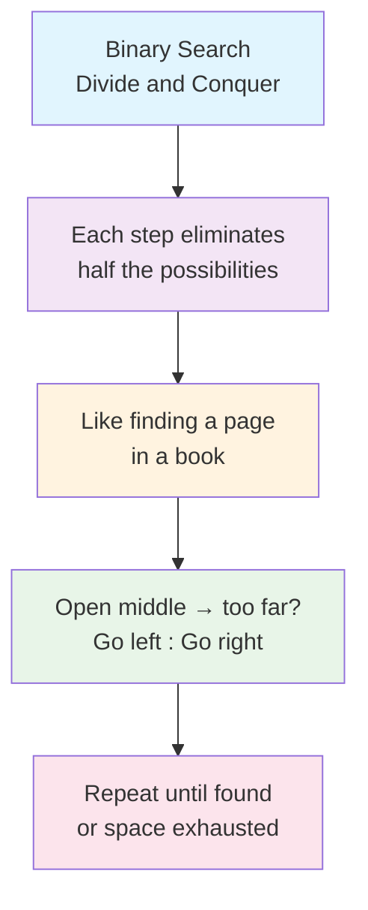

---

## 🏆 Mastery Checklist

- [ ] ✅ Understand why binary search requires sorted arrays
- [ ] ✅ Master the search space reduction logic
- [ ] ✅ Know how to calculate mid point safely (overflow prevention)
- [ ] ✅ Understand when loop terminates and what pointers mean
- [ ] ✅ Can explain insertion position logic clearly
- [ ] ✅ Recognize binary search achieves O(log n) time complexity
- [ ] ✅ Use O(1) space with iterative implementation
- [ ] ✅ Handle all edge cases (empty array, single element, boundaries)
- [ ] ✅ Implement both iterative and recursive versions
- [ ] ✅ Answer common interview questions confidently
- [ ] ✅ Debug common mistakes (infinite loops, off-by-one errors)
- [ ] ✅ Apply binary search pattern to related problems

---

## 💡 Pro Tips

1. **🎯 Master the Template**: Binary search has a standard template - memorize it!
2. **🛡️ Always Prevent Overflow**: Use `e + (s - e) / 2` not `(s + e) / 2`
3. **🔍 Visualize the Process**: Draw the array and track pointers step-by-step
4. **🧪 Test Edge Cases First**: Single element, empty array, insert at boundaries
5. **📊 Understand Invariants**: Before each iteration, know what `s` and `e` represent
6. **🎓 Practice Variations**: Search in rotated arrays, find first/last occurrence
7. **💬 Explain Out Loud**: In interviews, talk through your logic as you code
8. **⚡ Recognize the Pattern**: Many problems are "hidden" binary searches
9. **🔢 Remember Log Base**: log₂(1000) ≈ 10, log₂(1000000) ≈ 20
10. **🚀 Think Efficiency**: If problem mentions "sorted" and "O(log n)", use binary search!

---

## 🌟 Advanced Insights

### 🎯 When to Use Binary Search

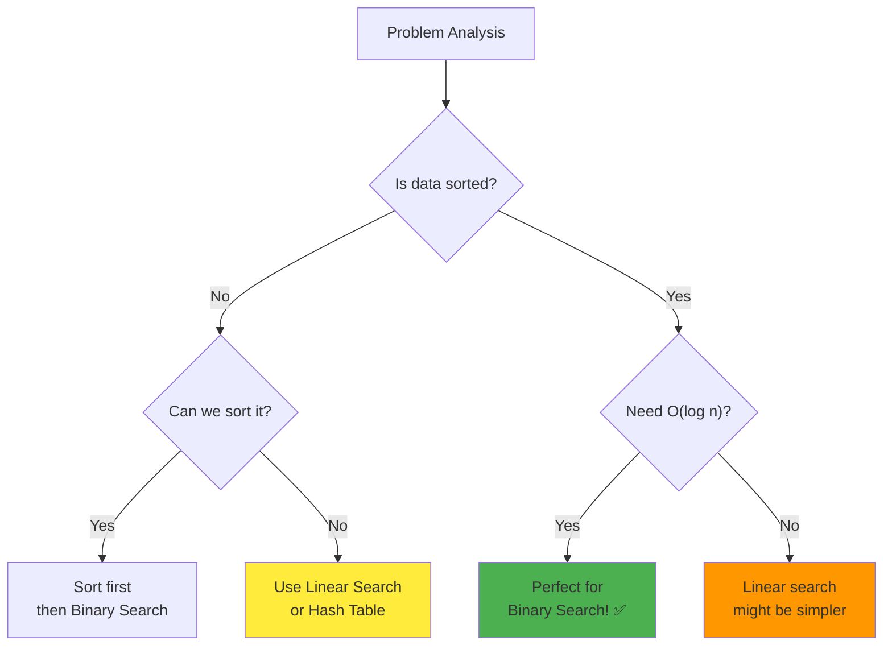

### 🔧 Binary Search Variants

**1. Find First Occurrence:**
```cpp
// Continue searching left even after finding target
if (nums[mid] >= target) e = mid - 1;
else s = mid + 1;
return s;
```

**2. Find Last Occurrence:**
```cpp
// Continue searching right even after finding target
if (nums[mid] <= target) s = mid + 1;
else e = mid - 1;
return e;
```

**3. Search in Rotated Array:**
```cpp
// Determine which half is sorted, then decide direction
if (nums[s] <= nums[mid]) {
    // Left half is sorted
    if (target >= nums[s] && target < nums[mid])
        e = mid - 1;
    else
        s = mid + 1;
} else {
    // Right half is sorted
    // Similar logic
}
```

---

## 🎓 Learning Path

**Level 1: Foundation** (You are here!)
- ✅ Search Insert Position
- 🔍 Binary Search (LC 704)
- 🎯 Guess Number Higher or Lower (LC 374)

**Level 2: Variations**
- 📊 First Bad Version (LC 278)
- 🔢 Valid Perfect Square (LC 367)
- 🎲 Search in Rotated Sorted Array (LC 33)

**Level 3: Advanced**
- 📈 Find Peak Element (LC 162)
- 🔍 Search a 2D Matrix II (LC 240)
- 🎯 Median of Two Sorted Arrays (LC 4)

---

**🎉 Congratulations! You now have complete mastery of binary search, search insert position logic, and can confidently solve related problems and ace interviews. Keep practicing and happy coding!** 🚀