# 🔍 Search Insert Position - Complete Binary Search Guide

> **Master binary search and array insertion techniques step by step!**

---

## 📖 What You'll Learn

By the end of this guide, you'll master:
- 🎯 **Binary Search Algorithm** - Efficiently search sorted arrays in O(log n) time
- 📍 **Insertion Position Logic** - Find where elements should be placed in sorted order
- 🔢 **Array Manipulation** - Work with indices and maintain sorted properties
- ⚡ **Optimization Techniques** - Avoid integer overflow and edge case handling

---

## 🎯 The Problem

### 📋 Problem Statement

**Given**: A sorted array of distinct integers `nums` and a target value `target`  
**Task**: Return the index if target is found, otherwise return the index where it would be inserted  
**Constraint**: Must achieve O(log n) runtime complexity

**Important Rule**: The array is sorted in ascending order with distinct elements!

### 🌟 Real-World Example

Think of it like finding a book's position in a library:
- **Target found**: "Harry Potter" is at shelf position 15
- **Insert at beginning**: "Alice in Wonderland" should go at position 0
- **Insert in middle**: "Moby Dick" should go at position 8
- **Insert at end**: "Zorro" should go at the last position

---

## 🔍 Understanding Binary Search

### 🏗️ What Makes Binary Search Work?


**Key Properties:**
- Array must be sorted (ascending or descending)
- Each comparison eliminates half the remaining elements
- Maximum comparisons needed: ⌈log₂(n)⌉

### 🎲 Binary Search Process Visualization

```mermaid
flowchart TD
    A[Start: left=0, right=n-1] --> B[Calculate mid = left + (right-left)/2]
    B --> C{nums[mid] == target?}
    C -->|Yes| D[Return mid ✅]
    C -->|No| E{nums[mid] < target?}
    E -->|Yes| F[Search Right Half<br/>left = mid + 1]
    E -->|No| G[Search Left Half<br/>right = mid - 1]
    F --> H{left <= right?}
    G --> H
    H -->|Yes| B
    H -->|No| I[Return left<br/>Insertion Position]
    
    style A fill:#e8f5e8
    style D fill:#c8e6c9
    style I fill:#fff3e0
```

---

## 📚 Step-by-Step Examples

### 🟢 Example 1: Target Found

**Input:** `nums = [1, 3, 5, 6]`, `target = 5`  
**Output:** `2`

```mermaid
graph TD
    A[Array: [1, 3, 5, 6]<br/>Target: 5] --> B[left=0, right=3<br/>mid=1, nums[1]=3]
    B --> C[3 < 5, search right<br/>left=2, right=3]
    C --> D[mid=2, nums[2]=5<br/>Found target! ✅]
    D --> E[Return index 2]
    
    style A fill:#e8f5e8
    style D fill:#4caf50
    style E fill:#c8e6c9
```

**Step-by-step breakdown:**
1. **Start:** `left = 0, right = 3`
2. **Step 1:** `mid = 0 + (3-0)/2 = 1`, `nums[1] = 3`
   - `3 < 5`, so search right half: `left = 2`
3. **Step 2:** `mid = 2 + (3-2)/2 = 2`, `nums[2] = 5`
   - `5 == 5`, target found at index 2!

### 🔴 Example 2: Insert at Beginning

**Input:** `nums = [1, 3, 5, 6]`, `target = 0`  
**Output:** `0`

```mermaid
graph TD
    A[Array: [1, 3, 5, 6]<br/>Target: 0] --> B[left=0, right=3<br/>mid=1, nums[1]=3]
    B --> C[0 < 3, search left<br/>left=0, right=0]
    C --> D[mid=0, nums[0]=1<br/>0 < 1, search left]
    D --> E[left=0, right=-1<br/>left > right, exit loop]
    E --> F[Return left=0<br/>Insert at beginning]
    
    style A fill:#ffebee
    style F fill:#ffcdd2
```

### 🟡 Example 3: Insert in Middle

**Input:** `nums = [1, 3, 5, 6]`, `target = 2`  
**Output:** `1`

```mermaid
graph TD
    A[Array: [1, 3, 5, 6]<br/>Target: 2] --> B[left=0, right=3<br/>mid=1, nums[1]=3]
    B --> C[2 < 3, search left<br/>left=0, right=0]
    C --> D[mid=0, nums[0]=1<br/>2 > 1, search right]
    D --> E[left=1, right=0<br/>left > right, exit loop]
    E --> F[Return left=1<br/>Insert between 1 and 3]
    
    style A fill:#fff8e1
    style F fill:#ffecb3
```

### 🟠 Example 4: Insert at End

**Input:** `nums = [1, 3, 5, 6]`, `target = 7`  
**Output:** `4`

```mermaid
graph TD
    A[Array: [1, 3, 5, 6]<br/>Target: 7] --> B[left=0, right=3<br/>mid=1, nums[1]=3]
    B --> C[7 > 3, search right<br/>left=2, right=3]
    C --> D[mid=2, nums[2]=5<br/>7 > 5, search right]
    D --> E[left=3, right=3<br/>mid=3, nums[3]=6]
    E --> F[7 > 6, search right<br/>left=4, right=3]
    F --> G[left > right, exit loop<br/>Return left=4]
    
    style A fill:#e3f2fd
    style G fill:#bbdefb
```

---

## 🛠️ The Algorithm

### 🎯 Main Strategy: Divide and Conquer

```mermaid
flowchart TD
    A[Initialize left=0, right=n-1] --> B{left <= right?}
    B -->|No| C[Return left<br/>Insertion Position]
    B -->|Yes| D[Calculate mid safely<br/>mid = left + (right-left)/2]
    D --> E{nums[mid] == target?}
    E -->|Yes| F[Return mid<br/>Target Found ✅]
    E -->|No| G{nums[mid] < target?}
    G -->|Yes| H[Search Right Half<br/>left = mid + 1]
    G -->|No| I[Search Left Half<br/>right = mid - 1]
    H --> B
    I --> B
    
    style A fill:#e8f5e8
    style C fill:#fff3e0
    style F fill:#c8e6c9
    style D fill:#e1f5fe
```

### 💻 The Core Algorithm

```cpp
int searchInsert(vector<int>& nums, int target) {
    int left = 0;
    int right = nums.size() - 1;
    
    while (left <= right) {
        // 🛡️ SAFE CALCULATION: Prevents integer overflow
        int mid = left + (right - left) / 2;
        
        if (nums[mid] == target) {
            return mid;  // 🎯 Target found!
        }
        else if (nums[mid] < target) {
            left = mid + 1;  // 🔍 Search right half
        }
        else {
            right = mid - 1;  // 🔍 Search left half
        }
    }
    
    return left;  // 📍 Insertion position
}
```

### 🛡️ Integer Overflow Prevention

**Why use `left + (right - left) / 2` instead of `(left + right) / 2`?**

```mermaid
graph TD
    A[Problem: (left + right) / 2] --> B[When left + right > INT_MAX<br/>Integer overflow occurs!]
    B --> C[Solution: left + (right - left) / 2]
    C --> D[Always safe: (right - left) ≤ n<br/>No overflow possible]
    
    style A fill:#ffebee
    style B fill:#ff5252
    style C fill:#e8f5e8
    style D fill:#4caf50
```

**The Math:**
- `(left + right) / 2` can overflow when `left + right > INT_MAX`
- `left + (right - left) / 2` is mathematically equivalent but safe
- `(right - left)` is always ≤ array size, preventing overflow

---

## 🧪 Test Cases & Edge Cases

### ✅ Normal Cases

| Input Array | Target | Output | Explanation |
|-------------|--------|--------|-------------|
| `[1,3,5,6]` | `5` | `2` | Target found at index 2 |
| `[1,3,5,6]` | `2` | `1` | Insert between 1 and 3 |
| `[1,3,5,6]` | `7` | `4` | Insert at end |
| `[1,3,5,6]` | `0` | `0` | Insert at beginning |

### ⚠️ Edge Cases

```mermaid
graph TD
    A[Edge Cases] --> B[Single Element Array<br/>nums = [1]]
    A --> C[Target at Boundaries<br/>First or Last Position]
    A --> D[Large Arrays<br/>Performance Testing]
    
    B --> B1[target = 1 → return 0<br/>target = 0 → return 0<br/>target = 2 → return 1]
    C --> C1[First: nums[0] == target<br/>Last: nums[n-1] == target]
    D --> D1[Array size: 100,000+<br/>Still O(log n) performance]
    
    style A fill:#e3f2fd
    style B fill:#fff3e0
    style C fill:#e8f5e8
    style D fill:#f3e5f5
```

### 🎯 Comprehensive Test Matrix

| Test Case | Array | Target | Expected | Scenario |
|-----------|-------|--------|----------|----------|
| 1 | `[1,3,5,6]` | `5` | `2` | Found in middle |
| 2 | `[1,3,5,6]` | `2` | `1` | Insert in middle |
| 3 | `[1,3,5,6]` | `7` | `4` | Insert at end |
| 4 | `[1,3,5,6]` | `0` | `0` | Insert at beginning |
| 5 | `[1]` | `1` | `0` | Single element found |
| 6 | `[1]` | `0` | `0` | Single element insert before |
| 7 | `[1]` | `2` | `1` | Single element insert after |
| 8 | `[1,3,5,6]` | `1` | `0` | Found at first position |
| 9 | `[1,3,5,6]` | `6` | `3` | Found at last position |

---

## 🎓 Key Concepts Mastery

### 🔢 Binary Search Properties


### 🎯 Algorithm Invariants

**Loop Invariant**: At the start of each iteration:
- If target exists in the array, it lies within `[left, right]`
- All elements in `[0, left)` are less than target
- All elements in `(right, nums.size())` are greater than target

```mermaid
graph LR
    A[Elements < target] --> B[Search Range<br/>[left, right]]
    B --> C[Elements > target]
    
    style A fill:#ffebee
    style B fill:#e8f5e8
    style C fill:#e3f2fd
```

### 🚀 Problem-Solving Framework


---

## 📊 Complexity Analysis

### ⏰ Time Complexity: O(log n)

**Why logarithmic?**

```mermaid
graph TD
    A[Array Size: n] --> B[Each iteration eliminates<br/>half the elements]
    B --> C[Maximum iterations:<br/>⌈log₂(n)⌉]
    C --> D[Examples:<br/>n=8 → 3 iterations<br/>n=1000 → 10 iterations<br/>n=1,000,000 → 20 iterations]
    
    style A fill:#e3f2fd
    style B fill:#fff3e0
    style C fill:#e8f5e8
    style D fill:#f3e5f5
```

**Comparison with Linear Search:**

| Array Size | Linear Search | Binary Search | Improvement |
|------------|---------------|---------------|-------------|
| 10 | 10 operations | 4 operations | 2.5x faster |
| 100 | 100 operations | 7 operations | 14x faster |
| 1,000 | 1,000 operations | 10 operations | 100x faster |
| 1,000,000 | 1,000,000 operations | 20 operations | 50,000x faster |

### 💾 Space Complexity: O(1)

**Why constant space?**
- Only use a few variables: `left`, `right`, `mid`
- No additional data structures needed
- Memory usage independent of input size

```mermaid
graph LR
    A[Input Array<br/>Size: n] --> B[Algorithm Variables<br/>left, right, mid]
    B --> C[Space Used: O(1)<br/>Constant regardless of n]
    
    style A fill:#e3f2fd
    style B fill:#e8f5e8
    style C fill:#c8e6c9
```

---

## 🚀 Advanced Concepts

### 🔄 Alternative Approaches Comparison

```mermaid
graph TD
    A[Search Insert Position] --> B[Linear Search<br/>O(n) time]
    A --> C[Binary Search<br/>O(log n) time]
    A --> D[Built-in Functions<br/>lower_bound()]
    
    B --> B1[Simple but slow<br/>Good for small arrays]
    C --> C1[Optimal for sorted arrays<br/>Scalable solution]
    D --> D1[STL implementation<br/>Highly optimized]
    
    style A fill:#e1f5fe
    style B fill:#ffebee
    style C fill:#e8f5e8
    style D fill:#f3e5f5
```

### 🎯 Binary Search Variations

| Variation | Purpose | Key Difference |
|-----------|---------|----------------|
| **Standard Binary Search** | Find exact match | Returns -1 if not found |
| **Search Insert Position** | Find insertion point | Returns position even if not found |
| **Lower Bound** | First occurrence ≥ target | Handles duplicates |
| **Upper Bound** | First occurrence > target | Handles duplicates |

### 🧠 Mental Model for Insertion Logic

```mermaid
graph TD
    A[When loop ends<br/>left > right] --> B[left points to insertion position]
    B --> C[Why? All elements before left<br/>are < target]
    C --> D[All elements after left<br/>are ≥ target]
    D --> E[Perfect insertion spot!]
    
    style A fill:#fff3e0
    style B fill:#e8f5e8
    style E fill:#c8e6c9
```



---

## 🌟 Real-World Applications

### 💼 Practical Use Cases


### 🏢 Industry Examples

1. **Database Indexing**: Finding records in sorted database indices
2. **File Systems**: Locating files in directory structures
3. **Memory Management**: Finding free memory blocks
4. **Scheduling**: Inserting tasks in priority queues
5. **Version Control**: Finding commits in sorted history

---

## 🧪 Extended Testing Framework

### 🎯 Performance Benchmarking

```mermaid
graph TD
    A[Performance Tests] --> B[Small Arrays<br/>n < 100]
    A --> C[Medium Arrays<br/>100 ≤ n < 10,000]
    A --> D[Large Arrays<br/>n ≥ 10,000]
    
    B --> B1[Verify correctness<br/>All edge cases]
    C --> C1[Measure time<br/>Should be < 1ms]
    D --> D1[Stress test<br/>Should be < 10ms]
    
    style A fill:#e1f5fe
    style B fill:#e8f5e8
    style C fill:#fff3e0
    style D fill:#ffebee
```



### 🔍 Test Categories

| Category | Test Cases | Purpose |
|----------|------------|---------|
| **Correctness** | Basic functionality | Verify algorithm works |
| **Edge Cases** | Boundary conditions | Handle special inputs |
| **Performance** | Large datasets | Ensure O(log n) performance |
| **Stress** | Random inputs | Robustness testing |

---

## 🎯 Quick Reference

### 🔑 Essential Code Patterns

```cpp
// Standard binary search template
int left = 0, right = nums.size() - 1;
while (left <= right) {
    int mid = left + (right - left) / 2;  // Overflow-safe
    if (nums[mid] == target) return mid;
    else if (nums[mid] < target) left = mid + 1;
    else right = mid - 1;
}
return left;  // Insertion position

// Alternative: Using STL
auto it = lower_bound(nums.begin(), nums.end(), target);
return it - nums.begin();
```

### 📝 Important Reminders


### 🧠 Mental Checklist

- [ ] ✅ Verify array is sorted
- [ ] ✅ Use safe mid calculation: `left + (right - left) / 2`
- [ ] ✅ Handle target found case
- [ ] ✅ Handle target not found case (insertion position)
- [ ] ✅ Test single element arrays
- [ ] ✅ Test insertion at boundaries (start/end)
- [ ] ✅ Verify O(log n) time complexity
- [ ] ✅ Confirm O(1) space complexity

---

## 🏆 Mastery Checklist

- [ ] ✅ Understand binary search algorithm completely
- [ ] ✅ Know why array must be sorted
- [ ] ✅ Master insertion position logic
- [ ] ✅ Handle integer overflow in mid calculation
- [ ] ✅ Implement iterative and recursive versions
- [ ] ✅ Test all edge cases thoroughly
- [ ] ✅ Achieve O(log n) time and O(1) space
- [ ] ✅ Apply to real-world scenarios

---

## 💡 Pro Tips

1. **🛡️ Safety First**: Always use `left + (right - left) / 2` to avoid overflow
2. **🎯 Visualize the Process**: Draw the array and track left/right pointers
3. **🧪 Test Systematically**: Cover found, not found, and boundary cases
4. **📚 Learn the Pattern**: Binary search appears in many algorithm problems
5. **🔍 Debug Carefully**: Print left, right, mid values when debugging
6. **⚡ Optimize Later**: Get correctness first, then optimize
7. **🎨 Practice Variations**: Try lower_bound, upper_bound, peak finding

---

## 🔗 Related Problems

Once you master this, try these similar problems:

| Problem | Difficulty | Key Concept | LeetCode # |
|---------|------------|-------------|------------|
| 🔍 Binary Search | Easy | Basic binary search | 704 |
| 🎯 Find First and Last Position | Medium | Range searching | 34 |
| 🏔️ Find Peak Element | Medium | Modified binary search | 162 |
| 🔄 Search in Rotated Array | Medium | Binary search variations | 33 |
| 📊 Find Minimum in Rotated Array | Medium | Binary search on rotated | 153 |

---

**🎉 Congratulations! You now have a complete mastery of binary search and insertion position finding. This fundamental algorithm will serve as a building block for many advanced data structure and algorithm problems. Keep practicing and happy coding!**
