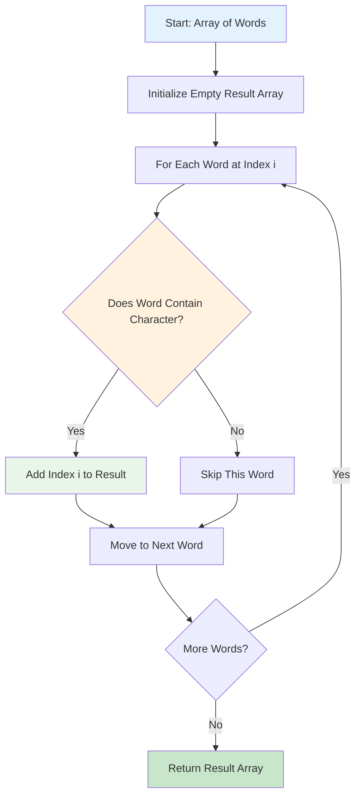
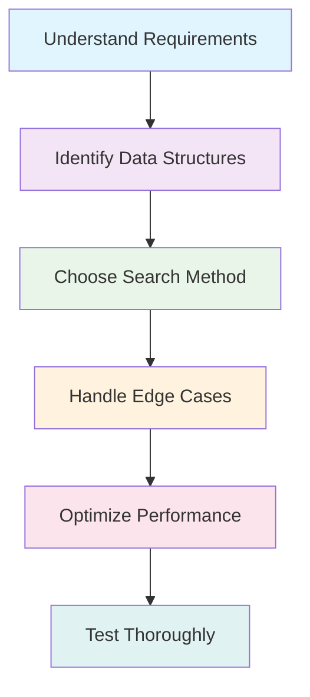
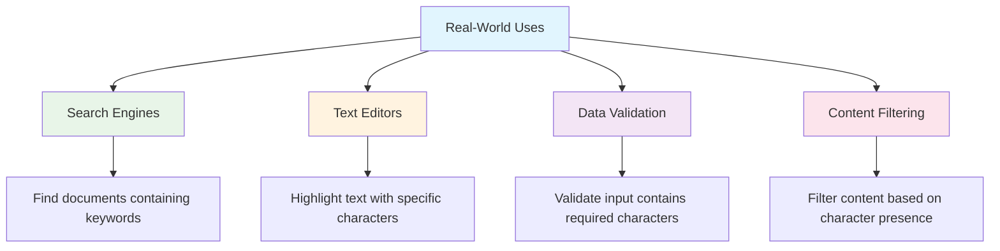
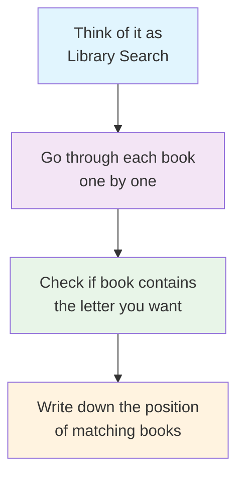

# Day 41: 🔍 Find Words Containing Character - Complete Beginner's Guide

> **Master string searching and array indexing step by step!**

---

## 📖 What You'll Learn

By the end of this guide, you'll master:
- 🔤 **String Search Techniques** - How to efficiently find characters within strings
- 📊 **Array Indexing** - Working with indices and result collection
- 🎯 **Linear Search Patterns** - Understanding O(n) search algorithms
- 🧮 **Built-in String Methods** - Leveraging string::find() for optimal performance

---

## 🎯 The Problem

### 📋 Problem Statement

**Given**: A 0-indexed array of strings `words` and a character `x`  
**Task**: Return an array of indices representing the words that contain the character `x`  
**Note**: The returned array may be in any order

### 🌟 Real-World Example

Think of it like searching through a library catalog:
- **Words**: `["apple", "banana", "grape", "orange"]`
- **Character**: `'a'`
- **Result**: `[0, 1, 2, 3]` (all books contain the letter 'a')

Or like filtering email addresses:
- **Words**: `["john@gmail.com", "mary@yahoo.com", "bob@hotmail.com"]`
- **Character**: `'@'`
- **Result**: `[0, 1, 2]` (all are valid email addresses)

---

## 🔍 Understanding the Algorithm

### 🏗️ Core Concept: Linear Search with Indexing



### 🎲 String Search Magic

Here's how we search for a character in a string:

```mermaid
flowchart TD
    A[Word: "hello"] --> B[Check: contains 'l'?]
    B --> C[string.find('l')]
    C --> D{Result == string::npos?}
    D -->|No| E[Character Found! ✅<br/>Return true]
    D -->|Yes| F[Character Not Found ❌<br/>Return false]
    
    style A fill:#e3f2fd
    style E fill:#c8e6c9
    style F fill:#ffcdd2
```

**Key Operations:**
- `string.find(char)` → Returns position if found, `string::npos` if not found
- `string::npos` → Special constant meaning "not found"

---

## 📚 Step-by-Step Examples

### 🟢 Example 1: Basic Character Search

**Input:** `words = ["leet", "code"]`, `x = 'e'`  
**Output:** `[0, 1]`

```mermaid
graph TD
    A[Start: words = ["leet", "code"], x = 'e'] --> B[Index 0: "leet"]
    B --> C[Check: "leet".find('e')]
    C --> D[Found at position 1 ✅]
    D --> E[Add 0 to result: [0]]
    E --> F[Index 1: "code"]
    F --> G[Check: "code".find('e')]
    G --> H[Found at position 3 ✅]
    H --> I[Add 1 to result: [0, 1]]
    I --> J[Final Result: [0, 1]]
    
    style A fill:#e8f5e8
    style J fill:#c8e6c9
    style D fill:#fff3e0
    style H fill:#fff3e0
```

**Step-by-step breakdown:**
1. **Initialize:** `result = []`, `i = 0`
2. **Check word[0]:** "leet" contains 'e' → Add index 0 → `result = [0]`
3. **Check word[1]:** "code" contains 'e' → Add index 1 → `result = [0, 1]`
4. **Done:** Return `[0, 1]`

### 🔴 Example 2: Partial Matches

**Input:** `words = ["abc", "bcd", "aaaa", "cbc"]`, `x = 'a'`  
**Output:** `[0, 2]`

```mermaid
graph TD
    A[Start: Check each word for 'a'] --> B[Index 0: "abc" → Contains 'a' ✅]
    B --> C[Index 1: "bcd" → No 'a' ❌]
    C --> D[Index 2: "aaaa" → Contains 'a' ✅]
    D --> E[Index 3: "cbc" → No 'a' ❌]
    E --> F[Result: [0, 2]]
    
    style A fill:#e1f5fe
    style B fill:#c8e6c9
    style C fill:#ffcdd2
    style D fill:#c8e6c9
    style E fill:#ffcdd2
    style F fill:#4caf50
```

### 🟡 Example 3: No Matches Found

**Input:** `words = ["abc", "bcd", "aaaa", "cbc"]`, `x = 'z'`  
**Output:** `[]`

```mermaid
graph TD
    A[Start: Search for 'z'] --> B[Check all words]
    B --> C["abc" → No 'z' ❌]
    B --> D["bcd" → No 'z' ❌]
    B --> E["aaaa" → No 'z' ❌]
    B --> F["cbc" → No 'z' ❌]
    C --> G[Result: Empty Array []]
    D --> G
    E --> G
    F --> G
    
    style A fill:#fff8e1
    style G fill:#ffecb3
    style C fill:#ffcdd2
    style D fill:#ffcdd2
    style E fill:#ffcdd2
    style F fill:#ffcdd2
```

---

## 🛠️ The Algorithm Deep Dive

### 🎯 Main Strategy: Sequential Search with Index Tracking

```mermaid
flowchart TD
    A[Initialize result = []] --> B[Set index i = 0]
    B --> C{i < words.length?}
    C -->|Yes| D[Get word at index i]
    D --> E{word.find(x) != npos?}
    E -->|Yes| F[Add i to result]
    E -->|No| G[Skip this word]
    F --> H[Increment i]
    G --> H
    H --> C
    C -->|No| I[Return result array]
    
    style A fill:#e8f5e8
    style I fill:#c8e6c9
    style E fill:#fff3e0
```

### 💻 The Core Algorithm

```cpp
vector<int> findWordsContaining(vector<string>& words, char x) {
    vector<int> result;  // Store matching indices
    
    for (int i = 0; i < words.size(); i++) {
        // 🔍 SEARCH: Check if word contains character
        if (words[i].find(x) != string::npos) {
            result.push_back(i);  // 📝 COLLECT: Add index
        }
    }
    
    return result;
}
```

### 🔧 Alternative Approaches Comparison

```mermaid
graph TD
    A[String Search Methods] --> B[Method 1: string::find()]
    A --> C[Method 2: Manual Character Loop]
    A --> D[Method 3: STL Algorithm]
    
    B --> B1[✅ Fast & Optimized<br/>❌ Less Educational]
    C --> C1[✅ Educational<br/>❌ Slower Performance]
    D --> D1[✅ Functional Style<br/>❌ More Complex]
    
    style A fill:#e1f5fe
    style B fill:#e8f5e8
    style C fill:#fff3e0
    style D fill:#f3e5f5
```

---

## 🧪 Test Cases & Edge Cases

### ✅ Normal Cases

| Input Words | Character | Output | Explanation |
|-------------|-----------|--------|-------------|
| `["leet", "code"]` | `'e'` | `[0, 1]` | Both words contain 'e' |
| `["abc", "bcd", "aaaa"]` | `'a'` | `[0, 2]` | First and third words contain 'a' |
| `["hello", "world"]` | `'l'` | `[0, 1]` | Both words contain 'l' |

### ⚠️ Edge Cases

| Input Words | Character | Output | Why |
|-------------|-----------|--------|-----|
| `[]` | `'a'` | `[]` | Empty input array |
| `["abc"]` | `'z'` | `[]` | Character not found |
| `["a", "b", "a"]` | `'a'` | `[0, 2]` | Multiple occurrences |
| `[""]` | `'a'` | `[]` | Empty string in array |

### 🎯 Constraint Testing

```mermaid
graph TD
    A[Test Categories] --> B[Size Constraints<br/>✅ 1 ≤ words.length ≤ 50]
    A --> C[Word Length<br/>✅ 1 ≤ words[i].length ≤ 50]
    A --> D[Character Type<br/>✅ Lowercase English letters]
    
    B --> B1[Minimum: 1 word]
    B --> B2[Maximum: 50 words]
    
    C --> C1[Minimum: 1 character]
    C --> C2[Maximum: 50 characters]
    
    D --> D1[Range: 'a' to 'z']
    
    style A fill:#e3f2fd
    style B fill:#e8f5e8
    style C fill:#fff3e0
    style D fill:#f3e5f5
```

---

## 🎓 Key Concepts Mastery

### 🔤 String Search Techniques

**1. Built-in Find Method:**
```cpp
size_t pos = word.find(character);
if (pos != string::npos) {
    // Character found at position 'pos'
}
```

**2. Manual Character Iteration:**
```cpp
bool found = false;
for (char c : word) {
    if (c == target) {
        found = true;
        break;
    }
}
```

**3. STL Algorithm Approach:**
```cpp
bool found = std::find(word.begin(), word.end(), target) != word.end();
```

### 📊 Index Management Patterns

```mermaid
graph LR
    A[Index Tracking] --> B[Sequential Counter]
    A --> C[Range-based with Manual Index]
    A --> D[Iterator-based Indexing]
    
    B --> B1[for(int i = 0; i < size; i++)]
    C --> C1[int idx = 0; for(auto& item : container)]
    D --> D1[distance(begin(), iterator)]
    
    style A fill:#e3f2fd
    style B fill:#e8f5e8
    style C fill:#fff3e0
    style D fill:#f3e5f5
```

### 🎯 Problem-Solving Framework



---

## 📊 Complexity Analysis

### ⏰ Time Complexity: O(n × m)

**Detailed Breakdown:**
- **n** = number of words in the array
- **m** = average length of each word
- **Total**: We check each character of each word once

```mermaid
graph TD
    A[Time Complexity Analysis] --> B[Outer Loop: n iterations]
    B --> C[Inner Search: m operations per word]
    C --> D[Total: n × m operations]
    
    A --> E[Best Case: O(n)<br/>All words are single characters]
    A --> F[Average Case: O(n × m)<br/>Normal word lengths]
    A --> G[Worst Case: O(n × m)<br/>Long words, character at end]
    
    style A fill:#e3f2fd
    style D fill:#fff3e0
    style E fill:#e8f5e8
    style F fill:#fff8e1
    style G fill:#ffebee
```

### 💾 Space Complexity: O(k)

**Where k = number of matching words**

```mermaid
graph TD
    A[Space Usage] --> B[Result Array: O(k)]
    A --> C[Input Storage: O(1) - references]
    A --> D[Temporary Variables: O(1)]
    
    B --> B1[Best Case: O(1) - No matches]
    B --> B2[Worst Case: O(n) - All match]
    
    style A fill:#e3f2fd
    style B fill:#e8f5e8
    style C fill:#fff3e0
    style D fill:#f3e5f5
```

---

## 🚀 Performance Optimization Strategies

### 🔧 Method Comparison

```mermaid
graph TD
    A[Optimization Techniques] --> B[Early Termination]
    A --> C[Efficient Search Methods]
    A --> D[Memory Management]
    
    B --> B1[Break on first character match<br/>✅ Saves time for multiple occurrences]
    
    C --> C1[string::find() - Optimized internally<br/>✅ Usually fastest]
    C --> C2[Manual loop - Educational<br/>⚠️ Slower but clear]
    
    D --> D1[Reserve result vector size<br/>✅ Reduces reallocations]
    
    style A fill:#e1f5fe
    style B fill:#e8f5e8
    style C fill:#fff3e0
    style D fill:#f3e5f5
```

### 📈 Performance Comparison

| Method | Time | Space | Readability | Use Case |
|--------|------|-------|-------------|----------|
| `string::find()` | ⭐⭐⭐⭐⭐ | ⭐⭐⭐⭐⭐ | ⭐⭐⭐⭐ | Production code |
| Manual loop | ⭐⭐⭐ | ⭐⭐⭐⭐⭐ | ⭐⭐⭐⭐⭐ | Learning/Education |
| STL algorithms | ⭐⭐⭐⭐ | ⭐⭐⭐⭐⭐ | ⭐⭐⭐ | Functional programming |

---

## 🌟 Real-World Applications

### 🔍 Text Processing Systems



### 💼 Industry Examples

| Industry | Application | Example |
|----------|-------------|---------|
| **E-commerce** | Product search | Find products containing specific letters |
| **Social Media** | Hashtag filtering | Find posts with '#' character |
| **Email Systems** | Address validation | Find emails containing '@' symbol |
| **Gaming** | Username filtering | Find usernames with special characters |

---

## 🚀 Practice Problems

Once you master this, try these similar problems:

| Problem | Difficulty | Key Concept | LeetCode # |
|---------|------------|-------------|------------|
| 🔤 Defanging an IP Address | Easy | String replacement | 1108 |
| 🔍 Find Common Characters | Easy | Character frequency | 1002 |
| 📝 Count Items Matching Rule | Easy | Conditional filtering | 1773 |
| 🎯 Number of Strings That Appear as Substrings | Easy | String searching | 1967 |

---

## 🎯 Quick Reference

### 🔑 Essential Code Patterns

```cpp
// Basic character search in string
if (word.find(character) != string::npos) {
    // Character found
}

// Iterate with index tracking
for (int i = 0; i < words.size(); i++) {
    // Process words[i] with index i
}

// Collect matching indices
vector<int> result;
if (condition) {
    result.push_back(index);
}
```

### 📝 Important Constants

```cpp
string::npos  // Special value meaning "not found"
// Usually equals SIZE_MAX (largest possible size_t value)
```

### 🧠 Mental Model



---

## 🏆 Mastery Checklist

- [ ] ✅ Understand string search using `find()` method
- [ ] ✅ Know how to iterate arrays with index tracking
- [ ] ✅ Master result collection patterns
- [ ] ✅ Handle edge cases: empty arrays, no matches
- [ ] ✅ Understand time complexity O(n×m)
- [ ] ✅ Use appropriate space O(k) for results
- [ ] ✅ Compare different implementation approaches
- [ ] ✅ Test with various input scenarios

---

## 💡 Pro Tips

1. **🔍 Choose the Right Tool**: Use `string::find()` for production, manual loops for learning
2. **📊 Think About Scale**: Consider performance implications for large datasets
3. **🧪 Test Edge Cases**: Empty inputs, no matches, all matches scenarios
4. **📚 Learn the Pattern**: This index collection technique appears in many problems
5. **🎯 Optimize When Needed**: Reserve vector space if you know approximate result size

---

## 🔗 Related Concepts

### 🎓 Prerequisites
- Basic C++ syntax and STL containers
- Understanding of arrays and strings
- Loop constructs and conditionals

### 🚀 Next Steps
- Advanced string algorithms (KMP, Boyer-Moore)
- Hash-based character counting
- Regular expression matching
- Parallel string processing

---

**🎉 Congratulations! You now have a complete understanding of string searching and index collection. This fundamental pattern will serve you well in many algorithmic challenges. Keep practicing and happy coding!**
