# 🔺 Triangle - Minimum Path Sum Complete Guide

> **Master dynamic programming with space optimization through the classic triangle problem!**

---

## 📖 What You'll Learn

By the end of this guide, you'll master:
- 🎯 **Dynamic Programming Fundamentals** - Understanding optimal substructure and overlapping subproblems
- 🚀 **Space Optimization Techniques** - Reducing O(n²) space to O(n) without losing efficiency
- 🧠 **Bottom-Up vs Top-Down** - Comparing iterative and recursive approaches
- 📊 **Triangle Data Structures** - Working with pyramid-shaped data efficiently
- ⚡ **Algorithm Analysis** - Time and space complexity optimization strategies

---

## 🎯 The Problem

### 📋 Problem Statement

**Given**: A triangle array where each row has one more element than the previous  
**Task**: Find the minimum path sum from top to bottom  
**Rule**: From position `i` in current row, you can only move to position `i` or `i+1` in the next row

**Example Triangle:**
```
    2
   3 4
  6 5 7
 4 1 8 3
```

### 🌟 Real-World Applications

Think of this problem like:
- **🏔️ Mountain Climbing**: Finding the easiest path down a mountain with different difficulty levels
- **💰 Investment Planning**: Choosing optimal financial decisions at each stage
- **🎮 Game Pathfinding**: Finding minimum cost routes in pyramid-shaped game levels
- **📈 Resource Optimization**: Minimizing costs in hierarchical decision trees

---

## 🔍 Understanding the Problem Structure

### 🏗️ Triangle Properties

```mermaid
graph TD
    A[Triangle Structure] --> B[Row 0: 1 element]
    A --> C[Row 1: 2 elements]
    A --> D[Row 2: 3 elements]
    A --> E[Row n-1: n elements]
    
    B --> F[Position (0,0)]
    C --> G[Position (1,0)]
    C --> H[Position (1,1)]
    D --> I[Position (2,0)]
    D --> J[Position (2,1)]
    D --> K[Position (2,2)]
    
    style A fill:#e1f5fe
    style F fill:#e8f5e8
    style G fill:#fff3e0
    style H fill:#fff3e0
```

**Key Properties:**
- Row `i` has `i+1` elements (0-indexed)
- From position `(i,j)`, you can move to `(i+1,j)` or `(i+1,j+1)`
- Total positions: `1 + 2 + 3 + ... + n = n(n+1)/2`

### 🎲 Movement Rules Visualization

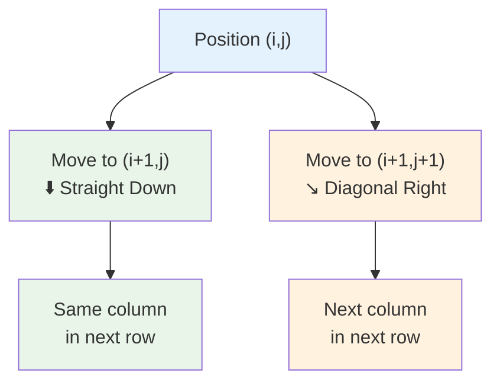

---

## 📚 Step-by-Step Examples

### 🟢 Example 1: Basic Triangle

**Input:** `[[2],[3,4],[6,5,7],[4,1,8,3]]`  
**Output:** `11`

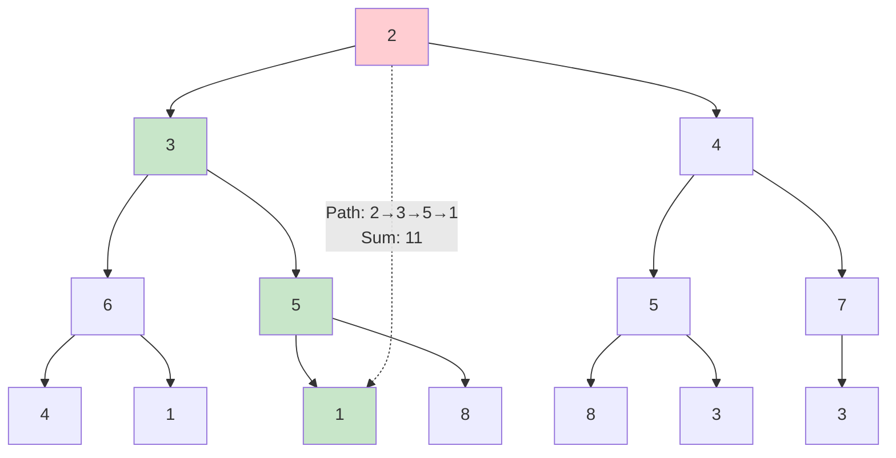

**Step-by-step path analysis:**
1. **Start:** Position (0,0) = 2
2. **Step 1:** Move to (1,0) = 3 (total: 2+3=5)
3. **Step 2:** Move to (2,1) = 5 (total: 5+5=10)  
4. **Step 3:** Move to (3,1) = 1 (total: 10+1=11)

### 🟡 Example 2: Single Element

**Input:** `[[-10]]`  
**Output:** `-10`

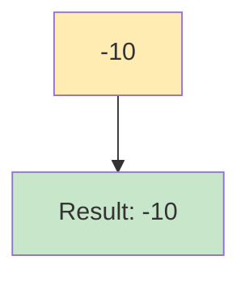

**Analysis:** Only one path exists, so the answer is the single element.

### 🔴 Example 3: All Negative Numbers

**Input:** `[[-1],[-2,-3],[-4,-5,-6]]`  
**Output:** `-8`

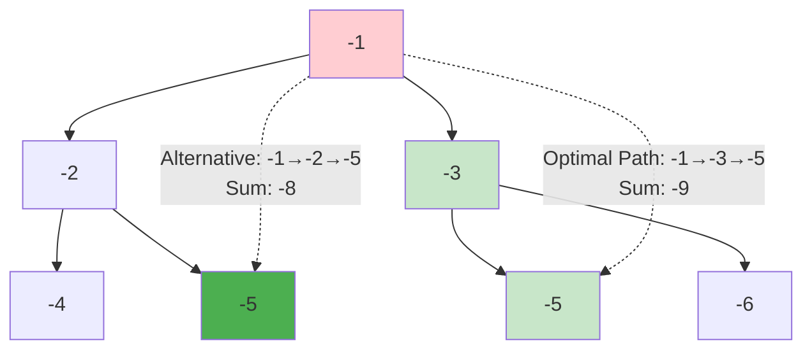

**Key Insight:** Even with all negative numbers, we still find the "least negative" path.

---

## 🛠️ Algorithm Approaches

### 🎯 Approach 1: Bottom-Up Dynamic Programming (Optimal)

```mermaid
flowchart TD
    A[Start from bottom row<br/>Values are final answers] --> B[Process row n-2 upward]
    B --> C[For each position (i,j)]
    C --> D[Calculate: triangle[i][j] + min(dp[j], dp[j+1])]
    D --> E[Update dp[j] with result]
    E --> F{More positions in row?}
    F -->|Yes| C
    F -->|No| G{More rows above?}
    G -->|Yes| B
    G -->|No| H[Return dp[0]]
    
    style A fill:#e8f5e8
    style D fill:#fff3e0
    style H fill:#c8e6c9
```

**Algorithm Visualization:**

```mermaid
graph TD
    subgraph "Step 1: Initialize with bottom row"
        A1[dp = [4, 1, 8, 3]]
    end
    
    subgraph "Step 2: Process row 2"
        B1[Position (2,0): 6 + min(4,1) = 7]
        B2[Position (2,1): 5 + min(1,8) = 6] 
        B3[Position (2,2): 7 + min(8,3) = 10]
        B4[dp = [7, 6, 10]]
    end
    
    subgraph "Step 3: Process row 1"
        C1[Position (1,0): 3 + min(7,6) = 9]
        C2[Position (1,1): 4 + min(6,10) = 10]
        C3[dp = [9, 10]]
    end
    
    subgraph "Step 4: Process row 0"
        D1[Position (0,0): 2 + min(9,10) = 11]
        D2[dp = [11]]
    end
    
    A1 --> B1
    B4 --> C1
    C3 --> D1
    
    style A1 fill:#e1f5fe
    style B4 fill:#f3e5f5
    style C3 fill:#e8f5e8
    style D2 fill:#c8e6c9
```

### 💻 The Optimal Code

```cpp
int minimumTotal(vector<vector<int>>& triangle) {
    int n = triangle.size();
    vector<int> dp(triangle.back());  // Initialize with bottom row
    
    // Process from second-to-last row upward
    for (int row = n - 2; row >= 0; row--) {
        for (int col = 0; col <= row; col++) {
            // Choose minimum path from two possible moves
            dp[col] = triangle[row][col] + min(dp[col], dp[col + 1]);
        }
    }
    
    return dp[0];  // Final answer at top
}
```

### 🔄 Approach 2: Top-Down with Memoization

```mermaid
flowchart TD
    A[Start at (0,0)] --> B[Recursive call dfs(row, col)]
    B --> C{Reached bottom row?}
    C -->|Yes| D[Return triangle[row][col]]
    C -->|No| E{Result memoized?}
    E -->|Yes| F[Return memo[row][col]]
    E -->|No| G[Calculate: dfs(row+1, col)]
    G --> H[Calculate: dfs(row+1, col+1)]
    H --> I[Result = triangle[row][col] + min(left, right)]
    I --> J[Store in memo[row][col]]
    J --> K[Return result]
    
    style A fill:#e1f5fe
    style D fill:#e8f5e8
    style F fill:#fff3e0
    style K fill:#c8e6c9
```

### 📊 Approach Comparison

```mermaid
graph TD
    A[Algorithm Approaches] --> B[Bottom-Up DP<br/>✅ Optimal]
    A --> C[Top-Down Memoization<br/>⚠️ Good]
    A --> D[2D DP Table<br/>📚 Educational]
    
    B --> B1[Time: O(n²)]
    B --> B2[Space: O(n)]
    B --> B3[Iterative]
    
    C --> C1[Time: O(n²)]
    C --> C2[Space: O(n²) + O(n) stack]
    C --> C3[Recursive]
    
    D --> D1[Time: O(n²)]
    D --> D2[Space: O(n²)]
    D --> D3[Iterative]
    
    style B fill:#e8f5e8
    style C fill:#fff3e0
    style D fill:#e1f5fe
```

---

## 🧪 Test Cases & Edge Cases

### ✅ Normal Cases

| Input Triangle | Expected Output | Optimal Path | Reasoning |
|---------------|-----------------|--------------|-----------|
| `[[2],[3,4],[6,5,7],[4,1,8,3]]` | `11` | 2→3→5→1 | Standard example |
| `[[1],[2,3],[4,5,6]]` | `7` | 1→2→4 | Left edge path |
| `[[5],[1,2],[3,4,5]]` | `8` | 5→1→3 | Mixed path |

### ⚠️ Edge Cases

| Input Triangle | Expected Output | Special Property |
|---------------|-----------------|------------------|
| `[[-10]]` | `-10` | Single element |
| `[[1],[2,3]]` | `3` | Two rows only |
| `[[-1],[-2,-3],[-4,-5,-6]]` | `-8` | All negative |
| `[[0],[0,0],[0,0,0]]` | `0` | All zeros |

### 🎯 Boundary Testing

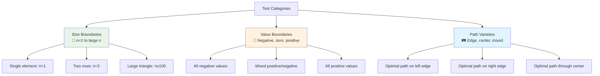

---

## 🎓 Key Concepts Mastery

### 🔢 Dynamic Programming Principles

**1. Optimal Substructure:**
```cpp
// Minimum path to (i,j) depends on minimum paths to (i+1,j) and (i+1,j+1)
dp[i][j] = triangle[i][j] + min(dp[i+1][j], dp[i+1][j+1]);
```

**2. Overlapping Subproblems:**
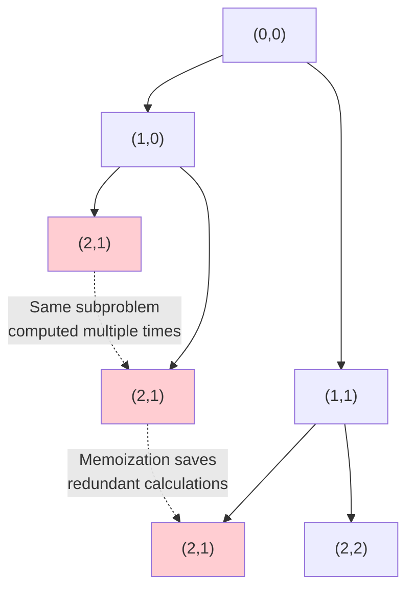

### 🚀 Space Optimization Techniques

```mermaid
flowchart LR
    A[2D DP Table<br/>O(n²) space] --> B[1D DP Array<br/>O(n) space]
    B --> C[In-place Modification<br/>O(1) extra space]
    
    A1[Store all intermediate results] --> A
    B1[Only store current row results] --> B
    C1[Modify input triangle directly] --> C
    
    style A fill:#ffebee
    style B fill:#fff3e0
    style C fill:#e8f5e8
```

**Space Optimization Pattern:**
```cpp
// Instead of: dp[i][j] = triangle[i][j] + min(dp[i+1][j], dp[i+1][j+1])
// We use:    dp[j] = triangle[i][j] + min(dp[j], dp[j+1])
```

### 🎯 Problem-Solving Framework

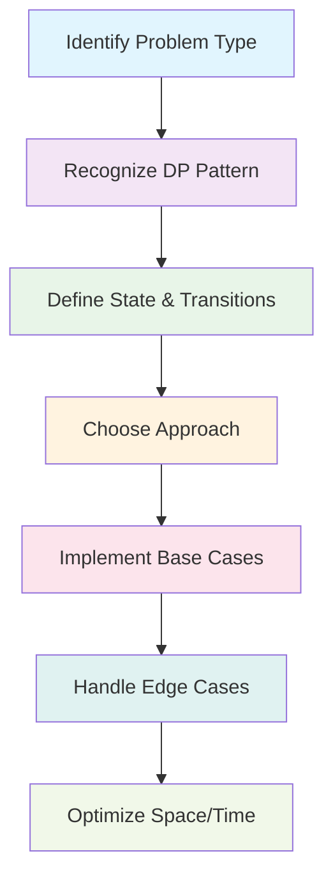

---

## 📊 Complexity Analysis

### ⏰ Time Complexity: O(n²)

**Why quadratic?**
- Triangle has `1 + 2 + 3 + ... + n = n(n+1)/2` positions
- Each position is processed exactly once
- Total operations: O(n²)

```mermaid
graph TD
    A[Triangle Size Analysis] --> B[Row 0: 1 element]
    A --> C[Row 1: 2 elements]
    A --> D[Row 2: 3 elements]
    A --> E[Row n-1: n elements]
    
    F[Total Elements] --> G[1 + 2 + 3 + ... + n]
    G --> H[= n(n+1)/2]
    H --> I[= O(n²)]
    
    style A fill:#e3f2fd
    style I fill:#c8e6c9
```

### 💾 Space Complexity Comparison

```mermaid
graph LR
    A[Approach Comparison] --> B[Bottom-Up Optimized<br/>O(n) space]
    A --> C[Top-Down Memoization<br/>O(n²) + O(n) stack]
    A --> D[2D DP Table<br/>O(n²) space]
    
    B --> B1[✅ Most efficient]
    C --> C1[⚠️ Higher memory usage]
    D --> D1[📚 Educational value]
    
    style B fill:#e8f5e8
    style C fill:#fff3e0
    style D fill:#e1f5fe
```

**Space Optimization Breakdown:**
- **Original 2D DP**: Store entire triangle of results
- **Optimized 1D DP**: Only store current processing row
- **In-place**: Modify input triangle (if allowed)

---

## 🚀 Advanced Optimizations

### 🔧 Memory Access Optimization

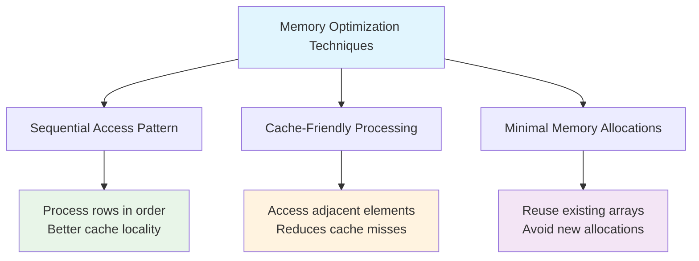

### ⚡ Performance Optimizations

**1. In-Place Modification (if input can be modified):**
```cpp
int minimumTotalInPlace(vector<vector<int>>& triangle) {
    for (int row = triangle.size() - 2; row >= 0; row--) {
        for (int col = 0; col <= row; col++) {
            triangle[row][col] += min(triangle[row+1][col], triangle[row+1][col+1]);
        }
    }
    return triangle[0][0];
}
```

**2. Early Termination (for specific cases):**
```cpp
// If all values are positive and we only need to know if path exists under threshold
bool hasPathUnderThreshold(vector<vector<int>>& triangle, int threshold) {
    // Implementation with early termination when path exceeds threshold
}
```

---

## 🧠 Problem Variations & Extensions

### 🔄 Related Problems

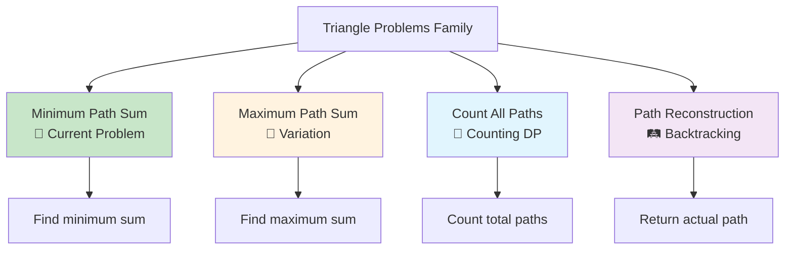

### 🎮 Real-World Applications

| Domain | Application | Triangle Analogy |
|--------|-------------|------------------|
| **Finance** | Investment decision trees | Each level = time period, values = returns |
| **Gaming** | Skill tree optimization | Each level = skill tier, values = costs |
| **Logistics** | Route optimization | Each level = waypoint, values = travel costs |
| **AI/ML** | Decision tree pruning | Each level = feature split, values = error rates |

---

## 🎯 Practice Problems

Once you master this, try these similar problems:

| Problem | Difficulty | Key Concept | LeetCode # |
|---------|------------|-------------|------------|
| 🔺 **Triangle** | Medium | **Current Problem** | **120** |
| 🏠 House Robber | Medium | 1D DP optimization | 198 |
| 💰 Coin Change | Medium | Bottom-up DP | 322 |
| 🎯 Unique Paths | Medium | 2D DP with optimization | 62 |
| 🔢 Pascal's Triangle | Easy | Triangle generation | 118 |
| 📈 Maximum Subarray | Easy | DP fundamentals | 53 |

---

## 🎯 Quick Reference

### 🔑 Essential Code Patterns

```cpp
// Bottom-up DP with space optimization
vector<int> dp(triangle.back());
for (int row = n - 2; row >= 0; row--) {
    for (int col = 0; col <= row; col++) {
        dp[col] = triangle[row][col] + min(dp[col], dp[col + 1]);
    }
}
return dp[0];

// Top-down with memoization
int dfs(triangle, row, col, memo) {
    if (row == n - 1) return triangle[row][col];
    if (memo[row][col] != -1) return memo[row][col];
    
    int left = dfs(triangle, row + 1, col, memo);
    int right = dfs(triangle, row + 1, col + 1, memo);
    return memo[row][col] = triangle[row][col] + min(left, right);
}
```

### 📝 Important Patterns

```cpp
// Triangle indexing: row i has i+1 elements (0 to i)
for (int row = 0; row < n; row++) {
    for (int col = 0; col <= row; col++) {
        // Process triangle[row][col]
    }
}

// Movement rules: from (i,j) can go to (i+1,j) or (i+1,j+1)
int nextLeft = triangle[row + 1][col];      // Same column
int nextRight = triangle[row + 1][col + 1]; // Next column
```

### 🧠 Mental Model

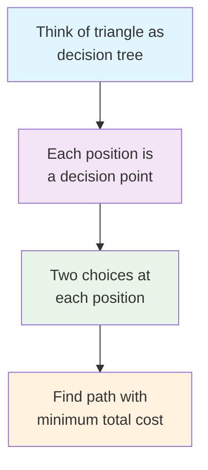

---

## 🏆 Mastery Checklist

- [ ] ✅ Understand triangle structure and indexing
- [ ] ✅ Master bottom-up dynamic programming approach
- [ ] ✅ Implement space optimization (O(n²) → O(n))
- [ ] ✅ Compare different DP approaches (top-down vs bottom-up)
- [ ] ✅ Handle edge cases (single element, all negative values)
- [ ] ✅ Analyze time and space complexity correctly
- [ ] ✅ Implement alternative approaches for comparison
- [ ] ✅ Apply optimization techniques (in-place modification)
- [ ] ✅ Understand real-world applications and variations
- [ ] ✅ Test thoroughly with comprehensive test cases

---

## 💡 Pro Tips

1. **🎯 Start Simple**: Begin with 2D DP to understand the logic, then optimize to 1D
2. **🔍 Visualize**: Draw the triangle and trace through paths manually first
3. **🧪 Test Edge Cases**: Single element, two rows, all negative values
4. **📊 Compare Approaches**: Implement multiple solutions to understand trade-offs
5. **🚀 Optimize Gradually**: First correctness, then space optimization, then performance
6. **🎓 Learn the Pattern**: This bottom-up DP pattern applies to many problems
7. **🔄 Practice Variations**: Try maximum path sum, path counting, path reconstruction

---

## 🌟 Advanced Insights

### 🧠 Why Bottom-Up Works Better Here

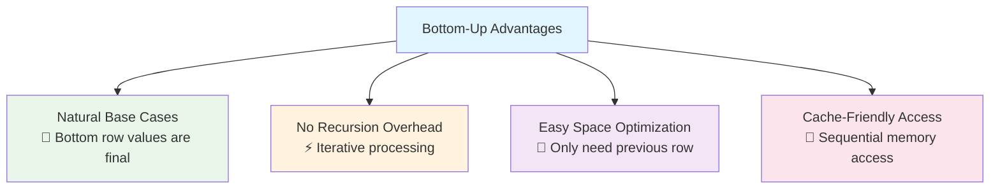

### 🎯 When to Use Each Approach

| Scenario | Recommended Approach | Reason |
|----------|---------------------|---------|
| **Production Code** | Bottom-Up Optimized | Best performance and space efficiency |
| **Learning DP** | 2D DP Table | Clearest visualization of state transitions |
| **Interview** | Bottom-Up + Explanation | Shows optimization skills |
| **Debugging** | Top-Down Memoization | Easier to trace and debug |

---

**🎉 Congratulations! You now have complete mastery of the Triangle problem and dynamic programming optimization techniques. This foundation will serve you well in tackling more complex DP problems!**
