# Day 42: 🔺 Triangle Minimum Path Sum - Complete Beginner's Guide

> **Master dynamic programming and space optimization step by step!**


---

## 📖 What You'll Learn

By the end of this guide, you'll master:
- 🎯 **Dynamic Programming Fundamentals** - Building solutions from smaller subproblems
- 🚀 **Space Optimization Techniques** - Reducing memory from O(n²) to O(n)
- 🔄 **Bottom-Up Approach** - Working backwards to find optimal solutions
- 🧮 **Path Finding in Triangles** - Navigating through structured data

---

## 🎯 The Problem

### 📋 Problem Statement

**Given**: A triangle array where each row has one more element than the previous row  
**Task**: Find the minimum path sum from top to bottom  
**Rule**: You can only move to adjacent numbers in the row below

**Movement Constraint**: From position `i` in current row, you can move to position `i` or `i+1` in next row

### 🌟 Real-World Example

Think of it like climbing down a pyramid of stepping stones:
- **Start at the top** (only one choice)
- **Each step down** you can choose between two adjacent stones
- **Find the path** where the sum of numbers is smallest

```
Example Triangle:
    2           ← Start here
   3 4          ← Can go to 3 or 4
  6 5 7         ← From 3: can reach 6 or 5; From 4: can reach 5 or 7
 4 1 8 3        ← Continue choosing adjacent positions
```

**Minimum Path**: 2 → 3 → 5 → 1 = **11**

---

## 🔍 Understanding the Basics

### 🏗️ What is a Triangle Structure?

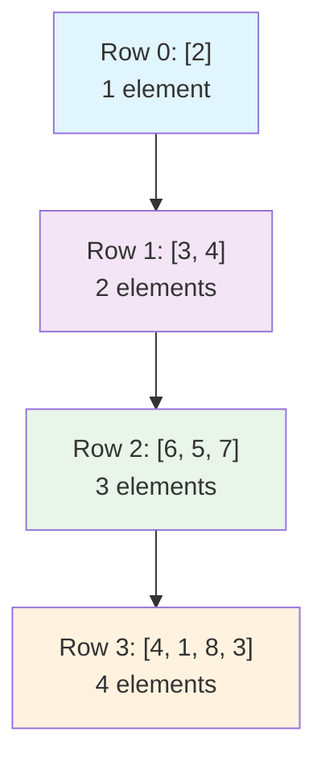

**Key Properties:**
- Row `i` has exactly `i+1` elements
- Element at position `[i][j]` connects to `[i+1][j]` and `[i+1][j+1]`
- Forms a tree-like structure with overlapping paths

### 🎲 Movement Rules Visualization

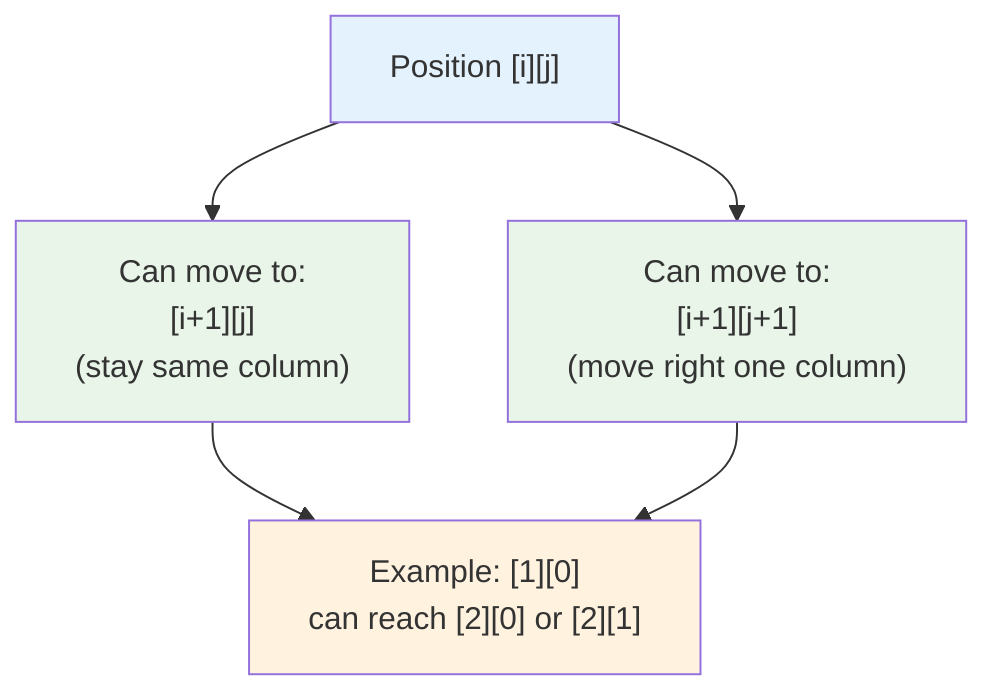

---

## 📚 Step-by-Step Examples

### 🟢 Example 1: Small Triangle

**Input:**
```
    2
   3 4
  6 5 7
 4 1 8 3
```

**Output:** `11`

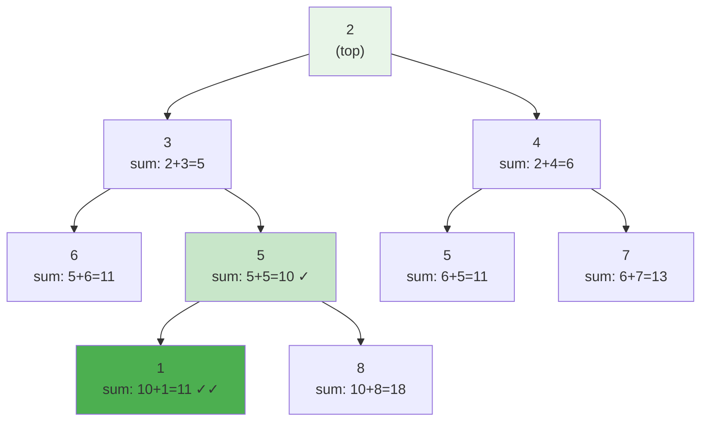

**Step-by-step breakdown:**

**Bottom-Up Calculation:**

1. **Start:** `dp = [4, 1, 8, 3]` (bottom row)

2. **Row 2:** `[6, 5, 7]`
   - Position 0: `6 + min(4, 1) = 6 + 1 = 7`
   - Position 1: `5 + min(1, 8) = 5 + 1 = 6`
   - Position 2: `7 + min(8, 3) = 7 + 3 = 10`
   - `dp = [7, 6, 10]`

3. **Row 1:** `[3, 4]`
   - Position 0: `3 + min(7, 6) = 3 + 6 = 9`
   - Position 1: `4 + min(6, 10) = 4 + 6 = 10`
   - `dp = [9, 10]`

4. **Row 0:** `[2]`
   - Position 0: `2 + min(9, 10) = 2 + 9 = 11`
   - `dp = [11]`

5. **Result:** `11` ✅

### 🔴 Example 2: Negative Numbers

**Input:**
```
   -1
  2  3
 1 -1 -3
```

**Output:** `-1`

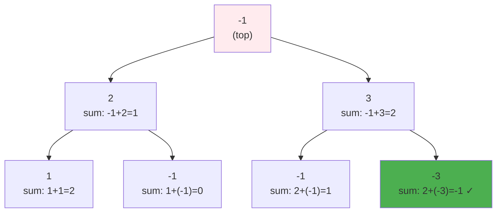

**Why path -1 → 3 → -3 is optimal:**
- Path 1: -1 → 2 → 1 = 2
- Path 2: -1 → 2 → -1 = 0
- Path 3: -1 → 3 → -1 = 1
- **Path 4: -1 → 3 → -3 = -1** ✅ (most negative = minimum)

### 🟡 Example 3: Single Element

**Input:**
```
-10
```

**Output:** `-10`

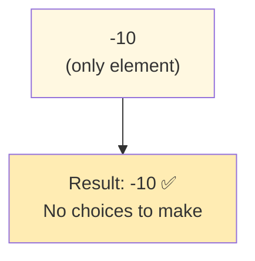

### 🟣 Example 4: Equal Values

**Input:**
```
  5
 5 5
5 5 5
```

**Output:** `15`

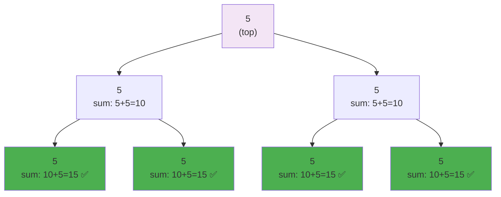

**All paths have same sum!** Any path gives the same result: 15

---

## 🛠️ The Algorithm

### 🎯 Main Strategy: Bottom-Up Dynamic Programming

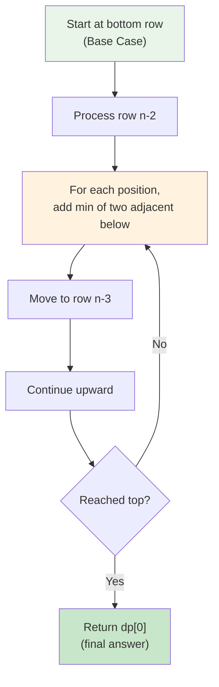

### 💻 The Code

```cpp
int minimumTotal(vector<vector<int>>& triangle) {
    int n = triangle.size();
    
    // 🎯 BASE CASE: Start with bottom row
    vector<int> dp(triangle.back());
    
    // 🔄 PROCESS: Work upward row by row
    for (int row = n - 2; row >= 0; row--) {
        for (int col = 0; col <= row; col++) {
            // 💡 CHOICE: Take minimum of two paths below
            dp[col] = triangle[row][col] + min(dp[col], dp[col + 1]);
        }
    }
    
    // ✅ RESULT: Top element has minimum path sum
    return dp[0];
}
```

### 🛡️ Why Bottom-Up Works

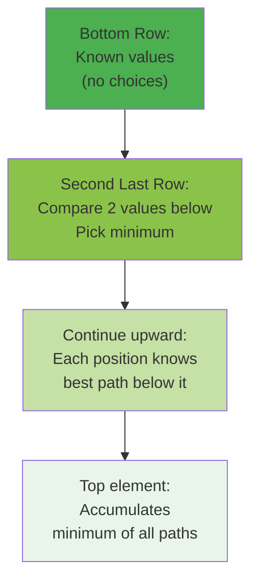

**The Logic:**
1. **Bottom row** = base case (no decisions needed)
2. **Each row up** = optimal choice based on rows below
3. **Top element** = optimal path through entire triangle

---

## 🧪 Test Cases & Edge Cases

### ✅ Normal Cases

| Input | Output | Why |
|-------|--------|-----|
| `[[2],[3,4],[6,5,7],[4,1,8,3]]` | `11` | Path: 2→3→5→1 |
| `[[1],[2,3]]` | `3` | Path: 1→2 |
| `[[5],[7,8],[2,3,1]]` | `8` | Path: 5→8→1 |

### ⚠️ Edge Cases

| Input | Output | Why |
|-------|--------|-----|
| `[[-10]]` | `-10` | Single element |
| `[[-1],[2,3],[1,-1,-3]]` | `-1` | Negative values |
| `[[5],[5,5],[5,5,5]]` | `15` | All equal |
| `[[100],[50,40],[30,20,10]]` | `150` | Large values |

### 🎯 Edge Case Analysis

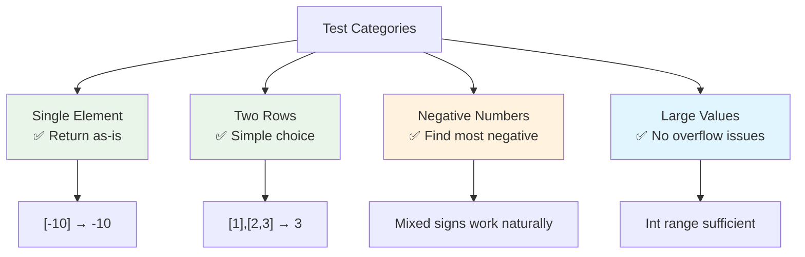

---

## 🎓 Key Concepts Mastery

### 🔢 Dynamic Programming Pattern

**1. Define Subproblem:**
```cpp
dp[col] = minimum path sum from position [row][col] to bottom
```

**2. Base Case:**
```cpp
dp = last row values  // No choices at bottom
```

**3. Recurrence Relation:**
```cpp
dp[col] = triangle[row][col] + min(dp[col], dp[col + 1])
```

### 🚀 Space Optimization Journey

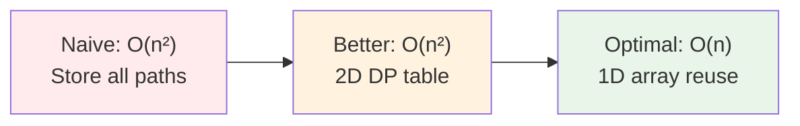

**Why 1D Array Works:**
- Only need previous row to compute current row
- Update in-place from left to right
- No need to store entire 2D table

**Comparison:**

| Approach | Space | Why |
|----------|-------|-----|
| Recursive | O(n²) | Stores all intermediate results |
| 2D DP | O(n²) | Full table stored |
| 1D DP | O(n) | Reuse single array ✅ |

### 🎯 Bottom-Up vs Top-Down

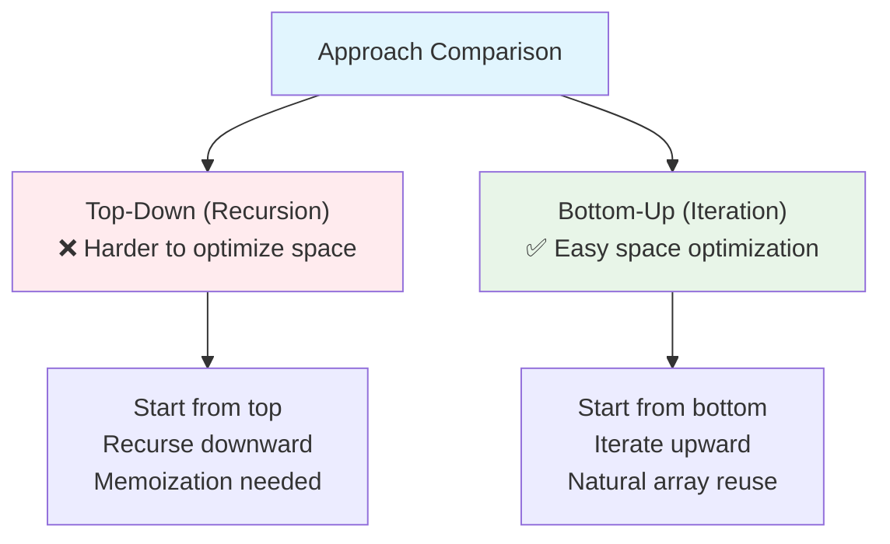

---

## 📊 Complexity Analysis

### ⏰ Time Complexity: O(n²)

**Why quadratic?**
- Process each element exactly once
- Triangle with n rows has: 1 + 2 + 3 + ... + n = n(n+1)/2 elements
- Total operations ≈ n²/2 = O(n²)

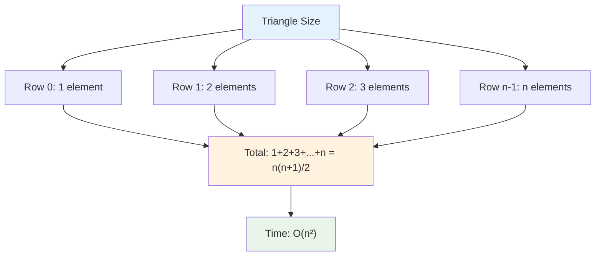

**Breakdown:**
```
n = 4 rows
Row 3: 4 operations
Row 2: 3 operations
Row 1: 2 operations
Row 0: 1 operation
Total: 10 operations = 4×5/2 = O(n²)
```

### 💾 Space Complexity: O(n)

**Why linear space?**
- Store only one row at a time
- Array size = number of elements in bottom row = n
- No recursion stack needed

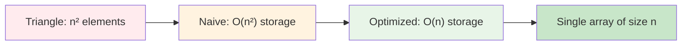

**Space Optimization Impact:**
```
n = 1000 rows
Naive (2D): 1000 × 1000 = 1,000,000 integers ≈ 4 MB
Optimized (1D): 1000 integers ≈ 4 KB
Savings: 99.9% less memory! 🎉
```

---

## 🚀 Practice Problems

Once you master this, try these similar problems:

| Problem | Difficulty | Key Concept |
|---------|------------|-------------|
| 🔺 Pascal's Triangle | Easy | Triangle structure |
| 🎯 Minimum Falling Path Sum | Medium | Similar DP pattern |
| 🗻 Unique Paths | Medium | Grid DP |
| 💰 House Robber | Medium | 1D DP optimization |

---

## 💼 Interview Questions & Answers

### ❓ Question 1: Why use bottom-up instead of top-down?

**Answer:**  
Bottom-up is better for this problem because:
1. **Space optimization** - Easy to use 1D array
2. **No recursion overhead** - Iterative approach is faster
3. **Natural base case** - Bottom row has no choices
4. **Easier to understand** - Build solution step by step

**Simple Explanation:**  
Think of it like filling out a pyramid from bottom to top. Each level knows the best path below it, so when you reach the top, you have the answer!

**Code Comparison:**
```cpp
// Top-Down (Recursion): Harder to optimize
int helper(row, col) {
    if (row == n-1) return triangle[row][col];
    return triangle[row][col] + 
           min(helper(row+1, col), helper(row+1, col+1));
}

// Bottom-Up (Iteration): Easy O(n) space
for (row = n-2; row >= 0; row--) {
    dp[col] = triangle[row][col] + min(dp[col], dp[col+1]);
}
```

---

### ❓ Question 2: How does the movement rule work?

**Answer:**  
From position `[i][j]`, you can move to:
- `[i+1][j]` - Stay in same column (move straight down)
- `[i+1][j+1]` - Move one column right (diagonal right)

**Simple Explanation:**  
```
Row i:     [ ][ ][X][ ]    ← You're at position [i][2]
                ↓ ↘
Row i+1: [ ][ ][O][O][ ]   ← Can reach positions [i+1][2] or [i+1][3]
```

It's like stepping down stairs where you can either step straight or step right!

---

### ❓ Question 3: Why does in-place update work?

**Answer:**  
We update from **left to right**, and each position only needs values at `dp[col]` and `dp[col+1]`:

```cpp
for (col = 0; col <= row; col++) {
    dp[col] = triangle[row][col] + min(dp[col], dp[col+1]);
    //         ↑ current row value      ↑ from below  ↑ not updated yet
}
```

**Simple Explanation:**  
When updating `dp[0]`, we need `dp[0]` and `dp[1]` (both from row below).  
When updating `dp[1]`, we need `dp[1]` and `dp[2]` (both still from row below).  
Since we go left-to-right, `dp[col+1]` is always still the old value we need!

**Visual:**
```
Before: dp = [7, 6, 10]      (row 2 results)
Update dp[0]: 3 + min(7,6) = 9
After:  dp = [9, 6, 10]      (dp[1] still old!)
Update dp[1]: 4 + min(6,10) = 10
After:  dp = [9, 10, 10]     (now dp[1] updated)
```

---

### ❓ Question 4: Can we optimize further?

**Answer:**  
**No**, this is already optimal!
- **Time:** O(n²) - Must process every element
- **Space:** O(n) - Cannot do better without modifying input

**Could we use O(1) space?**  
Only if we modify the input triangle in-place:
```cpp
for (int row = n - 2; row >= 0; row--) {
    for (int col = 0; col <= row; col++) {
        triangle[row][col] += min(triangle[row+1][col], 
                                  triangle[row+1][col+1]);
    }
}
return triangle[0][0];
```

**Trade-off:** Destroys input data (usually not acceptable in interviews)

---

### ❓ Question 5: What about negative numbers?

**Answer:**  
Negative numbers work naturally because we use `min()`:
- Positive sums → find smallest positive
- Negative sums → find most negative (which is "minimum")
- Mixed signs → algorithm handles correctly

**Simple Explanation:**
```
Path 1: 5 + 3 + 2 = 10
Path 2: 5 + (-1) + 4 = 8     ← min (less positive)
Path 3: -2 + (-3) + (-1) = -6 ← min (most negative)
```

The `min()` function always finds the smallest sum, whether positive or negative!

---

### ❓ Question 6: How do you handle the triangle structure?

**Answer:**  
Key observations:
1. Row `i` has `i+1` elements (row 0 has 1, row 1 has 2, etc.)
2. Valid column indices: `0` to `row` (inclusive)
3. Element `[i][j]` connects to `[i+1][j]` and `[i+1][j+1]`

**Simple Explanation:**
```cpp
for (int col = 0; col <= row; col++) {
    // Only iterate up to 'row' because row i has i+1 elements
    // col goes from 0, 1, 2, ..., row
}
```

**Triangle indexing:**
```
Row 0: [0]           → 1 element  (col: 0)
Row 1: [0][1]        → 2 elements (col: 0,1)
Row 2: [0][1][2]     → 3 elements (col: 0,1,2)
Row 3: [0][1][2][3]  → 4 elements (col: 0,1,2,3)
```

---

### ❓ Question 7: What's the recurrence relation?

**Answer:**  
```
dp[i][j] = triangle[i][j] + min(dp[i+1][j], dp[i+1][j+1])
```

**In words:**  
"The minimum path from position `[i][j]` equals the current value plus the minimum of the two paths below it."

**Simple Explanation:**  
At each step, you ask: "Should I go straight down or diagonal right?" Pick whichever gives the smaller sum!

**Example:**
```
Current position: value = 3
Below left:  path sum = 7
Below right: path sum = 6

Choose: 3 + min(7, 6) = 3 + 6 = 9
```

---

### ❓ Question 8: How do you test this solution?

**Answer:**  
Test cases should include:

1. **Normal cases:**
   - Standard triangle with multiple rows
   - Small triangles (2-3 rows)

2. **Edge cases:**
   - Single element: `[[-10]]`
   - Two rows: `[[1],[2,3]]`
   - All equal values: `[[5],[5,5],[5,5,5]]`

3. **Special values:**
   - Negative numbers
   - Mix of positive and negative
   - Large values (test for overflow)

4. **Path verification:**
   - Trace the actual path taken
   - Verify it's a valid path (adjacent moves only)
   - Confirm it's truly the minimum

**Simple Explanation:**  
Like testing a route-finding app, you want to verify:
- It handles simple routes ✅
- It works with one step ✅
- It handles negative distances (going uphill) ✅
- It really finds the shortest path ✅

---

### ❓ Question 9: Can you explain the space optimization?

**Answer:**  

**Evolution of approaches:**

```cpp
// Approach 1: Recursion with memoization - O(n²) space
vector<vector<int>> memo(n, vector<int>(n, -1));

// Approach 2: 2D DP table - O(n²) space
vector<vector<int>> dp(n, vector<int>(n));

// Approach 3: 1D array - O(n) space ✅
vector<int> dp(n);
```

**Why 1D works:**
- We process bottom-up
- Current row only depends on the row directly below
- Reuse the same array for each level

**Simple Explanation:**  
Instead of storing the entire pyramid of results, we only remember one floor at a time. As we move up, we overwrite old results we no longer need!

**Memory savings:**
```
n = 100 rows
2D DP: 100 × 100 = 10,000 integers ≈ 40 KB
1D DP: 100 integers ≈ 400 bytes
Savings: 99% less memory!
```

---

### ❓ Question 10: What if we want to track the actual path?

**Answer:**  
We'd need to store path information, which increases space complexity:

```cpp
vector<int> dp(n);
vector<vector<int>> path;  // Store decisions

for (int row = n - 2; row >= 0; row--) {
    for (int col = 0; col <= row; col++) {
        if (dp[col] < dp[col + 1]) {
            dp[col] = triangle[row][col] + dp[col];
            path[row][col] = 0;  // Went straight down
        } else {
            dp[col] = triangle[row][col] + dp[col + 1];
            path[row][col] = 1;  // Went diagonal right
        }
    }
}

// Reconstruct path from top using path[][] array
```

**Trade-off:** Space increases from O(n) to O(n²)

**Simple Explanation:**  
It's like dropping breadcrumbs to remember which way you went. You can find your way back, but now you need storage for all those breadcrumbs!

---

### ❓ Question 11: Does the order of processing matter?

**Answer:**  
**Yes!** We must process bottom-up (from row n-2 to 0) because:

1. **Bottom row is base case** (no decisions needed)
2. **Each row depends on row below it**
3. **Top row accumulates all decisions**

**Wrong order (top-down without memoization):**
```cpp
// ❌ This doesn't work without recursion
for (int row = 0; row < n; row++) {
    // Can't compute because we don't know values below yet!
}
```

**Correct order (bottom-up):**
```cpp
// ✅ This works
for (int row = n - 2; row >= 0; row--) {
    // We know all values below, so we can compute
}
```

**Simple Explanation:**  
It's like calculating grades in a tournament. You must know the results of the lower rounds before you can determine the finals winner!

---

### ❓ Question 12: What about integer overflow?

**Answer:**  
For this problem:
- Path sums can be large (n can be up to 200)
- Each element can be -10,000 to 10,000
- Maximum sum: 200 × 10,000 = 2,000,000
- Minimum sum: 200 × (-10,000) = -2,000,000

**Both fit in 32-bit integer range:**
- `INT_MIN` = -2,147,483,648
- `INT_MAX` = +2,147,483,647

**Simple Explanation:**  
We're safe! Even in the worst case (all maximum values), the sum stays within integer limits. No need for `long long`.

---

## 🎯 Quick Reference

### 🔑 Essential Code Patterns

```cpp
// Bottom-up DP with space optimization
vector<int> dp(triangle.back());  // Initialize with last row

for (int row = n - 2; row >= 0; row--) {
    for (int col = 0; col <= row; col++) {
        dp[col] = triangle[row][col] + min(dp[col], dp[col + 1]);
    }
}

return dp[0];  // Top element has the answer
```

### 📝 Important Formulas

```cpp
// Recurrence relation
dp[col] = current_value + min(left_path, right_path)

// Number of elements in triangle
total_elements = n × (n + 1) / 2

// Valid column range for row i
0 <= col <= i
```

### 🧠 Mental Model

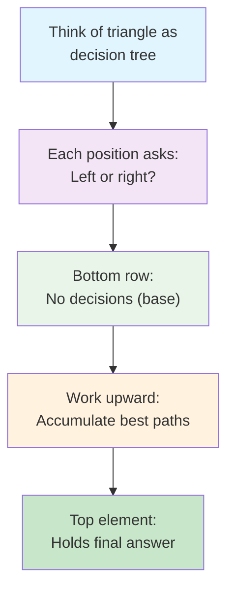

---

## 🏆 Mastery Checklist

- [ ] ✅ Understand dynamic programming fundamentals
- [ ] ✅ Know bottom-up vs top-down approaches
- [ ] ✅ Master space optimization from O(n²) to O(n)
- [ ] ✅ Handle triangle structure and indexing
- [ ] ✅ Work with negative numbers correctly
- [ ] ✅ Solve the problem in O(n²) time
- [ ] ✅ Use O(n) space only
- [ ] ✅ Test all edge cases thoroughly
- [ ] ✅ Explain the algorithm clearly in interviews
- [ ] ✅ Understand when in-place updates are safe

---

## 💡 Pro Tips

1. **🎯 Start with Base Case**: Always identify the simplest subproblem first
2. **🚀 Think Bottom-Up**: For path problems, working backwards is often cleaner
3. **💾 Optimize Space**: Ask yourself "Do I really need to store all intermediate results?"
4. **🧪 Test Edge Cases**: Single element, two rows, negative numbers, equal values
5. **📚 Understand Trade-offs**: Space optimization vs tracking actual path
6. **🎓 Practice Similar Problems**: Pascal's Triangle, Falling Path Sum, Unique Paths
7. **💼 Explain Clearly**: Be ready to draw diagrams and walk through examples
8. **🔍 Verify Correctness**: Trace through small examples step by step

---

## 🎨 Visual Summary

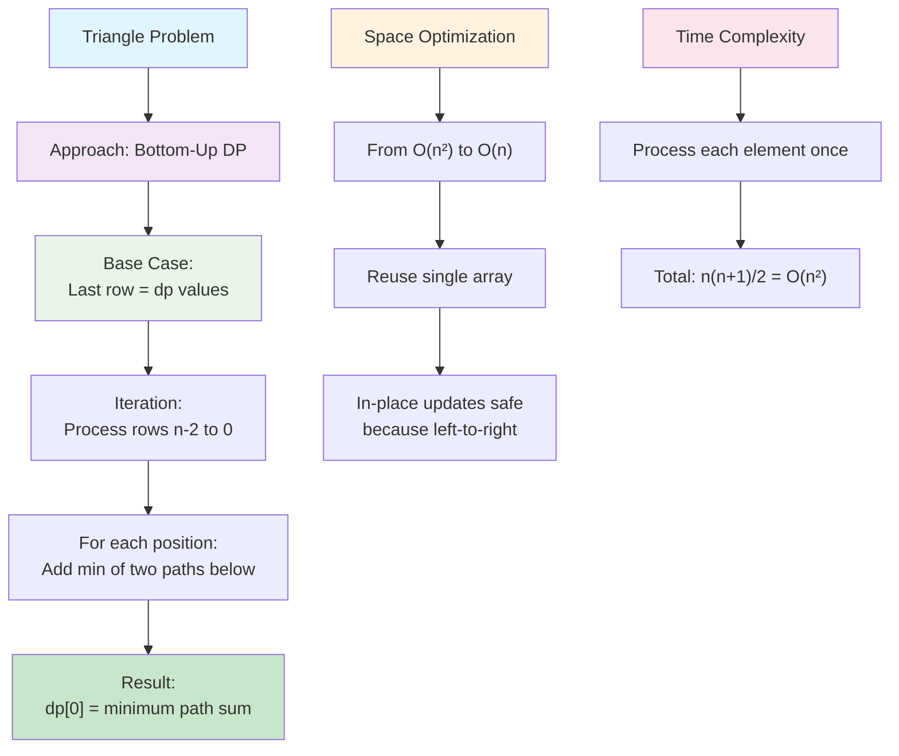

---

## 🌟 Key Takeaways

### 🎯 Algorithm Design
- **Bottom-up DP** is ideal for path problems with clear base cases
- **Space optimization** can reduce memory from quadratic to linear
- **Greedy doesn't work** - we need DP to consider all paths

### 💻 Implementation Details
- **In-place updates** are safe when processing left-to-right
- **Array reuse** eliminates need for 2D storage
- **Base case initialization** simplifies the main loop

### 🧠 Problem-Solving Strategy
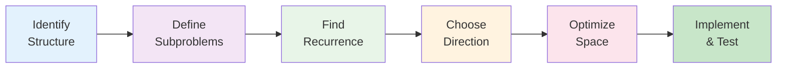

### 📊 Complexity Insights
- **Time:** O(n²) - unavoidable since we must visit each element
- **Space:** O(n) - optimal without modifying input
- **Trade-off:** Can achieve O(1) space by modifying input in-place

---

## 🔗 Related Concepts

### Dynamic Programming Family

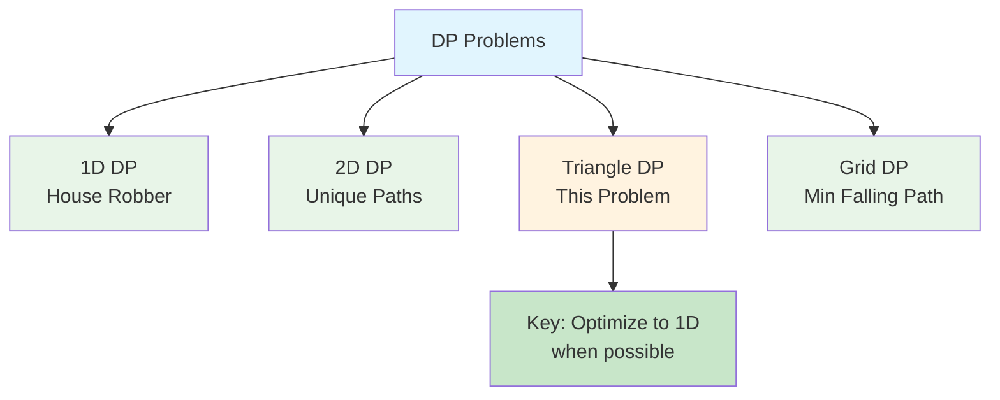

### Path Finding Patterns

| Problem Type | Space | Time | Key Insight |
|-------------|-------|------|-------------|
| Triangle | O(n) | O(n²) | Bottom-up with 1D array |
| Grid (m×n) | O(n) | O(mn) | Process row by row |
| Tree Paths | O(h) | O(n) | Recursion stack |
| Graph Paths | O(V) | O(V+E) | BFS/DFS with visited set |

---

## 🎓 Learning Path

### Beginner → Intermediate → Advanced

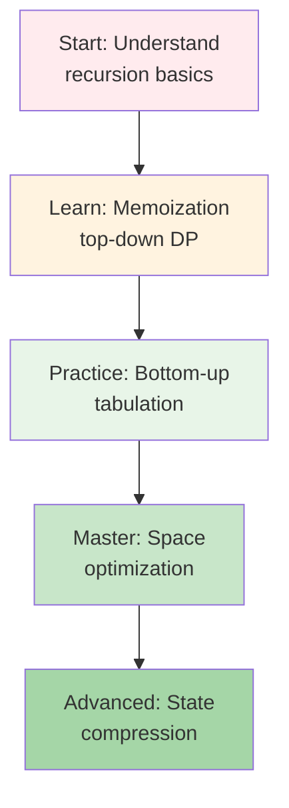

**Recommended progression:**
1. ✅ Fibonacci (basic DP)
2. ✅ Climbing Stairs (1D DP)
3. ✅ Min Cost Climbing Stairs (optimization)
4. ✅ **Triangle (this problem)** ← You are here!
5. ⬜ Unique Paths (2D DP)
6. ⬜ Min Falling Path Sum (similar pattern)
7. ⬜ Longest Increasing Subsequence (advanced)

---

**🎉 Congratulations! You now have complete mastery of the Triangle problem, dynamic programming optimization, and can confidently tackle similar path-finding challenges. You understand bottom-up DP, space optimization, and can explain every aspect in interviews. Keep practicing and happy coding!**