```mermaid
flowchart TD
    A["Start: nums1=[1,3], nums2=[2]<br/>n=2, m=1, total=3 odd"] --> B["Binary search on nums1<br/>low=0, high=2"]
    B --> C["Iteration 1:<br/>cut1=1, cut2=1"]
    C --> D["Check partition:<br/>left1=1, left2=2<br/>right1=3, right2=INT_MAX"]
    D --> E["Valid? 1≤INT_MAX and 2≤3<br/>YES! ✓"]
    E --> F["Odd length: return max 1,2<br/>Median = 2.0"]
    
    style A fill:#e8f5e8
    style B fill:#e3f2fd
    style C fill:#fff3e0
    style D fill:#f3e5f5
    style E fill:#c8e6c9
    style F fill:#4caf50
```

```mermaid
flowchart TD
    A["Start: nums1=[1,2], nums2=[3,4]<br/>n=2, m=2, total=4 even"] --> B["Binary search on nums1<br/>low=0, high=2"]
    B --> C["Iteration 1:<br/>cut1=1, cut2=1"]
    C --> D["Check partition:<br/>left1=1, left2=3<br/>right1=2, right2=4"]
    D --> E["Valid? 1≤4 and 3≤2<br/>NO! 3 > 2 ✗"]
    E --> F["left2 > right1<br/>Move right: low=2"]
    F --> G["Iteration 2:<br/>cut1=2, cut2=0"]
    G --> H["Check partition:<br/>left1=2, left2=INT_MIN<br/>right1=INT_MAX, right2=3"]
    H --> I["Valid? 2≤3 and INT_MIN≤INT_MAX<br/>YES! ✓"]
    I --> J["Even length:<br/>max 2,INT_MIN + min INT_MAX,3 div 2<br/>= 2+3 div 2 = 2.5"]
    
    style A fill:#e8f5e8
    style B fill:#e3f2fd
    style E fill:#ffebee
    style F fill:#fff3e0
    style I fill:#c8e6c9
    style J fill:#4caf50
```

```mermaid
flowchart TD
    A["Start: nums1=[], nums2=[1]<br/>n=0, m=1, total=1 odd"] --> B["Binary search on nums1<br/>low=0, high=0"]
    B --> C["Iteration 1:<br/>cut1=0, cut2=1"]
    C --> D["Check partition:<br/>left1=INT_MIN, left2=1<br/>right1=INT_MAX, right2=INT_MAX"]
    D --> E["Valid? INT_MIN≤INT_MAX and 1≤INT_MAX<br/>YES! ✓"]
    E --> F["Odd length: return max INT_MIN,1<br/>Median = 1.0"]
    
    style A fill:#fff8e1
    style B fill:#e3f2fd
    style C fill:#fff3e0
    style D fill:#f3e5f5
    style E fill:#c8e6c9
    style F fill:#4caf50
```

```mermaid
flowchart TD
    A["Start: nums1=[1,3,8], nums2=[7,9,10,11]<br/>n=3, m=4, total=7 odd"] --> B["Binary search on nums1<br/>low=0, high=3"]
    B --> C["Iteration 1:<br/>cut1=1, cut2=3"]
    C --> D["Check partition:<br/>left1=1, left2=10<br/>right1=3, right2=11"]
    D --> E["Valid? 1≤11 and 10≤3<br/>NO! 10 > 3 ✗"]
    E --> F["left2 > right1<br/>Move right: low=2"]
    F --> G["Iteration 2:<br/>cut1=2, cut2=2"]
    G --> H["Check partition:<br/>left1=3, left2=9<br/>right1=8, right2=10"]
    H --> I["Valid? 3≤10 and 9≤8<br/>NO! 9 > 8 ✗"]
    I --> J["left2 > right1<br/>Move right: low=3"]
    J --> K["Iteration 3:<br/>cut1=3, cut2=1"]
    K --> L["Check partition:<br/>left1=8, left2=7<br/>right1=INT_MAX, right2=9"]
    L --> M["Valid? 8≤9 and 7≤INT_MAX<br/>YES! ✓"]
    M --> N["Odd length: return max 8,7<br/>Median = 8.0"]
    
    style A fill:#e8f5e8
    style B fill:#e3f2fd
    style E fill:#ffebee
    style I fill:#ffebee
    style M fill:#c8e6c9
    style N fill:#4caf50
```

# Day 43: 🎯 Median of Two Sorted Arrays - Complete Mastery Guide

> **Master advanced binary search and array partitioning with this HARD LeetCode problem!**

---

## 📖 What You'll Learn

By the end of this comprehensive guide, you'll master:
- 🔍 **Advanced Binary Search** - Binary search on abstract concepts, not just arrays
- 🧩 **Array Partitioning** - Dividing arrays strategically for optimal solutions
- 📊 **Median Calculation** - Understanding median in merged contexts
- ⚡ **Algorithm Optimization** - Achieving O(log(min(m,n))) instead of O(m+n)
- 🎓 **Mathematical Reasoning** - Partition formulas and boundary conditions
- 💡 **Problem-Solving Patterns** - Techniques applicable to many hard problems

---

## 🎯 The Problem

### 📋 Problem Statement

**Given**: Two sorted arrays `nums1` and `nums2` of size `m` and `n` respectively  
**Task**: Return the **median** of the two sorted arrays  
**Critical Requirement**: The overall run time complexity should be **O(log(m+n))**

**Important Constraint**: You cannot use a simple merge approach (that would be O(m+n))!

### 🌟 Real-World Example

Think of it like combining two sorted lists of scores:
- **Class A scores**: `[85, 90, 95]` (sorted)
- **Class B scores**: `[88, 92, 96, 98]` (sorted)
- **Combined median**: The middle score when all students are ranked together
- **Challenge**: Find it without actually combining all scores!

**Why is this useful?**
- 📈 **Financial Analysis**: Finding median stock prices from multiple exchanges
- 🏥 **Medical Research**: Combining patient data from different hospitals
- 📊 **Data Science**: Merging sorted datasets efficiently
- 🎮 **Gaming Leaderboards**: Finding median score across multiple servers

---

## 🔍 Understanding the Basics

### 📊 What is a Median?


**Key Understanding:**
- **Odd length array**: Median is the middle element
- **Even length array**: Median is the average of two middle elements
- **Sorted requirement**: Arrays must be sorted for efficient median finding

### 🚫 Why Simple Merge Doesn't Work

**Naive Approach (O(m+n)):**


**Problem**: Merging takes O(m+n) time, which violates the O(log(m+n)) requirement!

**We need a smarter approach: Binary Search!**

---

## 💡 The Core Insight: Partitioning

### 🧩 What is Array Partitioning?

Instead of merging, we **partition** both arrays so that:
- **Left partition**: All elements smaller than or equal to median
- **Right partition**: All elements greater than or equal to median

```mermaid
flowchart TD
    A["Combined Arrays Concept"] --> B["Left Partition<br/>smaller or equal elements"]
    A --> C["Right Partition<br/>larger or equal elements"]
    
    B --> D["max left part ≤ min right part"]
    C --> D
    
    D --> E["Valid Partition Found!<br/>Calculate Median"]
    
    style A fill:#e1f5fe
    style B fill:#e8f5e8
    style C fill:#fff3e0
    style D fill:#c8e6c9
    style E fill:#4caf50
```



### 🎯 Partition Rules

**For a valid partition:**
1. **Left partition** has `(m+n+1)/2` elements (for odd/even cases)
2. **Right partition** has remaining elements
3. **Critical condition**: `max(left_part) ≤ min(right_part)`

**Visual Example:**
```
nums1 = [1, 3, 8, 9, 15]
        partition here ↓
nums1_left = [1, 3]  |  nums1_right = [8, 9, 15]

nums2 = [7, 11, 18, 19, 21, 25]
              partition here ↓
nums2_left = [7, 11, 18]  |  nums2_right = [19, 21, 25]

Combined left = [1, 3, 7, 11, 18]  (5 elements)
Combined right = [8, 9, 15, 19, 21, 25]  (6 elements)

Check: max(left) = 18, min(right) = 8
18 > 8? YES! This partition is INVALID ❌
```

---

## 📚 Step-by-Step Examples

### 🟢 Example 1: Simple Odd Length Case

**Input:** `nums1 = [1, 3]`, `nums2 = [2]`  
**Output:** `2.0`

**Step-by-Step Process:**



**Detailed Breakdown:**

1. **Setup:**
   - `n = 2` (nums1 size), `m = 1` (nums2 size)
   - Total elements = 3 (odd)
   - Binary search on nums1: `low = 0`, `high = 2`

2. **Iteration 1:**
   - `cut1 = (0 + 2) / 2 = 1` (take 1 element from nums1's left)
   - `cut2 = (2 + 1 + 1) / 2 - 1 = 1` (take 1 element from nums2's left)
   
3. **Partition:**
   ```
   nums1: [1] | [3]
           ↑     ↑
         left1 right1
   
   nums2: [2] | [empty]
           ↑      ↑
         left2  right2(INT_MAX)
   ```

4. **Check validity:**
   - `left1 = 1`, `left2 = 2`
   - `right1 = 3`, `right2 = INT_MAX`
   - Is `left1 ≤ right2`? `1 ≤ INT_MAX`? ✓ YES
   - Is `left2 ≤ right1`? `2 ≤ 3`? ✓ YES
   - **Valid partition found!**

5. **Calculate median:**
   - Total length is odd (3)
   - Median = `max(left1, left2) = max(1, 2) = 2`
   - **Answer: 2.0**

**Merged view (conceptual):**
```
[1, 2, 3]
    ↑
  median
```

---

### 🔵 Example 2: Even Length Case

**Input:** `nums1 = [1, 2]`, `nums2 = [3, 4]`  
**Output:** `2.5`

**Step-by-Step Process:**



**Detailed Breakdown:**

1. **Setup:**
   - `n = 2` (nums1 size), `m = 2` (nums2 size)
   - Total elements = 4 (even)
   - Binary search on nums1: `low = 0`, `high = 2`

2. **Iteration 1:**
   - `cut1 = (0 + 2) / 2 = 1`
   - `cut2 = (2 + 2 + 1) / 2 - 1 = 1`
   
3. **Partition 1:**
   ```
   nums1: [1] | [2]
           ↑     ↑
         left1 right1
   
   nums2: [3] | [4]
           ↑     ↑
         left2 right2
   ```

4. **Check validity:**
   - `left1 = 1`, `left2 = 3`
   - `right1 = 2`, `right2 = 4`
   - Is `left1 ≤ right2`? `1 ≤ 4`? ✓ YES
   - Is `left2 ≤ right1`? `3 ≤ 2`? ✗ NO
   - **Invalid partition! `left2 > right1`**

5. **Adjust search:**
   - Since `left2 > right1`, we need more elements from nums1 on the left
   - Move search right: `low = cut1 + 1 = 2`

6. **Iteration 2:**
   - `cut1 = (2 + 2) / 2 = 2`
   - `cut2 = (2 + 2 + 1) / 2 - 2 = 0`

7. **Partition 2:**
   ```
   nums1: [1, 2] | [empty]
           ↑        ↑
      left1=2   right1=INT_MAX
   
   nums2: [] | [3, 4]
          ↑      ↑
   left2=INT_MIN right2=3
   ```

8. **Check validity:**
   - `left1 = 2`, `left2 = INT_MIN`
   - `right1 = INT_MAX`, `right2 = 3`
   - Is `left1 ≤ right2`? `2 ≤ 3`? ✓ YES
   - Is `left2 ≤ right1`? `INT_MIN ≤ INT_MAX`? ✓ YES
   - **Valid partition found!**

9. **Calculate median:**
   - Total length is even (4)
   - Median = `(max(left1, left2) + min(right1, right2)) / 2.0`
   - Median = `(max(2, INT_MIN) + min(INT_MAX, 3)) / 2.0`
   - Median = `(2 + 3) / 2.0 = 2.5`
   - **Answer: 2.5**

**Merged view (conceptual):**
```
[1, 2, 3, 4]
    ↑  ↑
  median = (2+3)/2
```

---

### 🟡 Example 3: Empty Array Case

**Input:** `nums1 = []`, `nums2 = [1]`  
**Output:** `1.0`

**Step-by-Step Process:**



**Key Insight:**
- When one array is empty, we take all elements from the other array
- `INT_MIN` and `INT_MAX` handle boundary cases elegantly
- No special code needed for empty arrays!

---

### 🔴 Example 4: Different Sized Arrays

**Input:** `nums1 = [1, 3, 8]`, `nums2 = [7, 9, 10, 11]`  
**Output:** `8.0`

**Step-by-Step Process:**



**Detailed Breakdown:**

1. **Setup:**
   - `n = 3`, `m = 4`, total = 7 (odd)
   - Binary search on nums1: `low = 0`, `high = 3`

2. **Iteration 1:** `cut1 = 1`, `cut2 = 3`
   ```
   nums1: [1] | [3, 8]
   nums2: [7, 9, 10] | [11]
   
   Invalid: 10 > 3
   ```

3. **Iteration 2:** `cut1 = 2`, `cut2 = 2`
   ```
   nums1: [1, 3] | [8]
   nums2: [7, 9] | [10, 11]
   
   Invalid: 9 > 8
   ```

4. **Iteration 3:** `cut1 = 3`, `cut2 = 1`
   ```
   nums1: [1, 3, 8] | []
   nums2: [7] | [9, 10, 11]
   
   Valid! 8 ≤ 9 and 7 ≤ INT_MAX
   ```

5. **Calculate median:**
   - Odd length: median = `max(8, 7) = 8`
   - **Answer: 8.0**

**Merged view:**
```
[1, 3, 7, 8, 9, 10, 11]
          ↑
        median
```

---

## 🛠️ The Algorithm Explained

### 🎯 Overall Strategy

```mermaid
flowchart TD
    A["Step 1: Ensure nums1 is smaller"] --> B["Step 2: Initialize binary search<br/>low=0, high=n"]
    B --> C["Step 3: Calculate partition<br/>cut1 = low+high div 2"]
    C --> D["Step 4: Calculate cut2<br/>cut2 = n+m+1 div 2 - cut1"]
    D --> E["Step 5: Get boundary elements<br/>left1, left2, right1, right2"]
    E --> F{"Step 6: Valid partition?<br/>left1≤right2 AND left2≤right1"}
    F -->|YES| G["Step 7: Calculate median<br/>Even: avg of max left, min right<br/>Odd: max left"]
    F -->|NO| H{"Which side invalid?"}
    H -->|"left1 > right2"| I["Move left: high = cut1-1"]
    H -->|"left2 > right1"| J["Move right: low = cut1+1"]
    I --> C
    J --> C
    
    style A fill:#e8f5e8
    style B fill:#e3f2fd
    style C fill:#fff3e0
    style D fill:#f3e5f5
    style E fill:#e1f5fe
    style F fill:#fff9c4
    style G fill:#4caf50
    style H fill:#ffecb3
    style I fill:#ffcdd2
    style J fill:#ffcdd2
```



### 💻 The Complete Algorithm

```cpp
double findMedianSortedArrays(vector<int>& nums1, vector<int>& nums2) {
    // 🔄 STEP 1: Ensure nums1 is the smaller array
    if (nums1.size() > nums2.size())
        return findMedianSortedArrays(nums2, nums1);
    
    int n = nums1.size();
    int m = nums2.size();
    int low = 0, high = n;  // 🎯 Binary search on smaller array
    
    // 🔍 STEP 2: Binary search loop
    while (low <= high) {
        // 📍 STEP 3: Calculate partition positions
        int cut1 = (low + high) / 2;
        int cut2 = (n + m + 1) / 2 - cut1;
        
        // 🔢 STEP 4: Get boundary elements
        int left1 = (cut1 == 0) ? INT_MIN : nums1[cut1 - 1];
        int left2 = (cut2 == 0) ? INT_MIN : nums2[cut2 - 1];
        int right1 = (cut1 == n) ? INT_MAX : nums1[cut1];
        int right2 = (cut2 == m) ? INT_MAX : nums2[cut2];
        
        // ✅ STEP 5: Check if partition is valid
        if (left1 <= right2 && left2 <= right1) {
            // 🎯 Valid partition found! Calculate median
            if ((n + m) % 2 == 0)
                return (max(left1, left2) + min(right1, right2)) / 2.0;
            else
                return max(left1, left2);
        }
        // ⬅️ STEP 6a: Adjust search left
        else if (left1 > right2) {
            high = cut1 - 1;
        }
        // ➡️ STEP 6b: Adjust search right
        else {
            low = cut1 + 1;
        }
    }
    
    return 0.0;
}
```

---

## 🔬 Deep Dive: Critical Concepts

### 📐 Understanding the Partition Formula

**Why `cut2 = (n + m + 1) / 2 - cut1`?**


**Example Calculation:**

```
nums1 = [1, 2, 3]  (n=3)
nums2 = [4, 5, 6, 7]  (m=4)
Total = 7 (odd)

Target left partition size = (7 + 1) / 2 = 4 elements

If cut1 = 2 (take 2 from nums1):
cut2 = 4 - 2 = 2 (take 2 from nums2)

Left partition: [1, 2] from nums1 + [4, 5] from nums2 = 4 elements ✓
Right partition: [3] from nums1 + [6, 7] from nums2 = 3 elements ✓
```

**For even total:**
```
nums1 = [1, 2]  (n=2)
nums2 = [3, 4]  (m=2)
Total = 4 (even)

Target left partition size = (4 + 1) / 2 = 2 elements

If cut1 = 1:
cut2 = 2 - 1 = 1

Left partition: [1] + [3] = 2 elements ✓
Right partition: [2] + [4] = 2 elements ✓
```

### 🎯 Why Binary Search on Smaller Array?


**Example:**
- `nums1 = [1]` (n=1)
- `nums2 = [2, 3, 4, ..., 1000]` (m=999)

**Binary search on nums1:** O(log 1) = O(1) - **Very fast!**  
**Binary search on nums2:** O(log 999) ≈ O(10) - **Much slower!**

### 🛡️ Understanding INT_MIN and INT_MAX

**Why do we use these special values?**


**Without INT_MIN/INT_MAX (complicated):**
```cpp
// Need many special cases!
if (cut1 == 0 && cut2 == 0) { /* special logic */ }
else if (cut1 == 0) { /* special logic */ }
else if (cut2 == 0) { /* special logic */ }
// ... many more cases
```

**With INT_MIN/INT_MAX (elegant):**
```cpp
// Just one simple condition!
int left1 = (cut1 == 0) ? INT_MIN : nums1[cut1 - 1];
// Works for all cases automatically!
```

### ⚖️ Valid Partition Condition

**Why `left1 ≤ right2` AND `left2 ≤ right1`?**

```mermaid
flowchart TD
    A["Valid Partition Requirements"] --> B["All left elements ≤ All right elements"]
    B --> C["For nums1:<br/>left1 must be ≤ all rights"]
    B --> D["For nums2:<br/>left2 must be ≤ all rights"]
    
    C --> E["Strictest right is right2<br/>Check: left1 ≤ right2"]
    D --> F["Strictest right is right1<br/>Check: left2 ≤ right1"]
    
    E --> G["If BOTH conditions true:<br/>Partition is valid!"]
    F --> G
    
    style A fill:#e1f5fe
    style B fill:#f3e5f5
    style C fill:#fff3e0
    style D fill:#fff3e0
    style E fill:#e8f5e8
    style F fill:#e8f5e8
    style G fill:#4caf50
```



**Visual Example:**

```
Valid Partition:
nums1: [1, 3] | [8, 9]
        ↑left1   ↑right1
nums2: [5, 7] | [10, 11]
        ↑left2   ↑right2

Check: left1 ≤ right2?  3 ≤ 10 ✓
Check: left2 ≤ right1?  7 ≤ 8  ✓
Result: VALID ✅

Invalid Partition:
nums1: [1, 8] | [9]
        ↑left1  ↑right1
nums2: [5, 7] | [10, 11]
        ↑left2   ↑right2

Check: left1 ≤ right2?  8 ≤ 10 ✓
Check: left2 ≤ right1?  7 ≤ 9  ✓
Wait... this looks valid but let's check merged:
[1, 5, 7, 8, 9, 10, 11]
Actually it IS valid! ✅

Really Invalid:
nums1: [1, 9] | [10]
        ↑left1  ↑right1
nums2: [5, 7] | [8, 11]
        ↑left2   ↑right2

Check: left1 ≤ right2?  9 ≤ 8  ✗
Result: INVALID ❌
9 from left is greater than 8 from right!
```

---

## 🧪 Test Cases & Edge Cases

### ✅ Normal Cases

| nums1 | nums2 | Output | Explanation |
|-------|-------|--------|-------------|
| `[1, 3]` | `[2]` | `2.0` | Merged: [1,2,3], median=2 |
| `[1, 2]` | `[3, 4]` | `2.5` | Merged: [1,2,3,4], median=(2+3)/2 |
| `[1, 3, 5]` | `[2, 4, 6]` | `3.5` | Perfectly interleaved arrays |

### ⚠️ Edge Cases

| nums1 | nums2 | Output | Why This is Tricky |
|-------|-------|--------|-------------------|
| `[]` | `[1]` | `1.0` | Empty array handling |
| `[2]` | `[]` | `2.0` | Empty array (other side) |
| `[1]` | `[2,3,4,5]` | `3.0` | Very different sizes |
| `[1,1,1]` | `[1,1,1]` | `1.0` | All identical elements |
| `[1,2]` | `[1,2]` | `1.5` | Duplicate values across arrays |

### 🎯 Boundary Testing Categories


---

## 🎓 Key Concepts Mastery

### 🔍 Binary Search on Abstract Space

**Traditional Binary Search:**
```cpp
// Search for value in array
int left = 0, right = n-1;
while (left <= right) {
    int mid = (left + right) / 2;
    if (arr[mid] == target) return mid;
    else if (arr[mid] < target) left = mid + 1;
    else right = mid - 1;
}
```

**This Problem's Binary Search:**
```cpp
// Search for correct PARTITION (not a value!)
int low = 0, high = n;
while (low <= high) {
    int cut1 = (low + high) / 2;  // Partition position
    if (isValidPartition(cut1)) return median;
    else if (needMoreFromLeft) low = cut1 + 1;
    else high = cut1 - 1;
}
```

**Key Difference:**
- **Traditional**: Search for a value in an array
- **This problem**: Search for a partition position (abstract concept)


### 📊 Partition-Based Problem Solving

**General Pattern:**


**Applications:**
1. **This problem**: Partition to find median
2. **K-th smallest in sorted matrix**: Partition by value range
3. **Split array largest sum**: Partition array into subarrays
4. **Allocate minimum pages**: Partition books among students

### 🎯 Time Complexity Optimization Techniques

```mermaid
flowchart TD
    A["Problem: Find median"] --> B["Naive: Merge arrays<br/>Time: O m+n<br/>Space: O m+n"]
    A --> C["Better: Two pointers<br/>Time: O m+n<br/>Space: O 1"]
    A --> D["Optimal: Binary search<br/>Time: O log min m,n<br/>Space: O 1"]
    
    B --> E["Too slow! ❌"]
    C --> F["Still violates requirement ❌"]
    D --> G["Meets O log m+n requirement! ✅"]
    
    style A fill:#e1f5fe
    style B fill:#ffebee
    style C fill:#fff3e0
    style D fill:#e8f5e8
    style E fill:#ff5252
    style F fill:#ffab00
    style G fill:#4caf50
```



---

## 📊 Complexity Analysis

### ⏰ Time Complexity: O(log(min(m,n)))

**Why logarithmic?**

```mermaid
flowchart TD
    A["Binary search on smaller array"] --> B["Array size = min m,n"]
    B --> C["Binary search iterations<br/>= log₂ min m,n"]
    C --> D["Each iteration: O 1 operations"]
    D --> E["Total: O log min m,n"]
    
    style A fill:#e3f2fd
    style B fill:#f3e5f5
    style C fill:#fff3e0
    style D fill:#e8f5e8
    style E fill:#4caf50
```



**Detailed Analysis:**

```
If m = 1000, n = 10:
- Binary search on nums1 (smaller): log₂(10) ≈ 4 iterations
- Each iteration does constant work
- Total: O(4) = O(1) practically!

If m = 1000, n = 1000:
- Binary search: log₂(1000) ≈ 10 iterations
- Total: O(10) = O(1) practically!

For 32-bit array sizes (max ~2 billion):
- Worst case: log₂(2³¹) = 31 iterations
- Still incredibly fast!
```

**Comparison with other approaches:**

| Approach | Time Complexity | Space | Problem Requirement Met? |
|----------|----------------|-------|-------------------------|
| Merge arrays | O(m + n) | O(m + n) | ❌ Too slow |
| Two pointers | O(m + n) | O(1) | ❌ Too slow |
| Binary search | O(log(min(m,n))) | O(1) | ✅ Perfect! |

### 💾 Space Complexity: O(1)

**Why constant space?**


**Key points:**
- No arrays created
- No recursive calls (iterative solution)
- Number of variables stays constant regardless of input size
- Even if inputs have millions of elements, we use same amount of memory

---

## 🚀 Practice Problems

Master this technique with these related problems:

| Problem | Difficulty | Key Concept | Why Similar |
|---------|-----------|-------------|-------------|
| 🔢 Find K-th Smallest Element in Sorted Matrix | Hard | Binary search on value | Partition-based search |
| 📚 Split Array Largest Sum | Hard | Binary search on answer | Partition validation |
| 📖 Koko Eating Bananas | Medium | Binary search on answer | Abstract binary search |
| 🎯 Capacity To Ship Packages | Medium | Binary search on capacity | Partition checking |
| 💫 Minimum Time to Complete Trips | Medium | Binary search on time | Similar validation logic |

---

## 💼 Interview Questions & Answers

### ❓ Question 1: Why do we binary search on the smaller array?

**Answer:**  
Binary searching on the smaller array minimizes the number of iterations needed.

**Detailed Explanation:**
- **Time complexity** of binary search is O(log n) where n is the search space
- If `nums1` has 10 elements and `nums2` has 1000 elements:
  - Searching on `nums1`: O(log 10) ≈ 3-4 iterations
  - Searching on `nums2`: O(log 1000) ≈ 10 iterations
- By always choosing the smaller array, we guarantee O(log(min(m,n))) time

**Code Demonstration:**
```cpp
// This swap ensures we always search on smaller array
if (nums1.size() > nums2.size())
    return findMedianSortedArrays(nums2, nums1);
```

**Simple Analogy:**  
It's like finding a book in a library. Would you rather search through 10 shelves or 1000 shelves? Obviously 10! Same logic applies here.

---

### ❓ Question 2: What if both arrays are empty?

**Answer:**  
According to the problem constraints, both arrays won't be empty simultaneously. The problem guarantees at least one element exists.

**If we had to handle it:**
```cpp
if (nums1.empty() && nums2.empty()) {
    return 0.0;  // Or throw exception
}
```

**Problem Constraints State:**
- `1 ≤ m + n ≤ 2000`
- This means combined size is at least 1

---

### ❓ Question 3: Why use `(n + m + 1) / 2` instead of `(n + m) / 2`?

**Answer:**  
The `+1` makes the formula work for both odd and even total lengths!

**Mathematical Proof:**

For **odd** total length (e.g., 7 elements):
```
(7 + 1) / 2 = 4 elements on left
Remaining: 7 - 4 = 3 elements on right
Perfect! Left has one more (for odd case)
```

For **even** total length (e.g., 8 elements):
```
(8 + 1) / 2 = 4 elements on left (integer division)
Remaining: 8 - 4 = 4 elements on right
Perfect! Equal split (for even case)
```

**Without the +1:**
```
Odd (7 elements): 7/2 = 3 on left, 4 on right ❌ Wrong!
Even (8 elements): 8/2 = 4 on left, 4 on right ✓ Works
```

**Simple Rule:** Adding 1 before division ensures left side has equal or one more element, which is exactly what we need for median calculation!

---

### ❓ Question 4: How do we handle the case when cut1 or cut2 is at the boundary?

**Answer:**  
We use `INT_MIN` and `INT_MAX` as sentinel values!

**The Four Boundary Cases:**

```cpp
// Case 1: No elements from nums1 on left
int left1 = (cut1 == 0) ? INT_MIN : nums1[cut1 - 1];

// Case 2: All elements from nums1 on left
int right1 = (cut1 == n) ? INT_MAX : nums1[cut1];

// Case 3: No elements from nums2 on left
int left2 = (cut2 == 0) ? INT_MIN : nums2[cut2 - 1];

// Case 4: All elements from nums2 on left
int right2 = (cut2 == m) ? INT_MAX : nums2[cut2];
```

**Why This Works:**


**Example:**
```
nums1 = [1, 2, 3]
cut1 = 0 (take no elements from nums1)

left1 = INT_MIN (sentinel value)
right1 = nums1[0] = 1

When checking: left1 ≤ anything? 
INT_MIN ≤ anything is ALWAYS true! ✓
```

---

### ❓ Question 5: Can you explain why `left1 > right2` means we need to move left?

**Answer:**  
If `left1 > right2`, it means we have too many large elements on the left side of nums1.

**Visual Explanation:**

```
nums1: [1, 5, 8] | [9, 10]
            ↑left1   ↑right1
nums2: [2, 3] | [4, 6]
         ↑left2  ↑right2

Check: left1 ≤ right2?
       8 ≤ 4? NO! ❌

Problem: 8 is on left but should be on right
Solution: Move partition left in nums1
New: [1, 5] | [8, 9, 10]
```

**The Logic:**
- `left1 > right2` means elements from nums1's left are invading nums2's right territory
- We took too many elements from nums1 for the left partition
- **Solution**: Reduce cut1 (move partition left) by setting `high = cut1 - 1`

**Code:**
```cpp
if (left1 > right2) {
    high = cut1 - 1;  // Take fewer elements from nums1
}
```

---

### ❓ Question 6: What's the difference between this and merging the arrays?

**Answer:**  

| Aspect | Merge Approach | Binary Search Approach |
|--------|----------------|----------------------|
| **Time** | O(m + n) | O(log(min(m,n))) |
| **Space** | O(m + n) | O(1) |
| **Steps** | Create new array, merge, find middle | Direct partition search |
| **Interview** | ❌ Violates O(log) requirement | ✅ Meets requirement |

**Merge Approach (Wrong):**
```cpp
// This is NOT acceptable!
vector<int> merged;
// Merge nums1 and nums2... O(m+n) time
// Find median... O(1) time
// Total: O(m+n) ❌ TOO SLOW
```

**Binary Search Approach (Correct):**
```cpp
// Find partition directly... O(log(min(m,n))) time
// Calculate median from partition... O(1) time
// Total: O(log(min(m,n))) ✅ PERFECT
```

**Simple Analogy:**  
- **Merge**: Like combining two sorted lists and then finding the middle person
- **Binary search**: Like using smart logic to directly point to the middle without combining

---

### ❓ Question 7: How do you calculate the median for odd vs even lengths?

**Answer:**  

**For ODD total length:**
```cpp
// Example: [1, 2, 3, 4, 5] - 5 elements (odd)
// Median is just the middle element = 3

if ((n + m) % 2 == 1) {
    return max(left1, left2);
}
```

**Visual for odd:**
```
Left partition: [1, 2, 3]
Right partition: [4, 5]

Median = max(left partition) = 3
```

**For EVEN total length:**
```cpp
// Example: [1, 2, 3, 4] - 4 elements (even)
// Median is average of two middle elements = (2+3)/2 = 2.5

if ((n + m) % 2 == 0) {
    return (max(left1, left2) + min(right1, right2)) / 2.0;
}
```

**Visual for even:**
```
Left partition: [1, 2]
Right partition: [3, 4]

Median = (max(left) + min(right)) / 2
       = (2 + 3) / 2 = 2.5
```

**Key Insight:**
- **Odd**: Median is the largest element in left partition
- **Even**: Median is average of largest in left and smallest in right

---

### ❓ Question 8: What if arrays have duplicate values?

**Answer:**  
Duplicates don't affect the algorithm at all! It works perfectly.

**Example with duplicates:**
```cpp
nums1 = [1, 2, 2]
nums2 = [2, 3, 3]

Merged conceptually: [1, 2, 2, 2, 3, 3]
Median = (2 + 2) / 2 = 2.0

Algorithm finds partition:
nums1: [1, 2] | [2]
nums2: [2, 3] | [3]

max(left) = 2, min(right) = 2
Median = (2 + 2) / 2 = 2.0 ✓
```

**Why it works:**
- Algorithm only cares about partition validity: `max(left) ≤ min(right)`
- Doesn't matter if values repeat
- Comparison operators (≤) handle duplicates naturally

---

### ❓ Question 9: Can you solve this problem in O(m+n) time instead?

**Answer:**  
Yes, but it **violates the problem requirement** which explicitly asks for O(log(m+n)).

**O(m+n) Solutions:**

**Method 1: Merge Arrays**
```cpp
vector<int> merged;
// Merge both arrays in O(m+n)
// Find median in O(1)
```

**Method 2: Two Pointers**
```cpp
int i = 0, j = 0, count = 0;
int target = (m + n) / 2;
// Move pointers until count reaches target
// O(m+n) time, O(1) space
```

**Why interviewer wants O(log(m+n)):**
- Tests if you can think beyond obvious solutions
- Demonstrates understanding of binary search on abstract concepts
- Shows optimization skills
- O(log) is significantly faster for large arrays:
  - m=1000, n=1000: O(2000) vs O(10) operations!

---

### ❓ Question 10: What are common mistakes when implementing this?

**Answer:**  

**Mistake 1: Forgetting to ensure nums1 is smaller**
```cpp
// ❌ Wrong: Might search on larger array
double findMedianSortedArrays(vector<int>& nums1, vector<int>& nums2) {
    // Missing size check leads to inefficiency!
}

// ✅ Correct: Always search on smaller
if (nums1.size() > nums2.size())
    return findMedianSortedArrays(nums2, nums1);
```

**Mistake 2: Using `(n+m)/2` instead of `(n+m+1)/2`**
```cpp
// ❌ Wrong: Doesn't work for odd lengths
int cut2 = (n + m) / 2 - cut1;  // Off by 1 for odd!

// ✅ Correct: Works for both odd and even
int cut2 = (n + m + 1) / 2 - cut1;
```

**Mistake 3: Forgetting boundary checks with INT_MIN/INT_MAX**
```cpp
// ❌ Wrong: Will cause array out of bounds
int left1 = nums1[cut1 - 1];  // Crashes when cut1=0!

// ✅ Correct: Handle boundaries
int left1 = (cut1 == 0) ? INT_MIN : nums1[cut1 - 1];
```

**Mistake 4: Wrong partition validity check**
```cpp
// ❌ Wrong: Only checking one condition
if (left1 <= right2) { /* not enough! */ }

// ✅ Correct: Must check both conditions
if (left1 <= right2 && left2 <= right1) { /* valid */ }
```

**Mistake 5: Integer division for median**
```cpp
// ❌ Wrong: Integer division loses precision
return (max(left1, left2) + min(right1, right2)) / 2;

// ✅ Correct: Use 2.0 for double result
return (max(left1, left2) + min(right1, right2)) / 2.0;
```

---

### ❓ Question 11: How would you explain this algorithm to a non-technical person?

**Answer:**  

**The Restaurant Analogy:**

Imagine you're managing two restaurants with sorted customer satisfaction ratings:
- **Restaurant A**: `[85, 90, 95]` (3 customers)
- **Restaurant B**: `[88, 92, 96, 98]` (4 customers)

**Goal**: Find the median satisfaction score of all 7 customers combined.

**Naive Approach** (like merging):
- Write all 7 scores on one list
- Sort them (already sorted, so just combine)
- Find the middle score
- **Problem**: Too much writing! (O(n+m) time)

**Smart Approach** (binary search):
- Instead of writing everything, just figure out WHERE to split each restaurant's list
- If we take 2 customers from A and 2 from B for the "lower half"
- Check: Is everyone in lower half less satisfied than everyone in upper half?
- If yes, we found our split! The median is where these groups meet
- If no, adjust our split and try again
- **Benefit**: Much less work! (O(log n) time)

**Simple Rule:**  
Don't combine everything just to find the middle. Use smart logic to find the middle directly!

---

### ❓ Question 12: What's the space complexity and why?

**Answer:**  

**Space Complexity: O(1) - Constant space**

**Variables used:**
```cpp
int n = nums1.size();        // 1 variable
int m = nums2.size();        // 1 variable
int low = 0, high = n;       // 2 variables
int cut1, cut2;              // 2 variables
int left1, left2, right1, right2;  // 4 variables

Total: 10 variables (constant!)
```

**Key Points:**
- ✅ No new arrays created
- ✅ No recursive calls (iterative solution)
- ✅ Variables don't grow with input size
- ✅ Same memory usage whether inputs have 10 or 10 million elements

**Comparison:**
```
Merge approach: O(m+n) space (creates new array)
This approach: O(1) space (only uses fixed variables)
```

---

### ❓ Question 13: Can this be solved recursively?

**Answer:**  
Yes, but the iterative approach is better for this problem.

**Recursive version (not recommended):**
```cpp
double findMedian(vector<int>& nums1, vector<int>& nums2, 
                  int low, int high) {
    if (low > high) return 0.0;
    
    int cut1 = (low + high) / 2;
    int cut2 = (n + m + 1) / 2 - cut1;
    
    // ... validation logic ...
    
    if (left1 > right2)
        return findMedian(nums1, nums2, low, cut1 - 1);
    else
        return findMedian(nums1, nums2, cut1 + 1, high);
}
```

**Why iterative is better:**
- ✅ No call stack overhead
- ✅ Easier to debug
- ✅ No risk of stack overflow
- ✅ More readable for this problem

**When to use recursion:**
- Tree/Graph traversals
- Divide and conquer (when problem naturally splits)
- When recursion makes code significantly clearer

---

### ❓ Question 14: What if one array is much larger than the other?

**Answer:**  
This is exactly why we binary search on the **smaller** array!

**Example:**
```
nums1 = [5]  (n=1)
nums2 = [1, 2, 3, 4, 6, 7, 8, 9, 10]  (m=9)
```

**If we searched on nums2 (larger):**
- Binary search iterations: log₂(9) ≈ 3-4 iterations
- More work than necessary

**If we search on nums1 (smaller):**
- Binary search iterations: log₂(1) = 0 iterations
- Found immediately! Optimal!

**Time Complexity Impact:**
```
Arrays of size: n=10, m=10,000

Search on larger (m):  O(log 10,000) ≈ 13 iterations
Search on smaller (n): O(log 10) ≈ 3 iterations

4x faster by choosing smaller array!
```

**The swap at the beginning handles this:**
```cpp
if (nums1.size() > nums2.size())
    return findMedianSortedArrays(nums2, nums1);
```

---

### ❓ Question 15: How do you test this function thoroughly?

**Answer:**  

**Test Strategy:**


**Essential Test Cases:**

```cpp
// 1. Basic case - odd length
nums1 = [1, 3], nums2 = [2]
Expected: 2.0

// 2. Basic case - even length
nums1 = [1, 2], nums2 = [3, 4]
Expected: 2.5

// 3. Empty array
nums1 = [], nums2 = [1]
Expected: 1.0

// 4. Single elements
nums1 = [1], nums2 = [2]
Expected: 1.5

// 5. No overlap
nums1 = [1, 2, 3], nums2 = [4, 5, 6]
Expected: 3.5

// 6. Complete overlap
nums1 = [1, 2, 3], nums2 = [1, 2, 3]
Expected: 2.0

// 7. Negative numbers
nums1 = [-5, -3, -1], nums2 = [-4, -2, 0]
Expected: -2.5

// 8. Duplicates
nums1 = [1, 1, 1], nums2 = [1, 1, 1]
Expected: 1.0

// 9. Large difference in size
nums1 = [1], nums2 = [2, 3, 4, 5, 6]
Expected: 3.5

// 10. All zeros
nums1 = [0, 0], nums2 = [0, 0]
Expected: 0.0
```

---

## 🎯 Quick Reference

### 🔑 Essential Code Patterns

**1. Ensure smaller array first:**
```cpp
if (nums1.size() > nums2.size())
    return findMedianSortedArrays(nums2, nums1);
```

**2. Calculate partition positions:**
```cpp
int cut1 = (low + high) / 2;
int cut2 = (n + m + 1) / 2 - cut1;
```

**3. Handle boundaries with sentinel values:**
```cpp
int left1 = (cut1 == 0) ? INT_MIN : nums1[cut1 - 1];
int right1 = (cut1 == n) ? INT_MAX : nums1[cut1];
```

**4. Validate partition:**
```cpp
if (left1 <= right2 && left2 <= right1) {
    // Valid partition found!
}
```

**5. Calculate median:**
```cpp
// Even length
return (max(left1, left2) + min(right1, right2)) / 2.0;

// Odd length
return max(left1, left2);
```

### 📝 Important Formulas

```cpp
// Left partition size (works for both odd and even)
leftSize = (n + m + 1) / 2

// Partition position in nums2
cut2 = leftSize - cut1

// Median for even length
median = (max(left_elements) + min(right_elements)) / 2.0

// Median for odd length
median = max(left_elements)
```

### 🧠 Mental Model

```mermaid
flowchart TD
    A["Think of median as<br/>balance point"] --> B["Partition arrays<br/>into left and right"]
    B --> C["Left side has<br/>smaller/equal elements"]
    B --> D["Right side has<br/>larger/equal elements"]
    C --> E["Binary search finds<br/>correct partition"]
    D --> E
    E --> F["Calculate median<br/>from partition boundaries"]
    
    style A fill:#e1f5fe
    style B fill:#f3e5f5
    style C fill:#e8f5e8
    style D fill:#fff3e0
    style E fill:#ffecb3
    style F fill:#4caf50
```

---

## 🏆 Mastery Checklist

- [ ] ✅ Understand the concept of array partitioning
- [ ] ✅ Know why we binary search on the smaller array
- [ ] ✅ Master the partition formula: `(n+m+1)/2`
- [ ] ✅ Understand boundary handling with INT_MIN/INT_MAX
- [ ] ✅ Know the valid partition condition
- [ ] ✅ Calculate median for both odd and even lengths
- [ ] ✅ Understand why this is O(log(min(m,n))) time
- [ ] ✅ Recognize when to adjust binary search bounds
- [ ] ✅ Handle all edge cases (empty arrays, duplicates, etc.)
- [ ] ✅ Explain the algorithm clearly in interviews
- [ ] ✅ Solve the problem in under 30 minutes
- [ ] ✅ Write bug-free code on first attempt
- [ ] ✅ Test thoroughly with diverse test cases
- [ ] ✅ Understand the difference from naive O(m+n) approach
- [ ] ✅ Apply partition-based thinking to other problems

---

## 💡 Pro Tips

1. **🎯 Always Start with Smaller Array**: This single optimization can make your solution 10x faster
2. **📐 Master the Formula**: `(n+m+1)/2` is the key to making partition calculation work for both odd and even
3. **🛡️ Use Sentinels Wisely**: INT_MIN/INT_MAX eliminate complex boundary checking code
4. **🔍 Visualize Partitions**: Draw diagrams during interviews to show your understanding
5. **🧪 Test Edge Cases**: Empty arrays, single elements, and duplicates often reveal bugs
6. **💬 Explain While Coding**: Interviewers love seeing your thought process
7. **⚡ Practice Without IDE**: This problem requires careful index handling
8. **🎓 Understand, Don't Memorize**: Focus on WHY each step works, not just WHAT to do
9. **🔄 Compare with Merge Approach**: Show you understand the optimization tradeoff
10. **📊 Discuss Complexity**: Always mention O(log(min(m,n))) time and O(1) space

---

## 🎨 Visual Summary

### The Big Picture

```mermaid
flowchart TD
    A["Problem: Find Median of Two Sorted Arrays"] --> B["Requirement: O log m+n time"]
    
    B --> C["Naive Solution<br/>Merge arrays: O m+n<br/>❌ Too slow"]
    
    B --> D["Optimal Solution<br/>Binary search on partition: O log min m,n<br/>✅ Perfect!"]
    
    D --> E["Step 1:<br/>Ensure nums1 smaller"]
    E --> F["Step 2:<br/>Binary search on nums1"]
    F --> G["Step 3:<br/>Calculate partition in nums2"]
    G --> H["Step 4:<br/>Validate partition"]
    H --> I{"Valid?"}
    I -->|NO| J["Adjust binary search bounds"]
    J --> F
    I -->|YES| K["Calculate median from boundaries"]
    
    K --> L["Result: Median in O log min m,n time!"]
    
    style A fill:#e1f5fe
    style C fill:#ffebee
    style D fill:#e8f5e8
    style L fill:#4caf50
```

### Key Decision Tree

```mermaid
flowchart TD
    A["Start"] --> B{"nums1 size > nums2 size?"}
    B -->|YES| C["Swap: search on nums2"]
    B -->|NO| D["Search on nums1"]
    
    C --> E["Calculate cut1, cut2"]
    D --> E
    
    E --> F["Get left1, left2, right1, right2"]
    F --> G{"left1 ≤ right2 AND<br/>left2 ≤ right1?"}
    
    G -->|YES| H{"Total length even?"}
    H -->|YES| I["Return max left + min right div 2"]
    H -->|NO| J["Return max left"]
    
    G -->|NO| K{"left1 > right2?"}
    K -->|YES| L["Move left: high = cut1-1"]
    K -->|NO| M["Move right: low = cut1+1"]
    
    L --> E
    M --> E
    
    style A fill:#e8f5e8
    style G fill:#fff9c4
    style H fill:#fff3e0
    style I fill:#4caf50
    style J fill:#4caf50
```

---

## 🌟 Advanced Insights

### 🎯 Why This Problem is HARD

```mermaid
flowchart TD
    A["Difficulty Factors"] --> B["Abstract Binary Search<br/>Not searching for value<br/>Searching for partition"]
    
    A --> C["Complex Validation<br/>Two conditions must hold<br/>Boundary cases tricky"]
    
    A --> D["Index Management<br/>Two arrays<br/>Two partitions<br/>Easy to make off-by-one errors"]
    
    A --> E["Mathematical Reasoning<br/>Partition formula<br/>Median calculation<br/>Requires deep understanding"]
    
    style A fill:#e1f5fe
    style B fill:#ffebee
    style C fill:#fff3e0
    style D fill:#ffecb3
    style E fill:#f3e5f5
```

### 💡 When to Use This Pattern

**The partition-based binary search pattern applies when:**

1. ✅ You have **sorted data**
2. ✅ You need **O(log n) time** complexity
3. ✅ The problem involves finding a **threshold or split point**
4. ✅ You can **validate** if a partition is correct
5. ✅ The validation helps **direct the binary search**

**Examples of similar problems:**
- K-th smallest in sorted matrix
- Split array with largest sum minimized
- Allocate books to students (minimize max pages)
- Aggressive cows (maximize minimum distance)

### 🔬 Optimization Details

**Why not use two pointers?**

```cpp
// Two pointer approach (O(m+n))
int i = 0, j = 0;
int count = 0;
int target = (m + n) / 2;

while (count < target) {
    if (nums1[i] < nums2[j]) i++;
    else j++;
    count++;
}
// Time: O(m+n) - TOO SLOW
```

**Binary search advantage:**
```
Two pointers: Must check every element until middle
Binary search: Jumps directly to correct partition

For m=1000, n=1000:
Two pointers: ~1000 comparisons
Binary search: ~10 comparisons (100x faster!)
```

---

## 🎓 Learning Path

### Beginner → Expert Journey

```mermaid
flowchart LR
    A["Level 1: Understand median<br/>Know how to find median<br/>in single array"] --> B["Level 2: Understand merging<br/>Can merge two sorted arrays<br/>Find median by merging"]
    
    B --> C["Level 3: Learn binary search<br/>Master traditional binary search<br/>on arrays"]
    
    C --> D["Level 4: Abstract thinking<br/>Apply binary search to<br/>non-array concepts"]
    
    D --> E["Level 5: Partition mastery<br/>Understand partition validation<br/>Solve this problem!"]
    
    E --> F["Level 6: Pattern recognition<br/>Apply to similar hard problems<br/>Become expert!"]
    
    style A fill:#e8f5e8
    style B fill:#e3f2fd
    style C fill:#fff3e0
    style D fill:#f3e5f5
    style E fill:#ffecb3
    style F fill:#4caf50
```

### Prerequisites You Should Master First

1. **Binary Search Basics**
   - Find element in sorted array
   - Find insertion position
   - Search in rotated array

2. **Array Manipulation**
   - Merging sorted arrays
   - Two pointers technique
   - Index calculations

3. **Mathematical Reasoning**
   - Median definition
   - Integer division
   - Partition concepts

### After Mastering This Problem

**You'll be ready for:**
- Finding K-th smallest in multiple sorted arrays
- Binary search on answer problems
- Partition-based optimization problems
- Other HARD-level array problems

---

## 🚨 Common Pitfalls & How to Avoid

### Pitfall 1: Off-by-One Errors

```cpp
// ❌ Wrong: Accessing nums1[cut1] when cut1 could be n
int right1 = nums1[cut1];  // CRASH when cut1 = n!

// ✅ Correct: Check boundary first
int right1 = (cut1 == n) ? INT_MAX : nums1[cut1];
```

### Pitfall 2: Integer Division Precision

```cpp
// ❌ Wrong: Loses decimal precision
return (max(left1, left2) + min(right1, right2)) / 2;  // Returns integer!

// ✅ Correct: Use 2.0 for double division
return (max(left1, left2) + min(right1, right2)) / 2.0;
```

### Pitfall 3: Forgetting Size Optimization

```cpp
// ❌ Wrong: Might search on larger array
double findMedian(vector<int>& nums1, vector<int>& nums2) {
    // Directly start binary search - inefficient!
}

// ✅ Correct: Always ensure smaller array first
if (nums1.size() > nums2.size())
    return findMedianSortedArrays(nums2, nums1);
```

### Pitfall 4: Incomplete Partition Validation

```cpp
// ❌ Wrong: Only checking one condition
if (left1 <= right2) {
    // Missing check for left2 <= right1!
}

// ✅ Correct: Both conditions required
if (left1 <= right2 && left2 <= right1) {
    // Valid partition!
}
```

---

## 🎯 Interview Performance Tips

### Before the Interview

1. **Practice without IDE** - Get comfortable with index math
2. **Draw diagrams** - Visualize partitions for different inputs
3. **Time yourself** - Aim to solve in 25-30 minutes
4. **Explain out loud** - Practice verbalizing your thought process

### During the Interview

1. **Start with clarifying questions:**
   - "Can either array be empty?"
   - "Are there any constraints on array sizes?"
   - "Should I handle invalid inputs?"

2. **Explain your approach first:**
   - Mention naive O(m+n) solution
   - Explain why it's too slow
   - Introduce binary search optimization

3. **Walk through a small example:**
   - Use nums1=[1,3], nums2=[2]
   - Show partition finding process step-by-step

4. **Code with clarity:**
   - Use meaningful variable names
   - Add comments for tricky parts
   - Handle edge cases explicitly

5. **Test thoroughly:**
   - Test with example from problem
   - Test edge case (empty array)
   - Test even vs odd lengths

### After Coding

1. **Analyze complexity:**
   - Time: O(log(min(m,n)))
   - Space: O(1)
   - Explain why each

2. **Discuss optimizations:**
   - Why we search on smaller array
   - Sentinel value benefits
   - Partition formula elegance

3. **Mention follow-ups:**
   - K-th smallest element
   - Median of K sorted arrays
   - Similar partition problems

---

**🎉 Congratulations! You've mastered one of the hardest array problems on LeetCode. This deep understanding of binary search on abstract concepts and partition-based problem solving will serve you well in many advanced problems. Keep practicing and happy coding!**