# 🎯 Median of Two Sorted Arrays - Advanced Binary Search Mastery

> **Master the art of finding medians without merging arrays - the ultimate binary search challenge!**

---

## 📖 What You'll Learn

By the end of this guide, you'll master:
- 🔍 **Advanced Binary Search** - Search on partitions instead of elements
- ⚖️ **Median Calculation** - Understanding medians in merged contexts
- 🎯 **Partition Logic** - Dividing arrays into perfect halves
- 🚀 **Optimization Techniques** - Achieving O(log(min(m,n))) complexity
- 🧠 **Mathematical Insights** - Why this approach works elegantly

---

## 🎯 The Problem

### 📋 Problem Statement

**Given**: Two sorted arrays `nums1` and `nums2` of size `m` and `n` respectively  
**Task**: Return the median of the two sorted arrays  
**Constraint**: The overall run time complexity should be O(log (m+n))

**Important Rule**: You cannot simply merge the arrays - that would be O(m+n)!

### 🌟 Real-World Example

Think of it like finding the middle salary when combining two sorted salary lists:
- **Company A salaries**: [30k, 50k, 70k] (sorted)
- **Company B salaries**: [40k, 60k, 80k, 90k] (sorted)
- **Combined middle salary**: We need to find this without actually merging!

---

## 🔍 Understanding the Basics

### 🎲 What is a Median?


**Key Insight**: The median divides an array into two equal halves where:
- All elements in the left half <= all elements in the right half
- Both halves have equal (or nearly equal) sizes

### 🧩 The Partition Concept

Instead of merging arrays, we find the perfect partition:


---

## 📚 Step-by-Step Algorithm Breakdown

### 🎯 Core Strategy: Binary Search on Partitions


### 🔍 Detailed Partition Logic

```mermaid
graph TD
    A[nums1: size n] --> B[cut1: elements from nums1 in left half]
    C[nums2: size m] --> D[cut2: elements from nums2 in left half]
    
    B --> E[Constraint: cut1 + cut2 = (n+m+1)/2]
    D --> E
    
    E --> F[Boundary Elements]
    F --> G[left1 = nums1[cut1-1]]
    F --> H[left2 = nums2[cut2-1]]
    F --> I[right1 = nums1[cut1]]
    F --> J[right2 = nums2[cut2]]
    
    style A fill:#e1f5fe
    style C fill:#f3e5f5
    style E fill:#fff3e0
    style F fill:#e8f5e8
```

---

## 📚 Comprehensive Examples

### 🟢 Example 1: Basic Case - Odd Total Length

**Input:** `nums1 = [1, 3]`, `nums2 = [2]`  
**Output:** `2.0`

```mermaid
graph TD
    A[nums1: 1,3<br/>nums2: 2] --> B[Combined: 1,2,3<br/>Length: 3 odd]
    B --> C[Median = middle element = 2]
    
    D[Binary Search Process] --> E[cut1=1, cut2=1]
    E --> F[left1=1, left2=2<br/>right1=3, right2=INF]
    F --> G[Check: 1 <= INF ✓, 2 <= 3 ✓]
    G --> H[Valid! Median = max 1,2 = 2]
    
    style A fill:#e8f5e8
    style C fill:#c8e6c9
    style H fill:#c8e6c9
```



**Step-by-step breakdown:**
1. **Setup:** `n=2, m=1, low=0, high=2`
2. **Iteration 1:** `cut1=1, cut2=1`
   - `left1=nums1[0]=1, left2=nums2[0]=2`
   - `right1=nums1[1]=3, right2=INF`
   - **Check:** `1 <= INF ✓` and `2 <= 3 ✓` → Valid partition!
3. **Result:** Odd total length → `max(1,2) = 2`

### 🔵 Example 2: Even Total Length

**Input:** `nums1 = [1, 2]`, `nums2 = [3, 4]`  
**Output:** `2.5`

```mermaid
graph TD
    A[nums1: 1,2<br/>nums2: 3,4] --> B[Combined: 1,2,3,4<br/>Length: 4 even]
    B --> C[Median = average of middle two = 2.5]
    
    D[Binary Search Process] --> E[cut1=1, cut2=1]
    E --> F[left1=1, left2=3<br/>right1=2, right2=4]
    F --> G[Check: 1 <= 4 ✓, 3 <= 2 ✗]
    G --> H[Invalid! Adjust: low=2]
    H --> I[cut1=2, cut2=0]
    I --> J[left1=2, left2=-INF<br/>right1=INF, right2=3]
    J --> K[Check: 2 <= 3 ✓, -INF <= INF ✓]
    K --> L[Valid! Median = max(2,-INF) + min(INF,3) / 2 = 2.5]
    
    style A fill:#e1f5fe
    style C fill:#c8e6c9
    style G fill:#ffebee
    style L fill:#c8e6c9
```

### 🟡 Example 3: Different Sizes

**Input:** `nums1 = [1, 3]`, `nums2 = [2, 4, 5, 6]`  
**Output:** `3.5`

```mermaid
flowchart TD
    A[nums1: 1,3 size=2<br/>nums2: 2,4,5,6 size=4] --> B[Total: 6 elements even]
    B --> C[Need left half size = 3]
    
    D[Binary Search Iterations] --> E[cut1=1, cut2=2]
    E --> F[left1=1, left2=4<br/>right1=3, right2=5]
    F --> G[Check: 1 <= 5 ✓, 4 <= 3 ✗]
    G --> H[Invalid! Move right: low=2]
    
    H --> I[cut1=2, cut2=1]
    I --> J[left1=3, left2=2<br/>right1=INF, right2=4]
    J --> K[Check: 3 <= 4 ✓, 2 <= INF ✓]
    K --> L[Valid! Median = max(3,2) + min(INF,4) / 2 = 3.5]
    
    style A fill:#fff8e1
    style G fill:#ffebee
    style L fill:#c8e6c9
```

---

## 🛠️ Algorithm Implementation Deep Dive

### 🎯 Core Function Structure


### 🔍 Boundary Handling Logic


### ⚡ Optimization Insights

```mermaid
graph TD
    A[Optimization Strategies] --> B[Always search on smaller array]
    A --> C[Use INT_MIN/MAX for boundaries]
    A --> D[Single pass without merging]
    
    B --> E[Reduces complexity from<br/>O(log(m+n)) to O(log(min(m,n)))]
    C --> F[Elegant edge case handling<br/>No special conditions needed]
    D --> G[O(1) space complexity<br/>No additional arrays]
    
    style A fill:#e8f5e8
    style E fill:#c8e6c9
    style F fill:#c8e6c9
    style G fill:#c8e6c9
```

---

## 🧪 Edge Cases & Testing

### ⚠️ Critical Edge Cases

```mermaid
graph TD
    A[Edge Cases] --> B[Empty Arrays]
    A --> C[Single Elements]
    A --> D[Disjoint Arrays]
    A --> E[Duplicate Elements]
    A --> F[Negative Numbers]
    
    B --> B1[nums1=[], nums2=[1] → 1.0]
    C --> C1[nums1=[1], nums2=[2] → 1.5]
    D --> D1[nums1=[1,2], nums2=[3,4] → 2.5]
    E --> E1[nums1=[1,1], nums2=[1,1] → 1.0]
    F --> F1[nums1=[-1], nums2=[0] → -0.5]
    
    style A fill:#fff3e0
    style B1 fill:#e8f5e8
    style C1 fill:#e8f5e8
    style D1 fill:#e8f5e8
    style E1 fill:#e8f5e8
    style F1 fill:#e8f5e8
```

### 🎯 Test Case Categories

| Category | Example | Expected | Key Insight |
|----------|---------|----------|-------------|
| **Basic** | `[1,3], [2]` | `2.0` | Simple odd case |
| **Even Length** | `[1,2], [3,4]` | `2.5` | Average of two middle |
| **Empty Array** | `[], [1]` | `1.0` | Handle boundary |
| **Different Sizes** | `[1], [2,3,4,5]` | `3.0` | Size imbalance |
| **Disjoint** | `[1,2], [3,4]` | `2.5` | No overlap |
| **Duplicates** | `[1,1], [1,2]` | `1.0` | Repeated values |
| **Negatives** | `[-2,-1], [0,1]` | `-0.5` | Negative handling |

---

## 📊 Complexity Analysis

### ⏰ Time Complexity: O(log(min(m,n)))

```mermaid
graph TD
    A[Why Logarithmic?] --> B[Binary search on smaller array]
    B --> C[Each iteration halves search space]
    C --> D[Maximum log(min(m,n)) iterations]
    
    E[Comparison with Alternatives] --> F[Merge Approach: O(m+n)]
    E --> G[Our Approach: O(log(min(m,n)))]
    E --> H[Improvement Factor]
    
    F --> I[For m=1000, n=1000: ~2000 operations]
    G --> J[For m=1000, n=1000: ~10 operations]
    H --> K[200x faster for large arrays!]
    
    style A fill:#e3f2fd
    style D fill:#c8e6c9
    style K fill:#4caf50
```

### 💾 Space Complexity: O(1)


---

## 🎓 Mathematical Insights

### 🧮 Why This Approach Works

```mermaid
flowchart TD
    A[Mathematical Foundation] --> B[Median Property]
    B --> C[Divides array into equal halves]
    C --> D[max(left_half) <= min(right_half)]
    
    E[Partition Constraint] --> F[cut1 + cut2 = n+m+1/2]
    F --> G[Ensures equal or nearly equal halves]
    
    H[Validity Check] --> I[left1 <= right2]
    H --> J[left2 <= right1]
    I --> K[Guarantees proper ordering]
    J --> K
    
    style A fill:#e8f5e8
    style D fill:#c8e6c9
    style G fill:#c8e6c9
    style K fill:#c8e6c9
```

### 🎯 Partition Mathematics

**For valid partition:**
- **Left half size**: `(m + n + 1) / 2`
- **Right half size**: `(m + n) / 2` (for even) or `(m + n - 1) / 2` (for odd)
- **Constraint**: `cut1 + cut2 = (m + n + 1) / 2`

**Median calculation:**
- **Odd total**: `max(left1, left2)`
- **Even total**: `(max(left1, left2) + min(right1, right2)) / 2.0`

---

## 🚀 Real-World Applications

### 🏢 Industry Use Cases


### 💼 Practical Examples

1. **Financial Systems**: Finding median transaction amounts across multiple sorted databases
2. **Healthcare**: Combining patient data from different hospitals to find median values
3. **Gaming**: Calculating median scores from different game servers
4. **IoT**: Processing sensor data streams to find median readings

---

## 🔧 Implementation Variations

### 🎯 Alternative Approaches Comparison

```mermaid
graph TD
    A[Approach Comparison] --> B[Binary Search on Partitions]
    A --> C[Merge and Find]
    A --> D[K-th Element Method]
    
    B --> B1[Time: O(log(min(m,n)))<br/>Space: O(1)<br/>✅ Optimal]
    C --> C1[Time: O(m+n)<br/>Space: O(m+n)<br/>❌ Not optimal]
    D --> D1[Time: O(log(m+n))<br/>Space: O(1)<br/>⚠️ More complex]
    
    style B1 fill:#c8e6c9
    style C1 fill:#ffebee
    style D1 fill:#fff3e0
```

### 🛠️ Code Variations

| Variation | Pros | Cons | Use Case |
|-----------|------|------|----------|
| **Recursive** | Clean, elegant | Stack space | Educational |
| **Iterative** | Space efficient | Slightly complex | Production |
| **Template-based** | Generic | Compilation overhead | Libraries |

---

## 🧠 Problem-Solving Framework

### 🎯 Step-by-Step Approach

```mermaid
flowchart TD
    A[Problem Analysis] --> B[Identify Requirements]
    B --> C[O(log(m+n)) complexity needed]
    C --> D[Cannot merge arrays]
    
    D --> E[Solution Strategy]
    E --> F[Binary search on partitions]
    F --> G[Find correct partition point]
    
    G --> H[Implementation Steps]
    H --> I[1. Ensure smaller array first]
    H --> J[2. Binary search on smaller array]
    H --> K[3. Calculate corresponding partition]
    H --> L[4. Validate partition]
    H --> M[5. Calculate median or adjust]
    
    style A fill:#e1f5fe
    style E fill:#e8f5e8
    style H fill:#fff3e0
```

### 🔍 Debugging Checklist

- [ ] ✅ Arrays are sorted (prerequisite)
- [ ] ✅ Searching on smaller array
- [ ] ✅ Partition calculation correct: `cut1 + cut2 = (m+n+1)/2`
- [ ] ✅ Boundary conditions handled with INT_MIN/MAX
- [ ] ✅ Validation logic: `left1 <= right2 && left2 <= right1`
- [ ] ✅ Median calculation for both odd and even cases
- [ ] ✅ Binary search bounds updated correctly

---

## 🎯 Practice Problems

Once you master this, try these related problems:

| Problem | Difficulty | Key Concept |
|---------|------------|-------------|
| 🔢 K-th Element in Sorted Arrays | Hard | Extended binary search |
| 🧮 Median in Data Stream | Hard | Dynamic median tracking |
| 💫 Merge K Sorted Arrays | Hard | Multiple array handling |
| 🔄 Search in Rotated Array | Medium | Modified binary search |

---

## 🎯 Quick Reference

### 🔑 Essential Algorithm Pattern

```cpp
// Core pattern for partition-based binary search
while (low <= high) {
    int cut1 = (low + high) / 2;
    int cut2 = (total_left_size) - cut1;
    
    // Get boundary elements
    int left1 = (cut1 == 0) ? INT_MIN : nums1[cut1-1];
    int right1 = (cut1 == n) ? INT_MAX : nums1[cut1];
    // Similar for nums2...
    
    // Check validity and adjust
    if (valid_partition) {
        return calculate_median();
    } else if (left1 > right2) {
        high = cut1 - 1;  // Move left
    } else {
        low = cut1 + 1;   // Move right
    }
}
```

### 📝 Key Formulas

```cpp
// Partition constraint
cut1 + cut2 = (m + n + 1) / 2

// Validity check
left1 <= right2 && left2 <= right1

// Median calculation
// Odd:  max(left1, left2)
// Even: (max(left1, left2) + min(right1, right2)) / 2.0
```

### 🧠 Mental Model


---

## 🏆 Mastery Checklist

- [ ] ✅ Understand why O(log(min(m,n))) is achievable
- [ ] ✅ Master the partition concept and mathematics
- [ ] ✅ Implement binary search on partitions correctly
- [ ] ✅ Handle all edge cases (empty arrays, single elements)
- [ ] ✅ Explain the algorithm to others clearly
- [ ] ✅ Optimize for the smaller array automatically
- [ ] ✅ Debug partition validity issues quickly
- [ ] ✅ Apply the technique to related problems

---

## 💡 Pro Tips

1. **🎯 Visualization**: Always draw the partition to understand the problem
2. **🔍 Debug Strategy**: Print cut1, cut2, and boundary elements when debugging
3. **⚡ Optimization**: Remember to always search on the smaller array
4. **🧪 Testing**: Test with arrays of different sizes and edge cases
5. **📚 Pattern Recognition**: This partition technique applies to many problems
6. **🎓 Teaching**: Explain the "why" behind each step to solidify understanding

---

## 🌟 Advanced Insights

### 🚀 Beyond Basic Implementation


### 🎓 Research Connections

- **Information Theory**: Median as a robust central tendency measure
- **Algorithm Design**: Divide-and-conquer paradigm application
- **Computational Geometry**: Partition-based spatial algorithms
- **Database Systems**: Query optimization using sorted indexes

---

**🎉 Congratulations! You now have a complete mastery of finding medians in sorted arrays using advanced binary search techniques. This elegant solution showcases the power of mathematical insight combined with efficient algorithmic design. Keep practicing and happy coding!**
