# Day 44: 📐 Largest Triangle Area - Complete Computational Geometry Guide

> **Master triangle area calculations and computational geometry fundamentals step by step!**

---

## 📖 What You'll Learn

By the end of this guide, you'll master:
- 📐 **Computational Geometry** - Understanding geometric algorithms and their applications
- 🧮 **Cross Product Mathematics** - Using vector operations for area calculations
- 🔍 **Brute Force Optimization** - When and how to apply exhaustive search effectively
- 📊 **Floating-Point Precision** - Handling numerical accuracy in geometric computations

---

## 🎯 The Problem

### 📋 Problem Statement

**Given**: An array of points on the X-Y plane `points` where `points[i] = [xi, yi]`  
**Task**: Return the area of the largest triangle that can be formed by any three different points  
**Output**: The maximum triangle area as a floating-point number

**Important Constraints**: 
- `3 <= points.length <= 50`
- `-50 <= xi, yi <= 50`
- All points are unique

### 🌟 Real-World Example

Think of it like finding the largest triangular plot of land:
- **Points**: `[[0,0], [0,1], [1,0], [0,2], [2,0]]`
- **Possible triangles**: Many combinations of 3 points
- **Largest area**: Triangle formed by `[0,0], [0,2], [2,0]` with area **2.0**

---

## 🔍 Understanding the Mathematical Foundation

### 🏗️ What is the Cross Product Formula?

```mermaid
graph TD
    A[Triangle with vertices<br/>P₁(x₁,y₁), P₂(x₂,y₂), P₃(x₃,y₃)] --> B[Cross Product Formula]
    B --> C[Area = |x₁(y₂-y₃) + x₂(y₃-y₁) + x₃(y₁-y₂)| / 2]
    C --> D[Derived from vector<br/>cross product magnitude]
    
    style A fill:#e1f5fe
    style B fill:#fff3e0
    style C fill:#e8f5e8
    style D fill:#f3e5f5
```

**Mathematical Foundation:**
- The formula comes from the magnitude of the cross product of two vectors
- For triangle ABC, we use vectors AB and AC
- Cross product gives twice the triangle area, so we divide by 2

### 🎲 Why Cross Product Works

Here's the geometric intuition:

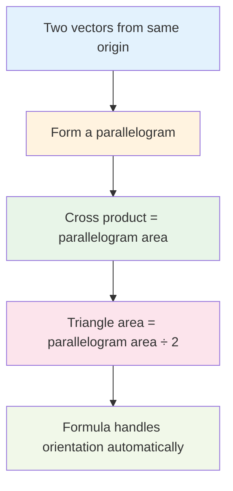

**Key Properties:**
- `|cross_product|` gives the absolute area (handles vertex ordering)
- Works for any triangle orientation (clockwise or counterclockwise)
- Numerically stable for coordinate-based calculations

---

## 📚 Step-by-Step Examples

### 🟢 Example 1: Simple Right Triangle

**Input:** `points = [[0,0], [0,1], [1,0]]`  
**Output:** `0.5`

```mermaid
graph TD
    A[Points: [0,0], [0,1], [1,0]] --> B[Apply formula:<br/>x₁=0, y₁=0<br/>x₂=0, y₂=1<br/>x₃=1, y₃=0]
    B --> C[Calculate:<br/>0×(1-0) + 0×(0-0) + 1×(0-1)]
    C --> D[Result: 0 + 0 + (-1) = -1]
    D --> E[Area = |-1| / 2 = 0.5 ✅]
    
    style A fill:#e8f5e8
    style E fill:#c8e6c9
```

**Step-by-step breakdown:**
1. **Identify vertices:** P₁(0,0), P₂(0,1), P₃(1,0)
2. **Apply formula:** Area = |x₁(y₂-y₃) + x₂(y₃-y₁) + x₃(y₁-y₂)| / 2
3. **Substitute:** |0×(1-0) + 0×(0-0) + 1×(0-1)| / 2
4. **Calculate:** |0 + 0 - 1| / 2 = 1/2 = 0.5

### 🔵 Example 2: Larger Triangle Selection

**Input:** `points = [[0,0], [0,1], [1,0], [0,2], [2,0]]`  
**Output:** `2.0`

```mermaid
graph TD
    A[5 points available] --> B[C(5,3) = 10 possible triangles]
    B --> C[Check all combinations]
    C --> D[Triangle [0,0], [0,2], [2,0]<br/>has largest area]
    D --> E[Area calculation:<br/>|0×(2-0) + 0×(0-0) + 2×(0-2)| / 2]
    E --> F[= |0 + 0 - 4| / 2 = 2.0 ✅]
    
    style A fill:#e1f5fe
    style F fill:#c8e6c9
```

**Why this triangle is largest:**
- Forms a right triangle with legs of length 2 each
- Area = (1/2) × base × height = (1/2) × 2 × 2 = 2.0
- Other combinations yield smaller areas

### 🟡 Example 3: Collinear Points

**Input:** `points = [[0,0], [1,1], [2,2]]`  
**Output:** `0.0`

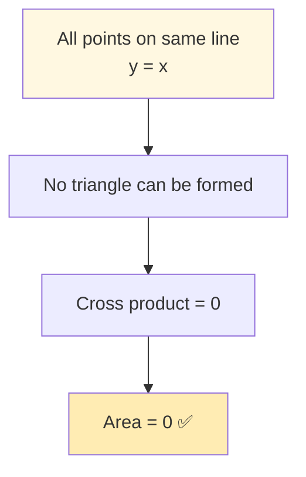

**Mathematical verification:**
- Points: (0,0), (1,1), (2,2)
- Formula: |0×(1-2) + 1×(2-0) + 2×(0-1)| / 2
- Calculation: |0×(-1) + 1×2 + 2×(-1)| / 2 = |0 + 2 - 2| / 2 = 0

---

## 🛠️ The Algorithm

### 🎯 Main Strategy: Exhaustive Search

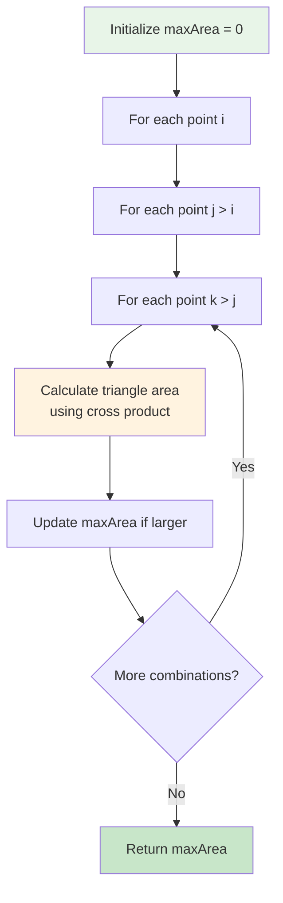

### 💻 Algorithm Complexity Analysis

```mermaid
graph TD
    A[Algorithm Analysis] --> B[Time Complexity: O(n³)]
    A --> C[Space Complexity: O(1)]
    
    B --> B1[Triple nested loops]
    B --> B2[Each combination checked once]
    B --> B3[n points → C(n,3) combinations]
    
    C --> C1[Only few variables used]
    C --> C2[No additional data structures]
    C --> C3[Constant auxiliary space]
    
    style A fill:#e3f2fd
    style B fill:#ffebee
    style C fill:#e8f5e8
```

**Detailed Complexity Breakdown:**
- **Time**: O(n³) where n is the number of points
  - Outer loop: n-2 iterations
  - Middle loop: n-1 iterations (on average)
  - Inner loop: n iterations (on average)
  - Total: (n-2) × (n-1) × n / 6 ≈ n³/6
- **Space**: O(1) - only storing maxArea and loop variables

### 🔧 Core Implementation Logic

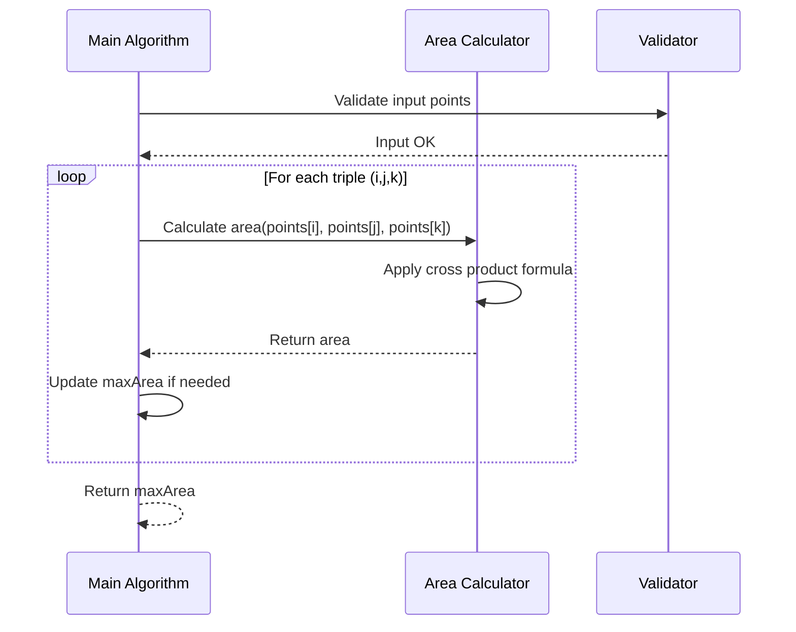

---

## 🧪 Test Cases & Edge Cases

### ✅ Normal Cases

| Input Points | Output | Explanation |
|-------------|--------|-------------|
| `[[0,0], [0,1], [1,0]]` | `0.5` | Right triangle, legs = 1 |
| `[[0,0], [0,2], [2,0]]` | `2.0` | Right triangle, legs = 2 |
| `[[1,1], [1,3], [3,1], [3,3]]` | `4.0` | Square vertices |

### ⚠️ Edge Cases

| Input Points | Output | Why |
|-------------|--------|-----|
| `[[0,0], [1,1], [2,2]]` | `0.0` | Collinear points |
| `[[0,0], [0,0], [1,1]]` | `0.0` | Duplicate points |
| `[[0,0], [1,0], [0,1]]` | `0.5` | Minimum input size |

### 🎯 Comprehensive Testing Strategy

```mermaid
graph TD
    A[Test Categories] --> B[Basic Triangles<br/>✅ Standard cases]
    A --> C[Edge Cases<br/>⚠️ Special handling]
    A --> D[Performance Tests<br/>🚀 Large inputs]
    A --> E[Precision Tests<br/>🔍 Floating-point accuracy]
    
    B --> B1[Right triangles]
    B --> B2[Obtuse triangles]
    B --> B3[Acute triangles]
    
    C --> C1[Collinear points]
    C --> C2[Duplicate points]
    C --> C3[Minimum input (3 points)]
    
    D --> D1[Maximum points (50)]
    D --> D2[Performance benchmarks]
    
    E --> E1[Very small areas]
    E --> E2[Large coordinate values]
    E --> E3[Precision boundaries]
    
    style B fill:#e8f5e8
    style C fill:#fff3e0
    style D fill:#e3f2fd
    style E fill:#f3e5f5
```

---

## 🎓 Key Concepts Mastery

### 📐 Computational Geometry Fundamentals

**1. Cross Product in 2D:**
```cpp
// For vectors u = (u₁, u₂) and v = (v₁, v₂)
double crossProduct2D = u₁ * v₂ - u₂ * v₁;
// Magnitude gives parallelogram area
```

**2. Triangle Area from Cross Product:**
```cpp
// Triangle with vertices A, B, C
// Vectors: AB = B - A, AC = C - A
// Area = |AB × AC| / 2
double area = abs(crossProduct(AB, AC)) / 2.0;
```

**3. Coordinate-Based Formula:**
```cpp
// Direct formula for triangle vertices (x₁,y₁), (x₂,y₂), (x₃,y₃)
double area = abs(x1*(y2-y3) + x2*(y3-y1) + x3*(y1-y2)) / 2.0;
```

### 🔍 Algorithm Design Patterns

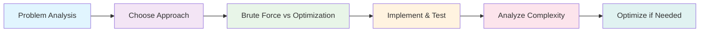

**When to Use Brute Force:**
- Small input constraints (n ≤ 50)
- Simple problem structure
- Optimization complexity outweighs benefits
- Clarity and correctness are priorities

### 🎯 Numerical Precision Considerations

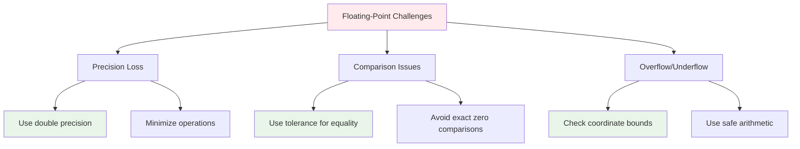

---

## 📊 Complexity Analysis

### ⏰ Time Complexity: O(n³)

**Why cubic complexity?**
- We examine all possible combinations of 3 points
- Number of combinations: C(n,3) = n!/(3!(n-3)!) = n(n-1)(n-2)/6
- For large n: C(n,3) ≈ n³/6, so O(n³)

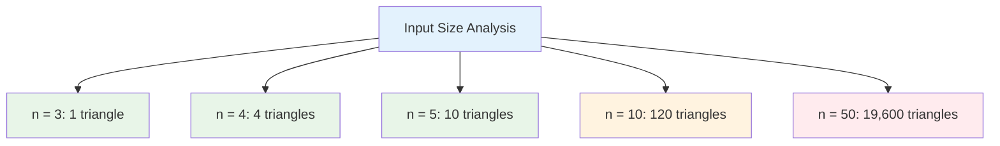

### 💾 Space Complexity: O(1)

**Why constant space?**
- Only store: maxArea, loop variables (i, j, k), temporary area
- No arrays, lists, or recursive calls
- Memory usage independent of input size

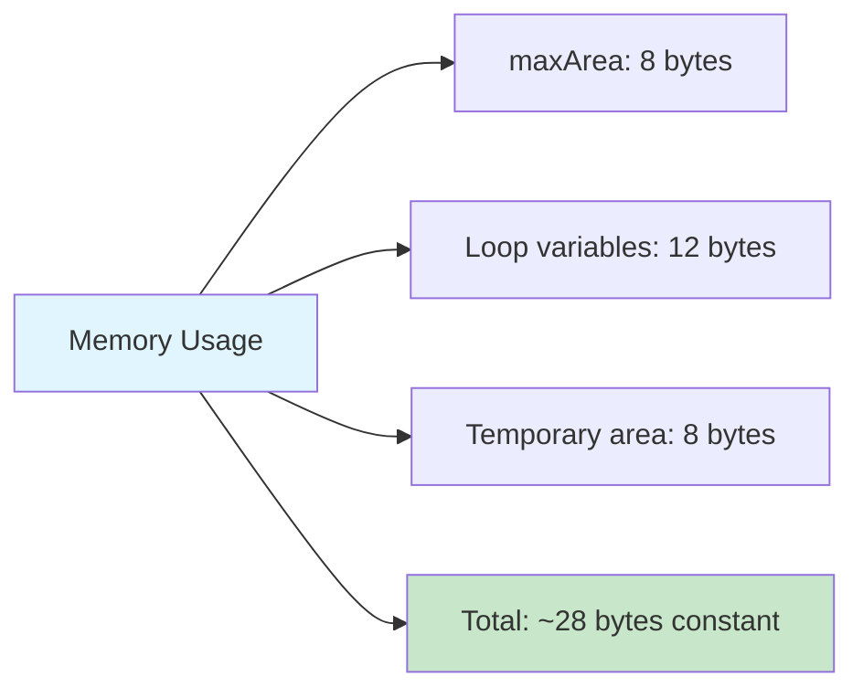

---

## 🌟 Advanced Optimization Techniques

### 🚀 Potential Optimizations (Beyond Scope)

```mermaid
graph TD
    A[Optimization Strategies] --> B[Convex Hull Approach]
    A --> C[Divide and Conquer]
    A --> D[Geometric Pruning]
    
    B --> B1[O(n log n) preprocessing]
    B --> B2[O(h³) where h = hull size]
    B --> B3[Best for dense point sets]
    
    C --> C1[Recursive subdivision]
    C --> C2[Complex implementation]
    C --> C3[Not always faster]
    
    D --> D1[Early termination]
    D --> D2[Spatial indexing]
    D --> D3[Problem-specific]
    
    style A fill:#e3f2fd
    style B fill:#e8f5e8
    style C fill:#fff3e0
    style D fill:#f3e5f5
```

**Note**: For the given constraints (n ≤ 50), brute force O(n³) is optimal due to:
- Low constant factors
- Simple implementation
- No preprocessing overhead
- Excellent cache locality

### 🔧 Implementation Optimizations

**1. Loop Optimization:**
```cpp
// Avoid redundant combinations
for (int i = 0; i < n - 2; ++i) {
    for (int j = i + 1; j < n - 1; ++j) {
        for (int k = j + 1; k < n; ++k) {
            // Process triangle (i, j, k)
        }
    }
}
```

**2. Numerical Stability:**
```cpp
// Use double precision for intermediate calculations
double crossProduct = static_cast<double>(x1) * (y2 - y3) + 
                     static_cast<double>(x2) * (y3 - y1) + 
                     static_cast<double>(x3) * (y1 - y2);
```

---

## 🌍 Real-World Applications

### 🏗️ Computer Graphics

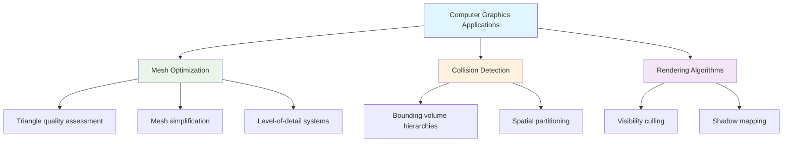

### 🗺️ Geographic Information Systems (GIS)

**Applications:**
- **Land Area Calculations**: Property boundaries, agricultural plots
- **Urban Planning**: Optimal facility placement, zone analysis
- **Environmental Studies**: Habitat area measurement, conservation planning
- **Navigation Systems**: Route optimization, coverage analysis

### 🤖 Robotics and AI

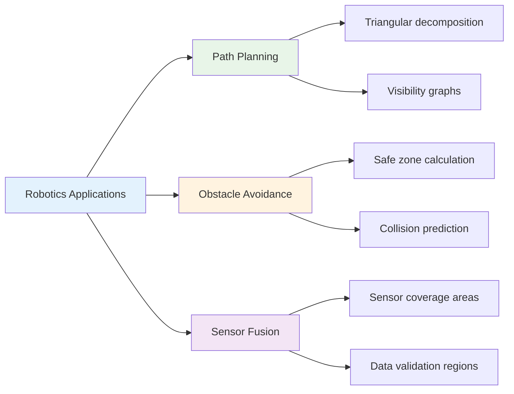

---

## 🚀 Practice Problems

Once you master this, try these related problems:

| Problem | Difficulty | Key Concept | LeetCode # |
|---------|------------|-------------|------------|
| 🔺 Valid Triangle Number | Medium | Triangle inequality | 611 |
| 📐 Minimum Area Rectangle | Medium | Computational geometry | 939 |
| 🎯 K Closest Points to Origin | Medium | Distance calculations | 973 |
| 🔄 Convex Hull | Hard | Advanced geometry | - |
| 📊 Largest Rectangle in Histogram | Hard | Area optimization | 84 |

### 🎓 Learning Progression

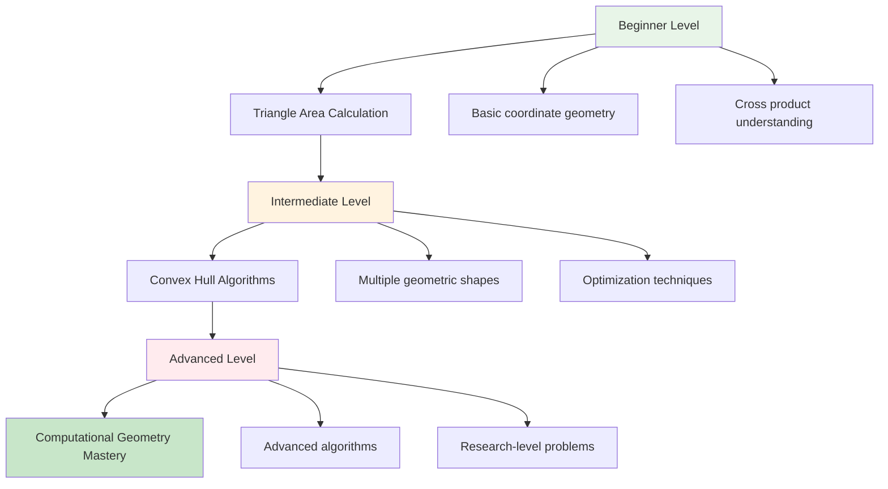

---

## 🎯 Quick Reference

### 🔑 Essential Formulas

```cpp
// Triangle area using cross product
double triangleArea(int x1, int y1, int x2, int y2, int x3, int y3) {
    double crossProduct = x1 * (y2 - y3) + x2 * (y3 - y1) + x3 * (y1 - y2);
    return abs(crossProduct) / 2.0;
}

// Brute force maximum area
double largestTriangleArea(vector<vector<int>>& points) {
    double maxArea = 0.0;
    int n = points.size();
    
    for (int i = 0; i < n - 2; ++i) {
        for (int j = i + 1; j < n - 1; ++j) {
            for (int k = j + 1; k < n; ++k) {
                double area = triangleArea(
                    points[i][0], points[i][1],
                    points[j][0], points[j][1],
                    points[k][0], points[k][1]
                );
                maxArea = max(maxArea, area);
            }
        }
    }
    
    return maxArea;
}
```

### 📝 Important Mathematical Concepts

```mermaid
graph LR
    A[Key Concepts] --> B[Cross Product<br/>u × v = u₁v₂ - u₂v₁]
    A --> C[Triangle Area<br/>A = |base × height| / 2]
    A --> D[Coordinate Formula<br/>A = |x₁(y₂-y₃) + x₂(y₃-y₁) + x₃(y₁-y₂)| / 2]
    
    style A fill:#e1f5fe
    style B fill:#e8f5e8
    style C fill:#fff3e0
    style D fill:#f3e5f5
```

### 🧠 Mental Model

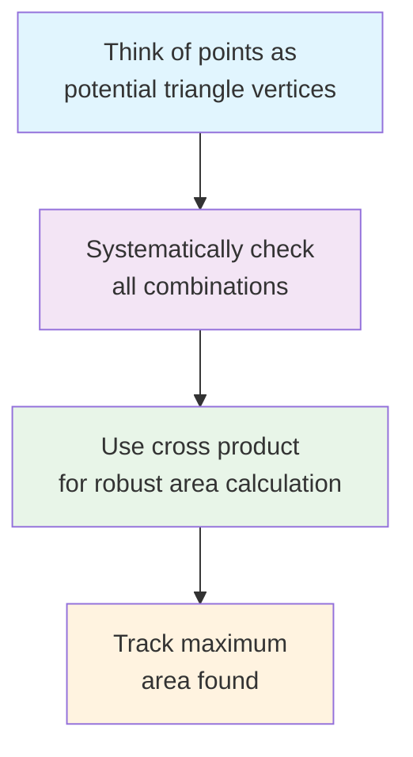

---

## 🏆 Mastery Checklist

- [ ] ✅ Understand cross product formula for triangle area
- [ ] ✅ Implement brute force enumeration correctly
- [ ] ✅ Handle floating-point precision appropriately
- [ ] ✅ Recognize when O(n³) is acceptable
- [ ] ✅ Deal with edge cases (collinear points, duplicates)
- [ ] ✅ Validate input constraints properly
- [ ] ✅ Write comprehensive test cases
- [ ] ✅ Analyze time and space complexity
- [ ] ✅ Understand real-world applications
- [ ] ✅ Connect to broader computational geometry concepts

---

## 💡 Pro Tips

1. **🔍 Geometric Intuition**: Always visualize the problem - draw points and triangles
2. **📐 Formula Mastery**: Memorize the cross product area formula - it's fundamental
3. **🧪 Test Edge Cases**: Collinear points and duplicates are common pitfalls
4. **⚡ Know When to Optimize**: For small constraints, simple solutions are often best
5. **🎯 Precision Matters**: Use double precision for geometric calculations
6. **📊 Complexity Analysis**: Understand why O(n³) is optimal for this problem size
7. **🌟 Pattern Recognition**: This problem teaches exhaustive search principles
8. **🔗 Connect Concepts**: Link to other geometric algorithms and applications

---

## 🎉 Advanced Insights

### 🔬 Mathematical Deep Dive

The cross product formula we use is actually the determinant of a 3×3 matrix:

```mermaid
graph TD
    A[Matrix Representation] --> B["| x₁  y₁  1 |<br/>| x₂  y₂  1 |<br/>| x₃  y₃  1 |"]
    B --> C[Determinant = x₁(y₂-y₃) - y₁(x₂-x₃) + 1(x₂y₃-x₃y₂)]
    C --> D[Simplifies to: x₁(y₂-y₃) + x₂(y₃-y₁) + x₃(y₁-y₂)]
    D --> E[Triangle Area = |Determinant| / 2]
    
    style A fill:#e1f5fe
    style B fill:#fff3e0
    style C fill:#f3e5f5
    style D fill:#e8f5e8
    style E fill:#c8e6c9
```

### 🚀 Performance Optimization Insights

For competitive programming and production systems:

```mermaid
graph TD
    A[Optimization Strategies] --> B[Algorithmic]
    A --> C[Implementation]
    A --> D[Hardware]
    
    B --> B1[Convex hull preprocessing]
    B --> B2[Geometric pruning]
    B --> B3[Early termination]
    
    C --> C1[Loop unrolling]
    C --> C2[SIMD instructions]
    C --> C3[Cache optimization]
    
    D --> D1[Parallel processing]
    D --> D2[GPU acceleration]
    D --> D3[Memory hierarchy]
    
    style A fill:#e3f2fd
    style B fill:#e8f5e8
    style C fill:#fff3e0
    style D fill:#f3e5f5
```

### 🎓 Educational Progression Path

```mermaid
flowchart TD
    A[Current Problem:<br/>Largest Triangle Area] --> B[Next Steps]
    
    B --> C[Convex Hull Algorithms<br/>Graham Scan, Jarvis March]
    B --> D[Line Intersection<br/>Computational Geometry]
    B --> E[Closest Pair of Points<br/>Divide and Conquer]
    
    C --> F[Advanced Geometry<br/>Voronoi Diagrams]
    D --> G[Polygon Algorithms<br/>Area, Containment]
    E --> H[Spatial Data Structures<br/>KD-Trees, R-Trees]
    
    F --> I[Research Level<br/>Computational Geometry]
    G --> I
    H --> I
    
    style A fill:#c8e6c9
    style B fill:#e1f5fe
    style I fill:#ffebee
```

---

**🎉 Congratulations! You now have a complete understanding of triangle area calculation and computational geometry fundamentals. This knowledge forms the foundation for advanced geometric algorithms and real-world applications in graphics, GIS, and robotics. Keep practicing and exploring the fascinating world of computational geometry!**
