# 📐 Largest Perimeter Triangle - Complete Geometry Guide

> **Master triangle formation and geometric optimization step by step!**

---

## 📖 What You'll Learn

By the end of this guide, you'll master:
- 🔺 **Triangle Inequality Theorem** - Understanding when three sides can form a triangle
- 📏 **Geometric Optimization** - Finding the largest possible perimeter efficiently
- 🎯 **Greedy Algorithm Design** - Making optimal local choices for global solutions
- 📊 **Sorting Applications** - Using sorted data for geometric problem solving

---

## 🎯 The Problem

### 📋 Problem Statement

**Given**: An integer array `nums` representing the lengths of sticks  
**Task**: Return the largest possible perimeter of a triangle with a non-zero area  
**Constraint**: You can choose any 3 sticks to form the triangle  
**Return**: The largest perimeter, or `0` if no triangle can be formed

**Important Rule**: A triangle can only be formed if the triangle inequality holds!

### 🌟 Real-World Example

Think of it like building a triangle with sticks:
- **[2,1,2]** → You can form a triangle with perimeter **5** (all three sticks)
- **[1,2,1]** → Same sticks, same triangle, perimeter **4** (wait, that's wrong - it's still **5**)
- **[3,2,3,4]** → Best triangle uses sticks **[3,3,4]** with perimeter **10**
- **[1,1,10]** → No triangle possible (1+1 < 10, violates triangle inequality)

---

## 🔍 Understanding Triangle Geometry

### 🏗️ What is the Triangle Inequality?

```mermaid
graph TD
    A[Triangle Inequality Theorem] --> B[For sides a, b, c]
    B --> C[a + b > c]
    B --> D[a + c > b] 
    B --> E[b + c > a]
    
    F[All three conditions<br/>must be true!] --> G[Valid Triangle ✅]
    H[Any condition fails] --> I[Invalid Triangle ❌]
    
    style A fill:#e1f5fe
    style G fill:#e8f5e8
    style I fill:#ffebee
```



**Think of it like this:**
- If you have three sticks, the sum of any two sides must be greater than the third side
- This ensures the triangle can actually "close" and form a shape with area > 0

### 🎲 Why Sort in Descending Order?

Here's the key insight for our greedy approach:

```mermaid
flowchart TD
    A[Array: [3,2,3,4]] --> B[Sort Descending: [4,3,3,2]]
    B --> C[Check First Triplet: 4,3,3]
    C --> D{4 < 3+3 ?<br/>4 < 6 ?}
    D -->|YES| E[Valid Triangle!<br/>Perimeter = 10]
    D -->|NO| F[Try Next Triplet: 3,3,2]
    F --> G{3 < 3+2 ?<br/>3 < 5 ?}
    G -->|YES| H[Valid Triangle!<br/>Perimeter = 8]
    
    style A fill:#e3f2fd
    style E fill:#c8e6c9
    style H fill:#fff3e0
```

**Why this works:**
- If `a ≥ b ≥ c` and `a < b + c`, then automatically `b < a + c` and `c < a + b`
- We only need to check one condition instead of three!
- Larger sides give larger perimeters, so checking from largest first finds the optimal solution

---

## 📚 Step-by-Step Examples

### 🟢 Example 1: Simple Valid Triangle

**Input:** `nums = [2,1,2]`  
**Output:** `5`

```mermaid
graph TD
    A[Start: [2,1,2]] --> B[Sort: [2,2,1]]
    B --> C[Check: 2,2,1]
    C --> D{2 < 2+1 ?<br/>2 < 3 ?}
    D -->|YES ✅| E[Valid Triangle!<br/>Perimeter = 2+2+1 = 5]
    
    style A fill:#e8f5e8
    style E fill:#c8e6c9
```

**Step-by-step breakdown:**
1. **Start:** `nums = [2,1,2]`
2. **Sort descending:** `[2,2,1]`
3. **Check first triplet:** `a=2, b=2, c=1`
4. **Triangle inequality:** `2 < 2+1 = 3` ✅ (True)
5. **Result:** `2+2+1 = 5`

### 🟡 Example 2: Multiple Valid Triangles

**Input:** `nums = [3,2,3,4]`  
**Output:** `10`

```mermaid
graph TD
    A[Start: [3,2,3,4]] --> B[Sort: [4,3,3,2]]
    B --> C[Check: 4,3,3]
    C --> D{4 < 3+3 ?<br/>4 < 6 ?}
    D -->|YES ✅| E[Valid Triangle!<br/>Perimeter = 4+3+3 = 10]
    D -->|NO| F[Try: 3,3,2]
    F --> G{3 < 3+2 ?<br/>3 < 5 ?}
    G -->|YES| H[Valid Triangle!<br/>Perimeter = 3+3+2 = 8]
    
    I[Choose Maximum: 10 > 8] --> J[Return 10]
    
    style A fill:#fff8e1
    style E fill:#c8e6c9
    style J fill:#ffecb3
```

**Why we get 10:**
- First valid triangle: `[4,3,3]` with perimeter `10`
- Since we check from largest to smallest, this is automatically the maximum!

### 🔴 Example 3: No Valid Triangle

**Input:** `nums = [1,1,10]`  
**Output:** `0`

```mermaid
graph TD
    A[Start: [1,1,10]] --> B[Sort: [10,1,1]]
    B --> C[Check: 10,1,1]
    C --> D{10 < 1+1 ?<br/>10 < 2 ?}
    D -->|NO ❌| E[Invalid Triangle]
    E --> F[No more triplets<br/>with 3+ elements]
    F --> G[Return 0]
    
    style A fill:#ffebee
    style E fill:#ffcdd2
    style G fill:#ff5252
```

**Why no triangle:**
- The longest side (10) is greater than the sum of the other two sides (1+1=2)
- This violates the triangle inequality: `10 ≮ 2`

### 🟣 Example 4: Edge Case - Exactly Three Elements

**Input:** `nums = [3,6,2]`  
**Output:** `0`

```mermaid
graph TD
    A[Start: [3,6,2]] --> B[Sort: [6,3,2]]
    B --> C[Check: 6,3,2]
    C --> D{6 < 3+2 ?<br/>6 < 5 ?}
    D -->|NO ❌| E[Invalid Triangle]
    E --> F[Only one possible triplet]
    F --> G[Return 0]
    
    style A fill:#f3e5f5
    style E fill:#ffcdd2
    style G fill:#ff5252
```

---

## 🛠️ The Algorithm

### 🎯 Main Strategy: Greedy with Sorting

```mermaid
flowchart TD
    A[Sort array in descending order] --> B[Initialize index i = 0]
    B --> C{i + 2 < array length?}
    C -->|No| D[Return 0<br/>No valid triangle found]
    C -->|Yes| E[Get triplet: a=nums[i], b=nums[i+1], c=nums[i+2]]
    E --> F{a < b + c ?<br/>Triangle inequality check}
    F -->|Yes| G[Return a + b + c<br/>Found largest perimeter!]
    F -->|No| H[Increment i]
    H --> C
    
    style A fill:#e8f5e8
    style F fill:#fff3e0
    style G fill:#c8e6c9
    style D fill:#ffebee
```

### 💻 The Core Algorithm

```cpp
int largestPerimeter(vector<int>& nums) {
    // Step 1: Sort in descending order for greedy approach
    sort(nums.begin(), nums.end(), greater<int>());
    
    int n = nums.size();
    
    // Step 2: Check each possible triplet from largest to smallest
    for (int i = 0; i < n - 2; i++) {
        int a = nums[i];     // Largest side
        int b = nums[i + 1]; // Second largest side  
        int c = nums[i + 2]; // Third largest side
        
        // Step 3: Check triangle inequality (only need one condition!)
        if (a < b + c) {
            return a + b + c;  // Found the largest valid perimeter
        }
    }
    
    // Step 4: No valid triangle found
    return 0;
}
```

### 🛡️ Why Only One Inequality Check?

**Mathematical Proof:**

```mermaid
graph TD
    A[Given: a ≥ b ≥ c] --> B[If a < b + c]
    B --> C[Then b < a + c<br/>✅ Always true]
    B --> D[And c < a + b<br/>✅ Always true]
    
    E[Proof for b < a + c:] --> F[Since a ≥ b, we have a + c ≥ b + c > b]
    G[Proof for c < a + b:] --> H[Since a ≥ c and b ≥ c, we have a + b ≥ 2c > c]
    
    style A fill:#e1f5fe
    style B fill:#fff3e0
    style C fill:#e8f5e8
    style D fill:#e8f5e8
```



**The Logic:**
- Since `a` is the largest side, if `a < b + c`, then the other two inequalities are automatically satisfied
- This reduces our check from 3 conditions to just 1!

---

## 🧪 Test Cases & Edge Cases

### ✅ Normal Cases

| Input | Sorted | Check | Output | Explanation |
|-------|--------|-------|--------|-------------|
| `[2,1,2]` | `[2,2,1]` | `2 < 2+1` ✅ | `5` | Simple valid triangle |
| `[3,2,3,4]` | `[4,3,3,2]` | `4 < 3+3` ✅ | `10` | Multiple options, largest chosen |
| `[1,2,2,3]` | `[3,2,2,1]` | `3 < 2+2` ✅ | `7` | All elements used optimally |

### ⚠️ Edge Cases

| Input | Sorted | Check | Output | Why |
|-------|--------|-------|--------|-----|
| `[1,1,10]` | `[10,1,1]` | `10 < 1+1` ❌ | `0` | Triangle inequality violated |
| `[3,6,2]` | `[6,3,2]` | `6 < 3+2` ❌ | `0` | Largest side too big |
| `[1,2]` | `[2,1]` | N/A | `0` | Less than 3 elements |
| `[5,5,5]` | `[5,5,5]` | `5 < 5+5` ✅ | `15` | Equilateral triangle |

### 🎯 Boundary Testing Categories

```mermaid
graph TD
    A[Test Categories] --> B[Valid Triangles<br/>✅ Should return perimeter]
    A --> C[Invalid Triangles<br/>❌ Should return 0]
    A --> D[Edge Cases<br/>⚠️ Special handling]
    
    B --> B1[Regular: [2,1,2] → 5]
    B --> B2[Multiple valid: [3,2,3,4] → 10]
    B --> B3[Equilateral: [5,5,5] → 15]
    
    C --> C1[Inequality fails: [1,1,10] → 0]
    C --> C2[All fail: [1,2,4,8] → 0]
    
    D --> D1[Minimum size: [1,2] → 0]
    D --> D2[Large numbers: [1000000,999999,999998] → ?]
    D --> D3[All same: [3,3,3,3] → 9]
    
    style B fill:#e8f5e8
    style C fill:#ffebee
    style D fill:#fff3e0
```

---

## 🎓 Key Concepts Mastery

### 🔺 Triangle Inequality Deep Dive

**The Three Conditions (for sides a, b, c):**
```cpp
// All three must be true for a valid triangle
bool isValidTriangle(int a, int b, int c) {
    return (a + b > c) && (a + c > b) && (b + c > a);
}
```

**Optimized Check (when a ≥ b ≥ c):**
```cpp
// Only need to check one condition!
bool isValidTriangleOptimized(int a, int b, int c) {
    return a < b + c;  // Other conditions automatically satisfied
}
```

### 📊 Sorting Strategy Analysis


### 🎯 Greedy Algorithm Pattern


**Greedy Proof:**
1. **Greedy Choice**: Always try the largest available sides first
2. **Optimal Substructure**: If `[a,b,c]` is optimal, no larger valid triangle exists
3. **Correctness**: Since we sort descending, the first valid triangle has maximum perimeter

---

## 📊 Complexity Analysis

### ⏰ Time Complexity: O(n log n)

**Breakdown:**
- **Sorting**: `O(n log n)` - Dominant operation
- **Linear scan**: `O(n)` - Check each triplet once
- **Overall**: `O(n log n + n) = O(n log n)`

```mermaid
graph TD
    A[Time Complexity Analysis] --> B[Sorting: O(n log n)]
    A --> C[Scanning: O(n)]
    A --> D[Total: O(n log n)]
    
    B --> B1[Comparison-based sort<br/>Cannot do better than n log n]
    C --> C1[At most n-2 triplets to check<br/>Each check is O(1)]
    D --> D1[Sorting dominates<br/>the overall complexity]
    
    style A fill:#e3f2fd
    style B fill:#fff3e0
    style C fill:#e8f5e8
    style D fill:#ffecb3
```

**Why O(n log n) is optimal:**
- We need to consider all possible triplets to guarantee the maximum
- Without sorting, we'd need O(n³) to check all combinations
- Sorting allows us to use greedy approach and reduce to O(n)

### 💾 Space Complexity: O(1)

**Space Analysis:**
- **Auxiliary space**: `O(1)` - Only a few variables (`i`, `a`, `b`, `c`, `n`)
- **In-place sorting**: Most sort implementations use O(log n) stack space
- **Practical space**: `O(log n)` due to sorting recursion

```mermaid
graph TD
    A[Space Complexity] --> B[Variables: O(1)]
    A --> C[Sorting stack: O(log n)]
    A --> D[Total: O(log n)]
    
    B --> B1[Fixed number of<br/>integer variables]
    C --> C1[Recursion depth<br/>for quicksort/mergesort]
    D --> D1[Practically constant<br/>for reasonable input sizes]
    
    style A fill:#e1f5fe
    style B fill:#e8f5e8
    style C fill:#fff3e0
    style D fill:#ffecb3
```

---

## 🚀 Real-World Applications

### 🏗️ Engineering & Construction


**Example**: Given steel beams of various lengths, find the largest triangular support structure.

### 🎮 Game Development


### 📐 Computer Graphics

**Applications:**
- **Mesh Optimization**: Creating triangles with maximum area from available vertices
- **Texture Mapping**: Optimal triangle subdivision for texture coordinates
- **Ray Tracing**: Efficient triangle intersection with maximum surface area

### 🏭 Manufacturing & Logistics


---

## 🔧 Advanced Optimizations & Variations

### 🚀 Performance Optimizations

**1. Early Termination Enhancement:**
```cpp
int largestPerimeterOptimized(vector<int>& nums) {
    if (nums.size() < 3) return 0;  // Early exit
    
    sort(nums.begin(), nums.end(), greater<int>());
    
    for (int i = 0; i <= nums.size() - 3; ++i) {
        if (nums[i] < nums[i+1] + nums[i+2]) {
            return nums[i] + nums[i+1] + nums[i+2];
        }
    }
    return 0;
}
```

**2. Memory-Efficient Sorting:**
```cpp
// Use partial_sort if we only need top candidates
partial_sort(nums.begin(), nums.begin() + min(nums.size(), 100), 
             nums.end(), greater<int>());
```

### 🎯 Algorithm Variations

**1. All Valid Triangles (not just largest):**
```cpp
vector<vector<int>> allValidTriangles(vector<int>& nums) {
    vector<vector<int>> result;
    sort(nums.begin(), nums.end(), greater<int>());
    
    for (int i = 0; i < nums.size() - 2; i++) {
        for (int j = i + 1; j < nums.size() - 1; j++) {
            for (int k = j + 1; k < nums.size(); k++) {
                if (nums[i] < nums[j] + nums[k]) {
                    result.push_back({nums[i], nums[j], nums[k]});
                }
            }
        }
    }
    return result;
}
```

**2. K-Largest Perimeters:**
```cpp
vector<int> kLargestPerimeters(vector<int>& nums, int k) {
    vector<int> perimeters;
    sort(nums.begin(), nums.end(), greater<int>());
    
    for (int i = 0; i < nums.size() - 2 && perimeters.size() < k; i++) {
        if (nums[i] < nums[i+1] + nums[i+2]) {
            perimeters.push_back(nums[i] + nums[i+1] + nums[i+2]);
        }
    }
    return perimeters;
}
```

### 📈 Complexity Comparison

```mermaid
graph TD
    A[Algorithm Variations] --> B[Original: O(n log n)]
    A --> C[All Triangles: O(n³)]
    A --> D[K-Largest: O(n log n)]
    A --> E[Partial Sort: O(n + k log k)]
    
    B --> B1[Optimal for single<br/>largest perimeter]
    C --> C1[Exponential growth<br/>for comprehensive analysis]
    D --> D1[Same complexity<br/>early termination at k]
    E --> E1[Better when k << n<br/>specialized use cases]
    
    style B fill:#e8f5e8
    style C fill:#ffebee
    style D fill:#fff3e0
    style E fill:#e1f5fe
```

---

## 🎯 Practice Problems & Extensions

### 🔗 Related LeetCode Problems

| Problem | Difficulty | Key Concept | Relationship |
|---------|------------|-------------|--------------|
| 🔺 [Valid Triangle Number (611)](https://leetcode.com/problems/valid-triangle-number/) | Medium | Triangle inequality | Count valid triangles |
| 📐 [Minimum Area Rectangle (939)](https://leetcode.com/problems/minimum-area-rectangle/) | Medium | Geometric optimization | Area vs perimeter optimization |
| 🎯 [3Sum Closest (16)](https://leetcode.com/problems/3sum-closest/) | Medium | Triplet optimization | Similar greedy approach |
| 📊 [Largest Triangle Area (812)](https://leetcode.com/problems/largest-triangle-area/) | Easy | Geometric calculation | Area vs perimeter |

### 🧩 Challenge Extensions

**1. 3D Triangle (Tetrahedron) Perimeter:**
- Given 6 edge lengths, find the largest valid tetrahedron surface perimeter
- Requires checking 4 triangle inequality conditions

**2. Weighted Triangle Perimeter:**
- Each stick has a weight, find triangle with maximum perimeter-to-weight ratio
- Combines optimization with constraint satisfaction

**3. Dynamic Triangle Formation:**
- Sticks can be broken into smaller pieces
- Find optimal breaking strategy for maximum triangle perimeter

### 🎓 Learning Progression


---

## 🏆 Mastery Checklist

### 📚 Conceptual Understanding
- [ ] ✅ Understand triangle inequality theorem and its three conditions
- [ ] ✅ Know why sorting in descending order enables greedy approach
- [ ] ✅ Grasp the mathematical proof for single inequality check
- [ ] ✅ Recognize when greedy algorithms are applicable

### 💻 Implementation Skills
- [ ] ✅ Implement the basic O(n log n) solution
- [ ] ✅ Handle edge cases (< 3 elements, no valid triangles)
- [ ] ✅ Optimize with early termination and input validation
- [ ] ✅ Write comprehensive test cases

### 🔧 Advanced Techniques
- [ ] ✅ Solve variations (all triangles, k-largest, weighted)
- [ ] ✅ Apply to real-world geometric problems
- [ ] ✅ Understand space-time tradeoffs in different approaches
- [ ] ✅ Connect to related algorithmic patterns

### 🎯 Problem-Solving Framework
- [ ] ✅ Identify geometric optimization problems
- [ ] ✅ Apply greedy strategy with proper justification
- [ ] ✅ Validate solutions with mathematical proofs
- [ ] ✅ Extend solutions to handle constraints and variations

---

## 💡 Pro Tips & Best Practices

### 🛡️ Implementation Guidelines

1. **🔍 Input Validation**: Always check for minimum array size before processing
2. **📊 Sort Strategy**: Use `greater<int>()` for descending sort - cleaner than custom comparator
3. **⚡ Early Exit**: Return immediately when first valid triangle found (greedy property)
4. **🧪 Edge Case Testing**: Test with arrays of size 0, 1, 2, and various triangle validity scenarios

### 🎯 Debugging Strategies

```mermaid
graph TD
    A[Common Issues] --> B[Wrong Sort Order]
    A --> C[Off-by-One Errors]
    A --> D[Triangle Inequality Logic]
    
    B --> B1[Use greater<int>() for descending<br/>Check: largest elements first]
    C --> C1[Loop condition: i < n-2<br/>Array access: nums[i+2]]
    D --> D1[Check: a < b + c<br/>Not: a + b > c]
    
    style A fill:#ffebee
    style B1 fill:#fff3e0
    style C1 fill:#e8f5e8
    style D1 fill:#e1f5fe
```

### 🚀 Performance Considerations

**For Large Inputs (n > 10⁶):**
- Consider using `partial_sort` if only checking first few candidates
- Profile memory usage if sorting very large arrays
- Use `reserve()` for vectors if building result collections

**For Real-Time Applications:**
- Cache sorted results if input doesn't change frequently
- Use approximate algorithms if exact optimum not required
- Consider parallel sorting for extremely large datasets

### 🎨 Code Style Best Practices

```cpp
// ✅ Good: Clear variable names and structure
int largestPerimeter(vector<int>& nums) {
    if (nums.size() < 3) return 0;
    
    sort(nums.begin(), nums.end(), greater<int>());
    
    for (size_t i = 0; i <= nums.size() - 3; ++i) {
        int a = nums[i], b = nums[i+1], c = nums[i+2];
        if (a < b + c) {
            return a + b + c;
        }
    }
    return 0;
}

// ❌ Avoid: Unclear logic and poor naming
int solve(vector<int>& v) {
    sort(v.rbegin(), v.rend());
    for (int i = 0; i < v.size()-2; i++)
        if (v[i] < v[i+1] + v[i+2]) return v[i] + v[i+1] + v[i+2];
    return 0;
}
```

---

## 🎉 Conclusion & Next Steps

### 🌟 What You've Mastered

You now have a comprehensive understanding of:
- **Geometric Algorithms**: Triangle inequality and its applications
- **Greedy Optimization**: When and how to apply greedy strategies
- **Sorting Applications**: Using sorted data for efficient problem solving
- **Mathematical Proofs**: Justifying algorithmic correctness with geometry

### 🚀 Continue Your Journey

**Next Recommended Problems:**
1. **Valid Triangle Number (LeetCode 611)** - Count all valid triangles
2. **3Sum Closest (LeetCode 16)** - Similar triplet optimization pattern
3. **Largest Triangle Area (LeetCode 812)** - Geometric calculation focus

**Advanced Topics to Explore:**
- **Computational Geometry**: Convex hulls, polygon triangulation
- **Dynamic Programming**: Optimal polygon triangulation
- **Graph Theory**: Triangle detection in graphs

---

**🎯 Remember**: The key insight is recognizing that sorting enables greedy optimization in geometric problems. This pattern appears frequently in competitive programming and real-world applications!

**Happy coding and keep exploring the beautiful intersection of mathematics and algorithms! 🔺✨**
