# Day 40: 🔢 Finding Three-Digit Even Numbers - Complete Beginner's Guide

> **Master array permutations and constraint checking step by step!**

---

## 📖 What You'll Learn

By the end of this guide, you'll master:
- 🔄 **Permutation Generation** - Creating all possible combinations from an array
- 🎯 **Constraint Filtering** - Checking multiple conditions efficiently
- 🗂️ **Set Operations** - Automatic deduplication and sorting
- 🧮 **Number Formation** - Building integers from individual digits

---

## 🎯 The Problem

### 📋 Problem Statement

**Given**: An integer array `digits` where each element is between 0 and 9  
**Task**: Return all unique three-digit even integers that can be formed  
**Rules**:
- Each digit from the array can be used at most once per number
- Numbers must be three digits (100-999)
- Numbers must be even
- Return in ascending sorted order

### 🌟 Real-World Example

Think of it like having physical digit cards:
- **Cards: [2, 1, 3, 0]** 
- You can arrange them to form: **102, 120, 130, 132, 210, 230, 302, 310, 312, 320**
- You can't reuse a card in the same number
- The first card can't be 0 (would be a 2-digit number)
- The last card must be even (0, 2, 4, 6, 8)

---

## 🔍 Understanding the Basics

### 🏗️ What Makes a Valid Three-Digit Even Number?

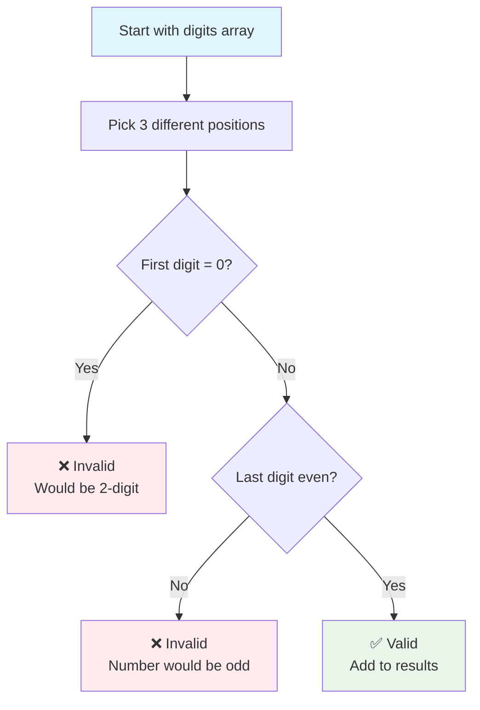

**Three Critical Constraints:**
1. **Distinct Indices**: Each position (i, j, k) must be different
2. **No Leading Zero**: First digit cannot be 0
3. **Even Last Digit**: Last digit must be 0, 2, 4, 6, or 8

### 🎲 Number Formation Process

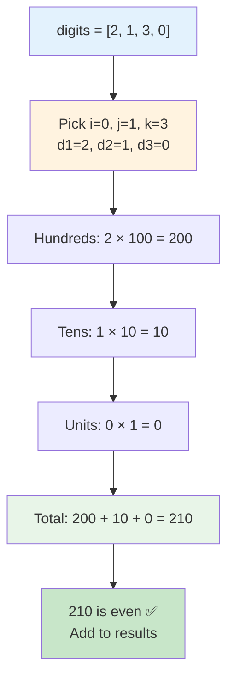

**Building Formula:**
```
number = (hundreds_digit × 100) + (tens_digit × 10) + (units_digit × 1)
```

---

## 📚 Step-by-Step Examples

### 🟢 Example 1: Basic Case

**Input:** `digits = [2, 1, 3, 0]`  
**Output:** `[102, 120, 130, 132, 210, 230, 302, 310, 312, 320]`

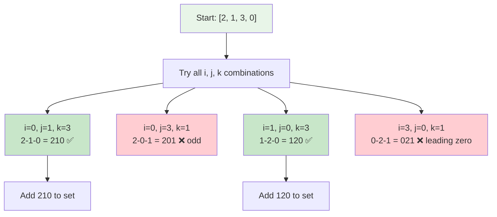

**Detailed Walkthrough:**

| i | j | k | d1 | d2 | d3 | Number | Valid? | Reason |
|---|---|---|----|----|-------|--------|--------|--------|
| 0 | 1 | 2 | 2  | 1  | 3     | 213    | ❌     | Odd (last=3) |
| 0 | 1 | 3 | 2  | 1  | 0     | 210    | ✅     | Even, no leading 0 |
| 0 | 2 | 1 | 2  | 3  | 1     | 231    | ❌     | Odd (last=1) |
| 0 | 2 | 3 | 2  | 3  | 0     | 230    | ✅     | Even, no leading 0 |
| 1 | 0 | 2 | 1  | 2  | 3     | 123    | ❌     | Odd (last=3) |
| 1 | 0 | 3 | 1  | 2  | 0     | 120    | ✅     | Even, no leading 0 |
| ... | ... | ... | ... | ... | ... | ... | ... | Continue for all... |

**Set automatically removes duplicates and sorts!**

### 🟡 Example 2: Duplicate Digits

**Input:** `digits = [2, 2, 8, 8, 2]`  
**Output:** `[222, 228, 282, 288, 822, 828, 882]`

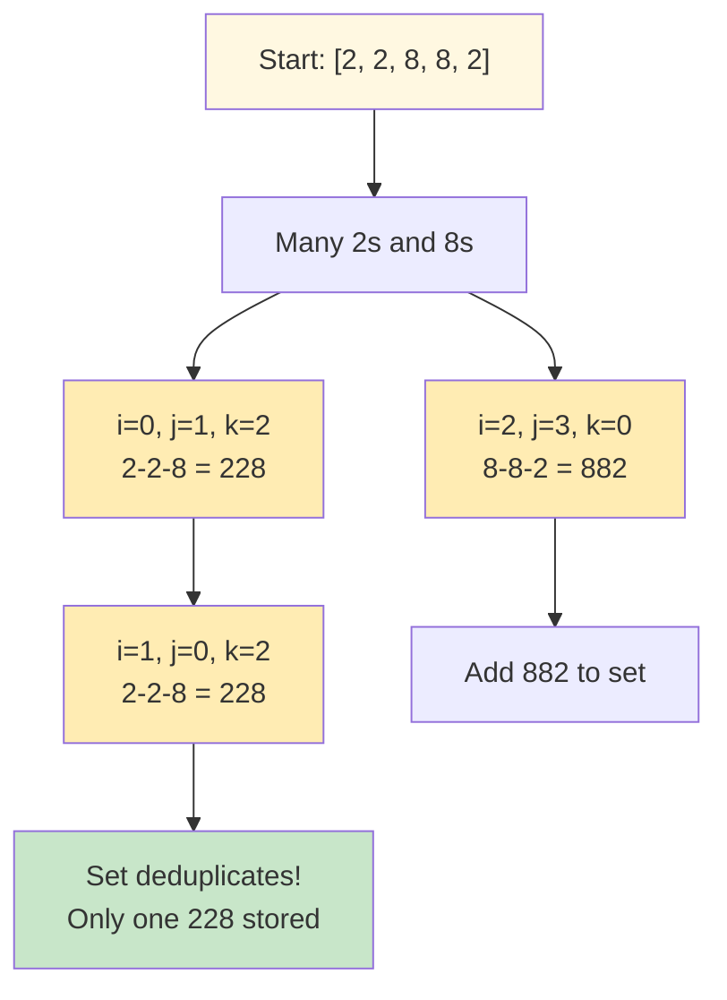

**Why Duplicates Occur:**
- Array has multiple 2s at different indices
- Different index combinations can form same number
- **Set automatically handles this!** Only stores unique values

### 🔴 Example 3: No Valid Numbers

**Input:** `digits = [1, 3, 5]`  
**Output:** `[]`

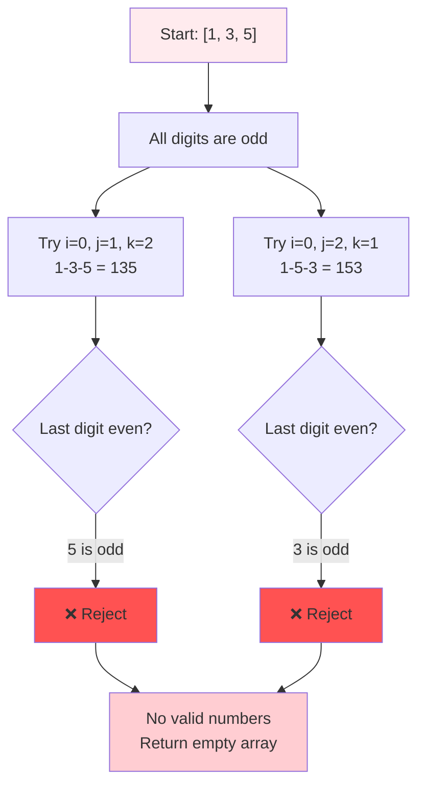

**Key Learning:**
- If all digits are odd, **no even numbers possible**
- The last digit determines if entire number is even/odd

### 🔵 Example 4: Leading Zero Cases

**Input:** `digits = [0, 0, 1, 2]`  
**Output:** `[100, 102, 120, 200, 210]`

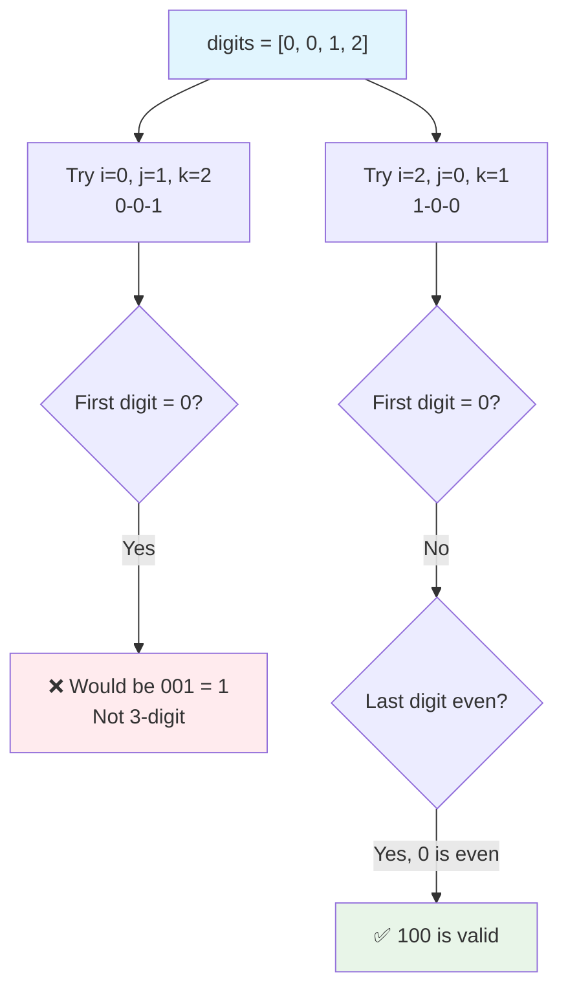

**Important:**
- Leading zeros make it a 2-digit number (001 = 1)
- Zeros in middle/end positions are fine (102, 210)
- Zero is considered even!

---

## 🛠️ The Algorithm

### 🎯 Main Strategy: Triple Loop with Constraints

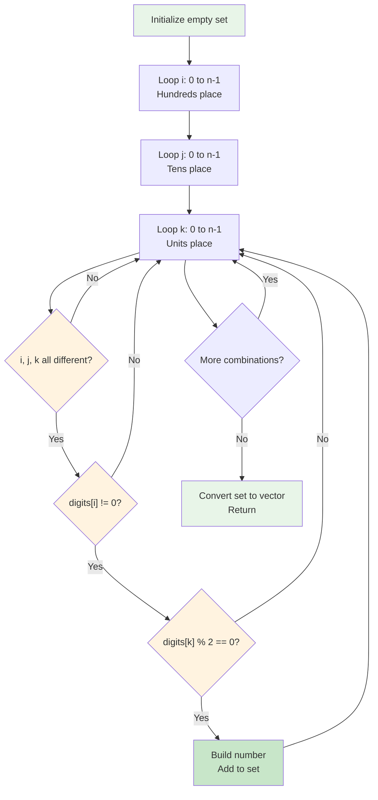

### 💻 The Code

```cpp
vector<int> findEvenNumbers(vector<int>& digits) {
    set<int> st;  // 🗂️ Auto-sorts and removes duplicates
    int n = digits.size();
    
    // 🔄 Try every possible combination of three positions
    for (int i = 0; i < n; i++) {           // Hundreds place
        for (int j = 0; j < n; j++) {       // Tens place
            for (int k = 0; k < n; k++) {   // Units place
                
                // ✅ CONSTRAINT 1: Different indices
                if (i == j || j == k || i == k) {
                    continue;  // Skip if reusing same position
                }
                
                // 📊 Extract digits
                int d1 = digits[i];  // Hundreds
                int d2 = digits[j];  // Tens
                int d3 = digits[k];  // Units
                
                // ✅ CONSTRAINT 2: No leading zero
                if (d1 == 0) {
                    continue;  // Would be 2-digit number
                }
                
                // ✅ CONSTRAINT 3: Last digit must be even
                if (d3 % 2 != 0) {
                    continue;  // Odd number, skip
                }
                
                // 🏗️ BUILD: Form the three-digit number
                int num = d1 * 100 + d2 * 10 + d3;
                
                // 📥 ADD: Insert into set
                st.insert(num);  // Duplicates auto-handled
            }
        }
    }
    
    // 📤 RETURN: Convert set to vector (maintains sorted order)
    return vector<int>(st.begin(), st.end());
}
```

### 🗂️ Why Use a Set?

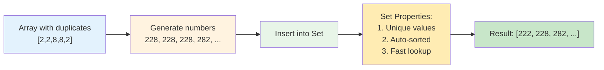

**Set Benefits:**
1. **Automatic Deduplication**: Same number inserted multiple times? Set keeps only one.
2. **Sorted Order**: Set maintains ascending order internally
3. **Efficient**: O(log m) insertion time where m = current set size

---

## 🧪 Test Cases & Edge Cases

### ✅ Normal Cases

| Input | Output | Count | Why |
|-------|--------|-------|-----|
| `[2, 1, 3, 0]` | `[102, 120, 130, 132, 210, 230, 302, 310, 312, 320]` | 10 | Multiple valid combinations |
| `[2, 2, 8, 8, 2]` | `[222, 228, 282, 288, 822, 828, 882]` | 7 | Duplicates handled by set |
| `[3, 7, 5, 0]` | `[350, 370, 530, 730, 750]` | 5 | Zero in end positions |

### ⚠️ Edge Cases

| Input | Output | Why |
|-------|--------|-----|
| `[1, 3, 5]` | `[]` | All odd digits, no even numbers possible |
| `[0, 0, 1, 2]` | `[100, 102, 120, 200, 210]` | Leading zeros filtered out |
| `[1, 2, 3]` | `[132, 312]` | Minimum size, only 2 even numbers |
| `[2, 4, 6]` | 12 numbers | All even digits, many combinations |
| `[0, 2, 4, 6, 8]` | Many numbers | Zero can be in middle/end only |

### 🎯 Constraint Testing

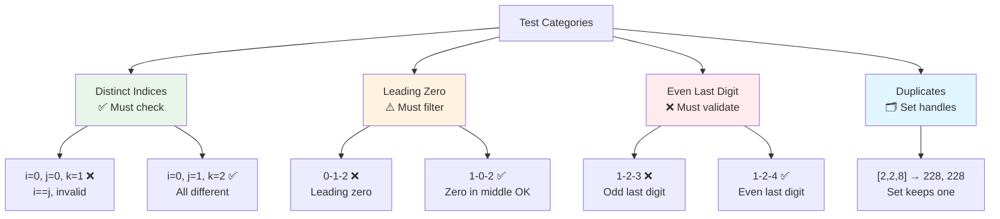

---

## 🎓 Key Concepts Mastery

### 🔢 Permutation vs Combination

**Permutation** (Order Matters):
- [1, 2, 3] and [3, 2, 1] are **different**
- Our problem: 123 ≠ 321 ✅ We care about order!

**Combination** (Order Doesn't Matter):
- {1, 2, 3} and {3, 2, 1} are the **same**
- Not our problem

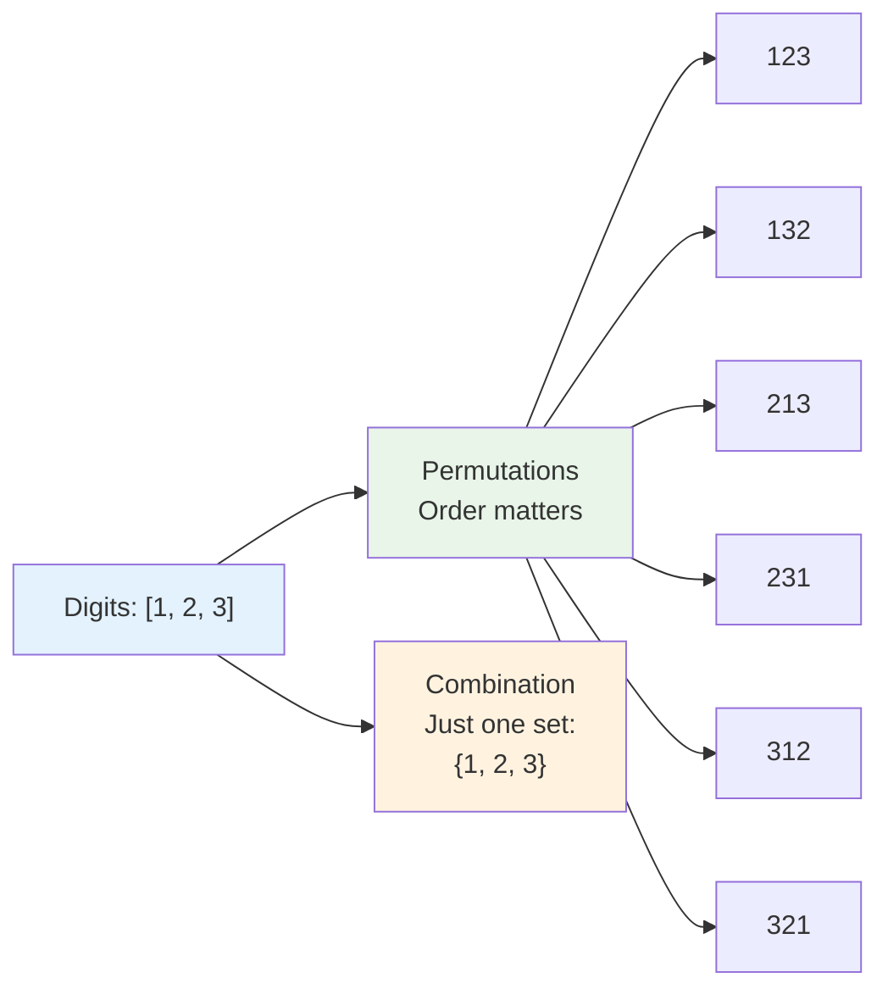

### ⚠️ Constraint Checking Pattern

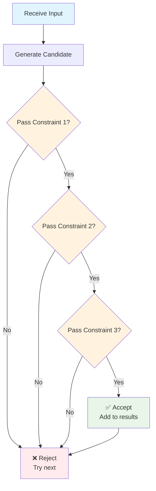

**Pattern to Remember:**
```cpp
if (!constraint1) continue;  // Early exit if fails
if (!constraint2) continue;  // Check next constraint
if (!constraint3) continue;  // Final check
// All constraints passed - process the data
```

### 🎯 Set vs Vector Decision

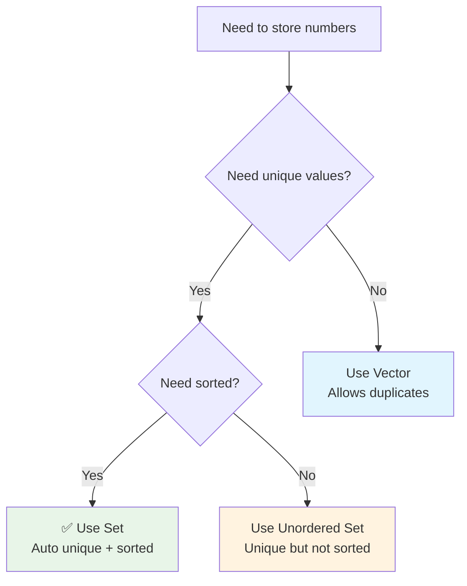

**When to Use Set:**
- ✅ Need unique elements
- ✅ Need sorted order
- ✅ Frequent insertions
- ⚠️ O(log n) insertion (slightly slower than vector)

**When to Use Vector:**
- ✅ Allow duplicates
- ✅ Need index access
- ✅ O(1) insertion at end
- ⚠️ Need manual sorting/deduplication

---

## 📊 Complexity Analysis

### ⏰ Time Complexity: O(n³ + m log m)

**Breaking it down:**

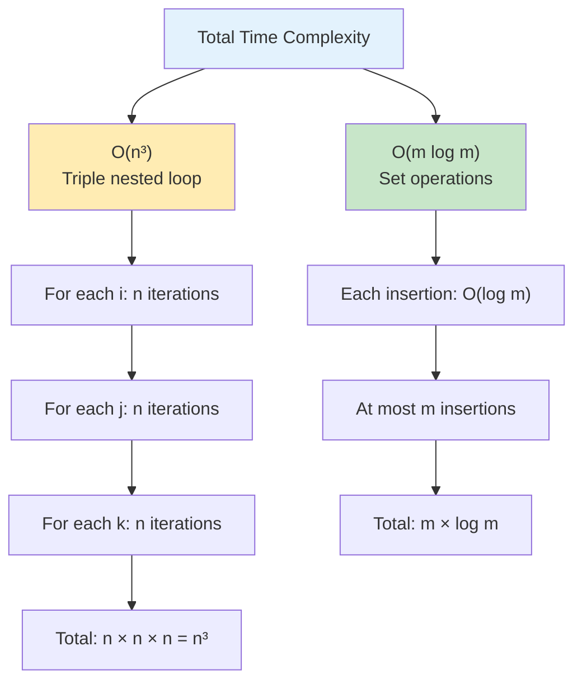

**Detailed Analysis:**
1. **Triple Loop**: O(n³)
   - Outer loop: n iterations (i from 0 to n-1)
   - Middle loop: n iterations (j from 0 to n-1)
   - Inner loop: n iterations (k from 0 to n-1)
   - Total combinations checked: n × n × n = n³

2. **Set Insertions**: O(m log m)
   - Each `st.insert()` takes O(log m) where m = current set size
   - Maximum m = 450 (there are 900 three-digit numbers, half are even)
   - Total: m × log m, but m ≤ 450 (constant in practice)

3. **Set to Vector Conversion**: O(m)
   - Copying m elements from set to vector
   - Linear time

**Overall**: O(n³ + m log m) where n = input size, m = number of valid results

**For typical LeetCode constraints** (n ≤ 100):
- n³ = 100³ = 1,000,000 operations (manageable)
- m log m = 450 × log(450) ≈ 450 × 9 = 4,050 operations
- **Dominated by n³ term**

### 💾 Space Complexity: O(m)

**Where m = number of unique valid numbers**

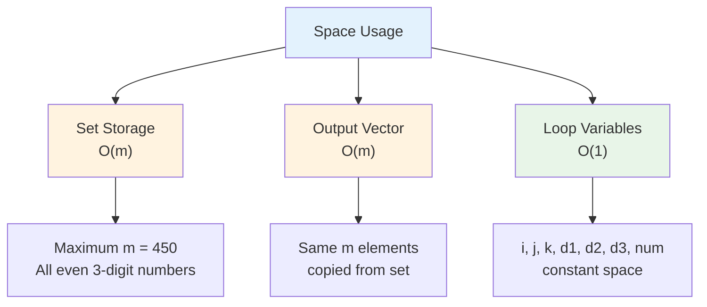

**Why O(m) not O(n³)?**
- We don't store all n³ combinations
- Only store valid unique numbers in the set
- Maximum possible: 450 numbers (100-998, only even)

**Space Breakdown:**
- Set: O(m) where m ≤ 450
- Result vector: O(m)
- Temporary variables: O(1)
- **Total**: O(m) = O(1) since m is bounded by constant 450

---

## 🚀 Practice Problems

Once you master this, try these similar problems:

| Problem | Difficulty | Key Concept |
|---------|------------|-------------|
| 🔢 Three Sum | Medium | Triple loop, constraint checking |
| 🎲 Permutations | Medium | Generating all arrangements |
| 🧮 Combination Sum | Medium | Backtracking with constraints |
| 🔄 Next Permutation | Medium | Permutation manipulation |
| 🎯 Letter Combinations | Medium | Combinatorial generation |

---

## 💼 Interview Questions & Answers

### ❓ Question 1: Why use a set instead of vector?

**Answer:**  
A set automatically handles two requirements:
1. **Uniqueness**: When digits array has duplicates (like `[2, 2, 8, 8, 2]`), different index combinations can create the same number. Set automatically removes duplicates.
2. **Sorting**: Set maintains elements in sorted order, so we don't need to sort manually.

**Simple Explanation:**  
```cpp
// Without set (manual approach):
vector<int> result;
// ... generate all numbers
sort(result.begin(), result.end());           // Need to sort
result.erase(unique(result.begin(), result.end()), result.end()); // Remove duplicates

// With set (automatic):
set<int> st;
// ... generate all numbers with st.insert()
return vector<int>(st.begin(), st.end());     // Already sorted and unique!
```

It's like having a smart assistant who automatically organizes and deduplicates your data!

---

### ❓ Question 2: What happens when we have multiple same digits?

**Answer:**  
Multiple same digits create different index combinations but same numbers.

**Example:**
```cpp
digits = [2, 2, 8]  // Two 2s at index 0 and 1

i=0, j=1, k=2 → 2-2-8 = 228  ✓
i=1, j=0, k=2 → 2-2-8 = 228  ✓ (duplicate)

Set only keeps one copy of 228!
```

**Simple Explanation:**  
Think of having two identical coins. You can pick them in different orders (first coin, second coin vs second coin, first coin), but you still end up with the same total value. The set recognizes this and stores only one value.

---

### ❓ Question 3: Why check `i == j || j == k || i == k`?

**Answer:**  
This ensures we use three **different positions** from the array, not the same digit multiple times.

**Simple Explanation:**
```cpp
digits = [1, 2, 3]

// WRONG: Reusing same position
i=0, j=0, k=1 → digits[0]-digits[0]-digits[1] = 1-1-2 = 112
// But we only have ONE 1 in the array!

// RIGHT: Different positions
i=0, j=1, k=2 → digits[0]-digits[1]-digits[2] = 1-2-3 = 123
```

It's like having 3 cards in your hand - you can't use the same card twice in one number!

---

### ❓ Question 4: Why is zero special for the first digit?

**Answer:**  
Because leading zeros don't exist in standard number representation.

**Simple Explanation:**
```cpp
0-1-2 = 012 = 12 (two-digit number, not three-digit!)
1-0-2 = 102 ✓ (three-digit number)
```

When you write "012", it's really just "12". The problem asks for **three-digit** numbers (100-999), so the first digit must be 1-9, never 0.

Think of it like filling out a form: you write "102" not "012" for one hundred and two.

---

### ❓ Question 5: How do you check if a number is even?

**Answer:**  
A number is even if its last digit is divisible by 2.

**Simple Explanation:**
```cpp
digit % 2 == 0  →  Even (0, 2, 4, 6, 8)
digit % 2 != 0  →  Odd  (1, 3, 5, 7, 9)

Examples:
123 % 2 = 1 (odd)   → last digit is 3
124 % 2 = 0 (even)  → last digit is 4
```

**Why only check last digit?**
- 123 = odd because 3 is odd
- 124 = even because 4 is even
- The last digit determines if the entire number is even or odd!

Think of it like a chain - one odd link makes the whole chain odd!

---

### ❓ Question 6: What's the maximum number of valid results?

**Answer:**  
Maximum 450 unique three-digit even numbers.

**Math Breakdown:**
```
Three-digit numbers: 100 to 999
Total three-digit numbers: 900

Even numbers: 100, 102, 104, ..., 998
Count: 900 ÷ 2 = 450
```

**Simple Explanation:**  
Even if your digits array could form every possible three-digit even number, there are only 450 of them (half of 900 three-digit numbers are even).

In practice, you'll get far fewer because:
- Limited distinct digits in input
- Many combinations filtered by constraints

---

### ❓ Question 7: Can you optimize the O(n³) time complexity?

**Answer:**  
Yes! Use a **frequency map approach** to reduce to O(1000).

**Optimized Approach:**
```cpp
vector<int> findEvenNumbers(vector<int>& digits) {
    vector<int> freq(10, 0);
    
    // Count frequency of each digit
    for (int d : digits) {
        freq[d]++;
    }
    
    vector<int> result;
    
    // Generate all three-digit even numbers (100-998)
    for (int num = 100; num <= 998; num += 2) {  // Only even
        int d1 = num / 100;
        int d2 = (num / 10) % 10;
        int d3 = num % 10;
        
        // Check if we have enough of each digit
        freq[d1]--;
        freq[d2]--;
        freq[d3]--;
        
        if (freq[d1] >= 0 && freq[d2] >= 0 && freq[d3] >= 0) {
            result.push_back(num);
        }
        
        // Restore frequencies
        freq[d1]++;
        freq[d2]++;
        freq[d3]++;
    }
    
    return result;
}
```

**Time Complexity:** O(450) = O(1) constant time!  
**Space Complexity:** O(1) only need frequency array of size 10

**Simple Explanation:**  
Instead of trying all combinations of positions (n³), try all possible even three-digit numbers (450) and check if we have the needed digits. It's like checking a menu instead of trying to cook every possible dish!

---

### ❓ Question 8: When would the brute force approach be better?

**Answer:**  
When the input array is very small (n ≤ 5).

**Comparison:**

| Approach | Best When | Time Complexity |
|----------|-----------|-----------------|
| **Brute Force (Triple Loop)** | n ≤ 5 | O(n³) = O(125) |
| **Frequency Map** | n > 5 | O(450) = O(1) |

**Simple Explanation:**
```
n = 3: n³ = 27 operations (brute force wins)
n = 10: n³ = 1000 operations (frequency map wins)
n = 50: n³ = 125,000 operations (frequency map definitely wins!)
```

For tiny inputs, the simpler brute force code is easier to understand and debug. For larger inputs, the optimized approach is necessary.

---

### ❓ Question 9: How does the set maintain sorted order?

**Answer:**  
C++ `set` is implemented as a **Red-Black Tree** (self-balancing binary search tree).

**Simple Explanation:**

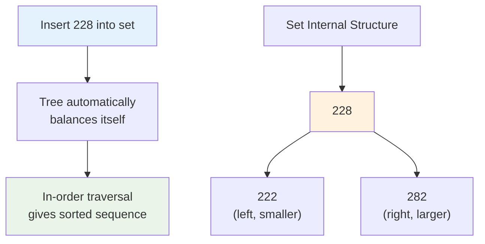

When you iterate through a set (`st.begin()` to `st.end()`), you get elements in sorted order automatically. It's like a self-organizing bookshelf that always keeps books alphabetically arranged!

**Key Properties:**
- Insert: O(log m)
- Search: O(log m)
- Always sorted: Free!
- No duplicates: Automatic!

---

### ❓ Question 10: What if we need to allow duplicate numbers in results?

**Answer:**  
Use a `vector` instead of `set`, then manually sort.

**Modified Code:**
```cpp
vector<int> findEvenNumbers(vector<int>& digits) {
    vector<int> result;  // Changed from set
    int n = digits.size();
    
    for (int i = 0; i < n; i++) {
        for (int j = 0; j < n; j++) {
            for (int k = 0; k < n; k++) {
                if (i == j || j == k || i == k) continue;
                
                int d1 = digits[i], d2 = digits[j], d3 = digits[k];
                
                if (d1 == 0) continue;
                if (d3 % 2 != 0) continue;
                
                int num = d1 * 100 + d2 * 10 + d3;
                result.push_back(num);  // Allow duplicates
            }
        }
    }
    
    sort(result.begin(), result.end());  // Manual sort
    return result;
}
```

**Simple Explanation:**  
It's like collecting all raffle tickets instead of just unique numbers - you keep every single one, even duplicates, then organize them later.

---

### 🎯 Common Interview Follow-ups

**Q: "Can you handle four-digit numbers?"**  
A: Add one more loop and adjust constraints:
```cpp
for (int i = 0; i < n; i++) {      // Thousands
    for (int j = 0; j < n; j++) {  // Hundreds
        for (int k = 0; k < n; k++) {  // Tens
            for (int l = 0; l < n; l++) {  // Units
                // Check all different: i,j,k,l
                // Check d1 != 0 (four-digit)
                // Check d4 % 2 == 0 (even)
                int num = d1*1000 + d2*100 + d3*10 + d4;
            }
        }
    }
}
```
Time complexity becomes O(n⁴).

**Q: "What about odd numbers instead of even?"**  
A: Change the condition:
```cpp
if (d3 % 2 == 0) continue;  // Skip even, keep odd
```

**Q: "What if digits can be reused?"**  
A: Remove the distinct index check:
```cpp
// Remove this line:
// if (i == j || j == k || i == k) continue;
```

---

## 🎯 Quick Reference

### 🔑 Essential Code Patterns

```cpp
// Check if number is even
if (digit % 2 == 0) {  // Even: 0, 2, 4, 6, 8
    // Process
}

// Build three-digit number from digits
int number = hundreds * 100 + tens * 10 + units;

// Use set for uniqueness and sorting
set<int> st;
st.insert(value);  // Auto-deduplicates and sorts

// Convert set to vector
return vector<int>(st.begin(), st.end());

// Check distinct indices
if (i == j || j == k || i == k) {
    continue;  // Skip if any are same
}
```

### 📝 Important Constraints

```cpp
// Three-digit number range
100 ≤ number ≤ 999

// Even numbers
number % 2 == 0

// No leading zeros
first_digit != 0

// Use different array positions
i != j && j != k && i != k
```

### 🧠 Mental Model

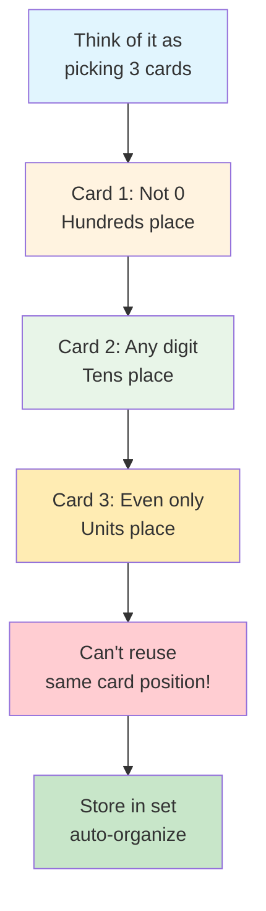

---

## 🏆 Mastery Checklist

- [ ] ✅ Understand triple nested loop for permutation generation
- [ ] ✅ Know how to check distinct indices
- [ ] ✅ Master leading zero detection and filtering
- [ ] ✅ Understand even/odd checking with modulo
- [ ] ✅ Know when to use set vs vector
- [ ] ✅ Understand set automatic sorting and deduplication
- [ ] ✅ Build numbers from individual digits correctly
- [ ] ✅ Handle edge cases (all odd, all zeros, duplicates)
- [ ] ✅ Analyze time complexity O(n³ + m log m)
- [ ] ✅ Recognize space complexity O(m) where m ≤ 450
- [ ] ✅ Explain optimization to O(450) with frequency map
- [ ] ✅ Answer common interview questions confidently

---

## 💡 Pro Tips

1. **🗂️ Set is Your Friend**: For uniqueness + sorting, always consider `set<int>` first
2. **🔢 Constraint Order Matters**: Check cheapest constraints first (index comparison before calculations)
3. **🧪 Test Edge Cases**: All odd digits, all zeros, minimum input size (3 digits)
4. **📚 Pattern Recognition**: Triple loop pattern appears in many combinatorial problems
5. **🎯 Visualize Small Examples**: Draw out the process for `[1, 2, 3]` to understand deeply
6. **💼 Know the Optimization**: Frequency map approach for interview bonus points
7. **🛡️ Explain Trade-offs**: Brute force is simpler; optimization is faster for large n
8. **🎨 Draw Diagrams**: Visualize the constraint checking flow for clarity

---

**🎉 Congratulations! You now have complete mastery of permutation generation, constraint filtering, and efficient deduplication using sets. This pattern is fundamental to many combinatorial problems. Keep practicing and happy coding!**