# Day 47: 🔄 Convert 1D Array Into 2D Array - Complete Beginner's Guide

> **Master array transformation and dimension validation step by step!**

---

## 📖 What You'll Learn

By the end of this guide, you'll master:
- 🔢 **Array Reshaping** - How to transform 1D arrays into 2D arrays
- ✅ **Dimension Validation** - Ensuring conversions are mathematically possible
- 🎯 **Index Mapping** - Understanding how 1D indices map to 2D coordinates
- 🧮 **Row-Major Order** - The standard way to fill multi-dimensional arrays

---

## 🎯 The Problem

### 📋 Problem Statement

**Given**: A 1D integer array `original` and two integers `m` and `n`  
**Task**: Construct a 2D array with `m` rows and `n` columns using all elements from `original`  
**Catch**: If it's impossible to form such an array, return an empty 2D array

**Important Rule**: You must use ALL elements from the original array exactly once!

### 🌟 Real-World Example

Think of it like arranging books on shelves:
- **Original Array**: `[1, 2, 3, 4, 5, 6]` (books in a box)
- **m = 2 rows, n = 3 columns** (2 shelves, each holding 3 books)
- **Result**: `[[1, 2, 3], [4, 5, 6]]` (books arranged on shelves)

But if you have 5 books and want 2 shelves with 3 spots each (6 spots total), it won't work - you'd have an empty spot!

---

## 🔍 Understanding the Basics

### 🏗️ What is Array Reshaping?

```mermaid
flowchart TD
    A["1D Array: [1, 2, 3, 4, 5, 6]"] --> B["Reshape to 2×3"]
    B --> C["2D Array:<br/>[[1, 2, 3],<br/> [4, 5, 6]]"]
    
    style A fill:#e1f5fe
    style B fill:#fff3e0
    style C fill:#e8f5e8
```

**Think of it like a transformation:**
- **Input**: A single row of elements (1D)
- **Process**: Divide into multiple rows (2D)
- **Output**: A grid/matrix structure

### 🎲 Dimension Validation Magic

Here's the critical rule for valid conversions:


**Key Rule:**
- **Total elements needed** = `m × n` (rows × columns)
- **Total elements available** = `original.size()`
- These MUST be equal!

---

## 📚 Step-by-Step Examples

### 🟢 Example 1: Perfect Fit (2×2 Array)

**Input:** `original = [1, 2, 3, 4]`, `m = 2`, `n = 2`  
**Output:** `[[1, 2], [3, 4]]`

```mermaid
flowchart TD
    A["Start: [1, 2, 3, 4]<br/>m=2, n=2"] --> B["Validation:<br/>4 == 2×2? ✅"]
    B --> C["Row 0: [1, 2]"]
    C --> D["Row 1: [3, 4]"]
    D --> E["Result:<br/>[[1, 2],<br/> [3, 4]]"]
    
    style A fill:#e8f5e8
    style B fill:#fff3e0
    style E fill:#c8e6c9
```

**Step-by-step breakdown:**
1. **Validation:** `original.size() = 4`, `m × n = 2 × 2 = 4` ✅ Valid!
2. **Create 2D array:** 2 rows, 2 columns (all zeros initially)
3. **Fill Row 0:**
   - `ans[0][0] = original[0] = 1`
   - `ans[0][1] = original[1] = 2`
4. **Fill Row 1:**
   - `ans[1][0] = original[2] = 3`
   - `ans[1][1] = original[3] = 4`
5. **Done!** Return `[[1, 2], [3, 4]]`

### 🟡 Example 2: Single Row (1×3 Array)

**Input:** `original = [1, 2, 3]`, `m = 1`, `n = 3`  
**Output:** `[[1, 2, 3]]`

```mermaid
flowchart TD
    A["Start: [1, 2, 3]<br/>m=1, n=3"] --> B["Validation:<br/>3 == 1×3? ✅"]
    B --> C["Row 0: [1, 2, 3]"]
    C --> D["Result:<br/>[[1, 2, 3]]"]
    
    style A fill:#fff8e1
    style B fill:#fff3e0
    style D fill:#ffecb3
```

**Special Case: Horizontal Array**
- Only 1 row, so all elements go into that single row
- This is like keeping books in one long shelf

### 🔵 Example 3: Single Column (3×1 Array)

**Input:** `original = [1, 2, 3]`, `m = 3`, `n = 1`  
**Output:** `[[1], [2], [3]]`

```mermaid
flowchart TD
    A["Start: [1, 2, 3]<br/>m=3, n=1"] --> B["Validation:<br/>3 == 3×1? ✅"]
    B --> C["Row 0: [1]"]
    C --> D["Row 1: [2]"]
    D --> E["Row 2: [3]"]
    E --> F["Result:<br/>[[1],<br/> [2],<br/> [3]]"]
    
    style A fill:#e3f2fd
    style B fill:#fff3e0
    style F fill:#bbdefb
```

**Special Case: Vertical Array**
- Each row has only 1 element
- This is like stacking books vertically

### 🔴 Example 4: Impossible Conversion

**Input:** `original = [1, 2]`, `m = 1`, `n = 1`  
**Output:** `[]`

```mermaid
flowchart TD
    A["Start: [1, 2]<br/>m=1, n=1"] --> B{"Validation:<br/>2 == 1×1?"}
    B -->|"No: 2 ≠ 1"| C["❌ STOP!<br/>Return empty array"]
    
    style A fill:#ffebee
    style B fill:#fff3e0
    style C fill:#ef5350
```

**Why it fails:**
- We have 2 elements: `[1, 2]`
- We need space for 1 × 1 = 1 element
- **Mismatch!** We have too many elements

---

## 🛠️ The Algorithm

### 🎯 Main Strategy: Validate, Then Fill


### 💻 The Code

```cpp
vector<vector<int>> construct2DArray(vector<int>& original, int m, int n) {
    // 🚨 CRITICAL: Validate dimensions first
    if (original.size() != m * n) {
        return {};  // Return empty array if impossible
    }
    
    // 🏗️ CREATE: Initialize 2D array with m rows and n columns
    vector<vector<int>> ans(m, vector<int>(n, 0));
    
    // 📍 TRACK: Current position in original array
    int index = 0;
    
    // 🔄 FILL: Process row by row
    for (int i = 0; i < m; i++) {        // Each row
        for (int j = 0; j < n; j++) {    // Each column in the row
            ans[i][j] = original[index++];  // Map 1D → 2D
        }
    }
    
    return ans;
}
```

### 🛡️ Dimension Validation Explained

**Why do we check `original.size() != m * n`?**


**The Math:**
- If `m = 3` and `n = 4`, we need exactly `3 × 4 = 12` elements
- If `original = [1, 2, ..., 12]` (12 elements), perfect! ✅
- If `original = [1, 2, ..., 10]` (10 elements), not enough! ❌
- If `original = [1, 2, ..., 15]` (15 elements), too many! ❌

---

## 🧪 Test Cases & Edge Cases

### ✅ Normal Cases

| Input | m | n | Output | Why |
|-------|---|---|--------|-----|
| `[1,2,3,4]` | 2 | 2 | `[[1,2],[3,4]]` | Perfect 2×2 grid |
| `[1,2,3]` | 1 | 3 | `[[1,2,3]]` | Single row |
| `[1,2,3,4,5,6]` | 2 | 3 | `[[1,2,3],[4,5,6]]` | 2 rows, 3 columns |
| `[1,2,3,4,5,6]` | 3 | 2 | `[[1,2],[3,4],[5,6]]` | 3 rows, 2 columns |

### ⚠️ Edge Cases

| Input | m | n | Output | Why |
|-------|---|---|--------|-----|
| `[]` | 0 | 0 | `[]` | Empty input |
| `[1]` | 1 | 1 | `[[1]]` | Single element |
| `[1,2]` | 1 | 1 | `[]` | Size mismatch (2 ≠ 1) |
| `[1,2,3]` | 2 | 2 | `[]` | Size mismatch (3 ≠ 4) |
| `[1,2,3,4,5]` | 2 | 3 | `[]` | Size mismatch (5 ≠ 6) |

### 🎯 Boundary Testing


---

## 🎓 Key Concepts Mastery

### 🔢 Index Mapping Techniques

**Understanding the 1D → 2D Transformation:**

```mermaid
flowchart LR
    A["1D Index: k"] --> B["Row: i = k ÷ n"]
    A --> C["Column: j = k % n"]
    B --> D["2D Position: [i][j]"]
    C --> D
    
    style A fill:#e3f2fd
    style B fill:#f3e5f5
    style C fill:#f3e5f5
    style D fill:#e8f5e8
```

**Example with `n = 3` (3 columns):**
```
1D index: 0  1  2  3  4  5  6  7  8
         ↓  ↓  ↓  ↓  ↓  ↓  ↓  ↓  ↓
2D [row][col]:
         [0][0] [0][1] [0][2]  ← Row 0
         [1][0] [1][1] [1][2]  ← Row 1
         [2][0] [2][1] [2][2]  ← Row 2
```

**Formula:**
- **Row index:** `i = k / n` (integer division)
- **Column index:** `j = k % n` (modulo)

**Example:** For `k = 5` with `n = 3`:
- Row: `5 / 3 = 1`
- Column: `5 % 3 = 2`
- Position: `[1][2]`

### 🎯 Row-Major vs Column-Major Order


**Our Solution Uses Row-Major Order:**
```cpp
for (int i = 0; i < m; i++) {      // Rows first (outer loop)
    for (int j = 0; j < n; j++) {  // Columns second (inner loop)
        ans[i][j] = original[index++];
    }
}
```

### ⚠️ Validation Patterns


**Pattern to Remember:**
```cpp
// Always validate BEFORE allocating memory
if (original.size() != m * n) {
    return {};  // Early return prevents wasted work
}
// Safe to proceed with array creation
vector<vector<int>> ans(m, vector<int>(n, 0));
```

### 🎯 Problem-Solving Framework

```mermaid
flowchart TD
    A["Read Problem"] --> B["Identify Constraints<br/>m, n, array size"]
    B --> C["Plan Validation<br/>size == m×n?"]
    C --> D["Design Algorithm<br/>Nested loops"]
    D --> E["Handle Edge Cases<br/>Empty, single element"]
    E --> F["Implement Solution"]
    F --> G["Test Thoroughly"]
    
    style A fill:#e1f5fe
    style B fill:#f3e5f5
    style C fill:#fff3e0
    style D fill:#e8f5e8
    style E fill:#fce4ec
    style F fill:#e0f2f1
    style G fill:#f1f8e9
```

---

## 📊 Complexity Analysis

### ⏰ Time Complexity: O(m × n)

**Why is it O(m × n)?**
- We have nested loops: outer loop runs `m` times, inner loop runs `n` times
- Total iterations: `m × n`
- Each iteration does constant work (one assignment)


**Breakdown:**
- **Validation check:** O(1) - single comparison
- **Creating 2D array:** O(m × n) - allocate m × n spaces
- **Filling array:** O(m × n) - assign m × n elements
- **Total:** O(1) + O(m × n) + O(m × n) = **O(m × n)**

### 💾 Space Complexity: O(1) or O(m × n)

**Depends on how we count:**

```mermaid
flowchart TD
    A["Space Complexity"] --> B["Without counting output:<br/>O(1)"]
    A --> C["Including output:<br/>O(m × n)"]
    
    B --> D["Only use: index variable<br/>Constant extra space"]
    C --> E["Output array: m × n elements<br/>Linear in output size"]
    
    style A fill:#e3f2fd
    style B fill:#e8f5e8
    style C fill:#fff3e0
```

**Analysis:**
- **Auxiliary space (excluding output):** O(1)
  - Only variable: `index` (single integer)
  - No recursion, no extra arrays
- **Total space (including output):** O(m × n)
  - Output array: `m × n` integers
  - This is required space for the answer

**Convention:** Usually we report **O(1)** auxiliary space since output doesn't count as "extra" space.

---

## 🚀 Practice Problems

Once you master this, try these similar problems:

| Problem | Difficulty | Key Concept |
|---------|------------|-------------|
| 🔢 Reshape the Matrix (LeetCode 566) | Easy | Array reshaping |
| 🧮 Transpose Matrix (LeetCode 867) | Easy | 2D array manipulation |
| 💫 Spiral Matrix (LeetCode 54) | Medium | 2D traversal patterns |
| 🔄 Rotate Image (LeetCode 48) | Medium | In-place 2D transformation |
| 📐 Set Matrix Zeroes (LeetCode 73) | Medium | 2D array modification |

---

## 💼 Interview Questions & Answers

### ❓ Question 1: Why do we need to validate the dimensions?

**Answer:**  
Without validation, we could have:
- **Too few elements:** Can't fill all m × n positions
- **Too many elements:** Don't know where to put extra elements

**Simple Explanation:**  
It's like having 5 books but only 4 shelf spots, or having 3 books but 5 shelf spots. Neither works perfectly!

**Code Consequence:**
```cpp
// Without validation:
// original = [1, 2, 3], m = 2, n = 2 (need 4 elements)
// We'd try to access original[3] which doesn't exist! 💥
```

---

### ❓ Question 2: Can we solve this without using extra space?

**Answer:**  
No, because:
- We MUST create a 2D array as output (the problem requires it)
- The output inherently requires O(m × n) space

**Simple Explanation:**  
You can't arrange books on shelves without having shelves! The 2D array IS the answer, so we must allocate it.

**Alternative Approach (same space):**
```cpp
// Using index formula instead of tracking variable
vector<vector<int>> ans(m, vector<int>(n));
for (int k = 0; k < original.size(); k++) {
    ans[k / n][k % n] = original[k];
}
```
This uses a formula instead of `index++`, but still uses O(m × n) space for output.

---

### ❓ Question 3: What's the difference between this approach and using the index formula?

**Answer:**  

**Approach 1: Counter Variable (Our Solution)**
```cpp
int index = 0;
for (int i = 0; i < m; i++) {
    for (int j = 0; j < n; j++) {
        ans[i][j] = original[index++];
    }
}
// Simple, readable, easy to understand
```

**Approach 2: Index Formula**
```cpp
for (int k = 0; k < original.size(); k++) {
    ans[k / n][k % n] = original[k];
}
// More compact, but requires understanding division/modulo
```

**Simple Explanation:**  
Both work identically! Approach 1 is like counting "1, 2, 3..." while Approach 2 is like calculating positions mathematically. Choose based on readability preference.

---

### ❓ Question 4: What if m or n is zero?

**Answer:**  
```cpp
// Case 1: m = 0, n = 0, original = []
// original.size() = 0, m * n = 0
// 0 == 0 → Valid! Returns empty 2D array []

// Case 2: m = 0, n = 5, original = []  
// original.size() = 0, m * n = 0
// 0 == 0 → Valid! Returns []

// Case 3: m = 0, n = 5, original = [1, 2]
// original.size() = 2, m * n = 0
// 2 != 0 → Invalid! Returns []
```

**Simple Explanation:**  
Zero dimensions are valid only if the original array is also empty. It's like having zero shelves - you can only "arrange" zero books!

---

### ❓ Question 5: Can this be done in-place?

**Answer:**  
**No, it's impossible** because:
- 1D array: contiguous memory block
- 2D array: array of arrays (different structure)
- Can't change data structure without new allocation

**Simple Explanation:**  
You can't turn a single long shelf into multiple shelves without building new shelves! The structure itself is fundamentally different.

**What we CAN'T do:**
```cpp
// This doesn't make sense - can't convert 1D to 2D in-place
vector<int> original = [1, 2, 3, 4];
// ❌ Can't magically turn this into vector<vector<int>>
```

---

### ❓ Question 6: What's the time complexity and why?

**Answer:**  
**Time: O(m × n)** - Must process every element once

**Simple Explanation:**
```
For m = 3 rows and n = 4 columns:
Row 0: Process 4 elements
Row 1: Process 4 elements  
Row 2: Process 4 elements
Total: 3 × 4 = 12 operations
```
We can't skip any element, so O(m × n) is optimal.

**Space: O(1) auxiliary** - Only use one counter variable (excluding output)

---

### ❓ Question 7: How do you handle very large arrays?

**Answer:**  
The algorithm is already optimal for large arrays:
- **Single pass:** O(m × n) is the theoretical minimum
- **No extra memory:** Only O(1) auxiliary space
- **Cache-friendly:** Row-major order matches memory layout

**Potential optimization for HUGE arrays:**
```cpp
// For extremely large arrays, consider chunking or streaming
// But for typical interview problems, our solution is optimal
```

**Simple Explanation:**  
Our solution is already as efficient as possible! For 1 million elements, we do exactly 1 million operations - can't do better.

---

### ❓ Question 8: What if the array contains negative numbers or zeros?

**Answer:**  
```cpp
// Works perfectly with any integers!
original = [-5, 0, 3, -1], m = 2, n = 2
Result: [[-5, 0], [3, -1]]

// No special handling needed
ans[i][j] = original[index++];  // Works for all integers
```

**Simple Explanation:**  
We're just copying values, not doing math with them. Negative numbers and zeros are treated exactly like positive numbers!

---

### ❓ Question 9: How would you optimize for memory-constrained environments?

**Answer:**  
The problem REQUIRES returning a 2D array, so we can't reduce memory usage. However:

**If we only need to ACCESS elements (not return the array):**
```cpp
// Virtual 2D array - no actual 2D structure
int get2DElement(vector<int>& original, int i, int j, int n) {
    return original[i * n + j];  // O(1) access
}
// This uses O(1) space but doesn't create the 2D array
```

**Simple Explanation:**  
If you only need to "look up" where books would be on shelves, you can calculate positions without building actual shelves. But if you need to GIVE someone a bookshelf, you must build it!

---

### ❓ Question 10: What's the difference between row-major and column-major order?

**Answer:**  

**Row-Major Order (Our Solution):**
```cpp
// Fill left-to-right, then move to next row
[1, 2, 3]  → [[1, 2, 3],
[4, 5, 6]     [4, 5, 6]]
// Used in C, C++, Python
```

**Column-Major Order:**
```cpp
// Fill top-to-bottom, then move to next column
[1, 2, 3]  → [[1, 3, 5],
[4, 5, 6]     [2, 4, 6]]
// Used in Fortran, MATLAB
```

**Code for Column-Major:**
```cpp
int index = 0;
for (int j = 0; j < n; j++) {      // Columns first!
    for (int i = 0; i < m; i++) {  // Rows second!
        ans[i][j] = original[index++];
    }
}
```

**Simple Explanation:**  
Row-major is like reading a book (left-to-right, then next line). Column-major is like reading Chinese traditional text (top-to-bottom, then next column).

---

### 🎯 Common Interview Follow-ups

**Q: "Can you optimize this further?"**  
A: The algorithm is already optimal - O(m × n) time is the theoretical minimum since we must touch each element once.

**Q: "What if m and n are very large?"**  
A: Our solution handles this efficiently. For streaming applications, we could process in chunks, but for standard arrays, our approach is best.

**Q: "How would you test this function?"**  
A: Test cases should include:
- Normal cases: various m × n combinations
- Edge cases: empty array, single element, single row/column
- Invalid cases: size mismatches
- Boundary cases: very large m or n

**Q: "Explain the index mapping formula."**  
A: For 1D index `k` converting to 2D `[i][j]`:
- `i = k / n` (which row)
- `j = k % n` (which column)
- This works because we fill n elements per row

---

## 🎯 Quick Reference

### 🔑 Essential Code Patterns

```cpp
// Dimension validation
if (original.size() != m * n) {
    return {};
}

// Create 2D array
vector<vector<int>> ans(m, vector<int>(n));

// Fill with counter (readable)
int index = 0;
for (int i = 0; i < m; i++) {
    for (int j = 0; j < n; j++) {
        ans[i][j] = original[index++];
    }
}

// Fill with formula (compact)
for (int k = 0; k < original.size(); k++) {
    ans[k / n][k % n] = original[k];
}
```

### 📝 Important Formulas

```cpp
// 1D to 2D index conversion
row_index = k / n;      // Integer division
col_index = k % n;      // Modulo operation

// 2D to 1D index conversion
k = i * n + j;          // Reverse mapping

// Total elements needed
total = m * n;          // Must equal original.size()
```

### 🧠 Mental Model

```mermaid
flowchart LR
    A["1D Array<br/>Linear storage"] --> B["Conceptual<br/>Division"]
    B --> C["2D Array<br/>Grid structure"]
    
    D["Think: Belt → Grid"] --> E["Books in line → Books on shelves"]
    
    style A fill:#e1f5fe
    style B fill:#fff3e0
    style C fill:#e8f5e8
    style D fill:#f3e5f5
    style E fill:#e8f5e8
```

---

## 🏆 Mastery Checklist

- [ ] ✅ Understand dimension validation (size == m × n)
- [ ] ✅ Know row-major order filling pattern
- [ ] ✅ Master 1D to 2D index mapping formula
- [ ] ✅ Handle edge cases (empty array, single element)
- [ ] ✅ Recognize invalid conversion scenarios
- [ ] ✅ Solve in O(m × n) time
- [ ] ✅ Use O(1) auxiliary space
- [ ] ✅ Test all boundary conditions
- [ ] ✅ Explain algorithm clearly in interviews
- [ ] ✅ Answer follow-up questions confidently

---

## 💡 Pro Tips

1. **🛡️ Validate Early**: Always check dimensions before allocating memory
2. **🔢 Choose Clarity**: Use counter variable for readability, formula for compactness
3. **🧪 Test Edge Cases**: Empty arrays, single elements, and size mismatches
4. **📚 Know the Pattern**: Array reshaping appears in many problems
5. **🎯 Visualize**: Draw the 2D grid to understand index mapping
6. **💼 Practice Explanation**: Be ready to explain row-major vs column-major order
7. **🚀 Recognize Optimality**: O(m × n) is already optimal - don't over-optimize

---

## 🔄 Visual Summary

```mermaid
flowchart TD
    A["Problem: Convert 1D → 2D"] --> B["Step 1: Validate<br/>size == m × n?"]
    B -->|"No"| C["Return []"]
    B -->|"Yes"| D["Step 2: Create<br/>m × n array"]
    D --> E["Step 3: Fill<br/>row by row"]
    E --> F["Step 4: Return<br/>result"]
    
    G["Key Concepts"] --> H["✅ Dimension validation"]
    G --> I["🔢 Index mapping"]
    G --> J["🎯 Row-major order"]
    G --> K["⏱️ O(m×n) optimal"]
    
    style A fill:#e1f5fe
    style B fill:#fff3e0
    style C fill:#ffcdd2
    style D fill:#f3e5f5
    style E fill:#e8f5e8
    style F fill:#c8e6c9
    style G fill:#fce4ec
```

---

## 📖 Related Concepts

### 🎓 Array Transformation Patterns

```mermaid
flowchart TD
    A["Array Transformations"] --> B["1D ↔ 2D<br/>Reshaping"]
    A --> C["Rotation<br/>90°, 180°, 270°"]
    A --> D["Transposition<br/>Flip rows/cols"]
    A --> E["Spiral Order<br/>Special traversal"]
    
    style A fill:#e3f2fd
    style B fill:#e8f5e8
    style C fill:#fff3e0
    style D fill:#f3e5f5
    style E fill:#fce4ec
```

**This problem teaches:**
- Foundation for matrix operations
- Index mapping techniques
- Validation strategies
- Memory layout understanding

### 🔗 Problem Progression

```mermaid
flowchart LR
    A["Easy:<br/>Convert 1D→2D<br/>(This problem)"] --> B["Easy:<br/>Reshape Matrix<br/>566"]
    B --> C["Medium:<br/>Spiral Matrix<br/>54"]
    C --> D["Medium:<br/>Rotate Image<br/>48"]
    
    style A fill:#c8e6c9
    style B fill:#fff9c4
    style C fill:#ffecb3
    style D fill:#ffccbc
```

---

**🎉 Congratulations! You now have complete mastery of array reshaping, dimension validation, and 2D array construction. You can confidently tackle similar problems and answer any interview question about this topic. Keep practicing and happy coding!**