# Day 48: 🔢 N-th Tribonacci Number - Complete Beginner's Guide

> **Master dynamic programming and space optimization step by step!**

---

## 📖 What You'll Learn

By the end of this guide, you'll master:
- 🧮 **Dynamic Programming Basics** - Building solutions from smaller subproblems
- 💾 **Space Optimization** - Reducing memory from O(n) to O(1)
- 🔄 **Sliding Window Technique** - Tracking only essential values
- 🎯 **Sequence Generation** - Understanding recurrence relations

---

## 🎯 The Problem

### 📋 Problem Statement

**Given**: A non-negative integer `n`  
**Task**: Return the n-th Tribonacci number  
**Definition**: The Tribonacci sequence is defined as:
- T₀ = 0
- T₁ = 1
- T₂ = 1
- Tₙ₊₃ = Tₙ + Tₙ₊₁ + Tₙ₊₂ for n ≥ 0

**Constraint**: 0 ≤ n ≤ 37

### 🌟 Real-World Example

Think of it like a **growth pattern** where each new value depends on the **previous three values**:
- **Day 0**: 0 seeds planted
- **Day 1**: 1 seed sprouts
- **Day 2**: 1 more seed sprouts
- **Day 3**: 2 plants (0+1+1) - combining all previous growth
- **Day 4**: 4 plants (1+1+2)
- **Day 5**: 7 plants (1+2+4)

Each day's growth is the **sum of the previous three days**!

---

## 🔍 Understanding the Basics

### 🏗️ What is a Tribonacci Number?


**Comparison with Fibonacci:**
- **Fibonacci**: Each term = sum of **previous 2** terms
- **Tribonacci**: Each term = sum of **previous 3** terms

**The Sequence:**
```
Index:  0   1   2   3   4   5   6    7    8    9    10
Value:  0   1   1   2   4   7   13   24   44   81   149
        ↑   ↑   ↑   └───┴───┘
        │   │   │       2 (sum of 0+1+1)
```

### 🎲 Building the Sequence


**Key Pattern:**
- Always need the **last 3 values**
- Add them together to get the next value
- Slide the "window" forward by one position

---

## 📚 Step-by-Step Examples

### 🟢 Example 1: Base Cases

**Input:** `n = 0`  
**Output:** `0`

```mermaid
flowchart TD
    A["n = 0"] --> B["Base Case!"]
    B --> C["T0 = 0"]
    C --> D["Return 0 ✓"]
    
    style A fill:#e8f5e8
    style D fill:#c8e6c9
```



**Input:** `n = 1` or `n = 2`  
**Output:** `1`

```mermaid
flowchart TD
    A["n = 1 or n = 2"] --> B["Base Cases!"]
    B --> C["T1 = 1, T2 = 1"]
    C --> D["Return 1 ✓"]
    
    style A fill:#e8f5e8
    style D fill:#c8e6c9
```



### 🔵 Example 2: Computing T₄

**Input:** `n = 4`  
**Output:** `4`


**Detailed breakdown:**

**Initial State:**
```
a = 0  (T0)
b = 1  (T1)
c = 1  (T2)
Target: T4
```

**Iteration 1 (i=3):**
```
d = a + b + c = 0 + 1 + 1 = 2  (This is T3)
Slide window:
  a = b = 1  (now holds T1)
  b = c = 1  (now holds T2)
  c = d = 2  (now holds T3)
```

**Iteration 2 (i=4):**
```
d = a + b + c = 1 + 1 + 2 = 4  (This is T4)
Slide window:
  a = b = 1  (now holds T2)
  b = c = 2  (now holds T3)
  c = d = 4  (now holds T4)
```

**Result:** `c = 4` ✅

### 🟡 Example 3: Medium Value (n = 10)

**Input:** `n = 10`  
**Output:** `149`

```mermaid
flowchart TD
    A["Start: n = 10"] --> B["Base: a=0, b=1, c=1"]
    B --> C["Loop i = 3 to 10"]
    C --> D["Each iteration:<br/>1. Compute d = a+b+c<br/>2. Slide window"]
    D --> E["Sequence built:<br/>2, 4, 7, 13, 24, 44, 81, 149"]
    E --> F["Return c = 149 ✓"]
    
    style A fill:#fff8e1
    style B fill:#e3f2fd
    style C fill:#f3e5f5
    style D fill:#fff3e0
    style E fill:#e1f5fe
    style F fill:#ffecb3
```



**Complete sequence visualization:**
```
i=3:  d = 0+1+1 = 2    → a=1, b=1, c=2
i=4:  d = 1+1+2 = 4    → a=1, b=2, c=4
i=5:  d = 1+2+4 = 7    → a=2, b=4, c=7
i=6:  d = 2+4+7 = 13   → a=4, b=7, c=13
i=7:  d = 4+7+13 = 24  → a=7, b=13, c=24
i=8:  d = 7+13+24 = 44 → a=13, b=24, c=44
i=9:  d = 13+24+44 = 81 → a=24, b=44, c=81
i=10: d = 24+44+81 = 149 → a=44, b=81, c=149
```

**Result:** `c = 149` ✅

### 🔴 Example 4: Large Value (n = 25)

**Input:** `n = 25`  
**Output:** `1389537`

```mermaid
flowchart TD
    A["n = 25"] --> B["Apply same algorithm"]
    B --> C["23 iterations<br/>from i=3 to i=25"]
    C --> D["Space used: O(1)<br/>Time taken: O(n)"]
    D --> E["Return 1,389,537 ✓"]
    
    style A fill:#ffebee
    style B fill:#e3f2fd
    style C fill:#f3e5f5
    style D fill:#fff3e0
    style E fill:#ffcdd2
```



**Key observation:** Even for large n, we only use 4 variables!

---

## 🛠️ The Algorithm

### 🎯 Main Strategy: Sliding Window DP

```mermaid
flowchart TD
    A["Initialize window<br/>a=0, b=1, c=1"] --> B{"n <= 2?"}
    B -->|"Yes"| C["Return base case"]
    B -->|"No"| D["Start loop: i=3 to n"]
    D --> E["Compute: d = a + b + c"]
    E --> F["Slide window:<br/>a←b, b←c, c←d"]
    F --> G{"i = n?"}
    G -->|"No"| E
    G -->|"Yes"| H["Return c"]
    
    style A fill:#e8f5e8
    style D fill:#e3f2fd
    style E fill:#fff3e0
    style F fill:#f3e5f5
    style H fill:#c8e6c9
```



### 💻 The Code Explained

```cpp
int tribonacci(int n) {
    // 🛡️ GUARD: Handle base cases immediately
    if (n == 0) return 0;
    if (n == 1 || n == 2) return 1;
    
    // 🪟 WINDOW: Initialize sliding window with T0, T1, T2
    int a = 0;  // T(i-3)
    int b = 1;  // T(i-2)
    int c = 1;  // T(i-1)
    int d = 0;  // T(i) - current value
    
    // 🔄 ITERATE: Build sequence from index 3 to n
    for (int i = 3; i <= n; i++) {
        // ➕ COMPUTE: Sum of previous three values
        d = a + b + c;
        
        // 📊 SLIDE: Move window forward by one position
        a = b;  // Old T(i-2) becomes new T(i-3)
        b = c;  // Old T(i-1) becomes new T(i-2)
        c = d;  // Current T(i) becomes new T(i-1)
    }
    
    // ✅ RESULT: c now holds T(n)
    return c;
}
```

### 🪟 Sliding Window Visualization

```mermaid
flowchart TD
    A["State at i=3"] --> B["[a=0] [b=1] [c=1]<br/>Window shows: T0, T1, T2"]
    B --> C["Compute: d = 0+1+1 = 2"]
    C --> D["Slide window →"]
    D --> E["[a=1] [b=1] [c=2]<br/>Window shows: T1, T2, T3"]
    E --> F["Next iteration uses<br/>new window position"]
    
    style A fill:#e3f2fd
    style B fill:#fff8e1
    style C fill:#f3e5f5
    style D fill:#fff3e0
    style E fill:#e1f5fe
    style F fill:#e8f5e8
```



**Why this works:**
- We only need the **last 3 values** to compute the next one
- No need to store the entire sequence
- Reduces space from O(n) to O(1)

---

## 🧪 Test Cases & Edge Cases

### ✅ Base Cases

| Input | Output | Why |
|-------|--------|-----|
| `0` | `0` | T₀ = 0 by definition |
| `1` | `1` | T₁ = 1 by definition |
| `2` | `1` | T₂ = 1 by definition |

### 🔵 Small Values

| Input | Output | Calculation |
|-------|--------|-------------|
| `3` | `2` | 0 + 1 + 1 = 2 |
| `4` | `4` | 1 + 1 + 2 = 4 |
| `5` | `7` | 1 + 2 + 4 = 7 |

### 🟡 Medium Values

| Input | Output | Pattern |
|-------|--------|---------|
| `10` | `149` | 8 iterations |
| `15` | `3136` | 13 iterations |
| `20` | `35890` | 18 iterations |

### 🔴 Large Values (Boundary Testing)

| Input | Output | Notes |
|-------|--------|-------|
| `25` | `1389537` | ~1.4 million |
| `30` | `53798080` | ~54 million |
| `37` | `2082876103` | Max constraint, fits in int |

### 🎯 Sequence Pattern Testing

```mermaid
flowchart TD
    A["Test Categories"] --> B["Base Cases<br/>✅ n = 0, 1, 2"]
    A --> C["Small Values<br/>🔵 n = 3, 4, 5"]
    A --> D["Medium Values<br/>🟡 n = 10, 15, 20"]
    A --> E["Large Values<br/>🔴 n = 25, 30, 37"]
    
    B --> B1["Direct return<br/>no computation"]
    C --> C1["Few iterations<br/>easy to verify"]
    D --> D1["More iterations<br/>pattern validation"]
    E --> E1["Max iterations<br/>boundary testing"]
    
    style B fill:#e8f5e8
    style C fill:#e3f2fd
    style D fill:#fff8e1
    style E fill:#ffebee
```



---

## 🎓 Key Concepts Mastery

### 🧮 Dynamic Programming Fundamentals

**1. Overlapping Subproblems:**
```cpp
T(n) = T(n-1) + T(n-2) + T(n-3)
       ↑        ↑        ↑
   Reused   Reused   Reused
```

**2. Optimal Substructure:**
```
To solve T(10), we need:
  → T(9), T(8), T(7)
To solve T(9), we need:
  → T(8), T(7), T(6)
```

**3. Bottom-Up Approach:**
```cpp
// Start from base cases and build up
T(0) = 0  ← Start here
T(1) = 1
T(2) = 1
T(3) = T(0) + T(1) + T(2) = 2
T(4) = T(1) + T(2) + T(3) = 4
...  ← Build to target
```

### 💾 Space Optimization Technique


**Comparison:**
```cpp
// ❌ Naive approach - O(n) space
vector<int> dp(n + 1);
dp[0] = 0; dp[1] = 1; dp[2] = 1;
for (int i = 3; i <= n; i++) {
    dp[i] = dp[i-1] + dp[i-2] + dp[i-3];
}
return dp[n];

// ✅ Optimized approach - O(1) space
int a = 0, b = 1, c = 1;
for (int i = 3; i <= n; i++) {
    int d = a + b + c;
    a = b; b = c; c = d;
}
return c;
```

### 🔄 Sliding Window Pattern

```mermaid
flowchart TD
    A["Window Position 1"] --> B["[T0] [T1] [T2]"]
    B --> C["Compute T3"]
    C --> D["Slide →"]
    D --> E["Window Position 2"]
    E --> F["[T1] [T2] [T3]"]
    F --> G["Compute T4"]
    G --> H["Continue sliding..."]
    
    style A fill:#e3f2fd
    style B fill:#fff8e1
    style E fill:#e3f2fd
    style F fill:#fff8e1
```



**Mental Model:**
```
Step 1: [0][1][1] → Compute 2
Step 2: [1][1][2] → Compute 4
Step 3: [1][2][4] → Compute 7
Step 4: [2][4][7] → Compute 13
...
```

### 🎯 Problem-Solving Framework


---

## 📊 Complexity Analysis

### ⏰ Time Complexity: O(n)

**Why linear?**
- Single loop from index 3 to n
- Each iteration performs constant work (addition, assignment)
- Total iterations: n - 2


**Breakdown by input size:**
```
n = 0:    0 iterations → O(1)
n = 1:    0 iterations → O(1)
n = 2:    0 iterations → O(1)
n = 10:   8 iterations → O(n)
n = 37:  35 iterations → O(n)
```

### 💾 Space Complexity: O(1)

**Why constant space?**
- Only 4 variables used: `a`, `b`, `c`, `d`
- No arrays, vectors, or recursive call stack
- Memory usage independent of input size


**Comparison with other approaches:**

| Approach | Time | Space | Trade-off |
|----------|------|-------|-----------|
| Naive Recursion | O(3ⁿ) | O(n) | Exponential time, many repeated calculations |
| DP with Array | O(n) | O(n) | Linear time, stores all values |
| **Optimized DP** | **O(n)** | **O(1)** | **Best of both worlds** |
| Matrix Exponentiation | O(log n) | O(1) | Fastest but complex implementation |

---

## 🚀 Practice Problems

Once you master this, try these similar problems:

| Problem | Difficulty | Key Concept |
|---------|------------|-------------|
| 🐇 Fibonacci Number | Easy | Two-term recurrence |
| 🪜 Climbing Stairs | Easy | Similar DP pattern |
| 💰 Min Cost Climbing Stairs | Easy | DP with cost |
| 🏠 House Robber | Medium | DP with constraints |
| 🎯 Decode Ways | Medium | Multiple paths DP |

---

## 💼 Interview Questions & Answers

### ❓ Question 1: What's the difference between Fibonacci and Tribonacci?

**Answer:**  
The key difference is the number of previous terms used:
- **Fibonacci**: Each term = sum of **2 previous terms**
  - `F(n) = F(n-1) + F(n-2)`
  - Example: 0, 1, 1, 2, 3, 5, 8, 13...
- **Tribonacci**: Each term = sum of **3 previous terms**
  - `T(n) = T(n-1) + T(n-2) + T(n-3)`
  - Example: 0, 1, 1, 2, 4, 7, 13, 24...

**Simple Explanation:**  
Tribonacci "looks back" one more step than Fibonacci. It's like getting advice from 3 wise people instead of 2!

**Code Comparison:**
```cpp
// Fibonacci - uses 2 variables
int fib(int n) {
    int a = 0, b = 1;
    for (int i = 2; i <= n; i++) {
        int temp = a + b;
        a = b;
        b = temp;
    }
    return b;
}

// Tribonacci - uses 3 variables
int tribonacci(int n) {
    int a = 0, b = 1, c = 1;
    for (int i = 3; i <= n; i++) {
        int d = a + b + c;
        a = b;
        b = c;
        c = d;
    }
    return c;
}
```

---

### ❓ Question 2: Why do we use a sliding window instead of storing all values?

**Answer:**  
Because we only need the **last 3 values** at any time! Storing all values wastes memory.

**Simple Explanation:**  
It's like baking cookies: you only need the last 3 ingredients you mixed, not every ingredient you've ever used. Why keep all the old mixing bowls?

**Memory Comparison:**
```
For n = 1000:

❌ Array approach:
   int dp[1001]  →  4,004 bytes (1001 integers × 4 bytes)

✅ Sliding window:
   int a, b, c, d  →  16 bytes (4 integers × 4 bytes)

Space saved: 99.6%!
```

**Visual Example:**
```
Computing T(10):
Array:     [0][1][1][2][4][7][13][24][44][81][149]
           ↑-- Need all 11 values stored

Window:    [44][81][149]
           ↑-- Only need last 3 values
```

---

### ❓ Question 3: How does the sliding window technique work?

**Answer:**  
We maintain a "window" of 3 consecutive values that slides forward through the sequence:

**Simple Explanation:**
```
Imagine a window showing 3 numbers:
┌─────────┬─────────┬─────────┐
│    a    │    b    │    c    │  ← Current window
└─────────┴─────────┴─────────┘

Step 1: Compute next value
   d = a + b + c

Step 2: Slide window right →
┌─────────┬─────────┬─────────┐
│    b    │    c    │    d    │  ← New window position
└─────────┴─────────┴─────────┘
   (old b)  (old c)  (new!)
```

**Code Pattern:**
```cpp
// Before slide: [a][b][c]
d = a + b + c;  // Compute next value

// Slide the window
a = b;  // Old middle becomes new left
b = c;  // Old right becomes new middle
c = d;  // New value becomes new right
// After slide: [b][c][d]
```

---

### ❓ Question 4: Why does the algorithm start at i=3 instead of i=0?

**Answer:**  
Because the first three values (T₀, T₁, T₂) are **base cases** defined by the problem:
- T₀ = 0
- T₁ = 1
- T₂ = 1

We only need to **compute** values starting from T₃.

**Simple Explanation:**  
It's like a recipe: the first 3 ingredients are already given. You only need to mix them starting from step 4.

**Why it works:**
```cpp
// Base cases (given)
if (n == 0) return 0;  // T0
if (n == 1 || n == 2) return 1;  // T1, T2

// Initialize with base cases
int a = 0;  // T0
int b = 1;  // T1
int c = 1;  // T2

// Compute from T3 onwards
for (int i = 3; i <= n; i++) {
    // T3 = T0 + T1 + T2 = 0 + 1 + 1 = 2
}
```

---

### ❓ Question 5: What happens if we need T(100)? Will it overflow?

**Answer:**  
The problem constrains n ≤ 37 specifically because T(38) and beyond would overflow a 32-bit integer!

**Simple Explanation:**  
Tribonacci grows exponentially (faster than Fibonacci). The numbers get huge quickly:
```
T(25) = 1,389,537
T(30) = 53,798,080
T(37) = 2,082,876,103  ← Just fits in int (max: 2,147,483,647)
T(38) = 3,831,006,429  ← Would overflow! (exceeds max)
```

**To handle larger n:**
```cpp
// Option 1: Use long long (64-bit)
long long tribonacci(int n) {
    long long a = 0, b = 1, c = 1;
    // ... rest of code
}

// Option 2: Use modulo arithmetic
int tribonacci(int n) {
    const int MOD = 1e9 + 7;
    int a = 0, b = 1, c = 1;
    for (int i = 3; i <= n; i++) {
        int d = (a + b + c) % MOD;
        a = b; b = c; c = d;
    }
    return c;
}
```

---

### ❓ Question 6: Can you solve this with recursion?

**Answer:**  
Yes, but it's **extremely inefficient**!

**Recursive approach:**
```cpp
// ❌ Naive recursion - VERY SLOW!
int tribonacci(int n) {
    if (n == 0) return 0;
    if (n == 1 || n == 2) return 1;
    
    return tribonacci(n-1) + tribonacci(n-2) + tribonacci(n-3);
}
```

**Why it's bad:**
```
Computing T(5):
                    T(5)
           /         |          \
        T(4)       T(3)        T(2)
      /  |  \     /  |  \        |
   T(3) T(2) T(1) T(2) T(1) T(0) 1
   ...

Notice: T(3) computed 2 times, T(2) computed 4 times!
Time Complexity: O(3^n) - EXPONENTIAL!
```

**Simple Explanation:**  
Recursion recalculates the same values over and over. For T(30), you'd do **billions** of calculations! The iterative approach only does 30.

**Better: Recursion with Memoization:**
```cpp
// ✅ Recursion with memoization - O(n) time
vector<int> memo(38, -1);

int tribonacci(int n) {
    if (n == 0) return 0;
    if (n == 1 || n == 2) return 1;
    
    if (memo[n] != -1) return memo[n];
    
    memo[n] = tribonacci(n-1) + tribonacci(n-2) + tribonacci(n-3);
    return memo[n];
}
```

---

### ❓ Question 7: What's the time and space complexity?

**Answer:**  
**Time: O(n)** - We iterate from 3 to n, doing constant work each time  
**Space: O(1)** - We only use 4 variables regardless of n

**Simple Explanation:**  
- **Time**: Like counting from 1 to n - takes n steps
- **Space**: Like having 4 pockets - doesn't matter if you count to 10 or 1000

**Detailed Breakdown:**
```
Time Complexity:
- Base case checks: O(1)
- Loop iterations: n - 2
- Work per iteration: O(1)
- Total: O(1) + O(n-2) × O(1) = O(n)

Space Complexity:
- Variables a, b, c, d: 4 integers
- No arrays, no recursion stack
- Total: O(1)
```

**Comparison table:**

| Approach | Time | Space | Notes |
|----------|------|-------|-------|
| Naive Recursion | O(3ⁿ) | O(n) | Too slow! |
| Memoization | O(n) | O(n) | Good time, uses array |
| DP Array | O(n) | O(n) | Good time, uses array |
| **Sliding Window** | **O(n)** | **O(1)** | **Best overall!** |

---

### ❓ Question 8: How would you handle negative inputs?

**Answer:**  
The problem specifies n ≥ 0, but if we needed to handle negative n:

**Simple Explanation:**  
Tribonacci is typically only defined for non-negative integers. For negative inputs, we'd either:

**Option 1: Return error/invalid:**
```cpp
int tribonacci(int n) {
    if (n < 0) return -1;  // or throw exception
    // ... rest of code
}
```

**Option 2: Extend definition mathematically:**
```
We can work backwards:
T(n) = T(n+3) - T(n+2) - T(n+1)

T(-1) = T(2) - T(1) - T(0) = 1 - 1 - 0 = 0
T(-2) = T(1) - T(0) - T(-1) = 1 - 0 - 0 = 1
T(-3) = T(0) - T(-1) - T(-2) = 0 - 0 - 1 = -1
```

But this is rarely needed in practice!

---

### ❓ Question 9: Can you optimize further to O(log n) time?

**Answer:**  
Yes! Using **matrix exponentiation**, but it's much more complex:

**Simple Explanation:**  
We can represent the recurrence as a matrix equation and use fast exponentiation (like computing 2¹⁰⁰ efficiently).

**Matrix form:**
```
┌ T(n)   ┐   ┌ 1 1 1 ┐   ┌ T(n-1) ┐
│ T(n-1) │ = │ 1 0 0 │ × │ T(n-2) │
└ T(n-2) ┘   └ 0 1 0 ┘   └ T(n-3) ┘
```

**Matrix exponentiation approach:**
```cpp
// Compute matrix^n in O(log n) time
// Similar to computing 2^1000 using repeated squaring
Matrix power(Matrix m, int n) {
    if (n == 1) return m;
    if (n % 2 == 0) {
        Matrix half = power(m, n/2);
        return multiply(half, half);
    }
    return multiply(m, power(m, n-1));
}
```

**When to use:**
- For **very large n** (n > 10⁶)
- When n ≤ 37, the O(n) approach is simpler and fast enough

**Complexity:**
- Time: O(log n) with O(1) matrix multiplication
- Space: O(1)
- Trade-off: Much harder to implement and understand

---

### ❓ Question 10: How do you test this function?

**Answer:**  
A comprehensive testing strategy covers:

**Test Categories:**
```cpp
// 1. Base cases
assert(tribonacci(0) == 0);
assert(tribonacci(1) == 1);
assert(tribonacci(2) == 1);

// 2. Small computed values
assert(tribonacci(3) == 2);
assert(tribonacci(4) == 4);
assert(tribonacci(5) == 7);

// 3. Medium values
assert(tribonacci(10) == 149);
assert(tribonacci(15) == 3136);

// 4. Boundary values
assert(tribonacci(37) == 2082876103);

// 5. Sequence validation
// Check that T(n) = T(n-1) + T(n-2) + T(n-3)
for (int i = 3; i <= 20; i++) {
    int curr = tribonacci(i);
    int prev1 = tribonacci(i-1);
    int prev2 = tribonacci(i-2);
    int prev3 = tribonacci(i-3);
    assert(curr == prev1 + prev2 + prev3);
}
```

**Simple Explanation:**  
Like checking your math homework: verify base cases first, then check the pattern holds for several examples, finally test the biggest allowed value.

---

### 🎯 Common Interview Follow-ups

**Q: "What if we wanted the first N Tribonacci numbers?"**  
A: We could modify the code to store results in a vector:
```cpp
vector<int> tribonacciSequence(int n) {
    vector<int> result = {0, 1, 1};
    if (n < 3) return vector<int>(result.begin(), result.begin() + n + 1);
    
    for (int i = 3; i <= n; i++) {
        int next = result[i-1] + result[i-2] + result[i-3];
        result.push_back(next);
    }
    return result;
}
```

**Q: "How would you parallelize this?"**  
A: The sequential nature of the recurrence makes parallelization difficult. Each value depends on previous values. Matrix exponentiation could potentially use parallel matrix multiplication for very large n.

**Q: "Can you explain the growth rate?"**  
A: Tribonacci grows approximately as φ³ⁿ where φ³ ≈ 1.839, which is faster than Fibonacci (φⁿ where φ ≈ 1.618) but slower than pure exponential growth.

---

## 🎯 Quick Reference

### 🔑 Essential Code Patterns

```cpp
// Tribonacci with sliding window
int tribonacci(int n) {
    if (n == 0) return 0;
    if (n == 1 || n == 2) return 1;
    
    int a = 0, b = 1, c = 1;
    for (int i = 3; i <= n; i++) {
        int d = a + b + c;
        a = b;
        b = c;
        c = d;
    }
    return c;
}

// Generic k-bonacci (works for any k terms)
int kbonacci(int n, int k) {
    vector<int> dp(k, 0);
    dp[1] = 1;  // Base case
    
    for (int i = k; i <= n; i++) {
        int sum = 0;
        for (int j = 1; j <= k; j++) {
            sum += dp[i - j];
        }
        dp[i % k] = sum;  // Circular buffer
    }
    return dp[n % k];
}
```

### 📝 Important Formulas

```cpp
// Tribonacci recurrence
T(n) = T(n-1) + T(n-2) + T(n-3)

// Base cases
T(0) = 0
T(1) = 1
T(2) = 1

// Closed form (approximate)
T(n) ≈ c × φ³ⁿ where φ³ ≈ 1.839 and c ≈ 0.744
```

### 🧠 Mental Model


**Remember:** Always look back at the **last 3 values** to compute the next one!

---

## 🏆 Mastery Checklist

- [ ] ✅ Understand the Tribonacci sequence definition
- [ ] ✅ Know the difference from Fibonacci sequence
- [ ] ✅ Master the sliding window technique
- [ ] ✅ Implement space-optimized O(1) solution
- [ ] ✅ Handle all base cases correctly
- [ ] ✅ Explain why we start loop at i=3
- [ ] ✅ Calculate time complexity: O(n)
- [ ] ✅ Calculate space complexity: O(1)
- [ ] ✅ Compare with array-based DP approach
- [ ] ✅ Test all edge cases thoroughly
- [ ] ✅ Answer interview questions confidently
- [ ] ✅ Understand the constraint n ≤ 37 (overflow)

---

## 💡 Pro Tips

1. **🪟 Visualize the Window**: Always picture the 3-value sliding window
2. **📊 Trace Small Examples**: Work through n=3, 4, 5 by hand
3. **🧪 Test Base Cases**: Verify n=0, 1, 2 immediately
4. **🔢 Check Boundaries**: Test n=37 to ensure no overflow
5. **📚 Understand the Pattern**: This extends to k-bonacci sequences
6. **💬 Explain Clearly**: Be ready to walk through the algorithm step-by-step
7. **⚡ Know Alternatives**: Understand recursion, memoization, and matrix methods
8. **🎯 Practice Variations**: Try Fibonacci, 4-bonacci, k-bonacci

---

## 🌟 Related Concepts

### Dynamic Programming Patterns
- **Fibonacci Numbers**: 2-term recurrence
- **Climbing Stairs**: Similar DP structure
- **House Robber**: DP with constraints
- **Coin Change**: Multi-dimensional DP

### Space Optimization Techniques
- **Two Pointers**: For two-term recurrences
- **Sliding Window**: For k-term recurrences
- **Circular Buffer**: For array-based optimization
- **State Compression**: For complex state spaces

### Mathematical Sequences
- **Fibonacci**: F(n) = F(n-1) + F(n-2)
- **Tribonacci**: T(n) = T(n-1) + T(n-2) + T(n-3)
- **Lucas Numbers**: L(n) = L(n-1) + L(n-2), L(0)=2, L(1)=1
- **Pell Numbers**: P(n) = 2×P(n-1) + P(n-2)

---

**🎉 Congratulations! You now have a complete mastery of the Tribonacci sequence, space-optimized dynamic programming, and sliding window techniques. You can confidently solve this problem and explain every aspect in interviews. Keep practicing and happy coding!**