# Day 49: 🪜 Climbing Stairs - Complete Beginner's Guide

> **Master dynamic programming and discover the hidden Fibonacci pattern step by step!**

---

## 📖 What You'll Learn

By the end of this guide, you'll master:
- 🔢 **Dynamic Programming Basics** - Building solutions from smaller subproblems
- 🧮 **Fibonacci Sequences** - Recognizing and optimizing classic patterns
- 💾 **Space Optimization** - Reducing memory from O(n) to O(1)
- 🎯 **Recurrence Relations** - Understanding how problems break down

---

## 🎯 The Problem

### 📋 Problem Statement

**Given**: A staircase with `n` steps  
**Task**: Count how many distinct ways you can climb to the top  
**Rule**: Each time you can climb either 1 step or 2 steps

**Important**: We only care about the number of ways, not listing all the ways

### 🌟 Real-World Example

Imagine climbing stairs to your room:
- **1 step**: Only one way → take 1 step
- **2 steps**: Two ways → (1+1) or (2)
- **3 steps**: Three ways → (1+1+1), (1+2), or (2+1)
- **4 steps**: Five ways → combinations grow quickly!

---

## 🔍 Understanding the Basics

### 🏗️ What is Dynamic Programming?


**Think of it like building blocks:**
- To reach step 5, you must first reach step 4 or step 3
- If you know ways to reach 4 and 3, you can find ways to reach 5
- Build up from small steps to the final answer

### 🎲 The Hidden Fibonacci Pattern

Here's the magical discovery:

```mermaid
flowchart TD
    A["Steps (n)"] --> B["1 → 1 way"]
    A --> C["2 → 2 ways"]
    A --> D["3 → 3 ways"]
    A --> E["4 → 5 ways"]
    A --> F["5 → 8 ways"]
    A --> G["6 → 13 ways"]
    
    B -.->|"Pattern!"| H["Fibonacci: 1, 2, 3, 5, 8, 13..."]
    C -.-> H
    D -.-> H
    E -.-> H
    F -.-> H
    G -.-> H
    
    style A fill:#e3f2fd
    style H fill:#fff3e0
```



**Key Discovery:**
- `ways(n) = ways(n-1) + ways(n-2)`
- This is the Fibonacci recurrence relation!

---

## 📚 Step-by-Step Examples

### 🟢 Example 1: One Step Staircase

**Input:** `n = 1`  
**Output:** `1`


**Explanation:**
- Only one way: take a single step
- Simple base case!

### 🟡 Example 2: Two Step Staircase

**Input:** `n = 2`  
**Output:** `2`


**Two distinct ways:**
1. **Way 1:** Take 1 step, then another 1 step → (1+1)
2. **Way 2:** Take 2 steps at once → (2)

### 🔵 Example 3: Three Step Staircase

**Input:** `n = 3`  
**Output:** `3`

```mermaid
flowchart TD
    Start["Ground Level"] --> Way1["Way 1: 1+1+1"]
    Start --> Way2["Way 2: 1+2"]
    Start --> Way3["Way 3: 2+1"]
    
    Way1 --> Detail1["Step 1 → Step 2 → Step 3"]
    Way2 --> Detail2["Step 1 → Jump to Step 3"]
    Way3 --> Detail3["Jump to Step 2 → Step 3"]
    
    Detail1 --> Top["Top (3 ways total)"]
    Detail2 --> Top
    Detail3 --> Top
    
    style Start fill:#e3f2fd
    style Top fill:#bbdefb
    style Way1 fill:#90caf9
    style Way2 fill:#90caf9
    style Way3 fill:#90caf9
```



**Three distinct ways:**
1. **Way 1:** 1 + 1 + 1 (three single steps)
2. **Way 2:** 1 + 2 (one step, then jump two)
3. **Way 3:** 2 + 1 (jump two, then one step)

**Key Pattern Emerges:**
- To reach step 3, you can come from step 2 (1 step back) or step 1 (2 steps back)
- Ways to reach 3 = Ways to reach 2 + Ways to reach 1
- `3 = 2 + 1` ✓

### 🟣 Example 4: Four Step Staircase

**Input:** `n = 4`  
**Output:** `5`


**Five distinct ways:**
1. 1 + 1 + 1 + 1
2. 1 + 1 + 2
3. 1 + 2 + 1
4. 2 + 1 + 1
5. 2 + 2

**Verification:**
- Ways to reach step 4 = Ways(3) + Ways(2)
- `5 = 3 + 2` ✓ (Fibonacci pattern confirmed!)

---

## 🛠️ The Algorithm

### 🎯 Main Strategy: Build Up From Base Cases


### 💻 The Code

```cpp
int climbStairs(int n) {
    // Base cases: small staircases
    if (n <= 2) {
        return n;  // 1 step=1 way, 2 steps=2 ways
    }
    
    // Track last two values
    int one = 1;      // Ways to reach step 1
    int two = 2;      // Ways to reach step 2
    int current = 0;  // Ways to reach current step
    
    // Build up from step 3 to step n
    for (int i = 3; i <= n; i++) {
        // Apply Fibonacci formula
        current = one + two;
        
        // Slide the window forward
        one = two;
        two = current;
    }
    
    return two;
}
```

### 🔄 How the Sliding Window Works


**Sliding Window Concept:**
- We only need the last 2 values to compute the next one
- Instead of storing all values in an array (O(n) space)
- Keep only 2 variables and "slide" them forward (O(1) space)

---

## 🧪 Test Cases & Edge Cases

### ✅ Normal Cases

| Input | Output | Explanation |
|-------|--------|-------------|
| `n = 1` | `1` | Only one way: take 1 step |
| `n = 2` | `2` | Two ways: (1+1) or (2) |
| `n = 3` | `3` | Three ways: (1+1+1), (1+2), (2+1) |
| `n = 4` | `5` | Five ways following Fibonacci |
| `n = 5` | `8` | Eight ways: pattern continues |

### ⚠️ Edge Cases

| Input | Output | Why |
|-------|--------|-----|
| `n = 1` | `1` | Smallest valid staircase |
| `n = 2` | `2` | Base case handled directly |
| `n = 10` | `89` | Medium size - tests efficiency |
| `n = 30` | `1346269` | Large number - no overflow |
| `n = 45` | `1836311903` | Near int limit (safe) |

### 🎯 Boundary Testing

```mermaid
flowchart TD
    A["Test Categories"] --> B["Base Cases<br/>✅ n = 1, 2"]
    A --> C["Small Values<br/>⚠️ n = 3, 4, 5"]
    A --> D["Medium Values<br/>🔍 n = 10, 20"]
    A --> E["Large Values<br/>⚡ n = 30, 40, 45"]
    
    B --> B1["Direct return: 1, 2"]
    
    C --> C1["Verify Fibonacci: 3, 5, 8"]
    
    D --> D1["Performance test: 89, 10946"]
    
    E --> E1["Near int limit: safe range"]
    
    style B fill:#e8f5e8
    style C fill:#fff3e0
    style D fill:#e1f5fe
    style E fill:#ffebee
```



---

## 🎓 Key Concepts Mastery

### 🔢 Dynamic Programming Building Blocks

**1. Identify Subproblems:**
```cpp
// To reach step n, you must come from:
// - Step n-1 (take 1 step)
// - Step n-2 (take 2 steps)
ways(n) = ways(n-1) + ways(n-2)
```

**2. Base Cases:**
```cpp
ways(1) = 1  // One way to climb 1 step
ways(2) = 2  // Two ways to climb 2 steps
```

**3. Build Up Solution:**
```cpp
// Start from base cases and build to n
for (int i = 3; i <= n; i++) {
    ways(i) = ways(i-1) + ways(i-2)
}
```

### 💾 Space Optimization Journey

```mermaid
flowchart TD
    A["Approach 1: Recursion"] --> B["Time: O(2^n)<br/>Space: O(n) stack"]
    B --> C["❌ Too slow"]
    
    D["Approach 2: Memoization"] --> E["Time: O(n)<br/>Space: O(n) array"]
    E --> F["✅ Better"]
    
    G["Approach 3: Tabulation"] --> H["Time: O(n)<br/>Space: O(n) array"]
    H --> I["✅ Good"]
    
    J["Approach 4: Optimized"] --> K["Time: O(n)<br/>Space: O(1) variables"]
    K --> L["✅✅ Optimal!"]
    
    style C fill:#ffebee
    style F fill:#fff3e0
    style I fill:#e8f5e8
    style L fill:#c8e6c9
```



**Evolution of Solution:**
1. **Naive Recursion:** Recalculates same values many times
2. **Memoization:** Cache results in array - O(n) space
3. **Tabulation:** Build array bottom-up - still O(n) space
4. **Space Optimized:** Keep only last 2 values - O(1) space ✓

### 🎯 Recognizing Fibonacci Patterns


**Pattern Recognition:**
- If solution depends on last 2 subproblems → Fibonacci structure
- Can optimize space from O(n) to O(1)
- Look for recurrence: `f(n) = f(n-1) + f(n-2)`

---

## 📊 Complexity Analysis

### ⏰ Time Complexity: O(n)

**Why linear time?**
- We iterate from 3 to n exactly once
- Each iteration does constant work (one addition, two assignments)
- No nested loops or recursion


### 💾 Space Complexity: O(1)

**Why constant space?**
- Only 3 variables used: `one`, `two`, `current`
- No arrays, vectors, or recursive call stack
- Memory usage doesn't grow with input size


### 📈 Comparison: Different Approaches

```mermaid
flowchart TD
    A["Solution Comparison"] --> B["Recursive"]
    A --> C["Memoization"]
    A --> D["Tabulation"]
    A --> E["Space Optimized"]
    
    B --> B1["Time: O(2^n)<br/>Space: O(n)<br/>❌ Exponential"]
    C --> C1["Time: O(n)<br/>Space: O(n)<br/>✅ Good"]
    D --> D1["Time: O(n)<br/>Space: O(n)<br/>✅ Good"]
    E --> E1["Time: O(n)<br/>Space: O(1)<br/>✅✅ Best"]
    
    style B1 fill:#ffebee
    style C1 fill:#fff3e0
    style D1 fill:#fff3e0
    style E1 fill:#c8e6c9
```



---

## 🚀 Practice Problems

Once you master this, try these similar problems:

| Problem | Difficulty | Key Concept |
|---------|------------|-------------|
| 🏠 House Robber | Medium | Similar DP pattern with constraints |
| 🔢 Fibonacci Number | Easy | Direct Fibonacci implementation |
| 📊 Min Cost Climbing Stairs | Easy | Fibonacci with weights |
| 🔤 Decode Ways | Medium | Fibonacci pattern with validation |
| 🎯 Jump Game | Medium | Fibonacci-style reachability |

---

## 💼 Interview Questions & Answers

### ❓ Question 1: Why is this a Fibonacci sequence?

**Answer:**  
Because the recurrence relation is identical to Fibonacci!

**Detailed Explanation:**
- **Fibonacci:** `F(n) = F(n-1) + F(n-2)` with F(0)=0, F(1)=1
- **Climbing Stairs:** `ways(n) = ways(n-1) + ways(n-2)` with ways(1)=1, ways(2)=2
- Our sequence is just Fibonacci shifted: we start at 1,2 instead of 0,1

**Visual Comparison:**
```
Fibonacci:      0, 1, 1, 2, 3, 5, 8, 13, 21...
Climbing Stairs:   1, 2, 3, 5, 8, 13, 21...
                   ↑ Same pattern, different start!
```

---

### ❓ Question 2: Can you explain the recurrence relation intuitively?

**Answer:**  
Think about the last step you take to reach the top!

**Simple Explanation:**
To reach step `n`, you must have been at either:
1. **Step n-1** (then take 1 step up)
2. **Step n-2** (then take 2 steps up)

So: `ways(n) = ways(n-1) + ways(n-2)`

**Real-World Analogy:**
```
Imagine you're at the last step. How did you get here?
- If you took 1 step: you were at step 6 (ways to reach 6)
- If you took 2 steps: you were at step 5 (ways to reach 5)
Total ways to step 7 = ways(6) + ways(5)
```

---

### ❓ Question 3: Why not use recursion?

**Answer:**  
Recursion works but recalculates the same values many times!

**Problem with Recursion:**
```cpp
climbStairs(5)
  ├─ climbStairs(4)
  │   ├─ climbStairs(3)
  │   │   ├─ climbStairs(2) ← Calculated
  │   │   └─ climbStairs(1) ← Calculated
  │   └─ climbStairs(2) ← Calculated AGAIN!
  └─ climbStairs(3)
      ├─ climbStairs(2) ← Calculated AGAIN!
      └─ climbStairs(1) ← Calculated AGAIN!
```

**Simple Explanation:**
- Recursion has **exponential time: O(2^n)**
- We recalculate `climbStairs(2)` multiple times
- Our iterative solution: **linear time: O(n)** - each value computed once

---

### ❓ Question 4: How does the space optimization work?

**Answer:**  
We only need the last 2 values to compute the next one!

**Comparison:**

**Array Approach (O(n) space):**
```cpp
int dp[n+1];
dp[1] = 1;
dp[2] = 2;
for (int i = 3; i <= n; i++) {
    dp[i] = dp[i-1] + dp[i-2];  // Need entire array
}
```

**Optimized Approach (O(1) space):**
```cpp
int one = 1, two = 2;
for (int i = 3; i <= n; i++) {
    int current = one + two;  // Only need last 2 values
    one = two;
    two = current;
}
```

**Simple Explanation:**
Like a sliding window that only remembers the last 2 numbers, not the entire history!

---

### ❓ Question 5: What if we could climb 1, 2, or 3 steps at a time?

**Answer:**  
Extend the pattern to include 3 previous values!

**Modified Recurrence:**
```cpp
ways(n) = ways(n-1) + ways(n-2) + ways(n-3)
```

**Modified Code:**
```cpp
int climbStairsThree(int n) {
    if (n <= 3) return n;
    
    int one = 1, two = 2, three = 3;
    
    for (int i = 4; i <= n; i++) {
        int current = one + two + three;
        one = two;
        two = three;
        three = current;
    }
    
    return three;
}
```

**Simple Explanation:**
To reach step `n`, you can now come from 3 different positions (n-1, n-2, or n-3), so add all three possibilities!

---

### ❓ Question 6: What's the time and space complexity?

**Answer:**  
**Time: O(n)** - Single loop from 3 to n  
**Space: O(1)** - Only 3 variables used

**Detailed Breakdown:**

**Time Complexity:**
- Loop runs `(n - 2)` times
- Each iteration: 3 operations (add, assign, assign)
- Total: O(n) linear time

**Space Complexity:**
- Variables: `one`, `two`, `current` = 3 integers
- No arrays, no recursion stack
- Total: O(1) constant space

**Simple Explanation:**
```
Time: We visit each step once → linear
Space: Only track 2 previous values → constant
```

---

### ❓ Question 7: How do you handle the base cases?

**Answer:**  
Base cases are handled with early return!

**Code Explanation:**
```cpp
if (n <= 2) {
    return n;  // n=1 returns 1, n=2 returns 2
}
```

**Why This Works:**
- `n = 1`: Only 1 way to climb → return 1
- `n = 2`: Exactly 2 ways to climb → return 2
- These are our starting points for the Fibonacci sequence

**Simple Explanation:**
For tiny staircases (1 or 2 steps), the answer equals the number of steps. No calculation needed!

---

### ❓ Question 8: What if n = 0?

**Answer:**  
By convention, `n = 0` would return 1 (one way to stay at ground level).

**However:**
- The problem states `n >= 1` (you have at least one step to climb)
- Our solution handles `n = 1` and `n = 2` explicitly
- If needed, add: `if (n == 0) return 1;`

**Extended Code:**
```cpp
if (n == 0) return 1;  // No steps = 1 way (do nothing)
if (n <= 2) return n;   // 1 or 2 steps
```

**Simple Explanation:**
Zero steps means you're already at the top (1 way: don't move). But the problem typically starts at n=1.

---

### ❓ Question 9: Can you trace through an example step-by-step?

**Answer:**  
Let's trace `n = 5` completely!

**Trace Execution:**
```cpp
n = 5
Base check: 5 > 2, continue to loop

Initialize:
  one = 1 (ways to reach step 1)
  two = 2 (ways to reach step 2)

Iteration 1 (i = 3):
  current = one + two = 1 + 2 = 3
  one = two = 2
  two = current = 3
  // Now we know: 3 ways to reach step 3

Iteration 2 (i = 4):
  current = one + two = 2 + 3 = 5
  one = two = 3
  two = current = 5
  // Now we know: 5 ways to reach step 4

Iteration 3 (i = 5):
  current = one + two = 3 + 5 = 8
  one = two = 5
  two = current = 8
  // Now we know: 8 ways to reach step 5

Loop ends (i = 6 > n)
Return two = 8
```

**Simple Explanation:**
We build up from steps 1 and 2, adding the last two values each time until we reach step 5.

---

### ❓ Question 10: Why do we return `two` and not `current`?

**Answer:**  
Because `two` always holds the answer for the current step `n`!

**After Each Iteration:**
```cpp
// After processing step i:
one   = ways(i-1)
two   = ways(i)
current = temporary variable

// When loop ends at i = n+1:
one   = ways(n-1)
two   = ways(n)  ← This is our answer!
```

**Detailed Example (n=4):**
```
Loop ends when i = 5 (which is > 4)
At that point:
  one = 3 (ways to step 3)
  two = 5 (ways to step 4) ← Answer!
```

**Simple Explanation:**
`two` is always "one step ahead" and contains the result we want. `current` is just a temporary calculation variable.

---

### ❓ Question 11: What are the trade-offs between different approaches?

**Answer:**  

| Approach | Time | Space | Pros | Cons |
|----------|------|-------|------|------|
| **Recursion** | O(2^n) | O(n) | Simple to understand | Too slow for n>30 |
| **Memoization** | O(n) | O(n) | Fast, intuitive | Uses extra memory |
| **Tabulation** | O(n) | O(n) | Fast, iterative | Uses extra memory |
| **Space Optimized** | O(n) | O(1) | Fastest + minimal memory | Slightly less intuitive |

**Simple Explanation:**
- Recursion: Clean code but recalculates values
- Memoization/Tabulation: Store all results (waste memory)
- Space Optimized: Best of both worlds (fast + minimal memory)

---

### ❓ Question 12: How would you modify this for larger constraints?

**Answer:**  
For very large `n` (n > 45), use `long long` to prevent overflow!

**Problem:**
```cpp
int climbStairs(45) = 1,836,311,903 (fits in int)
int climbStairs(46) = 2,971,215,073 (still fits)
int climbStairs(47) = 4,807,526,976 > INT_MAX = 2,147,483,647 (OVERFLOW!)
```

**Solution:**
```cpp
long long climbStairs(int n) {
    if (n <= 2) return n;
    
    long long one = 1, two = 2, current = 0;
    
    for (int i = 3; i <= n; i++) {
        current = one + two;
        one = two;
        two = current;
    }
    
    return two;
}
```

**For Even Larger Numbers:**
If the problem requires modulo arithmetic:
```cpp
const int MOD = 1e9 + 7;
current = (one + two) % MOD;
```

**Simple Explanation:**
Fibonacci numbers grow exponentially. After step 46, regular `int` can't hold them. Use `long long` or modulo arithmetic.

---

## 🎯 Quick Reference

### 🔑 Essential Code Patterns

```cpp
// Fibonacci pattern with space optimization
int one = 1;      // F(n-2)
int two = 2;      // F(n-1)
int current = 0;  // F(n)

for (int i = 3; i <= n; i++) {
    current = one + two;  // Compute next value
    one = two;            // Slide window left
    two = current;        // Slide window right
}

// Base case handling
if (n <= 2) return n;

// Recurrence relation
ways(n) = ways(n-1) + ways(n-2)
```

### 📝 Key Formulas

```cpp
// General Fibonacci recurrence
F(n) = F(n-1) + F(n-2)

// Climbing Stairs specific
ways(n) = ways(n-1) + ways(n-2)
where ways(1) = 1, ways(2) = 2

// Extended to k steps at a time
ways(n) = ways(n-1) + ways(n-2) + ... + ways(n-k)
```

### 🧠 Mental Model


---

## 🏆 Mastery Checklist

- [ ] ✅ Understand why this is a Fibonacci sequence
- [ ] ✅ Explain the recurrence relation intuitively
- [ ] ✅ Recognize when to use dynamic programming
- [ ] ✅ Master space optimization from O(n) to O(1)
- [ ] ✅ Trace execution step-by-step for any n
- [ ] ✅ Handle base cases correctly
- [ ] ✅ Solve in O(n) time with O(1) space
- [ ] ✅ Extend solution to k steps at a time
- [ ] ✅ Handle overflow for large inputs
- [ ] ✅ Answer interview questions confidently

---

## 💡 Pro Tips

1. **🎯 Pattern Recognition**: Learn to spot Fibonacci patterns - they appear in many DP problems
2. **💾 Space Optimization**: Always ask "Do I really need to store all previous values?"
3. **🔢 Start Simple**: Begin with recursive solution, then optimize to iterative
4. **🧪 Test Boundaries**: Always test n=1, n=2, and large values
5. **📚 Understand Base Cases**: Clear base cases make the rest of the solution trivial
6. **🎨 Visualize**: Draw the recursion tree to understand why optimization matters
7. **💼 Interview Strategy**: Explain the intuition first, then dive into code
8. **🚀 Practice Variations**: Try problems with different step sizes or constraints

---

## 🌟 Real-World Applications

### Where This Pattern Appears


### 🎮 Game Development Example
**Problem:** A player can jump 1 or 2 platforms. How many ways to reach level 10?
**Solution:** Same as climbing 10 stairs!

### 💰 Financial Example
**Problem:** Investment strategies combining short-term (1 year) and long-term (2 year) options over 5 years.
**Solution:** Fibonacci pattern for strategy combinations!

### 🤖 Robotics Example
**Problem:** Robot moves forward 1 or 2 steps. Reach target in how many ways?
**Solution:** Climbing stairs algorithm!

---

## 🔄 Algorithm Evolution

### From Naive to Optimal

```mermaid
flowchart TD
    A["Naive Recursion<br/>O(2^n) time"] --> B["Add Memoization<br/>O(n) time, O(n) space"]
    B --> C["Tabulation (DP Table)<br/>O(n) time, O(n) space"]
    C --> D["Space Optimization<br/>O(n) time, O(1) space"]
    
    A --> A1["Recalculates everything<br/>❌ Too slow"]
    B --> B1["Cache results in map<br/>✅ Fast but memory-heavy"]
    C --> C1["Bottom-up array<br/>✅ Fast but memory-heavy"]
    D --> D1["Keep only last 2 values<br/>✅✅ Optimal!"]
    
    style A fill:#ffebee
    style B fill:#fff3e0
    style C fill:#e8f5e8
    style D fill:#c8e6c9
```



### Performance Comparison

| n | Recursion | Memoization | Optimized |
|---|-----------|-------------|-----------|
| 10 | 109 calls | 10 calls | 8 operations |
| 20 | 13,529 calls | 20 calls | 18 operations |
| 30 | 1,664,079 calls | 30 calls | 28 operations |

**Simple Explanation:**
Optimization reduces millions of operations to dozens!

---

## 📚 Related Concepts

### 🔗 Dynamic Programming Family

```mermaid
flowchart TD
    A["Dynamic Programming"] --> B["Fibonacci-Style"]
    A --> C["Grid-Based"]
    A --> D["Subsequence"]
    
    B --> B1["Climbing Stairs ✓"]
    B --> B2["House Robber"]
    B --> B3["Decode Ways"]
    
    C --> C1["Unique Paths"]
    C --> C2["Min Path Sum"]
    
    D --> D1["Longest Increasing"]
    D --> D2["Edit Distance"]
    
    style A fill:#e1f5fe
    style B fill:#e8f5e8
    style B1 fill:#c8e6c9
```



### 🎓 Learning Path

1. **Start Here:** Climbing Stairs (Fibonacci basics)
2. **Next:** House Robber (Fibonacci with constraints)
3. **Then:** Min Cost Climbing Stairs (Fibonacci with costs)
4. **Advanced:** Decode Ways (Fibonacci with validation)
5. **Expert:** Unique Paths (2D Fibonacci)

---

## 🎪 Fun Facts

### 🐰 Fibonacci in Nature

The Fibonacci sequence appears everywhere in nature:
- 🌻 Sunflower seed patterns
- 🐚 Nautilus shell spirals
- 🌿 Tree branching patterns
- 🍍 Pineapple scales

**Connection to Our Problem:**
Just like rabbits breeding (original Fibonacci problem), our stairs problem follows the same mathematical pattern!

### 📊 The Golden Ratio

```mermaid
flowchart TD
    A["Fibonacci Sequence"] --> B["1, 2, 3, 5, 8, 13, 21..."]
    B --> C["Ratio of consecutive terms"]
    C --> D["21/13 ≈ 1.615"]
    C --> E["34/21 ≈ 1.619"]
    C --> F["55/34 ≈ 1.618"]
    
    D --> G["Approaches φ (Phi)<br/>Golden Ratio ≈ 1.618"]
    E --> G
    F --> G
    
    style A fill:#fff3e0
    style G fill:#ffecb3
```



**Fun Fact:** As n grows, `ways(n)/ways(n-1)` approaches the golden ratio φ ≈ 1.618!

---

## 🧩 Challenge Problems

### 🎯 Level 1: Variations
1. **Triple Steps:** Allow 1, 2, or 3 steps at a time
2. **Variable Costs:** Each step has a cost - find minimum cost
3. **Forbidden Steps:** Some steps are broken - can't step on them

### 🎯 Level 2: Extensions
4. **K Steps:** Allow any k steps at a time (generalized)
5. **Matrix Path:** 2D grid version of climbing stairs
6. **With Constraints:** Must land on specific steps

### 🎯 Level 3: Advanced
7. **Minimum Jumps:** Find minimum number of steps needed
8. **Count Paths:** Different step sizes on each level
9. **Optimal Strategy:** Maximize/minimize some objective

---

## 🎬 Conclusion

**What We've Mastered:**
- ✅ Recognized Fibonacci pattern in a practical problem
- ✅ Built solution from recursive to space-optimized iterative
- ✅ Achieved O(n) time and O(1) space complexity
- ✅ Understood dynamic programming fundamentals
- ✅ Applied pattern recognition for similar problems

**Key Takeaways:**
1. Many DP problems have Fibonacci patterns
2. Space optimization is often possible by keeping only necessary values
3. Understanding base cases is crucial
4. Iterative solutions often outperform recursive ones
5. Pattern recognition accelerates problem-solving

---

**🎉 Congratulations! You now have a complete understanding of the climbing stairs problem, dynamic programming basics, and the Fibonacci pattern. You can confidently tackle similar problems and explain your approach in interviews. Keep practicing and happy coding!**