# C++ Recursion: Complete Guide for Interview Preparation

A comprehensive guide to mastering recursion in C++ for technical interviews, covering fundamental concepts, practical patterns, and advanced algorithms with detailed complexity analysis.

---

## 📚 Topic Breakdown

1. Basic Recursion Concepts (Call Stack, Base Case, Recursion Depth)
2. Parameterised vs Functional Recursion
3. Recursion with Arrays (Sum, Max, Index-based Recursion)
4. Recursion with Strings (Reverse, Palindrome, Subsequences)
5. Mathematical Recursion Problems (Factorial, Fibonacci)
6. Backtracking Basics (Subsets, Simple Maze Example)
7. Sorting Algorithms using Recursion (Merge Sort & Quick Sort)
8. Recursion vs Iteration + Tail Recursion Optimization
9. Recursion Depth & Stack Overflow

---

## 1. Basic Recursion Concepts

### Concept Explanation

Recursion is when a function calls itself to solve a smaller version of the same problem. Every recursive function needs:
- **Base Case**: The stopping condition that prevents infinite recursion
- **Recursive Case**: The function calling itself with a modified argument
- **Call Stack**: Memory structure storing function calls (each call creates a stack frame)

When a recursive function executes, each call is placed on the call stack. When a base case is reached, the stack "unwinds" as functions return their results.

### Code Example

**Problem**: Print numbers from N down to 1 using recursion.

```cpp
#include <iostream>
using namespace std;

// ! Function to print numbers from n to 1 recursively
void printNumbers(int n) {
    // ? Base case: stop when n becomes 0
    if (n == 0) {
        return;
    }
    
    // * Print current number
    cout << n << " ";
    
    // TODO: Call function with smaller value
    printNumbers(n - 1);
}

int main() {
    int n = 5;
    cout << "Printing from " << n << " to 1: ";
    printNumbers(n);
    cout << endl;
    return 0;
}
```

**Expected Output**:
```
All subsets of {1, 2, 3}:
{ }
{ 3 }
{ 2 }
{ 2 3 }
{ 1 }
{ 1 3 }
{ 1 2 }
{ 1 2 3 }

Maze (1=path, 0=wall):
1 0 0 0
1 1 0 1
0 1 0 0
1 1 1 1

Path found:
(0,0) (1,0) (1,1) (2,1) (3,1) (3,2) (3,3)
```

### Detailed Code Walkthrough

**Generate Subsets (Lines 7-23)**:
1. Base case: when all elements processed, add current subset to result
2. First recursive call: exclude current element (explore without it)
3. Then include current element by pushing it to current vector
4. Second recursive call: explore with current element
5. Pop back to restore state (backtrack) before function returns

**Maze Solver (Lines 26-59)**:
1. Base case: reached destination (bottom-right corner)
2. Validation: check if current position is valid and not a wall
3. Mark current cell as visited by setting to 0 (make choice)
4. Try all 4 directions recursively
5. If any direction returns true, path is found
6. If all directions fail, restore cell and remove from path (backtrack)

### Mermaid Diagram


### Practical Application Scenarios

- **Combinatorial Problems**: Generating permutations, combinations, subsets
- **Puzzle Solving**: Sudoku, N-Queens, crossword puzzles
- **Path Finding**: Maze solving, graph traversal with constraints
- **Constraint Satisfaction**: Scheduling, coloring problems

    style SR5 fill:#f96
    style TR6 fill:#9f6
```

### Comparison Table

| Aspect | Recursion | Tail Recursion | Iteration |
|--------|-----------|----------------|-----------|
| **Readability** | Often cleaner for complex problems | Clean with accumulator | Simple for basic loops |
| **Memory** | O(n) stack space | O(1) with optimization | O(1) |
| **Performance** | Function call overhead | Optimized to loop | Fastest |
| **Stack Overflow** | Risk with deep recursion | No risk if optimized | No risk |
| **Use Cases** | Trees, graphs, divide-and-conquer | Linear recursion | Simple iterations |

### Practical Application Scenarios

**Use Recursion**:
- Tree/graph traversal
- Backtracking problems
- Divide-and-conquer algorithms
- When problem naturally recursive

**Use Tail Recursion**:
- Linear recursive problems
- When compiler supports optimization
- Functional programming style

**Use Iteration**:
- Simple loops
- Performance-critical code
- Limited stack space
- Accumulation problems

### Common Mistakes

1. **Not recognizing tail recursion**: Missing optimization opportunities
2. **Assuming optimization**: Not all compilers optimize tail calls (C++ doesn't guarantee it)
3. **Over-using recursion**: Using recursion for simple loops
4. **Ignoring stack limits**: Deep recursion without considering stack overflow

### Key Takeaways

- Tail recursion has recursive call as last operation
- Compilers can optimize tail recursion to iteration (constant stack space)
- Iteration is generally faster and more space-efficient
- Recursion is better for naturally recursive problems
- Choose based on problem nature, not just preference

---

## 9. Recursion Depth & Stack Overflow

### Concept Explanation

Every recursive call uses stack memory. The **call stack** has limited size (typically 1-8 MB). Too many recursive calls cause **stack overflow**.

**Recursion depth** is the maximum number of function calls on the stack at once. Different problems have different depths:
- Linear recursion: O(n) depth
- Binary tree recursion: O(h) where h is height
- Divide-and-conquer: O(log n) depth

### Code Example

**Problem**: Demonstrate stack overflow and ways to handle deep recursion.

```cpp
#include <iostream>
using namespace std;

// * Deep recursion example
// ! May cause stack overflow with large n
int deepRecursion(int n) {
    if (n <= 0) return 0;
    return 1 + deepRecursion(n - 1);
}

// * Check recursion depth limit
// ! Finds approximate stack limit
int findStackLimit(int depth = 0) {
    try {
        return findStackLimit(depth + 1);
    } catch (...) {
        return depth;
    }
}

// * Tail recursive version (safer)
// ! Can be optimized to avoid stack issues
int safeTailRecursion(int n, int acc = 0) {
    if (n <= 0) return acc;
    return safeTailRecursion(n - 1, acc + 1);
}

// * Iterative solution (safest)
// ! No stack usage
int iterativeSolution(int n) {
    int result = 0;
    for (int i = 0; i < n; i++) {
        result++;
    }
    return result;
}

// * Binary tree depth (logarithmic)
// ! Much smaller stack usage
int binaryTreeDepth(int n) {
    if (n <= 1) return 0;
    return 1 + binaryTreeDepth(n / 2);
}

int main() {
    cout << "=== Recursion Depth Examples ===" << endl;
    
    // * Safe depth
    int safeN = 1000;
    cout << "\nLinear recursion (n=" << safeN << "): " << deepRecursion(safeN) << endl;
    
    // * Logarithmic depth (very safe)
    int largeN = 1000000;
    cout << "Binary tree depth (n=" << largeN << "): " << binaryTreeDepth(largeN) << endl;
    
    // TODO: Uncomment to test stack overflow (use with caution!)
    // int dangerousN = 100000;
    // cout << "Deep recursion (n=" << dangerousN << "): " << deepRecursion(dangerousN) << endl;
    
    // * Solutions
    cout << "\n=== Safe Alternatives ===" << endl;
    cout << "Tail recursive: " << safeTailRecursion(10000) << endl;
    cout << "Iterative: " << iterativeSolution(10000) << endl;
    
    // * Stack depth information
    cout << "\n=== Stack Information ===" << endl;
    cout << "Typical recursion depth limits:" << endl;
    cout << "- Linux (default): ~8000-10000 calls" << endl;
    cout << "- Windows: ~5000-7000 calls" << endl;
    cout << "- Varies by system and available memory" << endl;
    
    return 0;
}
```

**Expected Output**:
```
=== Recursion Depth Examples ===

Linear recursion (n=1000): 1000
Binary tree depth (n=1000000): 19

=== Safe Alternatives ===
Tail recursive: 10000
Iterative: 10000

=== Stack Information ===
Typical recursion depth limits:
- Linux (default): ~8000-10000 calls
- Windows: ~5000-7000 calls
- Varies by system and available memory
```

### Detailed Code Walkthrough

**Deep Recursion (Lines 6-9)**:
- Each call adds stack frame
- Linear depth: n calls for input n
- Will overflow for large n (typically > 5000-10000)

**Binary Tree Depth (Lines 38-41)**:
- Divides n by 2 each time
- Logarithmic depth: log₂(n) calls
- Very safe even for huge n
- Example: n=1,000,000 needs only 20 calls

**Safe Solutions (Lines 22-34)**:
- Tail recursion: Can be optimized
- Iteration: No stack usage at all

### Mermaid Diagram


### Stack Memory Visualization


### Strategies to Avoid Stack Overflow

1. **Convert to Iteration**:
   ```cpp
   // Instead of: recursiveSum(n)
   // Use loop:
   int sum = 0;
   for (int i = 1; i <= n; i++) sum += i;
   ```

2. **Use Tail Recursion**:
   ```cpp
   // Tail recursive version with accumulator
   int func(int n, int acc = 0) {
       if (n == 0) return acc;
       return func(n - 1, acc + n);
   }
   ```

3. **Increase Stack Size** (system-dependent):
   ```bash
   # Linux: set stack size to 16MB
   ulimit -s 16384
   ```
   ```cpp
   // Windows: compiler flag
   // /STACK:16777216
   ```

4. **Use Divide and Conquer**:
   - Reduces depth from O(n) to O(log n)
   - Example: Binary search instead of linear search

5. **Explicit Stack (Advanced)**:
   ```cpp
   // Simulate recursion with stack data structure
   stack<int> s;
   s.push(initial_value);
   while (!s.empty()) {
       int curr = s.top(); s.pop();
       // Process curr
       // Push children to stack
   }
   ```

### Recursion Depth by Algorithm

| Algorithm | Depth | Safe for n = |
|-----------|-------|-------------|
| Linear recursion | O(n) | < 5,000 |
| Binary tree | O(h) | Height < 10,000 |
| Merge sort | O(log n) | Any practical size |
| Quick sort (avg) | O(log n) | Any practical size |
| Quick sort (worst) | O(n) | < 5,000 |
| Fibonacci (naive) | O(n) | < 40 |
| DFS on graph | O(V) | Vertices < 5,000 |

### Practical Application Scenarios

**When to worry about stack overflow**:
- Processing user input (unknown size)
- Deep nested structures
- Competitive programming with large inputs
- Production code with reliability requirements

**When it's usually safe**:
- Tree algorithms on balanced trees
- Divide-and-conquer algorithms
- Small, bounded inputs
- Logarithmic depth algorithms

### Common Mistakes

1. **Ignoring input size**: Not considering how large n can be
2. **Not testing limits**: Assuming stack is infinite
3. **Wrong recursion pattern**: Using linear when logarithmic possible
4. **No base case validation**: Missing or wrong base cases

### Key Takeaways

- Stack has limited size (typically 1-8 MB)
- Each function call uses stack space
- Linear recursion depth: O(n) - risky for large n
- Logarithmic depth: O(log n) - very safe
- Solutions: iteration, tail recursion, divide-and-conquer, explicit stack
- Always consider maximum input size in production code

---

## Interview Preparation Questions

### Theory Questions

**Q1: What is recursion and what are its essential components?**

**Answer**: 
Recursion is a programming technique where a function calls itself to solve a problem by breaking it into smaller instances of the same problem. The essential components are:

1. **Base Case**: The stopping condition that prevents infinite recursion. It defines the simplest form of the problem that can be solved directly without further recursion.

2. **Recursive Case**: The part where the function calls itself with modified parameters, moving toward the base case.

3. **Progress toward Base Case**: Each recursive call must bring the problem closer to the base case, typically by reducing input size or changing a parameter.

Example:
```cpp
int factorial(int n) {
    if (n <= 1) return 1;        // Base case
    return n * factorial(n - 1);  // Recursive case
}
```

**Q2: What is the difference between parameterised and functional recursion? Give examples.**

**Answer**:

**Parameterised Recursion**: Carries the result forward as a parameter (accumulator pattern). The answer accumulates through the recursion.

```cpp
void sum(int n, int acc) {
    if (n == 0) {
        cout << acc;  // Result in accumulator
        return;
    }
    sum(n - 1, acc + n);  // Pass accumulated result
}
// Call: sum(5, 0)
```

**Functional Recursion**: Returns values back through the call stack. Each call computes part of the result and returns it.

```cpp
int sum(int n) {
    if (n == 0) return 0;
    return n + sum(n - 1);  // Build result on return
}
// Call: sum(5)
```

**Key Differences**:
- Parameterised: Result carried forward in parameters, no work after recursive call
- Functional: Result built backward through returns, work done after recursive call
- Parameterised can be tail-recursive; functional usually cannot
- Parameterised is more memory-efficient when optimized

**Q3: Explain the time and space complexity of Merge Sort. Derive from first principles.**

**Answer**:

**Time Complexity: O(n log n)**

**Derivation using Recursion Tree**:
1. At each level, the array is divided into two halves
2. Level 0: 1 problem of size n → O(n) merge work
3. Level 1: 2 problems of size n/2 → O(n) total merge work
4. Level k: 2^k problems of size n/2^k → O(n) total merge work
5. Number of levels: log₂(n) (when size becomes 1)
6. Total: O(n) work per level × log₂(n) levels = **O(n log n)**

**Recurrence Relation**:
```
T(n) = 2T(n/2) + O(n)
```
- 2T(n/2): Two recursive calls on halves
- O(n): Merging time

Expanding:
```
T(n) = 2T(n/2) + n
     = 2[2T(n/4) + n/2] + n = 4T(n/4) + 2n
     = 8T(n/8) + 3n
     = 2^k × T(n/2^k) + k×n
```
When n/2^k = 1, k = log n, so T(n) = O(n log n)

**Space Complexity: O(n)**
- Auxiliary space: O(n) for temporary merge arrays
- Call stack: O(log n) for recursion depth
- Total: O(n) + O(log n) = **O(n)**

**Q4: What is tail recursion and how can compilers optimize it?**

**Answer**:

**Tail Recursion**: A recursive function where the recursive call is the last operation (in tail position). No computation happens after the recursive call returns.

**Example**:
```cpp
// Tail recursive
int factorial(int n, int acc = 1) {
    if (n <= 1) return acc;
    return factorial(n - 1, n * acc);  // Last operation
}

// NOT tail recursive
int factorial(int n) {
    if (n <= 1) return 1;
    return n * factorial(n - 1);  // Multiplication after call
}
```

**Compiler Optimization (Tail Call Optimization)**:

When a function call is in tail position, the compiler can:
1. Replace the recursive call with a jump instruction
2. Reuse the current stack frame instead of creating a new one
3. Convert recursion into iteration internally

**Before Optimization**:
```
factorial(5, 1)  → Stack frame 1
factorial(4, 5)  → Stack frame 2
factorial(3, 20) → Stack frame 3
...
Stack depth: O(n)
```

**After Optimization**:
```
factorial(5, 1)  → Stack frame (reused)
factorial(4, 5)  → Same stack frame
factorial(3, 20) → Same stack frame
...
Stack depth: O(1)
```

**Benefits**:
- Constant stack space O(1) instead of O(n)
- No stack overflow risk
- Performance similar to iteration

**Note**: C++ compilers may optimize tail calls with `-O2` or `-O3` flags, but it's not guaranteed by the standard.

**Q5: How do you prevent stack overflow in deep recursion?**

**Answer**:

**Strategies**:

1. **Convert to Iteration**:
```cpp
// Recursive (risky for large n)
int sum(int n) {
    if (n == 0) return 0;
    return n + sum(n - 1);
}

// Iterative (safe)
int sum(int n) {
    int total = 0;
    for (int i = 1; i <= n; i++) total += i;
    return total;
}
```

2. **Use Tail Recursion**:
```cpp
int sum(int n, int acc = 0) {
    if (n == 0) return acc;
    return sum(n - 1, acc + n);  // Tail recursive
}
```

3. **Divide and Conquer** (reduce depth):
```cpp
// Linear depth O(n) - dangerous
void process(int n) {
    if (n == 0) return;
    process(n - 1);
}

// Logarithmic depth O(log n) - safe
void process(int left, int right) {
    if (left > right) return;
    int mid = (left + right) / 2;
    process(left, mid - 1);
    process(mid + 1, right);
}
```

4. **Memoization** (reduce redundant calls):
```cpp
int fib(int n, vector<int>& memo) {
    if (n <= 1) return n;
    if (memo[n] != -1) return memo[n];
    memo[n] = fib(n-1, memo) + fib(n-2, memo);
    return memo[n];
}
```

5. **Increase Stack Size** (system-specific):
```bash
# Linux
ulimit -s 16384  # Set to 16MB

# Windows (compiler flag)
/STACK:16777216
```

6. **Use Explicit Stack**:
```cpp
void iterativeDFS(Node* root) {
    stack<Node*> s;
    s.push(root);
    while (!s.empty()) {
        Node* curr = s.top();
        s.pop();
        // Process curr
        if (curr->right) s.push(curr->right);
        if (curr->left) s.push(curr->left);
    }
}
```

**Best Practices**:
- Know your input limits
- Test with maximum expected input
- Prefer logarithmic depth algorithms
- Use iteration for linear problems when possible
- Consider tail recursion for functional style

### Practical Coding Questions

**Q6: Write a function to generate all permutations of a string using recursion.**

**Answer**:

```cpp
#include <iostream>
#include <string>
#include <vector>
using namespace std;

void permuteHelper(string s, int left, int right, vector<string>& result) {
    // Base case: when left reaches right, we have one permutation
    if (left == right) {
        result.push_back(s);
        return;
    }
    
    // Recursive case: swap each character with left position
    for (int i = left; i <= right; i++) {
        // Make choice: swap
        swap(s[left], s[i]);
        
        // Recurse: fix left position, permute rest
        permuteHelper(s, left + 1, right, result);
        
        // Backtrack: undo swap
        swap(s[left], s[i]);
    }
}

vector<string> permute(string s) {
    vector<string> result;
    permuteHelper(s, 0, s.length() - 1, result);
    return result;
}

int main() {
    string s = "ABC";
    vector<string> perms = permute(s);
    
    cout << "Permutations of \"" << s << "\":" << endl;
    for (const string& p : perms) {
        cout << p << endl;
    }
    cout << "Total: " << perms.size() << endl;
    
    return 0;
}
```

**Output**:
```
Permutations of "ABC":
ABC
ACB
BAC
BCA
CBA
CAB
Total: 6
```

**Explanation**:
- For each position, we try all possible characters
- Swap to place character at current position
- Recursively permute remaining positions
- Backtrack by swapping back
- Time: O(n × n!), Space: O(n) for recursion depth

**Q7: Implement binary search using recursion.**

**Answer**:

```cpp
#include <iostream>
#include <vector>
using namespace std;

int binarySearchRecursive(vector<int>& arr, int target, int left, int right) {
    // Base case: element not found
    if (left > right) {
        return -1;
    }
    
    // Find middle element
    int mid = left + (right - left) / 2;
    
    // Base case: element found
    if (arr[mid] == target) {
        return mid;
    }
    
    // Recursive case: search in appropriate half
    if (arr[mid] > target) {
        // Search in left half
        return binarySearchRecursive(arr, target, left, mid - 1);
    } else {
        // Search in right half
        return binarySearchRecursive(arr, target, mid + 1, right);
    }
}

int binarySearch(vector<int>& arr, int target) {
    return binarySearchRecursive(arr, target, 0, arr.size() - 1);
}

int main() {
    vector<int> arr = {1, 3, 5, 7, 9, 11, 13, 15, 17};
    int target = 11;
    
    int index = binarySearch(arr, target);
    
    if (index != -1) {
        cout << "Element " << target << " found at index " << index << endl;
    } else {
        cout << "Element " << target << " not found" << endl;
    }
    
    return 0;
}
```

**Complexity**:
- Time: O(log n) - divides search space in half each time
- Space: O(log n) - recursion depth

**Q8: Solve the Tower of Hanoi problem recursively.**

**Answer**:

```cpp
#include <iostream>
using namespace std;

void towerOfHanoi(int n, char source, char destination, char auxiliary) {
    // Base case: only one disk to move
    if (n == 1) {
        cout << "Move disk 1 from " << source << " to " << destination << endl;
        return;
    }
    
    // Step 1: Move n-1 disks from source to auxiliary using destination
    towerOfHanoi(n - 1, source, auxiliary, destination);
    
    // Step 2: Move the largest disk from source to destination
    cout << "Move disk " << n << " from " << source << " to " << destination << endl;
    
    // Step 3: Move n-1 disks from auxiliary to destination using source
    towerOfHanoi(n - 1, auxiliary, destination, source);
}

int main() {
    int n = 3;  // Number of disks
    
    cout << "Tower of Hanoi solution for " << n << " disks:" << endl;
    towerOfHanoi(n, 'A', 'C', 'B');  // A=source, C=destination, B=auxiliary
    
    return 0;
}
```

**Output**:
```
Tower of Hanoi solution for 3 disks:
Move disk 1 from A to C
Move disk 2 from A to B
Move disk 1 from C to B
Move disk 3 from A to C
Move disk 1 from B to A
Move disk 2 from B to C
Move disk 1 from A to C
```

**Complexity**:
- Time: O(2^n) - each disk doubles the moves
- Space: O(n) - recursion depth
- Total moves: 2^n - 1

---

## Final Tips for Mastering Recursion

### 1. Practice Pattern Recognition
- Identify if problem has recursive structure
- Look for smaller subproblems of same type
- Recognize base cases

### 2. Draw Recursion Trees
- Visualize function calls
- Understand flow of execution
- Track parameter changes

### 3. Think in Terms of Trust
- Trust that recursive calls work correctly
- Focus on:
  - Base case correctness
  - Single recursive step correctness
  - Progress toward base case

### 4. Start Simple
- Begin with simple inputs (n=1, n=2)
- Build up to complex cases
- Verify base cases first

### 5. Debug Strategically
- Add print statements showing depth and parameters
- Trace execution on paper
- Check base cases and recursive transitions

### 6. Common Interview Topics
- Array/string recursion
- Backtracking (subsets, permutations, combinations)
- Tree traversals
- Dynamic programming (recursion + memoization)
- Divide and conquer (merge sort, quick sort, binary search)

### 7. Time Yourself
- Practice writing recursive solutions in 15-20 minutes
- Explain complexity analysis clearly
- Be ready to convert to iteration if asked

---

## Conclusion

Recursion is a powerful technique that becomes intuitive with practice. Key takeaways:

✓ **Every recursive function needs a base case**
✓ **Parameterised vs functional recursion have different use cases**
✓ **Understanding call stack is crucial for debugging**
✓ **Merge sort and quick sort demonstrate divide-and-conquer beautifully**
✓ **Tail recursion can be optimized into iteration**
✓ **Always consider recursion depth and stack overflow**
✓ **Practice is essential for interview success**

Master these concepts, practice the patterns, and you'll be well-prepared for technical interviews!

---

**End of Guide** | Save this as `cpp-tutorials/recursion-guide.md` for reference
```

**Expected Output**:
```
Original array: 38 27 43 3 9 82 10
Sorted array: 3 9 10 27 38 43 82
```

#### Detailed Code Walkthrough

**Merge Function (Lines 7-39)**:
1. Calculate sizes of two subarrays to be merged
2. Create temporary arrays to hold left and right subarrays
3. Copy data from original array to temp arrays
4. Compare elements from both arrays, placing smaller element first
5. Copy any remaining elements from either subarray

**Merge Sort Function (Lines 43-59)**:
1. Base case: if left >= right, subarray has 0 or 1 element (already sorted)
2. Calculate mid point to divide array into two halves
3. Recursively sort left half
4. Recursively sort right half
5. Merge the two sorted halves

**Example Execution for [38, 27, 43, 3]**:
- Split: [38, 27] and [43, 3]
- Split [38, 27]: [38] and [27]
- Both are single elements (base case), merge to [27, 38]
- Split [43, 3]: [43] and [3]
- Both are single elements, merge to [3, 43]
- Merge [27, 38] and [3, 43] to get [3, 27, 38, 43]

#### Mermaid Diagram


#### Time Complexity Derivation (Step-by-Step)

**Method 1: Recursion Tree Method**

1. **Identify the pattern**:
   - At each level, we divide the array in half
   - Each division creates two subproblems of size n/2

2. **Count the levels**:
   - Level 0: 1 problem of size n
   - Level 1: 2 problems of size n/2
   - Level 2: 4 problems of size n/4
   - Level k: 2^k problems of size n/2^k
   - Stops when n/2^k = 1, so k = log₂(n)

3. **Work at each level**:
   - Merging at level 0: O(n) work
   - Merging at level 1: 2 × O(n/2) = O(n) work
   - Merging at level 2: 4 × O(n/4) = O(n) work
   - Each level does O(n) work total

4. **Total time**:
   - Number of levels: log₂(n)
   - Work per level: O(n)
   - **Total: O(n × log n) = O(n log n)**

**Method 2: Recurrence Relation**

1. **Write the recurrence**:
   ```
   T(n) = 2T(n/2) + O(n)
   ```
   - 2T(n/2): Two recursive calls on half-sized arrays
   - O(n): Time to merge

2. **Expand the recurrence**:
   ```
   T(n) = 2T(n/2) + n
        = 2[2T(n/4) + n/2] + n
        = 4T(n/4) + n + n
        = 4[2T(n/8) + n/4] + 2n
        = 8T(n/8) + n + n + n
        = 8T(n/8) + 3n
   ```

3. **Generalize**:
   - After k expansions: T(n) = 2^k × T(n/2^k) + k×n
   - When n/2^k = 1, we have k = log₂(n)
   - T(1) = O(1) (base case)

4. **Substitute**:
   ```
   T(n) = 2^(log n) × T(1) + log(n) × n
        = n × O(1) + n log(n)
        = O(n log n)
   ```

#### Space Complexity Derivation

1. **Auxiliary Space**:
   - Merge function creates temp arrays of size n1 + n2 ≈ n
   - At most one merge operation active at a time
   - **Auxiliary space: O(n)**

2. **Call Stack Space**:
   - Maximum recursion depth = log₂(n)
   - Each call stores constant information
   - **Call stack: O(log n)**

3. **Total Space Complexity: O(n) + O(log n) = O(n)**

#### Visual Time Complexity

```mermaid
graph TD
    subgraph "Merge Sort Levels"
        L0["Level 0: n"] 
        L1["Level 1: n/2 + n/2 = n"]
        L2["Level 2: n/4 + n/4 + n/4 + n/4 = n"]
        L3["..."]
        Lk["Level log n: n×(1) = n"]
        
        L0 --> L1
        L1 --> L2
        L2 --> L3
        L3 --> Lk
    end
    
    Total["Total: n × log n levels = O(n log n)"]
    Lk --> Total
    
    style Total fill:#9f6
```



### 7.2 Quick Sort

#### Concept Explanation

Quick Sort is a divide-and-conquer algorithm that:
1. Chooses a pivot element
2. Partitions array so elements < pivot are left, > pivot are right
3. Recursively sorts the two partitions

It's typically faster in practice than merge sort but has O(n²) worst case.

#### Code Example

**Problem**: Sort an array using quick sort with partitioning.

```cpp
#include <iostream>
#include <vector>
using namespace std;

// * Partition function
// ! Places pivot at correct position
int partition(vector<int>& arr, int low, int high) {
    // TODO: Choose rightmost element as pivot
    int pivot = arr[high];
    int i = low - 1;  // Index of smaller element
    
    // TODO: Rearrange array
    for (int j = low; j < high; j++) {
        // ? If current element is smaller than pivot
        if (arr[j] < pivot) {
            i++;
            swap(arr[i], arr[j]);
        }
    }
    
    // TODO: Place pivot at correct position
    swap(arr[i + 1], arr[high]);
    return i + 1;
}

// * Quick sort main function
// ! Recursive sorting with partitioning
void quickSort(vector<int>& arr, int low, int high) {
    // ? Base case: single element or empty
    if (low < high) {
        // TODO: Partition and get pivot index
        int pi = partition(arr, low, high);
        
        // TODO: Sort elements before partition
        quickSort(arr, low, pi - 1);
        
        // TODO: Sort elements after partition
        quickSort(arr, pi + 1, high);
    }
}

int main() {
    vector<int> arr = {10, 7, 8, 9, 1, 5};
    
    cout << "Original array: ";
    for (int num : arr) cout << num << " ";
    cout << endl;
    
    quickSort(arr, 0, arr.size() - 1);
    
    cout << "Sorted array: ";
    for (int num : arr) cout << num << " ";
    cout << endl;
    
    return 0;
}
```

**Expected Output**:
```
Original array: 10 7 8 9 1 5
Sorted array: 1 5 7 8 9 10
```

#### Detailed Code Walkthrough

**Partition Function (Lines 7-23)**:
1. Chooses last element as pivot
2. Maintains index `i` for position of smaller elements
3. Iterates through array, swapping smaller elements to left
4. Finally places pivot in its correct sorted position
5. Returns pivot's final index

**Quick Sort Function (Lines 26-38)**:
1. Base case: if low >= high, subarray has ≤1 element
2. Partitions array and gets pivot index
3. Recursively sorts left partition (elements before pivot)
4. Recursively sorts right partition (elements after pivot)
5. No merge step needed (unlike merge sort)

**Partition Example for [10, 7, 8, 9, 1, 5]** (pivot = 5):
- Initial: i = -1
- j=0: 10 > 5, no swap
- j=1: 7 > 5, no swap
- j=2: 8 > 5, no swap
- j=3: 9 > 5, no swap
- j=4: 1 < 5, i++, swap arr[0] and arr[4]: [1, 7, 8, 9, 10, 5]
- Place pivot: swap arr[1] and arr[5]: [1, 5, 8, 9, 10, 7]
- Pivot at index 1

#### Mermaid Diagram


#### Time Complexity Derivation (Step-by-Step)

**Best/Average Case: O(n log n)**

1. **Best case occurs when**:
   - Partition always divides array into two equal halves
   - Pivot is always the median element

2. **Recursion tree analysis**:
   - Level 0: 1 array of size n → O(n) partition work
   - Level 1: 2 arrays of size n/2 → 2×O(n/2) = O(n) work
   - Level 2: 4 arrays of size n/4 → 4×O(n/4) = O(n) work
   - ...
   - Level log n: n arrays of size 1 → O(n) work

3. **Total levels**: log₂(n) (same as merge sort)

4. **Work per level**: O(n)

5. **Total: O(n log n)**

**Recurrence Relation (Best Case)**:
```
T(n) = 2T(n/2) + O(n)
```
This is identical to merge sort, giving O(n log n).

**Worst Case: O(n²)**

1. **Worst case occurs when**:
   - Partition always creates one subarray of size n-1 and one empty
   - Happens when array is already sorted or reverse sorted (with last element as pivot)

2. **Recursion tree analysis**:
   ```
   Level 0: n elements → O(n) work
   Level 1: (n-1) elements → O(n-1) work
   Level 2: (n-2) elements → O(n-2) work
   ...
   Level n: 1 element → O(1) work
   ```

3. **Total work**:
   ```
   T(n) = n + (n-1) + (n-2) + ... + 2 + 1
        = n(n+1)/2
        = O(n²)
   ```

**Recurrence Relation (Worst Case)**:
```
T(n) = T(n-1) + T(0) + O(n)
     = T(n-1) + O(n)
```

Expanding:
```
T(n) = T(n-1) + n
     = T(n-2) + (n-1) + n
     = T(n-3) + (n-2) + (n-1) + n
     = T(0) + 1 + 2 + ... + n
     = O(n²)
```

#### Space Complexity Derivation

1. **Best/Average Case**:
   - Recursion depth: O(log n)
   - Each call uses O(1) space
   - **Space: O(log n)**

2. **Worst Case**:
   - Recursion depth: O(n)
   - Each call uses O(1) space
   - **Space: O(n)**

3. **In-place sorting**: No auxiliary arrays needed (unlike merge sort)

#### Visual Complexity Comparison

```mermaid
graph LR
    subgraph "Quick Sort vs Merge Sort"
        QS_Best["Quick Sort<br/>Best: O(n log n)<br/>Average: O(n log n)<br/>Worst: O(n²)<br/>Space: O(log n)"]
        
        MS["Merge Sort<br/>All cases: O(n log n)<br/>Space: O(n)"]
    end
    
    style QS_Best fill:#ffa
    style MS fill:#afa
```



#### Practical Application Scenarios

**Merge Sort**:
- When stable sort is required
- When predictable O(n log n) is needed
- External sorting (large datasets on disk)
- Linked list sorting

**Quick Sort**:
- General-purpose sorting (usually faster in practice)
- When space is limited (in-place sorting)
- When average case performance matters more than worst case
- Most standard library implementations use hybrid approach

### Common Mistakes (Both Algorithms)

1. **Off-by-one errors**: Wrong indices in partition or merge
2. **Not handling edge cases**: Empty arrays or single elements
3. **Infinite recursion**: Wrong base case conditions
4. **Choosing bad pivot**: Always picking first/last in sorted arrays (quick sort)

### Key Takeaways

- **Merge Sort**: Always O(n log n), stable, requires O(n) space
- **Quick Sort**: Average O(n log n), worst O(n²), in-place O(log n) space
- Both use divide-and-conquer strategy
- Merge sort divides equally, quick sort depends on pivot
- Understanding recurrence relations is key to complexity analysis
- Recursion tree method provides intuitive visualization of complexity

---

## 8. Recursion vs Iteration + Tail Recursion Optimization

### Concept Explanation

**Recursion** uses function calls and the call stack. **Iteration** uses loops. They can solve the same problems but with different trade-offs.

**Tail Recursion**: A special case where the recursive call is the last operation. Compilers can optimize this into iteration, eliminating stack overhead.

**When to use**:
- Recursion: Tree/graph problems, divide-and-conquer, backtracking
- Iteration: Simple loops, when stack depth is a concern

### Code Example

**Problem**: Calculate factorial using recursion, iteration, and tail recursion.

```cpp
#include <iostream>
using namespace std;

// * Standard recursion
// ! NOT tail recursive (multiplication after recursive call)
long long factorialRecursive(int n) {
    // ? Base case
    if (n <= 1) return 1;
    
    // TODO: Multiplication happens AFTER recursive call returns
    return n * factorialRecursive(n - 1);
}

// * Tail recursive version
// ! Last operation is the recursive call
long long factorialTailRecursive(int n, long long accumulator = 1) {
    // ? Base case
    if (n <= 1) return accumulator;
    
    // TODO: Recursive call is the LAST operation (tail position)
    return factorialTailRecursive(n - 1, n * accumulator);
}

// * Iterative version
// ! Uses loop instead of recursion
long long factorialIterative(int n) {
    long long result = 1;
    
    // TODO: Simple loop
    for (int i = 2; i <= n; i++) {
        result *= i;
    }
    
    return result;
}

// * Example: Sum with tail recursion
long long sumTailRecursive(int n, long long acc = 0) {
    if (n == 0) return acc;
    return sumTailRecursive(n - 1, acc + n);
}

// * Example: Sum with iteration
long long sumIterative(int n) {
    long long sum = 0;
    for (int i = 1; i <= n; i++) {
        sum += i;
    }
    return sum;
}

int main() {
    int n = 10;
    
    cout << "Factorial of " << n << ":" << endl;
    cout << "Recursive: " << factorialRecursive(n) << endl;
    cout << "Tail Recursive: " << factorialTailRecursive(n) << endl;
    cout << "Iterative: " << factorialIterative(n) << endl;
    
    cout << "\nSum of 1 to " << n << ":" << endl;
    cout << "Tail Recursive: " << sumTailRecursive(n) << endl;
    cout << "Iterative: " << sumIterative(n) << endl;
    
    return 0;
}
```

**Expected Output**:
```
Factorial of 10:
Recursive: 3628800
Tail Recursive: 3628800
Iterative: 3628800

Sum of 1 to 10:
Tail Recursive: 55
Iterative: 55
```

### Detailed Code Walkthrough

**Standard Recursion (Lines 6-11)**:
- After recursive call returns, multiplication happens
- Stack frame must be kept until multiplication completes
- Not tail recursive

**Tail Recursion (Lines 15-21)**:
- Accumulator parameter carries the result
- Recursive call is the last operation
- No work after recursive call returns
- Compiler can optimize this into a loop

**Iteration (Lines 25-33)**:
- Simple loop with accumulator
- No function calls, no stack usage
- Most space-efficient

### Tail Recursion Optimization Explained

**Before Optimization (Standard Recursion)**:
```
factorial(5)
  5 * factorial(4)
    4 * factorial(3)
      3 * factorial(2)
        2 * factorial(1)
          return 1
        return 2 * 1 = 2
      return 3 * 2 = 6
    return 4 * 6 = 24
  return 5 * 24 = 120
```
Stack depth: 5

**After Optimization (Tail Recursion)**:
```
factorialTail(5, 1)
factorialTail(4, 5)   // Reuse same stack frame
factorialTail(3, 20)  // Reuse same stack frame
factorialTail(2, 60)  // Reuse same stack frame
factorialTail(1, 120) // Reuse same stack frame
return 120
```
Stack depth: 1 (constant)

### Mermaid Diagram


**Expected Output**:
```
Printing from 5 to 1: 5 4 3 2 1
```

### Detailed Code Walkthrough

1. **Line 6**: Function declaration taking integer `n`
2. **Lines 8-10**: Base case checks if `n == 0`. If true, function returns without doing anything
3. **Line 13**: Prints current value of `n`
4. **Line 16**: Recursive call with `n-1`, moving closer to base case
5. **Main function**: Calls `printNumbers(5)`, starting the recursion chain

**Execution Flow**:
- `printNumbers(5)` → prints 5 → calls `printNumbers(4)`
- `printNumbers(4)` → prints 4 → calls `printNumbers(3)`
- `printNumbers(3)` → prints 3 → calls `printNumbers(2)`
- `printNumbers(2)` → prints 2 → calls `printNumbers(1)`
- `printNumbers(1)` → prints 1 → calls `printNumbers(0)`
- `printNumbers(0)` → returns (base case)

### Mermaid Diagram


### Call Stack Visualization


### Practical Application Scenarios

- **Tree Traversal**: Navigating hierarchical data structures
- **File System Navigation**: Exploring directories recursively
- **Mathematical Calculations**: Computing factorials, powers, combinations
- **Divide and Conquer**: Breaking problems into smaller subproblems

### Common Mistakes

1. **Missing Base Case**: Leads to infinite recursion and stack overflow
2. **Wrong Base Case Condition**: Function never reaches termination
3. **Not Moving Toward Base Case**: Arguments don't get closer to stopping condition
4. **Modifying Parameters Incorrectly**: Passing wrong values in recursive calls

### Key Takeaways

- Every recursive function must have a clear base case
- Each recursive call should move closer to the base case
- The call stack stores all active function calls
- Recursion depth is limited by available stack memory
- Understanding the call stack is crucial for debugging recursive functions

---

## 2. Parameterised vs Functional Recursion

### Concept Explanation

**Parameterised Recursion**: Carries the result as a parameter through recursive calls. The final answer accumulates in the parameter.

**Functional Recursion**: Returns the result back through the call stack. Each call computes part of the result and returns it to the caller.

Parameterised recursion is often more memory-efficient and can be optimized into tail recursion.

### Code Example

**Problem**: Calculate the sum of first N natural numbers using both approaches.

```cpp
#include <iostream>
using namespace std;

// * PARAMETERISED RECURSION
// ! Accumulates result in parameter 'sum'
void sumParameterised(int n, int sum) {
    // ? Base case: when n reaches 0, print result
    if (n == 0) {
        cout << "Sum (Parameterised): " << sum << endl;
        return;
    }
    
    // TODO: Pass accumulated sum to next call
    sumParameterised(n - 1, sum + n);
}

// * FUNCTIONAL RECURSION
// ! Returns result back through call stack
int sumFunctional(int n) {
    // ? Base case: sum of 0 is 0
    if (n == 0) {
        return 0;
    }
    
    // TODO: Add current n to sum of remaining numbers
    return n + sumFunctional(n - 1);
}

int main() {
    int n = 5;
    
    // * Parameterised approach
    sumParameterised(n, 0);
    
    // * Functional approach
    int result = sumFunctional(n);
    cout << "Sum (Functional): " << result << endl;
    
    return 0;
}
```

**Expected Output**:
```
Sum (Parameterised): 15
Sum (Functional): 15
```

### Detailed Code Walkthrough

**Parameterised Recursion (Lines 6-14)**:
1. Takes two parameters: `n` (current number) and `sum` (accumulated result)
2. Base case: when `n == 0`, prints the final sum
3. Recursive call passes `n-1` and `sum+n`, accumulating the result forward
4. No return value needed; result is carried in parameter

**Functional Recursion (Lines 18-26)**:
1. Takes only one parameter: `n`
2. Base case: returns 0 when `n == 0`
3. Returns `n + sumFunctional(n-1)`, building result backward
4. Each call waits for the next call to return before computing its result

### Mermaid Diagram


### Practical Application Scenarios

- **Parameterised**: Tail-recursive functions, accumulator patterns, state machines
- **Functional**: Tree operations, mathematical expressions, pure functional programming
- **Choice**: Use parameterised for potential tail-call optimization; use functional for cleaner, more intuitive code

### Common Mistakes

1. **Forgetting Initial Value**: Not passing correct initial accumulator (usually 0 or empty)
2. **Wrong Accumulation Logic**: Adding/multiplying incorrectly in parameterised version
3. **Stack Overflow in Functional**: Deep recursion without tail optimization
4. **Not Understanding Return Flow**: Confusion about when results are computed

### Key Takeaways

- Parameterised recursion carries the answer forward in parameters
- Functional recursion builds the answer backward through returns
- Parameterised can be optimized into tail recursion by compilers
- Functional recursion is often more intuitive but uses more stack space
- Both approaches solve the same problems, just with different patterns

---

## 3. Recursion with Arrays

### Concept Explanation

Recursion with arrays involves processing array elements one by one by passing the index or reducing the array size. Common patterns include:
- Processing elements from start or end
- Dividing array into smaller subarrays
- Using index-based recursion to track position

The key is maintaining correct index boundaries and base cases.

### Code Example

**Problem**: Find the sum and maximum element in an array using recursion.

```cpp
#include <iostream>
#include <algorithm>
using namespace std;

// * Find sum of array elements recursively
// ! Uses index-based recursion
int arraySum(int arr[], int n, int index) {
    // ? Base case: reached end of array
    if (index == n) {
        return 0;
    }
    
    // TODO: Add current element to sum of remaining elements
    return arr[index] + arraySum(arr, n, index + 1);
}

// * Find maximum element in array recursively
// ! Uses functional recursion with comparison
int arrayMax(int arr[], int n, int index) {
    // ? Base case: last element
    if (index == n - 1) {
        return arr[index];
    }
    
    // TODO: Compare current element with max of rest
    int maxOfRest = arrayMax(arr, n, index + 1);
    return max(arr[index], maxOfRest);
}

int main() {
    int arr[] = {3, 7, 2, 9, 4};
    int n = sizeof(arr) / sizeof(arr[0]);
    
    cout << "Array: ";
    for (int i = 0; i < n; i++) {
        cout << arr[i] << " ";
    }
    cout << endl;
    
    // * Calculate sum
    int sum = arraySum(arr, n, 0);
    cout << "Sum: " << sum << endl;
    
    // * Find maximum
    int maximum = arrayMax(arr, n, 0);
    cout << "Maximum: " << maximum << endl;
    
    return 0;
}
```

**Expected Output**:
```
Array: 3 7 2 9 4
Sum: 25
Maximum: 9
```

### Detailed Code Walkthrough

**Array Sum Function (Lines 7-14)**:
1. Takes array, size `n`, and current `index`
2. Base case: when `index == n`, we've processed all elements, return 0
3. Returns current element plus sum of remaining elements
4. Index increments with each call, moving forward through array

**Array Max Function (Lines 18-28)**:
1. Takes array, size `n`, and current `index`
2. Base case: when at last element (`index == n-1`), return that element
3. Recursively finds max of rest of array
4. Compares current element with max of rest, returns larger value

**Execution for arrayMax([3,7,2,9,4])**:
- `arrayMax(0)` → compare 3 with max of [7,2,9,4]
- `arrayMax(1)` → compare 7 with max of [2,9,4]
- `arrayMax(2)` → compare 2 with max of [9,4]
- `arrayMax(3)` → compare 9 with max of [4]
- `arrayMax(4)` → return 4 (base case)
- Unwind: max(9,4)=9 → max(2,9)=9 → max(7,9)=9 → max(3,9)=9

### Mermaid Diagram


### Practical Application Scenarios

- **Array Search**: Finding elements, positions, or checking existence
- **Array Transformation**: Reversing, filtering, mapping array elements
- **Subarrays**: Problems involving contiguous or non-contiguous subarrays
- **Dynamic Programming**: Many DP problems use array recursion as base approach

### Common Mistakes

1. **Index Out of Bounds**: Not checking `index < n` properly
2. **Wrong Base Case**: Using `index >= n` when should be `index == n`
3. **Not Passing Index**: Forgetting to increment index in recursive call
4. **Array Decay**: Not passing size separately (arrays decay to pointers)

### Key Takeaways

- Always pass array size as separate parameter
- Use index parameter to track position in array
- Base case typically checks if index reached end
- Can process array forward (0 to n-1) or backward (n-1 to 0)
- Index-based recursion is cleaner than pointer arithmetic

---

## 4. Recursion with Strings

### Concept Explanation

String recursion involves processing strings character by character or creating subsequences. Common patterns include:
- Reversing strings by swapping characters
- Checking palindromes by comparing characters
- Generating subsequences by including/excluding characters

Strings in C++ can be passed by reference to avoid copying, and index-based recursion works well for string problems.

### Code Example

**Problem**: Reverse a string and check if it's a palindrome using recursion.

```cpp
#include <iostream>
#include <string>
using namespace std;

// * Reverse a string using recursion
// ! Uses two pointers: left and right
void reverseString(string &s, int left, int right) {
    // ? Base case: pointers meet or cross
    if (left >= right) {
        return;
    }
    
    // TODO: Swap characters at left and right
    swap(s[left], s[right]);
    
    // TODO: Move pointers toward center
    reverseString(s, left + 1, right - 1);
}

// * Check if string is palindrome
// ! Compares characters from both ends
bool isPalindrome(string &s, int left, int right) {
    // ? Base case: single char or empty (always palindrome)
    if (left >= right) {
        return true;
    }
    
    // TODO: If characters don't match, not palindrome
    if (s[left] != s[right]) {
        return false;
    }
    
    // TODO: Check remaining substring
    return isPalindrome(s, left + 1, right - 1);
}

// * Generate all subsequences
// ! Uses include/exclude pattern
void generateSubsequences(string s, int index, string current) {
    // ? Base case: processed all characters
    if (index == s.length()) {
        cout << "\"" << current << "\" ";
        return;
    }
    
    // TODO: Exclude current character
    generateSubsequences(s, index + 1, current);
    
    // TODO: Include current character
    generateSubsequences(s, index + 1, current + s[index]);
}

int main() {
    string str1 = "hello";
    string str2 = "madam";
    
    // * Test reverse
    cout << "Original: " << str1 << endl;
    reverseString(str1, 0, str1.length() - 1);
    cout << "Reversed: " << str1 << endl;
    
    // * Test palindrome
    cout << "\nIs \"" << str2 << "\" a palindrome? ";
    cout << (isPalindrome(str2, 0, str2.length() - 1) ? "Yes" : "No") << endl;
    
    // * Generate subsequences
    string str3 = "abc";
    cout << "\nSubsequences of \"" << str3 << "\": ";
    generateSubsequences(str3, 0, "");
    cout << endl;
    
    return 0;
}
```

**Expected Output**:
```
Original: hello
Reversed: olleh

Is "madam" a palindrome? Yes

Subsequences of "abc": "" "c" "b" "bc" "a" "ac" "ab" "abc"
```

### Detailed Code Walkthrough

**Reverse String (Lines 7-17)**:
1. Takes string by reference and two indices (left, right)
2. Base case: when pointers meet or cross, string is fully reversed
3. Swaps characters at left and right positions
4. Recursively processes inner substring by moving pointers inward

**Palindrome Check (Lines 21-34)**:
1. Compares characters from both ends moving inward
2. Base case: when pointers meet/cross, remaining part is palindrome
3. If characters don't match, immediately returns false
4. Recursively checks inner substring

**Generate Subsequences (Lines 38-50)**:
1. Uses "include/exclude" pattern for each character
2. Base case: when all characters processed, print current subsequence
3. First recursive call: exclude current character
4. Second recursive call: include current character
5. This creates binary tree of all possible subsequences

### Mermaid Diagram


### Practical Application Scenarios

- **String Manipulation**: Reversing, removing characters, transformations
- **Pattern Matching**: Checking palindromes, anagrams, patterns
- **Backtracking Problems**: Generating permutations, combinations, subsets
- **Parsing**: Evaluating expressions, parsing nested structures

### Common Mistakes

1. **String Copying**: Not using reference, causing expensive copies
2. **Index Bounds**: Not checking string length before accessing
3. **Infinite Recursion**: Not updating indices correctly
4. **Subsequence Duplication**: Not handling duplicates in subsequence generation

### Key Takeaways

- Pass strings by reference to avoid copying overhead
- Two-pointer technique works well for reversing and palindromes
- Include/exclude pattern generates all subsequences (2^n total)
- String problems often have O(n) depth recursion
- Base case usually involves checking index against string length

---

## 5. Mathematical Recursion Problems

### Concept Explanation

Mathematical recursion expresses problems using recurrence relations. Classic examples include factorial and Fibonacci numbers. These problems demonstrate:
- Converting mathematical definitions to code
- Understanding exponential vs linear recursion
- Recognizing overlapping subproblems

Factorial: n! = n × (n-1)!
Fibonacci: F(n) = F(n-1) + F(n-2)

### Code Example

**Problem**: Calculate factorial and Fibonacci numbers recursively.

```cpp
#include <iostream>
using namespace std;

// * Calculate factorial recursively
// ! Simple linear recursion
long long factorial(int n) {
    // ? Base case: 0! = 1 and 1! = 1
    if (n <= 1) {
        return 1;
    }
    
    // TODO: n! = n * (n-1)!
    return n * factorial(n - 1);
}

// * Calculate nth Fibonacci number
// ! Tree recursion (exponential time)
int fibonacci(int n) {
    // ? Base cases: F(0) = 0, F(1) = 1
    if (n <= 1) {
        return n;
    }
    
    // TODO: F(n) = F(n-1) + F(n-2)
    return fibonacci(n - 1) + fibonacci(n - 2);
}

// * Optimized Fibonacci with memoization
// ! Uses array to store computed values
int fibMemo(int n, int memo[]) {
    // ? Base cases
    if (n <= 1) {
        return n;
    }
    
    // TODO: Check if already computed
    if (memo[n] != -1) {
        return memo[n];
    }
    
    // TODO: Compute and store
    memo[n] = fibMemo(n - 1, memo) + fibMemo(n - 2, memo);
    return memo[n];
}

int main() {
    int n = 5;
    
    // * Factorial
    cout << "Factorial of " << n << ": " << factorial(n) << endl;
    
    // * Fibonacci (basic)
    cout << "Fibonacci(" << n << "): " << fibonacci(n) << endl;
    
    // * Fibonacci (optimized)
    int memo[50];
    for (int i = 0; i < 50; i++) memo[i] = -1;
    cout << "Fibonacci(" << n << ") [Optimized]: " << fibMemo(n, memo) << endl;
    
    // * Show difference in calls
    cout << "\nFibonacci sequence (0-10): ";
    for (int i = 0; i <= 10; i++) {
        cout << fibonacci(i) << " ";
    }
    cout << endl;
    
    return 0;
}
```

**Expected Output**:
```
Factorial of 5: 120
Fibonacci(5): 5
Fibonacci(5) [Optimized]: 5

Fibonacci sequence (0-10): 0 1 1 2 3 5 8 13 21 34 55
```

### Detailed Code Walkthrough

**Factorial (Lines 6-13)**:
1. Base case: when n ≤ 1, return 1
2. Recursive case: multiply n by factorial(n-1)
3. Linear recursion: only one recursive call per function call
4. Stack depth is O(n)

**Fibonacci Basic (Lines 17-26)**:
1. Base cases: F(0)=0, F(1)=1
2. Recursive case: sum of two previous Fibonacci numbers
3. Tree recursion: two recursive calls per function call
4. Exponential time complexity O(2^n) due to repeated calculations

**Fibonacci Memoized (Lines 30-44)**:
1. Adds memo array to store computed values
2. Checks memo before computing (if already calculated, return it)
3. Stores result in memo for future use
4. Reduces time complexity from O(2^n) to O(n)

### Mermaid Diagram


### Time Complexity Analysis

**Factorial**:
- Recurrence: T(n) = T(n-1) + O(1)
- Solution: T(n) = O(n)
- Space: O(n) due to call stack

**Fibonacci (Basic)**:
- Recurrence: T(n) = T(n-1) + T(n-2) + O(1)
- Solution: T(n) = O(2^n) [exponential]
- Reason: Each call makes 2 more calls, creating exponential tree
- Many subproblems are recalculated multiple times

**Fibonacci (Memoized)**:
- Each unique fib(k) is calculated only once
- Total unique subproblems: n+1 (from 0 to n)
- Time: O(n), Space: O(n)

### Practical Application Scenarios

- **Factorial**: Permutations, combinations, probability calculations
- **Fibonacci**: Dynamic programming introduction, nature patterns, algorithm analysis
- **Mathematical Induction**: Proving correctness of recursive algorithms
- **Optimization Problems**: Problems with overlapping subproblems

### Common Mistakes

1. **Integer Overflow**: Factorial grows very fast, use `long long`
2. **No Memoization**: Fibonacci without memoization is extremely slow
3. **Wrong Base Cases**: Forgetting F(0)=0 or 0!=1
4. **Negative Inputs**: Not handling negative numbers appropriately

### Key Takeaways

- Mathematical recursion directly translates math formulas to code
- Factorial is linear recursion (one call per execution)
- Fibonacci is tree recursion (multiple calls per execution)
- Tree recursion often has exponential time complexity
- Memoization dramatically improves performance by avoiding recomputation

---

## 6. Backtracking Basics

### Concept Explanation

Backtracking is a technique for exploring all possible solutions by making choices and undoing them (backtracking) when they don't lead to a solution. The pattern is:
1. Make a choice
2. Explore with that choice (recurse)
3. Undo the choice (backtrack)
4. Try next choice

This is like exploring a maze: try a path, if it's a dead end, go back and try another path.

### Code Example

**Problem**: Generate all subsets of a set and solve a simple maze.

```cpp
#include <iostream>
#include <vector>
using namespace std;

// * Generate all subsets of array
// ! Classic backtracking problem
void generateSubsets(vector<int>& nums, int index, vector<int>& current, vector<vector<int>>& result) {
    // ? Base case: processed all elements
    if (index == nums.size()) {
        result.push_back(current);
        return;
    }
    
    // TODO: Exclude current element
    generateSubsets(nums, index + 1, current, result);
    
    // TODO: Include current element (make choice)
    current.push_back(nums[index]);
    generateSubsets(nums, index + 1, current, result);
    
    // TODO: Backtrack (undo choice)
    current.pop_back();
}

// * Simple maze solver
// ! Find path from (0,0) to (n-1,m-1)
bool solveMaze(vector<vector<int>>& maze, int x, int y, vector<vector<int>>& path) {
    int n = maze.size();
    int m = maze[0].size();
    
    // ? Base case: reached destination
    if (x == n - 1 && y == m - 1 && maze[x][y] == 1) {
        path.push_back({x, y});
        return true;
    }
    
    // TODO: Check if current cell is valid
    if (x < 0 || x >= n || y < 0 || y >= m || maze[x][y] == 0) {
        return false;
    }
    
    // TODO: Mark cell as visited (make choice)
    path.push_back({x, y});
    int temp = maze[x][y];
    maze[x][y] = 0;  // Mark visited
    
    // TODO: Try all 4 directions: right, down, left, up
    if (solveMaze(maze, x, y + 1, path) ||  // Right
        solveMaze(maze, x + 1, y, path) ||  // Down
        solveMaze(maze, x, y - 1, path) ||  // Left
        solveMaze(maze, x - 1, y, path)) {  // Up
        return true;
    }
    
    // TODO: Backtrack (undo choices)
    maze[x][y] = temp;  // Restore
    path.pop_back();
    return false;
}

int main() {
    // * Subsets example
    vector<int> nums = {1, 2, 3};
    vector<vector<int>> subsets;
    vector<int> current;
    
    generateSubsets(nums, 0, current, subsets);
    
    cout << "All subsets of {1, 2, 3}:" << endl;
    for (auto& subset : subsets) {
        cout << "{ ";
        for (int num : subset) {
            cout << num << " ";
        }
        cout << "}" << endl;
    }
    
    // * Maze example
    cout << "\nMaze (1=path, 0=wall):" << endl;
    vector<vector<int>> maze = {
        {1, 0, 0, 0},
        {1, 1, 0, 1},
        {0, 1, 0, 0},
        {1, 1, 1, 1}
    };
    
    for (auto& row : maze) {
        for (int cell : row) {
            cout << cell << " ";
        }
        cout << endl;
    }
    
    vector<vector<int>> path;
    if (solveMaze(maze, 0, 0, path)) {
        cout << "\nPath found:" << endl;
        for (auto& pos : path) {
            cout << "(" << pos[0] << "," << pos[1] << ") ";
        }
        cout << endl;
    } else {
        cout << "\nNo path exists!" << endl;
    }
    
    return 0;
}