# Day 50: 🪜 Min Cost Climbing Stairs - Complete Beginner's Guide

> **Master dynamic programming and space optimization step by step!**

---

## 📖 What You'll Learn

By the end of this guide, you'll master:
- 🧮 **Dynamic Programming Fundamentals** - Breaking problems into optimal subproblems
- 💾 **Space Optimization Techniques** - Reducing memory from O(n) to O(1)
- 🪜 **Staircase Problems** - A classic algorithmic pattern
- 🎯 **Greedy vs DP Thinking** - Understanding when to use each approach

---

## 🎯 The Problem

### 📋 Problem Statement

**Given**: An integer array `cost` where `cost[i]` represents the cost of the ith step on a staircase  
**Rules**: 
- You can start from step index 0 OR step index 1
- Once you pay the cost of a step, you can climb 1 or 2 steps forward
- The "top" is one position beyond the last step

**Task**: Find the minimum cost to reach the top of the floor

### 🌟 Real-World Example

Think of it like climbing stairs in a building where each step has a toll:
- **Starting**: You can begin at ground floor (step 0) or first floor (step 1) for free
- **Climbing**: After paying a step's toll, you can go up 1 or 2 floors
- **Goal**: Reach the rooftop (beyond the last step) spending the least money

---

## 🔍 Understanding the Basics

### 🏗️ What is Dynamic Programming?


**Think of it like building stairs:**
- You can't build the 10th step without building the 9th step first
- Each step depends on the steps before it
- We remember what we've built to avoid rebuilding

### 🪜 The Staircase Structure


**Key Insights:**
- From any step, you have 2 choices: climb 1 step or 2 steps
- The top is FREE to stand on - it's just beyond the last step
- You minimize cost by choosing the cheaper path at each decision

---

## 📚 Step-by-Step Examples

### 🟢 Example 1: Simple 3-Step Staircase

**Input:** `cost = [10, 15, 20]`  
**Output:** `15`


**Paths Breakdown:**

| Path | Steps Taken | Costs Paid | Total Cost |
|------|-------------|------------|------------|
| Path 1 | 0 → 1 → Top | 10 + 15 | 25 |
| Path 2 | 0 → 2 → Top | 10 + 20 | 30 |
| Path 3 | 1 → 2 → Top | 15 + 20 | 35 |
| **Path 4** ✅ | **1 → Top** | **15** | **15** |

**Winner:** Start at step 1, jump 2 steps to top (cost: 15)

### 🔵 Example 2: Longer Staircase

**Input:** `cost = [1, 100, 1, 1, 1, 100, 1, 1, 100, 1]`  
**Output:** `6`

```mermaid
flowchart LR
    A["Start"] --> B["Step 0<br/>Cost: 1"]
    A --> C["Step 1<br/>Cost: 100"]
    B --> D["Step 2<br/>Cost: 1"]
    D --> E["Step 3<br/>Cost: 1"]
    E --> F["Step 4<br/>Cost: 1"]
    F --> G["Step 6<br/>Cost: 1"]
    G --> H["Step 7<br/>Cost: 1"]
    H --> I["Step 9<br/>Cost: 1"]
    I --> J["TOP ✅"]
    
    style A fill:#e8f5e8
    style J fill:#c8e6c9
    style C fill:#ffebee
```



**Optimal Path:** 0 → 2 → 3 → 4 → 6 → 7 → 9 → Top

**Cost Calculation:**
```
Step 0:  Pay 1  (Total: 1)
Step 2:  Pay 1  (Total: 2)
Step 3:  Pay 1  (Total: 3)
Step 4:  Pay 1  (Total: 4)
Step 6:  Pay 1  (Total: 5)
Step 7:  Pay 1  (Total: 6)
Step 9:  Pay 1  (Total: 7... wait, let me recalculate)

Actually: 0→2→3→4→6→7→9→Top
Costs: 1 + 1 + 1 + 1 + 1 + 1 = 6 ✅
```

**Why this path?**
- We skip expensive steps (cost 100) by jumping over them
- We take all cheap steps (cost 1) strategically
- The 2-step jump ability lets us avoid costly steps

### 🟡 Example 3: Two Steps Only

**Input:** `cost = [1, 2]`  
**Output:** `1`


**Analysis:**
- **Path 1**: Start at 0 (pay 1), jump 2 steps to top = **1** ✅
- **Path 2**: Start at 1 (pay 2), go 1 step to top = **2**
- **Path 3**: Start at 0 (pay 1), go to 1 (pay 2), go to top = **3**

---

## 🛠️ The Algorithm

### 🎯 Main Strategy: Dynamic Programming with Space Optimization


### 🧠 The Core Insight


**Formula:**
```
min_cost[i] = cost[i] + min(min_cost[i-1], min_cost[i-2])
```

### 💻 The Code Explained

```cpp
int minCostClimbingStairs(vector<int>& cost) {
    int n = cost.size();
    
    // 🎯 BASE CASES: We can start at step 0 or step 1
    int one = cost[0];  // Minimum cost to reach step 0
    int two = cost[1];  // Minimum cost to reach step 1
    
    // 🔄 BUILD UP: Calculate minimum cost for each step
    for (int i = 2; i < n; i++) {
        // 💡 DECISION: Come from 1 step back OR 2 steps back?
        int current = cost[i] + min(one, two);
        
        // 📊 SLIDE WINDOW: Move our tracking variables forward
        one = two;      // What was "step i-1" becomes "step i-2"
        two = current;  // Current step becomes "step i-1"
    }
    
    // 🏁 FINAL: Top is beyond last step, reachable from last 2 steps
    return min(one, two);
}
```

### 🔬 Line-by-Line Breakdown

**Step 1: Initialization**
```cpp
int one = cost[0];  // Cost to reach step 0
int two = cost[1];  // Cost to reach step 1
```
- We start at either step 0 or 1 (our choice)
- These are our base cases

**Step 2: Build Solution**
```cpp
for (int i = 2; i < n; i++) {
    int current = cost[i] + min(one, two);
```
- For each step i, we find the minimum cost to reach it
- We can arrive from step i-1 or i-2 (whichever is cheaper)

**Step 3: Space Optimization**
```cpp
    one = two;
    two = current;
}
```
- Instead of storing all costs in an array, we only keep the last 2
- This is the "sliding window" technique

**Step 4: Final Answer**
```cpp
return min(one, two);
```
- The top is reachable from either the last or second-to-last step
- We choose the cheaper option

---

## 🎓 Key Concepts Mastery

### 🧮 Dynamic Programming Patterns


**DP Checklist:**
1. ✅ **Optimal Substructure**: Solution to problem depends on solutions to subproblems
2. ✅ **Overlapping Subproblems**: Same subproblems are solved multiple times
3. ✅ **Memoization/Tabulation**: Store results to avoid recalculation

### 💾 Space Optimization Technique

**Without Optimization (O(n) space):**
```cpp
vector<int> dp(n);
dp[0] = cost[0];
dp[1] = cost[1];

for (int i = 2; i < n; i++) {
    dp[i] = cost[i] + min(dp[i-1], dp[i-2]);
}

return min(dp[n-1], dp[n-2]);
```

**With Optimization (O(1) space):**
```cpp
int one = cost[0];
int two = cost[1];

for (int i = 2; i < n; i++) {
    int current = cost[i] + min(one, two);
    one = two;
    two = current;
}

return min(one, two);
```



```mermaid
flowchart LR
    A["Array Approach<br/>O(n) space"] --> B["Only need last 2 values"]
    B --> C["Use 2 variables<br/>O(1) space"]
    C --> D["Same result,<br/>less memory! ✅"]
    
    style A fill:#ffebee
    style C fill:#e8f5e8
    style D fill:#c8e6c9
```

### 🎯 Recurrence Relation

**Mathematical Formula:**
```
minCost(i) = cost[i] + min(minCost(i-1), minCost(i-2))

Base cases:
minCost(0) = cost[0]
minCost(1) = cost[1]

Final answer:
min(minCost(n-1), minCost(n-2))
```

**Visual Representation:**


---

## 🧪 Test Cases & Edge Cases

### ✅ Normal Cases

| Input | Output | Explanation |
|-------|--------|-------------|
| `[10, 15, 20]` | `15` | Start at index 1, jump to top |
| `[1, 100, 1, 1, 1, 100, 1, 1, 100, 1]` | `6` | Skip expensive steps |

### ⚠️ Edge Cases

| Input | Output | Why |
|-------|--------|-----|
| `[1, 2]` | `1` | Minimum length, start at 0 |
| `[0, 0, 0, 0]` | `0` | All costs are zero |
| `[1, 1, 1, 1]` | `2` | Take 2-step jumps |
| `[5, 5, 5, 5, 5]` | `10` | All same, jump pattern |

### 🎯 Comprehensive Test Suite

```mermaid
flowchart TD
    A["Test Categories"] --> B["Minimum Length<br/>n = 2"]
    A --> C["Small Arrays<br/>n = 3-5"]
    A --> D["Large Arrays<br/>n = 10+"]
    A --> E["Special Patterns"]
    
    B --> B1["[1, 2] → 1"]
    
    C --> C1["[10, 15, 20] → 15"]
    C --> C2["[1, 100, 1, 1] → 2"]
    
    D --> D1["Long alternating costs"]
    D --> D2["Mixed high/low values"]
    
    E --> E1["All zeros"]
    E --> E2["All same values"]
    E --> E3["Ascending/Descending"]
    
    style A fill:#e1f5fe
    style B fill:#fff3e0
    style C fill:#e8f5e8
    style D fill:#f3e5f5
    style E fill:#ffebee
```



---

## 📊 Complexity Analysis

### ⏰ Time Complexity: O(n)

**Why linear?**
- We visit each step exactly once
- At each step, we do constant-time operations (comparison, addition)
- No nested loops or recursive calls


**Detailed Analysis:**
```
for (int i = 2; i < n; i++)  // n-2 iterations
{
    int current = cost[i] + min(one, two);  // O(1)
    one = two;                               // O(1)
    two = current;                           // O(1)
}
// Total: O(n-2) = O(n)
```

### 💾 Space Complexity: O(1)

**Why constant space?**
- Only use 3 variables: `one`, `two`, `current`
- No arrays, no recursion stack
- Space doesn't grow with input size


**Comparison:**

| Approach | Time | Space | Why Space Differs |
|----------|------|-------|-------------------|
| Naive Recursion | O(2^n) | O(n) | Exponential calls, recursion stack |
| DP with Array | O(n) | O(n) | Store all dp values |
| **Optimized DP** | **O(n)** | **O(1)** | Only store last 2 values ✅ |

---

## 💡 Understanding Through Visualization

### 🎬 Execution Trace Example

**Input:** `cost = [10, 15, 20]`


**Step-by-step table:**

| Step | i | one | two | current | Action |
|------|---|-----|-----|---------|--------|
| Init | - | 10 | 15 | - | Set base cases |
| 1 | 2 | 10 | 15 | 30 | cost[2] + min(10,15) |
| 1 | 2 | 15 | 30 | 30 | Slide window |
| Final | - | 15 | 30 | - | Return min(15,30) = 15 |

### 🎨 Decision Tree Visualization


---

## 🚀 Practice Problems

Once you master this, try these similar problems:

| Problem | Difficulty | Key Concept |
|---------|------------|-------------|
| 🪜 Climbing Stairs | Easy | Basic DP pattern |
| 💰 House Robber | Medium | DP with constraints |
| 🎯 Jump Game | Medium | Greedy vs DP |
| 🏃 Jump Game II | Medium | Optimized jumps |
| 📍 Minimum Path Sum | Medium | 2D DP grid |

---

## 💼 Interview Questions & Answers

### ❓ Question 1: Why can we start from either step 0 or step 1?

**Answer:**  
The problem explicitly allows starting from either position without paying any initial cost. Once you stand on a step, you must pay its cost before moving forward.

**Simple Explanation:**  
Think of it like an elevator building - you enter at ground floor (0) or first floor (1) for free. But once you're in, each floor you visit has a toll.

**Code Insight:**
```cpp
int one = cost[0];  // If we start here, we pay cost[0]
int two = cost[1];  // If we start here, we pay cost[1]
// We don't add anything extra because starting is free
```

---

### ❓ Question 2: What does "top of the floor" mean exactly?

**Answer:**  
The "top" is one position **beyond** the last index. If the array has `n` elements (indices 0 to n-1), the top is at position `n`.

**Simple Explanation:**
```
Array: [10, 15, 20]
Index:   0   1   2

Steps:  [10] [15] [20] [TOP]
Index:   0    1    2     3  ← This is the goal!
```

The top is like the rooftop terrace - it's above all the stairs.

**Why this matters:**
```cpp
// From step n-1 (last step), we can jump to top
// From step n-2 (second-last), we can also jump to top
return min(one, two);  // Choose cheaper of these two options
```

---

### ❓ Question 3: How does the space optimization work?

**Answer:**  
Instead of storing the minimum cost for **every** step in an array, we only keep track of the **last two** values because that's all we need.

**Simple Explanation:**

❌ **Without optimization (O(n) space):**
```cpp
dp[0] = cost[0]
dp[1] = cost[1]
dp[2] = cost[2] + min(dp[0], dp[1])
dp[3] = cost[3] + min(dp[1], dp[2])
dp[4] = cost[4] + min(dp[2], dp[3])  // Only needs dp[2] and dp[3]!
...
```

✅ **With optimization (O(1) space):**
```cpp
one = cost[0]
two = cost[1]
current = cost[2] + min(one, two)
one = two      // Shift left
two = current  // Update
// Keep only the last 2 values!
```

**Visual:**


---

### ❓ Question 4: Can you trace through a complete example step-by-step?

**Answer:**  
Let's trace `cost = [1, 100, 1, 1, 1, 100, 1, 1, 100, 1]`:

```cpp
Initial: one = 1, two = 100

i=2: current = 1 + min(1, 100) = 1 + 1 = 2
     one = 100, two = 2

i=3: current = 1 + min(100, 2) = 1 + 2 = 3
     one = 2, two = 3

i=4: current = 1 + min(2, 3) = 1 + 2 = 3
     one = 3, two = 3

i=5: current = 100 + min(3, 3) = 100 + 3 = 103
     one = 3, two = 103

i=6: current = 1 + min(3, 103) = 1 + 3 = 4
     one = 103, two = 4

i=7: current = 1 + min(103, 4) = 1 + 4 = 5
     one = 4, two = 5

i=8: current = 100 + min(4, 5) = 100 + 4 = 104
     one = 5, two = 104

i=9: current = 1 + min(5, 104) = 1 + 5 = 6
     one = 104, two = 6

Final: min(104, 6) = 6
```

**Optimal Path Taken:**
```
Start → 0 → 2 → 3 → 4 → 6 → 7 → 9 → Top
Costs: 1 + 1 + 1 + 1 + 1 + 1 = 6 ✅
```

---

### ❓ Question 5: What's the time complexity and why?

**Answer:**  
**Time: O(n)** - We iterate through the cost array once, from index 2 to n-1.

**Simple Explanation:**
```cpp
for (int i = 2; i < n; i++)  // Runs n-2 times
{
    // Constant time operations: O(1)
    int current = cost[i] + min(one, two);
    one = two;
    two = current;
}
// Total: (n-2) × O(1) = O(n)
```

**Space: O(1)** - Only three variables used regardless of input size.


---

### ❓ Question 6: How is this different from the Climbing Stairs problem?

**Answer:**  
**Climbing Stairs** counts the number of **ways** to reach the top.  
**Min Cost Climbing Stairs** finds the **minimum cost** path.

**Comparison:**

| Aspect | Climbing Stairs | Min Cost Climbing Stairs |
|--------|-----------------|--------------------------|
| **Goal** | Count paths | Find minimum cost |
| **Formula** | `dp[i] = dp[i-1] + dp[i-2]` | `dp[i] = cost[i] + min(dp[i-1], dp[i-2])` |
| **Base** | `dp[0]=1, dp[1]=1` | `dp[0]=cost[0], dp[1]=cost[1]` |
| **Result** | Number (count) | Cost (number) |

**Simple Explanation:**
- **Climbing Stairs**: "How many different paths?"
- **Min Cost**: "What's the cheapest path?"

---

### ❓ Question 7: Can we solve this recursively?

**Answer:**  
Yes, but it's inefficient without memoization!

**Recursive Solution (Top-Down):**
```cpp
int minCost(vector<int>& cost, int i) {
    // Base cases
    if (i < 0) return 0;
    if (i == 0) return cost[0];
    if (i == 1) return cost[1];
    
    // Recursive case
    return cost[i] + min(minCost(cost, i-1), minCost(cost, i-2));
}

int minCostClimbingStairs(vector<int>& cost) {
    int n = cost.size();
    return min(minCost(cost, n-1), minCost(cost, n-2));
}
```

**Problem:** This recalculates the same subproblems many times - O(2^n) time!

**With Memoization (Better):**
```cpp
vector<int> memo;

int minCost(vector<int>& cost, int i) {
    if (i < 0) return 0;
    if (i <= 1) return cost[i];
    
    if (memo[i] != -1) return memo[i];  // Already calculated
    
    memo[i] = cost[i] + min(minCost(cost, i-1), minCost(cost, i-2));
    return memo[i];
}
```

**Comparison:**

| Approach | Time | Space | Pros | Cons |
|----------|------|-------|------|------|
| Naive Recursion | O(2^n) | O(n) | Easy to understand | Too slow |
| Memoization | O(n) | O(n) | Intuitive | Uses recursion stack |
| **Bottom-up DP** | **O(n)** | **O(1)** | **Fast, simple** | **None!** ✅ |

---

### ❓ Question 8: What if we could climb 1, 2, or 3 steps?

**Answer:**  
The logic extends naturally - we'd track the last **three** values instead of two.

**Modified Code:**
```cpp
int minCostClimbingStairs(vector<int>& cost) {
    if (cost.size() < 3) return min(cost[0], cost[1]);
    
    int one = cost[0];
    int two = cost[1];
    int three = cost[2];
    
    for (int i = 3; i < cost.size(); i++) {
        int current = cost[i] + min({one, two, three});
        one = two;
        two = three;
        three = current;
    }
    
    return min({one, two, three});
}
```

**Pattern Recognition:**
- Can climb **k** steps → Track last **k** values
- Space complexity remains O(k) = O(1) (constant)

---

### ❓ Question 9: How do you handle edge cases?

**Answer:**  
The algorithm naturally handles most edge cases:

**Edge Case 1: Minimum Length (n=2)**
```cpp
cost = [1, 2]
one = 1, two = 2
// Loop doesn't run (i=2 is not < 2)
return min(1, 2) = 1 ✅
```

**Edge Case 2: All Same Values**
```cpp
cost = [5, 5, 5, 5, 5]
// Taking 2-step jumps minimizes steps
// Path: 0 → 2 → 4 → top
// Cost: 5 + 5 = 10 ✅
```

**Edge Case 3: All Zeros**
```cpp
cost = [0, 0, 0, 0]
// Any path costs 0
return 0 ✅
```

**Edge Case 4: Large Values**
```cpp
cost = [1000, 1, 1000, 1, 1000]
// Algorithm finds optimal path avoiding large values
// Path: 1 → 3 → top
// Cost: 1 + 1 = 2 ✅
```

---

### ❓ Question 10: Why do we return `min(one, two)` and not just `two`?

**Answer:**  
Because the **top** can be reached from **either** the last step or second-to-last step!

**Simple Explanation:**
```
Steps: [10] [15] [20] [TOP]
        0    1    2     3

From step 2: Jump 1 step to top (already paid 20)
From step 1: Jump 2 steps to top (already paid 15)

Which is cheaper to have reached? min(cost_to_2, cost_to_1)
```

**Code Logic:**
```cpp
// After loop:
// 'one' = minimum cost to reach second-to-last step
// 'two' = minimum cost to reach last step

// Top is reachable from either:
return min(one, two);  // Choose whichever path was cheaper
```

**Visual:**


---

### ❓ Question 11: Can you explain the "sliding window" technique?

**Answer:**  
The sliding window maintains only the information we need as we progress through the array.

**Visual Explanation:**


**Step-by-step for `cost = [10, 15, 20]`:**

```
Initial State:
[10] [15] [20]
 ↑    ↑
one  two

Processing i=2:
Calculate: current = 20 + min(10, 15) = 30

Slide Window:
[10] [15] [20]
      ↑    ↑
     one  two
     (was two) (is current)

Final:
one=15, two=30
return min(15, 30) = 15
```

**Memory Advantage:**
```
Without sliding: [10, 15, 30] - Store all
With sliding: one=15, two=30 - Store only last 2
```

---

### ❓ Question 12: What's the difference between greedy and DP here?

**Answer:**  
**Greedy** makes locally optimal choices at each step.  
**DP** considers all possible paths and finds the global optimum.

**Why Greedy Fails Here:**
```cpp
// Greedy approach (WRONG):
// "Always skip the most expensive step nearby"
cost = [1, 100, 1, 1, 1, 100]

Greedy thinking:
- Start at 0 (cost 1)
- Jump over 100 to reach 2 (cost 1)
- Continue...

Problem: Greedy doesn't look ahead far enough!
```

**Why DP Works:**
```cpp
// DP considers ALL paths and picks the best
// It accounts for future consequences of current decisions

DP examines:
- Path 1: 0→2→4→top
- Path 2: 1→3→5→top  
- Path 3: 0→1→3→top
... and picks the minimum
```

**Key Difference:**

| Approach | Strategy | Guarantee | Example |
|----------|----------|-----------|---------|
| **Greedy** | Pick best now | Not always optimal | Might get trapped |
| **DP** | Explore all, pick best | Always optimal | Considers all paths ✅ |

---

### 🎯 Common Interview Follow-ups

**Q: "What if some steps are blocked (cost = infinity)?"**  
A: The algorithm naturally handles it - we'd never choose the infinite cost path.

**Q: "Can you optimize further?"**  
A: We're already at optimal O(n) time and O(1) space - can't do better asymptotically!

**Q: "How would you modify for k-step jumps?"**  
A: Track last k values instead of 2:
```cpp
vector<int> last_k(k);  // O(k) space, still constant if k is fixed
```

**Q: "What if we want the actual path, not just the cost?"**  
A: We'd need to store the path choices (requires O(n) space):
```cpp
vector<int> path;  // Store which step we came from at each position
```

---

## 🎯 Quick Reference

### 🔑 Essential Code Patterns

```cpp
// DP with Space Optimization Pattern
int prev1 = base_case_1;
int prev2 = base_case_2;

for (int i = start; i < end; i++) {
    int current = compute(prev1, prev2);
    prev1 = prev2;       // Slide window
    prev2 = current;
}

return min(prev1, prev2);
```

### 📝 Important Formulas

```cpp
// Recurrence Relation
minCost[i] = cost[i] + min(minCost[i-1], minCost[i-2])

// Base Cases
minCost[0] = cost[0]
minCost[1] = cost[1]

// Final Answer
min(minCost[n-1], minCost[n-2])
```

### 🧠 Mental Model


---

## 🎓 Learning Path

### 📚 Prerequisites

Before mastering this problem, you should understand:

```mermaid
flowchart TD
    A["Start Here"] --> B["Arrays & Loops"]
    B --> C["Basic Recursion"]
    C --> D["Time/Space Complexity"]
    D --> E["Introduction to DP"]
    E --> F["Fibonacci Pattern"]
    F --> G["Min Cost Climbing Stairs ✅"]
    
    style A fill:#e8f5e8
    style G fill:#c8e6c9
```

### 🎯 Similar Problem Progression

```mermaid
flowchart LR
    A["1. Climbing Stairs<br/>(Count ways)"] --> B["2. Min Cost Stairs<br/>(This problem)"]
    B --> C["3. House Robber<br/>(With constraints)"]
    C --> D["4. Jump Game<br/>(Reachability)"]
    D --> E["5. Jump Game II<br/>(Min jumps)"]
    
    style A fill:#e8f5e8
    style B fill:#fff3e0
    style C fill:#f3e5f5
    style D fill:#e3f2fd
    style E fill:#fce4ec
```

---

## 🏆 Mastery Checklist

- [ ] ✅ Understand the problem statement and "top of floor" concept
- [ ] ✅ Recognize this as a dynamic programming problem
- [ ] ✅ Write the recurrence relation
- [ ] ✅ Implement bottom-up DP with array
- [ ] ✅ Optimize space from O(n) to O(1)
- [ ] ✅ Handle all edge cases (n=2, zeros, large values)
- [ ] ✅ Trace through examples manually
- [ ] ✅ Explain time and space complexity
- [ ] ✅ Compare with greedy approach
- [ ] ✅ Solve related problems (Climbing Stairs, House Robber)
- [ ] ✅ Answer interview questions confidently

---

## 💡 Pro Tips

1. **🧠 Pattern Recognition**: This is a classic "DP on arrays" pattern - learn to spot it
2. **📝 Write Recurrence First**: Always write the mathematical formula before coding
3. **🔄 Practice Space Optimization**: Converting O(n) to O(1) space is a common interview ask
4. **🎯 Visualize**: Draw the stairs and paths - it helps tremendously
5. **🧪 Test Edge Cases**: Always test n=2, all same values, all zeros
6. **💼 Explain Clearly**: Be ready to explain the "sliding window" technique
7. **🚀 Build Intuition**: Solve Climbing Stairs first, then this problem
8. **📚 Learn the Pattern**: This pattern appears in many DP problems

---

## 🔗 Related Concepts

### Dynamic Programming Fundamentals

```mermaid
flowchart TD
    A["DP Concepts"] --> B["Optimal Substructure"]
    A --> C["Overlapping Subproblems"]
    A --> D["Memoization"]
    A --> E["Tabulation"]
    
    B --> F["Min Cost Stairs ✅"]
    C --> F
    D --> G["Top-Down Approach"]
    E --> H["Bottom-Up Approach"]
    
    style A fill:#e1f5fe
    style F fill:#c8e6c9
```

### Space Optimization Techniques

| Technique | Space | When to Use |
|-----------|-------|-------------|
| Full DP Array | O(n) | Need to reconstruct path |
| Sliding Window | O(1) | Only need last k values |
| Two Variables | O(1) | Only need last 2 values ✅ |

---

## 📖 Additional Resources

### 🎥 Visual Learning
- Draw the staircase on paper
- Trace through with different colored pens for different paths
- Use post-it notes to represent the sliding window

### 🧮 Practice Strategy
1. Solve without looking at solution
2. If stuck, review the recurrence relation
3. Implement with O(n) space first
4. Optimize to O(1) space
5. Test with edge cases
6. Time yourself solving it again

### 📊 Common Mistakes to Avoid

```mermaid
flowchart TD
    A["Common Mistakes"] --> B["Forgetting the top is<br/>beyond last index"]
    A --> C["Not handling n=2<br/>edge case"]
    A --> D["Using O(n) space<br/>unnecessarily"]
    A --> E["Wrong base cases"]
    
    style A fill:#ffebee
    style B fill:#ff5252
    style C fill:#ff5252
    style D fill:#ff5252
    style E fill:#ff5252
```

---

## 🎉 Congratulations!

You now have a **complete understanding** of:
- ✅ Dynamic Programming fundamentals
- ✅ Space optimization techniques  
- ✅ Sliding window for DP
- ✅ Problem-solving patterns
- ✅ Interview question handling

**Next Steps:**
1. Solve "Climbing Stairs" to reinforce basics
2. Tackle "House Robber" for DP with constraints
3. Try "Jump Game" series for advanced applications

**Keep practicing and happy coding! 🚀**