# Day 51: 🔢 Count and Say - Complete Beginner's Guide

> **Master sequence generation and string manipulation step by step!**

---

## 📖 What You'll Learn

By the end of this guide, you'll master:
- 🔢 **Sequence Generation** - Building complex sequences iteratively
- 📝 **String Manipulation** - Advanced string parsing and construction
- 🎯 **Run-Length Encoding** - Fundamental compression technique
- 🧮 **Pattern Recognition** - Understanding self-referential sequences

---

## 🎯 The Problem

### 📋 Problem Statement

**Given**: A positive integer `n`  
**Task**: Return the nth term of the count-and-say sequence  
**Rule**: Each term is obtained by "reading" the previous term aloud

**Important Rule**: The sequence starts with "1" and each term describes the previous term by counting consecutive digits.

### 🌟 Real-World Example

Think of it like describing what you see:
- **"1"** → You see one 1, so you say **"11"** (one 1)
- **"11"** → You see two 1s, so you say **"21"** (two 1s)
- **"21"** → You see one 2 and one 1, so you say **"1211"** (one 2, one 1)

It's like a verbal description of digits!

---

## 🔍 Understanding the Basics

### 🏗️ What Is Count-and-Say?


**Think of it like a chain:**
- Each link describes the previous link
- The description becomes the next link
- The chain grows longer with each step

### 🎲 The Reading Process

Here's how we "read" a string:


**Key Operations:**
- Group consecutive identical digits
- Count how many in each group
- Say "count + digit" for each group

---

## 📚 Step-by-Step Examples

### 🟢 Example 1: First Few Terms

**Building the sequence from scratch:**


**Detailed breakdown for n=4:**

1. **Start:** Current string = "21"
2. **Group consecutive digits:**
   - First group: "2" (appears once)
   - Second group: "1" (appears once)
3. **Count and say:**
   - One 2 → "12"
   - One 1 → "11"
4. **Result:** "1211"

### 🔴 Example 2: From "11" to "21"

**Input:** n = 3  
**Process:** Transform "11" → "21"

```mermaid
flowchart TD
    A["Start: 11"] --> B["Identify groups"]
    B --> C["Group 1: 1, 1<br/>Two consecutive 1s"]
    C --> D["Count: 2<br/>Digit: 1"]
    D --> E["Say: 21"]
    E --> F["Final: 21 ✅"]
    
    style A fill:#e8f5e8
    style E fill:#c8e6c9
    style F fill:#4caf50
```



**Step-by-step breakdown:**
1. **Input string:** "11"
2. **First pass:** Count consecutive 1s
   - Found: two 1s
3. **Build output:** "2" + "1" = "21"
4. **Result:** "21"

### 🟡 Example 3: Complex Term (n=5)

**Input:** n = 5  
**Process:** Transform "1211" → "111221"


**Detailed steps:**
1. **Input:** "1211"
2. **Parsing:**
   - Position 0: "1" (count=1, char='1')
   - Position 1: "2" (count=1, char='2')
   - Positions 2-3: "11" (count=2, char='1')
3. **Build output:**
   - "1" + "1" (one 1)
   - "1" + "2" (one 2)
   - "2" + "1" (two 1s)
4. **Result:** "111221"

### 🚨 Example 4: Pattern Growth

**Watching the sequence grow:**


**Growth pattern:**
- Length doesn't increase uniformly
- Average growth factor ≈ 1.3 per term
- Some terms have same length as previous

---

## 🛠️ The Algorithm

### 🎯 Main Strategy: Iterative Transformation


### 💻 The Code

```cpp
string countAndSay(int n) {
    // 🎯 BASE CASE: First term is always "1"
    if (n == 1)
        return "1";
    
    string current = "1";
    
    // 🔄 ITERATION: Generate each term from previous
    while (--n) {
        // 📊 PARSE: Convert string to (count, char) pairs
        vector<pair<int, char>> strPair = strToPair(current);
        
        // 🔧 BUILD: Convert pairs to next term
        current = pairToStr(strPair);
    }
    
    return current;
}
```

### 🛡️ Helper Function 1: String to Pairs


**The strToPair Function:**
```cpp
vector<pair<int, char>> strToPair(string str) {
    vector<pair<int, char>> ans;
    int count = 1;
    char c = str[0];
    
    for (int i = 0; i < str.length() - 1; i++) {
        if (str[i] == str[i + 1]) {
            count++;  // Same digit continues
        } else {
            ans.push_back({count, c});  // Save group
            count = 1;
            c = str[i + 1];  // Start new group
        }
    }
    ans.push_back({count, c});  // Don't forget last group!
    
    return ans;
}
```

### 🔧 Helper Function 2: Pairs to String


**The pairToStr Function:**
```cpp
string pairToStr(vector<pair<int, char>> strPair) {
    string ans = "";
    
    for (int i = 0; i < strPair.size(); i++) {
        // Concatenate: count + character
        ans += to_string(strPair[i].first) + strPair[i].second;
    }
    
    return ans;
}
```

---

## 🧪 Test Cases & Edge Cases

### ✅ Normal Cases

| n | Output | Explanation |
|---|--------|-------------|
| `1` | `"1"` | Base case |
| `2` | `"11"` | One 1 |
| `3` | `"21"` | Two 1s |
| `4` | `"1211"` | One 2, one 1 |
| `5` | `"111221"` | One 1, one 2, two 1s |

### ⚠️ Edge Cases

| n | Output | Why |
|---|--------|-----|
| `1` | `"1"` | Minimum input |
| `10` | `"13211311123113112211"` | Large term (20 chars) |
| `15` | Very long string | Exponential growth |

### 🎯 Sequence Progression Testing


---

## 🎓 Key Concepts Mastery

### 🔢 Run-Length Encoding

**What is it?**
Run-length encoding (RLE) is a simple compression technique that stores consecutive identical values as a single value and count.


**Application in Count-and-Say:**
- Each group of consecutive digits is compressed
- Format: count + digit (not digit + count!)
- Example: "111" becomes "31" (three 1s)

### 📝 String Parsing Techniques

**Pattern: Consecutive Character Grouping**
```cpp
// Standard pattern for grouping
int count = 1;
char current = str[0];

for (int i = 0; i < str.length() - 1; i++) {
    if (str[i] == str[i + 1]) {
        count++;  // Continue current group
    } else {
        // Process completed group
        saveGroup(count, current);
        count = 1;
        current = str[i + 1];  // Start new group
    }
}
saveGroup(count, current);  // Don't forget last group!
```

### 🎯 Iterative Sequence Building


**Key principles:**
1. **Base case** - Every sequence needs a starting point
2. **Transformation rule** - Clear logic to generate next term
3. **State management** - Track current position in sequence
4. **Termination condition** - Know when to stop

---

## 📊 Complexity Analysis

### ⏰ Time Complexity: O(n × m)

**Why this complexity?**
- **n iterations**: We generate n terms
- **m operations**: Each term has length m that we must parse
- **Total**: n terms × m length per term


**Growth pattern:**
```
n=1: length=1  → 1 operation
n=2: length=2  → 2 operations
n=3: length=2  → 2 operations
n=4: length=4  → 4 operations
n=5: length=6  → 6 operations
n=10: length≈20 → 20 operations

Total for n=10: 1+2+2+4+6+...+20 ≈ O(n×m)
```

### 💾 Space Complexity: O(m)

**Why constant relative to n?**
- Store current string: O(m) where m is current length
- Store pairs vector: O(m/2) ≈ O(m) in worst case
- No recursive calls stacking up
- Space reused for each iteration


**Note:** m grows with n, but at each iteration we only need O(m) space, not O(n×m).

---

## 🚀 Practice Problems

Once you master this, try these similar problems:

| Problem | Difficulty | Key Concept |
|---------|------------|-------------|
| 🔢 String Compression | Medium | Run-length encoding |
| 📝 Encode and Decode Strings | Medium | String transformation |
| 🔄 Look-and-Say Patterns | Hard | Sequence generation |
| 🧮 Generate Parentheses | Medium | Iterative building |

---

## 💼 Interview Questions & Answers

### ❓ Question 1: What is the count-and-say sequence and where does it come from?

**Answer:**  
The count-and-say sequence is a self-referential sequence where each term is obtained by "reading" the previous term aloud. It was popularized by mathematician John Conway.

**Simple Explanation:**  
Imagine you're reading a string of numbers to someone over the phone:
- You see "111" → You say "three ones" → Write "31"
- You see "21" → You say "one two, one one" → Write "1211"

It's like a verbal description game!

**Origin:**  
Conway used it to demonstrate interesting mathematical properties. The sequence has fascinating characteristics:
- No digit > 3 appears after a few terms (Conway's Constant)
- Average growth rate ≈ 1.303577 (λ, Conway's Constant)
- Each term uniquely determines all future terms

---

### ❓ Question 2: Why do we use pairs (count, character) instead of just building the string directly?

**Answer:**  
Using pairs provides clean separation between the parsing and building phases, making the code more maintainable and testable.

**Simple Explanation:**  
Think of it like cooking:
- **Bad way**: Mix ingredients while still shopping
- **Good way**: First gather all ingredients (parse), then cook (build)

**Code Example:**
```cpp
// With pairs (clean!)
vector<pair<int,char>> pairs = strToPair("111");  // Parse: [(3,'1')]
string result = pairToStr(pairs);                  // Build: "31"

// Direct approach (messy!)
string result = "";
int count = 1;
for (...) {
    if (same) count++;
    else {
        result += to_string(count) + char;  // Parse and build mixed!
        count = 1;
    }
}
```

**Benefits:**
- Easier to debug (inspect pairs)
- Reusable functions
- Clear responsibilities
- Testable separately

---

### ❓ Question 3: What's the maximum possible count for a digit in any term?

**Answer:**  
The maximum count is 3. No sequence term will ever have more than three consecutive identical digits.

**Simple Explanation:**  
This is Conway's famous discovery! Here's why:
1. Start with "1" (only digit 1 appears)
2. "11" produces only 1s and 2s
3. From that point, only digits 1, 2, 3 can appear
4. The way the sequence works prevents four in a row

**Mathematical proof sketch:**
- If we had "1111", we'd say "four 1s" = "41"
- But 4 can never appear in the sequence!
- The rules prevent this situation from ever occurring

---

### ❓ Question 4: How does the algorithm handle the last group of characters?

**Answer:**  
The loop processes pairs of adjacent characters, so we must manually add the last group after the loop ends.

**Simple Explanation:**  
```
String: "1211"
Positions: 0 1 2 3
       
Loop compares: [0,1] [1,2] [2,3]
               [1,2] [2,1] [1,1]
               
After loop: Position 3 is processed only in comparison
            But its GROUP isn't saved yet!
            
Solution: ans.push_back({count, c}) after loop
```

**Code walkthrough:**
```cpp
for (int i = 0; i < length - 1; i++) {  // Stops at length-2
    if (str[i] == str[i+1]) {
        count++;
    } else {
        ans.push_back({count, c});  // Save completed group
        count = 1;
        c = str[i+1];
    }
}
// Last character was never saved in a group!
ans.push_back({count, c});  // Critical line
```

It's like counting people in a line - you need to remember to count the last person!

---

### ❓ Question 5: What's the time complexity and why isn't it just O(n)?

**Answer:**  
**Time: O(n × m)** where n is the term number and m is the length of the current string.

**Simple Explanation:**  
```
n=1: Process string of length 1 → 1 operation
n=2: Process string of length 2 → 2 operations  
n=3: Process string of length 2 → 2 operations
n=4: Process string of length 4 → 4 operations
n=5: Process string of length 6 → 6 operations

Total: 1 + 2 + 2 + 4 + 6 + ... ≈ O(n × average_m)
```

**Why not O(n)?**  
- We don't just do n iterations
- Each iteration processes a string that gets longer
- We must parse every character in the current term

**Space: O(m)** - We only store the current term and pairs, not all previous terms.

---

### ❓ Question 6: Can you optimize this solution further?

**Answer:**  
The current solution is already quite optimal for this problem. However, there are minor improvements:

**Possible optimizations:**
1. **String pre-allocation**: Reserve space to avoid reallocation
```cpp
string ans;
ans.reserve(estimated_size);  // Reduce reallocation
```

2. **In-place building**: Build next string while parsing (eliminates pairs)
```cpp
string countAndSay(int n) {
    string current = "1";
    while (--n) {
        string next = "";
        for (int i = 0, count; i < current.size(); ) {
            count = 1;
            char c = current[i];
            while (i + count < current.size() && current[i + count] == c) {
                count++;
            }
            next += to_string(count) + c;
            i += count;
        }
        current = next;
    }
    return current;
}
```

**Trade-offs:**
- ✅ Slightly faster (no pair vector)
- ❌ Less readable
- ❌ Harder to debug

**Answer for interviews:** The current solution is preferable for production code due to clarity and maintainability.

---

### ❓ Question 7: What would happen if we started with a different base case?

**Answer:**  
Starting with a different number creates a completely different sequence!

**Simple Explanation:**  
```
Start with "2":
n=1: "2"
n=2: "12" (one 2)
n=3: "1112" (one 1, one 2)
n=4: "3112" (three 1s, one 2)
n=5: "132112" (one 3, one 1, one 2, two 1s)

Start with "22":
n=1: "22"
n=2: "22" (two 2s) - Wait, same as input!
This creates a "fixed point" in the sequence!
```

**Interesting discovery:**  
The string "22" is special - it describes itself! It's a **fixed point** of the count-and-say function.

**Other fixed points:**  
None exist except "22" for single repetitions. This is a mathematically proven property.

---

### ❓ Question 8: How do you test this function effectively?

**Answer:**  
Testing should cover base cases, growth patterns, and edge cases.

**Test Strategy:**
```cpp
// 1. Base case
assert(countAndSay(1) == "1");

// 2. Known sequence values
assert(countAndSay(2) == "11");
assert(countAndSay(3) == "21");
assert(countAndSay(4) == "1211");
assert(countAndSay(5) == "111221");

// 3. Verify progression (each term generates next correctly)
for (int i = 1; i < 10; i++) {
    string current = countAndSay(i);
    string next = countAndSay(i + 1);
    assert(next == generateNext(current));  // Helper function
}

// 4. Length growth pattern
assert(countAndSay(10).length() == 20);
assert(countAndSay(15).length() >= 30);  // Grows exponentially

// 5. No invalid digits appear
for (int i = 1; i <= 20; i++) {
    string term = countAndSay(i);
    for (char c : term) {
        assert(c >= '1' && c <= '3');  // Only 1, 2, 3 after first few terms
    }
}
```

**Edge cases:**
- Minimum n (n=1)
- Large n (n=30+) - check performance
- Verify no crashes on boundary values

---

### ❓ Question 9: Why doesn't the sequence contain digits larger than 3?

**Answer:**  
This is Conway's famous mathematical discovery about the sequence!

**Simple Explanation:**  
```
Starting digits: only "1" exists
First generation: "1" → "11" (produces only 1s and 2s)
Second generation: "11" → "21" (produces only 1s and 2s)
Third generation: "21" → "1211" (still only 1s and 2s)

To get "4", we'd need "1111" (four 1s)
But building from "1", we can never generate "1111"!
```

**Mathematical proof:**
1. Start: "1" contains only digit 1
2. Each term is built by counting consecutive digits
3. Maximum consecutive count in early terms: 3
4. Once established, pattern maintains itself
5. Digits 4-9 can never be introduced

**Conway's Constant:**  
The sequence grows at rate λ ≈ 1.303577, and this constant is actually the unique positive real root of a degree-71 polynomial! The absence of large digits is deeply connected to this growth rate.

---

### ❓ Question 10: Can this sequence ever decrease in length?

**Answer:**  
No! The count-and-say sequence is **monotonically non-decreasing** in length (with one exception at n=3).

**Simple Explanation:**  
```
n=1: length=1
n=2: length=2  ↑
n=3: length=2  → (only time it doesn't grow!)
n=4: length=4  ↑
n=5: length=6  ↑
n=6: length=6  →
n=7: length=8  ↑
```

**Why it grows:**
- Each digit becomes at least 2 characters (count + digit)
- Example: "1" → "11" (1 char → 2 chars)
- Even when grouped: "11" → "21" (2 chars → 2 chars)
- Multiple groups: "21" → "1211" (2 chars → 4 chars)

**The exception:**
- "11" → "21" maintains same length (2 → 2)
- This is the only case where length doesn't increase
- After this, growth is guaranteed

**Proof sketch:**
Each character c in term n generates at least 1 pair (count, c) in term n+1, producing at least 2 characters. Since grouping can only reduce the number of pairs, and each pair produces 2 characters, length cannot decrease.

---

## 🎯 Quick Reference

### 🔑 Essential Code Patterns

```cpp
// Pattern 1: Group consecutive characters
int count = 1;
char current = str[0];
for (int i = 0; i < str.length() - 1; i++) {
    if (str[i] == str[i + 1]) {
        count++;
    } else {
        // Process completed group
        saveGroup(count, current);
        count = 1;
        current = str[i + 1];
    }
}
saveGroup(count, current);  // Last group!

// Pattern 2: Convert count to string representation
string result = to_string(count) + character;

// Pattern 3: Iterative sequence building
string current = base_case;
while (iterations--) {
    current = transform(current);
}
return current;
```

### 📝 Important Concepts

```cpp
// Run-Length Encoding
"111" → [(3, '1')] → "31"
"1211" → [(1,'1'), (1,'2'), (2,'1')] → "111221"

// Sequence properties
- Starts with "1"
- Each term describes previous
- Only digits 1, 2, 3 appear (after n=3)
- Average growth rate ≈ 1.303577
```

### 🧠 Mental Model


---

## 🏆 Mastery Checklist

- [ ] ✅ Understand the count-and-say rule (verbal description)
- [ ] ✅ Implement run-length encoding
- [ ] ✅ Parse strings into grouped pairs
- [ ] ✅ Convert pairs back to strings
- [ ] ✅ Handle the last group correctly
- [ ] ✅ Build sequences iteratively
- [ ] ✅ Solve in O(n × m) time
- [ ] ✅ Use O(m) space efficiently
- [ ] ✅ Test with multiple sequence terms
- [ ] ✅ Explain Conway's properties
- [ ] ✅ Answer interview questions confidently

---

## 💡 Pro Tips

1. **🎯 Visualization**: Always write out first 5-6 terms to understand the pattern
2. **🔢 Pair Thinking**: Think in (count, character) pairs for clarity
3. **🧪 Test Edge Cases**: Especially n=1, consecutive groups, and long sequences
4. **📚 Know the Math**: Conway's Constant impresses interviewers
5. **🎨 Draw It Out**: Visualize grouping process step-by-step
6. **💼 Practice Aloud**: Literally "say" the sequence to internalize the rule
7. **🔍 Debug Pairs**: When stuck, print the pairs vector to see grouping
8. **⚡ Optimize Last**: Get correct solution first, optimize only if needed
9. **📖 Explain Clearly**: Being able to teach it shows true understanding
10. **🚀 Connect Concepts**: Relate to compression, encoding, pattern generation

---

## 🎓 Advanced Topics

### 🔬 Conway's Constant (λ ≈ 1.303577)

The count-and-say sequence grows exponentially, and the growth rate converges to Conway's Constant:

```mermaid
flowchart LR
    A["Length ratio<br/>L n+1 / L n"] --> B["Approaches λ<br/>as n → ∞"]
    B --> C["λ ≈ 1.303577"]
    C --> D["Root of degree-71<br/>polynomial!"]
    
    style A fill:#e3f2fd
    style B fill:#fff3e0
    style C fill:#ffebee
    style D fill:#f3e5f5
```



**Properties:**
- λ is the unique positive real root of a specific polynomial
- No elementary formula exists for λ
- Connected to the "chemical elements" in the sequence

### 🧬 Chemical Elements

Conway discovered that after many iterations, the sequence can be decomposed into "atomic" subsequences that don't interact:

```
92 "chemical elements" (basic building blocks)
Each element evolves independently
Sequence is a "molecule" of these elements
```

**Example elements:**
- "22" → "22" (stable element - fixed point!)
- Other elements transform but don't mix

### 📈 Sequence Divergence

**Interesting property:** No two different starting values ever converge to the same sequence!

```
Start "1" → 1, 11, 21, 1211, ...
Start "2" → 2, 12, 1112, 3112, ...
Start "3" → 3, 13, 1113, 3113, ...

These NEVER merge! Each starting value creates a unique sequence.
```

---

## 🌐 Real-World Applications

### 1. **Data Compression**
Run-length encoding (the core technique) is used in:
- Image compression (PCX format)
- Fax transmission
- Simple data archiving

### 2. **Pattern Recognition**
The self-referential nature appears in:
- DNA sequence analysis
- Language pattern detection
- Time series analysis

### 3. **Teaching Tool**
Used to teach:
- Recursion concepts
- String manipulation
- Algorithm design
- Mathematical sequences

### 4. **Interview Preparation**
Perfect for testing:
- String handling skills
- Iterative thinking
- Edge case consideration
- Algorithm optimization

---

## 📚 Related Mathematical Concepts

### Kolakoski Sequence
Another self-describing sequence:
```
1, 2, 2, 1, 1, 2, 1, 2, 2, 1, 2, 2, 1, 1, 2, ...
```
The sequence describes its own run lengths!

### Look-and-Say in Other Bases
The count-and-say sequence can be generalized to other number bases, each with unique properties.

### Self-Referential Structures
Count-and-say is part of a broader class of mathematical objects that describe themselves, including:
- Quines (self-replicating programs)
- Fixed points in function spaces
- Fractal patterns

---

**🎉 Congratulations! You now have a complete understanding of the count-and-say sequence, run-length encoding, Conway's mathematical discoveries, and can confidently tackle this problem in interviews. Keep exploring these fascinating patterns and happy coding!**