# Day 51: 🔤 Longest Substring Without Repeating Characters - Complete Beginner's Guide

> **Master sliding window technique and substring manipulation step by step!**

---

## 📖 What You'll Learn

By the end of this guide, you'll master:
- 🪟 **Sliding Window Technique** - Efficiently explore all valid substrings
- 🗺️ **Hash Map Strategy** - Track character positions in O(1) time
- 🎯 **Two Pointer Pattern** - Maintain dynamic window boundaries
- 🔍 **Substring Analysis** - Find longest valid contiguous sequence

---

## 🎯 The Problem

### 📋 Problem Statement

**Given**: A string `s`  
**Task**: Find the length of the longest substring without repeating characters  
**Return**: An integer representing the maximum length

**Important Definition**: A substring is a **contiguous** sequence of characters within the string (not just any characters picked from the string).

### 🌟 Real-World Example

Think of it like reading license plates:
- **"abcabcbb"** → Longest unique sequence: **"abc"** (length 3)
- **"bbbbb"** → Longest unique sequence: **"b"** (length 1)
- **"pwwkew"** → Longest unique sequence: **"wke"** (length 3)

It's like finding the longest stretch where you don't see the same letter twice in a row!

---

## 🔍 Understanding the Basics

### 🏗️ What is a Substring?

```mermaid
flowchart TD
    A["String: abcabcbb"] --> B["Substring: abc<br/>(positions 0-2)"]
    A --> C["Substring: bca<br/>(positions 1-3)"]
    A --> D["Substring: cab<br/>(positions 2-4)"]
    
    E["NOT Substring: acb<br/>(not contiguous)"] --> F["❌ Characters not adjacent"]
    
    style A fill:#e1f5fe
    style B fill:#e8f5e8
    style C fill:#e8f5e8
    style D fill:#e8f5e8
    style E fill:#ffebee
    style F fill:#ffcdd2
```



**Key Point:**
- **Substring**: Characters must be adjacent → `"abc"` ✅
- **Not Substring**: Characters scattered → `"ac"` from `"abc"` ❌

### 🪟 The Sliding Window Concept


**Analogy:**  
Think of a window sliding along a wall. You expand it to see more, but if you see something duplicate, you shrink it from the left side until all items inside are unique again!

---

## 📚 Step-by-Step Examples

### 🟢 Example 1: Basic Case - "abcabcbb"

**Input:** `s = "abcabcbb"`  
**Output:** `3`  
**Explanation:** The longest substring is `"abc"` with length 3


**Detailed walkthrough:**

| Step | Index | Char | Window | Action | Max Length |
|------|-------|------|--------|--------|------------|
| 1 | 0 | 'a' | [a] | Add 'a' | 1 |
| 2 | 1 | 'b' | [a,b] | Add 'b' | 2 |
| 3 | 2 | 'c' | [a,b,c] | Add 'c' | **3** ✨ |
| 4 | 3 | 'a' | [b,c,a] | Duplicate! Remove first 'a', add new 'a' | 3 |
| 5 | 4 | 'b' | [c,a,b] | Duplicate! Remove first 'b', add new 'b' | 3 |
| 6 | 5 | 'c' | [a,b,c] | Duplicate! Remove first 'c', add new 'c' | 3 |
| 7 | 6 | 'b' | [c,b] | Duplicate! Shrink | 3 |
| 8 | 7 | 'b' | [b] | Duplicate! Shrink | 3 |

**Final Answer:** `3` (substring "abc")

### 🔴 Example 2: All Same Characters - "bbbbb"

**Input:** `s = "bbbbb"`  
**Output:** `1`  
**Explanation:** Longest substring without repeating is just one `"b"`


**Key Observation:** When all characters are the same, the window can never grow beyond size 1!

### 🟡 Example 3: Mixed Pattern - "pwwkew"

**Input:** `s = "pwwkew"`  
**Output:** `3`  
**Explanation:** Longest is `"wke"` (or `"kew"`) with length 3


| Step | Index | Char | Window | Max Length |
|------|-------|------|--------|------------|
| 1 | 0 | 'p' | [p] | 1 |
| 2 | 1 | 'w' | [p,w] | 2 |
| 3 | 2 | 'w' | [w] | 2 |
| 4 | 3 | 'k' | [w,k] | 2 |
| 5 | 4 | 'e' | [w,k,e] | **3** ✨ |
| 6 | 5 | 'w' | [k,e,w] | 3 |

**Final Answer:** `3`

### 🟣 Example 4: All Unique Characters - "abcdef"

**Input:** `s = "abcdef"`  
**Output:** `6`  
**Explanation:** Entire string is unique!

```mermaid
flowchart TD
    A["No duplicates found!"] --> B["Window keeps expanding"]
    B --> C["a → window = [a], max = 1"]
    C --> D["ab → window = [a,b], max = 2"]
    D --> E["abc → window = [a,b,c], max = 3"]
    E --> F["abcd → window = [a,b,c,d], max = 4"]
    F --> G["abcde → window = [a,b,c,d,e], max = 5"]
    G --> H["abcdef → window = [a,b,c,d,e,f], max = 6"]
    
    style A fill:#e8f5e8
    style H fill:#4caf50
```



**Key Point:** When all characters are unique, the answer is simply the length of the entire string!

---

## 🛠️ The Algorithm

### 🎯 Main Strategy: Sliding Window with Hash Map


### 💻 The Code

```cpp
int lengthOfLongestSubstring(string s) {
    // Hash map: stores last seen index of each character
    vector<int> seen(256, -1);  // -1 means "not seen yet"
    
    int maxLen = 0;  // Track the longest substring found
    int st = 0;      // Start of current window
    
    // Expand window by moving end pointer (i)
    for (int i = 0; i < s.size(); i++) {
        // Check if character was seen in current window
        if (seen[s[i]] >= st) {
            // Duplicate! Move start past the previous occurrence
            st = seen[s[i]] + 1;
        }
        
        // Update last seen position of current character
        seen[s[i]] = i;
        
        // Calculate current window size and update max
        maxLen = max(maxLen, i - st + 1);
    }
    
    return maxLen;
}
```

### 🔍 Code Breakdown - Line by Line

```cpp
vector<int> seen(256, -1);
```
**What it does:** Creates an array of 256 integers (covering all ASCII characters), all initialized to -1

**Why -1?** It means "this character hasn't been seen yet"

**Example:**
```
Initially: seen['a'] = -1, seen['b'] = -1, ...
After seeing 'a' at index 0: seen['a'] = 0
After seeing 'b' at index 1: seen['b'] = 1
```

---

```cpp
int maxLen = 0;
int st = 0;
```
**maxLen:** Stores the maximum substring length found so far  
**st:** Start pointer of our sliding window

---

```cpp
if (seen[s[i]] >= st)
```
**Translation:** "Has this character been seen in the CURRENT window?"

**Key insight:** `seen[s[i]] >= st` checks if the character's last position is within our current window

**Example:**
```
String: "abcabc"
At position 3 (second 'a'):
  seen['a'] = 0 (last seen at index 0)
  st = 0 (window starts at 0)
  seen['a'] >= st? → 0 >= 0 → YES! Duplicate in window!
```

---

```cpp
st = seen[s[i]] + 1;
```
**Translation:** "Move start pointer past the duplicate character"

**Example:**
```
String: "abcabc"
Found duplicate 'a' at position 3:
  Previous 'a' was at position 0
  Move st to position 1 (0 + 1)
  New window: "bca" (excludes first 'a')
```

---

```cpp
seen[s[i]] = i;
```
**Translation:** "Remember we saw this character at position i"

**Purpose:** Updates the hash map so future iterations can detect duplicates

---

```cpp
maxLen = max(maxLen, i - st + 1);
```
**Translation:** "If current window is longer than previous max, update it"

**Window Size Formula:** `i - st + 1`
- `i`: End position of window
- `st`: Start position of window
- `+ 1`: Because indices are 0-based

**Example:**
```
Window from index 2 to 5:
  Size = 5 - 2 + 1 = 4 characters
```

---

### 🎨 Visual Algorithm Walkthrough: "abcabcbb"


---

## 🧪 Test Cases & Edge Cases

### ✅ Normal Cases

| Input | Output | Longest Substring | Explanation |
|-------|--------|-------------------|-------------|
| `"abcabcbb"` | `3` | `"abc"` | First three chars are unique |
| `"pwwkew"` | `3` | `"wke"` or `"kew"` | Multiple valid answers |
| `"dvdf"` | `3` | `"vdf"` | Duplicate 'd' handled correctly |

### ⚠️ Edge Cases

| Input | Output | Why |
|-------|--------|-----|
| `""` | `0` | Empty string has no characters |
| `"a"` | `1` | Single character is unique |
| `"au"` | `2` | Two different characters |
| `"  "` | `1` | Spaces are characters too (duplicate spaces) |

### 🎯 Special Cases

| Input | Output | Explanation |
|-------|--------|-------------|
| `"bbbbb"` | `1` | All same → max length is 1 |
| `"abcdefgh"` | `8` | All unique → entire string |
| `"abba"` | `2` | Pattern requires careful window management |
| `"tmmzuxt"` | `5` | `"mzuxt"` - complex pattern |

### 🧩 Testing Strategy

```mermaid
flowchart TD
    A["Test Categories"] --> B["Basic Cases<br/>✅ Standard strings"]
    A --> C["Edge Cases<br/>⚠️ Empty, single char"]
    A --> D["Special Patterns<br/>🎯 All same, all unique"]
    A --> E["Complex Cases<br/>🧩 Mixed patterns"]
    
    B --> B1["abcabcbb → 3"]
    B --> B2["pwwkew → 3"]
    
    C --> C1["Empty string → 0"]
    C --> C2["Single char → 1"]
    
    D --> D1["bbbbb → 1"]
    D --> D2["abcdef → 6"]
    
    E --> E1["dvdf → 3"]
    E --> E2["abba → 2"]
    
    style B fill:#e8f5e8
    style C fill:#fff3e0
    style D fill:#e1f5fe
    style E fill:#f3e5f5
```



---

## 🎓 Key Concepts Mastery

### 🪟 Sliding Window Technique

**Core Idea:** Maintain a dynamic window that expands and shrinks based on conditions


**When to use:**
- Finding optimal subarray/substring
- Continuous sequence problems
- Problems asking for "longest/shortest" with constraints

**Pattern:**
1. Initialize two pointers (start, end)
2. Expand window by moving end pointer
3. Shrink window when constraint violated
4. Track optimal result during process

### 🗺️ Hash Map for O(1) Lookups

**Why use hash map here?**
- Need to quickly check: "Have I seen this character?"
- Need to know: "Where did I last see it?"
- Both operations in O(1) time!

**Array vs HashMap:**
```
Array (used in our solution):
✅ Faster for ASCII characters (direct indexing)
✅ Fixed memory: 256 integers
❌ Wasteful for small character sets

Unordered Map:
✅ Memory efficient for sparse character sets
✅ Works with any characters (Unicode, etc.)
❌ Slightly slower due to hash function overhead
```

### 🎯 Two Pointer Strategy

```mermaid
flowchart TD
    A["Two Pointer Patterns"] --> B["Same Direction<br/>(Sliding Window)<br/>Both move forward"]
    A --> C["Opposite Direction<br/>(Two Sum Sorted)<br/>One from each end"]
    A --> D["Different Speeds<br/>(Cycle Detection)<br/>Fast and slow pointers"]
    
    B --> B1["Used in this problem!<br/>start and end move forward"]
    
    style A fill:#e1f5fe
    style B fill:#e8f5e8
    style B1 fill:#c8e6c9
```



**Our Implementation:**
- **Start pointer (st):** Left boundary of window
- **End pointer (i):** Right boundary (loop variable)
- Both move forward, never backward (monotonic)

---

## 📊 Complexity Analysis

### ⏰ Time Complexity: O(n)

**Why linear time?**
- We visit each character exactly once with the end pointer
- Start pointer also moves forward only (never backward)
- Total moves: at most 2n (both pointers combined)
- Hash map operations: O(1) each


**Detailed Analysis:**
```
String: "abcabcbb" (n = 8)

End pointer moves: 8 times (0 to 7)
Start pointer moves:
  - Initially at 0
  - Moves to 1 (when duplicate 'a' found)
  - Moves to 2 (when duplicate 'b' found)
  - Moves to 3 (when duplicate 'c' found)
  - Total: 3 moves

Total operations: 8 + 3 = 11 = O(n)
Hash operations: 8 lookups, 8 updates (all O(1))
```

**Key Insight:** Even though we have nested-looking structure (loop with condition), the start pointer's total movement is bounded by n, giving us linear time!

### 💾 Space Complexity: O(min(n, m))

**Where m = character set size**


**Breakdown:**
- **Hash array:** `vector<int> seen(256, -1)` = 256 integers = ~1KB
- **Variables:** `maxLen`, `st`, `i` = 3 integers = ~12 bytes
- **Total:** O(1) for ASCII, O(charset) in general

**Why min(n, m)?**
- If string has only 5 unique characters, we only use 5 hash entries
- Maximum unique characters = min(string length, charset size)

---

## 🚀 Practice Problems

Once you master this, try these similar sliding window problems:

| Problem | Difficulty | Key Concept | Similarity |
|---------|------------|-------------|------------|
| 🔢 Longest Substring with K Unique Chars | Medium | Sliding window + counter | Direct extension |
| 🪟 Minimum Window Substring | Hard | Sliding window + frequency map | Same technique |
| 📏 Longest Repeating Character Replacement | Medium | Window + count | Similar shrink/expand logic |
| 🎯 Permutation in String | Medium | Fixed window size | Sliding window variant |
| 💫 Find All Anagrams | Medium | Window + hash map | Very similar approach |

---

## 💼 Interview Questions & Answers

### ❓ Question 1: Why use an array instead of unordered_map?

**Answer:**  
For ASCII strings, array is faster and simpler:
- **Array access:** Direct indexing `O(1)` - `seen[char]` instantly gets position
- **HashMap access:** Hash function + bucket lookup `O(1)` - but slower constant factor
- **Memory:** Array uses fixed 256 integers (~1KB), HashMap allocates dynamically

**Simple Explanation:**  
Think of it like finding a book:
- **Array:** Books arranged by number (1-256) - just go to shelf number
- **HashMap:** Calculate which shelf, then search that shelf - extra steps!

**Code Comparison:**
```cpp
// Array approach (faster for ASCII)
vector<int> seen(256, -1);
int lastPos = seen[s[i]];  // Direct access

// HashMap approach (flexible for Unicode)
unordered_map<char, int> seen;
int lastPos = seen[s[i]];  // Hash calculation overhead
```

---

### ❓ Question 2: What if the string contains Unicode characters?

**Answer:**  
Switch to `unordered_map<char, int>` instead of fixed array:

```cpp
int lengthOfLongestSubstring(string s) {
    unordered_map<char, int> seen;  // Dynamic size
    int maxLen = 0, st = 0;
    
    for (int i = 0; i < s.size(); i++) {
        // Check if exists AND in current window
        if (seen.count(s[i]) && seen[s[i]] >= st) {
            st = seen[s[i]] + 1;
        }
        seen[s[i]] = i;
        maxLen = max(maxLen, i - st + 1);
    }
    return maxLen;
}
```

**Simple Explanation:**  
Array works like numbered parking spots (1-256). HashMap works like a valet service - can handle any car (character), but slightly slower!

---

### ❓ Question 3: Can you explain why we check `seen[s[i]] >= st`?

**Answer:**  
We need to ensure the duplicate is in the **current window**, not somewhere before it!

**Visual Example:**
```
String: "abcabc"
Position 3: Found 'a' again

seen['a'] = 0 (last seen at index 0)
st = 0 (window starts at 0)

Check: Is 0 >= 0? YES!
Meaning: The 'a' at position 0 is inside our current window [0-3]
Action: Must shrink window to exclude it
```

**Counter-example:**
```
String: "abcdefga"
Position 7: Found 'a' again

seen['a'] = 0
st = 5 (window starts at 5 after previous shrinks)

Check: Is 0 >= 5? NO!
Meaning: The 'a' at position 0 is OUTSIDE our current window [5-7]
Action: No need to shrink! It's not a duplicate in current window
```

**Simple Explanation:**  
It's like checking if a person is in the room. Just knowing they're in the building (seen before) isn't enough - they must be in THIS room (current window)!

---

### ❓ Question 4: What's the time complexity and how do you prove it?

**Answer:**  
**Time: O(n)** where n = string length

**Proof by pointer movement:**
```
End pointer (i): Moves from 0 to n-1 → exactly n moves

Start pointer (st): 
- Can only move FORWARD
- Maximum value: n-1
- Total moves: at most n

Total pointer movements: 2n = O(n)
Each iteration: O(1) hash operations
Overall: O(n)
```

**Simple Explanation:**  
Imagine two people walking forward on a path of n steps:
- Person 1 (end) walks all n steps: n moves
- Person 2 (start) can also walk at most n steps: ≤ n moves
- Total: at most 2n steps = O(n)

Neither person ever walks backward!

---

### ❓ Question 5: How do you handle empty string or single character?

**Answer:**  
The algorithm handles these automatically:

```cpp
// Empty string: ""
for (int i = 0; i < 0; i++) {  // Loop never executes
    // ...
}
return maxLen;  // Returns 0 ✅

// Single character: "a"
for (int i = 0; i < 1; i++) {  // Runs once
    seen['a'] = 0;
    maxLen = max(0, 0 - 0 + 1) = 1;
}
return maxLen;  // Returns 1 ✅
```

**Simple Explanation:**  
The algorithm is like a smart ruler - if there's nothing to measure (empty string), it says 0. If there's one thing (single char), it says 1. No special cases needed!

---

### ❓ Question 6: Can you solve this without hash map?

**Answer:**  
Yes, but it would be much slower! Brute force approach:

```cpp
int lengthOfLongestSubstring(string s) {
    int n = s.size(), maxLen = 0;
    
    // Try every starting position
    for (int i = 0; i < n; i++) {
        set<char> seen;
        
        // Expand from this position
        for (int j = i; j < n; j++) {
            if (seen.count(s[j])) {
                break;  // Duplicate found
            }
            seen.insert(s[j]);
            maxLen = max(maxLen, j - i + 1);
        }
    }
    return maxLen;
}
```

**Complexity:** O(n²) time, O(min(n,m)) space

**Simple Explanation:**  
It's like checking every possible window manually instead of cleverly sliding one window. Like trying every combination on a lock instead of smartly eliminating bad combinations!

---

### ❓ Question 7: What if we want to return the substring itself, not just length?

**Answer:**  
Track the starting position when we find max length:

```cpp
string longestSubstring(string s) {
    vector<int> seen(256, -1);
    int maxLen = 0, st = 0;
    int bestStart = 0;  // Track where best substring starts
    
    for (int i = 0; i < s.size(); i++) {
        if (seen[s[i]] >= st) {
            st = seen[s[i]] + 1;
        }
        seen[s[i]] = i;
        
        int currentLen = i - st + 1;
        if (currentLen > maxLen) {
            maxLen = currentLen;
            bestStart = st;  // Remember this position
        }
    }
    
    return s.substr(bestStart, maxLen);
}
```

**Example:**
```
Input: "pwwkew"
Output: "wke" (substring from position 2, length 3)
```

---

### ❓ Question 8: How does this work with special characters or spaces?

**Answer:**  
It treats them like any other character!

```cpp
Input: "a b c a"
Positions: 0 1 2 3 4 5 6

Window evolution:
[a] → [a, ] → [a, ,b] → [a, ,b, ] → [a, ,b, ,c] 
     (space)                           (length 5)

When 'a' repeats: shrink to [ ,b, ,c, ,a]
Final max length: 5
```

**Simple Explanation:**  
Space is character 32 in ASCII. The algorithm doesn't care what character it is - it just tracks positions. Like counting people in a room; doesn't matter what they look like!

---

### ❓ Question 9: Why initialize seen array to -1 instead of 0?

**Answer:**  
Because 0 is a valid index!

```
If we initialized to 0:
String: "abc"
Position 0: 'a'
  seen['b'] = 0 (default)
  seen['b'] >= st? → 0 >= 0 → TRUE (Wrong!)
  Would think 'b' is duplicate when it's not!

With -1 initialization:
Position 0: 'a'
  seen['b'] = -1 (not seen)
  seen['b'] >= st? → -1 >= 0 → FALSE ✅
  Correctly identifies 'b' as new character
```

**Simple Explanation:**  
It's like marking attendance. Empty box vs "0" (zero) vs "-1" (not present):
- Box with 0: Person was there at position 0
- Box with -1: Person never showed up
- Empty is ambiguous!

---

### ❓ Question 10: What's the difference between substring and subsequence?

**Answer:**  



```mermaid
flowchart TD
    A["String: 'abcde'"] --> B["Substring<br/>(contiguous)"]
    A --> C["Subsequence<br/>(not necessarily contiguous)"]
    
    B --> B1["'abc' ✅<br/>'bcd' ✅<br/>'cde' ✅"]
    B --> B2["'ace' ❌<br/>Not adjacent!"]
    
    C --> C1["'abc' ✅<br/>'ace' ✅<br/>'acd' ✅"]
    C --> C2["'Order must be preserved'"]
    
    style A fill:#e1f5fe
    style B fill:#e8f5e8
    style C fill:#fff3e0
    style B2 fill:#ffebee
```

**Substring:**
- Characters must be **adjacent** (contiguous)
- Like cutting a piece from a rope - one continuous piece

**Subsequence:**
- Characters can have gaps
- Must maintain original order
- Like picking some letters but keeping their sequence

**Examples:**
```
String: "abcde"

Valid substrings: "abc", "bcd", "de", "abcde"
Invalid: "ace" (not contiguous)

Valid subsequences: "abc", "ace", "acd", "bd", "ae"
Invalid: "eca" (wrong order)
```

**Our problem asks for SUBSTRING** - so we need contiguous characters!

---

## 🎯 Quick Reference

### 🔑 Essential Code Pattern

```cpp
// Sliding window with hash map template
int slidingWindow(string s) {
    vector<int> seen(256, -1);  // Track last positions
    int maxLen = 0, start = 0;
    
    for (int end = 0; end < s.size(); end++) {
        // Check if current char violates constraint
        if (seen[s[end]] >= start) {
            start = seen[s[end]] + 1;  // Shrink window
        }
        
        seen[s[end]] = end;  // Update position
        maxLen = max(maxLen, end - start + 1);  // Track max
    }
    
    return maxLen;
}
```

### 📝 Important Formulas

```cpp
// Window size calculation
windowSize = endPointer - startPointer + 1

// Check if character in current window
isInWindow = (lastSeenPosition >= windowStart)

// Move start pointer past duplicate
newStart = lastSeenPosition + 1
```

### 🧠 Mental Model


---

## 🏆 Mastery Checklist

- [ ] ✅ Understand sliding window technique fundamentals
- [ ] ✅ Know how to use hash map for O(1) character lookup
- [ ] ✅ Master two-pointer pattern (start and end)
- [ ] ✅ Handle edge cases: empty string, single character
- [ ] ✅ Explain why time complexity is O(n)
- [ ] ✅ Understand space complexity trade-offs
- [ ] ✅ Differentiate substring vs subsequence
- [ ] ✅ Code solution without looking at reference
- [ ] ✅ Explain algorithm to someone else clearly
- [ ] ✅ Answer all interview questions confidently

---

## 💡 Pro Tips

1. **🪟 Visualize the Window**: Draw boxes for each step to see the window sliding
2. **📊 Trace with Examples**: Walk through "abcabcbb" step-by-step on paper
3. **🔍 Debug with Print**: Add `cout` statements to see window changes
4. **🎯 Practice Variants**: Try k-unique-chars, longest palindrome substring
5. **💬 Explain Out Loud**: Teaching the algorithm helps cement understanding
6. **🧪 Test Edge Cases**: Always test: empty, single char, all same, all unique
7. **⏱️ Time Yourself**: Practice solving in 15-20 minutes for interviews
8. **📝 Write from Memory**: Code without looking at solution to build muscle memory

---

## 🎨 Common Mistakes to Avoid

### ❌ Mistake 1: Forgetting the `>= st` check
```cpp
// WRONG: Checks if seen before (anywhere)
if (seen[s[i]] != -1) {
    st = seen[s[i]] + 1;
}

// RIGHT: Checks if in current window
if (seen[s[i]] >= st) {
    st = seen[s[i]] + 1;
}
```

### ❌ Mistake 2: Using nested loops (O(n²))
```cpp
// WRONG: Trying every substring
for (int i = 0; i < n; i++) {
    for (int j = i; j < n; j++) {
        // Check if s[i..j] is valid
    }
}

// RIGHT: Single pass with sliding window
for (int i = 0; i < n; i++) {
    // Adjust window, track max
}
```

### ❌ Mistake 3: Initializing seen to 0
```cpp
// WRONG: 0 is a valid index!
vector<int> seen(256, 0);

// RIGHT: Use -1 to indicate "not seen"
vector<int> seen(256, -1);
```

### ❌ Mistake 4: Updating maxLen only at the end
```cpp
// WRONG: Misses intermediate maxima
for (int i = 0; i < n; i++) {
    // ... window logic
}
maxLen = i - st + 1;  // Only last window size!

// RIGHT: Update after each character
for (int i = 0; i < n; i++) {
    // ... window logic
    maxLen = max(maxLen, i - st + 1);  // Track throughout
}
```

---

## 🌟 Real-World Applications

### 📱 Text Processing
- **Autocomplete:** Find longest unique character sequence for suggestions
- **Search engines:** Identify meaningful word boundaries
- **Text editors:** Syntax highlighting without repeated tokens

### 🔐 Security
- **Password validation:** Ensure no repeating character patterns
- **Encryption keys:** Generate keys with unique character distributions
- **Pattern detection:** Identify unusual sequences in logs

### 🎮 Gaming
- **Combo detection:** Track unique move sequences
- **Achievement systems:** Monitor uninterrupted unique actions
- **Leaderboards:** Analyze player naming patterns

### 📊 Data Analysis
- **Stream processing:** Find longest unique event sequences
- **Log analysis:** Detect unique error patterns
- **Time series:** Identify stable periods without duplicate values

---

**🎉 Congratulations! You now have complete mastery of the longest substring problem, sliding window technique, and hash map strategies. You're ready to tackle similar problems and ace interview questions with confidence!**

**Happy Coding! 🚀**