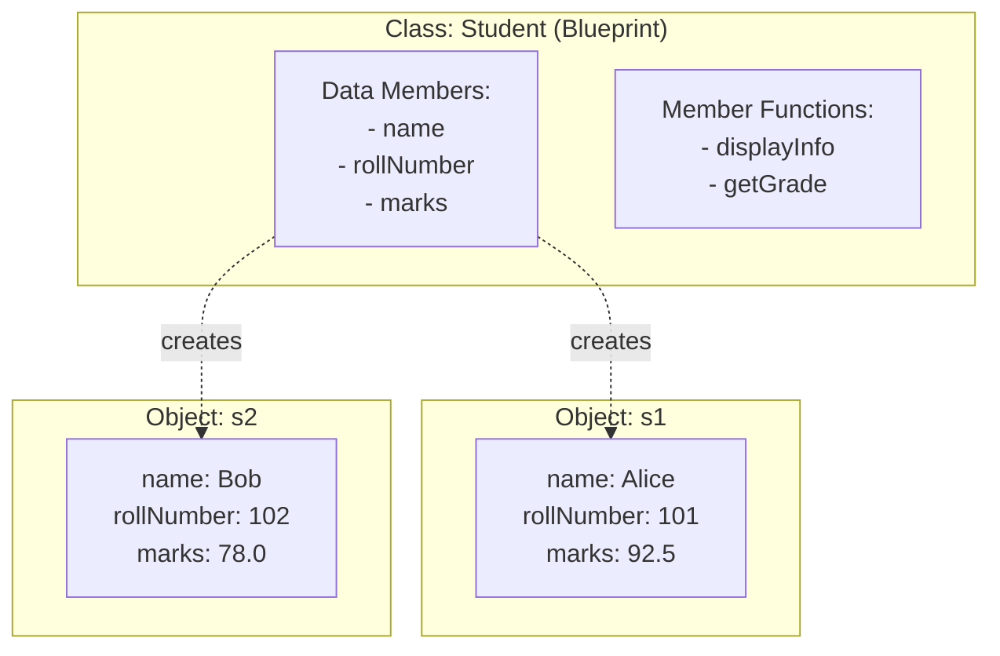
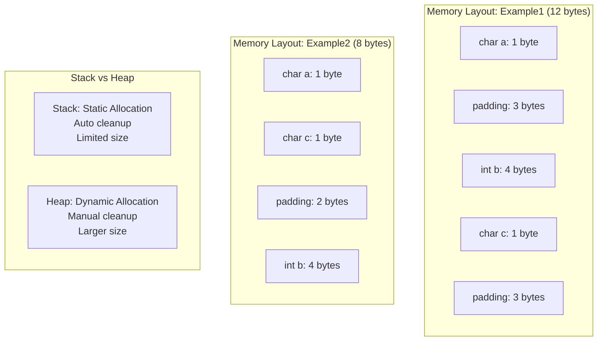
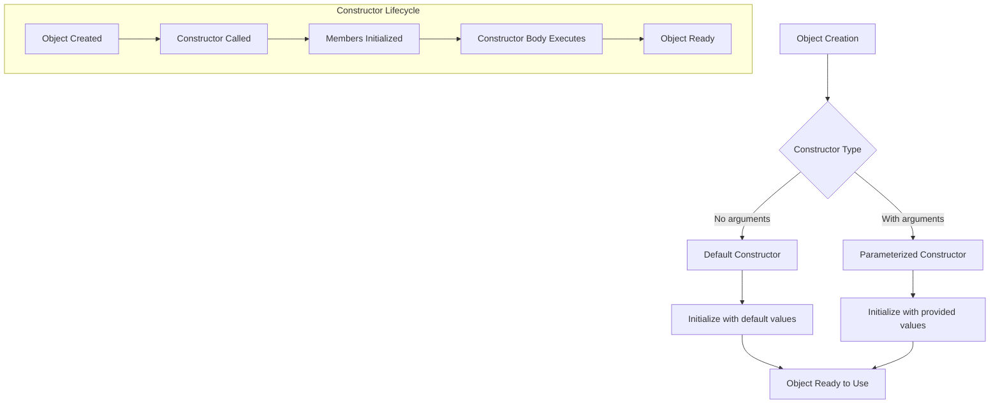
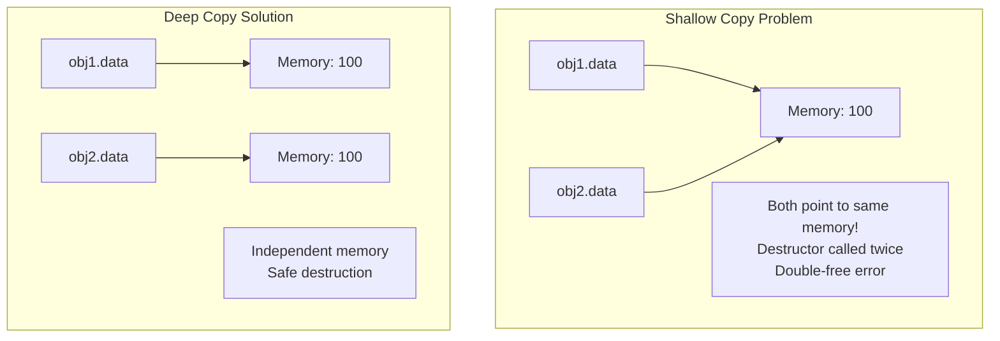
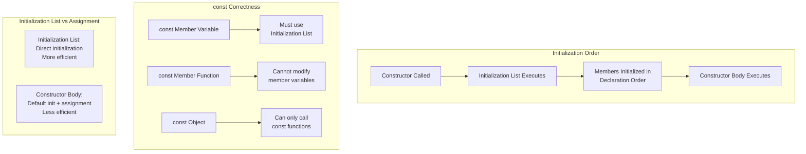
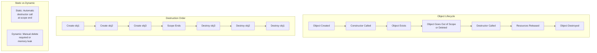
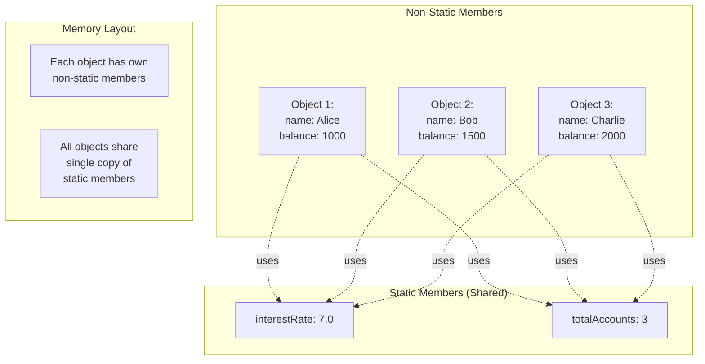

# OOP Part 1: Classes & Objects - C++ Interview Guide

## Table of Contents
1. [Class & Object Basics](#1-class--object-basics)
2. [Structure and Memory](#2-structure-and-memory)
3. [Constructors](#3-constructors)
4. [Object Copying and Assignment](#4-object-copying-and-assignment)
5. [Initialization and Constants](#5-initialization-and-constants)
6. [Destructors](#6-destructors)
7. [Static Members](#7-static-members)

---

## 1. Class & Object Basics

### Concept Explanation

A **class** is a user-defined blueprint or template that describes the properties (data members) and behaviors (member functions) of objects. An **object** is an instance of a class - a concrete entity created from the class blueprint that occupies memory.

**Data Members**: Variables that hold the state/data of an object.
**Member Functions**: Functions that define the behavior and operations on the object's data.

### Code Example

```cpp
#include <iostream>
#include <string>
using namespace std;

class Student {
public:
    // Data members
    string name;
    int rollNumber;
    float marks;
    
    // Member function
    void displayInfo() {
        cout << "Name: " << name << endl;
        cout << "Roll Number: " << rollNumber << endl;
        cout << "Marks: " << marks << endl;
    }
    
    // Member function to calculate grade
    char getGrade() {
        if (marks >= 90) return 'A';
        else if (marks >= 80) return 'B';
        else if (marks >= 70) return 'C';
        else if (marks >= 60) return 'D';
        else return 'F';
    }
};

int main() {
    // Creating objects (instances of Student class)
    Student s1, s2;
    
    // Accessing data members using dot operator
    s1.name = "Alice";
    s1.rollNumber = 101;
    s1.marks = 92.5;
    
    s2.name = "Bob";
    s2.rollNumber = 102;
    s2.marks = 78.0;
    
    // Calling member functions
    cout << "Student 1:" << endl;
    s1.displayInfo();
    cout << "Grade: " << s1.getGrade() << endl << endl;
    
    cout << "Student 2:" << endl;
    s2.displayInfo();
    cout << "Grade: " << s2.getGrade() << endl;
    
    return 0;
}
```

**Expected Output:**
```
Student 1:
Name: Alice
Roll Number: 101
Marks: 92.5
Grade: A

Student 2:
Name: Bob
Roll Number: 102
Marks: 78
Grade: B
```

### Code Walkthrough

1. **Class Definition**: `class Student { ... };` defines a blueprint with data members and functions
2. **Data Members**: `name`, `rollNumber`, `marks` store the state of each student
3. **Member Functions**: `displayInfo()` and `getGrade()` operate on the object's data
4. **Object Creation**: `Student s1, s2;` creates two separate instances in memory
5. **Accessing Members**: Use dot operator (`.`) to access members: `s1.name`, `s1.displayInfo()`
6. **Independent Objects**: Each object has its own copy of data members

### Visual Representation



### Practical Application

- **Real-world modeling**: Representing entities like Employee, BankAccount, Car
- **Game development**: Player, Enemy, Weapon classes
- **Database applications**: Table rows as objects
- **UI frameworks**: Button, Window, Menu classes

### Common Mistakes

1. **Forgetting semicolon after class definition**: `class Student { };` ← semicolon required
2. **Confusing class and object**: Class is blueprint, object is instance
3. **Trying to access private members directly**: Results in compilation error
4. **Not initializing data members**: Leads to garbage values

### Key Takeaways

✓ A class is a template; an object is an instance  
✓ Data members store state; member functions define behavior  
✓ Use dot operator (.) to access members  
✓ Each object has its own copy of data members  
✓ Member functions are shared across all objects of the class

### Interview Questions

**Q1: What is the difference between a class and an object?**

**Answer**: A class is a user-defined data type that serves as a blueprint defining the structure and behavior. An object is an instance of a class that actually occupies memory. Think of a class as an architectural blueprint and objects as actual houses built from that blueprint. Multiple objects can be created from one class, each with independent data.

**Q2: What is the difference between a structure and a class in C++?**

**Answer**: In C++, the main differences are:
- **Default access**: struct members are public by default; class members are private by default
- **Inheritance**: struct uses public inheritance by default; class uses private inheritance by default
- **Convention**: structs are typically used for plain data containers; classes for objects with behavior
- Functionally, both can have constructors, destructors, member functions, and inheritance

**Q3: Can we have member functions in a structure?**

**Answer**: Yes, in C++ structures can have member functions, constructors, destructors, and all features of classes. The only difference is default access specifier. Example:
```cpp
struct Point {
    int x, y;
    void display() { cout << x << "," << y; }
};
```

**Q4: What is the size of an empty class?**

**Answer**: The size of an empty class is typically 1 byte (compiler-dependent). This ensures that every object has a unique address in memory. If it were 0 bytes, two objects could have the same address, violating the fundamental requirement that distinct objects have distinct addresses.

**Q5: What happens when we create an object of a class?**

**Answer**: When an object is created:
1. Memory is allocated (stack for local, heap for dynamic)
2. Constructor is called to initialize the object
3. Memory layout follows padding and alignment rules
4. Each data member gets space; member functions are not duplicated per object
5. A hidden `this` pointer is associated with the object

**Q6: Can member functions access all data members of a class?**

**Answer**: Member functions can access all data members (private, protected, public) of their own class. They can also access members of other objects of the same class within their scope. However, they respect access specifiers when accessing members of objects from different classes.

**Q7: Write a program to create a Rectangle class with length and width, and calculate area and perimeter.**

**Answer**:
```cpp
class Rectangle {
public:
    double length, width;
    
    double area() {
        return length * width;
    }
    
    double perimeter() {
        return 2 * (length + width);
    }
};

int main() {
    Rectangle r;
    r.length = 5.0;
    r.width = 3.0;
    cout << "Area: " << r.area() << endl;
    cout << "Perimeter: " << r.perimeter() << endl;
    return 0;
}
```

---

## 2. Structure and Memory

### Concept Explanation

**Structure Padding**: Compilers insert unused bytes between data members to align them at memory addresses that are multiples of their size. This improves CPU access efficiency.

**Greedy Alignment**: The compiler aligns each member to its natural boundary (typically its size) and the entire structure to the largest member's alignment.

**Static Allocation**: Memory allocated at compile-time on the stack. Objects are automatically destroyed when they go out of scope.

**Dynamic Allocation**: Memory allocated at runtime on the heap using `new`. Must be manually deallocated using `delete`.

### Code Example

```cpp
#include <iostream>
using namespace std;

// Example showing structure padding
class Example1 {
    char a;    // 1 byte
    int b;     // 4 bytes
    char c;    // 1 byte
};

class Example2 {
    char a;    // 1 byte
    char c;    // 1 byte
    int b;     // 4 bytes
};

class Person {
public:
    string name;
    int age;
    
    void display() {
        cout << "Name: " << name << ", Age: " << age << endl;
    }
};

int main() {
    // Structure padding demonstration
    cout << "Size of Example1 (char, int, char): " << sizeof(Example1) << " bytes" << endl;
    cout << "Size of Example2 (char, char, int): " << sizeof(Example2) << " bytes" << endl;
    
    // Static allocation (stack)
    Person p1;
    p1.name = "Alice";
    p1.age = 25;
    cout << "\nStatic allocation:" << endl;
    p1.display();
    
    // Dynamic allocation (heap)
    Person* p2 = new Person;
    p2->name = "Bob";
    p2->age = 30;
    cout << "\nDynamic allocation:" << endl;
    p2->display();
    
    // Clean up dynamic memory
    delete p2;
    
    // Array of objects - static
    Person students[2];
    students[0].name = "Charlie";
    students[0].age = 20;
    students[1].name = "Diana";
    students[1].age = 22;
    
    cout << "\nArray of objects (static):" << endl;
    for (int i = 0; i < 2; i++) {
        students[i].display();
    }
    
    // Array of objects - dynamic
    Person* employees = new Person[2];
    employees[0].name = "Eve";
    employees[0].age = 28;
    employees[1].name = "Frank";
    employees[1].age = 35;
    
    cout << "\nArray of objects (dynamic):" << endl;
    for (int i = 0; i < 2; i++) {
        employees[i].display();
    }
    
    delete[] employees;  // Note: delete[] for arrays
    
    return 0;
}
```

**Expected Output:**
```
Size of Example1 (char, int, char): 12 bytes
Size of Example2 (char, char, int): 8 bytes

Static allocation:
Name: Alice, Age: 25

Dynamic allocation:
Name: Bob, Age: 30

Array of objects (static):
Name: Charlie, Age: 20
Name: Diana, Age: 22

Array of objects (dynamic):
Name: Eve, Age: 28
Name: Frank, Age: 35
```

### Code Walkthrough

1. **Example1**: `char(1) + padding(3) + int(4) + char(1) + padding(3) = 12 bytes`
2. **Example2**: `char(1) + char(1) + padding(2) + int(4) = 8 bytes` - better arrangement
3. **Static Object**: `Person p1;` allocated on stack, automatically destroyed
4. **Dynamic Object**: `Person* p2 = new Person;` allocated on heap, needs `delete p2;`
5. **Arrow Operator**: Use `->` for pointer to object: `p2->name`
6. **Static Array**: `Person students[2];` all objects on stack
7. **Dynamic Array**: `new Person[2]` on heap, needs `delete[]` (with brackets)

### Visual Representation



### Practical Application

- **Optimizing memory**: Reorder structure members to reduce padding
- **Large data structures**: Use dynamic allocation for flexibility
- **Real-time systems**: Static allocation for predictable performance
- **Data serialization**: Understanding padding is crucial for file I/O

### Common Mistakes

1. **Memory leak**: Forgetting to `delete` dynamically allocated objects
2. **Dangling pointer**: Using pointer after `delete`
3. **Wrong delete syntax**: Using `delete` instead of `delete[]` for arrays
4. **Stack overflow**: Creating large objects on stack

### Key Takeaways

✓ Padding improves CPU access speed but increases memory usage  
✓ Reordering members can reduce structure size  
✓ Static allocation = stack, automatic cleanup  
✓ Dynamic allocation = heap, manual cleanup required  
✓ Use `delete[]` for dynamically allocated arrays  
✓ Use `->` operator for pointers, `.` for objects

### Interview Questions

**Q1: What is structure padding and why is it needed?**

**Answer**: Structure padding is the insertion of unused bytes between structure members to align them at memory addresses that are multiples of their size. It's needed because:
- CPUs access aligned data more efficiently
- Misaligned access can cause performance penalties or hardware faults
- Modern processors read memory in word-sized chunks (4 or 8 bytes)
Example: A char followed by an int may have 3 padding bytes so the int starts at a 4-byte boundary.

**Q2: How can you reduce memory usage due to padding?**

**Answer**: Strategies include:
1. **Reorder members**: Place larger types first, smaller types together
2. **Use `#pragma pack`**: Forces specific alignment (reduces performance)
3. **Use bitfields**: For flags and small integers
4. **Compiler attributes**: `__attribute__((packed))` in GCC
Example: Grouping `char` variables together avoids padding between them.

**Q3: What is the difference between stack and heap allocation?**

**Answer**:
| Aspect | Stack | Heap |
|--------|-------|------|
| Allocation | Compile-time, automatic | Runtime, manual (`new`) |
| Deallocation | Automatic (scope-based) | Manual (`delete`) |
| Size | Limited (typically 1-8 MB) | Large (limited by system RAM) |
| Access Speed | Faster | Slower |
| Lifetime | Scope-based | Until explicitly deleted |
| Fragmentation | None | Can occur |

**Q4: What happens if you forget to delete dynamically allocated memory?**

**Answer**: This causes a **memory leak**. The memory remains allocated but becomes inaccessible, as you've lost the pointer to it. Over time, repeated leaks can exhaust available memory, causing the program or system to slow down or crash. Memory leaks are particularly problematic in long-running applications like servers. Use tools like Valgrind to detect leaks.

**Q5: What is the difference between `delete` and `delete[]`?**

**Answer**:
- **`delete`**: Used for single object allocated with `new`. Calls destructor once.
- **`delete[]`**: Used for arrays allocated with `new[]`. Calls destructor for each element.
Using wrong syntax causes undefined behavior. The compiler stores array size information with `new[]` allocation to know how many destructors to call.

```cpp
int* single = new int;
int* array = new int[5];
delete single;    // Correct
delete[] array;   // Correct
delete array;     // Wrong! Undefined behavior
```

**Q6: Can you allocate objects on the stack and heap simultaneously?**

**Answer**: Yes. You can have a mix:
```cpp
Person p1;              // Stack
Person* p2 = new Person; // Heap
Person arr[3];          // Stack array
Person* dArr = new Person[3]; // Heap array
```
Each has its use case. Stack for temporary, small objects; heap for large objects or when size is unknown at compile-time.

**Q7: Write a program demonstrating the difference between shallow and deep memory allocation.**

**Answer**: This will be covered in detail in Section 4 (Object Copying), but here's a preview:
```cpp
class Data {
public:
    int* ptr;
    Data(int val) {
        ptr = new int(val);  // Deep allocation
    }
    ~Data() {
        delete ptr;
    }
};

int main() {
    Data d1(10);  // Each object manages its own heap memory
    return 0;
}
```

---

## 3. Constructors

### Concept Explanation

A **constructor** is a special member function that is automatically called when an object is created. Its purpose is to initialize the object's data members and allocate resources.

**Types of Constructors**:
- **Default Constructor**: Takes no parameters, provides default initialization
- **Parameterized Constructor**: Takes parameters to initialize with specific values
- **Copy Constructor**: Creates a new object as a copy of an existing object (covered in Section 4)

**Key Properties**:
- Same name as the class
- No return type (not even void)
- Can be overloaded
- Automatically invoked during object creation

### Code Example

```cpp
#include <iostream>
#include <string>
using namespace std;

class BankAccount {
private:
    string accountHolder;
    int accountNumber;
    double balance;
    
public:
    // Default Constructor
    BankAccount() {
        accountHolder = "Unknown";
        accountNumber = 0;
        balance = 0.0;
        cout << "Default constructor called" << endl;
    }
    
    // Parameterized Constructor (3 parameters)
    BankAccount(string name, int accNum, double bal) {
        accountHolder = name;
        accountNumber = accNum;
        balance = bal;
        cout << "Parameterized constructor called" << endl;
    }
    
    // Parameterized Constructor (2 parameters) - Overloaded
    BankAccount(string name, int accNum) {
        accountHolder = name;
        accountNumber = accNum;
        balance = 0.0;
        cout << "Overloaded constructor called" << endl;
    }
    
    void display() {
        cout << "Account Holder: " << accountHolder << endl;
        cout << "Account Number: " << accountNumber << endl;
        cout << "Balance: $" << balance << endl;
        cout << "------------------------" << endl;
    }
    
    void deposit(double amount) {
        balance += amount;
        cout << "Deposited: $" << amount << endl;
    }
};

int main() {
    // Using default constructor
    BankAccount acc1;
    acc1.display();
    
    // Using parameterized constructor (3 params)
    BankAccount acc2("Alice Johnson", 12345, 1000.50);
    acc2.display();
    
    // Using overloaded constructor (2 params)
    BankAccount acc3("Bob Smith", 67890);
    acc3.display();
    
    acc3.deposit(500.0);
    acc3.display();
    
    // Array of objects - default constructor called for each
    cout << "\nCreating array of 2 accounts:" << endl;
    BankAccount accounts[2];
    
    return 0;
}
```

**Expected Output:**
```
Default constructor called
Account Holder: Unknown
Account Number: 0
Balance: $0
------------------------
Parameterized constructor called
Account Holder: Alice Johnson
Account Number: 12345
Balance: $1000.5
------------------------
Overloaded constructor called
Account Holder: Bob Smith
Account Number: 67890
Balance: $0
------------------------
Deposited: $500
Account Holder: Bob Smith
Account Number: 67890
Balance: $500
------------------------

Creating array of 2 accounts:
Default constructor called
Default constructor called
```

### Code Walkthrough

1. **Default Constructor**: `BankAccount()` initializes all members to default values
2. **Automatic Invocation**: `BankAccount acc1;` automatically calls default constructor
3. **Parameterized Constructor**: `BankAccount(string, int, double)` accepts values for initialization
4. **Constructor Overloading**: Multiple constructors with different parameter lists
5. **Direct Initialization**: `BankAccount acc2("Alice", 12345, 1000.50);` passes values directly
6. **Array Creation**: Each element calls default constructor

### Visual Representation



### Practical Application

- **Resource initialization**: Open files, establish connections
- **Validation**: Ensure objects start in valid state
- **Default values**: Provide sensible defaults for optional parameters
- **Logging**: Track object creation for debugging

### Common Mistakes

1. **Returning a value from constructor**: Constructors have no return type
2. **Not providing default constructor**: If you define parameterized constructor, default is not auto-generated
3. **Uninitialized members**: Forgetting to initialize all data members
4. **Constructor initialization order**: Members initialized in declaration order, not constructor order

### Key Takeaways

✓ Constructors initialize objects when created  
✓ Default constructor takes no parameters  
✓ Parameterized constructor accepts values for initialization  
✓ Constructors can be overloaded  
✓ No return type for constructors  
✓ If you define any constructor, compiler doesn't create default one

### Interview Questions

**Q1: What is a constructor and why is it needed?**

**Answer**: A constructor is a special member function that initializes objects when they're created. It's needed to:
- Ensure objects start in a valid state
- Initialize data members with appropriate values
- Allocate resources (memory, file handles, network connections)
- Prevent use of uninitialized data (garbage values)
Without constructors, data members would contain random values, leading to unpredictable behavior.

**Q2: What happens if we don't define any constructor?**

**Answer**: If no constructor is defined, the compiler automatically generates a **default constructor** that:
- Takes no parameters
- Performs no initialization for built-in types (int, char, etc.) - leaving them with garbage values
- Calls default constructors for member objects of class types
This auto-generated constructor is called the **compiler-generated default constructor** or **implicit default constructor**.

**Q3: Can a constructor be private? What is the use case?**

**Answer**: Yes, constructors can be private. Use cases include:
- **Singleton pattern**: Ensure only one instance exists
- **Factory pattern**: Force object creation through factory methods
- **Named constructors**: Provide meaningful creation methods

Example:
```cpp
class Singleton {
private:
    static Singleton* instance;
    Singleton() {}  // Private constructor
public:
    static Singleton* getInstance() {
        if (!instance) instance = new Singleton();
        return instance;
    }
};
```

**Q4: What is constructor overloading?**

**Answer**: Constructor overloading means having multiple constructors with different parameter lists in the same class. The compiler selects the appropriate constructor based on arguments provided during object creation.

```cpp
class Point {
public:
    Point() { x = y = 0; }               // Default
    Point(int val) { x = y = val; }      // One parameter
    Point(int a, int b) { x = a; y = b; } // Two parameters
private:
    int x, y;
};

Point p1;          // Calls default
Point p2(5);       // Calls one-parameter
Point p3(3, 4);    // Calls two-parameter
```

**Q5: Can a constructor call another constructor?**

**Answer**: Yes, this is called **constructor delegation** (since C++11). One constructor can call another constructor of the same class using the initialization list:

```cpp
class Box {
    int length, width, height;
public:
    Box() : Box(1, 1, 1) {}  // Delegates to 3-param constructor
    Box(int l, int w, int h) : length(l), width(w), height(h) {}
};
```

Before C++11, this wasn't directly possible; you'd use a private initialization function instead.

**Q6: What is the difference between constructor and member function?**

**Answer**:
| Aspect | Constructor | Member Function |
|--------|-------------|-----------------|
| Name | Same as class | Any valid name |
| Return Type | None (not even void) | Can have any return type |
| Invocation | Automatic at object creation | Explicit call needed |
| Purpose | Initialize object | Perform operations |
| Overloading | Allowed | Allowed |

**Q7: Write a program with a constructor that validates input and throws an exception for invalid data.**

**Answer**:
```cpp
#include <iostream>
#include <stdexcept>
using namespace std;

class Age {
    int years;
public:
    Age(int y) {
        if (y < 0 || y > 150) {
            throw invalid_argument("Invalid age: must be 0-150");
        }
        years = y;
        cout << "Valid age: " << years << endl;
    }
};

int main() {
    try {
        Age a1(25);   // Valid
        Age a2(200);  // Invalid - throws exception
    } catch (const exception& e) {
        cout << "Error: " << e.what() << endl;
    }
    return 0;
}
```

---

## 4. Object Copying and Assignment

### Concept Explanation

**Shallow Copy**: Copies member values directly. For pointers, it copies the pointer value (address), so both objects point to the same memory location. Changes through one object affect the other.

**Deep Copy**: Creates a new copy of dynamically allocated memory. Each object has its own independent copy of the data.

**Copy Constructor**: Special constructor that creates a new object as a copy of an existing object. Syntax: `ClassName(const ClassName& other)`.

**Copy Assignment Operator**: Operator that copies values from one existing object to another existing object. Syntax: `ClassName& operator=(const ClassName& other)`.

### Code Example

```cpp
#include <iostream>
#include <cstring>
using namespace std;

class ShallowCopyExample {
public:
    int* data;
    
    ShallowCopyExample(int value) {
        data = new int(value);
        cout << "Constructor: allocated memory at " << data << endl;
    }
    
    // Compiler-generated copy constructor (shallow)
    // ShallowCopyExample(const ShallowCopyExample& other) {
    //     data = other.data;  // Just copies pointer
    // }
    
    ~ShallowCopyExample() {
        cout << "Destructor: freeing memory at " << data << endl;
        delete data;
    }
};

class DeepCopyExample {
public:
    int* data;
    
    DeepCopyExample(int value) {
        data = new int(value);
        cout << "Constructor: allocated memory at " << data << endl;
    }
    
    // Deep copy constructor
    DeepCopyExample(const DeepCopyExample& other) {
        data = new int(*other.data);  // Allocate new memory and copy value
        cout << "Copy Constructor: copied " << *other.data 
             << " from " << other.data << " to " << data << endl;
    }
    
    // Copy assignment operator
    DeepCopyExample& operator=(const DeepCopyExample& other) {
        if (this != &other) {  // Self-assignment check
            delete data;  // Free existing memory
            data = new int(*other.data);  // Allocate new and copy
            cout << "Assignment Operator: copied " << *other.data 
                 << " from " << other.data << " to " << data << endl;
        }
        return *this;
    }
    
    ~DeepCopyExample() {
        cout << "Destructor: freeing memory at " << data << endl;
        delete data;
    }
    
    void setValue(int value) {
        *data = value;
    }
    
    void display() {
        cout << "Value: " << *data << " at address: " << data << endl;
    }
};

int main() {
    cout << "=== Demonstrating Deep Copy ===" << endl;
    
    DeepCopyExample obj1(100);
    obj1.display();
    
    // Copy constructor called
    DeepCopyExample obj2 = obj1;
    obj2.display();
    
    // Modify obj2 - obj1 remains unchanged (deep copy)
    obj2.setValue(200);
    cout << "\nAfter modifying obj2:" << endl;
    cout << "obj1: ";
    obj1.display();
    cout << "obj2: ";
    obj2.display();
    
    // Copy assignment operator
    DeepCopyExample obj3(300);
    cout << "\nBefore assignment:" << endl;
    obj3.display();
    
    obj3 = obj1;  // Assignment operator called
    cout << "After assignment (obj3 = obj1):" << endl;
    obj3.display();
    
    cout << "\n=== Objects will be destroyed now ===" << endl;
    return 0;
}
```

**Expected Output:**
```
=== Demonstrating Deep Copy ===
Constructor: allocated memory at 0x...
Value: 100 at address: 0x...
Copy Constructor: copied 100 from 0x... to 0x...
Value: 100 at address: 0x...

After modifying obj2:
obj1: Value: 100 at address: 0x...
obj2: Value: 200 at address: 0x...

Before assignment:
Constructor: allocated memory at 0x...
Value: 300 at address: 0x...
Assignment Operator: copied 100 from 0x... to 0x...
After assignment (obj3 = obj1):
Value: 100 at address: 0x...

=== Objects will be destroyed now ===
Destructor: freeing memory at 0x...
Destructor: freeing memory at 0x...
Destructor: freeing memory at 0x...
```

### Code Walkthrough

1. **Copy Constructor Signature**: `DeepCopyExample(const DeepCopyExample& other)`
   - Takes const reference to prevent modification
   - Pass by reference to avoid infinite recursion
   
2. **Deep Copy Process**: 
   - Allocate new memory: `data = new int(...)`
   - Copy the value, not the pointer: `*other.data`
   
3. **Copy Assignment Operator**:
   - Check self-assignment: `if (this != &other)`
   - Delete existing memory first
   - Allocate new memory and copy value
   - Return `*this` for chaining
   
4. **Independent Objects**: Each has its own memory, modifications don't affect others

5. **Destructor Safety**: Each destructor frees its own memory without affecting others

### Visual Representation



### Practical Application

- **String classes**: Implementing custom string with dynamic memory
- **Container classes**: Vector, list, stack implementations
- **Resource management**: File handles, network connections, database connections
- **Avoiding bugs**: Preventing double-free errors and dangling pointers

### Common Mistakes

1. **Forgetting self-assignment check**: `if (this != &other)` prevents issues
2. **Not deleting old memory in assignment**: Causes memory leak
3. **Shallow copy with pointers**: Leads to double-free errors
4. **Pass by value in copy constructor**: Causes infinite recursion
5. **Not returning `*this` in assignment operator**: Breaks chaining

### Key Takeaways

✓ Shallow copy copies pointer values; deep copy duplicates memory  
✓ Copy constructor: `ClassName(const ClassName& other)`  
✓ Assignment operator: `ClassName& operator=(const ClassName& other)`  
✓ Always check self-assignment in assignment operator  
✓ Delete old memory before allocating new in assignment operator  
✓ Return `*this` from assignment operator for chaining

### Interview Questions

**Q1: What is the difference between shallow copy and deep copy?**

**Answer**: 
- **Shallow Copy**: Copies member values as-is. For pointers, it copies the address, making both objects point to the same memory. Changes through one object affect the other, and destroying one invalidates the other's pointer (dangling pointer problem).
- **Deep Copy**: Creates independent copies of dynamically allocated memory. Each object has its own memory, so modifications are independent and destruction is safe.

Example: If class has `int* data`, shallow copy results in both objects sharing the pointer, while deep copy allocates separate memory for each.

**Q2: When is the copy constructor called?**

**Answer**: The copy constructor is called in these situations:
1. When object is initialized with another object: `MyClass obj2 = obj1;`
2. When object is passed by value to function: `void func(MyClass obj)`
3. When object is returned by value from function: `return obj;`
4. When compiler creates temporary objects

Note: Modern compilers may use copy elision/RVO to optimize away some copies.

**Q3: Why do we pass by const reference in copy constructor?**

**Answer**: 
- **const**: Ensures the source object isn't modified during copying (logical correctness)
- **reference (&)**: Prevents infinite recursion. If we passed by value, calling the copy constructor would need to copy the argument, which would call the copy constructor again, infinitely.

```cpp
// Wrong - infinite recursion
MyClass(MyClass other) { ... }

// Correct
MyClass(const MyClass& other) { ... }
```

**Q4: What is the copy assignment operator and how is it different from copy constructor?**

**Answer**:
| Aspect | Copy Constructor | Assignment Operator |
|--------|------------------|---------------------|
| Purpose | Create new object from existing | Copy to existing object |
| Syntax | `MyClass(const MyClass&)` | `MyClass& operator=(const MyClass&)` |
| Invocation | `MyClass b = a;` or `MyClass b(a);` | `b = a;` (both exist) |
| Return Type | None | Reference to `*this` |
| Self-assignment | Not applicable | Must check |
| Cleanup | No existing data | Must delete old data |

**Q5: Why do we need to check for self-assignment in assignment operator?**

**Answer**: Self-assignment check `if (this != &other)` prevents bugs when someone writes `obj = obj;`. Without it:
1. We'd delete our own data first
2. Then try to copy from the deleted data
3. Results in undefined behavior

```cpp
MyClass& operator=(const MyClass& other) {
    if (this != &other) {  // Essential check
        delete data;
        data = new int(*other.data);
    }
    return *this;
}
```

**Q6: What is the Rule of Three?**

**Answer**: The Rule of Three states: If a class needs one of the following, it probably needs all three:
1. **Destructor**: To free resources
2. **Copy Constructor**: To properly copy resources
3. **Copy Assignment Operator**: To properly assign resources

This applies to classes managing resources (dynamic memory, file handles, etc.). Modern C++ extends this to Rule of Five (adding move constructor and move assignment).

**Q7: Write a String class with proper deep copy implementation.**

**Answer**:
```cpp
class String {
    char* data;
    int length;
    
public:
    // Constructor
    String(const char* str = "") {
        length = strlen(str);
        data = new char[length + 1];
        strcpy(data, str);
    }
    
    // Copy constructor
    String(const String& other) {
        length = other.length;
        data = new char[length + 1];
        strcpy(data, other.data);
    }
    
    // Assignment operator
    String& operator=(const String& other) {
        if (this != &other) {
            delete[] data;
            length = other.length;
            data = new char[length + 1];
            strcpy(data, other.data);
        }
        return *this;
    }
    
    // Destructor
    ~String() {
        delete[] data;
    }
    
    void display() {
        cout << data << endl;
    }
};
```

---

## 5. Initialization and Constants

### Concept Explanation

**Initialization List**: A more efficient way to initialize member variables in constructors, placed after the constructor parameter list with a colon (`:`). It initializes members before the constructor body executes.

**const Keyword**:
- **const Variables**: Cannot be modified after initialization
- **const Member Functions**: Promise not to modify the object's state (can be called on const objects)
- **const Objects**: Cannot be modified after creation

**Why Use Initialization Lists**:
- Required for const members, reference members, and objects without default constructors
- More efficient (direct initialization vs assignment)
- Initialization happens in member declaration order, not list order

### Code Example

```cpp
#include <iostream>
#include <string>
using namespace std;

class Rectangle {
private:
    const int id;           // const member - must use initialization list
    int length;
    int width;
    static int objectCount; // static member
    
public:
    // Constructor with initialization list
    Rectangle(int i, int l, int w) : id(i), length(l), width(w) {
        objectCount++;
        cout << "Rectangle " << id << " created" << endl;
    }
    
    // Constructor without initialization list (for comparison)
    // This would NOT work for const member 'id'
    /*
    Rectangle(int i, int l, int w) {
        id = i;      // Error: cannot assign to const
        length = l;
        width = w;
    }
    */
    
    // const member function - doesn't modify object
    int getArea() const {
        // length = 10;  // Error: cannot modify in const function
        return length * width;
    }
    
    // const member function
    int getPerimeter() const {
        return 2 * (length + width);
    }
    
    // const member function
    void display() const {
        cout << "Rectangle ID: " << id << endl;
        cout << "Dimensions: " << length << " x " << width << endl;
        cout << "Area: " << getArea() << endl;
    }
    
    // Non-const member function
    void setDimensions(int l, int w) {
        length = l;
        width = w;
    }
    
    // const member function accessing static member
    static int getObjectCount() {
        return objectCount;
    }
};

// Initialize static member
int Rectangle::objectCount = 0;

class Point {
private:
    const int x;
    const int y;
    
public:
    // Initialization list for const members
    Point(int xVal, int yVal) : x(xVal), y(yVal) {
        cout << "Point (" << x << ", " << y << ") created" << endl;
    }
    
    // const function
    void display() const {
        cout << "Point: (" << x << ", " << y << ")" << endl;
    }
    
    // const function returning value
    int getX() const { return x; }
    int getY() const { return y; }
};

// Function accepting const object reference
void printRectangle(const Rectangle& r) {
    r.display();  // Can call const functions
    // r.setDimensions(5, 5);  // Error: can't call non-const function
}

int main() {
    // Regular objects
    Rectangle r1(1, 10, 5);
    r1.display();
    cout << "Area: " << r1.getArea() << endl;
    r1.setDimensions(12, 6);  // Can call non-const function
    cout << "After modification:" << endl;
    r1.display();
    
    cout << "\n";
    
    // const object - can only call const functions
    const Rectangle r2(2, 8, 4);
    r2.display();              // OK: const function
    cout << "Area: " << r2.getArea() << endl;  // OK: const function
    // r2.setDimensions(10, 5);  // Error: can't call non-const on const object
    
    cout << "\n";
    
    // const object with const members
    const Point p1(3, 7);
    p1.display();
    cout << "X coordinate: " << p1.getX() << endl;
    
    cout << "\n";
    
    // Using const reference in function
    printRectangle(r1);
    
    cout << "\nTotal rectangles created: " << Rectangle::getObjectCount() << endl;
    
    return 0;
}
```

**Expected Output:**
```
Rectangle 1 created
Rectangle ID: 1
Dimensions: 10 x 5
Area: 50
After modification:
Rectangle ID: 1
Dimensions: 12 x 6
Area: 72

Rectangle 2 created
Rectangle ID: 2
Dimensions: 8 x 4
Area: 32

Point (3, 7) created
Point: (3, 7)
X coordinate: 3

Rectangle ID: 1
Dimensions: 12 x 6
Area: 72

Total rectangles created: 2
```

### Code Walkthrough

1. **Initialization List Syntax**: `Rectangle(int i, int l, int w) : id(i), length(l), width(w)`
   - Colon (`:`) starts the initialization list
   - Members initialized before constructor body
   - Required for const members

2. **const Member Variables**: `const int id;`
   - Must be initialized in initialization list
   - Cannot be modified after initialization
   - Each object can have different const values

3. **const Member Functions**: `int getArea() const`
   - `const` after parameter list
   - Cannot modify any member variables
   - Can be called on const objects

4. **const Objects**: `const Rectangle r2(2, 8, 4);`
   - Can only call const member functions
   - All member variables are effectively const

5. **const Reference Parameters**: `void printRectangle(const Rectangle& r)`
   - Efficient (no copy) and safe (no modification)
   - Can only call const functions on the parameter

### Visual Representation



### Practical Application

- **Immutable objects**: Configuration, mathematical constants
- **Function parameters**: Pass by const reference for efficiency
- **API design**: const functions signal they don't modify state
- **Thread safety**: const functions are inherently thread-safe for reading

### Common Mistakes

1. **Forgetting const on member functions**: Non-const functions can't be called on const objects
2. **Initialization list order**: Members initialized in declaration order, not list order
3. **Not using initialization list for const/reference**: Results in compilation error
4. **Const member in assignment operator**: Can't reassign, makes assignment tricky

### Key Takeaways

✓ Initialization list: `Constructor() : member1(val1), member2(val2) { }`  
✓ Required for const members, references, base class constructors  
✓ More efficient than assignment in constructor body  
✓ const functions: `returnType functionName() const`  
✓ const objects can only call const member functions  
✓ Use const for immutability and API clarity

### Interview Questions

**Q1: What is a member initialization list and why is it needed?**

**Answer**: A member initialization list is a syntax in C++ to initialize member variables before the constructor body executes. Syntax: `Constructor() : member1(value1), member2(value2) { }`. 

It's needed for:
1. **const members**: Cannot be assigned, must be initialized
2. **Reference members**: Cannot be reassigned, must be initialized
3. **Member objects without default constructor**: Need explicit initialization
4. **Efficiency**: Direct initialization vs default initialization + assignment

**Q2: What is the difference between initialization and assignment?**

**Answer**:
```cpp
class Example {
    int x;
public:
    // Initialization (better)
    Example(int val) : x(val) { }
    
    // Assignment (less efficient)
    Example(int val) {
        x = val;  // Default constructed then assigned
    }
};
```

Initialization directly constructs with the value; assignment first default-constructs then assigns. For complex types, initialization avoids the overhead of default construction.

**Q3: In what order are members initialized in the initialization list?**

**Answer**: Members are initialized in the order they are **declared in the class**, not the order they appear in the initialization list. Example:

```cpp
class Order {
    int a, b, c;
public:
    // Members initialized in order: a, b, c
    // Regardless of list order
    Order(int x) : c(x), b(c), a(b) { }  // Dangerous!
    // a uses uninitialized b, b uses uninitialized c
};
```

Best practice: List members in initialization list in the same order as declaration.

**Q4: What is a const member function and when should it be used?**

**Answer**: A const member function is declared with `const` after the parameter list and promises not to modify the object's state:

```cpp
int getValue() const { return value; }
```

Use const member functions when:
- Function only reads data, doesn't modify
- You want to allow calling on const objects
- Designing interfaces (const correctness)
- Enabling compiler optimizations

Non-const functions cannot be called on const objects.

**Q5: Can a const member function call another member function?**

**Answer**: A const member function can call:
- Other const member functions: ✓ Yes
- Non-const member functions: ✗ No (would violate const promise)
- Static member functions: ✓ Yes (don't modify instance)

```cpp
class Example {
    int value;
public:
    int getValue() const { return value; }
    void setValue(int v) { value = v; }
    
    void display() const {
        cout << getValue();  // OK: calling const function
        // setValue(10);     // Error: calling non-const function
    }
};
```

**Q6: What is const correctness and why is it important?**

**Answer**: Const correctness is the practice of properly using const throughout your code:
- const parameters for values that shouldn't change
- const member functions that don't modify state
- const return types when appropriate

Benefits:
1. **Compiler enforcement**: Catches unintended modifications
2. **Self-documenting code**: Clear intent about mutability
3. **Optimization**: Compiler can optimize better
4. **Interface contracts**: Clear promises to users of your code
5. **Const object compatibility**: Enables use of const objects

**Q7: Write a class with const member, initialization list, and const member functions.**

**Answer**:
```cpp
class Circle {
    const double PI;  // const member
    double radius;
    
public:
    // Initialization list required for PI
    Circle(double r) : PI(3.14159), radius(r) { }
    
    // const member functions
    double getArea() const {
        return PI * radius * radius;
    }
    
    double getCircumference() const {
        return 2 * PI * radius;
    }
    
    double getRadius() const {
        return radius;
    }
    
    // non-const member function
    void setRadius(double r) {
        radius = r;
    }
};

int main() {
    const Circle c1(5.0);
    cout << "Area: " << c1.getArea() << endl;  // OK
    // c1.setRadius(10);  // Error: can't call non-const
    
    Circle c2(3.0);
    c2.setRadius(7.0);  // OK: non-const object
    return 0;
}
```

---

## 6. Destructors

### Concept Explanation

A **destructor** is a special member function that is automatically called when an object is destroyed. Its purpose is to release resources (memory, file handles, network connections) that the object acquired during its lifetime.

**Key Properties**:
- Same name as class, prefixed with tilde (`~`)
- No parameters, no return type
- Cannot be overloaded (only one destructor per class)
- Automatically called when object goes out of scope or is explicitly deleted
- Called in reverse order of construction

**When Destructors Are Called**:
- Static objects: When scope ends
- Dynamic objects: When `delete` or `delete[]` is called
- Temporary objects: At end of expression
- Global objects: At program termination

### Code Example

```cpp
#include <iostream>
#include <string>
using namespace std;

class FileHandler {
private:
    string filename;
    bool isOpen;
    
public:
    // Constructor
    FileHandler(string fname) : filename(fname), isOpen(false) {
        cout << "Constructor: FileHandler created for " << filename << endl;
        isOpen = true;
        cout << "File '" << filename << "' opened" << endl;
    }
    
    // Destructor
    ~FileHandler() {
        if (isOpen) {
            cout << "Destructor: Closing file '" << filename << "'" << endl;
            isOpen = false;
        }
        cout << "Destructor: FileHandler destroyed for " << filename << endl;
    }
    
    void processFile() {
        cout << "Processing file: " << filename << endl;
    }
};

class Array {
private:
    int* data;
    int size;
    
public:
    // Constructor
    Array(int s) : size(s) {
        data = new int[size];
        cout << "Constructor: Allocated array of size " << size 
             << " at address " << data << endl;
        
        // Initialize with values
        for (int i = 0; i < size; i++) {
            data[i] = i * 10;
        }
    }
    
    // Destructor - Essential for dynamic memory cleanup
    ~Array() {
        cout << "Destructor: Deallocating array at address " << data << endl;
        delete[] data;
        data = nullptr;  // Good practice
    }
    
    void display() {
        cout << "Array elements: ";
        for (int i = 0; i < size; i++) {
            cout << data[i] << " ";
        }
        cout << endl;
    }
};

class Counter {
private:
    static int objectCount;
    int id;
    
public:
    Counter() {
        objectCount++;
        id = objectCount;
        cout << "Constructor: Counter " << id << " created (Total: " 
             << objectCount << ")" << endl;
    }
    
    ~Counter() {
        cout << "Destructor: Counter " << id << " destroyed" << endl;
        objectCount--;
    }
    
    static int getCount() {
        return objectCount;
    }
};

int Counter::objectCount = 0;

void demonstrateStaticAllocation() {
    cout << "\n=== Static Allocation Demo ===" << endl;
    FileHandler f1("data.txt");
    FileHandler f2("config.txt");
    f1.processFile();
    f2.processFile();
    cout << "Exiting function - destructors will be called in reverse order" << endl;
    // Destructors called automatically: f2 then f1
}

void demonstrateDynamicAllocation() {
    cout << "\n=== Dynamic Allocation Demo ===" << endl;
    Array* arr1 = new Array(5);
    arr1->display();
    
    Array* arr2 = new Array(3);
    arr2->display();
    
    cout << "Explicitly deleting arr1" << endl;
    delete arr1;  // Destructor called explicitly
    
    cout << "Explicitly deleting arr2" << endl;
    delete arr2;  // Destructor called explicitly
}

void demonstrateDestructorOrder() {
    cout << "\n=== Destructor Order Demo ===" << endl;
    Counter c1;
    Counter c2;
    Counter c3;
    cout << "All objects created. Current count: " << Counter::getCount() << endl;
    cout << "Exiting function..." << endl;
    // Destructors called in reverse: c3, c2, c1
}

int main() {
    demonstrateStaticAllocation();
    demonstrateDynamicAllocation();
    demonstrateDestructorOrder();
    
    cout << "\n=== Main Function Ending ===" << endl;
    return 0;
}
```

**Expected Output:**
```
=== Static Allocation Demo ===
Constructor: FileHandler created for data.txt
File 'data.txt' opened
Constructor: FileHandler created for config.txt
File 'config.txt' opened
Processing file: data.txt
Processing file: config.txt
Exiting function - destructors will be called in reverse order
Destructor: Closing file 'config.txt'
Destructor: FileHandler destroyed for config.txt
Destructor: Closing file 'data.txt'
Destructor: FileHandler destroyed for data.txt

=== Dynamic Allocation Demo ===
Constructor: Allocated array of size 5 at address 0x...
Array elements: 0 10 20 30 40 
Constructor: Allocated array of size 3 at address 0x...
Array elements: 0 10 20 
Explicitly deleting arr1
Destructor: Deallocating array at address 0x...
Explicitly deleting arr2
Destructor: Deallocating array at address 0x...

=== Destructor Order Demo ===
Constructor: Counter 1 created (Total: 1)
Constructor: Counter 2 created (Total: 2)
Constructor: Counter 3 created (Total: 3)
All objects created. Current count: 3
Exiting function...
Destructor: Counter 3 destroyed
Destructor: Counter 2 destroyed
Destructor: Counter 1 destroyed

=== Main Function Ending ===
```

### Code Walkthrough

1. **Destructor Syntax**: `~ClassName()` - tilde followed by class name
2. **Static Objects**: Destructors called automatically in reverse construction order
3. **Dynamic Objects**: Destructor called when `delete` is used
4. **Resource Cleanup**: Destructor deallocates dynamic memory with `delete[]`
5. **LIFO Order**: Last constructed, first destroyed (stack-like behavior)
6. **nullptr Assignment**: Good practice after deletion to avoid dangling pointers

### Visual Representation



### Practical Application

- **Memory management**: Freeing dynamically allocated arrays/objects
- **File handling**: Closing files automatically
- **Network connections**: Closing sockets
- **Database connections**: Releasing connections to pool
- **Mutex locks**: Automatic lock release (RAII pattern)

### Common Mistakes

1. **No virtual destructor in base class**: Leads to resource leaks in inheritance
2. **Accessing deleted objects**: Using pointer after delete (dangling pointer)
3. **Double deletion**: Deleting same pointer twice (undefined behavior)
4. **Not deleting dynamic memory**: Memory leaks
5. **Wrong delete syntax**: Using `delete` instead of `delete[]` for arrays

### Key Takeaways

✓ Destructor cleans up resources when object is destroyed  
✓ Syntax: `~ClassName()`  
✓ Called automatically for static objects  
✓ Must call `delete` for dynamic objects  
✓ Destructors called in reverse order of construction  
✓ Use `delete[]` for arrays allocated with `new[]`  
✓ Essential for preventing memory leaks

### Interview Questions

**Q1: What is a destructor and when is it called?**

**Answer**: A destructor is a special member function that cleans up an object before it's destroyed. It's called:
- Automatically when a stack-allocated object goes out of scope
- When `delete` is explicitly called on a heap-allocated object
- When a program terminates (for global/static objects)
- When parent object containing member objects is destroyed

Purpose: Release resources (memory, files, locks) acquired during object's lifetime.

**Q2: Can we have more than one destructor in a class?**

**Answer**: No. A class can have only one destructor because:
- Destructors take no parameters, so they can't be overloaded
- Destruction is automatic and unambiguous
- Syntax: `~ClassName()` with no parameters
- If multiple cleanup strategies were needed, use separate cleanup methods

**Q3: What happens if we don't define a destructor?**

**Answer**: If no destructor is defined, the compiler generates a default destructor that:
- Calls destructors of member objects
- Calls base class destructor (in inheritance)
- Does NOT free dynamically allocated memory

This is fine for classes without dynamic resources, but classes with `new`, file handles, or other resources MUST have explicit destructors to prevent leaks.

**Q4: What is the order of destructor calls?**

**Answer**: Destructors are called in reverse order of construction (LIFO - Last In, First Out):
```cpp
void func() {
    A obj1;  // 1. Constructed first
    B obj2;  // 2. Constructed second
    C obj3;  // 3. Constructed third
}   // Destroyed: obj3 → obj2 → obj1
```

For inheritance: Derived class destructor called first, then base class.

**Q5: Can a destructor be called explicitly?**

**Answer**: Yes, but it's rarely needed and can be dangerous:
```cpp
obj.~MyClass();  // Explicit call
```

Problems:
- Object still exists with uninitialized/freed resources
- Destructor will be called again automatically (double-free)
- Should only be used in advanced scenarios (placement new)

Better approach: Use smart pointers or RAII for resource management.

**Q6: What is the difference between delete and destructor?**

**Answer**:
- **Destructor**: Member function that cleans up object's resources
- **delete**: Operator that calls destructor AND deallocates memory

Process of `delete ptr;`:
1. Calls destructor `ptr->~ClassName()`
2. Frees memory allocated for the object
3. Destructor runs first, then memory is freed

**Q7: Write a class that demonstrates proper resource management with constructors and destructors.**

**Answer**:
```cpp
#include <iostream>
using namespace std;

class Resource {
    int* data;
    int size;
    string name;
    
public:
    // Constructor - acquire resource
    Resource(string n, int s) : name(n), size(s) {
        data = new int[size];
        cout << "Resource '" << name << "' acquired: " 
             << size << " integers" << endl;
    }
    
    // Destructor - release resource
    ~Resource() {
        delete[] data;
        cout << "Resource '" << name << "' released" << endl;
    }
    
    // Prevent copying (Rule of Three)
    Resource(const Resource&) = delete;
    Resource& operator=(const Resource&) = delete;
};

int main() {
    Resource r1("Database Connection", 100);
    {
        Resource r2("Temp Buffer", 50);
        cout << "Inner scope" << endl;
    }  // r2 destroyed here
    cout << "Outer scope" << endl;
    return 0;
}  // r1 destroyed here
```

---

## 7. Static Members

### Concept Explanation

**Static Member Variables**: Class-level variables shared by all objects. Only one copy exists regardless of how many objects are created. They exist for the lifetime of the program.

**Static Member Functions**: Functions that belong to the class rather than any specific object. They can only access static members and cannot use `this` pointer.

**Key Characteristics**:
- Shared across all instances
- Declared with `static` keyword inside class
- Must be defined outside class (for variables)
- Accessed using class name: `ClassName::member`
- Can also be accessed through objects
- Static functions can't access non-static members

### Code Example

```cpp
#include <iostream>
#include <string>
using namespace std;

class BankAccount {
private:
    string accountHolder;
    double balance;
    
    // Static member variable - shared by all objects
    static double interestRate;
    static int totalAccounts;
    
public:
    // Constructor
    BankAccount(string name, double bal) : accountHolder(name), balance(bal) {
        totalAccounts++;
        cout << "Account created for " << accountHolder << endl;
    }
    
    // Destructor
    ~BankAccount() {
        totalAccounts--;
        cout << "Account closed for " << accountHolder << endl;
    }
    
    // Regular member function - can access both static and non-static
    void displayAccount() {
        cout << "Account Holder: " << accountHolder << endl;
        cout << "Balance: $" << balance << endl;
        cout << "Interest Rate: " << interestRate << "%" << endl;
    }
    
    void applyInterest() {
        balance += balance * (interestRate / 100);
    }
    
    // Static member function - can only access static members
    static void setInterestRate(double rate) {
        interestRate = rate;
        cout << "Interest rate updated to " << rate << "%" << endl;
    }
    
    // Static member function
    static int getTotalAccounts() {
        // accountHolder = "test";  // Error: can't access non-static member
        return totalAccounts;
    }
    
    // Static member function
    static void displayBankInfo() {
        cout << "Bank Information:" << endl;
        cout << "Total Accounts: " << totalAccounts << endl;
        cout << "Current Interest Rate: " << interestRate << "%" << endl;
    }
};

// Static member initialization - must be done outside class
double BankAccount::interestRate = 5.0;
int BankAccount::totalAccounts = 0;

class MathUtils {
public:
    // Static constant
    static const double PI;
    
    // Static member functions for utility operations
    static double circleArea(double radius) {
        return PI * radius * radius;
    }
    
    static double circleCircumference(double radius) {
        return 2 * PI * radius;
    }
    
    static int factorial(int n) {
        if (n <= 1) return 1;
        return n * factorial(n - 1);
    }
    
    static bool isPrime(int n) {
        if (n <= 1) return false;
        for (int i = 2; i * i <= n; i++) {
            if (n % i == 0) return false;
        }
        return true;
    }
};

// Initialize static constant
const double MathUtils::PI = 3.14159265359;

class Logger {
private:
    static int logCount;
    static string logLevel;
    
public:
    // Static function to log messages
    static void log(string message) {
        logCount++;
        cout << "[" << logLevel << "] Log #" << logCount << ": " << message << endl;
    }
    
    static void setLogLevel(string level) {
        logLevel = level;
    }
    
    static int getLogCount() {
        return logCount;
    }
};

int Logger::logCount = 0;
string Logger::logLevel = "INFO";

int main() {
    cout << "=== Static Member Variables Demo ===" << endl;
    
    // Accessing static member through class name (preferred)
    cout << "Initial interest rate: " << BankAccount::getTotalAccounts() << endl;
    BankAccount::setInterestRate(6.5);
    
    // Creating objects
    BankAccount acc1("Alice", 1000.0);
    BankAccount acc2("Bob", 1500.0);
    BankAccount acc3("Charlie", 2000.0);
    
    cout << "\nTotal accounts: " << BankAccount::getTotalAccounts() << endl;
    
    // All objects share the same static variable
    BankAccount::setInterestRate(7.0);
    
    cout << "\nAccount 1:" << endl;
    acc1.displayAccount();
    acc1.applyInterest();
    
    cout << "\nAccount 2:" << endl;
    acc2.displayAccount();
    acc2.applyInterest();
    
    // Static function called through object (also works)
    cout << "\nTotal accounts via object: " << acc1.getTotalAccounts() << endl;
    
    {
        BankAccount tempAcc("Temporary", 500.0);
        cout << "\nTotal accounts with temp: " << BankAccount::getTotalAccounts() << endl;
    }  // tempAcc destroyed here
    
    cout << "\nTotal accounts after scope: " << BankAccount::getTotalAccounts() << endl;
    
    cout << "\n=== Static Utility Class Demo ===" << endl;
    
    // Using static utility functions without creating objects
    double radius = 5.0;
    cout << "Circle with radius " << radius << ":" << endl;
    cout << "Area: " << MathUtils::circleArea(radius) << endl;
    cout << "Circumference: " << MathUtils::circleCircumference(radius) << endl;
    
    cout << "\nFactorial of 5: " << MathUtils::factorial(5) << endl;
    cout << "Is 17 prime? " << (MathUtils::isPrime(17) ? "Yes" : "No") << endl;
    cout << "Is 20 prime? " << (MathUtils::isPrime(20) ? "Yes" : "No") << endl;
    
    cout << "\n=== Static Logger Demo ===" << endl;
    
    Logger::log("Application started");
    Logger::log("Processing data");
    Logger::setLogLevel("ERROR");
    Logger::log("An error occurred");
    Logger::setLogLevel("DEBUG");
    Logger::log("Debug information");
    
    cout << "\nTotal logs: " << Logger::getLogCount() << endl;
    
    cout << "\n=== Bank Info Summary ===" << endl;
    BankAccount::displayBankInfo();
    
    return 0;
}
```

**Expected Output:**
```
=== Static Member Variables Demo ===
Initial interest rate: 0
Interest rate updated to 6.5%
Account created for Alice
Account created for Bob
Account created for Charlie

Total accounts: 3
Interest rate updated to 7%

Account 1:
Account Holder: Alice
Balance: $1000
Interest Rate: 7%

Account 2:
Account Holder: Bob
Balance: $1500
Interest Rate: 7%

Total accounts via object: 3
Account created for Temporary

Total accounts with temp: 4
Account closed for Temporary

Total accounts after scope: 3

=== Static Utility Class Demo ===
Circle with radius 5:
Area: 78.5398
Circumference: 31.4159

Factorial of 5: 120
Is 17 prime? Yes
Is 20 prime? No

=== Static Logger Demo ===
[INFO] Log #1: Application started
[INFO] Log #2: Processing data
[ERROR] Log #3: An error occurred
[DEBUG] Log #4: Debug information

Total logs: 4

=== Bank Info Summary ===
Bank Information:
Total Accounts: 3
Current Interest Rate: 7%

Account closed for Charlie
Account closed for Bob
Account closed for Alice
```

### Code Walkthrough

1. **Static Variable Declaration**: `static double interestRate;` inside class
2. **Static Variable Definition**: `double BankAccount::interestRate = 5.0;` outside class (required)
3. **Static Function**: `static void setInterestRate(double rate)` - no `this` pointer
4. **Access via Class**: `BankAccount::setInterestRate(6.5);` - preferred method
5. **Access via Object**: `acc1.getTotalAccounts()` - also works but less clear
6. **Shared State**: All objects see the same `interestRate` and `totalAccounts`
7. **Utility Class**: `MathUtils` has only static members, no objects needed
8. **Static Limitations**: Static functions cannot access non-static members

### Visual Representation



### Practical Application

- **Counting instances**: Track how many objects exist
- **Shared configuration**: Settings common to all objects
- **Utility functions**: Math operations, string manipulation
- **Factory patterns**: Controlling object creation
- **Singleton pattern**: Single instance management
- **Resource pooling**: Database connections, thread pools

### Common Mistakes

1. **Forgetting initialization outside class**: Static variables must be defined externally
2. **Trying to access non-static members from static functions**: Not allowed
3. **Initializing static members in constructor**: Creates multiple copies
4. **Using `this` in static functions**: No `this` pointer exists
5. **Not making utility classes fully static**: Mixed static/non-static can be confusing

### Key Takeaways

✓ Static variables are shared by all objects (class-level)  
✓ Static functions can only access static members  
✓ Access via class name: `ClassName::staticMember`  
✓ Must initialize static variables outside class definition  
✓ Exist for entire program lifetime  
✓ No `this` pointer in static functions  
✓ Useful for counters, utilities, and shared configuration

### Interview Questions

**Q1: What is a static member variable and how is it different from a regular member variable?**

**Answer**:
| Aspect | Static Member | Non-Static Member |
|--------|---------------|-------------------|
| Storage | One copy shared by all objects | Separate copy per object |
| Lifetime | Entire program | Object's lifetime |
| Memory | Data segment | Stack or heap |
| Access | Class name or object | Only through object |
| Initialization | Outside class | Constructor |

Static members represent class-level properties; non-static represent object-level properties.

**Q2: Why must static member variables be initialized outside the class?**

**Answer**: Static member variables are shared across all objects and exist independently of any object instance. Initializing them outside the class ensures:
1. Only one copy exists (not per object)
2. Memory is allocated in the data segment
3. Initialization happens before main() starts
4. Clear separation of declaration and definition

Syntax:
```cpp
class MyClass {
    static int count;  // Declaration
};
int MyClass::count = 0;  // Definition (required)
```

**Q3: Can static member functions access non-static members? Why or why not?**

**Answer**: No, static member functions cannot access non-static members because:
1. Static functions don't have a `this` pointer
2. They don't operate on any specific object instance
3. Non-static members belong to specific objects
4. Static functions exist at class level, independent of objects

```cpp
class Example {
    int value;
    static int count;
public:
    static void func() {
        count++;      // OK: accessing static member
        // value++;   // Error: which object's value?
    }
};
```

**Q4: What are the practical uses of static member functions?**

**Answer**: Static member functions are ideal for:

1. **Utility functions**: Operations that don't need object state
```cpp
class Math {
public:
    static int max(int a, int b) { return (a > b) ? a : b; }
};
```

2. **Factory methods**: Controlling object creation
```cpp
static MyClass* create(int type);
```

3. **Accessing static data**: Getters/setters for static variables
```cpp
static int getCount() { return count; }
```

4. **Singleton pattern**: Ensuring single instance
```cpp
static Instance* getInstance();
```

**Q5: Can we have static const member variables? How are they initialized?**

**Answer**: Yes. Static const members can be initialized in two ways:

1. **Inside class (for integral types)**:
```cpp
class Example {
    static const int MAX = 100;  // OK for integral types
};
```

2. **Outside class (for other types)**:
```cpp
class Example {
    static const double PI;
};
const double Example::PI = 3.14159;
```

Modern C++ (C++11+) also allows `static constexpr` for compile-time constants.

**Q6: What happens to static variables when objects are created and destroyed?**

**Answer**: Static variables:
- Are initialized once before main() starts
- Remain unchanged when objects are created
- Remain unchanged when objects are destroyed
- Can be modified by any object or static function
- Exist until program termination

Example:
```cpp
class Counter {
    static int count;
public:
    Counter() { count++; }
    ~Counter() { count--; }
};
// count tracks active objects
// persists between object lifetimes
```

**Q7: Write a Singleton class using static members.**

**Answer**:
```cpp
#include <iostream>
using namespace std;

class Singleton {
private:
    static Singleton* instance;
    int data;
    
    // Private constructor prevents external instantiation
    Singleton() : data(0) {
        cout << "Singleton instance created" << endl;
    }
    
    // Delete copy constructor and assignment
    Singleton(const Singleton&) = delete;
    Singleton& operator=(const Singleton&) = delete;
    
public:
    // Static function to get the single instance
    static Singleton* getInstance() {
        if (instance == nullptr) {
            instance = new Singleton();
        }
        return instance;
    }
    
    void setData(int val) { data = val; }
    int getData() { return data; }
    
    // Static function to destroy instance
    static void destroyInstance() {
        if (instance != nullptr) {
            delete instance;
            instance = nullptr;
            cout << "Singleton instance destroyed" << endl;
        }
    }
};

// Initialize static pointer
Singleton* Singleton::instance = nullptr;

int main() {
    // Get the singleton instance
    Singleton* s1 = Singleton::getInstance();
    s1->setData(100);
    
    // Same instance returned
    Singleton* s2 = Singleton::getInstance();
    cout << "Data from s2: " << s2->getData() << endl;  // 100
    
    // Verify same instance
    cout << "Same instance? " << (s1 == s2 ? "Yes" : "No") << endl;
    
    Singleton::destroyInstance();
    return 0;
}
```

---

## Summary and Key Concepts Review

### Part 1 Mastery Checklist

✅ **Classes & Objects**: Understand blueprint vs instance  
✅ **Memory Layout**: Padding, alignment, stack vs heap  
✅ **Constructors**: Default, parameterized, initialization  
✅ **Copying**: Shallow vs deep, copy constructor, assignment operator  
✅ **Constants**: Initialization lists, const correctness  
✅ **Destructors**: Resource cleanup, RAII pattern  
✅ **Static Members**: Class-level data and functions

### Best Practices

1. **Always implement Rule of Three** if managing resources
2. **Use initialization lists** for const members and efficiency
3. **Mark const functions** that don't modify state
4. **Initialize static members** outside class definition
5. **Clean up dynamic memory** in destructors
6. **Check self-assignment** in assignment operators
7. **Use meaningful names** for better code readability

### Common Interview Pitfalls

⚠️ Confusing class definition with object creation  
⚠️ Forgetting to delete dynamically allocated memory  
⚠️ Using shallow copy with pointers  
⚠️ Not making getters const  
⚠️ Trying to access non-static members from static functions  
⚠️ Forgetting semicolon after class definition  
⚠️ Not initializing const members in initialization list

### Preparation Tips

1. **Practice writing complete classes** from scratch
2. **Understand memory management** thoroughly
3. **Be able to explain** shallow vs deep copy clearly
4. **Know when to use** static vs non-static
5. **Trace object lifecycle** (construction → use → destruction)
6. **Implement Rule of Three** confidently
7. **Prepare examples** of real-world class designs

---

**Next**: Proceed to [OOP Part 2: Core Object-Oriented Principles](oops-part2-guide.md) to learn about access modifiers, encapsulation, inheritance, polymorphism, and abstraction.