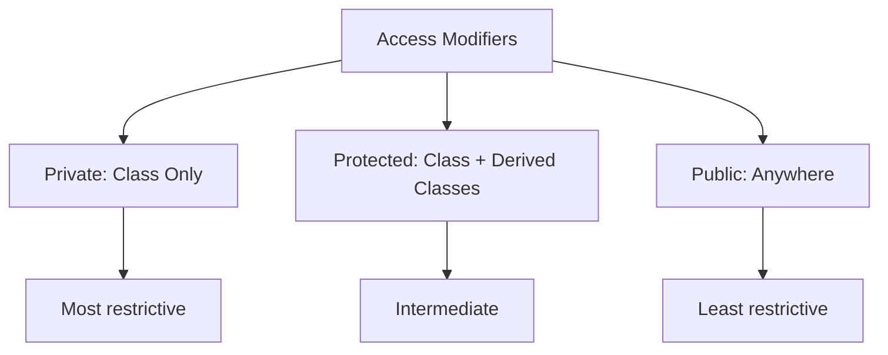
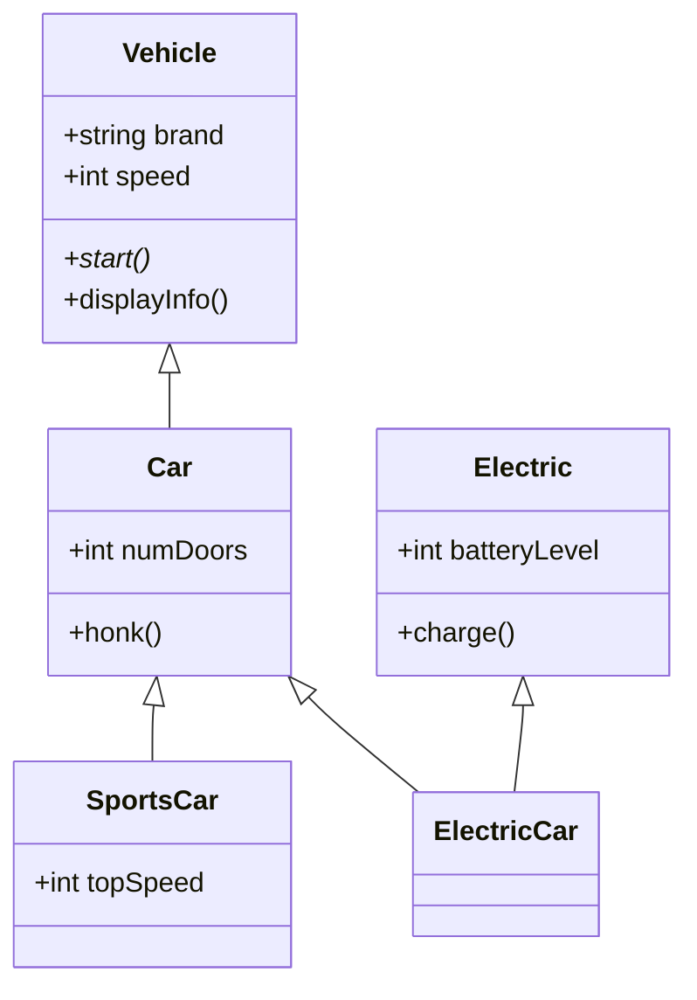
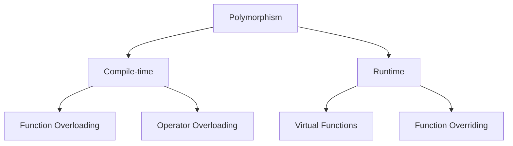
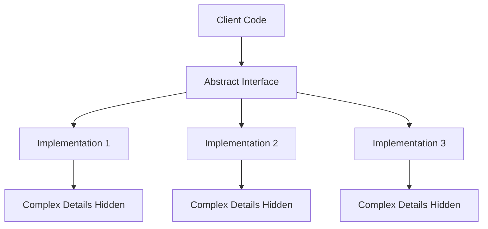

# OOP Part 2: Core Object-Oriented Principles - C++ Interview Guide

## 1. Access Modifiers

### Concise Concept Explanation
Access modifiers control the visibility and accessibility of class members. They enforce encapsulation and define the interface through which other code can interact with your class.

### Embedded Code Example
```cpp
#include <iostream>
#include <string>
using namespace std;

class BankAccount {
private:
    string accountNumber;
    double balance;

protected:
    string bankName;

public:
    string accountHolder;
    
    BankAccount(string accNum, string holder, double initialBalance) {
        accountNumber = accNum;
        accountHolder = holder;
        balance = initialBalance;
        bankName = "MyBank";
    }
    
    void displayPublicInfo() {
        cout << "Account Holder: " << accountHolder << endl;
        cout << "Bank: " << bankName << endl;
    }
    
    double getBalance() {
        return balance;
    }
};

class SavingsAccount : public BankAccount {
public:
    SavingsAccount(string accNum, string holder, double balance) 
        : BankAccount(accNum, holder, balance) {}
    
    void displayBankInfo() {
        cout << "Bank Name (accessible in derived class): " << bankName << endl;
        // cout << accountNumber; // Error: private member
    }
};

int main() {
    BankAccount account("123456", "John Doe", 1000.0);
    
    account.displayPublicInfo();
    cout << "Balance via getter: $" << account.getBalance() << endl;
    
    // account.balance = 5000; // Error: private member
    account.accountHolder = "Jane Smith"; // OK: public member
    
    SavingsAccount savings("789012", "Alice", 2000.0);
    savings.displayBankInfo();
    
    return 0;
}
```

**Expected Output:**
```
Account Holder: John Doe
Bank: MyBank
Balance via getter: $1000
Bank Name (accessible in derived class): MyBank
```

### Detailed Code Walkthrough
- **Line 6-8**: `private` members are only accessible within the class
- **Line 10-11**: `protected` members are accessible within the class and derived classes
- **Line 13-14**: `public` members are accessible from anywhere
- **Line 16-22**: Constructor can access all members regardless of access level
- **Line 35-41**: Derived class can access `protected` but not `private` members

### Illustrative Visuals


### Practical Application Scenarios
- Use `private` for internal implementation details
- Use `protected` for members that derived classes need to access
- Use `public` for the class interface that external code uses

### Common Mistakes and How to Avoid Them
- **Mistake**: Making data members public
- **Solution**: Use private data with public getter/setter methods
- **Mistake**: Overusing protected members
- **Solution**: Prefer private with controlled access through methods

### Key Takeaways
- Access modifiers enforce encapsulation
- Default access is private in classes
- Choose access levels based on intended usage

### Interview Questions & Answers

**Q1: What is the default access modifier in a C++ class?**
**A:** The default access modifier is `private` for class members.

**Q2: Can a derived class access private members of its base class?**
**A:** No, private members are only accessible within the class where they're declared.

**Q3: What's the difference between protected and private?**
**A:** Protected members are accessible in derived classes, while private members are not.

**Q4: When should you use protected instead of private?**
**A:** Use protected when you want derived classes to directly access the member, but still hide it from external code.

**Q5: Why is it bad practice to make data members public?**
**A:** It breaks encapsulation, allows uncontrolled modification, and makes maintenance difficult.

---

## 2. Encapsulation (Data Hiding)

### Concise Concept Explanation
Encapsulation is the bundling of data and methods that operate on that data within a single unit (class), while restricting direct access to some of the object's components.

### Embedded Code Example
```cpp
#include <iostream>
using namespace std;

class Temperature {
private:
    double celsius;

public:
    // Setter with validation
    void setCelsius(double temp) {
        if (temp < -273.15) {
            cout << "Temperature cannot be below absolute zero!" << endl;
        } else {
            celsius = temp;
        }
    }
    
    // Getter
    double getCelsius() {
        return celsius;
    }
    
    // Getter with conversion
    double getFahrenheit() {
        return (celsius * 9/5) + 32;
    }
};

class FullyEncapsulatedAccount {
private:
    string accountNumber;
    double balance;
    string ownerName;

public:
    FullyEncapsulatedAccount(string accNum, string owner, double initialBalance) {
        accountNumber = accNum;
        ownerName = owner;
        setBalance(initialBalance);
    }
    
    // Read-only access
    string getAccountNumber() const { return accountNumber; }
    string getOwnerName() const { return ownerName; }
    double getBalance() const { return balance; }
    
    // Controlled modification
    void deposit(double amount) {
        if (amount > 0) {
            balance += amount;
            cout << "Deposited: $" << amount << endl;
        }
    }
    
    bool withdraw(double amount) {
        if (amount > 0 && amount <= balance) {
            balance -= amount;
            cout << "Withdrawn: $" << amount << endl;
            return true;
        }
        cout << "Withdrawal failed!" << endl;
        return false;
    }

private:
    void setBalance(double newBalance) {
        if (newBalance >= 0) {
            balance = newBalance;
        }
    }
};

int main() {
    Temperature temp;
    temp.setCelsius(25.0);
    cout << "Celsius: " << temp.getCelsius() << endl;
    cout << "Fahrenheit: " << temp.getFahrenheit() << endl;
    
    temp.setCelsius(-300); // Validation test
    
    FullyEncapsulatedAccount account("ACC123", "John", 1000.0);
    account.deposit(500.0);
    account.withdraw(200.0);
    cout << "Final Balance: $" << account.getBalance() << endl;
    
    return 0;
}
```

**Expected Output:**
```
Celsius: 25
Fahrenheit: 77
Temperature cannot be below absolute zero!
Deposited: $500
Withdrawn: $200
Final Balance: $1300
```

### Detailed Code Walkthrough
- **Line 7-9**: Private data member hidden from direct access
- **Line 12-18**: Setter method with validation logic
- **Line 21-28**: Getter methods providing controlled access
- **Line 31-65**: Fully encapsulated class with all data private
- **Line 48-56**: Business logic methods controlling state changes

### Illustrative Visuals


### Practical Application Scenarios
- Bank accounts with controlled transaction methods
- Configuration objects with validation
- API classes that maintain internal invariants

### Common Mistakes and How to Avoid Them
- **Mistake**: Providing setters for all data members
- **Solution**: Only provide setters when necessary, with validation
- **Mistake**: Returning references to private data
- **Solution**: Return copies or const references

### Key Takeaways
- Encapsulation protects object integrity
- Enables validation and business logic enforcement
- Makes code more maintainable and secure

### Interview Questions & Answers

**Q1: What is encapsulation and why is it important?**
**A:** Encapsulation is bundling data and methods together while restricting direct access. It's important for maintaining data integrity and reducing coupling.

**Q2: What is a fully encapsulated class?**
**A:** A class where all data members are private and accessed only through methods.

**Q3: How does encapsulation differ from abstraction?**
**A:** Encapsulation is about hiding implementation details, while abstraction is about hiding complexity.

**Q4: What are the advantages of using getters and setters?**
**A:** They allow validation, logging, and maintain internal invariants when data changes.

**Q5: When should you avoid using setters?**
**A:** When the property shouldn't change after object creation, or when changes require complex validation.

---

## 3. Inheritance

### Concise Concept Explanation
Inheritance allows a new class to inherit properties and behaviors from an existing class, enabling code reuse and establishing "is-a" relationships.

### Embedded Code Example
```cpp
#include <iostream>
#include <string>
using namespace std;

// Base class
class Vehicle {
protected:
    string brand;
    int speed;

public:
    Vehicle(string b) : brand(b), speed(0) {}
    
    virtual void start() {
        cout << brand << " vehicle starting..." << endl;
    }
    
    void displayInfo() {
        cout << "Brand: " << brand << ", Speed: " << speed << " km/h" << endl;
    }
};

// Single inheritance
class Car : public Vehicle {
private:
    int numDoors;

public:
    Car(string b, int doors) : Vehicle(b), numDoors(doors) {}
    
    void start() override {
        cout << brand << " car with " << numDoors << " doors starting..." << endl;
    }
    
    void honk() {
        cout << "Beep beep!" << endl;
    }
};

// Multilevel inheritance
class SportsCar : public Car {
private:
    int topSpeed;

public:
    SportsCar(string b, int doors, int top) : Car(b, doors), topSpeed(top) {}
    
    void start() override {
        cout << brand << " sports car roaring to life! Top speed: " << topSpeed << " km/h" << endl;
    }
};

// Multiple inheritance example
class Electric {
public:
    int batteryLevel;
    
    Electric() : batteryLevel(100) {}
    
    void charge() {
        batteryLevel = 100;
        cout << "Fully charged!" << endl;
    }
};

class ElectricCar : public Car, public Electric {
public:
    ElectricCar(string b, int doors) : Car(b, doors) {}
    
    void start() override {
        cout << brand << " electric car starting silently. Battery: " << batteryLevel << "%" << endl;
    }
};

int main() {
    cout << "=== Single Inheritance ===" << endl;
    Car myCar("Toyota", 4);
    myCar.start();
    myCar.honk();
    
    cout << "\n=== Multilevel Inheritance ===" << endl;
    SportsCar sports("Ferrari", 2, 350);
    sports.start();
    sports.honk();
    
    cout << "\n=== Multiple Inheritance ===" << endl;
    ElectricCar tesla("Tesla", 4);
    tesla.start();
    tesla.charge();
    
    cout << "\n=== Polymorphic Behavior ===" << endl;
    Vehicle* vehicles[] = {&myCar, &sports, &tesla};
    for (Vehicle* v : vehicles) {
        v->start();
    }
    
    return 0;
}
```

**Expected Output:**
```
=== Single Inheritance ===
Toyota car with 4 doors starting...
Beep beep!

=== Multilevel Inheritance ===
Ferrari sports car roaring to life! Top speed: 350 km/h
Beep beep!

=== Multiple Inheritance ===
Tesla electric car starting silently. Battery: 100%
Fully charged!

=== Polymorphic Behavior ===
Toyota car with 4 doors starting...
Ferrari sports car roaring to life! Top speed: 350 km/h
Tesla electric car starting silently. Battery: 100%
```

### Detailed Code Walkthrough
- **Line 8-19**: Base class with protected members and virtual function
- **Line 22-35**: Single inheritance with method overriding
- **Line 38-48**: Multilevel inheritance adding new features
- **Line 51-65**: Multiple inheritance combining features
- **Line 75-80**: Polymorphic behavior through base class pointers

### Illustrative Visuals


### Practical Application Scenarios
- Building hierarchical class relationships (Vehicle → Car → SportsCar)
- Code reuse across related classes
- Implementing interface-based designs

### Common Mistakes and How to Avoid Them
- **Mistake**: Deep inheritance hierarchies
- **Solution**: Prefer composition over deep inheritance
- **Mistake**: Not using virtual destructors
- **Solution**: Always make base class destructors virtual

### Key Takeaways
- Inheritance enables code reuse and polymorphism
- Use public inheritance for "is-a" relationships
- Virtual functions enable runtime polymorphism

### Interview Questions & Answers

**Q1: What are the different types of inheritance in C++?**
**A:** Single, multiple, multilevel, hierarchical, and hybrid inheritance.

**Q2: What is the diamond problem and how is it solved?**
**A:** The diamond problem occurs in multiple inheritance when a class inherits from two classes that have a common base class. It's solved using virtual inheritance.

**Q3: What's the difference between public, protected, and private inheritance?**
**A:** Public inheritance preserves access levels, protected inheritance makes public members protected, private inheritance makes all members private.

**Q4: When should you use composition over inheritance?**
**A:** Use composition for "has-a" relationships and when you want to avoid tight coupling.

**Q5: Why should base class destructors be virtual?**
**A:** To ensure proper cleanup when deleting derived objects through base class pointers.

---

## 4. Polymorphism

### Concise Concept Explanation
Polymorphism allows objects of different types to be treated as objects of a common base type, enabling the same operation to behave differently based on the actual object type.

### Embedded Code Example
```cpp
#include <iostream>
#include <vector>
using namespace std;

// Base class with virtual functions
class Shape {
protected:
    string name;

public:
    Shape(string n) : name(n) {}
    
    // Virtual function for runtime polymorphism
    virtual double area() const = 0; // Pure virtual function
    
    virtual void draw() const {
        cout << "Drawing a " << name << endl;
    }
    
    // Virtual destructor
    virtual ~Shape() {
        cout << "Destroying " << name << endl;
    }
};

// Derived classes
class Circle : public Shape {
private:
    double radius;

public:
    Circle(double r) : Shape("Circle"), radius(r) {}
    
    double area() const override {
        return 3.14159 * radius * radius;
    }
    
    void draw() const override {
        cout << "Drawing Circle with radius " << radius << " and area " << area() << endl;
    }
};

class Rectangle : public Shape {
private:
    double width, height;

public:
    Rectangle(double w, double h) : Shape("Rectangle"), width(w), height(h) {}
    
    double area() const override {
        return width * height;
    }
    
    void draw() const override {
        cout << "Drawing Rectangle " << width << "x" << height << " with area " << area() << endl;
    }
};

// Compile-time polymorphism (function overloading)
class Calculator {
public:
    int add(int a, int b) {
        cout << "Adding integers: " << a << " + " << b;
        return a + b;
    }
    
    double add(double a, double b) {
        cout << "Adding doubles: " << a << " + " << b;
        return a + b;
    }
    
    string add(string a, string b) {
        cout << "Concatenating strings: " << a << " + " << b;
        return a + b;
    }
};

// Operator overloading
class Complex {
private:
    double real, imag;

public:
    Complex(double r = 0, double i = 0) : real(r), imag(i) {}
    
    // Operator overloading
    Complex operator+(const Complex& other) const {
        return Complex(real + other.real, imag + other.imag);
    }
    
    void display() const {
        cout << real << " + " << imag << "i";
    }
};

int main() {
    cout << "=== Runtime Polymorphism ===" << endl;
    vector<Shape*> shapes;
    shapes.push_back(new Circle(5.0));
    shapes.push_back(new Rectangle(4.0, 6.0));
    
    for (Shape* shape : shapes) {
        shape->draw(); // Polymorphic call
    }
    
    cout << "\n=== Compile-time Polymorphism (Overloading) ===" << endl;
    Calculator calc;
    cout << " = " << calc.add(5, 3) << endl;
    cout << " = " << calc.add(2.5, 3.7) << endl;
    cout << " = " << calc.add("Hello", "World") << endl;
    
    cout << "\n=== Operator Overloading ===" << endl;
    Complex c1(2.0, 3.0), c2(1.0, 4.0);
    Complex c3 = c1 + c2;
    cout << "("; c1.display(); cout << ") + ("; c2.display(); cout << ") = "; c3.display(); cout << endl;
    
    // Cleanup
    for (Shape* shape : shapes) {
        delete shape;
    }
    
    return 0;
}
```

**Expected Output:**
```
=== Runtime Polymorphism ===
Drawing Circle with radius 5 and area 78.5397
Drawing Rectangle 4x6 with area 24

=== Compile-time Polymorphism (Overloading) ===
Adding integers: 5 + 3 = 8
Adding doubles: 2.5 + 3.7 = 6.2
Concatenating strings: Hello + World = HelloWorld

=== Operator Overloading ===
(2 + 3i) + (1 + 4i) = 3 + 7i
Destroying Circle
Destroying Rectangle
```

### Detailed Code Walkthrough
- **Line 8-21**: Abstract base class with pure virtual function
- **Line 24-38**: Derived class overriding virtual functions
- **Line 41-56**: Another derived class with different implementation
- **Line 59-75**: Compile-time polymorphism through function overloading
- **Line 78-92**: Operator overloading example

### Illustrative Visuals


### Practical Application Scenarios
- GUI frameworks with different widget types
- Game development with different entity behaviors
- Plugin architectures

### Common Mistakes and How to Avoid Them
- **Mistake**: Forgetting to make destructors virtual
- **Solution**: Always use virtual destructors in polymorphic base classes
- **Mistake**: Slicing objects when copying
- **Solution**: Use pointers or references for polymorphic behavior

### Key Takeaways
- Runtime polymorphism uses virtual functions and dynamic binding
- Compile-time polymorphism uses overloading and templates
- Pure virtual functions make classes abstract

### Interview Questions & Answers

**Q1: What is the difference between compile-time and runtime polymorphism?**
**A:** Compile-time polymorphism is resolved during compilation (overloading), while runtime polymorphism is resolved during execution (virtual functions).

**Q2: What is a virtual function?**
**A:** A function that can be overridden in derived classes and called through base class pointers/references.

**Q3: What is a pure virtual function?**
**A:** A virtual function with no implementation that makes the class abstract.

**Q4: What is function overloading?**
**A:** Having multiple functions with the same name but different parameters.

**Q5: Why are virtual functions slower than regular functions?**
**A:** They require an extra indirection through the vtable, adding a small performance overhead.

---

## 5. Abstraction

### Concise Concept Explanation
Abstraction focuses on hiding complex implementation details and showing only essential features to the user. It reduces complexity by separating interface from implementation.

### Embedded Code Example
```cpp
#include <iostream>
#include <memory>
using namespace std;

// Abstract class (Interface)
class Database {
public:
    // Pure virtual functions - interface contract
    virtual void connect(const string& connectionString) = 0;
    virtual void disconnect() = 0;
    virtual void executeQuery(const string& query) = 0;
    virtual ~Database() = default;
};

// Concrete implementation 1
class MySQLDatabase : public Database {
public:
    void connect(const string& connectionString) override {
        cout << "Connecting to MySQL database: " << connectionString << endl;
        // Complex MySQL connection logic hidden
    }
    
    void disconnect() override {
        cout << "Disconnecting from MySQL database" << endl;
        // Complex MySQL disconnection logic hidden
    }
    
    void executeQuery(const string& query) override {
        cout << "Executing MySQL query: " << query << endl;
        // Complex MySQL query execution hidden
    }
};

// Concrete implementation 2
class PostgreSQLDatabase : public Database {
public:
    void connect(const string& connectionString) override {
        cout << "Connecting to PostgreSQL database: " << connectionString << endl;
        // Complex PostgreSQL connection logic hidden
    }
    
    void disconnect() override {
        cout << "Disconnecting from PostgreSQL database" << endl;
        // Complex PostgreSQL disconnection logic hidden
    }
    
    void executeQuery(const string& query) override {
        cout << "Executing PostgreSQL query: " << query << endl;
        // Complex PostgreSQL query execution hidden
    }
};

// High-level module that uses abstraction
class UserService {
private:
    unique_ptr<Database> database;

public:
    UserService(unique_ptr<Database> db) : database(move(db)) {}
    
    void addUser(const string& username) {
        database->connect("server=localhost;user=admin");
        database->executeQuery("INSERT INTO users VALUES ('" + username + "')");
        database->disconnect();
    }
};

// Another abstraction example
class PaymentProcessor {
public:
    virtual bool processPayment(double amount) = 0;
    virtual ~PaymentProcessor() = default;
};

class CreditCardProcessor : public PaymentProcessor {
private:
    bool validateCard(const string& cardNumber) {
        cout << "Validating credit card: " << cardNumber << endl;
        return true;
    }
    
    bool processTransaction(double amount) {
        cout << "Processing transaction of $" << amount << endl;
        return true;
    }

public:
    bool processPayment(double amount) override {
        // Complex payment processing hidden
        cout << "Credit Card Payment Processing:" << endl;
        if (validateCard("1234-5678-9012-3456")) {
            return processTransaction(amount);
        }
        return false;
    }
};

class PayPalProcessor : public PaymentProcessor {
public:
    bool processPayment(double amount) override {
        // Complex PayPal API calls hidden
        cout << "PayPal Payment Processing:" << endl;
        cout << "Redirecting to PayPal for amount: $" << amount << endl;
        return true;
    }
};

int main() {
    cout << "=== Database Abstraction Example ===" << endl;
    
    UserService mysqlService(make_unique<MySQLDatabase>());
    mysqlService.addUser("john_doe");
    
    cout << "\n=== Payment Abstraction Example ===" << endl;
    
    vector<unique_ptr<PaymentProcessor>> processors;
    processors.push_back(make_unique<CreditCardProcessor>());
    processors.push_back(make_unique<PayPalProcessor>());
    
    for (auto& processor : processors) {
        bool success = processor->processPayment(100.0);
        cout << "Payment " << (success ? "succeeded" : "failed") << endl << endl;
    }
    
    return 0;
}
```

**Expected Output:**
```
=== Database Abstraction Example ===
Connecting to MySQL database: server=localhost;user=admin
Executing MySQL query: INSERT INTO users VALUES ('john_doe')
Disconnecting from MySQL database

=== Payment Abstraction Example ===
Credit Card Payment Processing:
Validating credit card: 1234-5678-9012-3456
Processing transaction of $100
Payment succeeded

PayPal Payment Processing:
Redirecting to PayPal for amount: $100
Payment succeeded
```

### Detailed Code Walkthrough
- **Line 7-13**: Abstract interface defining the contract
- **Line 16-35**: Concrete implementation hiding complex details
- **Line 38-56**: Another implementation with different internals
- **Line 59-68**: High-level module depending on abstraction
- **Line 71-107**: Another abstraction example with different payment methods

### Illustrative Visuals


### Practical Application Scenarios
- Database access layers
- Payment processing systems
- File I/O operations
- Network communication

### Common Mistakes and How to Avoid Them
- **Mistake**: Leaking implementation details in interfaces
- **Solution**: Keep interfaces focused on what, not how
- **Mistake**: Creating overly complex abstractions
- **Solution**: Follow YAGNI (You Ain't Gonna Need It) principle

### Key Takeaways
- Abstraction simplifies complex systems
- Enables swapping implementations easily
- Reduces coupling between components

### Interview Questions & Answers

**Q1: What is abstraction and how does it differ from encapsulation?**
**A:** Abstraction hides complexity by showing only essential features, while encapsulation bundles data and methods while restricting access.

**Q2: What is an abstract class in C++?**
**A:** A class with at least one pure virtual function that cannot be instantiated.

**Q3: Can we create an object of an abstract class?**
**A:** No, we can only create pointers/references to abstract classes and instantiate concrete derived classes.

**Q4: What are the advantages of using abstraction?**
**A:** Reduces complexity, increases reusability, makes maintenance easier, and enables loose coupling.

**Q5: How do you achieve abstraction in C++?**
**A:** Through abstract classes (interfaces) with pure virtual functions and header files separating declaration from implementation.

---

## Final Interview Preparation Tips

### Common OOP Interview Questions

1. **Explain the four pillars of OOP with real-world examples**
2. **What is the difference between abstraction and encapsulation?**
3. **When would you use inheritance vs composition?**
4. **Explain virtual functions and vtables**
5. **What is the diamond problem and how is it solved?**
6. **Difference between overloading and overriding**
7. **Why are destructors made virtual in base classes?**
8. **What are pure virtual functions and abstract classes?**
9. **How does polymorphism work at runtime?**
10. **What are access modifiers and why are they important?**

### Coding Exercises to Practice

1. Design a shape hierarchy with area calculation
2. Implement a banking system with different account types
3. Create a vehicle rental system using inheritance
4. Build a notification system with different providers
5. Design a file handler with multiple format support

### Key Points to Remember

- Always use virtual destructors in polymorphic base classes
- Prefer composition over inheritance for code reuse
- Use access modifiers to enforce encapsulation
- Abstract classes define interfaces, concrete classes implement them
- Polymorphism enables flexible and extensible code

This guide covers the essential OOP principles you need for technical interviews. Practice implementing these concepts and be prepared to explain them clearly during interviews.