# Day 61: 🔗 Linked List Manipulation - Complete Beginner's Guide

> **Master pointer manipulation and the two-pointer technique step by step!**

---

## 📖 What You'll Learn

By the end of this guide, you'll master:
- 🔗 **Linked List Fundamentals** - Understanding nodes and pointers
- ↔️ **Pointer Reversal Techniques** - Three different approaches to reverse lists
- 🐢🐇 **Two-Pointer Algorithm** - The tortoise and hare technique
- 🎯 **In-Place Manipulation** - Changing structures without extra space
- 🧠 **Recursive Thinking** - Multiple recursion patterns for linked lists

---

## 🎯 The Problems

### 📋 Problem 1: Reverse Linked List (LeetCode 206)

**Given**: The head of a singly linked list  
**Task**: Reverse the list and return the new head  
**Challenge**: Do it in-place without creating new nodes

**Visual Example:**
```
Input:  1 → 2 → 3 → 4 → 5 → null
Output: 5 → 4 → 3 → 2 → 1 → null
```

### 📋 Problem 2: Middle of Linked List (LeetCode 876)

**Given**: The head of a singly linked list  
**Task**: Return the middle node  
**Rule**: If there are two middle nodes (even length), return the second one

**Visual Example:**
```
Input:  1 → 2 → 3 → 4 → 5 → null
Output: 3 (and rest: 3 → 4 → 5)

Input:  1 → 2 → 3 → 4 → 5 → 6 → null
Output: 4 (and rest: 4 → 5 → 6)
```

---

## 🔍 Understanding the Basics

### 🏗️ What is a Linked List?

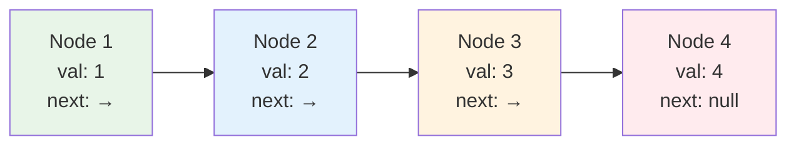

**Think of it like a train:**
- Each **node** is like a train car
- Each car has **data** (passengers)
- Each car has a **next pointer** (connection to next car)
- The last car points to **null** (end of train)

**Key Differences from Arrays:**

| Feature | Array | Linked List |
|---------|-------|-------------|
| Memory | Contiguous | Scattered |
| Access | O(1) by index | O(n) traversal |
| Insertion | O(n) - shift elements | O(1) - change pointers |
| Size | Fixed | Dynamic |

### 🎯 Node Structure

```cpp
struct ListNode {
    int val;           // Data stored in node
    ListNode *next;    // Pointer to next node
    
    ListNode() : val(0), next(nullptr) {}
    ListNode(int x) : val(x), next(nullptr) {}
    ListNode(int x, ListNode *next) : val(x), next(next) {}
};
```

---

## 📚 Problem 1: Reverse Linked List - Step-by-Step

### 🟢 Example 1: Three-Node List

**Input:** `1 → 2 → 3 → null`  
**Output:** `3 → 2 → 1 → null`

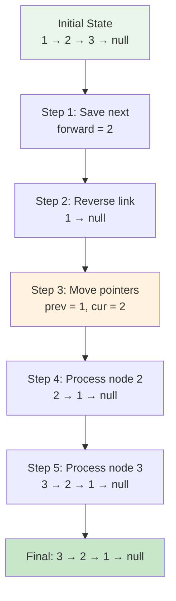

**Detailed Step-by-Step:**

**Initial:**
```
prev = null
cur = 1 → 2 → 3 → null
forward = null
```

**Iteration 1:**
```
1. forward = cur->next = 2
2. cur->next = prev = null
3. Result: 1 → null
4. prev = 1, cur = 2
```

**Iteration 2:**
```
1. forward = cur->next = 3
2. cur->next = prev = 1
3. Result: 2 → 1 → null
4. prev = 2, cur = 3
```

**Iteration 3:**
```
1. forward = cur->next = null
2. cur->next = prev = 2
3. Result: 3 → 2 → 1 → null
4. prev = 3, cur = null (exit loop)
```

**Final:** Return `prev` (which is `3`)

### 🔴 Example 2: Single Node

**Input:** `5 → null`  
**Output:** `5 → null`

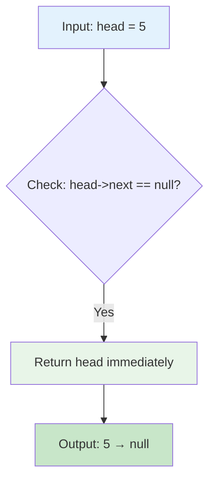

**Why this optimization?**
- No reversal needed for single node
- Saves unnecessary loop execution
- Edge case handled efficiently

### 🟡 Example 3: Two Nodes

**Input:** `1 → 2 → null`  
**Output:** `2 → 1 → null`

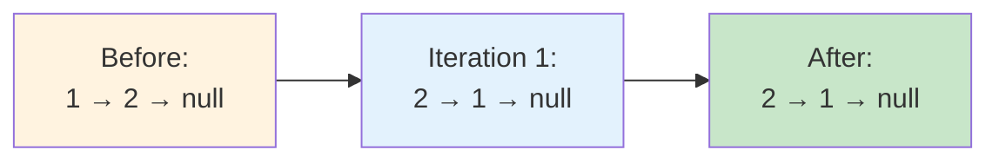

---

## 🛠️ Algorithm 1: Iterative Reversal (Three-Pointer)

### 🎯 The Strategy

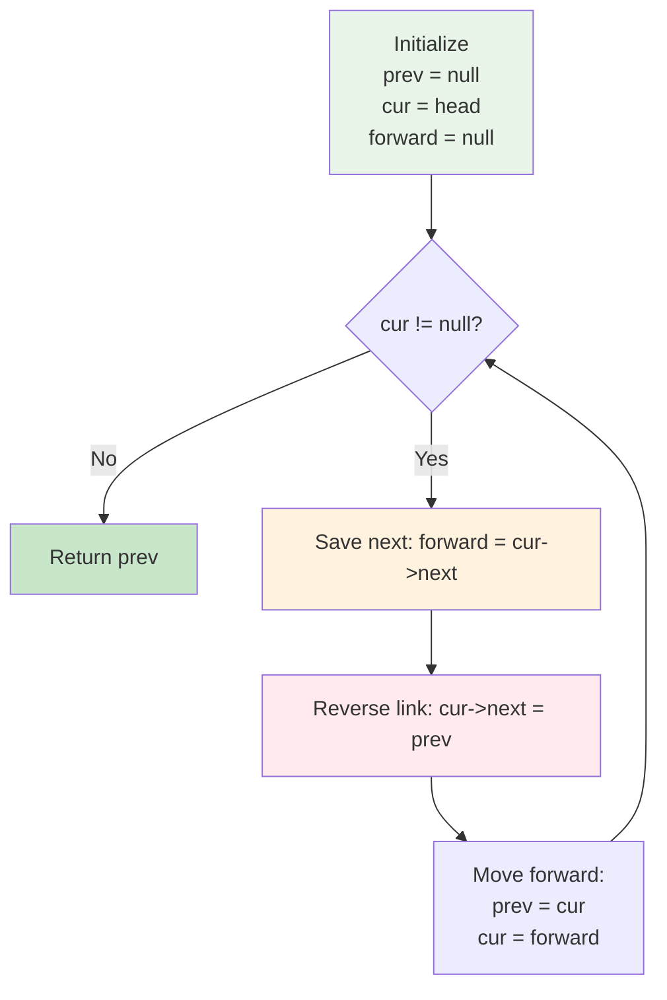

### 💻 The Code

```cpp
ListNode* reverseList(ListNode* head) {
    if (head == nullptr || head->next == nullptr)
        return head;

    ListNode* prev = nullptr;    // Previous node
    ListNode* cur = head;        // Current node
    ListNode* forward = nullptr; // Next node

    while (cur != nullptr) {
        // Step 1: Save next node
        forward = cur->next;
        
        // Step 2: Reverse the link
        cur->next = prev;
        
        // Step 3: Move pointers forward
        prev = cur;
        cur = forward;
    }
    
    return prev;  // New head
}
```

### 🔍 Visual Trace

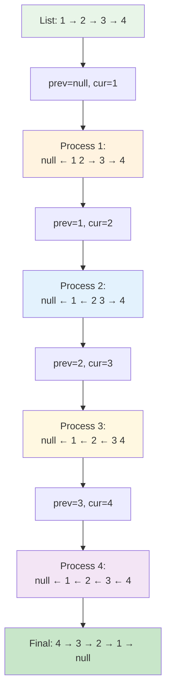

---

## 🔄 Algorithm 2: Recursive Reversal (Reference Parameter)

### 🎯 The Strategy

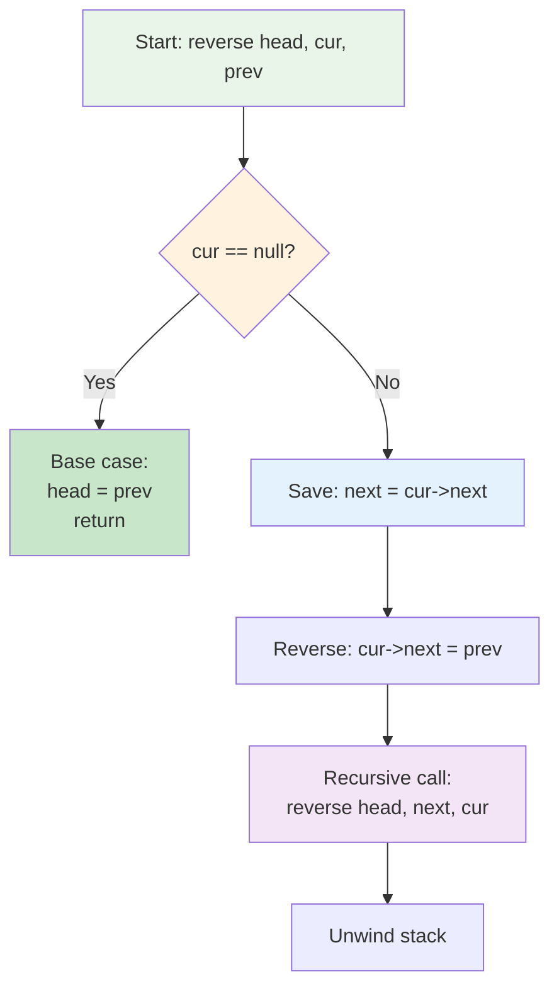

### 💻 The Code

```cpp
void reverse(ListNode*& head, ListNode* cur, ListNode* prev) {
    // Base case: reached end
    if (cur == nullptr) {
        head = prev;  // Update head to last node
        return;
    }
    
    // Save next node
    ListNode* next = cur->next;
    
    // Reverse current link
    cur->next = prev;
    
    // Recursive call for remaining list
    reverse(head, next, cur);
}

// Usage:
ListNode* reverseList(ListNode* head) {
    ListNode* prev = nullptr;
    ListNode* cur = head;
    reverse(head, cur, prev);
    return head;
}
```

### 📚 Recursion Stack Visualization

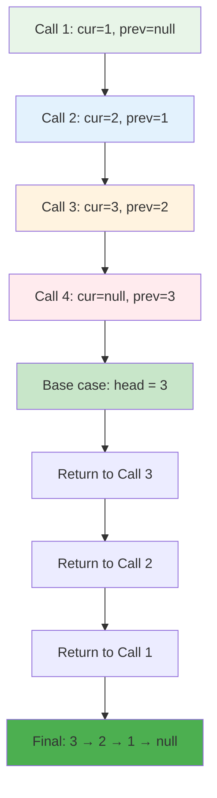

---

## 🌀 Algorithm 3: Pure Recursive Reversal

### 🎯 The Strategy

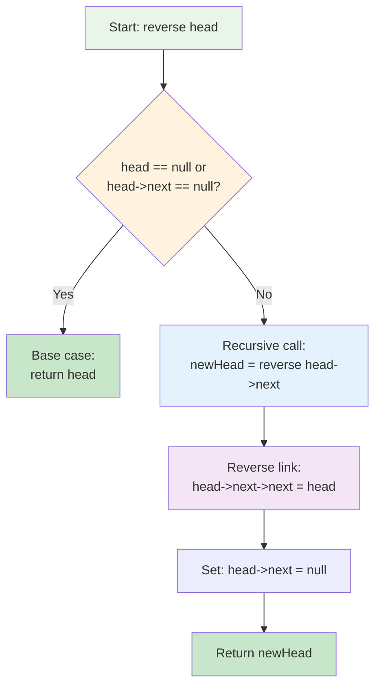

### 💻 The Code

```cpp
ListNode* reverse1(ListNode* head) {
    // Base case
    if (head == nullptr || head->next == nullptr)
        return head;

    // Recursively reverse rest of list
    ListNode* newHead = reverse1(head->next);
    
    // Reverse the link
    head->next->next = head;
    head->next = nullptr;
    
    // Return new head (unchanged through recursion)
    return newHead;
}
```

### 🎬 Step-by-Step Example: `1 → 2 → 3 → null`

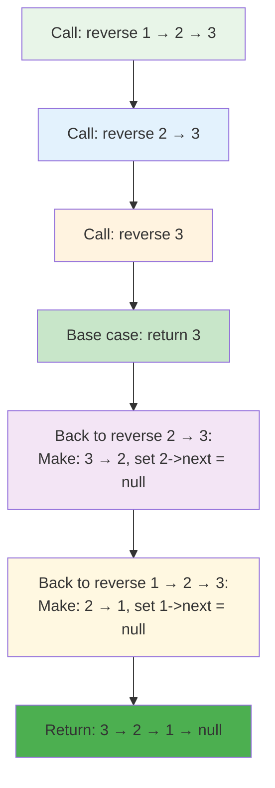

**Detailed Trace:**

**Call Stack Building:**
```
reverse(1→2→3)
  └─ reverse(2→3)
       └─ reverse(3)
            └─ return 3 ✅
```

**Stack Unwinding:**
```
reverse(2→3) receives newHead = 3
  - Do: 2->next->next = 2  →  3->next = 2
  - Do: 2->next = null
  - Return: 3

reverse(1→2→3) receives newHead = 3
  - Do: 1->next->next = 1  →  2->next = 1
  - Do: 1->next = null
  - Return: 3
```

**Final Result:** `3 → 2 → 1 → null`

---

## 📊 Complexity Analysis: Reverse Linked List

### ⏰ Time Complexity

| Approach | Time | Explanation |
|----------|------|-------------|
| Iterative | **O(n)** | Visit each node once |
| Recursive (Reference) | **O(n)** | Visit each node once |
| Pure Recursive | **O(n)** | Visit each node once |

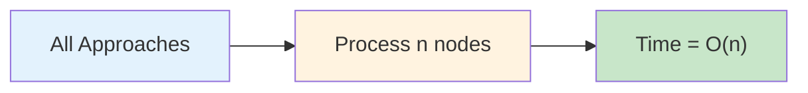

### 💾 Space Complexity

| Approach | Space | Explanation |
|----------|-------|-------------|
| Iterative | **O(1)** | Only 3 pointers used |
| Recursive (Reference) | **O(n)** | Call stack depth = n |
| Pure Recursive | **O(n)** | Call stack depth = n |

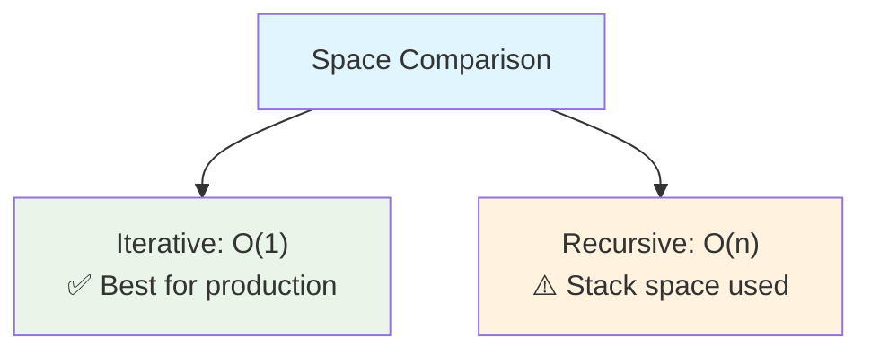

**Why O(n) for recursion?**
- Each recursive call adds a frame to the call stack
- For n nodes, we have n recursive calls
- Each frame stores local variables and return address

---

## 📚 Problem 2: Middle of Linked List - Step-by-Step

### 🟢 Example 1: Odd Length List

**Input:** `1 → 2 → 3 → 4 → 5 → null`  
**Output:** `3` (middle node)

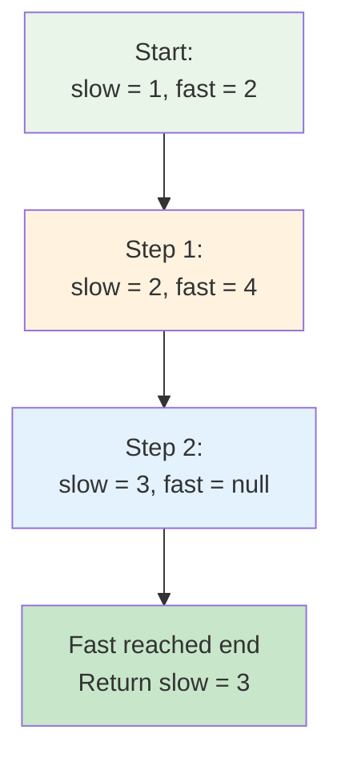

**Detailed Movement:**

```
Initial:
  1 → 2 → 3 → 4 → 5 → null
  ↑   ↑
  slow fast

Step 1:
  1 → 2 → 3 → 4 → 5 → null
      ↑       ↑
      slow    fast

Step 2:
  1 → 2 → 3 → 4 → 5 → null
          ↑           ↑
          slow        fast

Step 3:
  1 → 2 → 3 → 4 → 5 → null
          ↑               
          slow (fast = null, stop)
```

### 🔴 Example 2: Even Length List

**Input:** `1 → 2 → 3 → 4 → 5 → 6 → null`  
**Output:** `4` (second middle node)

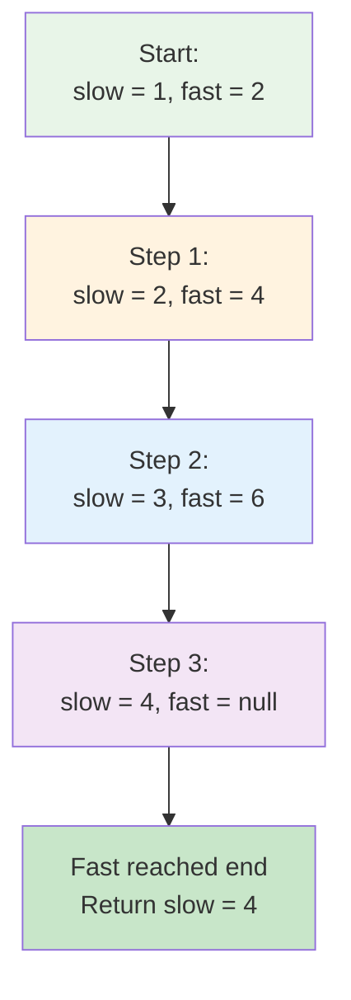

**Why second middle for even length?**
- Problem requirement: if two middle nodes exist, return second one
- This is achieved by starting fast at `head->next` instead of `head`
- When fast reaches end, slow is at second middle

### 🟡 Example 3: Two Nodes

**Input:** `1 → 2 → null`  
**Output:** `2`

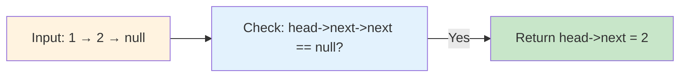

---

## 🐢🐇 The Two-Pointer Technique (Tortoise and Hare)

### 🎯 Core Concept

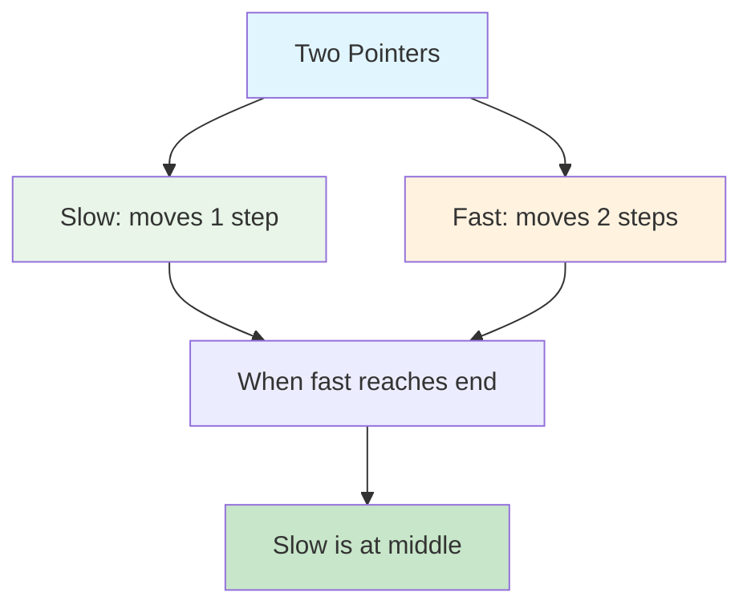

**Why does this work?**

**Mathematical Proof:**
```
Let list length = n

Fast pointer speed = 2 × Slow pointer speed

Time when fast reaches end = n/2 iterations
Distance covered by slow = n/2 steps
Position of slow = n/2 (exactly middle!)
```

**Visual Analogy:**
```
Think of two runners on a track:
🐢 Slow runner: 1 meter/second
🐇 Fast runner: 2 meters/second

If track is 100 meters:
- Fast runner finishes in 50 seconds
- Slow runner is at 50 meters (halfway!)
```

### 💻 The Code

```cpp
ListNode* middleNode(ListNode* head) {
    if (head->next == nullptr)
        return head;
    
    if (head->next->next == nullptr)
        return head->next;

    ListNode* slow = head;        // Tortoise
    ListNode* fast = head->next;  // Hare
    
    while (fast != nullptr) {
        slow = slow->next;        // Move 1 step
        fast = fast->next;        // Move 1 step
        
        if (fast != nullptr) {
            fast = fast->next;    // Move another step (total 2)
        }
    }
    
    return slow;
}
```

### 🔍 Detailed Trace: `[1,2,3,4,5]`

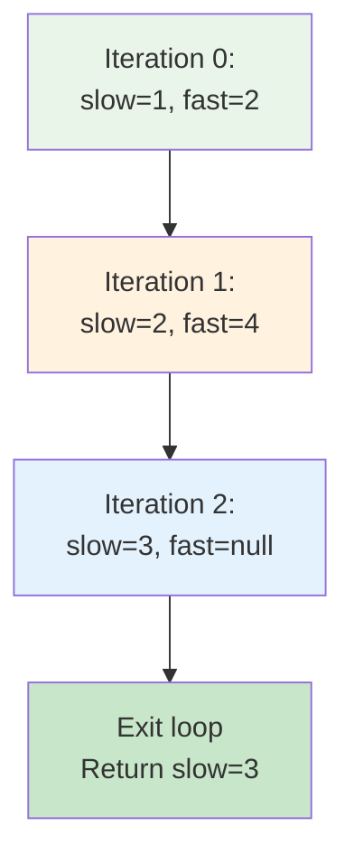

**Step-by-step:**

```
List: 1 → 2 → 3 → 4 → 5 → null

Iteration 0:
  slow = 1, fast = 2
  
Iteration 1:
  slow = slow->next = 2
  fast = fast->next = 3
  fast = fast->next = 4
  
Iteration 2:
  slow = slow->next = 3
  fast = fast->next = 5
  fast = fast->next = null
  
Loop exits (fast == null)
Return slow = 3 ✅
```

---

## 🧪 Test Cases & Edge Cases

### ✅ Reverse Linked List Test Cases

| Input | Output | Category |
|-------|--------|----------|
| `[1,2,3,4,5]` | `[5,4,3,2,1]` | Normal case |
| `[1,2]` | `[2,1]` | Two nodes |
| `[1]` | `[1]` | Single node |
| `[]` | `[]` | Empty list |
| `[1,2,3,4,5,6,7,8,9,10]` | `[10,9,8,7,6,5,4,3,2,1]` | Large list |

### ✅ Middle of Linked List Test Cases

| Input | Output | Length | Category |
|-------|--------|--------|----------|
| `[1,2,3,4,5]` | `[3,4,5]` | Odd | Normal |
| `[1,2,3,4,5,6]` | `[4,5,6]` | Even | Second middle |
| `[1]` | `[1]` | 1 | Single node |
| `[1,2]` | `[2]` | 2 | Two nodes |
| `[1,2,3]` | `[2,3]` | 3 | Three nodes |

### ⚠️ Edge Cases to Consider

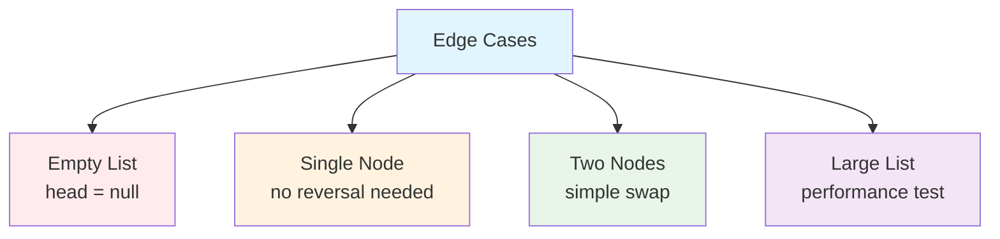

---

## 🎓 Key Concepts Mastery

### 🔗 Pointer Manipulation Patterns

**Pattern 1: Save Before Modify**
```cpp
// Always save next pointer before changing current->next
ListNode* next = current->next;  // Save
current->next = previous;        // Modify
```

**Pattern 2: Three-Pointer Technique**
```cpp
ListNode* prev = nullptr;
ListNode* cur = head;
ListNode* forward = nullptr;

// Maintain three references while traversing
```

**Pattern 3: Two-Pointer (Slow-Fast)**
```cpp
ListNode* slow = head;
ListNode* fast = head;

// Fast moves 2x speed of slow
while (fast != nullptr && fast->next != nullptr) {
    slow = slow->next;
    fast = fast->next->next;
}
```

### 🧠 Recursive Thinking Patterns

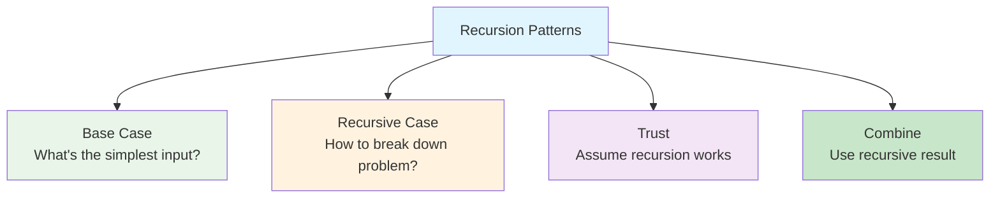

**Recursion Template:**
```cpp
ReturnType recursiveFunction(Input input) {
    // 1. Base case
    if (simplestCase) {
        return baseResult;
    }
    
    // 2. Recursive case
    ReturnType subResult = recursiveFunction(smallerInput);
    
    // 3. Combine results
    return combineWithCurrent(subResult);
}
```

### 🎯 Problem-Solving Framework for Linked Lists

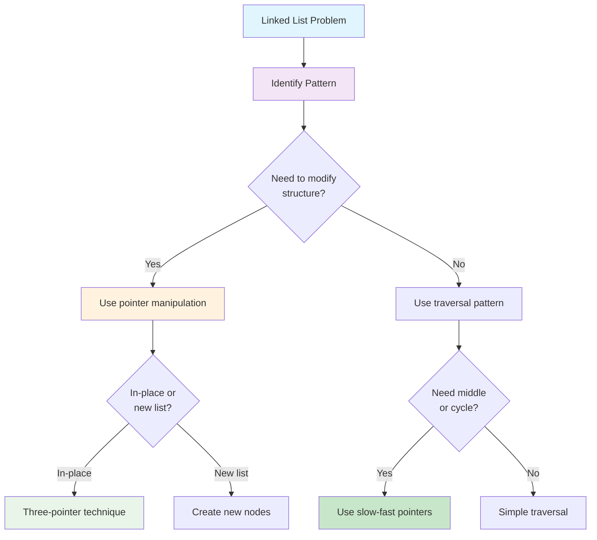

---

## 📊 Complexity Analysis: Middle of Linked List

### ⏰ Time Complexity: O(n)

**Both approaches process the list once:**

```mermaid
flowchart LR
    A["Approach 1:<br/>Length calculation"] --> B["First pass: count<br/>Second pass: traverse"]
    C["Approach 2:<br/>Two pointers"] --> D["Single pass: both pointers"]
    B --> E["Total: O(n) + O(n/2) = O(n)"]
    D --> F["Total: O(n)"]
    
    style A fill:#fff3e0
    style C fill:#e8f5e8
    style E fill:#ffebee
    style F fill:#c8e6c9
```

**Approach 1 (Length Calculation):**
```
Step 1: Count nodes = O(n)
Step 2: Traverse to middle = O(n/2)
Total = O(n) + O(n/2) = O(n)
```

**Approach 2 (Two-Pointer):**
```
Single traversal with two pointers = O(n)
More efficient in practice (one pass)
```

### 💾 Space Complexity: O(1)

**Both approaches use constant extra space:**
- Approach 1: Variables `len`, `count`, `temp`
- Approach 2: Variables `slow`, `fast`
- No arrays, no recursion, no additional data structures

---

## 🚀 Practice Problems

Master these problems to solidify your understanding:

| Problem | Difficulty | Key Concept | Platform |
|---------|------------|-------------|----------|
| 🔄 Reverse Linked List II | Medium | Partial reversal | LeetCode 92 |
| 🔗 Merge Two Sorted Lists | Easy | Pointer manipulation | LeetCode 21 |
| 🎯 Remove Nth Node From End | Medium | Two-pointer | LeetCode 19 |
| ♻️ Linked List Cycle | Easy | Fast-slow pointers | LeetCode 141 |
| 🔄 Palindrome Linked List | Easy | Reverse + compare | LeetCode 234 |
| 🌀 Reorder List | Medium | Find middle + reverse | LeetCode 143 |

---

## 💼 Interview Questions & Answers

### ❓ Question 1: Why use three pointers for reversal?

**Answer:**  
We need three pointers to avoid losing references:

1. **prev** - Where current should point to (reversed direction)
2. **cur** - Current node being processed
3. **forward** - Saves next node before we change cur->next

**Simple Explanation:**  
```
Without forward pointer:
cur->next = prev;  // We lost reference to rest of list! 💥

With forward pointer:
forward = cur->next;  // Save it first ✅
cur->next = prev;     // Now safe to reverse
```

It's like crossing a river on stepping stones - you need to see the next stone before moving your foot!

---

### ❓ Question 2: Why start fast pointer at head->next for finding middle?

**Answer:**  
Starting fast at `head->next` ensures we get the **second middle** for even-length lists:

```
Example: [1,2,3,4]

Method 1: slow=1, fast=1
  After iterations: slow=2, fast=null
  Returns: 2 (first middle)

Method 2: slow=1, fast=2
  After iterations: slow=3, fast=null
  Returns: 3 (second middle) ✅
```

**Problem requirement:** Return second middle for even length!

---

### ❓ Question 3: Can you reverse a linked list without extra pointers?

**Answer:**  
No, you need at least **two pointers** (prev and cur). Here's why:

```cpp
// Attempt with one pointer:
cur->next = ???  // What do we point to? We don't know previous!

// Need prev pointer:
cur->next = prev;  // Now we know where to point
```

**Simple Explanation:**  
To reverse arrows, you need to know both ends of each arrow. One pointer only tells you one end!

---

### ❓ Question 4: What's the space complexity of recursive reversal and why?

**Answer:**  
**Space: O(n)** due to recursion call stack.

**Detailed Explanation:**
```
For list: 1 → 2 → 3 → 4 → 5

Call stack builds up:
reverse(1) 
  └─ reverse(2)
       └─ reverse(3)
            └─ reverse(4)
                 └─ reverse(5)  ← Stack depth = 5

Each call stores:
- Local variables
- Return address
- Function parameters

Total stack space = O(n)
```

**Simple Explanation:**  
Each node gets its own "layer" in the stack, like stacking plates. More nodes = more plates = more space!

---

### ❓ Question 5: How does the slow-fast pointer technique work mathematically?

**Answer:**  

**Mathematical Proof:**
```
Let:
- List length = n
- Slow pointer position = s
- Fast pointer position = f

At each iteration:
- s increases by 1
- f increases by 2

When fast reaches end:
- f = n
- Number of iterations = n/2
- s = n/2 (middle!)
```

**Visual Example:**
```
List: 1 → 2 → 3 → 4 → 5

Iteration 0: slow=1 (pos 0), fast=2 (pos 1)
Iteration 1: slow=2 (pos 1), fast=4 (pos 3)
Iteration 2: slow=3 (pos 2), fast=null (pos 5)

Final: slow at position 2 = middle of 5 elements! ✅
```

---

### ❓ Question 6: What if we need the first middle for even-length lists?

**Answer:**  
Start both pointers at `head` instead of `fast at head->next`:

```cpp
ListNode* slow = head;
ListNode* fast = head;  // Both start at head

while (fast->next != nullptr && fast->next->next != nullptr) {
    slow = slow->next;
    fast = fast->next->next;
}

return slow;  // First middle for even length
```

**Example:**
```
List: [1,2,3,4]

Method 1 (current): slow=1, fast=2
  Result: slow=3 (second middle)

Method 2 (modified): slow=1, fast=1
  Result: slow=2 (first middle)
```

---

### ❓ Question 7: Can you reverse only part of a linked list?

**Answer:**  
Yes! This is "Reverse Linked List II" (LeetCode 92). The approach:

```cpp
// Reverse from position left to right
1. Traverse to position left-1
2. Use three-pointer technique for (right-left+1) nodes
3. Connect the reversed part back to rest of list
```

**Example:**
```
Input: 1 → 2 → 3 → 4 → 5, left=2, right=4
Output: 1 → 4 → 3 → 2 → 5

Steps:
1. Keep 1 unchanged
2. Reverse 2 → 3 → 4 to get 4 → 3 → 2
3. Connect: 1 → (4 → 3 → 2) → 5
```

---

### ❓ Question 8: How do you detect a cycle using slow-fast pointers?

**Answer:**  
If there's a cycle, fast will eventually catch up to slow:

```cpp
ListNode* slow = head;
ListNode* fast = head;

while (fast != nullptr && fast->next != nullptr) {
    slow = slow->next;
    fast = fast->next->next;
    
    if (slow == fast) {
        return true;  // Cycle detected!
    }
}

return false;  // No cycle
```

**Why it works:**
```
No cycle: Fast reaches null first
Cycle: Fast "laps" slow like runners on a track

Think of it like a circular race track:
- Fast runner (2x speed) will catch slow runner
- If they meet, track must be circular!
```

---

### ❓ Question 9: What's the difference between iterative and recursive space complexity?

**Answer:**  

| Approach | Space | Location | Can Overflow? |
|----------|-------|----------|---------------|
| Iterative | O(1) | Stack | No |
| Recursive | O(n) | Call stack | Yes (for large n) |

**Simple Explanation:**
```
Iterative:
  Uses 3 variables = constant space
  Variables stored in fixed memory
  Safe for any list size

Recursive:
  Uses n stack frames = linear space
  Each frame adds to call stack
  Can cause stack overflow for huge lists!
```

**Production Code:**  
Always prefer iterative for linked list reversal due to O(1) space and no stack overflow risk.

---

### ❓ Question 10: How would you explain pointers to a beginner?

**Answer:**  

**Analogy 1: House Addresses**
```
Pointer = House address
Value = What's inside the house

int* ptr = &x;
  ptr stores address (where to find the house)
  *ptr is the value (what's inside)
```

**Analogy 2: Treasure Map**
```
X marks the spot = Pointer (location)
Treasure = Value (what you find there)

Following the map (dereferencing) = *ptr
```

**Visual:**
```cpp
int x = 5;
int* ptr = &x;

Memory:
  Address 1000: [5] ← x
  Address 2000: [1000] ← ptr (points to address 1000)

ptr = 1000 (address of x)
*ptr = 5 (value at address 1000)
```

---

### ❓ Question 11: Why is in-place reversal important?

**Answer:**  

**Benefits of in-place reversal:**
1. **Space efficient:** O(1) vs O(n) for creating new list
2. **Faster:** No memory allocation for new nodes
3. **Memory friendly:** No garbage for garbage collector
4. **Interview gold:** Shows understanding of pointers

**Comparison:**
```
Creating new list:
- Allocate n new nodes = O(n) space
- Copy n values = O(n) time
- Total: O(n) time, O(n) space

In-place reversal:
- Change n pointers = O(n) time
- Use 3 variables = O(1) space
- Total: O(n) time, O(1) space ✅
```

**Real-world impact:**
```
List with 1 million nodes:
- New list: ~16 MB extra memory
- In-place: ~24 bytes (3 pointers)
```

---

### ❓ Question 12: What's the most common mistake in linked list problems?

**Answer:**  

**Top 5 Mistakes:**

**1. Losing References**
```cpp
// ❌ Wrong:
cur->next = prev;  // Lost rest of list!

// ✅ Correct:
forward = cur->next;  // Save first
cur->next = prev;     // Then modify
```

**2. Null Pointer Dereference**
```cpp
// ❌ Wrong:
while (cur != nullptr) {
    cur->next->next = something;  // What if cur->next is null?
}

// ✅ Correct:
while (cur != nullptr && cur->next != nullptr) {
    cur->next->next = something;
}
```

**3. Not Handling Edge Cases**
```cpp
// ❌ Wrong:
ListNode* reverse(ListNode* head) {
    // Start reversing without checking
}

// ✅ Correct:
ListNode* reverse(ListNode* head) {
    if (head == nullptr || head->next == nullptr)
        return head;  // Handle empty/single node
    // Then reverse
}
```

**4. Off-by-One Errors**
```cpp
// For middle of even list:
// Make sure you return SECOND middle, not first!
```

**5. Forgetting to Return New Head**
```cpp
// ❌ Wrong:
return head;  // Old head, now tail!

// ✅ Correct:
return prev;  // New head
```

---

## 🎯 Quick Reference

### 🔑 Essential Code Patterns

**Three-Pointer Reversal:**
```cpp
ListNode* prev = nullptr;
ListNode* cur = head;
ListNode* forward = nullptr;

while (cur != nullptr) {
    forward = cur->next;   // Save
    cur->next = prev;      // Reverse
    prev = cur;            // Move
    cur = forward;
}
return prev;  // New head
```

**Two-Pointer (Slow-Fast):**
```cpp
ListNode* slow = head;
ListNode* fast = head->next;

while (fast != nullptr) {
    slow = slow->next;
    fast = fast->next;
    if (fast != nullptr) {
        fast = fast->next;
    }
}
return slow;  // Middle node
```

**Pure Recursive Reversal:**
```cpp
ListNode* reverse(ListNode* head) {
    if (head == nullptr || head->next == nullptr)
        return head;
    
    ListNode* newHead = reverse(head->next);
    head->next->next = head;
    head->next = nullptr;
    return newHead;
}
```

### 📝 Important Patterns

```mermaid
flowchart TD
    A["Linked List Patterns"] --> B["Traversal<br/>Single pointer"]
    A --> C["Reversal<br/>Three pointers"]
    A --> D["Middle/Cycle<br/>Slow-fast pointers"]
    A --> E["Merging<br/>Two list pointers"]
    
    style A fill:#e1f5fe
    style B fill:#e8f5e8
    style C fill:#fff3e0
    style D fill:#f3e5f5
    style E fill:#ffecb3
```

### 🧠 Mental Models

**Reversal Mental Model:**
```mermaid
flowchart LR
    A["Think of arrows"] --> B["Each arrow needs:<br/>- Source node<br/>- Destination node"]
    B --> C["Three pointers track:<br/>- Where we are cur<br/>- Where we came from prev<br/>- Where we're going forward"]
    
    style A fill:#e3f2fd
    style B fill:#fff3e0
    style C fill:#e8f5e8
```

**Two-Pointer Mental Model:**
```mermaid
flowchart LR
    A["Think of racers"] --> B["🐢 Slow: 1 step<br/>🐇 Fast: 2 steps"]
    B --> C["When fast finishes<br/>slow is at halfway"]
    
    style A fill:#e3f2fd
    style B fill:#fff3e0
    style C fill:#c8e6c9
```

---

## 🏆 Mastery Checklist

### Problem 1: Reverse Linked List
- [ ] ✅ Understand three-pointer technique
- [ ] ✅ Implement iterative reversal
- [ ] ✅ Implement recursive reversal (reference parameter)
- [ ] ✅ Implement pure recursive reversal
- [ ] ✅ Handle edge cases (null, single node)
- [ ] ✅ Explain space complexity differences
- [ ] ✅ Know when to use each approach
- [ ] ✅ Avoid losing references during reversal

### Problem 2: Middle of Linked List
- [ ] ✅ Understand slow-fast pointer technique
- [ ] ✅ Implement two-pointer solution
- [ ] ✅ Handle odd-length lists
- [ ] ✅ Handle even-length lists (second middle)
- [ ] ✅ Explain mathematical reasoning
- [ ] ✅ Apply technique to cycle detection
- [ ] ✅ Optimize for single pass
- [ ] ✅ Test with various list lengths

### General Linked List Mastery
- [ ] ✅ Understand node structure and pointers
- [ ] ✅ Master pointer dereferencing
- [ ] ✅ Handle null pointer cases
- [ ] ✅ Visualize pointer movements
- [ ] ✅ Know when to save references
- [ ] ✅ Apply patterns to new problems
- [ ] ✅ Explain solutions clearly in interviews
- [ ] ✅ Write bug-free code on first attempt

---

## 💡 Pro Tips

### For Reverse Linked List:

1. **🎯 Draw It Out**: Always sketch the pointer movements on paper/whiteboard
2. **🔒 Save Before Modify**: Never change a pointer without saving what it points to
3. **🧪 Test Edge Cases**: Empty list, single node, two nodes
4. **📚 Know All Three**: Interviewers may ask for multiple approaches
5. **⚡ Prefer Iterative**: O(1) space is better for production code
6. **🎬 Trace Execution**: Walk through your code step-by-step
7. **🛡️ Check Null**: Always validate pointers before dereferencing
8. **💬 Communicate**: Explain your approach before coding

### For Middle of Linked List:

1. **🐢🐇 Master the Pattern**: This appears in many problems (cycle detection, palindrome)
2. **📏 Understand Speed**: Fast moves 2x, so positions divide by 2
3. **🎯 Edge Cases**: Single node, two nodes, empty list
4. **🔄 Both Solutions**: Know length-based and two-pointer approaches
5. **📊 Compare Efficiency**: Two-pointer is more elegant (one pass)
6. **🧮 Do the Math**: Understand why it works mathematically
7. **🔗 Connect Concepts**: Use middle-finding for other problems (palindrome check)
8. **⚡ Start Position**: Remember fast starts at head->next for second middle

### General Interview Tips:

1. **🎤 Clarify Requirements**: Ask about edge cases and constraints
2. **📝 Plan First**: Discuss approach before coding
3. **🎯 Start Simple**: Get basic solution working, then optimize
4. **🧪 Test As You Go**: Check logic at each step
5. **💭 Think Aloud**: Explain your thought process
6. **🔄 Multiple Approaches**: Show you know different solutions
7. **📊 Analyze Complexity**: Always discuss time and space
8. **🐛 Handle Errors**: Consider null cases and edge conditions

---

## 🎨 Visual Summary

### Problem Comparison

```mermaid
flowchart TD
    A["Day 61:<br/>Linked List Manipulation"] --> B["Problem 1:<br/>Reverse List"]
    A --> C["Problem 2:<br/>Find Middle"]
    
    B --> D["Three Pointers<br/>Time: O(n)<br/>Space: O(1)"]
    B --> E["Recursion<br/>Time: O(n)<br/>Space: O(n)"]
    
    C --> F["Length Method<br/>Time: O(n)<br/>Space: O(1)"]
    C --> G["Slow-Fast<br/>Time: O(n)<br/>Space: O(1)"]
    
    style A fill:#e1f5fe
    style B fill:#fff3e0
    style C fill:#e8f5e8
    style D fill:#c8e6c9
    style E fill:#ffecb3
    style F fill:#f3e5f5
    style G fill:#c8e6c9
```

### Technique Relationships

```mermaid
flowchart LR
    A["Pointer Techniques"] --> B["Single Pointer<br/>Basic traversal"]
    A --> C["Two Pointers<br/>Slow-Fast"]
    A --> D["Three Pointers<br/>Reversal"]
    
    C --> E["Cycle Detection"]
    C --> F["Middle Finding"]
    C --> G["Palindrome Check"]
    
    D --> H["Reverse Entire List"]
    D --> I["Reverse Sublist"]
    D --> J["Reorder List"]
    
    style A fill:#e1f5fe
    style C fill:#e8f5e8
    style D fill:#fff3e0
    style E fill:#f3e5f5
    style F fill:#c8e6c9
    style G fill:#ffecb3
```

---

## 🔗 Related Problems & Progression Path

### Beginner Level (Start Here)
```mermaid
flowchart TD
    A["Start"] --> B["Delete Node<br/>LeetCode 237"]
    B --> C["Middle of List<br/>LeetCode 876 ✅"]
    C --> D["Reverse List<br/>LeetCode 206 ✅"]
    D --> E["Merge Two Lists<br/>LeetCode 21"]
    
    style A fill:#e8f5e8
    style C fill:#4caf50
    style D fill:#4caf50
    style E fill:#fff3e0
```

### Intermediate Level (Next Steps)
```mermaid
flowchart TD
    A["Master Basics"] --> B["Linked List Cycle<br/>LeetCode 141"]
    B --> C["Remove Nth from End<br/>LeetCode 19"]
    C --> D["Palindrome List<br/>LeetCode 234"]
    D --> E["Intersection of Lists<br/>LeetCode 160"]
    E --> F["Odd Even List<br/>LeetCode 328"]
    
    style A fill:#c8e6c9
    style B fill:#fff3e0
    style C fill:#fff3e0
    style D fill:#fff3e0
    style E fill:#fff3e0
    style F fill:#fff3e0
```

### Advanced Level (Challenge Yourself)
```mermaid
flowchart TD
    A["Advanced Mastery"] --> B["Reverse Linked List II<br/>LeetCode 92"]
    B --> C["Reorder List<br/>LeetCode 143"]
    C --> D["Sort List<br/>LeetCode 148"]
    D --> E["Merge K Lists<br/>LeetCode 23"]
    E --> F["Copy List with Random<br/>LeetCode 138"]
    
    style A fill:#4caf50
    style B fill:#ffebee
    style C fill:#ffebee
    style D fill:#ffebee
    style E fill:#ffebee
    style F fill:#ffebee
```

---

## 📚 Further Learning Resources

### Concepts to Study Next
1. **Doubly Linked Lists** - Nodes with prev and next pointers
2. **Circular Linked Lists** - Last node points to first
3. **Skip Lists** - Multi-level linked lists for fast search
4. **XOR Linked Lists** - Memory-efficient doubly linked lists

### Problem Categories
| Category | Key Technique | Example Problems |
|----------|---------------|------------------|
| Reversal | Three pointers | Reverse List, Reverse II |
| Two Pointers | Slow-Fast | Middle, Cycle, Palindrome |
| Merging | Comparison | Merge Two Lists, Merge K |
| Reordering | Split + Reverse | Reorder List, Odd Even |
| Detection | Fast pointer | Cycle, Intersection |

---

## 🎯 Interview Preparation Checklist

### Before the Interview
- [ ] ✅ Practice drawing linked lists on paper
- [ ] ✅ Memorize core patterns (three-pointer, slow-fast)
- [ ] ✅ Review edge cases (null, single node, two nodes)
- [ ] ✅ Prepare complexity analysis explanations
- [ ] ✅ Practice explaining algorithms verbally
- [ ] ✅ Solve 10+ linked list problems
- [ ] ✅ Time yourself solving problems
- [ ] ✅ Practice on whiteboard (no IDE autocomplete)

### During the Interview
- [ ] ✅ Listen carefully to problem statement
- [ ] ✅ Ask clarifying questions
- [ ] ✅ Discuss edge cases upfront
- [ ] ✅ Explain approach before coding
- [ ] ✅ Draw diagrams for visualization
- [ ] ✅ Code cleanly with meaningful variable names
- [ ] ✅ Test with examples as you write
- [ ] ✅ Discuss time and space complexity
- [ ] ✅ Mention alternative approaches
- [ ] ✅ Handle interviewer's follow-up questions

### Common Follow-Up Questions
1. "What if the list is very large?" → Discuss space complexity
2. "Can you do it recursively?" → Show recursive solution
3. "What about edge cases?" → Handle null, single node
4. "How would you test this?" → Describe test strategy
5. "Can you optimize further?" → Analyze current complexity
6. "What if memory is limited?" → Prefer O(1) space solutions

---

## 🌟 Success Stories & Applications

### Real-World Applications

**1. Browser History**
```mermaid
flowchart LR
    A["Page 1"] --> B["Page 2"]
    B --> C["Page 3"]
    C --> D["Current Page"]
    
    style D fill:#4caf50
```
- Back button: traverse backward
- Forward button: traverse forward
- Doubly linked list for bi-directional navigation

**2. Music Playlist**
```mermaid
flowchart LR
    A["Song 1"] --> B["Song 2"]
    B --> C["Song 3"]
    C --> D["Song 4"]
    D -->|"Repeat"| A
    
    style C fill:#4caf50
```
- Next song: move to next node
- Previous song: doubly linked list
- Shuffle: reorder nodes
- Repeat: circular linked list

**3. Undo/Redo Functionality**
```mermaid
flowchart LR
    A["State 1"] --> B["State 2"]
    B --> C["State 3"]
    C --> D["Current State"]
    
    style D fill:#4caf50
```
- Undo: traverse backward
- Redo: traverse forward
- Each node stores a state

**4. Memory Management**
```
Operating systems use linked lists for:
- Free memory blocks
- Process scheduling queues
- File system structures
```

---

## 🎊 Congratulations!

You've mastered:
- ✅ **Two fundamental linked list problems**
- ✅ **Three different reversal approaches**
- ✅ **The famous slow-fast pointer technique**
- ✅ **In-place pointer manipulation**
- ✅ **Recursive and iterative thinking**
- ✅ **Time and space complexity analysis**
- ✅ **Interview-ready explanations**

### 🎯 Next Steps

1. **Practice Daily**: Solve one linked list problem every day
2. **Teach Others**: Explain these concepts to someone else
3. **Build Projects**: Implement a doubly linked list or LRU cache
4. **Mock Interviews**: Practice with peers or online platforms
5. **Explore Advanced**: Try hard-level linked list problems
6. **Review Regularly**: Come back to these notes weekly

---

## 📖 Key Takeaways

### The Three Pillars of Linked List Mastery

```mermaid
flowchart TD
    A["Linked List Mastery"] --> B["1. Pointer Understanding<br/>Know what pointers are<br/>and how they work"]
    A --> C["2. Pattern Recognition<br/>Identify when to use<br/>which technique"]
    A --> D["3. Edge Case Handling<br/>Always consider null<br/>and boundary cases"]
    
    style A fill:#e1f5fe
    style B fill:#e8f5e8
    style C fill:#fff3e0
    style D fill:#ffebee
```

### Essential Formulas

**Reversal:**
```
Algorithm: Save → Reverse → Move
Code: forward = cur->next; cur->next = prev; prev = cur; cur = forward;
```

**Middle Finding:**
```
Speed Ratio: fast = 2 × slow
Result: When fast reaches end, slow is at middle
```

**Complexity:**
```
Iterative: Time O(n), Space O(1) ✅
Recursive: Time O(n), Space O(n) ⚠️
```

---

## 🎉 Final Words

> **"The difference between a good programmer and a great programmer is their understanding of data structures. Master linked lists, and you'll master pointers. Master pointers, and you'll master programming."**

**Remember:**
- 🎯 Always draw before you code
- 🧪 Test edge cases religiously  
- 💬 Communicate your thought process
- 🔄 Practice until it's second nature
- 🌟 Help others learn what you've learned

**You're now equipped to:**
- ✅ Ace linked list interview questions
- ✅ Solve complex pointer manipulation problems
- ✅ Explain algorithms clearly and confidently
- ✅ Write bug-free linked list code
- ✅ Teach these concepts to others

---

**🚀 Keep coding, keep learning, and happy problem solving!**

**Day 61 Complete! ✨**