# Complete C++ Linked List Learning Guide

## 1. Introduction

### What is a Linked List?

A linked list is a linear data structure where elements (called nodes) are stored in separate memory locations and connected through pointers. Unlike arrays where elements are stored in consecutive memory locations, linked list nodes can be scattered anywhere in memory.

Each node contains:
- **Data**: The actual value you want to store (integer, string, object, etc.)
- **Pointer(s)**: Reference(s) to the next node (and sometimes previous node)

Think of it like a treasure hunt where each clue (node) tells you where to find the next clue, rather than having all clues laid out in a row.

### Why Use Linked Lists Instead of Arrays?

**Advantages of Linked Lists:**
- **Dynamic Size**: Can grow or shrink during runtime without predefined size
- **Efficient Insertions/Deletions**: Adding or removing elements doesn't require shifting other elements
- **No Memory Waste**: Only allocates memory when needed
- **Flexibility**: Easy to insert elements at the beginning or middle

**Disadvantages of Linked Lists:**
- **No Random Access**: Must traverse from the beginning to reach a specific position
- **Extra Memory**: Each node needs additional memory for pointer(s)
- **Cache Unfriendly**: Nodes scattered in memory lead to more cache misses

**When to Use Linked Lists:**
- Frequent insertions and deletions at the beginning or middle
- Unknown or changing data size
- When you don't need random access to elements

**When to Use Arrays:**
- Need quick access to any element by index
- Size is known and fixed
- Memory is limited (no pointer overhead)

### Node Structure and Pointer Connections

The basic building block of a linked list is a **node**. Here's how it works:

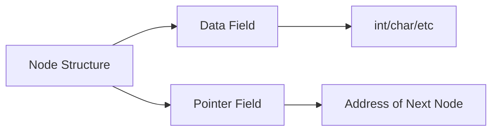

**Basic Node Components:**
1. **Data Field**: Stores the actual information
2. **Next Pointer**: Stores the memory address of the next node

**Connection Concept:**
- The first node is called the **HEAD** (entry point)
- Each node points to the next node
- The last node's pointer is **NULL** (indicates end of list)

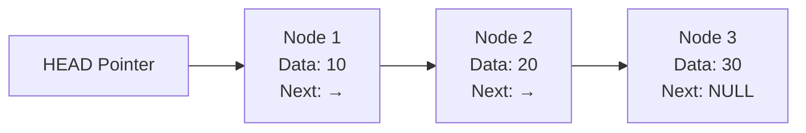

---

## 2. Topic Breakdown

### 2.1 Basics of Linked List

#### Concept Explanation

A basic linked list consists of nodes connected in a chain. The most fundamental type is the **singly linked list** where each node points only to the next node.

**Key Components:**
- **HEAD pointer**: Points to the first node (if list is empty, HEAD is NULL)
- **Nodes**: Individual elements containing data and next pointer
- **NULL terminator**: Last node's next pointer is NULL

#### Memory Representation

Unlike arrays with contiguous memory, linked list nodes are scattered:

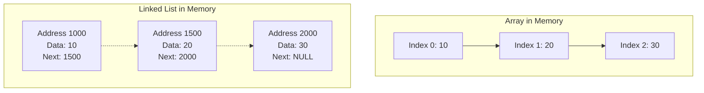

#### Example Description

Imagine creating a simple linked list of three student ages: 18, 19, and 20.

1. Create first node with data 18, next pointer set to NULL
2. Create second node with data 19, link first node to it
3. Create third node with data 20, link second node to it

#### Code Walkthrough

**Step 1: Define Node Structure**
- Create a structure with an integer data field
- Add a pointer to the same structure type (self-referential)

**Step 2: Create First Node**
- Allocate memory dynamically for a new node
- Set data to 18
- Set next pointer to NULL
- Make HEAD point to this node

**Step 3: Add Second Node**
- Allocate memory for another node
- Set data to 19
- Link first node's next pointer to this new node

**Step 4: Add Third Node**
- Allocate memory for third node
- Set data to 20
- Link second node's next pointer to this node
- Third node's next remains NULL

#### Common Mistakes

1. **Forgetting to initialize HEAD to NULL**: Always start with HEAD = NULL for an empty list
2. **Not checking for NULL before dereferencing**: Always verify pointer is not NULL before accessing data
3. **Memory leaks**: Forgetting to deallocate memory when removing nodes
4. **Losing reference to HEAD**: Never move HEAD pointer without saving its value

#### Key Takeaways

- Linked lists are dynamic data structures using pointers
- Each node contains data and a pointer to the next node
- HEAD pointer is the entry point to the list
- Last node's next pointer is always NULL
- Memory is allocated dynamically as needed

---

### 2.2 Singly Linked List

#### 2.2.1 Creating a Singly Linked List

##### Concept Explanation

Creating a singly linked list involves defining the node structure and initializing the HEAD pointer. The list starts empty (HEAD = NULL) and grows as nodes are added.

##### Example Description

Create an empty linked list, then add numbers 5, 10, and 15 one by one.

##### Code Walkthrough

**Step 1: Define Node Structure**
- Structure named "Node" with integer data and Node pointer named next

**Step 2: Initialize Empty List**
- Declare HEAD pointer of type Node pointer
- Set HEAD to NULL (represents empty list)

**Step 3: Create and Add Nodes**
- For each number, allocate memory using new operator
- Set the data field
- Link the node into the list (adjust pointers)

##### Visual Diagram

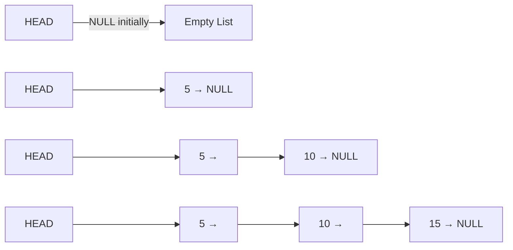

##### Common Mistakes

- Forgetting to initialize HEAD to NULL
- Not checking if memory allocation succeeded
- Incorrect pointer linking when adding nodes

##### Key Takeaways

- Always initialize HEAD to NULL for empty list
- Use dynamic memory allocation (new) for nodes
- Each node must be properly linked to maintain chain
- Structure definition is the foundation of linked list

---

#### 2.2.2 Insertion Operations

##### Concept Explanation

Insertion in a singly linked list can happen at three positions:
1. **At the beginning (HEAD)**
2. **At the end (TAIL)**
3. **At a specific position (middle)**

Each insertion type requires different pointer manipulation.

##### Example Description - Insert at Beginning

Insert value 3 at the beginning of list: 5 → 10 → 15 → NULL

##### Code Walkthrough - Insert at Beginning

**Step 1**: Allocate memory for new node with data 3
**Step 2**: Set new node's next pointer to current HEAD
**Step 3**: Update HEAD to point to new node

Result: 3 → 5 → 10 → 15 → NULL

##### Visual Diagram - Insert at Beginning

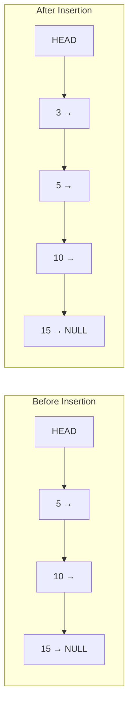

##### Example Description - Insert at End

Insert value 20 at the end of list: 5 → 10 → 15 → NULL

##### Code Walkthrough - Insert at End

**Step 1**: Allocate memory for new node with data 20
**Step 2**: Traverse to the last node (whose next is NULL)
**Step 3**: Set last node's next pointer to new node
**Step 4**: Set new node's next to NULL

Result: 5 → 10 → 15 → 20 → NULL

##### Visual Diagram - Insert at End

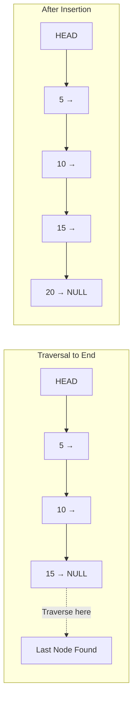

##### Example Description - Insert at Position

Insert value 7 at position 2 (0-indexed) in list: 5 → 10 → 15 → NULL

##### Code Walkthrough - Insert at Position

**Step 1**: Allocate memory for new node with data 7
**Step 2**: Traverse to position 1 (one before target position)
**Step 3**: Save the next node reference
**Step 4**: Link current node to new node
**Step 5**: Link new node to saved next node

Result: 5 → 10 → 7 → 15 → NULL

##### Visual Diagram - Insert at Position

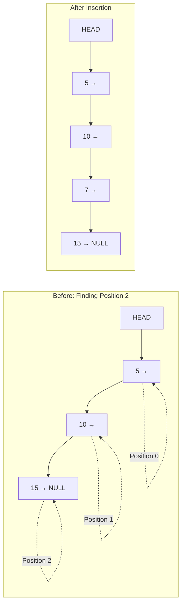

##### Common Mistakes

- **Insert at Beginning**: Forgetting to update HEAD pointer
- **Insert at End**: Not checking if list is empty before traversing
- **Insert at Position**: Off-by-one errors in traversal
- **General**: Not setting new node's next pointer before linking
- **Memory**: Not checking if position is valid

##### Key Takeaways

- Insert at beginning is O(1) - very efficient
- Insert at end is O(n) - requires full traversal
- Insert at position requires traversal to that position
- Always handle edge cases (empty list, invalid position)
- Pointer order matters - save references before changing links

---

#### 2.2.3 Deletion Operations

##### Concept Explanation

Deletion in a singly linked list removes a node and adjusts pointers to maintain the chain. Like insertion, deletion can occur at:
1. **Beginning** - Remove HEAD node
2. **End** - Remove last node
3. **Specific position** - Remove node at given position
4. **By value** - Remove first node with specific value

**Critical**: Always free the memory of deleted nodes to avoid memory leaks.

##### Example Description - Delete at Beginning

Delete first node from list: 5 → 10 → 15 → NULL

##### Code Walkthrough - Delete at Beginning

**Step 1**: Check if list is empty (HEAD == NULL)
**Step 2**: Save HEAD pointer in temporary variable
**Step 3**: Move HEAD to next node (HEAD = HEAD->next)
**Step 4**: Delete the saved node using delete operator

Result: 10 → 15 → NULL

##### Visual Diagram - Delete at Beginning

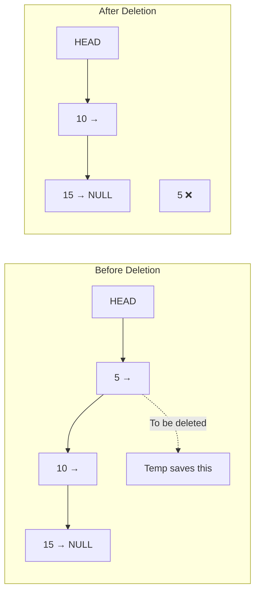

##### Example Description - Delete at End

Delete last node from list: 5 → 10 → 15 → NULL

##### Code Walkthrough - Delete at End

**Step 1**: Check if list is empty
**Step 2**: Handle special case: single node (HEAD->next == NULL)
**Step 3**: Traverse to second-last node
**Step 4**: Save last node pointer
**Step 5**: Set second-last node's next to NULL
**Step 6**: Delete saved last node

Result: 5 → 10 → NULL

##### Visual Diagram - Delete at End

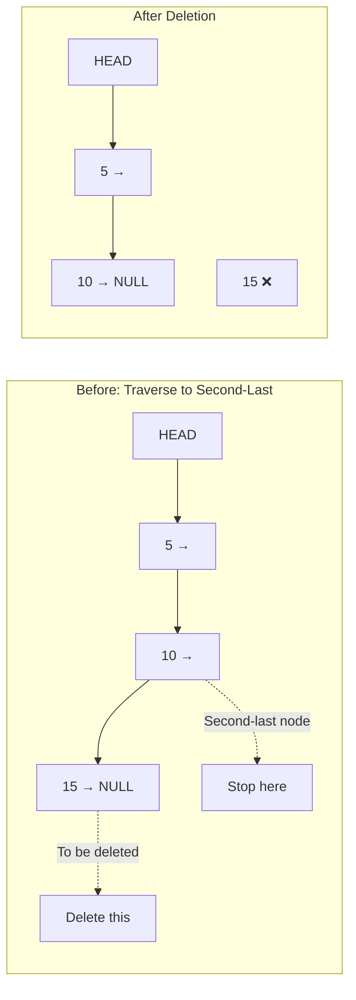

##### Example Description - Delete at Position

Delete node at position 1 from list: 5 → 10 → 15 → NULL

##### Code Walkthrough - Delete at Position

**Step 1**: Check if position is valid
**Step 2**: Handle special case: position 0 (delete at beginning)
**Step 3**: Traverse to node before target position
**Step 4**: Save target node pointer
**Step 5**: Link previous node to node after target
**Step 6**: Delete saved target node

Result: 5 → 15 → NULL

##### Visual Diagram - Delete at Position

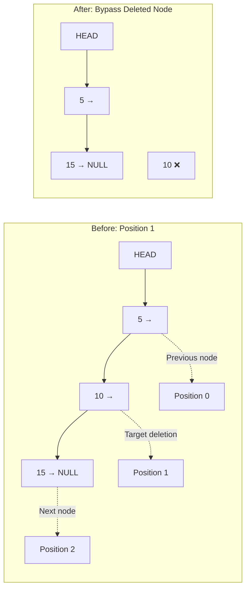

##### Example Description - Delete by Value

Delete first node with value 10 from list: 5 → 10 → 15 → 10 → NULL

##### Code Walkthrough - Delete by Value

**Step 1**: Check if list is empty
**Step 2**: Handle special case: HEAD node has the value
**Step 3**: Traverse while checking each node's data
**Step 4**: When value found, save node pointer
**Step 5**: Link previous node to next node
**Step 6**: Delete saved node
**Step 7**: Return success/failure

Result: 5 → 15 → 10 → NULL (only first occurrence removed)

##### Visual Diagram - Delete by Value

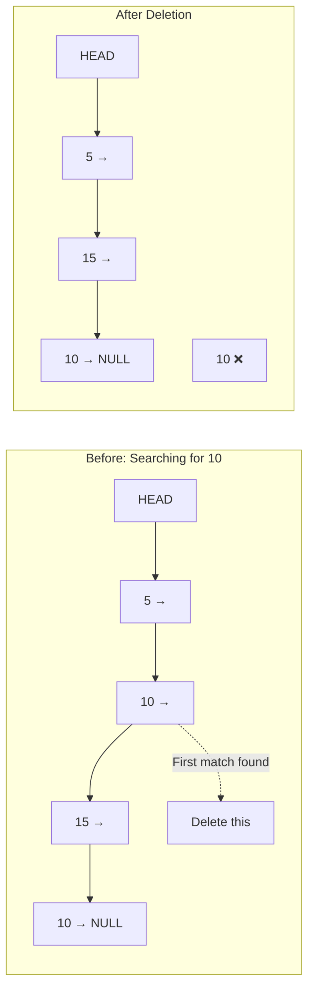

##### Common Mistakes

- **Memory Leak**: Forgetting to delete the removed node
- **Dangling Pointers**: Deleting node before updating pointers
- **Null Dereference**: Not checking if list is empty before deletion
- **Single Node**: Not handling special case when deleting only node
- **Position Validation**: Not checking if position exists in list
- **Order of Operations**: Updating pointers in wrong sequence

##### Key Takeaways

- Always check if list is empty before deletion
- Save node pointer before changing links
- Update pointers before deleting node
- Handle special cases (delete first, delete only node)
- Always free memory using delete operator
- Delete at beginning is O(1), others require traversal O(n)

---

#### 2.2.4 Traversal Operations

##### Concept Explanation

Traversal means visiting each node in the linked list sequentially from HEAD to the last node. It's the fundamental operation used for:
- Displaying all elements
- Searching for a value
- Counting nodes
- Finding specific positions

Traversal always starts at HEAD and follows next pointers until reaching NULL.

##### Example Description

Traverse and display all elements in list: 5 → 10 → 15 → 20 → NULL

##### Code Walkthrough

**Step 1**: Check if list is empty (HEAD == NULL)
**Step 2**: Create temporary pointer, initialize to HEAD
**Step 3**: Loop while temporary pointer is not NULL
**Step 4**: Process current node (print data)
**Step 5**: Move to next node (temp = temp->next)
**Step 6**: Repeat until temp becomes NULL

Output: 5 10 15 20

##### Visual Diagram

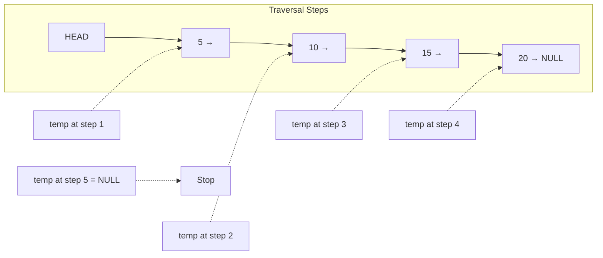

##### Common Mistakes

- **Modifying HEAD**: Using HEAD pointer for traversal (creates loss of list access)
- **Infinite Loop**: Forgetting to move pointer to next node
- **Null Dereference**: Accessing data after pointer becomes NULL
- **Off-by-One**: Processing one extra time after reaching last node

##### Key Takeaways

- Always use a temporary pointer for traversal
- Never modify HEAD pointer during traversal
- Check for NULL before accessing node data
- Time complexity: O(n) - must visit all nodes
- Traversal is the basis for most linked list operations

---

#### 2.2.5 Searching Operations

##### Concept Explanation

Searching finds if a specific value exists in the linked list. There are two common search approaches:
1. **Search by Value**: Find if value exists, return true/false
2. **Search by Position**: Find value at specific position

Unlike arrays with O(1) random access, linked lists require sequential search with O(n) complexity.

##### Example Description - Search by Value

Search for value 15 in list: 5 → 10 → 15 → 20 → NULL

##### Code Walkthrough - Search by Value

**Step 1**: Check if list is empty
**Step 2**: Initialize temporary pointer to HEAD
**Step 3**: Loop through nodes
**Step 4**: Compare current node's data with search value
**Step 5**: If match found, return true
**Step 6**: Move to next node
**Step 7**: If loop ends without finding, return false

Result: Found at position 2 (0-indexed)

##### Visual Diagram - Search by Value

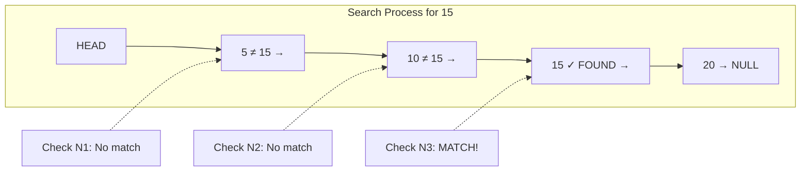

##### Example Description - Get Value at Position

Get value at position 2 from list: 5 → 10 → 15 → 20 → NULL

##### Code Walkthrough - Get Value at Position

**Step 1**: Check if list is empty
**Step 2**: Initialize counter to 0
**Step 3**: Initialize temporary pointer to HEAD
**Step 4**: Loop while counter less than target position
**Step 5**: Move to next node and increment counter
**Step 6**: Check if reached NULL before target position
**Step 7**: Return data from current node

Result: Value 15 found at position 2

##### Visual Diagram - Get Value at Position

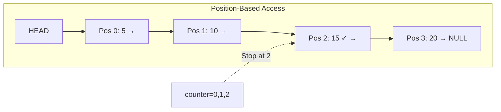

##### Example Description - Find Position of Value

Find position of value 10 in list: 5 → 10 → 15 → 20 → NULL

##### Code Walkthrough - Find Position of Value

**Step 1**: Initialize position counter to 0
**Step 2**: Initialize temporary pointer to HEAD
**Step 3**: Loop through nodes
**Step 4**: If current data matches value, return position
**Step 5**: Increment position counter
**Step 6**: Move to next node
**Step 7**: If not found, return -1

Result: Value 10 found at position 1

##### Visual Diagram - Find Position

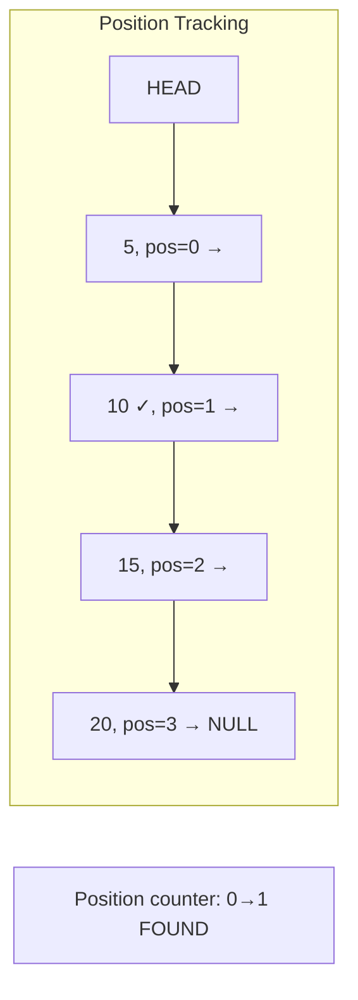

##### Common Mistakes

- **Not checking for empty list** before searching
- **Position out of bounds**: Not validating position exists
- **Returning uninitialized value** when not found
- **Forgetting to move pointer** in search loop
- **Comparing pointers instead of values**: Using == on node pointers

##### Key Takeaways

- Linked list search is sequential, O(n) complexity
- Always check if list is empty first
- Return appropriate value/flag when not found
- Position-based access requires counting from HEAD
- No direct access like arrays - must traverse
- Can track both position and value during single traversal

---

### 2.3 Circular Singly Linked List

#### Concept Explanation

A circular singly linked list is similar to a regular singly linked list, but the last node's next pointer points back to the first node (HEAD) instead of NULL. This creates a circular chain with no natural end.

**Key Differences from Regular Singly Linked List:**
- Last node points to HEAD (not NULL)
- No NULL terminator in the chain
- Can traverse indefinitely (circular path)
- Useful for applications needing circular behavior (round-robin scheduling, circular buffers)

**Advantages:**
- Any node can be starting point
- Efficient for circular operations
- Useful for implementing circular queues
- Can reach any node from any position

**Challenges:**
- Must be careful to avoid infinite loops
- Need different termination conditions
- Deletion of last node requires special handling

##### Visual Diagram - Structure Comparison

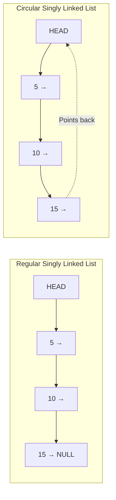

#### Example Description - Creating Circular List

Create a circular linked list with values 10, 20, 30.

#### Code Walkthrough - Creation

**Step 1**: Create first node with data 10
**Step 2**: Make HEAD point to first node
**Step 3**: Set first node's next to itself (circular for single node)
**Step 4**: Create second node with data 20
**Step 5**: Insert after first node, maintain circular link
**Step 6**: Create third node with data 30
**Step 7**: Insert after second node
**Step 8**: Ensure last node points back to HEAD

Result: 10 → 20 → 30 → (back to 10)

#### Visual Diagram - Circular Connection

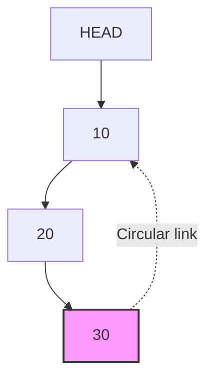

#### Insertion in Circular Singly Linked List

##### Insert at Beginning

**Concept**: Add node at HEAD and update last node's pointer to new HEAD.

**Walkthrough**:
1. Create new node
2. If list empty, make node point to itself
3. Otherwise, traverse to last node
4. Set new node's next to current HEAD
5. Set last node's next to new node
6. Update HEAD to new node

##### Insert at End

**Concept**: Add node after last node and maintain circular link.

**Walkthrough**:
1. Create new node
2. If list empty, follow insert at beginning
3. Traverse to last node (node whose next is HEAD)
4. Set new node's next to HEAD
5. Set last node's next to new node

#### Visual Diagram - Insertion

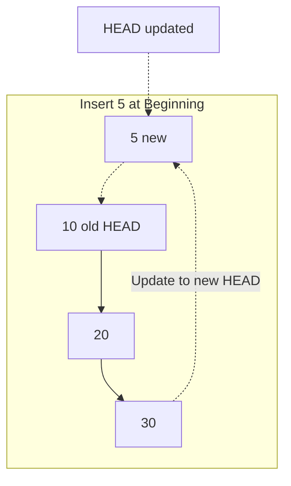

#### Deletion in Circular Singly Linked List

##### Concept Explanation

Deletion in circular linked lists requires special care because:
- Must update circular link when deleting last node
- Deleting HEAD requires updating last node's pointer
- Must check if deleting the only node in list

##### Delete at Beginning

**Walkthrough**:
1. Check if list empty
2. If only one node, set HEAD to NULL
3. Otherwise, traverse to last node
4. Save HEAD in temporary variable
5. Update HEAD to next node
6. Update last node's next to new HEAD
7. Delete old HEAD

##### Delete at End

**Walkthrough**:
1. Check if list empty
2. If only one node, set HEAD to NULL
3. Traverse to second-last node
4. Save last node pointer
5. Set second-last node's next to HEAD
6. Delete saved last node

#### Traversal in Circular Singly Linked List

##### Concept Explanation

Traversal termination condition is different: instead of checking for NULL, we check if we've returned to HEAD.

**Walkthrough**:
1. Check if list empty
2. Start from HEAD
3. Process current node
4. Move to next node
5. Continue until we reach HEAD again

**Important**: Use do-while loop to process HEAD before checking termination.

#### Visual Diagram - Traversal


#### Common Mistakes

- **Infinite loops**: Forgetting to check if back at HEAD
- **Wrong termination**: Using NULL check instead of HEAD check
- **Single node case**: Not handling when only one node exists
- **Last node pointer**: Forgetting to update circular link after operations
- **Memory leak**: Not properly deleting nodes

#### Key Takeaways

- Last node points to HEAD, creating circular structure
- No NULL terminator in the list
- Traversal stops when returning to HEAD
- Use do-while for traversal to process HEAD first
- Extra care needed for deletion operations
- Useful for circular applications (round-robin, buffers)
- Time complexity same as regular singly linked list

---

### 2.4 Doubly Linked List

#### Concept Explanation

A doubly linked list is a bidirectional linked list where each node has two pointers:
1. **Next pointer**: Points to next node
2. **Previous pointer**: Points to previous node

This allows traversal in both forward and backward directions.

**Node Structure:**
- Data field
- Next pointer (to next node)
- Previous pointer (to previous node)

**List Pointers:**
- HEAD: Points to first node
- Can optionally maintain TAIL: Points to last node

##### Visual Diagram - Structure

```mermaid
graph LR
    H[HEAD] --> N1
    N1[← NULL | 10 | →] <--> N2[← | 20 | →]
    N2 <--> N3[← | 30 | NULL →]
    T[TAIL] -.-> N3
```

#### Advantages Over Singly Linked List

- **Bidirectional traversal**: Can move forward and backward
- **Easier deletion**: Can access previous node directly (no traversal needed)
- **Better for certain algorithms**: Some problems easier with backward access
- **Efficient reverse traversal**: No need to reverse the list

#### Disadvantages

- **Extra memory**: Each node needs additional pointer
- **More complex operations**: Must maintain two pointers
- **Slower insertion**: Must update two pointers instead of one

#### Example Description - Creating Doubly Linked List

Create a doubly linked list with values 5, 10, 15.

#### Code Walkthrough - Creation

**Step 1**: Define node structure with data, next, and prev pointers
**Step 2**: Initialize HEAD and TAIL to NULL
**Step 3**: Create first node with data 5
**Step 4**: Set both next and prev to NULL
**Step 5**: Set HEAD and TAIL to first node
**Step 6**: Create second node with data 10
**Step 7**: Link nodes: first->next = second, second->prev = first
**Step 8**: Update TAIL to second node
**Step 9**: Repeat for third node

Result: NULL ← 5 ↔ 10 ↔ 15 → NULL

#### Visual Diagram - Doubly Linked List

```mermaid
graph LR
    H[HEAD] --> N1[prev:NULL | 5 | next]
    N1 <-.prev.-> N2
    N1 -.next.-> N2[prev | 10 | next]
    N2 <-.prev.-> N3
    N2 -.next.-> N3[prev | 15 | next:NULL]
    T[TAIL] -.-> N3
```

#### Insertion in Doubly Linked List

##### Insert at Beginning

**Concept**: Add node at HEAD, update both next and previous pointers.

**Walkthrough**:
1. Create new node
2. Set new node's next to current HEAD
3. Set new node's prev to NULL
4. If list not empty, set old HEAD's prev to new node
5. Update HEAD to new node
6. If list was empty, update TAIL to new node

##### Visual Diagram - Insert at Beginning

```mermaid
graph LR
    subgraph "Before"
    H1[HEAD] --> O1[NULL ← 10 ↔ 20 → NULL]
    end
    
    subgraph "After: Insert 5"
    H2[HEAD] --> NEW[NULL ← 5 →]
    NEW --> O2[← 10 ↔ 20 → NULL]
    end
```

##### Insert at End

**Concept**: Add node at TAIL, update both next and previous pointers.

**Walkthrough**:
1. Create new node
2. Set new node's next to NULL
3. If list empty, set HEAD and TAIL to new node
4. Otherwise, set new node's prev to current TAIL
5. Set TAIL's next to new node
6. Update TAIL to new node

##### Insert at Position

**Concept**: Insert node at specific position, adjusting four pointer connections.

**Walkthrough**:
1. Create new node
2. Traverse to position
3. Save current node and previous node
4. Set new node's next to current node
5. Set new node's prev to previous node
6. Set previous node's next to new node
7. Set current node's prev to new node

##### Visual Diagram - Insert at Position

```mermaid
graph TB
    subgraph "Insert 12 between 10 and 15"
    N1[5 ↔] --> N2[10 ↔]
    N2 -.old next.-> N3[15 ↔ 20]
    N2 -.new next.-> NEW[12]
    NEW -.next.-> N3
    NEW -.prev.-> N2
    N3 -.new prev.-> NEW
    end
```

#### Deletion in Doubly Linked List

##### Delete at Beginning

**Concept**: Remove HEAD node, update previous pointer of new HEAD.

**Walkthrough**:
1. Check if list empty
2. Save HEAD in temporary variable
3. Update HEAD to next node
4. If new HEAD not NULL, set its prev to NULL
5. Otherwise, set TAIL to NULL (list now empty)
6. Delete saved node

##### Delete at End

**Concept**: Remove TAIL node, update next pointer of new TAIL.

**Walkthrough**:
1. Check if list empty
2. Save TAIL in temporary variable
3. Update TAIL to previous node
4. If new TAIL not NULL, set its next to NULL
5. Otherwise, set HEAD to NULL (list now empty)
6. Delete saved node

##### Delete at Position

**Concept**: Remove node at position, bypass it by connecting previous and next nodes.

**Walkthrough**:
1. Traverse to target position
2. Save node to delete
3. Link previous node's next to node's next
4. Link next node's prev to node's prev
5. Handle edge cases (first/last node)
6. Delete saved node

##### Visual Diagram - Delete Node

```mermaid
graph LR
    subgraph "Delete 10"
    N1[5 ↔] -.->|Update next| N3
    N2[10 to delete]
    N3[← 15 ↔ 20]
    N3 -.->|Update prev| N1
    end
    
    DEL[10 ❌ deleted]
```

#### Traversal in Doubly Linked List

##### Forward Traversal

**Concept**: Traverse from HEAD to TAIL using next pointers.

**Walkthrough**:
1. Start at HEAD
2. Process current node
3. Move to next node (current = current->next)
4. Continue until current is NULL

##### Backward Traversal

**Concept**: Traverse from TAIL to HEAD using prev pointers.

**Walkthrough**:
1. Start at TAIL
2. Process current node
3. Move to previous node (current = current->prev)
4. Continue until current is NULL

##### Visual Diagram - Bidirectional Traversal

```mermaid
graph LR
    H[HEAD] -->|Forward| N1[5]
    N1 <-->|Both directions| N2[10]
    N2 <--> N3[15]
    N3 <-->|Both directions| N4[20]
    N4 <--| Backward| T[TAIL]
```

#### Common Mistakes

- **Forgetting to update both pointers**: Must update both next and prev
- **Wrong order of operations**: Update pointers in correct sequence to avoid losing references
- **Edge case handling**: Not checking for first/last node scenarios
- **NULL pointer access**: Not verifying prev/next before accessing
- **Memory leak**: Not deleting nodes properly

#### Key Takeaways

- Doubly linked list allows bidirectional traversal
- Each node has two pointers: next and prev
- More memory overhead but more flexible operations
- Deletion easier than singly linked list (no traversal for previous node)
- Must maintain both forward and backward links
- Useful when frequent backward traversal needed

---

### 2.5 Circular Doubly Linked List

#### Concept Explanation

A circular doubly linked list combines features of both circular and doubly linked lists:
- **Doubly linked**: Each node has next and prev pointers
- **Circular**: Last node's next points to HEAD, HEAD's prev points to last node

This creates a circular bidirectional chain where:
- Can traverse forward indefinitely
- Can traverse backward indefinitely
- No NULL pointers in the chain (except empty list)

##### Visual Diagram - Structure

```mermaid
graph TB
    H[HEAD] --> N1[10]
    N1 <-.next.-> N2[20]
    N2 <-.prev.-> N1
    N2 <-.next.-> N3[30]
    N3 <-.prev.-> N2
    N3 -.next back to HEAD.-> N1
    N1 -.prev to last node.-> N3
    
    style N1 fill:#lightblue
    style N3 fill:#lightgreen
```

#### Advantages

- **Circular access**: Can reach any node from any starting point
- **Bidirectional**: Can move forward or backward
- **Efficient**: Good for circular buffers and round-robin applications
- **No end points**: Useful for continuous loop operations

#### Example Description - Creating Circular Doubly Linked List

Create a circular doubly linked list with values 100, 200, 300.

#### Code Walkthrough - Creation

**Step 1**: Create first node with data 100
**Step 2**: Set both next and prev to point to itself (circular single node)
**Step 3**: Set HEAD to first node
**Step 4**: Create second node with data 200
**Step 5**: Insert after first node:
- first->next = second
- second->prev = first
- second->next = first
- first->prev = second
**Step 6**: Create third node with data 300
**Step 7**: Insert maintaining circular doubly-linked structure
**Step 8**: Ensure HEAD's prev points to last node
**Step 9**: Ensure last node's next points to HEAD

Result: ↺ 100 ↔ 200 ↔ 300 ↺

#### Insertion in Circular Doubly Linked List

##### Insert at Beginning

**Walkthrough**:
1. Create new node
2. If list empty, make node point to itself (both next and prev)
3. Otherwise:
   - Find last node (HEAD->prev)
   - Set new node's next to HEAD
   - Set new node's prev to last node
   - Set HEAD's prev to new node
   - Set last node's next to new node
   - Update HEAD to new node

##### Insert at End

**Walkthrough**:
1. Create new node
2. If list empty, handle as insert at beginning
3. Otherwise:
   - Get last node (HEAD->prev)
   - Set new node's next to HEAD
   - Set new node's prev to last node
   - Set last node's next to new node
   - Set HEAD's prev to new node

##### Visual Diagram - Circular Insertion

```mermaid
graph TB
    subgraph "Insert 50 at Beginning"
    NEW[50 new] <-.next.-> N1[100]
    NEW <-.prev.-> N3[300]
    N1 <-.prev update.-> NEW
    N3 <-.next update.-> NEW
    N1 <-.-> N2[200]
    N2 <-.-> N3
    end
    
    H[HEAD updated] -.-> NEW
```

#### Deletion in Circular Doubly Linked List

##### Concept Explanation

Deletion requires maintaining circular connections while removing node.

**Special Cases**:
- Deleting only node: Set HEAD to NULL
- Deleting HEAD: Update last node's next and new HEAD's prev
- Deleting last: Update second-last node's next and HEAD's prev

##### Delete at Beginning

**Walkthrough**:
1. Check if list empty
2. If only one node, set HEAD to NULL
3. Otherwise:
   - Get last node (HEAD->prev)
   - Save HEAD in temporary variable
   - Update HEAD to HEAD->next
   - Set new HEAD's prev to last node
   - Set last node's next to new HEAD
   - Delete saved node

##### Delete at End

**Walkthrough**:
1. Check if list empty
2. If only one node, set HEAD to NULL
3. Otherwise:
   - Get last node (HEAD->prev)
   - Get second-last node (last->prev)
   - Save last node
   - Set second-last->next to HEAD
   - Set HEAD->prev to second-last
   - Delete saved node

#### Traversal in Circular Doubly Linked List

##### Forward Traversal

**Concept**: Start at HEAD, move using next pointers until back at HEAD.

**Walkthrough**:
1. Check if list empty
2. Start at HEAD
3. Process current node
4. Move to next node
5. Continue until reaching HEAD again

##### Backward Traversal

**Concept**: Start at HEAD's previous, move using prev pointers.

**Walkthrough**:
1. Check if list empty
2. Start at HEAD->prev (last node)
3. Process current node
4. Move to previous node
5. Continue until reaching HEAD again

##### Visual Diagram - Bidirectional Circular Traversal

```mermaid
graph LR
    N1[100] -->|next| N2[200]
    N2 -->|next| N3[300]
    N3 -.->|next back| N1
    
    N3 <--|prev| N2
    N2 <--|prev| N1
    N1 <-.-|prev back| N3
    
    FWD[Forward: 100→200→300→100...]
    BWD[Backward: 300←200←100←300...]
```

#### Common Mistakes

- **Breaking circular links**: Forgetting to update all four connections
- **Infinite loops**: Wrong termination condition in traversal
- **Single node case**: Not handling when only one node exists
- **Order of pointer updates**: Losing references by updating in wrong order
- **HEAD's prev pointer**: Forgetting to maintain HEAD->prev pointing to last node

#### Key Takeaways

- Combines circular and doubly linked list features
- No NULL pointers in non-empty list
- Can traverse infinitely in both directions
- All insertions/deletions must maintain circular structure
- More complex but highly flexible
- Useful for circular bidirectional applications
- Requires careful handling of all pointer connections

---

### 2.6 Essential Linked List Operations

#### 2.6.1 Counting Nodes

##### Concept Explanation

Counting nodes determines the length of a linked list. This is a basic operation that traverses the entire list and counts each node.

##### Example Description

Count nodes in list: 10 → 20 → 30 → 40 → NULL

##### Code Walkthrough

**Step 1**: Initialize counter to 0
**Step 2**: Initialize temporary pointer to HEAD
**Step 3**: Loop while temporary pointer is not NULL
**Step 4**: Increment counter
**Step 5**: Move to next node
**Step 6**: Return counter

Result: 4 nodes

##### Visual Diagram

```mermaid
graph LR
    H[HEAD] --> N1[10]
    N1 --> N2[20]
    N2 --> N3[30]
    N3 --> N4[40 → NULL]
    
    C[count = 1] -.-> N1
    C2[count = 2] -.-> N2
    C3[count = 3] -.-> N3
    C4[count = 4] -.-> N4
```

##### Key Takeaways

- Time complexity: O(n)
- Space complexity: O(1)
- Simple traversal with counter
- Can be modified to count nodes with specific properties

---

#### 2.6.2 Reversing a Linked List

##### Concept Explanation

Reversing a linked list means changing the direction of all next pointers so the list flows in opposite direction. The last node becomes the first, and first becomes last.

**Approach**: Iteratively reverse the next pointers by maintaining three pointers.

##### Example Description

Reverse list: 10 → 20 → 30 → 40 → NULL
Result: 40 → 30 → 20 → 10 → NULL

##### Code Walkthrough

**Step 1**: Initialize three pointers:
- previous = NULL
- current = HEAD
- next = NULL

**Step 2**: Loop while current is not NULL:
- Save next node: next = current->next
- Reverse current's pointer: current->next = previous
- Move previous forward: previous = current
- Move current forward: current = next

**Step 3**: Update HEAD to previous (new first node)

##### Visual Diagram - Reversing Process

```mermaid
graph TB
    subgraph "Original"
    O1[10 →] --> O2[20 →] --> O3[30 →] --> O4[40 → NULL]
    end
    
    subgraph "Step by Step"
    S1[NULL ← 10] -.->|prev| P1[previous]
    S2[20 →] -.->|current| C1[current]
    S3[30 →] -.->|next| N1[next]
    end
    
    subgraph "Reversed"
    R4[NULL ← 10] <-- R3[20] <-- R2[30] <-- R1[40]
    H[HEAD] -.-> R1
    end
```

##### Common Mistakes

- **Losing references**: Not saving next node before changing pointers
- **Forgetting to update HEAD**: HEAD should point to last node after reversal
- **NULL pointer access**: Not checking for empty list
- **Wrong initialization**: Previous should start as NULL

##### Key Takeaways

- In-place reversal with O(n) time, O(1) space
- Requires three pointers: previous, current, next
- Each node's next pointer is reversed
- HEAD must be updated to last node
- Original HEAD becomes last node (points to NULL)

---

#### 2.6.3 Detecting Loops/Cycles

##### Concept Explanation

A loop occurs when a node's next pointer points to a previous node in the list, creating a cycle. Floyd's Cycle Detection Algorithm (Tortoise and Hare) efficiently detects loops.

**Algorithm**: Use two pointers moving at different speeds:
- Slow pointer: Moves one step at a time
- Fast pointer: Moves two steps at a time
- If loop exists, fast will eventually meet slow

##### Example Description

List with loop: 10 → 20 → 30 → 40 → (back to 20)

##### Code Walkthrough

**Step 1**: Initialize slow and fast pointers to HEAD
**Step 2**: Loop while fast and fast->next are not NULL:
- Move slow one step: slow = slow->next
- Move fast two steps: fast = fast->next->next
- If slow equals fast, loop detected
**Step 3**: If loop not found, return false

##### Visual Diagram - Loop Detection

```mermaid
graph LR
    H[HEAD] --> N1[10]
    N1 --> N2[20]
    N2 --> N3[30]
    N3 --> N4[40]
    N4 -.loop back.-> N2
    
    S[Slow: 1 step] -.-> N2
    F[Fast: 2 steps] -.-> N4
    M[Meet Point ✓] -.-> N2
```

##### Finding Loop Start Point

**Concept**: After detecting loop, find where it begins.

**Walkthrough**:
1. Keep slow at meeting point
2. Move another pointer to HEAD
3. Move both one step at a time
4. Where they meet is loop start

##### Common Mistakes

- **Null pointer access**: Not checking if fast->next exists before fast->next->next
- **Wrong initialization**: Both pointers should start at HEAD
- **Incorrect speed**: Fast must move exactly two steps
- **Missing edge cases**: Empty list or single node

##### Key Takeaways

- Floyd's algorithm detects loops in O(n) time, O(1) space
- Fast pointer moves twice as fast as slow pointer
- If loop exists, pointers will meet inside loop
- Can find loop start with additional steps
- Always check for NULL before moving fast pointer two steps

---

#### 2.6.4 Finding Middle Element

##### Concept Explanation

Find the middle node of a linked list. If even number of nodes, there are two middle nodes (return first or second based on requirement).

**Approach**: Use slow and fast pointer technique.

##### Example Description

Find middle in list: 10 → 20 → 30 → 40 → 50 → NULL

##### Code Walkthrough

**Step 1**: Initialize slow and fast to HEAD
**Step 2**: Loop while fast and fast->next are not NULL:
- Move slow one step: slow = slow->next
- Move fast two steps: fast = fast->next->next
**Step 3**: When fast reaches end, slow is at middle
**Step 4**: Return slow

Result: Middle node is 30

##### Visual Diagram - Finding Middle

```mermaid
graph LR
    H[HEAD] --> N1[10]
    N1 --> N2[20]
    N2 --> N3[30 MIDDLE]
    N3 --> N4[40]
    N4 --> N5[50 → NULL]
    
    S[Slow pointer] -.-> N3
    F[Fast pointer at end] -.-> N5
```

##### Key Takeaways

- Single traversal solution
- O(n) time complexity, O(1) space
- When fast reaches end, slow is at middle
- For even length, slow will be at second middle
- Useful for various algorithms (merge sort, palindrome check)

---

#### 2.6.5 Removing Duplicates

##### Concept Explanation

Remove duplicate values from a linked list. Two approaches:
1. **From sorted list**: Compare adjacent nodes
2. **From unsorted list**: Use hash set to track seen values

##### Example Description - Sorted List

Remove duplicates from: 10 → 10 → 20 → 30 → 30 → 40 → NULL

##### Code Walkthrough - Sorted List

**Step 1**: Initialize current pointer to HEAD
**Step 2**: Loop while current and current->next exist:
- If current->data equals current->next->data:
  - Save duplicate node
  - Link current to node after duplicate
  - Delete duplicate node
- Otherwise, move to next node
**Step 3**: Return modified list

Result: 10 → 20 → 30 → 40 → NULL

##### Visual Diagram - Removing Duplicates

```mermaid
graph LR
    subgraph "Before"
    B1[10 →] --> B2[10 duplicate →] --> B3[20 →] --> B4[30 →]
    end
    
    subgraph "After"
    A1[10 →] --> A2[20 →] --> A3[30 →] --> A4[40 → NULL]
    end
```

##### Example Description - Unsorted List

Remove duplicates from: 10 → 30 → 10 → 20 → 30 → NULL

##### Code Walkthrough - Unsorted List

**Step 1**: Create hash set to store seen values
**Step 2**: Initialize current to HEAD
**Step 3**: Add HEAD data to set
**Step 4**: Loop while current->next exists:
- If next node's data in set:
  - Save duplicate node
  - Bypass duplicate
  - Delete duplicate
- Otherwise:
  - Add data to set
  - Move to next node

Result: 10 → 30 → 20 → NULL

##### Common Mistakes

- **Memory leak**: Not deleting removed nodes
- **Wrong pointer manipulation**: Breaking links incorrectly
- **Hash set approach**: Using O(n) extra space (acceptable trade-off)
- **Edge cases**: Not handling empty or single-node list

##### Key Takeaways

- Sorted list: O(n) time, O(1) space - simple comparison
- Unsorted list: O(n) time, O(n) space - uses hash set
- Always delete removed nodes to prevent memory leaks
- Maintain proper pointer connections
- Choose approach based on whether list is sorted

---

#### 2.6.6 Merging Two Sorted Lists

##### Concept Explanation

Merge two sorted linked lists into one sorted list. Compare nodes from both lists and link them in sorted order.

##### Example Description

Merge list1: 10 → 30 → 50 → NULL
And list2: 20 → 40 → 60 → NULL

##### Code Walkthrough

**Step 1**: Create dummy node for result list
**Step 2**: Initialize tail pointer to dummy
**Step 3**: Loop while both lists have nodes:
- Compare current nodes from both lists
- Link smaller node to result
- Move pointer of list with smaller node
- Move tail pointer
**Step 4**: Attach remaining nodes from non-empty list
**Step 5**: Return dummy->next as merged list HEAD

Result: 10 → 20 → 30 → 40 → 50 → 60 → NULL

##### Visual Diagram - Merging Process

```mermaid
graph TB
    subgraph "List 1"
    L1[10 →] --> L2[30 →] --> L3[50 → NULL]
    end
    
    subgraph "List 2"
    R1[20 →] --> R2[40 →] --> R3[60 → NULL]
    end
    
    subgraph "Merged Result"
    M1[10 →] --> M2[20 →] --> M3[30 →] --> M4[40 →] --> M5[50 →] --> M6[60 → NULL]
    end
```

##### Key Takeaways

- O(m + n) time complexity where m, n are list lengths
- O(1) space if modifying existing lists
- Dummy node simplifies edge case handling
- Both lists must be sorted initially
- Useful for merge sort on linked lists

---

#### 2.6.7 Sorting a Linked List

##### Concept Explanation

Merge sort is the preferred sorting algorithm for linked lists because:
- Doesn't require random access
- Efficient O(n log n) time complexity
- Can be done with O(1) extra space

**Basic Approach**:
1. Divide list into two halves (using middle finding)
2. Recursively sort each half
3. Merge sorted halves

##### Example Description

Sort list: 40 → 10 → 30 → 20 → NULL

##### Code Walkthrough - Merge Sort

**Step 1**: Find middle of list
**Step 2**: Split list into two halves
**Step 3**: Recursively sort left half
**Step 4**: Recursively sort right half
**Step 5**: Merge two sorted halves
**Step 6**: Return merged list

Result: 10 → 20 → 30 → 40 → NULL

##### Visual Diagram - Merge Sort Steps

```mermaid
graph TB
    A[40,10,30,20] --> B[40,10]
    A --> C[30,20]
    B --> D[40]
    B --> E[10]
    C --> F[30]
    C --> G[20]
    D --> H[10,40]
    E --> H
    F --> I[20,30]
    G --> I
    H --> J[10,20,30,40]
    I --> J
```

##### Common Mistakes

- **Not disconnecting halves**: Must break link between middle and second half
- **Incorrect middle finding**: Off-by-one errors in splitting
- **Base case**: Forgetting to handle single node or empty list
- **Memory management**: Properly handling pointers during merge

##### Key Takeaways

- Merge sort is optimal for linked lists
- Time complexity: O(n log n)
- Space complexity: O(log n) for recursion stack
- Better than bubble/insertion sort for large lists
- Stable sorting algorithm
- Requires finding middle and merging operations

---

### 2.7 Memory Management in Linked Lists

#### Concept Explanation

Memory management is critical in linked lists because nodes are dynamically allocated. Improper management leads to memory leaks or dangling pointers.

**Key Operations**:
- **Allocation**: Using `new` operator
- **Deallocation**: Using `delete` operator
- **Avoiding leaks**: Ensuring all allocated memory is freed

#### Dynamic Memory Allocation

##### Using `new` Operator

**Concept**: The `new` operator allocates memory on the heap and returns a pointer.

**Example Walkthrough**:
1. Declare pointer: Node* newNode
2. Allocate memory: newNode = new Node
3. Check if allocation succeeded (newNode != NULL)
4. Initialize node data and pointers

**Syntax**: `Node* ptr = new Node;`
Or with initialization: `Node* ptr = new Node(10, nullptr);`

##### Using `delete` Operator

**Concept**: The `delete` operator frees memory allocated with `new`.

**Example Walkthrough**:
1. Save node pointer before removing from list
2. Update list pointers to bypass node
3. Call delete on saved pointer
4. Set pointer to NULL (good practice)

**Syntax**: `delete ptr; ptr = nullptr;`

#### Memory Leaks

##### What is a Memory Leak?

A memory leak occurs when dynamically allocated memory is not freed, causing memory to be wasted.

**Common Causes**:
- Removing node without calling delete
- Losing reference to nodes before freeing them
- Exception thrown before delete is called
- Circular references preventing cleanup

##### Example of Memory Leak

**Scenario**: Deleting list without freeing nodes

**Incorrect Approach**:
```
Simply setting HEAD = NULL
This loses access to all nodes
Memory remains allocated but inaccessible
```

**Correct Approach**:
1. Traverse list node by node
2. Save next pointer before deleting current
3. Delete current node
4. Move to saved next pointer
5. Repeat until all nodes freed

#### Avoiding Memory Leaks

##### Strategy 1: Delete Individual Nodes

When removing a node:
1. Adjust pointers to bypass node
2. Store node pointer in temporary variable
3. Call delete on temporary variable
4. Set temporary to NULL

##### Strategy 2: Destructor for List Class

If using a LinkedList class:
1. Implement destructor
2. Traverse and delete all nodes
3. Set HEAD to NULL
4. Destructor called automatically when object destroyed

##### Code Walkthrough - Destroying List

**Step 1**: Initialize current to HEAD
**Step 2**: Loop while current is not NULL:
- Save next node pointer
- Delete current node
- Move current to saved next
**Step 3**: Set HEAD to NULL

#### Dangling Pointers

##### What is a Dangling Pointer?

A dangling pointer points to memory that has been freed. Accessing dangling pointers causes undefined behavior.

**Causes**:
- Using pointer after delete
- Multiple pointers to same node, deleting through one
- Returning pointer to local variable

**Prevention**:
- Set pointers to NULL after delete
- Clear all references when deleting node
- Use smart pointers (modern C++)

##### Visual Diagram - Memory Management

```mermaid
graph TB
    subgraph "Good Practice"
    G1[Allocate] --> G2[Use]
    G2 --> G3[Delete]
    G3 --> G4[Set to NULL]
    end
    
    subgraph "Memory Leak"
    L1[Allocate] --> L2[Use]
    L2 -.->|Forget to delete| L3[Memory Lost ❌]
    end
    
    subgraph "Dangling Pointer"
    D1[Allocate] --> D2[Delete]
    D2 -.->|Still using pointer| D3[Undefined Behavior ❌]
    end
```

#### Best Practices

1. **Always pair new with delete**
   - Every `new` should have corresponding `delete`
   - Match `new[]` with `delete[]`

2. **Set pointers to NULL after delete**
   - Prevents accidental reuse
   - Makes debugging easier

3. **Check allocation success**
   - Verify `new` didn't return NULL
   - Handle allocation failures gracefully

4. **Use RAII (Resource Acquisition Is Initialization)**
   - Wrap pointers in classes
   - Use destructors for cleanup

5. **Consider smart pointers**
   - `unique_ptr` for exclusive ownership
   - `shared_ptr` for shared ownership
   - Automatic cleanup

6. **Test for leaks**
   - Use tools like Valgrind
   - Monitor memory usage
   - Check for increasing memory over time

#### Common Mistakes

- **Double deletion**: Deleting same pointer twice
- **Forgetting edge cases**: Not deleting when list becomes empty
- **Incomplete traversal**: Not reaching all nodes during cleanup
- **Exception safety**: Memory leak when exception thrown
- **Circular lists**: Infinite loop in deletion

#### Key Takeaways

- Always free dynamically allocated memory
- Use `new` for allocation, `delete` for deallocation
- Set pointers to NULL after delete
- Implement proper cleanup in destructors
- Memory leaks waste resources and can crash programs
- Test your code with memory checking tools
- Consider using smart pointers in modern C++

---

### 2.8 Common Mistakes and Debugging Tips

#### Common Mistakes

##### 1. Not Checking for NULL

**Mistake**: Accessing pointer without verifying it's not NULL

**Example Scenario**:
- Attempting to access data from HEAD without checking if list is empty
- Moving to next node without checking if current node exists

**Consequences**:
- Segmentation fault
- Program crash
- Undefined behavior

**Solution**:
- Always check if pointer is NULL before dereferencing
- Add condition: `if (ptr != nullptr)`
- Handle empty list case separately

##### 2. Losing HEAD Reference

**Mistake**: Using HEAD pointer for traversal, losing access to list

**Example Scenario**:
- Moving HEAD through list: `HEAD = HEAD->next`
- After traversal, HEAD points to NULL
- Entire list becomes inaccessible

**Solution**:
- Use temporary pointer for traversal
- Keep HEAD unchanged
- Only update HEAD when intentionally changing first node

##### 3. Incorrect Pointer Order

**Mistake**: Updating pointers in wrong sequence, losing references

**Example Scenario**:
- Inserting node: changing current->next before saving its value
- Deleting node: freeing memory before updating pointers

**Solution**:
- Save necessary pointers before modifying
- Update pointers in correct sequence
- Draw diagrams to visualize steps

##### 4. Memory Management Errors

**Mistake**: Not freeing deleted nodes or accessing freed memory

**Example Scenarios**:
- Removing node without calling delete
- Using pointer after calling delete on it
- Double deletion of same node

**Solution**:
- Always delete removed nodes
- Set pointers to NULL after delete
- Keep track of ownership

##### 5. Off-by-One Errors

**Mistake**: Incorrect counting in position-based operations

**Example Scenarios**:
- Inserting at position 2 but stopping at position 3
- Traversing one node too few or too many
- Wrong loop termination condition

**Solution**:
- Use 0-based or 1-based indexing consistently
- Test with small lists manually
- Add boundary checks

##### 6. Circular List Infinite Loops

**Mistake**: Wrong termination condition in circular lists

**Example Scenario**:
- Using `while (current != NULL)` in circular list
- Loop never terminates because no NULL exists

**Solution**:
- Use `while (current->next != HEAD)` for circular lists
- Track visited nodes if necessary
- Use do-while to process HEAD before checking

#### Debugging Tips

##### 1. Print Pointer Values

**Technique**: Display memory addresses and data at each step

**Example Approach**:
- Print HEAD address and data
- Print each node's address, data, and next pointer
- Verify pointer connections
- Track which nodes are visited

**Benefits**:
- Visualize actual memory layout
- Identify incorrect pointer connections
- Detect cycles or broken links

##### 2. Draw Diagrams

**Technique**: Manually draw linked list state before and after operations

**Example Approach**:
- Draw boxes for each node
- Draw arrows for pointers
- Mark which pointers change
- Trace execution step by step

**Benefits**:
- Clarifies logic before coding
- Identifies pointer order issues
- Helps explain code to others

##### 3. Use Debugger

**Technique**: Step through code line by line with debugger

**Example Approach**:
- Set breakpoints before critical operations
- Watch pointer variables
- Step into functions to trace execution
- Inspect memory contents

**Benefits**:
- See exact state at any point
- Identify where things go wrong
- Understand actual program flow

##### 4. Test Edge Cases

**Technique**: Test with special scenarios that often cause bugs

**Critical Edge Cases**:
- Empty list (HEAD = NULL)
- Single node list
- Two node list
- Operations at boundaries (first/last position)
- Invalid positions

**Benefits**:
- Catches boundary condition bugs
- Ensures robust code
- Prevents crashes in production

##### 5. Use Assertions

**Technique**: Add assertions to verify assumptions

**Example Approach**:
- Assert HEAD is not NULL before operations
- Assert position is valid range
- Assert node data is expected value
- Assert pointers are properly connected

**Benefits**:
- Fails fast when assumptions violated
- Documents expectations
- Catches bugs early

##### 6. Memory Debugging Tools

**Technique**: Use tools to detect memory issues

**Recommended Tools**:
- **Valgrind**: Detects memory leaks and invalid access
- **AddressSanitizer**: Finds memory errors
- **Dr. Memory**: Windows memory debugging

**Benefits**:
- Finds leaks you might miss
- Detects buffer overflows
- Identifies use-after-free errors

##### 7. Simplify and Test

**Technique**: Break complex operations into smaller testable parts

**Example Approach**:
- Test insertion alone
- Test deletion alone
- Test traversal alone
- Combine after each works

**Benefits**:
- Isolates problems
- Makes debugging easier
- Builds confidence incrementally

#### Debugging Checklist

**Before Submitting Code**:
- [ ] Tested with empty list
- [ ] Tested with single node
- [ ] Tested insertion at all positions
- [ ] Tested deletion at all positions
- [ ] Checked for memory leaks
- [ ] Verified all pointers updated correctly
- [ ] Tested with invalid inputs
- [ ] Reviewed for NULL checks
- [ ] Confirmed HEAD never lost
- [ ] Checked loop termination conditions

#### Common Error Messages

**Segmentation Fault**:
- Cause: Accessing NULL pointer
- Fix: Add NULL checks before dereferencing

**Memory Leak Detected**:
- Cause: Not calling delete on removed nodes
- Fix: Add delete statements for all removed nodes

**Infinite Loop**:
- Cause: Wrong termination condition
- Fix: Verify loop exits correctly (especially in circular lists)

**Dangling Pointer**:
- Cause: Using pointer after delete
- Fix: Set to NULL after delete, don't use afterwards

#### Key Takeaways

- Always check for NULL before dereferencing pointers
- Use temporary pointers for traversal, preserve HEAD
- Save references before modifying pointers
- Test edge cases thoroughly
- Use debugging tools and techniques
- Draw diagrams to visualize operations
- Memory management requires careful attention
- Prevention better than debugging later

---

## 3. Interview Preparation

### Question 1: Explain the differences between arrays and linked lists. When would you use each?

**Answer**:

**Memory Allocation**:
- Arrays use contiguous memory; linked lists use scattered memory locations
- Arrays have fixed size (static) or need reallocation (dynamic); linked lists grow dynamically
- Arrays waste memory if oversized; linked lists use exactly what's needed plus pointer overhead

**Access Time**:
- Arrays provide O(1) random access by index
- Linked lists require O(n) traversal to reach any position
- Arrays better when frequent access to random elements needed

**Insertion/Deletion**:
- Arrays require shifting elements: O(n) for middle insertions/deletions
- Linked lists only update pointers: O(1) if position known (O(n) to find position)
- Linked lists better for frequent insertions/deletions

**Memory Overhead**:
- Arrays: No extra memory per element
- Linked lists: Extra pointer(s) per node (4-8 bytes overhead)

**Cache Performance**:
- Arrays: Cache-friendly due to contiguous memory
- Linked lists: Cache-unfriendly due to scattered nodes

**Use Arrays When**:
- Need random access to elements
- Size is known and relatively stable
- Memory is constrained
- Cache performance is critical
- Implementing mathematical operations on collections

**Use Linked Lists When**:
- Size unknown or frequently changing
- Frequent insertions/deletions, especially at beginning
- Don't need random access
- Implementing other data structures (stacks, queues, graphs)
- Memory fragmentation is a concern

---

### Question 2: How do you detect a cycle in a linked list? Explain the algorithm and its complexity.

**Answer**:

**Algorithm: Floyd's Cycle Detection (Tortoise and Hare)**

**Concept**:
Use two pointers moving at different speeds. If a cycle exists, the faster pointer will eventually catch up to the slower pointer inside the cycle.

**Step-by-Step**:
1. Initialize two pointers, slow and fast, both at HEAD
2. Move slow one step at a time: `slow = slow->next`
3. Move fast two steps at a time: `fast = fast->next->next`
4. If fast or fast->next becomes NULL, no cycle exists
5. If slow equals fast, cycle detected
6. Return true if cycle found, false otherwise

**Why It Works**:
- Without cycle: Fast reaches end (NULL) first
- With cycle: Both pointers eventually enter the cycle
- Inside cycle: Fast gains on slow by one position per iteration
- Eventually fast catches slow (like runners on circular track)

**Finding Cycle Start** (Bonus):
1. Keep one pointer at meeting point
2. Move another pointer to HEAD
3. Move both one step at a time
4. Where they meet is the cycle start

**Time Complexity**: O(n)
- In worst case, fast travels at most 2n steps
- Each node visited at most twice

**Space Complexity**: O(1)
- Only two pointer variables used
- No extra data structures needed

**Alternative Approaches**:
- Hash Set: Store visited nodes, O(n) space
- Modifying nodes: Mark visited (not always allowed)

**Why Floyd's Algorithm is Preferred**:
- Constant space complexity
- Single pass through list
- Elegant and efficient
- No modification of list needed

---

### Question 3: Write the logic to reverse a linked list. Can it be done in-place? What's the complexity?

**Answer**:

**Yes, it can be done in-place with O(1) extra space.**

**Iterative Approach Logic**:

**Algorithm**:
1. Initialize three pointers:
   - `previous = NULL` (will become new last node)
   - `current = HEAD` (node being processed)
   - `next = NULL` (temporary to save next node)

2. Traverse the list:
   - Save next node: `next = current->next`
   - Reverse current's pointer: `current->next = previous`
   - Move previous forward: `previous = current`
   - Move current forward: `current = next`

3. Repeat until current is NULL

4. Update HEAD to previous (new first node)

**Example Walkthrough**:
Original: 10 → 20 → 30 → 40 → NULL

**Iteration 1**:
- previous = NULL, current = 10, next = 20
- Reverse: 10 → NULL
- Move: previous = 10, current = 20

**Iteration 2**:
- next = 30
- Reverse: 20 → 10
- Move: previous = 20, current = 30

**Iteration 3**:
- next = 40
- Reverse: 30 → 20
- Move: previous = 30, current = 40

**Iteration 4**:
- next = NULL
- Reverse: 40 → 30
- Move: previous = 40, current = NULL

**Final**: HEAD = 40 → 30 → 20 → 10 → NULL

**Recursive Approach Logic**:

**Algorithm**:
1. Base case: If HEAD or HEAD->next is NULL, return HEAD
2. Recursively reverse rest of list
3. Set HEAD->next->next to HEAD (reverse link)
4. Set HEAD->next to NULL
5. Return new HEAD from recursion

**Complexity Analysis**:

**Iterative Approach**:
- Time: O(n) - visits each node once
- Space: O(1) - only three pointers used

**Recursive Approach**:
- Time: O(n) - visits each node once
- Space: O(n) - recursion stack depth

**Why Iterative is Preferred**:
- No risk of stack overflow on large lists
- Better space complexity
- Easier to understand for most programmers

**Key Points**:
- In-place reversal modifies existing nodes
- No new nodes created
- Original list structure destroyed
- HEAD must be updated to last node
- Previous starts as NULL (new tail)

---

### Question 4: What is the difference between singly and doubly linked lists? What are the trade-offs?

**Answer**:

**Structural Differences**:

**Singly Linked List**:
- Each node has one pointer: next
- Can traverse only forward
- HEAD pointer marks beginning
- Last node's next is NULL

**Doubly Linked List**:
- Each node has two pointers: next and prev
- Can traverse both forward and backward
- HEAD marks beginning, optionally TAIL for end
- First node's prev is NULL, last node's next is NULL

**Trade-offs**:

**Memory**:
- Singly: 1 pointer per node (4-8 bytes)
- Doubly: 2 pointers per node (8-16 bytes)
- **Trade-off**: Doubly uses 2x pointer memory

**Traversal**:
- Singly: Forward only, O(n) to go backwards
- Doubly: Both directions, O(n) either way
- **Trade-off**: Doubly offers flexibility at memory cost

**Deletion**:
- Singly: Need to traverse to find previous node, O(n)
- Doubly: Direct access to previous node, O(1)
- **Trade-off**: Doubly makes deletion much easier

**Insertion**:
- Singly: Update one pointer
- Doubly: Update two pointers (more complex but still O(1))
- **Trade-off**: Doubly slightly more complex but same complexity

**Implementation Complexity**:
- Singly: Simpler logic, fewer pointers to manage
- Doubly: More complex, easy to make mistakes
- **Trade-off**: Doubly requires more careful coding

**Use Cases**:

**Choose Singly When**:
- Memory is very constrained
- Only forward traversal needed
- Simple operations sufficient
- Implementing stacks (only need top access)

**Choose Doubly When**:
- Need backward traversal
- Frequent deletions (know node to delete)
- Implementing deques (access both ends)
- Need to traverse in both directions
- Undo/redo functionality

**Performance Comparison**:

| Operation | Singly | Doubly |
|-----------|--------|--------|
| Insert at beginning | O(1) | O(1) |
| Insert at end (no tail) | O(n) | O(1) with tail |
| Delete at beginning | O(1) | O(1) |
| Delete at end | O(n) | O(1) with tail |
| Delete given node | O(n) | O(1) |
| Reverse traversal | O(n²) | O(n) |

**Key Decision Factors**:
- If memory is critical: choose singly
- If deletion is frequent: choose doubly
- If bidirectional access needed: choose doubly
- If simplicity preferred: choose singly

---

### Question 5: How would you find the middle element of a linked list in one pass?

**Answer**:

**Algorithm: Two Pointer Technique (Slow and Fast Pointers)**

**Concept**:
Use two pointers moving at different speeds. When the fast pointer reaches the end, the slow pointer will be at the middle.

**Step-by-Step Logic**:

1. **Initialize Pointers**:
   - `slow = HEAD` (moves 1 step at a time)
   - `fast = HEAD` (moves 2 steps at a time)

2. **Traverse the List**:
   - Loop while fast and fast->next are not NULL
   - Move slow one step: `slow = slow->next`
   - Move fast two steps: `fast = fast->next->next`

3. **Return Result**:
   - When fast reaches end, slow is at middle
   - Return slow

**Why It Works**:
- Fast pointer travels twice as fast as slow pointer
- When fast completes traversal, slow is halfway
- Like two runners on track, one twice as fast

**Example 1 - Odd Length**:
List: 10 → 20 → 30 → 40 → 50 → NULL (length 5)

**Iterations**:
- Start: slow=10, fast=10
- Step 1: slow=20, fast=30
- Step 2: slow=30, fast=50
- Step 3: slow=40, fast=NULL (fast->next NULL, stop)

**Result**: Middle is 30 (position 2, 0-indexed)

**Example 2 - Even Length**:
List: 10 → 20 → 30 → 40 → NULL (length 4)

**Iterations**:
- Start: slow=10, fast=10
- Step 1: slow=20, fast=30
- Step 2: slow=30, fast=NULL (stop)

**Result**: Middle is 30 (second middle)

**Handling Even Length**:
- Returns second middle by default
- To get first middle: use condition `while (fast->next && fast->next->next)`

**Complexity Analysis**:
- **Time**: O(n/2) = O(n) - traverse half the list
- **Space**: O(1) - only two pointers used
- **Single Pass**: No need to count length first

**Alternative Approaches**:

**Two-Pass Method**:
1. First pass: Count total nodes
2. Second pass: Traverse to middle (count/2)
- Time: O(n), but requires two traversals

**Why Two-Pointer is Better**:
- Single traversal
- Same time complexity but more efficient
- Elegant solution
- Common interview pattern

**Variations**:
- **Delete middle**: Continue to get previous node
- **Palindrome check**: Use middle to compare halves
- **Splitting list**: Use middle to divide into two lists

**Edge Cases**:
- Empty list: Return NULL
- Single node: Return that node
- Two nodes: Return second node

**Key Takeaways**:
- Two-pointer technique is very powerful
- No need to know list length
- Single pass solution
- Used in many linked list problems
- Fast pointer speed is double slow pointer
- Check fast->next to avoid NULL access

---

### Question 6: Explain how to merge two sorted linked lists into one sorted list.

**Answer**:

**Algorithm: Two-Pointer Merge with Dummy Node**

**Concept**:
Compare nodes from both lists one by one, linking smaller nodes to result list. Similar to merging step in merge sort.

**Step-by-Step Logic**:

1. **Setup**:
   - Create dummy node to simplify edge cases
   - Initialize tail pointer to dummy
   - Keep pointers to current nodes in both lists

2. **Merge Process**:
   - While both lists have nodes:
     - Compare current nodes from both lists
     - Link smaller node to result
     - Move pointer of list with smaller node
     - Move tail pointer forward
   
3. **Handle Remaining Nodes**:
   - One list may have remaining nodes
   - Attach remaining list to tail
   
4. **Return Result**:
   - Return dummy->next (skip dummy node)

**Detailed Walkthrough**:

**Example**:
List1: 10 → 30 → 50 → NULL
List2: 20 → 40 → 60 → NULL

**Initial State**:
- dummy → NULL
- tail = dummy
- current1 = 10, current2 = 20

**Step 1**: Compare 10 vs 20
- 10 smaller, link to result
- dummy → 10
- Move current1 to 30, tail to 10

**Step 2**: Compare 30 vs 20
- 20 smaller, link to result
- dummy → 10 → 20
- Move current2 to 40, tail to 20

**Step 3**: Compare 30 vs 40
- 30 smaller
- dummy → 10 → 20 → 30
- Move current1 to 50, tail to 30

**Step 4**: Compare 50 vs 40
- 40 smaller
- dummy → 10 → 20 → 30 → 40
- Move current2 to 60, tail to 40

**Step 5**: Compare 50 vs 60
- 50 smaller
- dummy → 10 → 20 → 30 → 40 → 50
- current1 now NULL, tail to 50

**Step 6**: List1 exhausted
- Attach remaining List2
- dummy → 10 → 20 → 30 → 40 → 50 → 60

**Final**: Return dummy->next

**Why Use Dummy Node**:
- Simplifies HEAD handling
- Avoids special case for first node
- Makes code cleaner
- Standard technique in linked list problems

**Complexity Analysis**:
- **Time**: O(m + n) where m, n are list lengths
  - Visit each node exactly once
- **Space**: O(1) if modifying existing nodes
  - Only pointer variables used
  - Can also create new nodes (O(m+n) space)

**In-Place vs New List**:

**In-Place (Reusing Nodes)**:
- Modify existing node pointers
- Space: O(1)
- Destroys original lists

**New List (Creating Nodes)**:
- Create new nodes for result
- Space: O(m + n)
- Preserves original lists

**Edge Cases**:

1. **One or both lists empty**:
   - If list1 empty, return list2
   - If list2 empty, return list1
   - If both empty, return NULL

2. **Lists of different lengths**:
   - Handled by attaching remaining nodes

3. **All elements from one list smaller**:
   - One list exhausted early
   - Remaining list attached at end

**Key Points**:
- Both input lists must be sorted
- Result is also sorted
- Can be done in-place (O(1) space)
- Dummy node simplifies implementation
- Used in merge sort for linked lists
- Similar to merging arrays but with pointers

**Common Mistakes**:
- Forgetting to attach remaining nodes
- Not handling empty lists
- Losing reference to original lists
- Incorrect pointer updates
- Forgetting to return dummy->next

---

### Question 7: How do you remove duplicates from an unsorted linked list?

**Answer**:

**Two Approaches: With and Without Extra Space**

**Approach 1: Using Hash Set (O(n) time, O(n) space)**

**Algorithm**:
1. Create hash set to store seen values
2. Initialize current pointer to HEAD
3. Add HEAD's data to set
4. Traverse list:
   - If next node's data already in set (duplicate):
     - Save duplicate node pointer
     - Bypass duplicate (current->next = current->next->next)
     - Delete duplicate node
   - Otherwise (not duplicate):
     - Add data to set
     - Move to next node
5. Return modified list

**Detailed Walkthrough**:

**Example**: 10 → 30 → 10 → 20 → 30 → NULL

**Initial**: set = {}, current = 10
- Add 10 to set: {10}
- Move to 30

**Step 1**: current = 10, next = 30
- 30 not in set
- Add 30: set = {10, 30}
- Move to 30

**Step 2**: current = 30, next = 10
- 10 already in set (duplicate!)
- Save node, bypass it
- Delete duplicate
- current still at 30, next now 20

**Step 3**: current = 30, next = 20
- 20 not in set
- Add 20: set = {10, 30, 20}
- Move to 20

**Step 4**: current = 20, next = 30
- 30 already in set (duplicate!)
- Bypass and delete
- current at 20, next now NULL

**Result**: 10 → 30 → 20 → NULL

**Complexity**:
- Time: O(n) - single pass
- Space: O(n) - hash set stores unique values

---

**Approach 2: Without Extra Space (O(n²) time, O(1) space)**

**Algorithm**:
1. Use outer loop with current pointer starting at HEAD
2. For each node in outer loop:
   - Use inner loop with runner pointer
   - Check all subsequent nodes
   - If runner finds duplicate of current:
     - Remove duplicate node
   - Move runner to next
3. Move current to next in outer loop
4. Repeat until all nodes checked

**Detailed Walkthrough**:

**Example**: 10 → 30 → 10 → 20 → NULL

**Outer Loop 1**: current = 10
- Inner loop checks: 30 (no), 10 (duplicate!), delete it
- Result: 10 → 30 → 20 → NULL

**Outer Loop 2**: current = 30
- Inner loop checks: 20 (no)
- No duplicates found

**Outer Loop 3**: current = 20
- No more nodes to check

**Result**: 10 → 30 → 20 → NULL

**Complexity**:
- Time: O(n²) - nested loops
- Space: O(1) - only pointer variables

---

**Comparison**:

| Aspect | Hash Set Approach | Nested Loop Approach |
|--------|-------------------|---------------------|
| Time | O(n) | O(n²) |
| Space | O(n) | O(1) |
| Efficiency | Faster | Slower |
| Memory | Uses extra space | No extra space |
| Best for | When memory available | When memory constrained |

**Which to Choose**:
- **Hash set approach** is generally preferred for its efficiency
- **Nested loop approach** only when space is critical constraint
- In interviews, mention both and discuss trade-offs

**Sorted List Optimization**:
If list were sorted, can remove duplicates in O(n) time and O(1) space by simply comparing adjacent nodes.

**Edge Cases**:
- Empty list: Return NULL
- Single node: No duplicates possible
- All duplicates: Keep first occurrence only
- No duplicates: List unchanged

**Key Points**:
- Hash set provides O(1) lookup time
- Must delete removed nodes to prevent memory leaks
- Maintain proper pointer connections
- First occurrence of each value is kept
- Later duplicates are removed

**Common Mistakes**:
- Memory leak: Not deleting duplicate nodes
- Lost references: Incorrect pointer updates
- Hash set: Forgetting to add non-duplicate values
- Nested loop: Not properly maintaining pointers

---

## 4. Summary / Key Takeaways

### Core Concepts

**What is a Linked List**:
- Dynamic data structure with nodes connected by pointers
- Each node contains data and pointer(s) to other nodes
- No contiguous memory requirement unlike arrays
- Size can grow and shrink dynamically

**When to Use Linked Lists**:
- ✅ Frequent insertions/deletions at beginning or middle
- ✅ Unknown or changing data size
- ✅ No need for random access
- ❌ Need quick access by index
- ❌ Memory is severely limited
- ❌ Cache performance is critical

### Linked List Types

**Singly Linked List**:
- One next pointer per node
- Forward traversal only
- Simpler implementation
- Less memory overhead

**Doubly Linked List**:
- Two pointers: next and prev
- Bidirectional traversal
- Easier deletions
- More memory overhead

**Circular Singly Linked List**:
- Last node points back to first
- No NULL terminator
- Useful for circular applications
- Be careful with infinite loops

**Circular Doubly Linked List**:
- Combines circular and doubly linked features
- No NULL pointers in chain
- Most flexible but most complex
- Requires careful pointer management

### Essential Operations

**Insertion** (Three types):
- At beginning: O(1) - fastest
- At end: O(n) without tail, O(1) with tail
- At position: O(n) - requires traversal

**Deletion** (Multiple approaches):
- At beginning: O(1)
- At end: O(n) - need to find previous
- By value: O(n) - search then delete
- Always free memory with delete

**Traversal**:
- Visit each node sequentially
- O(n) time complexity
- Use temporary pointer, preserve HEAD
- Different termination for circular lists

**Searching**:
- Linear search only: O(n)
- No random access like arrays
- Must traverse from HEAD

### Advanced Operations

**Reversing**:
- In-place with three pointers
- O(n) time, O(1) space
- Iterative preferred over recursive

**Cycle Detection**:
- Floyd's algorithm (two pointers)
- Fast and slow pointer technique
- O(n) time, O(1) space

**Finding Middle**:
- Two-pointer technique
- Slow and fast pointers
- Single pass solution

**Removing Duplicates**:
- Hash set: O(n) time, O(n) space
- Nested loops: O(n²) time, O(1) space

**Merging Sorted Lists**:
- Compare and link nodes
- O(m + n) time complexity
- Use dummy node for simplicity

**Sorting**:
- Merge sort is optimal
- O(n log n) time complexity
- Recursive divide and conquer

### Memory Management

**Critical Rules**:
- Always pair new with delete
- Set pointers to NULL after delete
- Check allocation success
- Free all nodes when destroying list
- Watch for memory leaks

**Common Issues**:
- Memory leaks from not deleting nodes
- Dangling pointers from using freed memory
- Double deletion of same node
- Losing references before cleanup

### Common Pitfalls

**Pointer Mistakes**:
- Not checking for NULL before dereferencing
- Using HEAD for traversal (losing list access)
- Updating pointers in wrong order
- Off-by-one errors in position counting

**Logic Errors**:
- Wrong termination conditions
- Forgetting edge cases (empty, single node)
- Infinite loops in circular lists
- Incorrect loop boundaries

**Memory Errors**:
- Not deleting removed nodes
- Accessing memory after delete
- Forgetting to handle all allocated nodes

### Best Practices

**Coding**:
- Always check for NULL pointers
- Use temporary pointers for traversal
- Draw diagrams before coding
- Test edge cases thoroughly
- Handle empty list scenarios

**Debugging**:
- Print pointer values and addresses
- Use debugger to step through code
- Test with small lists first
- Use memory checking tools
- Add assertions for assumptions

**Design**:
- Choose appropriate list type for problem
- Consider trade-offs (time vs space)
- Document pointer ownership
- Plan memory management strategy
- Keep operations simple and clear

### Complexity Summary

| Operation | Singly | Doubly | Array |
|-----------|--------|--------|-------|
| Access by index | O(n) | O(n) | O(1) |
| Search | O(n) | O(n) | O(n) |
| Insert at beginning | O(1) | O(1) | O(n) |
| Insert at end | O(n) | O(1)* | O(1)* |
| Delete at beginning | O(1) | O(1) | O(n) |
| Delete at end | O(n) | O(1)* | O(1) |
| Space per element | 1 pointer | 2 pointers | 0 extra |

*With tail pointer or known size

### Interview Success Tips

**Problem-Solving Approach**:
1. Clarify requirements and constraints
2. Consider edge cases upfront
3. Draw diagrams to visualize
4. Discuss time/space trade-offs
5. Code carefully with NULL checks
6. Test with examples

**Common Interview Topics**:
- Reversing lists
- Cycle detection
- Finding middle
- Merging sorted lists
- Removing duplicates
- Detecting palindromes
- Implementing data structures

**What Interviewers Look For**:
- Understanding of pointers
- Edge case handling
- Memory management awareness
- Code correctness and clarity
- Complexity analysis
- Problem-solving approach

### Final Thoughts

Linked lists are fundamental data structures that every programmer should master. While they may seem simple at first, they require careful attention to:
- Pointer manipulation
- Memory management
- Edge case handling
- Algorithm efficiency

Practice is essential. Start with basic operations, move to advanced algorithms, and always test thoroughly. Understanding linked lists deeply will help you:
- Ace coding interviews
- Implement complex data structures
- Understand memory management
- Solve pointer-based problems
- Think algorithmically

Remember: **Draw diagrams, test edge cases, and always free your memory!**

---

**End of Guide**

This comprehensive guide covers all fundamental aspects of linked lists in C++. Practice implementing these concepts, solve related problems, and you'll develop strong skills in working with linked data structures. Good luck with your learning journey!