# Day 62: 🔗 Reverse Nodes in k-Group - Complete Beginner's Guide

> **Master advanced linked list manipulation with group reversal techniques!**

---

## 📖 What You'll Learn

By the end of this guide, you'll master:
- 🔗 **Advanced Linked List Manipulation** - Reversing nodes in groups while maintaining structure
- 🎯 **Recursive Problem Decomposition** - Breaking complex problems into manageable subproblems
- 🧮 **Pointer Management** - Tracking multiple pointers without losing references
- ⚡ **In-Place Algorithms** - Modifying data structures without extra space

---

## 🎯 The Problem

### 📋 Problem Statement

**Given**: The head of a linked list and an integer `k`  
**Task**: Reverse the nodes of the list `k` at a time  
**Return**: The modified list

**Important Rules**:
- If the number of nodes is not a multiple of `k`, left-out nodes at the end remain as is
- You may not alter the values in the list's nodes, only nodes themselves may be changed
- `k` is a positive integer and is less than or equal to the length of the linked list

### 🌟 Real-World Example

Think of it like organizing a queue of people:
- **Original Queue**: 1 → 2 → 3 → 4 → 5 → 6 → 7 (with k=3)
- **After Reversal**: 3 → 2 → 1 → 6 → 5 → 4 → 7
- The last person (7) stays in place because they don't have 2 others to form a group of 3

---

## 🔍 Understanding the Basics

### 🏗️ What is Group Reversal?

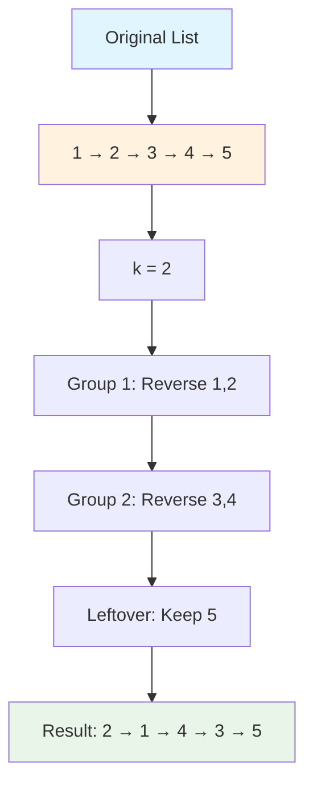

**Key Concepts:**
- **Group**: A consecutive sequence of `k` nodes
- **Complete Group**: Must have exactly `k` nodes to be reversed
- **Incomplete Group**: Less than `k` nodes, stays unchanged

### 🎲 Linked List Reversal Fundamentals

Before tackling group reversal, understand basic reversal:

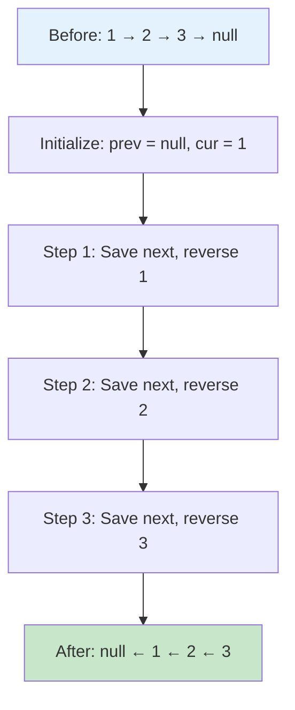

**Three-Pointer Technique:**
- `prev`: Points to previous node (becomes new next)
- `cur`: Current node being processed
- `next`: Temporary storage for next node

---

## 📚 Step-by-Step Examples

### 🟢 Example 1: Basic Group Reversal (k=2)

**Input:** `1 → 2 → 3 → 4 → 5`, `k = 2`  
**Output:** `2 → 1 → 4 → 3 → 5`

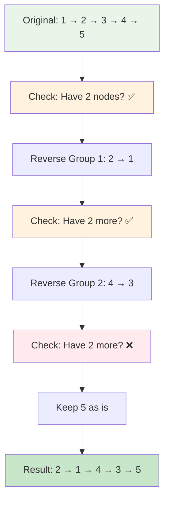

**Detailed Walkthrough:**

**Phase 1: Process First Group (1 → 2)**
```
Step 1: Count 2 nodes ✅
Step 2: Reverse using three pointers
  Before: 1 → 2 → 3 → 4 → 5
  After:  2 → 1 → ? (need to connect)
Step 3: Original head (1) becomes tail
```

**Phase 2: Recursively Process Remaining (3 → 4 → 5)**
```
Step 1: Count 2 nodes from 3 ✅
Step 2: Reverse 3 → 4
  After:  4 → 3 → ?
Step 3: Count from 5: only 1 node ❌
Step 4: Keep 5 unchanged
```

**Phase 3: Connect All Groups**
```
Group 1 tail (1) → Group 2 head (4)
Group 2 tail (3) → Remaining (5)
Final: 2 → 1 → 4 → 3 → 5
```

### 🔴 Example 2: Full Groups (k=3)

**Input:** `1 → 2 → 3 → 4 → 5 → 6`, `k = 3`  
**Output:** `3 → 2 → 1 → 6 → 5 → 4`

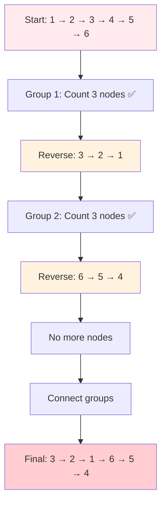

**Step-by-step:**
```
Original: 1 → 2 → 3 → 4 → 5 → 6

Group 1 (nodes 1,2,3):
  Count: 3 ✅
  Reverse: 3 → 2 → 1
  Node 1 (old head) now points to ???

Recursive call with (4 → 5 → 6):
  Group 2 (nodes 4,5,6):
    Count: 3 ✅
    Reverse: 6 → 5 → 4
    Node 4 (old head) now points to null

Connect: 1 points to 4
Result: 3 → 2 → 1 → 6 → 5 → 4
```

### 🟡 Example 3: Incomplete Last Group (k=3)

**Input:** `1 → 2 → 3 → 4 → 5`, `k = 3`  
**Output:** `3 → 2 → 1 → 4 → 5`

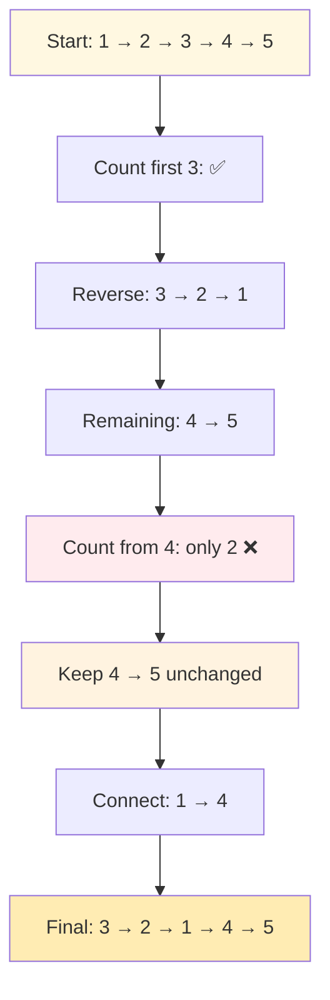

**Why Last Group Stays:**
```
After reversing first group: 3 → 2 → 1 → (4 → 5)
                                           ↑
                                    Only 2 nodes left
                                    Need 3 for reversal
                                    Keep as is ✅
```

### 🚨 Example 4: Edge Case - k Equals List Length

**Input:** `1 → 2 → 3`, `k = 3`  
**Output:** `3 → 2 → 1`

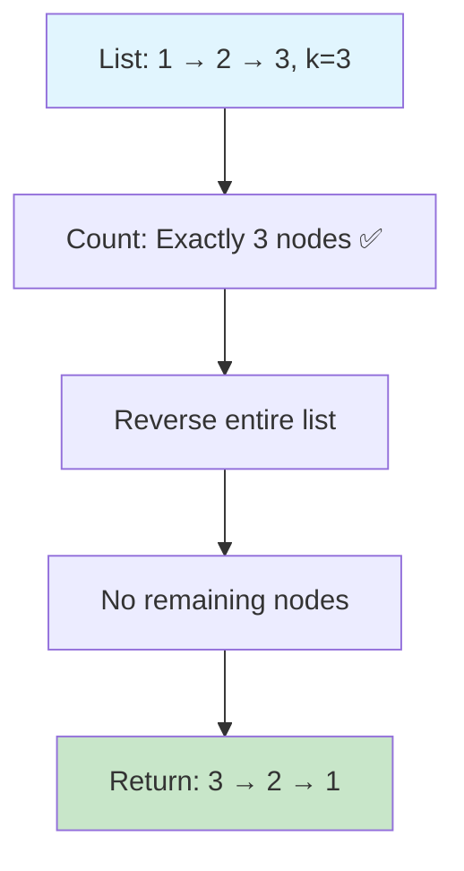

---

## 🛠️ The Algorithm

### 🎯 Main Strategy: Count, Reverse, Recurse

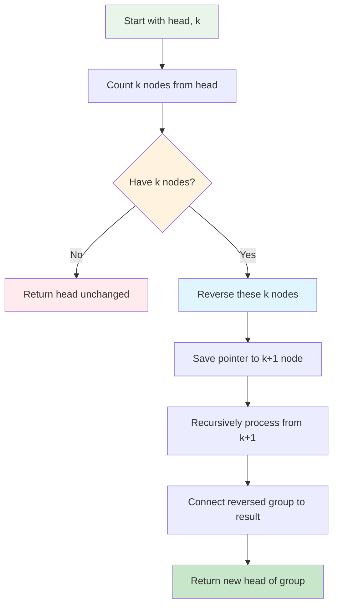

### 💻 The Core Algorithm

```cpp
ListNode* reverseKGroup(ListNode* head, int k) {
    // PHASE 1: Count if we have k nodes
    ListNode* temp = head;
    int count = 0;
    
    while (temp != nullptr && count < k) {
        temp = temp->next;
        count++;
    }
    
    // BASE CASE: Not enough nodes, return as is
    if (count < k) {
        return head;
    }
    
    // PHASE 2: Reverse current k nodes
    ListNode* prev = nullptr;
    ListNode* cur = head;
    ListNode* next = nullptr;
    int cnt = 0;
    
    while (cur != nullptr && cnt < k) {
        next = cur->next;    // Save next
        cur->next = prev;    // Reverse link
        prev = cur;          // Move prev
        cur = next;          // Move cur
        cnt++;
    }
    
    // PHASE 3: Recursively process rest & connect
    if (next != nullptr) {
        head->next = reverseKGroup(next, k);
    }
    
    // PHASE 4: Return new head
    return prev;
}
```

### 🔍 Algorithm Phases Explained

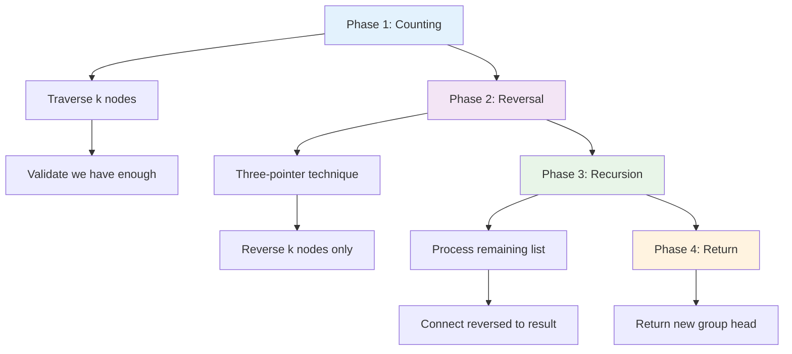

### 🛡️ Pointer Management - The Critical Part

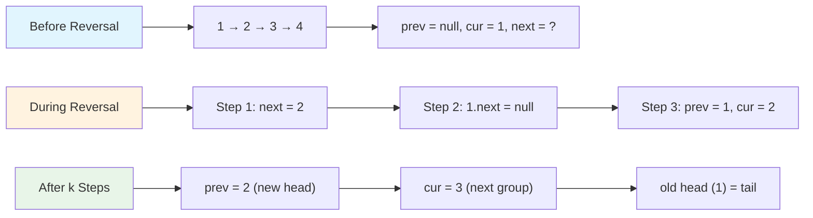

**Critical Insight:**
- **Before reversal**: `head` is the first node
- **After reversal**: `prev` is the new first node (new head)
- **After reversal**: old `head` is now the last node (tail)
- **Connection point**: Old head's `next` connects to result of recursive call

---

## 🧪 Test Cases & Edge Cases

### ✅ Normal Cases

| Input | k | Output | Reasoning |
|-------|---|--------|-----------|
| `1→2→3→4→5` | 2 | `2→1→4→3→5` | Two complete groups + 1 leftover |
| `1→2→3→4→5→6` | 3 | `3→2→1→6→5→4` | Two complete groups |
| `1→2→3→4→5→6→7→8` | 4 | `4→3→2→1→8→7→6→5` | Two complete groups |

### ⚠️ Edge Cases

| Input | k | Output | Reasoning |
|-------|---|--------|-----------|
| `1` | 1 | `1` | Single node, k=1 |
| `1→2` | 2 | `2→1` | Exactly one group |
| `1→2→3→4→5` | 5 | `5→4→3→2→1` | k equals list length |
| `1→2→3→4→5` | 1 | `1→2→3→4→5` | k=1 means no reversal |
| `1→2→3` | 4 | `1→2→3` | k larger than list (no reversal) |

### 🎯 Comprehensive Testing Strategy

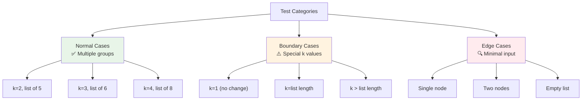

---

## 🎓 Key Concepts Mastery

### 🔗 Linked List Reversal Patterns

**Pattern 1: Basic Reversal (Foundation)**
```cpp
ListNode* reverse(ListNode* head) {
    ListNode* prev = nullptr;
    ListNode* cur = head;
    
    while (cur != nullptr) {
        ListNode* next = cur->next;  // Save next
        cur->next = prev;            // Reverse link
        prev = cur;                  // Move prev
        cur = next;                  // Move cur
    }
    
    return prev;  // New head
}
```

**Pattern 2: Reverse First k Nodes**
```cpp
ListNode* reverseK(ListNode* head, int k) {
    ListNode* prev = nullptr;
    ListNode* cur = head;
    int count = 0;
    
    while (cur != nullptr && count < k) {
        ListNode* next = cur->next;
        cur->next = prev;
        prev = cur;
        cur = next;
        count++;
    }
    
    return prev;  // New head of reversed portion
}
```

**Pattern 3: Reverse with Connection (Our Problem)**
```cpp
// Combines reversal + recursion + connection
ListNode* reverseKGroup(ListNode* head, int k) {
    // Count → Reverse → Recurse → Connect
    // Most complex but most powerful
}
```

### ⚡ Recursion Breakdown

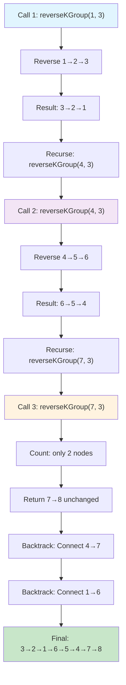

**Recursive Call Stack:**
```
reverseKGroup(1→2→3→4→5→6→7→8, k=3)
├─ Reverse: 1→2→3 becomes 3→2→1
├─ Recurse: reverseKGroup(4→5→6→7→8, k=3)
│  ├─ Reverse: 4→5→6 becomes 6→5→4
│  ├─ Recurse: reverseKGroup(7→8, k=3)
│  │  └─ Base case: count < k, return 7→8
│  └─ Connect 4.next = 7
└─ Connect 1.next = 6

Result: 3→2→1→6→5→4→7→8
```

### 🎯 Pointer Tracking Mastery

**The Four Critical Pointers:**

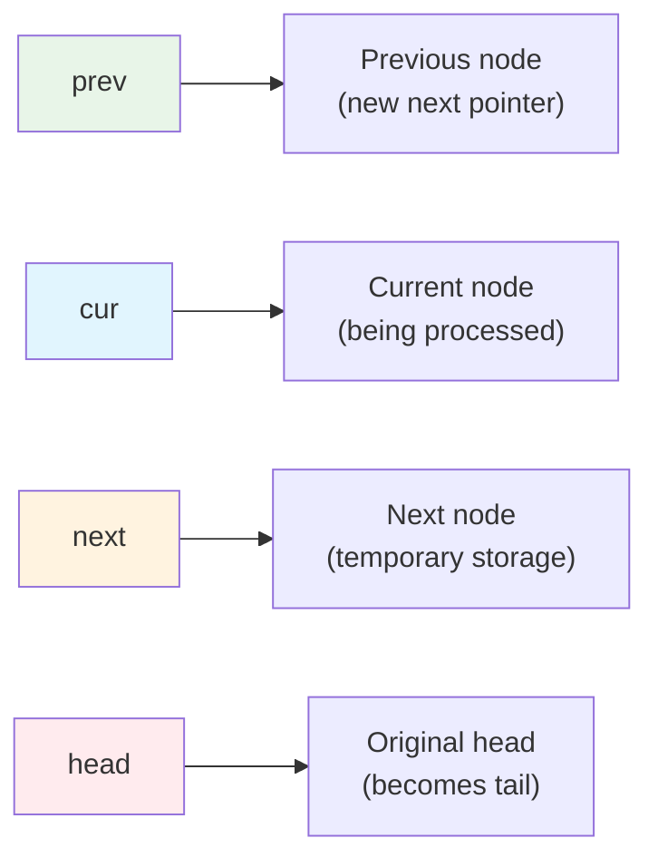

**Pointer State Transitions:**
```
Initial State:
  prev = null, cur = 1, next = null, head = 1

Iteration 1:
  next = cur->next  →  next = 2
  cur->next = prev  →  1->next = null
  prev = cur        →  prev = 1
  cur = next        →  cur = 2

Iteration 2:
  next = cur->next  →  next = 3
  cur->next = prev  →  2->next = 1
  prev = cur        →  prev = 2
  cur = next        →  cur = 3

Iteration k:
  prev = new head
  cur = first node of next group
  head (old) = tail of reversed group
```

---

## 📊 Complexity Analysis

### ⏰ Time Complexity: O(n)

**Why linear time?**
- We visit each node exactly once
- Counting phase: O(k) per group
- Reversal phase: O(k) per group
- Total groups: n/k
- Total: O(k × n/k) = O(n)

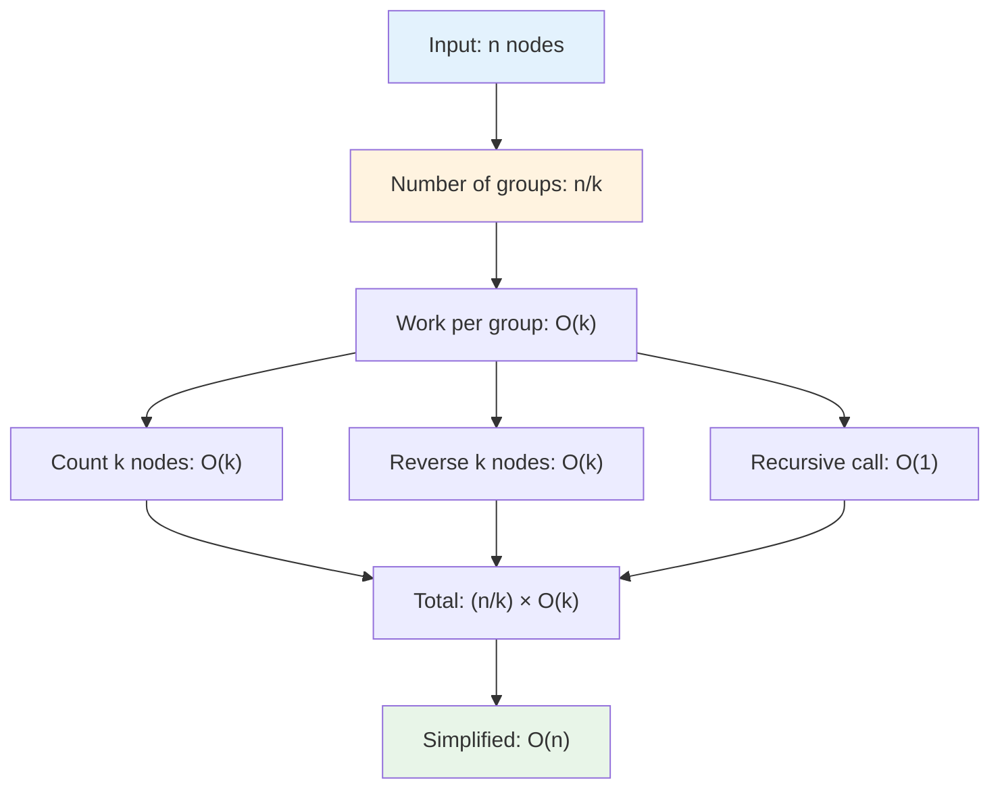

**Detailed Analysis:**
```
List of 8 nodes, k=2:
  Group 1: Count 2 + Reverse 2 = 4 operations
  Group 2: Count 2 + Reverse 2 = 4 operations
  Group 3: Count 2 + Reverse 2 = 4 operations
  Group 4: Count 2 + Reverse 2 = 4 operations
  Total: 16 operations ≈ 2n operations = O(n)

List of 9 nodes, k=3:
  Group 1: Count 3 + Reverse 3 = 6 operations
  Group 2: Count 3 + Reverse 3 = 6 operations
  Group 3: Count 3 + Reverse 3 = 6 operations
  Total: 18 operations ≈ 2n operations = O(n)
```

### 💾 Space Complexity: O(n/k)

**Why O(n/k) space?**
- We use recursion
- Each recursive call handles one group
- Number of groups = n/k
- Maximum recursive depth = n/k calls on stack

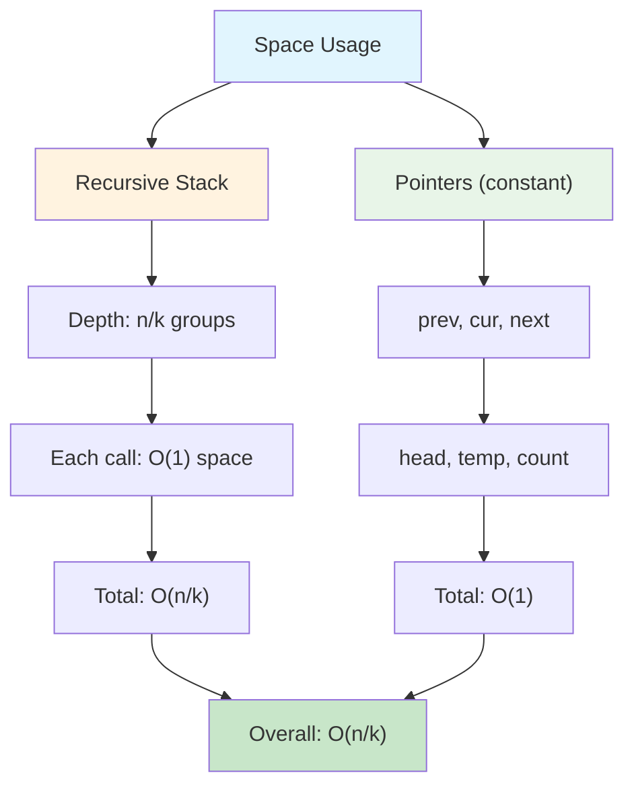

**Recursion Stack Example:**
```
List: 1→2→3→4→5→6→7→8→9, k=3

Call Stack:
┌────────────────────────────────┐
│ Call 3: reverseKGroup(7→8→9)  │ ← Top
├────────────────────────────────┤
│ Call 2: reverseKGroup(4→5→6)  │
├────────────────────────────────┤
│ Call 1: reverseKGroup(1→2→3)  │ ← Bottom
└────────────────────────────────┘

Stack depth = 3 = 9/3 = n/k
```

---

## 🚀 Practice Problems

Once you master this, try these similar problems:

| Problem | Difficulty | Key Concept |
|---------|------------|-------------|
| 🔄 Reverse Linked List | Easy | Basic reversal foundation |
| 🔗 Reverse Linked List II | Medium | Reverse between positions |
| ♻️ Swap Nodes in Pairs | Medium | Special case: k=2 |
| 🎯 Rotate List | Medium | Cyclic rotation |
| 🔀 Odd Even Linked List | Medium | Group rearrangement |

---

## 💼 Interview Questions & Answers

### ❓ Question 1: Why do we need to count nodes first?

**Answer:**  
We count to ensure we have exactly k nodes before reversing. If we don't check and have fewer than k nodes remaining, we'd violate the problem constraint: "left-out nodes should remain as is."

**Simple Explanation:**  
Imagine you're told to flip groups of 3 cards. You must check you have 3 cards before flipping. If only 2 cards remain, you leave them alone.

**Code Example:**
```cpp
// Without counting (WRONG):
// Might partially reverse last group

// With counting (CORRECT):
ListNode* temp = head;
int count = 0;
while (temp != nullptr && count < k) {
    temp = temp->next;
    count++;
}
if (count < k) return head;  // Not enough nodes!
```

---

### ❓ Question 2: How does the recursive approach work?

**Answer:**  
The recursive approach follows this pattern:
1. **Reverse current group** of k nodes
2. **Recursively process** the remaining list
3. **Connect** the tail of current group to the result from recursion
4. **Return** the new head of current group

**Simple Explanation:**  
Think of it like peeling an onion:
- **Layer 1**: Handle first k nodes, pass the rest deeper
- **Layer 2**: Handle next k nodes, pass the rest deeper
- **Core**: Eventually reach base case (< k nodes)
- **Rebuild**: As we come back, connect each layer

**Visual Recursion:**
```
reverseKGroup([1,2,3,4,5,6], 2)
  ├─ Reverse [1,2] → [2,1]
  └─ Call reverseKGroup([3,4,5,6], 2)
       ├─ Reverse [3,4] → [4,3]
       └─ Call reverseKGroup([5,6], 2)
            ├─ Reverse [5,6] → [6,5]
            └─ Call reverseKGroup([], 2)
                 └─ Return null
            Connect 5→null
       Connect 3→6
  Connect 1→4
  
Final: 2→1→4→3→6→5
```

---

### ❓ Question 3: What happens to the original head after reversal?

**Answer:**  
After reversing a group, the original head becomes the tail of that reversed group. This is perfect because:
- The tail is where we need to attach the next group
- We can simply do `head->next = reverseKGroup(nextGroup, k)`

**Simple Explanation:**  
```
Before reversal: 1 → 2 → 3 → 4
                 ↑           ↑
               head        rest

After reversal:  3 → 2 → 1   4
                      ↑ ↑     ↑
                  prev head  rest
                 (new head) (tail)

Connection: head->next = 4
Result: 3 → 2 → 1 → 4
```

**Why this is brilliant:**
- No need to track the tail separately
- Original head is conveniently positioned for connection
- Nature of reversal automatically places it correctly

---

### ❓ Question 4: Can you solve this iteratively without recursion?

**Answer:**  
Yes! Iterative solution requires tracking more pointers:

```cpp
ListNode* reverseKGroup(ListNode* head, int k) {
    ListNode dummy(0);
    dummy.next = head;
    ListNode* prevGroupTail = &dummy;
    
    while (true) {
        // Count k nodes
        ListNode* kthNode = prevGroupTail;
        for (int i = 0; i < k && kthNode != nullptr; i++) {
            kthNode = kthNode->next;
        }
        if (kthNode == nullptr) break;
        
        // Reverse group
        ListNode* groupStart = prevGroupTail->next;
        ListNode* nextGroupStart = kthNode->next;
        
        ListNode* prev = nextGroupStart;
        ListNode* cur = groupStart;
        while (cur != nextGroupStart) {
            ListNode* next = cur->next;
            cur->next = prev;
            prev = cur;
            cur = next;
        }
        
        // Connect
        prevGroupTail->next = kthNode;
        prevGroupTail = groupStart;
    }
    
    return dummy.next;
}
```

**Pros of iterative:** O(1) space (no recursion stack)  
**Cons of iterative:** More complex pointer management, harder to understand

**Pros of recursive:** Cleaner code, easier to understand  
**Cons of recursive:** O(n/k) space for call stack

---

### ❓ Question 5: How do you handle the edge case where k=1?

**Answer:**  
When k=1, each "group" has 1 node:
- Counting always succeeds (every node is a complete group)
- Reversal doesn't change anything (single node reversed is itself)
- Result: Original list returned unchanged

**Code behavior:**
```cpp
reverseKGroup([1,2,3,4,5], 1)
  // Each call reverses 1 node (no change)
  // Returns same list
  Result: [1,2,3,4,5]
```

**Simple Explanation:**  
It's like being asked to "flip" groups of 1 card. Flipping 1 card doesn't change anything, so the deck stays the same!

---

### ❓ Question 6: What if k is larger than the list length?

**Answer:**  
The counting phase will count all nodes and find `count < k`, triggering the base case immediately.

**Code execution:**
```cpp
reverseKGroup([1,2,3], 5)
  Step 1: Count nodes → found 3 nodes
  Step 2: Check count < k → 3 < 5 is TRUE
  Step 3: Return head unchanged
  Result: [1,2,3]
```

**Simple Explanation:**  
If you're asked to flip groups of 5 cards but only have 3 cards, you can't form even one complete group, so you leave all cards as they are.

---

### ❓ Question 7: How does the three-pointer technique work?

**Answer:**  
The three-pointer technique is the standard way to reverse a linked list:

**The Pointers:**
- `prev`: Where the current node should point to (builds reversed list)
- `cur`: Node currently being processed
- `next`: Temporary storage to not lose the rest of the list

**Step-by-step for 1→2→3:**
```
Initial: prev=null, cur=1, next=null
  List: 1 → 2 → 3

Step 1:
  next = cur->next     → next = 2
  cur->next = prev     → 1->next = null
  prev = cur           → prev = 1
  cur = next           → cur = 2
  List: null ← 1   2 → 3

Step 2:
  next = cur->next     → next = 3
  cur->next = prev     → 2->next = 1
  prev = cur           → prev = 2
  cur = next           → cur = 3
  List: null ← 1 ← 2   3

Step 3:
  next = cur->next     → next = null
  cur->next = prev     → 3->next = 2
  prev = cur           → prev = 3
  cur = next           → cur = null
  List: null ← 1 ← 2 ← 3

Final: prev = 3 (new head)
```

**Why we need all three:**
- `prev`: Can't reverse without knowing where to point back
- `cur`: Need to know which node we're working on
- `next`: Without this, we lose the rest of the list when we break `cur->next`

---

### ❓ Question 8: What's the time complexity and why?

**Answer:**  
**Time: O(n)** where n is the number of nodes

**Reasoning:**
- Each node is visited exactly twice:
  - Once during counting phase
  - Once during reversal phase
- We have n/k groups
- Each group: Count k nodes + Reverse k nodes = 2k operations
- Total: (n/k) × 2k = 2n operations
- Simplified: O(n)

**Space: O(n/k)** for recursion stack

**Simple Explanation:**
```
8 nodes, k=2:
  - 4 groups
  - Each group: count 2 + reverse 2 = 4 operations
  - Total: 4 × 4 = 16 operations
  - 16 operations for 8 nodes = 2n = O(n)

8 nodes, k=4:
  - 2 groups
  - Each group: count 4 + reverse 4 = 8 operations
  - Total: 2 × 8 = 16 operations
  - 16 operations for 8 nodes = 2n = O(n)
```

---

### ❓ Question 9: How do you test this function thoroughly?

**Answer:**  
Comprehensive testing should cover:

**1. Normal cases:**
- Multiple complete groups
- Various k values (2, 3, 4)
- Lists of different lengths

**2. Boundary cases:**
- k = 1 (no change)
- k = list length (full reversal)
- k > list length (no change)

**3. Edge cases:**
- Single node list
- Two node list
- Empty list (if allowed)

**4. Incomplete groups:**
- List length not divisible by k
- Last group has fewer than k nodes

**Test Suite Example:**
```cpp
// Normal: Multiple groups
test([1,2,3,4,5], k=2) → [2,1,4,3,5]

// Boundary: k=1
test([1,2,3,4], k=1) → [1,2,3,4]

// Boundary: k=length
test([1,2,3], k=3) → [3,2,1]

// Edge: Single node
test([1], k=1) → [1]

// Incomplete: Leftover nodes
test([1,2,3,4,5], k=3) → [3,2,1,4,5]
```

---

### ❓ Question 10: Can you modify this to reverse every k nodes from the end?

**Answer:**  
To reverse from the end, we'd need to:
1. Find list length first
2. Calculate where to start reversing
3. Handle the front portion differently

**Modified Approach:**
```cpp
ListNode* reverseKGroupFromEnd(ListNode* head, int k) {
    // Step 1: Count total nodes
    int length = 0;
    ListNode* temp = head;
    while (temp) {
        length++;
        temp = temp->next;
    }
    
    // Step 2: Skip first (length % k) nodes
    int skip = length % k;
    
    // Step 3: Reverse remaining groups normally
    ListNode dummy(0);
    dummy.next = head;
    ListNode* prev = &dummy;
    
    // Skip first 'skip' nodes
    for (int i = 0; i < skip; i++) {
        prev = prev->next;
    }
    
    // Now reverse groups of k
    ListNode* cur = prev->next;
    // ... rest of reversal logic
    
    return dummy.next;
}
```

**Example:**
```
Input: [1,2,3,4,5,6,7,8], k=3
Length: 8, skip: 8%3 = 2

Keep first 2: 1→2
Reverse rest in groups of 3:
  Group 1: 3→4→5 becomes 5→4→3
  Group 2: 6→7→8 becomes 8→7→6

Result: 1→2→5→4→3→8→7→6
```

---

### 🎯 Common Interview Follow-ups

**Q: "Can you optimize space to O(1)?"**  
A: Yes, use the iterative approach instead of recursion. Trade-off: More complex code.

**Q: "What if you can't modify the original list?"**  
A: Would need to create new nodes (deep copy), making space O(n).

**Q: "How would you handle a doubly linked list?"**  
A: Similar approach but also update `prev` pointers during reversal.

**Q: "Can you reverse in groups of k from right to left?"**  
A: Yes, but need to first calculate list length to know where groups start.

---

## 🎯 Quick Reference

### 🔑 Essential Code Patterns

```cpp
// Pattern 1: Count k nodes
ListNode* temp = head;
int count = 0;
while (temp != nullptr && count < k) {
    temp = temp->next;
    count++;
}
if (count < k) return head;  // Base case

// Pattern 2: Reverse k nodes
ListNode* prev = nullptr;
ListNode* cur = head;
int cnt = 0;
while (cur != nullptr && cnt < k) {
    ListNode* next = cur->next;
    cur->next = prev;
    prev = cur;
    cur = next;
    cnt++;
}

// Pattern 3: Connect and recurse
if (next != nullptr) {
    head->next = reverseKGroup(next, k);
}
return prev;
```

### 📝 Important State Transitions

```
Reversal Process:
  Before: prev → cur → next → ...
  Action: cur->next = prev
  After:  prev ← cur   next → ...
  
  Move:   prev = cur, cur = next

Connection After Reversal:
  Reversed Group: newHead → ... → oldHead
  Next Group:     nextStart → ...
  Connect:        oldHead->next = nextStart
```

### 🧠 Mental Model

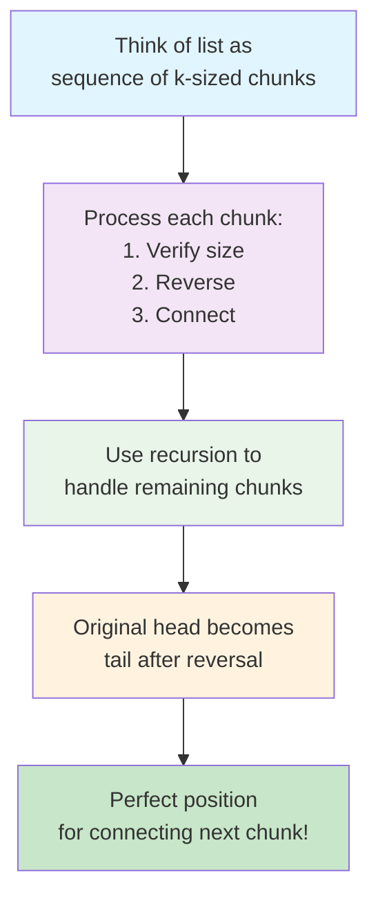

---

## 🏆 Mastery Checklist

- [ ] ✅ Understand three-pointer reversal technique
- [ ] ✅ Know why we count nodes before reversing
- [ ] ✅ Master recursive problem decomposition
- [ ] ✅ Handle incomplete last group correctly
- [ ] ✅ Understand pointer state after reversal
- [ ] ✅ Connect reversed groups properly
- [ ] ✅ Solve in O(n) time
- [ ] ✅ Handle all edge cases (k=1, k>length, single node)
- [ ] ✅ Explain iterative vs recursive trade-offs
- [ ] ✅ Answer interview questions confidently

---

## 💡 Pro Tips

1. **🎯 Master Basic Reversal First**: Ensure you can reverse a full linked list before tackling group reversal
2. **🔍 Draw It Out**: For complex pointer problems, drawing the state at each step is invaluable
3. **🧪 Test Edge Cases**: Always test k=1, k=length, k>length, and single node
4. **📚 Understand Recursion**: This problem becomes much clearer when you grasp the recursive decomposition
5. **🛡️ Count Before Acting**: The counting phase prevents many bugs - don't skip it!
6. **💭 Think in Phases**: Count → Reverse → Recurse → Connect. Follow this mental model.
7. **🎨 Visualize Pointer Movement**: Mentally trace `prev`, `cur`, `next` through each iteration
8. **💼 Practice Explaining**: Being able to explain your logic clearly is crucial in interviews

---

**🎉 Congratulations! You now have a complete understanding of advanced linked list manipulation with group reversal, recursive problem decomposition, and can confidently handle this challenging problem in technical interviews. Keep practicing and happy coding!**