# Day 63: 🔄 Linked List Cycle Detection - Complete Beginner's Guide

> **Master Floyd's Cycle Detection Algorithm and the Two-Pointer Technique!**

---

## 📖 What You'll Learn

By the end of this guide, you'll master:
- 🔗 **Linked List Traversal** - Understanding pointer-based data structures
- 🐢🐰 **Floyd's Algorithm** - The famous Tortoise and Hare technique
- 🎯 **Two-Pointer Pattern** - A fundamental problem-solving approach
- 🔍 **Cycle Detection** - Identifying loops in data structures

---

## 🎯 The Problem

### 📋 Problem Statement

**Given**: The `head` of a singly linked list  
**Task**: Determine if the linked list contains a cycle  
**Cycle Definition**: A node can be reached again by continuously following the `next` pointer

**Important**: We need to do this efficiently without modifying the list or using extra space!

### 🌟 Real-World Example

Think of a linked list like a treasure hunt where each clue points to the next location:
- **No Cycle**: Clue 1 → Clue 2 → Clue 3 → Treasure (END)
- **With Cycle**: Clue 1 → Clue 2 → Clue 3 → back to Clue 2 (LOOP!)

Imagine two people searching:
- **Slow walker** takes one step per clue
- **Fast runner** takes two steps per clue
- If there's a loop, the fast runner will eventually lap the slow walker and they'll meet!

---

## 🔍 Understanding the Basics

### 🏗️ What is a Linked List?

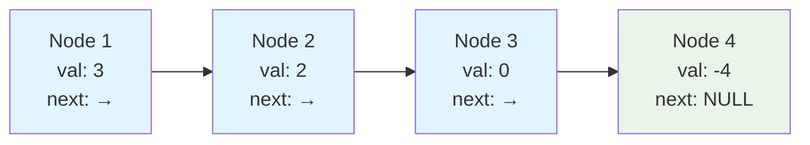

**Key Components:**
- Each **node** contains data (`val`) and a pointer to the next node (`next`)
- The **head** is the first node
- The **tail** is the last node (points to NULL if no cycle)

### 🔄 What is a Cycle?

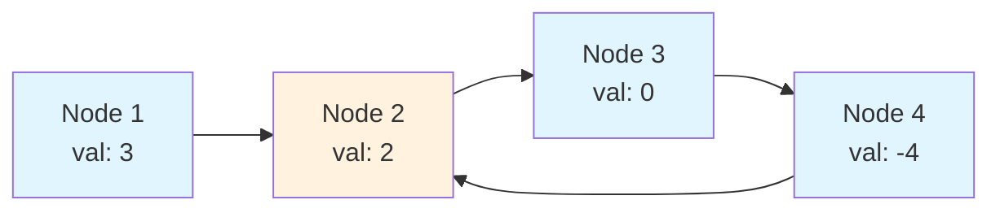

**Cycle Characteristics:**
- A node's `next` pointer points back to a previous node
- Traversing will loop forever
- The tail never reaches NULL

---

## 📚 Step-by-Step Examples

### 🟢 Example 1: List with Cycle

**Input:** `head = [3,2,0,-4]`, cycle at position 1  
**Output:** `true`

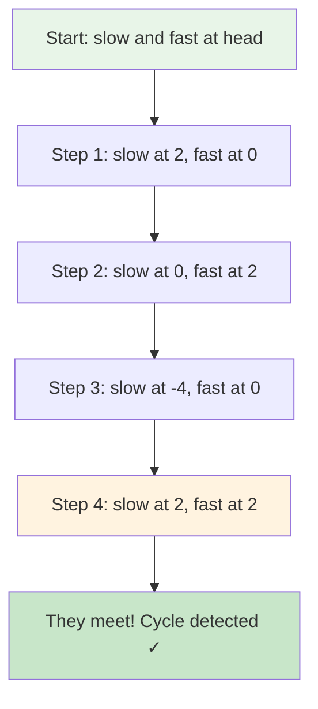

**Detailed Walkthrough:**

```
List: 3 → 2 → 0 → -4 ↺ (back to 2)

Initial:  slow = 3,  fast = 3

Step 1:   slow = 2   (moved 1 step)
          fast = 0   (moved 2 steps: 3→2→0)

Step 2:   slow = 0   (moved 1 step: 2→0)
          fast = 2   (moved 2 steps: 0→-4→2)

Step 3:   slow = -4  (moved 1 step: 0→-4)
          fast = 0   (moved 2 steps: 2→0→-4→2→0)

Step 4:   slow = 2   (moved 1 step: -4→2)
          fast = 2   (moved 2 steps: 0→-4→2)

Result: slow == fast, CYCLE EXISTS!
```

### 🔴 Example 2: List Without Cycle

**Input:** `head = [1,2,3,4,5]`, no cycle  
**Output:** `false`

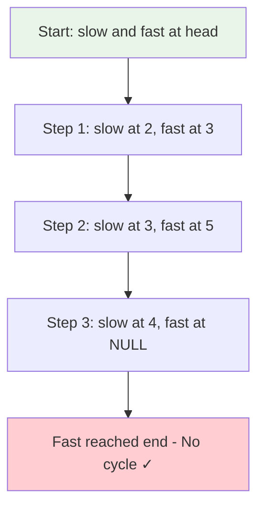

**Detailed Walkthrough:**

```
List: 1 → 2 → 3 → 4 → 5 → NULL

Initial:  slow = 1,  fast = 1

Step 1:   slow = 2   (moved 1 step)
          fast = 3   (moved 2 steps: 1→2→3)

Step 2:   slow = 3   (moved 1 step: 2→3)
          fast = 5   (moved 2 steps: 3→4→5)

Step 3:   slow = 4   (moved 1 step: 3→4)
          fast = NULL (tried to move: 5→NULL)

Result: fast reached NULL, NO CYCLE!
```

### 🟡 Example 3: Single Node with Self-Loop

**Input:** `head = [1]`, node points to itself  
**Output:** `true`

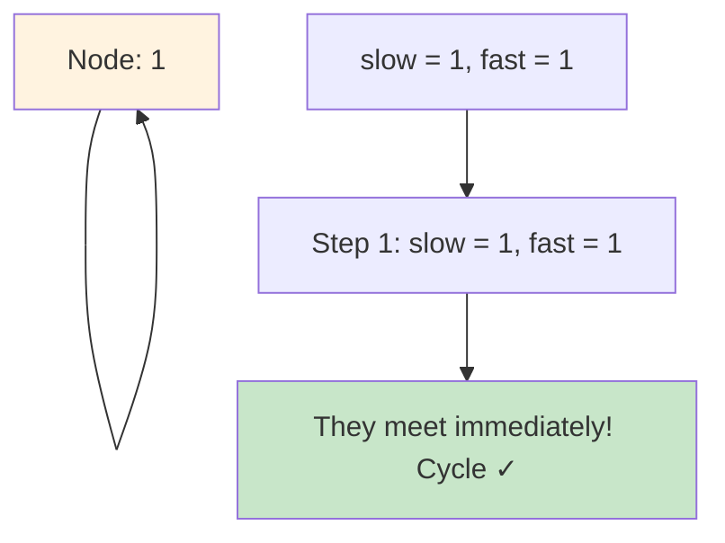

### 🚨 Example 4: Edge Case - Empty or Single Node

**Input:** `head = NULL` or `head = [1]` (no self-loop)  
**Output:** `false`

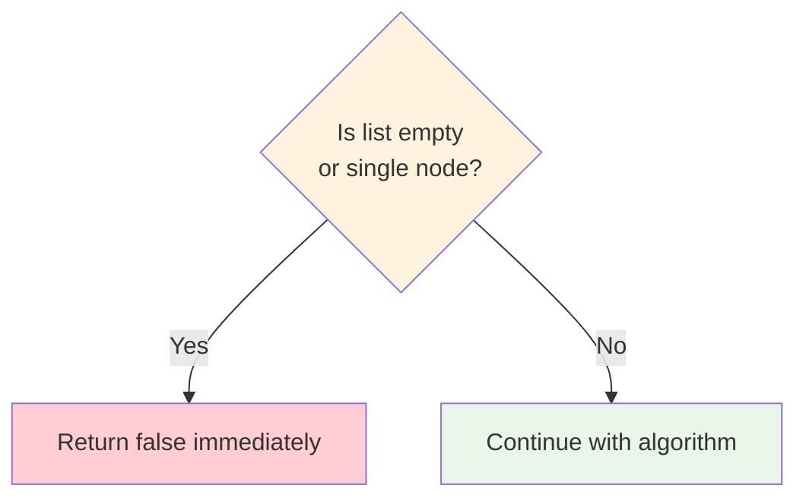

**Edge Case Handling:**
```cpp
if (!head || !head->next)
    return false;  // Can't have cycle with 0 or 1 node
```

---

## 🛠️ The Algorithm

### 🎯 Floyd's Cycle Detection - The Tortoise and Hare

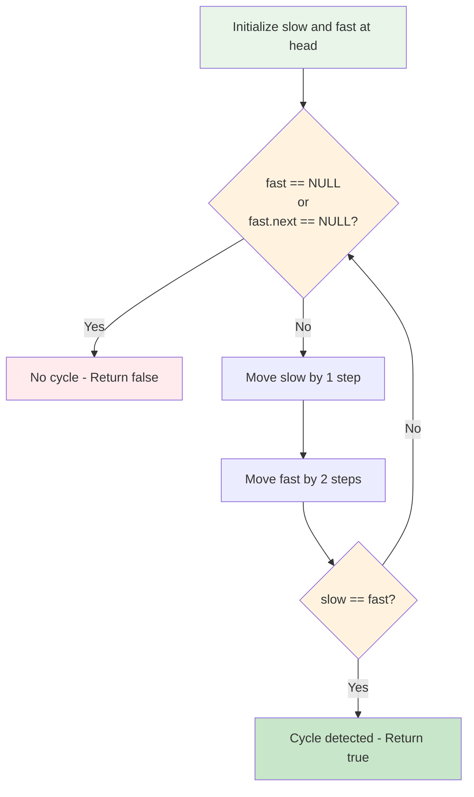

### 💻 The Code

```cpp
bool hasCycle(ListNode* head) {
    // 🛡️ EDGE CASE: Empty or single node
    if (!head || !head->next)
        return false;
    
    // 🐢 Tortoise: moves 1 step at a time
    ListNode* slow = head;
    
    // 🐰 Hare: moves 2 steps at a time
    ListNode* fast = head;
    
    // 🔄 Keep moving until fast reaches end
    while (fast != nullptr && fast->next != nullptr) {
        slow = slow->next;        // Move slow by 1
        fast = fast->next->next;  // Move fast by 2
        
        // 🎯 CHECK: Did they meet?
        if (slow == fast)
            return true;  // Cycle exists!
    }
    
    // ✅ Fast reached NULL - no cycle
    return false;
}
```

### 🔬 Why This Works

**The Mathematical Proof:**

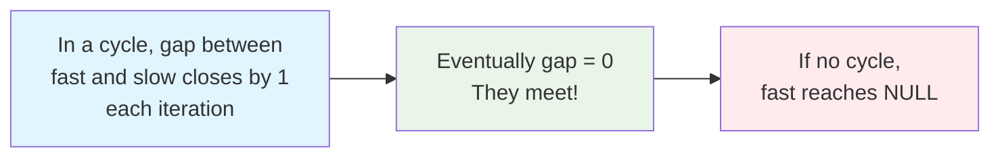

**Think of it like a race track:**
1. **With a cycle (circular track):**
   - Fast runner is ahead by some distance
   - Each lap, fast runner closes the gap by 1 position
   - Eventually, fast runner catches slow runner

2. **Without a cycle (straight track):**
   - Fast runner reaches the finish line (NULL)
   - They never meet

**Key Insight:**
```
If there's a cycle:
- Distance between pointers = d
- Each iteration, fast closes gap by 1
- After d iterations, they meet

If there's no cycle:
- Fast reaches end in n/2 steps
- n = number of nodes
```

---

## 🧪 Test Cases & Edge Cases

### ✅ Normal Cases

| Input | Cycle Position | Output | Why |
|-------|----------------|--------|-----|
| `[3,2,0,-4]` | 1 | `true` | Tail connects to node 1 |
| `[1,2]` | 0 | `true` | Tail connects to head |
| `[1,2,3,4,5]` | -1 | `false` | No cycle, ends at NULL |

### ⚠️ Edge Cases

| Input | Output | Why |
|-------|--------|-----|
| `[]` (empty) | `false` | No nodes to form cycle |
| `[1]` (single) | `false` | Single node, no self-loop |
| `[1]` (self-loop) | `true` | Node points to itself |
| `[1,2]` (no cycle) | `false` | Two nodes, no connection |

### 🎯 Comprehensive Test Coverage

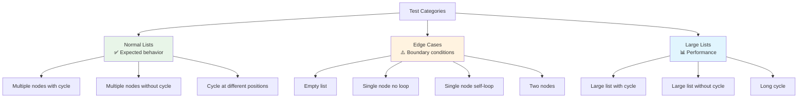

---

## 🎓 Key Concepts Mastery

### 🔗 Linked List Traversal

**Understanding Pointer Movement:**
```cpp
// Single step movement
node = node->next;      // Move to next node

// Two-step movement
node = node->next->next; // Skip one node

// Safe two-step (check for NULL)
if (node && node->next)
    node = node->next->next;
```

**Visual Representation:**


### 🐢🐰 Two-Pointer Technique

**The Pattern:**
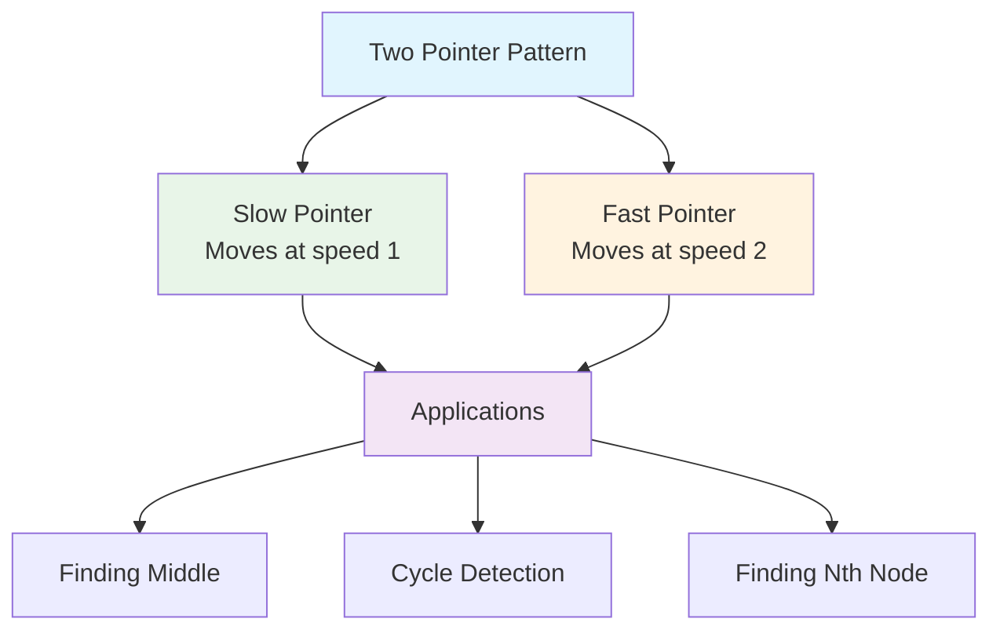

**Why Two Pointers?**
1. **Space Efficient:** No extra data structures needed
2. **Time Efficient:** Single pass through data
3. **Versatile:** Works for many list problems
4. **Elegant:** Simple and clean solution

### 🎯 Cycle Detection Strategy

```cpp
// Pattern for cycle detection
while (fast && fast->next) {
    slow = slow->next;
    fast = fast->next->next;
    
    if (slow == fast)
        return true;  // Cycle found
}
return false;  // No cycle
```

---

## 📊 Complexity Analysis

### ⏰ Time Complexity: O(n)

**Why linear time?**
- In worst case, we visit each node at most twice
- **Case 1 (No Cycle):** Fast pointer visits all n nodes once → O(n)
- **Case 2 (With Cycle):** 
  - Fast pointer enters cycle first
  - Slow pointer takes at most n steps to enter cycle
  - Once in cycle, they meet within one loop (at most n steps)
  - Total: O(n) + O(n) = O(n)

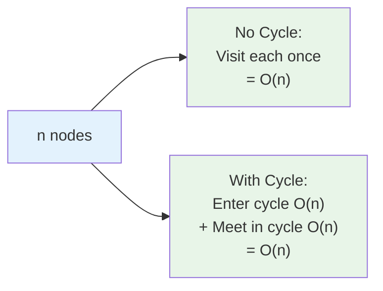

**Detailed Analysis:**
```
List size: n nodes
Cycle size: c nodes (where c ≤ n)

Without cycle:
- Fast pointer: n/2 iterations to reach NULL
- Time: O(n)

With cycle:
- Steps to enter cycle: k (where k ≤ n)
- Steps to meet in cycle: at most c
- Total: O(k + c) = O(n)
```

### 💾 Space Complexity: O(1)

**Why constant space?**
- Only two pointer variables: `slow` and `fast`
- No arrays, hash sets, or recursive calls
- Memory usage independent of input size

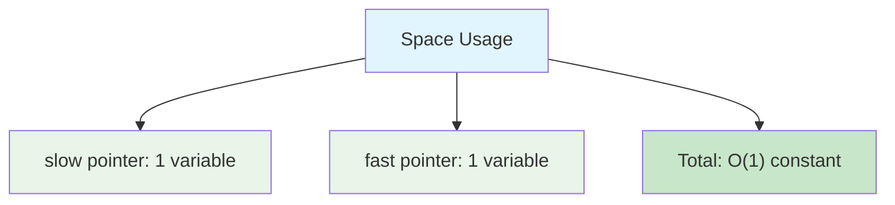

**Comparison with Alternative Approaches:**

| Approach | Time | Space | Notes |
|----------|------|-------|-------|
| **Floyd's Algorithm** | O(n) | O(1) | ✅ Optimal! |
| Hash Set | O(n) | O(n) | Store visited nodes |
| Modify List | O(n) | O(1) | Changes original list |
| Mark Nodes | O(n) | O(1) | Requires extra field |

---

## 🚀 Practice Problems

Once you master this, try these similar problems:

| Problem | Difficulty | Key Concept |
|---------|------------|-------------|
| 🔍 Linked List Cycle II | Medium | Find cycle start |
| 🎯 Happy Number | Easy | Cycle detection in sequence |
| 🔗 Middle of Linked List | Easy | Two pointers |
| 🔄 Remove Linked List Elements | Easy | List traversal |
| 🌟 Intersection of Two Lists | Easy | Two pointers |

---

## 💼 Interview Questions & Answers

### ❓ Question 1: Why do we use two pointers instead of a hash set?

**Answer:**  
Floyd's algorithm uses O(1) space compared to O(n) space for a hash set. In interviews, space-optimized solutions are preferred when possible.

**Simple Explanation:**  
```
Hash Set Approach:
- Store each visited node in a set
- Check if current node already in set
- Space: O(n) - stores all nodes

Floyd's Algorithm:
- Use only 2 pointers
- Space: O(1) - just 2 variables
```

**Trade-offs:**
```cpp
// Hash set approach (O(n) space)
unordered_set<ListNode*> visited;
while (node) {
    if (visited.count(node))
        return true;  // Found cycle
    visited.insert(node);
    node = node->next;
}
return false;

// Floyd's approach (O(1) space) ✅ Better!
while (fast && fast->next) {
    slow = slow->next;
    fast = fast->next->next;
    if (slow == fast)
        return true;
}
return false;
```

---

### ❓ Question 2: How do you prove that fast will always catch slow in a cycle?

**Answer:**  
In each iteration, the gap between fast and slow decreases by 1. Since they're in a finite cycle, the gap will eventually become 0.

**Simple Explanation:**  
```
Think of a circular race track:
- Fast runner is ahead by distance 'd'
- Each lap, fast gains 1 position on slow
- After 'd' laps, gap = 0, they meet!

Mathematical proof:
- Gap initially: d (where d < cycle_length)
- After 1 iteration: d - 1
- After 2 iterations: d - 2
- ...
- After d iterations: 0 (they meet!)
```

**Visual Proof:**
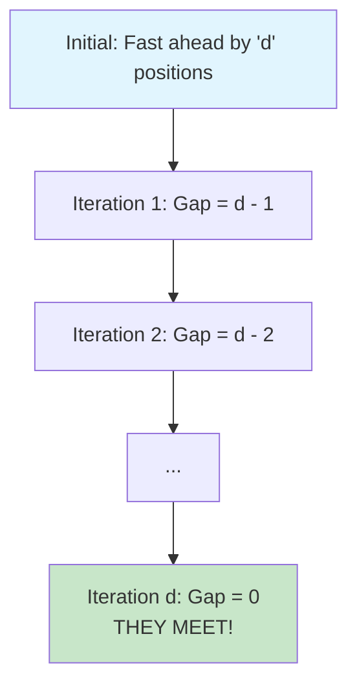

---

### ❓ Question 3: What if the fast pointer moves 3 steps instead of 2?

**Answer:**  
It would still work, but might take longer to detect the cycle. The fast pointer could potentially "jump over" the slow pointer in some cycles.

**Simple Explanation:**  
```
2 steps (standard):
- Guaranteed to meet
- Optimal detection time

3 steps:
- Might skip over slow pointer in small cycles
- Example: Cycle of size 3
  Position: 0 → 1 → 2 → 0
  Slow at 0, Fast at 0
  Next: Slow at 1, Fast at 0 (jumped over!)
  
Best practice: Use 2 steps (Floyd's original algorithm)
```

---

### ❓ Question 4: How do you handle the edge case of an empty list?

**Answer:**  
Check if `head` is NULL before starting the algorithm. An empty list cannot have a cycle.

**Simple Explanation:**  
```cpp
// Edge case handling
if (!head || !head->next)
    return false;

Why this works:
- !head: List is empty → no cycle possible
- !head->next: Only 1 node with no self-loop → no cycle
```

**Decision Tree:**
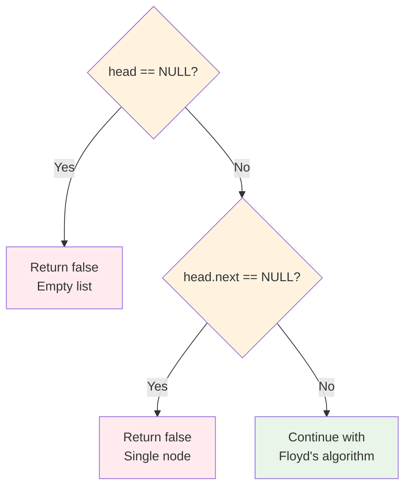

---

### ❓ Question 5: What's the worst-case scenario for this algorithm?

**Answer:**  
**Time:** O(n) - When the cycle starts at the very end of the list  
**Space:** O(1) - Always constant regardless of input

**Simple Explanation:**  
```
Worst case example:
1 → 2 → 3 → 4 → 5 → 6 → 7 → 8 → 9 → 10
                                     ↓
                                    [cycle back to 10]

Steps:
- Slow must traverse entire list to enter cycle: n steps
- Then meet in cycle: at most n more steps
- Total: 2n = O(n)
```

---

### ❓ Question 6: Can you find where the cycle starts, not just detect it?

**Answer:**  
Yes! This is LeetCode 142 (Linked List Cycle II). After detecting a cycle, reset one pointer to head and move both at same speed - they'll meet at the cycle start.

**Simple Explanation:**  
```cpp
// Phase 1: Detect cycle (our current problem)
while (fast && fast->next) {
    slow = slow->next;
    fast = fast->next->next;
    if (slow == fast)
        break;  // Cycle detected
}

// Phase 2: Find cycle start (extension)
if (!fast || !fast->next)
    return nullptr;  // No cycle

slow = head;  // Reset slow to head
while (slow != fast) {
    slow = slow->next;
    fast = fast->next;  // Both move at same speed
}
return slow;  // This is the cycle start!
```

**Mathematical Magic:**
```
Let:
- k = distance from head to cycle start
- m = distance from cycle start to meeting point

After they meet:
- Slow traveled: k + m
- Fast traveled: k + m + c (where c = full cycles)
- Fast is 2× slow: k + m + c = 2(k + m)
- Simplify: c = k + m
- Therefore: k = c - m

So if we move from head by k steps and from meeting by k steps,
both reach cycle start!
```

---

### ❓ Question 7: Why do we check `fast->next` in the while condition?

**Answer:**  
Because we move fast by 2 steps (`fast->next->next`), we need to ensure `fast->next` exists to avoid NULL pointer dereferencing.

**Simple Explanation:**  
```cpp
// We need to check both:
while (fast != nullptr && fast->next != nullptr)

Why?
1. fast != nullptr: Ensures fast is valid
2. fast->next != nullptr: Ensures fast->next->next is valid

Without second check:
fast = fast->next->next;  // CRASH if fast->next is NULL!
```

**Scenario Breakdown:**
```
List: 1 → 2 → NULL

Step 1:
- fast at 1, fast->next at 2 ✅
- fast = fast->next->next = NULL ✅

Step 2:
- fast is NULL ✅ (first condition fails, loop exits)

If we only checked fast != nullptr:
- fast at 2, fast->next is NULL ❌
- fast->next->next would crash! 💥
```

---

### ❓ Question 8: How does this algorithm handle self-loop (node pointing to itself)?

**Answer:**  
It detects it immediately. On the first iteration, both pointers move, and slow equals fast right away.

**Simple Explanation:**  
```
List: [1] (node 1 points to itself)

Initial: slow = 1, fast = 1

Iteration 1:
- slow = slow->next = 1 (points to itself)
- fast = fast->next->next = 1 (takes 2 steps, ends at 1)
- slow == fast? YES! Return true immediately

Time: O(1) - just one iteration
```

---

### ❓ Question 9: What if we modify the list to mark visited nodes?

**Answer:**  
We could change node values or pointers, but this violates the constraint of not modifying the input. Floyd's algorithm is better because it's non-destructive.

**Simple Explanation:**  
```cpp
// Destructive approach (NOT recommended)
bool hasCycle(ListNode* head) {
    while (head) {
        if (head->val == INT_MIN)
            return true;  // Already visited
        head->val = INT_MIN;  // Mark as visited
        head = head->next;
    }
    return false;
}

Problems:
❌ Modifies original data
❌ Assumes INT_MIN isn't a valid value
❌ Doesn't work if values can't be changed
✅ Floyd's algorithm: Non-destructive, elegant!
```

---

### ❓ Question 10: Can you explain the time complexity proof more rigorously?

**Answer:**  
Let's prove O(n) for both cases:

**Case 1: No Cycle**
- Fast pointer reaches NULL in n/2 iterations
- Each iteration processes 2 nodes (fast) and 1 node (slow)
- Time: O(n)

**Case 2: With Cycle**
- Let k = nodes before cycle, c = cycle length
- Fast enters cycle first (in k/2 iterations)
- When slow enters cycle, fast is somewhere in the cycle
- Maximum distance between them in cycle: c - 1
- They close gap by 1 each iteration
- Meet in at most c iterations
- Total: k + c ≤ n, so O(n)

**Simple Explanation:**  
```
No cycle: [1 → 2 → 3 → 4 → 5 → NULL]
- Fast visits: 1, 3, 5 (3 nodes)
- Time: O(n/2) = O(n)

With cycle: [1 → 2 → 3 → 4 → 5]
                     ↑         ↓
                     ←────────←
- Phase 1: Both enter cycle: O(k) where k ≤ n
- Phase 2: Meet in cycle: O(c) where c ≤ n
- Total: O(k + c) ≤ O(n + n) = O(n)
```

---

## 🎯 Quick Reference

### 🔑 Essential Code Pattern

```cpp
// Floyd's Cycle Detection Template
bool hasCycle(ListNode* head) {
    // Edge case check
    if (!head || !head->next)
        return false;
    
    // Initialize pointers
    ListNode* slow = head;
    ListNode* fast = head;
    
    // Traverse with two speeds
    while (fast && fast->next) {
        slow = slow->next;       // 1 step
        fast = fast->next->next; // 2 steps
        
        // Check for meeting point
        if (slow == fast)
            return true;
    }
    
    return false;
}
```

### 📝 Key Invariants

```cpp
// Always true during execution:
// 1. slow moves 1 step per iteration
// 2. fast moves 2 steps per iteration
// 3. If cycle exists, they WILL meet
// 4. If no cycle, fast reaches NULL first
```

### 🧠 Mental Model

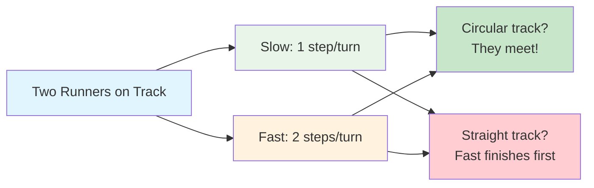

---

## 🏆 Mastery Checklist

- [ ] ✅ Understand linked list structure and traversal
- [ ] ✅ Master the two-pointer technique
- [ ] ✅ Explain Floyd's algorithm clearly
- [ ] ✅ Handle edge cases (empty, single node)
- [ ] ✅ Understand why fast catches slow in a cycle
- [ ] ✅ Solve in O(n) time and O(1) space
- [ ] ✅ Implement without bugs on first try
- [ ] ✅ Answer interview questions confidently
- [ ] ✅ Explain the mathematical proof
- [ ] ✅ Apply pattern to similar problems

---

## 💡 Pro Tips

1. **🛡️ Edge Case First**: Always check for NULL or single node before algorithm
2. **🔍 Pointer Safety**: Check both `fast` and `fast->next` to avoid crashes
3. **🧪 Test Thoroughly**: Include empty list, single node, self-loop cases
4. **📚 Learn the Pattern**: Two-pointer technique appears in MANY problems
5. **🎯 Visualize**: Draw the list and trace pointer movements step-by-step
6. **💼 Interview Ready**: Be able to explain WHY it works, not just HOW
7. **🔄 Practice Variants**: Try finding cycle start, cycle length, etc.
8. **⚡ Recognize Pattern**: Whenever you see linked list + cycle/middle/Nth node → think two pointers!

---

## 🌟 Advanced Insights

### 🔬 Why Two Speeds Work

The key insight is that if there's a cycle, the relative speed difference guarantees a meeting:

```
In each iteration inside the cycle:
- Fast gains 1 position on slow
- Gap decreases by 1
- Eventually gap = 0 → they meet!

It's impossible for fast to "jump over" slow with speed difference of 1.
```

### 🎓 Mathematical Elegance

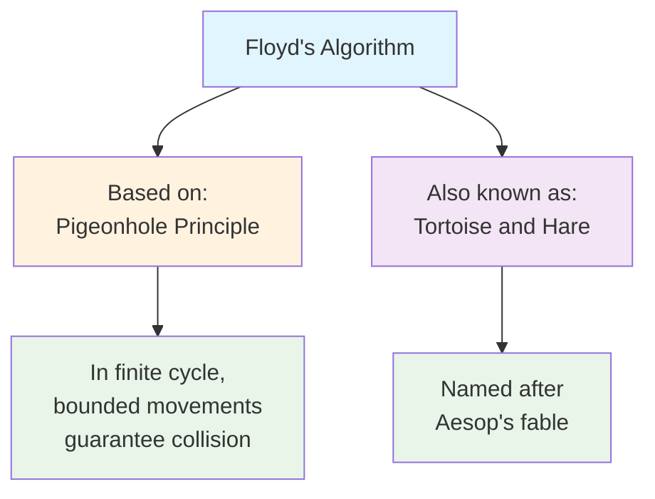

### 🚀 Real-World Applications

1. **Operating Systems**: Detecting deadlocks in resource allocation graphs
2. **Compilers**: Finding infinite loops in code analysis
3. **Networks**: Detecting routing loops
4. **Cryptography**: Finding cycles in pseudo-random generators
5. **Game Development**: Detecting infinite loops in AI pathfinding

---

## 🎉 Congratulations!

You now have a **complete understanding** of:
- ✅ Floyd's Cycle Detection Algorithm
- ✅ Two-Pointer Technique
- ✅ Linked List Manipulation
- ✅ O(n) time and O(1) space optimization
- ✅ Mathematical proof and intuition
- ✅ Interview-ready explanations

**Next Steps:**
1. Solve the problem independently
2. Try LeetCode 142 (Find cycle start)
3. Practice on similar two-pointer problems
4. Teach the concept to someone else (best way to master it!)

**Keep coding and happy learning! 🚀**